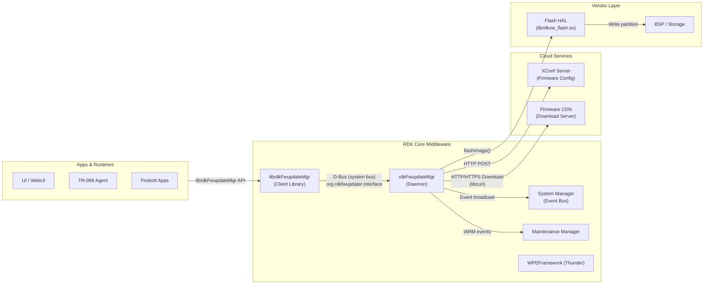
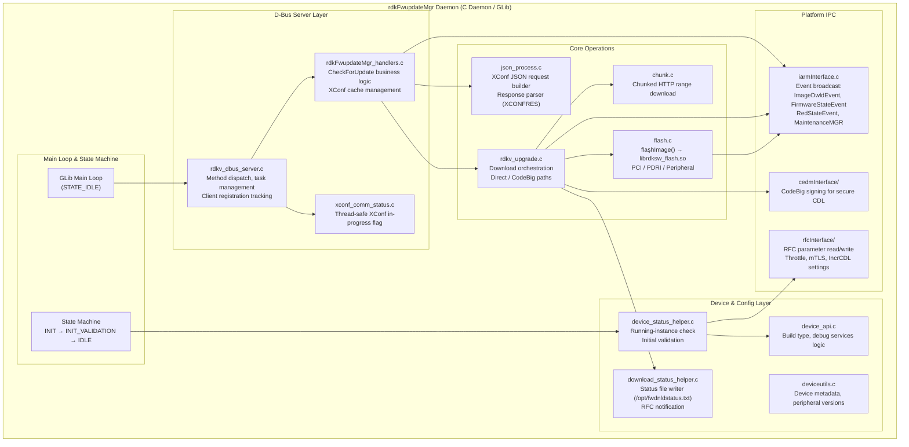
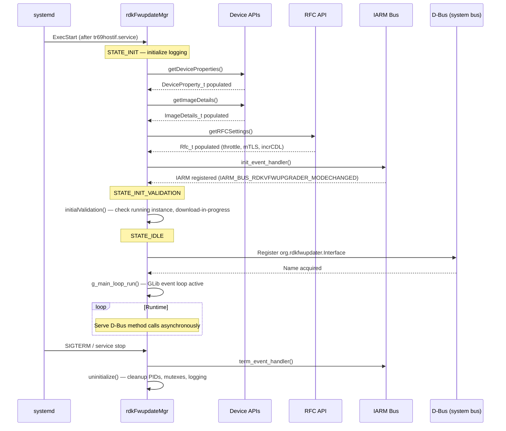
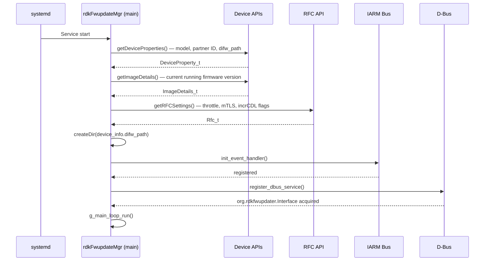
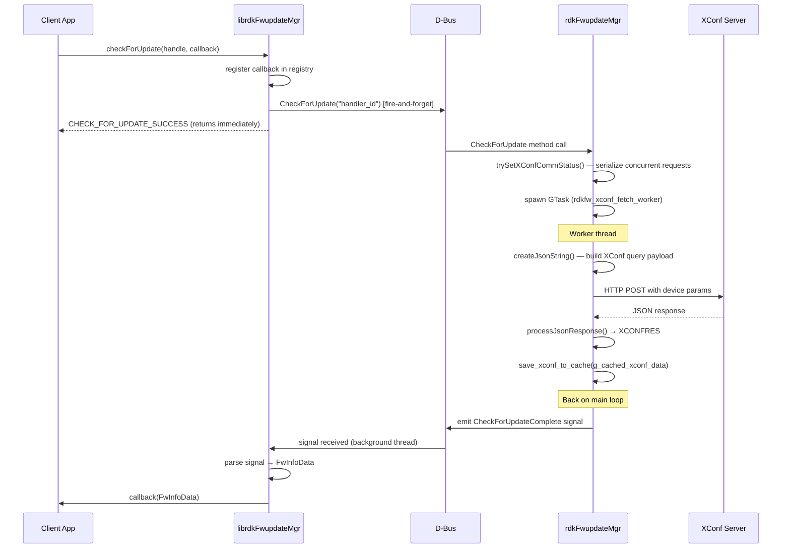
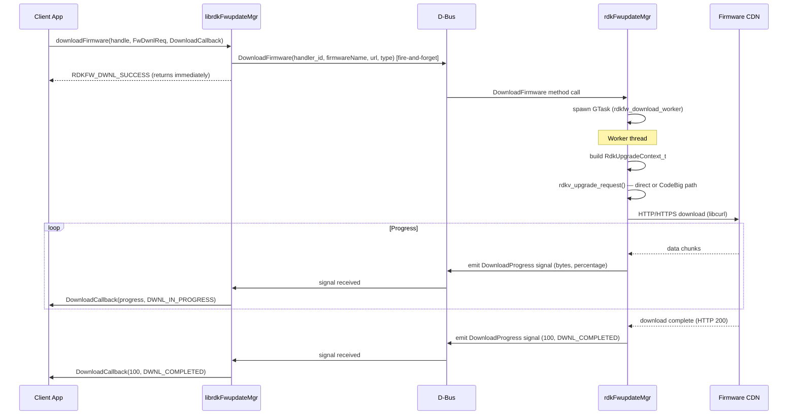
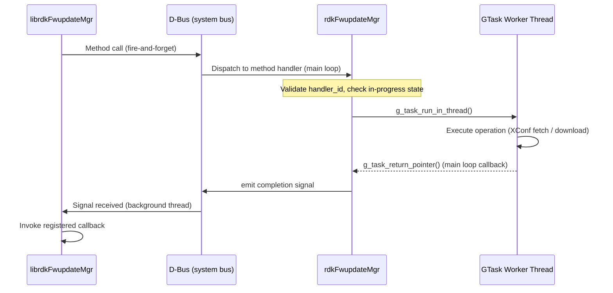
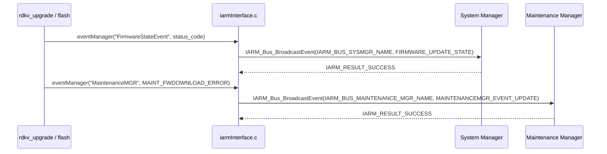

# RDK Firmware Update Manager (rdkFwupdateMgr)

The RDK Firmware Update Manager (`rdkFwupdateMgr`) is a system-level daemon responsible for managing the complete firmware lifecycle on RDK-based video devices. It handles firmware availability checks against the XConf configuration server, download of firmware images over HTTP/HTTPS, flashing of images to device storage, and coordination of post-flash reboots. The daemon exposes its functionality over D-Bus to client applications that require firmware management services, ensuring all operations are handled centrally and consistently. It integrates with the RDK platform's event broadcasting mechanism to report download and firmware state transitions to other system services.

The component is structured as a long-running daemon launched as a systemd service. It initializes device information, sets up the D-Bus service interface, and enters a GLib main loop to process incoming client requests asynchronously. A companion shared library, `librdkFwupdateMgr`, abstracts the D-Bus protocol and provides a stable C API for client applications, removing the need for clients to handle D-Bus connection management, threading, or protocol details.

At the module level, the daemon manages firmware update state through a defined state machine (`STATE_INIT` → `STATE_INIT_VALIDATION` → `STATE_IDLE`), where all D-Bus client requests are served during the `STATE_IDLE` operational state. Background GLib tasks are used to execute long-running operations such as XConf queries and firmware downloads without blocking the D-Bus event loop.



**Key Features & Responsibilities:**

- **XConf-Based Firmware Discovery**: The daemon constructs a query containing device model, firmware version, MAC address, and environment parameters, sends it to the XConf server as an HTTP POST, and parses the JSON response to determine if a newer firmware version is available.

- **D-Bus Service Interface**: A GDBus-based service is registered on the system bus under `org.rdkfwupdater.Interface`. It exposes methods (`RegisterProcess`, `UnregisterProcess`, `CheckForUpdate`, `DownloadFirmware`, `UpdateFirmware`) and emits signals (`CheckForUpdateComplete`, `DownloadProgress`, `UpdateProgress`) for asynchronous operation results.

- **Client Library Abstraction**: The companion `librdkFwupdateMgr` shared library provides a stable five-function C API (`registerProcess`, `checkForUpdate`, `downloadFirmware`, `updateFirmware`, `unregisterProcess`), shielding clients from D-Bus protocol details and threading complexity.

- **Chunked Firmware Download**: Firmware images are downloaded over HTTP/HTTPS using libcurl with support for chunked (range-based) resumable transfers. The download can be throttled based on RFC-controlled speed limits when the device transitions to a background application mode.

- **Firmware Flash Coordination**: After successful download, the firmware image is flashed to device storage via `flashImage()`. PCI (main firmware), PDRI (platform-specific), and peripheral (remote control accessories) upgrade types are each handled with separate control paths.

- **RFC-Driven Runtime Configuration**: Operational behavior is governed by RFC parameters fetched at startup, including download throttling enablement (`SWDLSpLimit.Enable`), maximum download speed (`SWDLSpLimit.TopSpeed`), incremental CDL mode (`IncrementalCDL.Enable`), and mutual TLS enablement (`mTlsXConfDownload.Enable`).

- **Event Broadcasting**: Firmware download and state transition events (`ImageDwldEvent`, `FirmwareStateEvent`, `RedStateEvent`) are broadcast to the platform event bus so other system services can track firmware progress without polling.

- **Maintenance Manager Integration**: When the Maintenance Manager is enabled, the daemon queries the current maintenance mode before initiating downloads and reports firmware download status events to allow coordinated scheduling of maintenance operations.

- **State Red Recovery**: The daemon detects and handles the state-red condition (a device recovery mode), adjusting the firmware acquisition path accordingly when the device enters this state.

---

## Design

The daemon is designed around a central GLib main loop that drives both D-Bus method dispatch and asynchronous task management. At startup, the daemon progresses through a fixed state machine — initializing logging, loading device properties and RFC settings, validating the current device state, then entering the `STATE_IDLE` loop. All long-running operations (XConf queries, firmware downloads) are offloaded to GLib `GTask` worker threads to prevent blocking the D-Bus event loop. Results are returned to clients by emitting D-Bus signals from the main loop once the worker threads complete.

The northbound interface is D-Bus: client applications interact exclusively through the `org.rdkfwupdater.Interface` service, either directly or via `librdkFwupdateMgr`. The library abstracts the fire-and-forget async protocol — each API call creates an ephemeral D-Bus connection, sends the method, and returns immediately; the library's single background thread listens for completion signals and dispatches the caller's registered callback.

The southbound interface is dual-path: XConf and CDN servers are accessed via libcurl over HTTP/HTTPS, and the flash HAL (`librdksw_flash.so`) is called directly via `flashImage()` to write firmware to storage. Device properties and system configuration are read from platform-provided APIs (`getDeviceProperties`, `getImageDetails`), and RFC parameters are read via the `rfcapi` interface.

State persistence is minimal and file-based. The firmware download status file (`/opt/fwdnldstatus.txt`) is written after each state change and serves as the persistent record of the last download outcome. PID files (`/tmp/.curl.pid`, `/tmp/.fwdnld.pid`) track active download processes. An in-memory XConf response cache (`g_cached_xconf_data`) avoids repeated server queries within a single session.

The concurrent-access model enforces a system-wide limit of one active `CheckForUpdate` or `DownloadFirmware` operation at a time. Additional client requests during an in-progress operation are queued using a waiting-client list; they receive progress and completion signals when the current operation finishes, effectively piggybacking on an already-running task. Access to shared state between the main loop and worker threads is protected by `GMutex` instances.



### Threading Model

- **Threading Architecture**: Multi-threaded — main GLib event loop thread plus GTask worker threads per async operation.
- **Main Thread**: Runs the GLib main loop. Handles D-Bus method calls (RegisterProcess, UnregisterProcess), dispatches async tasks, and processes G_IDLE callbacks for signal emission.
- **Worker Threads**:
  - _XConf fetch worker_ (`rdkfw_xconf_fetch_worker`): Executes the HTTP XConf query and JSON parsing. Created per `CheckForUpdate` request via `GTask`.
  - _Download worker_ (`rdkfw_download_worker`): Manages the full firmware download sequence including direct and CodeBig paths. Created per `DownloadFirmware` request via `GTask`.
  - _Progress monitor_ (`rdkfw_emit_download_progress`): A GLib idle-based periodic emitter that reads download byte counters from the active curl handle and emits `DownloadProgress` D-Bus signals.
- **Synchronization**: `GMutex` protects the global XConf data cache (`g_xconf_data_cache`), the XConf in-progress status (`xconf_comm_status`), the download state (`mutuex_dwnl_state`), and the application mode state (`app_mode_status`). `GHashTable` with GLib's built-in reference counting is used for client registration tracking.
- **Async / Event Dispatch**: Worker threads complete their operations and invoke `g_task_return_*` to signal completion. The GLib main loop calls the corresponding `_done` callbacks (e.g., `rdkfw_xconf_fetch_done`), which emit D-Bus signals to registered clients.

### RDK-V Platform and Integration Requirements

- **Build Dependencies**: `cjson`, `libcurl`, `glib-2.0`, `gio-2.0`, `rbus`, `rdk-logger`, `telemetry` (t2api), `rfcapi`, `iarmbus`, `iarmmgrs`, `dbus`, `safec-common-wrapper`, `commonutilities`, `libsyswrapper`.
- **Service Dependencies**: The `rdkFwupdateMgr` systemd service requires `tr69hostif.service` to be active before the daemon starts.
- **IARM Bus**: Registers under `RdkvFWupgrader`. Broadcasts to `IARM_BUS_SYSMGR_NAME` for system state events (`IARM_BUS_SYSMGR_SYSSTATE_FIRMWARE_DWNLD`, `IARM_BUS_SYSMGR_SYSSTATE_FIRMWARE_UPDATE_STATE`), and to `IARM_BUS_MAINTENANCE_MGR_NAME` when Maintenance Manager support is enabled. Subscribes to `IARM_BUS_RDKVFWUPGRADER_MODECHANGED` to receive foreground/background mode transitions.
- **Systemd Services**: `tr69hostif.service` and `dbus.service` are declared as startup prerequisites for this service.
- **Configuration Files**: `/etc/device.properties` (device model, firmware path, partner ID); `/opt/fwdnldstatus.txt` (download status persistence).
- **Startup Order**: The service is wanted by `ntp-time-sync.target` and declared after `tr69hostif.service`.

---

### Component State Flow

#### Initialization to Active State

The daemon progresses through a fixed state machine at startup. `STATE_INIT` covers logging initialization, loading of device properties via `getDeviceProperties()` and `getImageDetails()`, RFC parameter retrieval via `getRFCSettings()`, and IARM bus registration. `STATE_INIT_VALIDATION` performs initial validation including duplicate-instance checks and download-in-progress detection. Once validation passes, the daemon registers the D-Bus service and enters `STATE_IDLE`, where the GLib main loop runs and all client requests are processed.



#### Runtime State Changes

During normal operation, the daemon remains in `STATE_IDLE` and serves all firmware operations via D-Bus. The IARM event handler monitors for foreground/background mode changes and adjusts the active download speed limit in response.

**State Change Triggers:**

- When `IARM_BUS_RDKVFWUPGRADER_MODECHANGED` is received with `app_mode = 0` (background), the daemon reads `RFC_TOPSPEED`; if the throttle speed is zero, the active download is stopped and a failure event is broadcast. If the speed is non-zero, the download rate is adjusted via the curl handle.
- When `SIGUSR1` is received, `force_exit` is set, the active curl download is stopped, and failure events are broadcast to IARM and the Maintenance Manager.

**Context Switching Scenarios:**

- If the Maintenance Manager reports `BACKGROUND` mode during daemon initialization, `setAppMode(0)` is called to configure the initial application mode before any download starts.
- If the XConf cache is valid from a previous `CheckForUpdate` call, a subsequent `DownloadFirmware` call reads directly from the in-memory cache (`g_cached_xconf_data`) without re-querying the XConf server.

---

### Call Flows

#### Initialization Call Flow



#### CheckForUpdate Call Flow



#### DownloadFirmware Call Flow



---

## Internal Modules

| Module / Class            | Description                                                                                                                                                                                                                                                                               | Key Files                                                                                                                                                                                           |
| ------------------------- | ----------------------------------------------------------------------------------------------------------------------------------------------------------------------------------------------------------------------------------------------------------------------------------------- | --------------------------------------------------------------------------------------------------------------------------------------------------------------------------------------------------- |
| `rdkFwupdateMgr`          | Daemon entry point and state machine. Manages initialization sequence, GLib main loop, signal handling, and top-level peripheral firmware download orchestration.                                                                                                                         | `src/rdkFwupdateMgr.c`, `src/rdkv_main.c`                                                                                                                                                           |
| `rdkv_dbus_server`        | D-Bus server layer. Registers the `org.rdkfwupdater.Interface` service, dispatches D-Bus method calls, manages client process registration in a `GHashTable`, and launches GTask workers for async operations.                                                                            | `src/dbus/rdkv_dbus_server.c`, `src/dbus/rdkv_dbus_server.h`                                                                                                                                        |
| `rdkFwupdateMgr_handlers` | Business logic for `CheckForUpdate`. Builds XConf query parameters, communicates with the XConf server, parses JSON responses into `XCONFRES`, manages the global in-memory XConf response cache, and validates firmware version against device model.                                    | `src/dbus/rdkFwupdateMgr_handlers.c`, `src/dbus/rdkFwupdateMgr_handlers.h`                                                                                                                          |
| `xconf_comm_status`       | Thread-safe flag tracking whether an XConf fetch is currently in progress. Serializes concurrent XConf requests so that one query runs at a time.                                                                                                                                         | `src/dbus/xconf_comm_status.c`, `src/dbus/xconf_comm_status.h`                                                                                                                                      |
| `rdkv_upgrade`            | Download orchestration. Implements `rdkv_upgrade_request()` which selects the direct or CodeBig download path, sets up `RdkUpgradeContext_t`, manages the curl handle lifecycle, and invokes `flashImage()` after download completes for full upgrade operations.                         | `src/rdkv_upgrade.c`, `src/include/rdkv_upgrade.h`                                                                                                                                                  |
| `chunk`                   | Chunked (HTTP range) download support. Reads prior download progress from the firmware file and HTTP header cache file, then resumes a partial download using `Content-Length` and range requests.                                                                                        | `src/chunk.c`                                                                                                                                                                                       |
| `flash`                   | Firmware flash coordination. Implements `flashImage()` which calls the `librdksw_flash.so` HAL to write PCI, PDRI, or peripheral firmware images to the appropriate storage partition and manages post-flash actions.                                                                     | `src/flash.c`, `src/include/flash.h`                                                                                                                                                                |
| `json_process`            | XConf request builder and response processor. Assembles the HTTP POST body from device properties (MAC address, firmware version, model, partner ID) and parses the XConf JSON response into `XCONFRES`.                                                                                  | `src/json_process.c`, `src/include/json_process.h`                                                                                                                                                  |
| `iarmInterface`           | Platform event integration. Implements `eventManager()` to broadcast `ImageDwldEvent`, `FirmwareStateEvent`, and `RedStateEvent` to the system event bus. Subscribes to the foreground/background mode change event to control download throttling.                                       | `src/iarmInterface/iarmInterface.c`, `src/include/iarmInterface.h`                                                                                                                                  |
| `rfcInterface`            | RFC parameter access. Reads and writes RFC values for throttle enablement, top speed, incremental CDL, and mTLS XConf download settings.                                                                                                                                                  | `src/rfcInterface/`, `src/include/rfcinterface.h`                                                                                                                                                   |
| `deviceutils`             | Device metadata utilities. Provides peripheral version queries, bundle certificate path resolution, and helper functions for building XConf query parameters such as remote control firmware versions.                                                                                    | `src/deviceutils/deviceutils.c`, `src/deviceutils/deviceutils.h`                                                                                                                                    |
| `device_api`              | Device property helpers. Provides build type resolution (`ePROD`, `eVBN`, etc.), debug services enablement check via RFC, and labsigned image detection. Receives device configuration data from platform APIs.                                                                           | `src/deviceutils/device_api.c`, `src/deviceutils/device_api.h`                                                                                                                                      |
| `device_status_helper`    | Device state validation. Checks for already-running firmware download instances, performs initial validation of device readiness, and reads opt-out configuration.                                                                                                                        | `src/device_status_helper.c`, `src/include/device_status_helper.h`                                                                                                                                  |
| `download_status_helper`  | Firmware download status persistence. Writes download state information to `/opt/fwdnldstatus.txt` and notifies download status changes via the RFC write path.                                                                                                                           | `src/download_status_helper.c`, `src/include/download_status_helper.h`                                                                                                                              |
| `cedmInterface`           | CodeBig signing utilities. Implements `doCodeBigSigning()` to generate authorization signatures required for firmware downloads via the CodeBig proxy server.                                                                                                                             | `src/cedmInterface/codebigUtils.c`, `src/cedmInterface/mtlsUtils.c`                                                                                                                                 |
| `librdkFwupdateMgr`       | Client-facing shared library. Provides the public C API (`registerProcess`, `checkForUpdate`, `downloadFirmware`, `updateFirmware`, `unregisterProcess`), manages D-Bus client connections, runs the background signal-reception thread, and dispatches results via registered callbacks. | `librdkFwupdateMgr/src/rdkFwupdateMgr_api.c`, `librdkFwupdateMgr/src/rdkFwupdateMgr_async.c`, `librdkFwupdateMgr/src/rdkFwupdateMgr_process.c`, `librdkFwupdateMgr/include/rdkFwupdateMgr_client.h` |

---

---

## Component Interactions

### Interaction Matrix

| Target Component / Layer        | Interaction Purpose                                                                       | Key APIs / Topics                                                                                                                                                            |
| ------------------------------- | ----------------------------------------------------------------------------------------- | ---------------------------------------------------------------------------------------------------------------------------------------------------------------------------- |
| **Cloud Services**              |                                                                                           |                                                                                                                                                                              |
| XConf Server                    | Firmware availability query — HTTP POST with device identity and current firmware version | `createJsonString()`, `getJsonRpc()`                                                                                                                                         |
| Firmware CDN                    | Firmware image download over HTTP/HTTPS                                                   | `rdkv_upgrade_request()`, `downloadFile()`, `codebigdownloadFile()`, libcurl                                                                                                 |
| **Platform IPC**                |                                                                                           |                                                                                                                                                                              |
| System Manager (IARM)           | Broadcast download and firmware state transitions to platform event subscribers           | `IARM_Bus_BroadcastEvent()` — `IARM_BUS_SYSMGR_SYSSTATE_FIRMWARE_DWNLD`, `IARM_BUS_SYSMGR_SYSSTATE_FIRMWARE_UPDATE_STATE`, `IARM_BUS_SYSMGR_SYSSTATE_RED_RECOV_UPDATE_STATE` |
| Maintenance Manager (IARM)      | Report firmware download module status for maintenance window coordination                | `IARM_Bus_BroadcastEvent()` — `IARM_BUS_MAINTENANCEMGR_EVENT_UPDATE`                                                                                                         |
| Application Mode Source (IARM)  | Receive foreground/background transitions to control download speed                       | `IARM_BUS_RDKVFWUPGRADER_MODECHANGED`                                                                                                                                        |
| RFC API                         | Read runtime configuration parameters; write download status notifications                | `getRFCSettings()`, `read_RFCProperty()`, `write_RFCProperty()` — `Device.DeviceInfo.X_RDKCENTRAL-COM_RFC.*`                                                                 |
| **HAL / Libraries**             |                                                                                           |                                                                                                                                                                              |
| Flash HAL (`librdksw_flash.so`) | Write firmware image to device storage partition                                          | `flashImage()`                                                                                                                                                               |
| libcurl                         | HTTP/HTTPS communication for XConf queries and firmware downloads                         | `doHttpFileDownload()`, `doInteruptDwnl()`, `doGetDwnlBytes()`, `doStopDownload()`                                                                                           |
| D-Bus (system bus)              | Expose firmware management service to client applications                                 | `org.rdkfwupdater.Interface` on `org.rdkfwupdater.Service`                                                                                                                   |
| **Client Applications**         |                                                                                           |                                                                                                                                                                              |
| `librdkFwupdateMgr` consumers   | Provide firmware lifecycle APIs to TR-069 agents, UI services, and monitoring daemons     | `registerProcess()`, `checkForUpdate()`, `downloadFirmware()`, `updateFirmware()`, `unregisterProcess()`                                                                     |

### Events Published

| Event Name                | IARM / D-Bus Topic                                | Trigger Condition                                                         | Subscriber Components                 |
| ------------------------- | ------------------------------------------------- | ------------------------------------------------------------------------- | ------------------------------------- |
| `ImageDwldEvent`          | `IARM_BUS_SYSMGR_SYSSTATE_FIRMWARE_DWNLD`         | Firmware download state changes                                           | System Manager subscribers            |
| `FirmwareStateEvent`      | `IARM_BUS_SYSMGR_SYSSTATE_FIRMWARE_UPDATE_STATE`  | Firmware update state changes (started, completed, failed)                | System Manager subscribers            |
| `RedStateEvent`           | `IARM_BUS_SYSMGR_SYSSTATE_RED_RECOV_UPDATE_STATE` | Device enters or exits state-red recovery                                 | System Manager subscribers            |
| Maintenance module status | `IARM_BUS_MAINTENANCEMGR_EVENT_UPDATE`            | Download starts, completes, or errors when Maintenance Manager is enabled | Maintenance Manager                   |
| `CheckForUpdateComplete`  | D-Bus signal on `org.rdkfwupdater.Interface`      | XConf query worker thread completes                                       | `librdkFwupdateMgr` background thread |
| `DownloadProgress`        | D-Bus signal on `org.rdkfwupdater.Interface`      | Download bytes progress, completion, or error                             | `librdkFwupdateMgr` background thread |
| `UpdateProgress`          | D-Bus signal on `org.rdkfwupdater.Interface`      | Flash progress, completion, or error                                      | `librdkFwupdateMgr` background thread |

### IPC Flow Patterns

**D-Bus Request / Response Flow:**



**IARM Event Notification Flow:**



---

## Implementation Details

### Major HAL APIs Integration

| HAL / Library API           | Purpose                                                                                                   | Implementation File                 |
| --------------------------- | --------------------------------------------------------------------------------------------------------- | ----------------------------------- |
| `flashImage()`              | Writes a downloaded firmware image (PCI, PDRI, or peripheral) to the appropriate device storage partition | `src/flash.c`                       |
| `doHttpFileDownload()`      | Performs HTTP/HTTPS file download using libcurl with configurable speed limit and mTLS credentials        | `src/rdkv_upgrade.c`                |
| `chunkDownload()`           | Resumes a partial firmware download using HTTP range requests                                             | `src/chunk.c`                       |
| `doInteruptDwnl()`          | Pauses or resumes an active curl download with a new speed cap                                            | `src/rdkFwupdateMgr.c`              |
| `doStopDownload()`          | Stops and releases an active curl download session                                                        | `src/rdkFwupdateMgr.c`              |
| `doGetDwnlBytes()`          | Reads the number of bytes downloaded so far from the active curl handle                                   | `src/rdkFwupdateMgr.c`              |
| `getDeviceProperties()`     | Reads device model, partner ID, serial number, and firmware storage path from the platform                | `src/rdkFwupdateMgr.c`              |
| `getImageDetails()`         | Reads the currently running firmware version and image name                                               | `src/rdkFwupdateMgr.c`              |
| `IARM_Bus_BroadcastEvent()` | Publishes firmware download and state events to platform event subscribers                                | `src/iarmInterface/iarmInterface.c` |
| `IARM_Bus_Call()`           | Sends peripheral firmware update notification to the control manager                                      | `src/iarmInterface/iarmInterface.c` |

### Key Implementation Logic

- **State / Lifecycle Management**: The daemon state is tracked by the `FwUpgraderState` enum. `STATE_INIT` and `STATE_INIT_VALIDATION` are transient; `STATE_IDLE` is the permanent operational state. State transitions occur only during startup. Download state (uninitialized, in-progress, complete, failed, flash in-progress) is tracked by `DwnlState`, protected by `mutuex_dwnl_state`, and updated via `setDwnlState()` / `getDwnlState()`.
  - Core state machine: `src/rdkFwupdateMgr.c`
  - Download state: `src/rdkFwupdateMgr.c`, `src/include/rdkv_cdl.h`

- **XConf Cache**: The in-memory XConf cache (`g_cached_xconf_data` in `rdkFwupdateMgr_handlers.c`) stores the most recent parsed XConf response. It is written by `save_xconf_to_cache()` after a successful query and read by `get_cached_xconf_data()` for subsequent `DownloadFirmware` calls. Access is protected by `g_xconf_data_cache` mutex. The cache is refreshed after each successful new query and cleared when an error occurs.

- **Event Processing**: IARM events for mode changes are received in `DwnlStopEventHandler()`, which calls `interuptDwnl()` to adjust the active download speed or stop it if the throttle speed is zero. D-Bus method call dispatch occurs on the GLib main loop thread; long operations are handed off to `GTask` worker threads immediately to avoid blocking.

- **Error Handling Strategy**: Library-specific errors from `rdkv_upgrade_request()` return negative error codes (`RDKV_UPGRADE_ERROR_THROTTLE_ZERO`, `RDKV_UPGRADE_ERROR_FORCE_EXIT`); curl errors return positive values. The daemon logs each error condition, broadcasts failure events to IARM and the Maintenance Manager, and resumes normal operation. The `rdkv_upgrade_strerror()` function maps error codes to human-readable strings for logging.

- **Logging & Diagnostics**: Logging uses the `SWLOG_INFO` / `SWLOG_ERROR` macros backed by RDK Logger when `RDK_LOGGER` is defined. T2 telemetry markers are emitted via `t2CountNotify()` and `t2ValNotify()` when `T2_EVENT_ENABLED` is defined at build time. The log output is directed to `/opt/logs/swupdate.log` as configured in the systemd service file.

---

## Configuration

### Key Configuration Files

| Configuration File       | Purpose                                                                                                                            | Override Mechanism                                         |
| ------------------------ | ---------------------------------------------------------------------------------------------------------------------------------- | ---------------------------------------------------------- |
| `/etc/device.properties` | Device model, MAC address, partner ID, firmware storage path, build type, and other device identity fields                         | Platform-provided; read-only at runtime                    |
| `/opt/fwdnldstatus.txt`  | Persistent firmware download status record (method, protocol, download state, reboot flag, failure reason, version, URL, last run) | Written by `updateFWDownloadStatus()` on each state change |
| `softwareoptout` file    | Opt-out status for firmware updates; contains `IGNORE_UPDATE` or `ENFORCE_OPTOUT` value                                            | Platform-managed; read by `getOPTOUTValue()`               |

### Runtime Cache Files

These files are written at runtime and are not configuration inputs. They are session-scoped and are refreshed or re-created by the daemon during normal operation.

| Cache File                        | Purpose                                                                                                                                                            |
| --------------------------------- | ------------------------------------------------------------------------------------------------------------------------------------------------------------------ |
| `/tmp/xconf_response_thunder.txt` | Cached raw XConf server HTTP response body; written after a successful XConf query and read by subsequent `DownloadFirmware` calls to avoid re-querying the server |
| `/tmp/xconf_httpcode_thunder.txt` | Cached HTTP response code from the last XConf query; written alongside the response body cache                                                                     |

### Key Configuration Parameters

| Parameter                                                                      | Type | Default | Description                                                |
| ------------------------------------------------------------------------------ | ---- | ------- | ---------------------------------------------------------- |
| `Device.DeviceInfo.X_RDKCENTRAL-COM_RFC.Feature.SWDLSpLimit.Enable`            | bool | `false` | Enables download speed throttling                          |
| `Device.DeviceInfo.X_RDKCENTRAL-COM_RFC.Feature.SWDLSpLimit.TopSpeed`          | uint | `0`     | Maximum download speed in bytes/second (0 = unlimited)     |
| `Device.DeviceInfo.X_RDKCENTRAL-COM_RFC.Feature.IncrementalCDL.Enable`         | bool | `false` | Enables incremental (delta) firmware download              |
| `Device.DeviceInfo.X_RDKCENTRAL-COM_RFC.Feature.MTLS.mTlsXConfDownload.Enable` | bool | `false` | Enables mutual TLS for XConf server communication          |
| `Device.DeviceInfo.X_RDKCENTRAL-COM_RFC.Feature.FWUpdate.AutoExcluded.Enable`  | bool | `false` | Enables the auto-exclude firmware update opt-out mechanism |
| `Device.DeviceInfo.X_RDKCENTRAL-COM_RFC.Feature.RedRecovery.Status`            | bool | `false` | Enables state-red recovery firmware acquisition path       |

### Runtime Configuration

Most RFC parameters are read at daemon startup via `getRFCSettings()` and apply to all operations in that session; changes to those values via platform tooling take effect on the next daemon start. However, `SWDLSpLimit.TopSpeed` (the download speed cap) is an exception — it is re-read at runtime whenever the `iarmInterface` receives an `IARM_BUS_RDKVFWUPGRADER_MODECHANGED` event, so a throttle speed change takes effect on the next foreground/background mode transition without a restart.

Example — updating an RFC parameter via platform tooling:

```bash
# Example: update download speed throttling setting
rfcSet Device.DeviceInfo.X_RDKCENTRAL-COM_RFC.Feature.SWDLSpLimit.Enable true
```

### Configuration Persistence

The download status (`/opt/fwdnldstatus.txt`) is persisted across download operations and survives process restarts. RFC parameter values are managed by the platform RFC service and are persistent across reboots. XConf response cache files under `/tmp/` are session-scoped and are refreshed at each daemon startup. The previous flashed image filename is persisted at `/opt/cdl_flashed_file_name` by the flash module.
