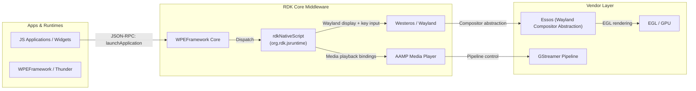
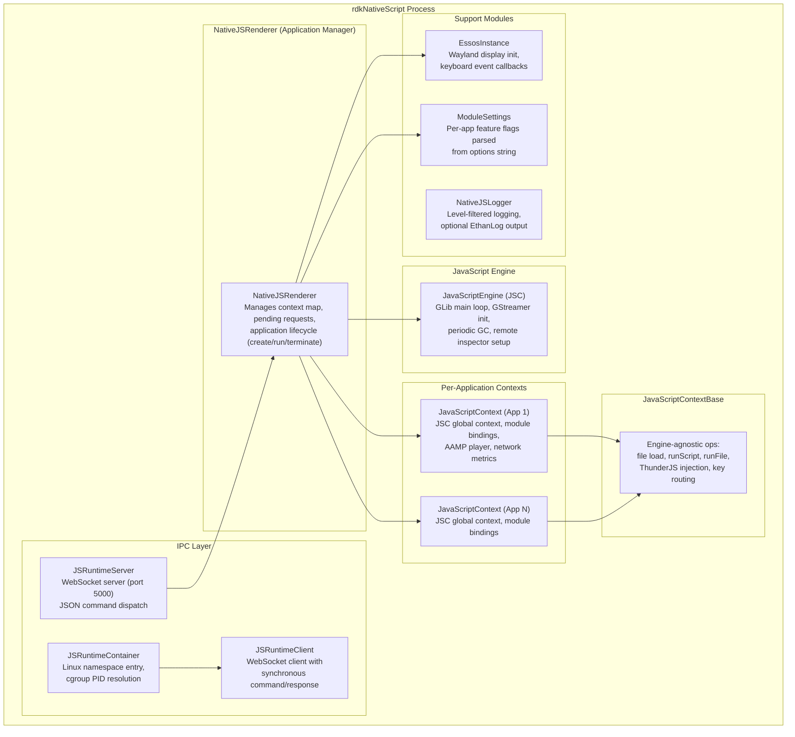
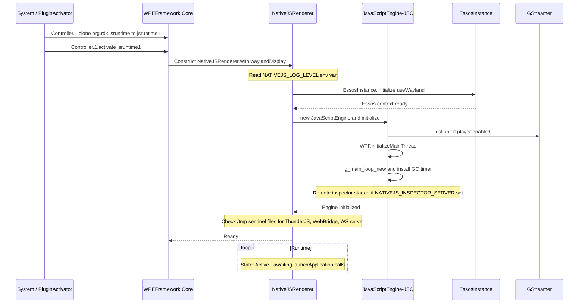
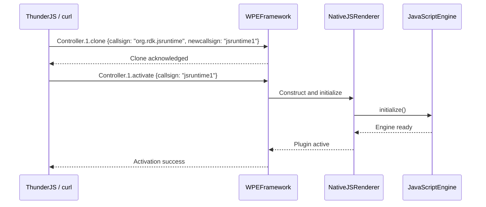
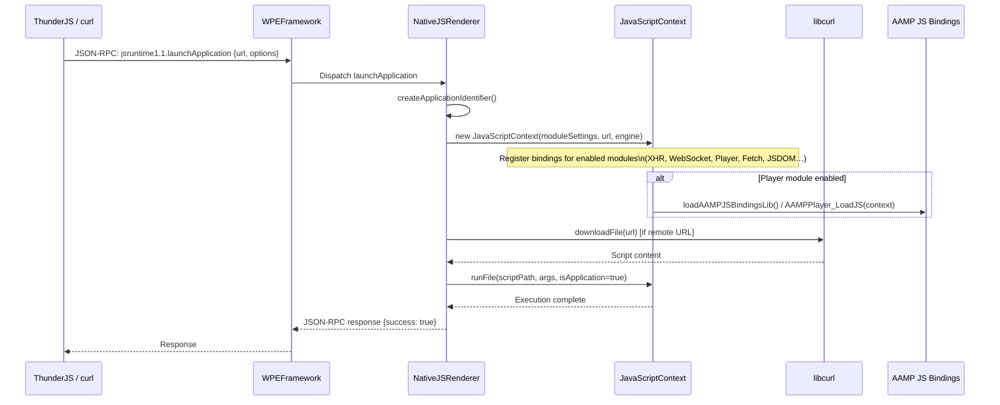
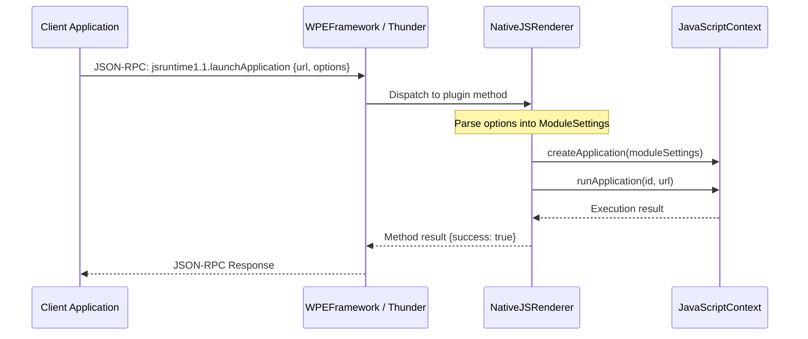
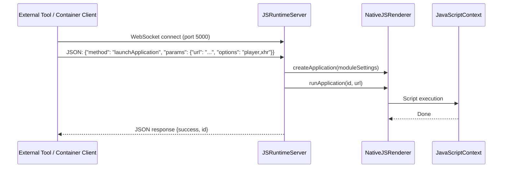

# RdkNativeScript

rdkNativeScript is a JavaScript runtime component in the RDK middleware that enables native execution of JavaScript applications directly on RDK-V devices, outside of a full browser environment. It provides a lightweight, embeddable runtime that exposes device capabilities — such as media playback, networking, and display — to JavaScript applications through a set of controlled API bindings. The component is deployed as a WPEFramework (Thunder) plugin with the callsign `org.rdk.jsruntime` and can be cloned to create multiple independent runtime instances.

At the device level, rdkNativeScript allows non-browser JavaScript applications such as lightweight widgets and streaming clients to run with native-level access to media pipelines, WebSocket communication, and the Wayland display stack. It bridges the gap between JavaScript application logic and low-level device capabilities without requiring a full web engine.

At the module level, rdkNativeScript manages the complete lifecycle of JavaScript execution contexts: it initializes the JavaScript engine, creates per-application contexts, loads and evaluates scripts (from local paths or remote URLs), manages optional module bindings per context, and provides a WebSocket-based IPC channel for external control.



**Key Features & Responsibilities:**

- **Multi-context JavaScript Execution**: Hosts multiple independent JavaScript application contexts within a single process. Each application receives its own JSC global context with its own module bindings, allowing widgets and lightweight apps to run concurrently without interference.

- **Engine Abstraction**: Decouples the application runtime from the underlying JavaScript engine through the `IJavaScriptEngine` and `IJavaScriptContext` interfaces. The primary engine is JavaScriptCore (JSC); the build system also supports QuickJS as an alternate engine.

- **Per-Application Module Configuration**: Each application context is configured at creation time with a set of optional module bindings. Supported modules include HTTP, XHR, WebSocket, WebSocketEnhanced, Fetch, JSDOM, MiniJSDOM, Window, and media Player. Modules are activated by passing an options string to `launchApplication`.

- **AAMP Media Player Integration**: Exposes `AAMPMediaPlayer` as a JavaScript global when the player module is enabled. AAMP bindings can be loaded statically at build time or dynamically at runtime, allowing the player library to be decoupled from the runtime binary.

- **WebSocket Server and Client IPC**: Provides an optional WebSocket server (port 5000 by default) that accepts JSON-encoded commands to launch, run, and terminate applications remotely. A corresponding client is also provided for applications that need to connect to the server.

- **Wayland Display and Input Handling**: Integrates with the Essos compositor abstraction layer to set up a Wayland display surface and route keyboard input events from the compositor into the active JavaScript context.

- **Remote JavaScript Inspector**: Optionally starts a JSC remote inspector server to enable JavaScript debugging over a network connection, controlled via the `NATIVEJS_INSPECTOR_SERVER` environment variable.

- **Container Namespace Entry**: Supports running applications inside Linux containers by entering network, mount, IPC, and PID namespaces of a running container process, enabling script delivery over WebSocket to containerized runtime instances.

---

## Design

rdkNativeScript is structured around a layered separation between engine management, context lifecycle, and application dispatch. The runtime is initialized once per process through `NativeJSRenderer`, which owns the `IJavaScriptEngine` instance and manages the map of active application contexts. Each application is represented by a numeric identifier mapped to a `JavaScriptContext` instance. The `JavaScriptContextBase` class provides engine-agnostic operations — file loading, script evaluation delegation, key event routing, and ThunderJS / RDK WebBridge code injection — while engine-specific implementations extend it for JSC or QuickJS.

Northbound, the component exposes its API through the WPEFramework Thunder plugin mechanism: clients issue a JSON-RPC `launchApplication` call to a cloned plugin instance. The server path, when enabled, accepts the same JSON command structure over a WebSocket connection on port 5000, enabling external tooling and testing frameworks to drive the runtime without a Thunder session. The `JSRuntimeServer` dispatches incoming messages to the same `NativeJSRenderer` methods used by the Thunder plugin path. Southbound, the component consumes the JavaScriptCore C API for script evaluation, GStreamer for media pipeline initialization, libcurl for script download from remote URLs, and the Essos API for Wayland compositor setup and keyboard event delivery.

The design isolates per-application state (URL, JS context, module flags, performance metrics) inside `JavaScriptContext` and uses a shared `JSContextGroupRef` across all contexts in the process. This allows garbage collection to be coordinated globally through a periodic GLib timer while individual contexts can be released independently. The main GLib event loop processes both JSC internal events and timer callbacks on the main thread; applications are created and run from separate per-application threads that call into the renderer.

IPC is handled through two mechanisms. Within the device, Thunder JSON-RPC is the primary channel for application control. The WebSocket server and client provide an alternative channel used for remote control and container-bridged delivery. Container-side delivery is implemented in `JSRuntimeContainer`, which reads the container process PID from the cgroup filesystem, enters the container's network namespace using `setns`, and connects a WebSocket client to the in-container server endpoint.

Module settings, application URLs, and runtime flags are held in memory for the lifetime of the process. Runtime configuration is managed through environment variables or sentinel files in `/tmp`.



### Threading Model

- **Threading Architecture**: Multi-threaded with a main GLib event loop thread plus per-application worker threads and an optional WebSocket server thread.
- **Main Thread**: Runs the GLib main loop, which processes JSC internal callbacks, timer events (including the periodic GC timer), and uv event loop ticks. All JSC context creation and evaluation calls issued from the application threads re-enter the engine via the shared context group, with main-thread callbacks posted through `rtThreadQueue`.
- **Worker Threads**:
  - _Application thread_: One thread per launched application calls `renderer->createApplication()` and `renderer->runApplication()`. Evaluation of the script occurs on this thread; the result is surfaced when the script returns or the context is terminated.
  - _Console thread_: When developer console mode is enabled, a dedicated thread processes queued JavaScript snippets submitted interactively.
  - _WebSocket server thread_: When the server is enabled, a detached thread runs `WsServer::run()` to handle incoming WebSocket connections.
  - _Container namespace thread_: A temporary thread is spawned per `nsEnter` call to execute `setns` and perform the namespace-bound operation, then joins immediately.
- **Synchronization**: `NativeJSRenderer` protects the context map with `mUserMutex`. The console state uses `isProcessing_cv` (condition variable + mutex) for producer/consumer coordination of queued scripts. `JSRuntimeServer` protects the connection set with `mDataMutex`. `JSRuntimeClient` uses `mResponseMutex` and `mResponseCondition` with a 5-second wait-for-response timeout.
- **Async / Event Dispatch**: Key events from Essos are dispatched synchronously into the registered `JavaScriptKeyListener` (the active context). Timer callbacks and deferred JS execution are scheduled through the GLib main loop rather than blocking caller threads.

### RDK-V Platform and Integration Requirements

- **Build Dependencies**: westeros, essos, rapidjson, rtcore, libuv, gstreamer1.0, uwebsockets, JavaScriptCore, websocketpp, cjson, boost, virtual/egl. When container widget support is enabled, dobby is additionally required.
- **Plugin Dependencies**: The AAMP media player library (`libaampjsbindings.so`) must be present at the target library path when dynamic AAMP bindings are enabled.
- **Device Services / HAL**: Essos HAL for Wayland compositor abstraction and keyboard input; GStreamer 1.0 for media pipeline initialization.
- **Systemd Services**: A running Wayland compositor (Westeros) must be available when Essos integration is enabled and a display is requested.
- **Configuration Files**: `/tmp/nativejsEmbedThunder` — presence enables ThunderJS embedding. `/tmp/nativejsRdkWebBridge` — presence enables RDK WebBridge embedding. `/tmp/nativejsEnableWebSocketServer` — presence enables the WebSocket server.
- **Startup Order**: The Thunder Controller must be active to clone and activate `org.rdk.jsruntime` instances via JSON-RPC.

---

### Component State Flow

#### Initialization to Active State



#### Runtime State Changes

**State Change Triggers:**

- A `launchApplication` JSON-RPC call (or equivalent WebSocket command) causes `NativeJSRenderer` to allocate a new application ID, create a `JavaScriptContext` with the specified module settings, download the script via libcurl if it is a remote URL, and evaluate it in the context.
- A `terminateApplication` call releases the `JavaScriptContext` for the given ID, runs synchronous garbage collection on the global context if it was the top-level context, and removes the entry from the context map.
- When the Wayland display becomes unavailable while Essos is active, key events from Essos stop being delivered to registered contexts.

**Context Switching Scenarios:**

- When multiple applications are active simultaneously, each holds an independent `JSGlobalContextRef` within the shared `JSContextGroupRef`. Module settings are fixed at context creation time for the lifetime of the application.
- In developer console mode, the console thread continuously reads from a deque of queued scripts and evaluates them in a dedicated console context, separate from launched application contexts.

---

### Call Flows

#### Initialization Call Flow



#### Request Processing Call Flow



---

## Internal Modules

| Module / Class          | Description                                                                                                                                                                                                                                                                                                            | Key Files                                                          |
| ----------------------- | ---------------------------------------------------------------------------------------------------------------------------------------------------------------------------------------------------------------------------------------------------------------------------------------------------------------------- | ------------------------------------------------------------------ |
| `NativeJSRenderer`      | Central application manager. Owns the JavaScript engine instance and the map of active contexts. Exposes `createApplication`, `runApplication`, `runJavaScript`, and `terminateApplication`. Manages pending request queues, Essos initialization, and developer console thread.                                       | `NativeJSRenderer.cpp`, `NativeJSRenderer.h`                       |
| `JavaScriptEngine`      | Concrete JSC engine implementation. Initializes the WTF main thread, GLib event loop, GStreamer pipeline subsystem, remote inspector server, and the periodic garbage collection timer. Implements `IJavaScriptEngine`.                                                                                                | `src/jsc/JavaScriptEngine.cpp`, `include/jsc/JavaScriptEngine.h`   |
| `JavaScriptContext`     | Per-application JSC global context. Registers all enabled module bindings (setTimeout, XHR, WebSocket, HTTP, Fetch, JSDOM, crypto, player). Tracks performance metrics (context creation time, execution time, playback start time) and network metrics via `NetworkMetricsListener`. Implements `IJavaScriptContext`. | `src/jsc/JavaScriptContext.cpp`, `include/jsc/JavaScriptContext.h` |
| `JavaScriptContextBase` | Engine-agnostic base class for JavaScript contexts. Implements file loading, `runScript`, `runFile`, key event routing to the active context, ThunderJS and RDK WebBridge code injection, and module path resolution.                                                                                                  | `src/JavaScriptContextBase.cpp`, `include/JavaScriptContextBase.h` |
| `JSRuntimeServer`       | WebSocket server (singleton) that listens on a configurable port and dispatches JSON-encoded `launchApplication`, `createApplication`, `runApplication`, `runJavaScript`, and `terminateApplication` commands to `NativeJSRenderer`. Uses websocketpp with Asio transport.                                             | `src/JSRuntimeServer.cpp`, `include/JSRuntimeServer.h`             |
| `JSRuntimeClient`       | WebSocket client (singleton) that connects to a `JSRuntimeServer` instance and provides a synchronous `sendCommand` interface with a 5-second response timeout. Used by `JSRuntimeContainer` to relay launch commands into a container.                                                                                | `src/JSRuntimeClient.cpp`, `include/JSRuntimeClient.h`             |
| `JSRuntimeContainer`    | Provides utilities for entering Linux namespaces (network, mount, IPC, PID) of a containerized process by resolving the container PID from the cgroup filesystem and calling `setns` on a temporary thread. Also builds and dispatches WebSocket launch messages to the in-container server.                           | `src/JSRuntimeContainer.cpp`, `include/JSRuntimeContainer.h`       |
| `EssosInstance`         | Singleton wrapper around the Essos compositor abstraction API. Initializes an Essos context against the active Wayland display and translates raw Wayland key events into `JavaScriptKeyDetails` structures that are forwarded to the registered `JavaScriptKeyListener`.                                              | `src/EssosInstance.cpp`, `include/EssosInstance.h`                 |
| `ModuleSettings`        | Plain data structure holding boolean flags for each optional JavaScript module. Populated either from command-line flags in standalone mode or by parsing a comma-separated options string passed to `launchApplication`.                                                                                              | `src/ModuleSettings.cpp`, `include/ModuleSettings.h`               |
| `NativeJSLogger`        | Component-level logger with five severity levels (DEBUG, INFO, WARN, ERROR, FATAL). Level is set via the `NATIVEJS_LOG_LEVEL` environment variable at startup. Supports output to either stdout or EthanLog when the `ETHAN_LOGGING_PIPE` environment variable is present.                                             | `src/NativeJSLogger.cpp`, `include/NativeJSLogger.h`               |
| `PlayerWrapper`         | Manages a `PlayerInstanceAAMP` player object within a JSC context. Initializes AAMP, registers JavaScript-callable player functions (`load`, `play`, `pause`, `stop`, `seek`, audio/text track selection, etc.), and routes player events back into the JS context via `PlayerEventHandler`.                           | `src/jsc/PlayerWrapper.cpp`, `include/jsc/PlayerWrapper.h`         |

---

## Component Interactions

### Interaction Matrix

| Target Component / Layer  | Interaction Purpose                                                    | Key APIs / Topics                                                                         |
| ------------------------- | ---------------------------------------------------------------------- | ----------------------------------------------------------------------------------------- |
| **Plugins**               |                                                                        |                                                                                           |
| `WPEFramework / Thunder`  | Plugin activation, JSON-RPC method dispatch, plugin cloning            | `Controller.1.clone`, `Controller.1.activate`, `launchApplication`                        |
| **Device Services / HAL** |                                                                        |                                                                                           |
| Essos                     | Wayland display initialization and keyboard input routing              | `EssCtxCreate`, `EssCtxSetKeyboardListener`, `EssCtxStart`                                |
| GStreamer                 | Media pipeline subsystem initialization required for AAMP playback     | `gst_init()`                                                                              |
| AAMP JS Bindings          | Media playback control exposed as `AAMPMediaPlayer` in JavaScript      | `AAMPPlayer_LoadJS()`, `AAMPPlayer_UnloadJS()` (dynamic: `libaampjsbindings.so`)          |
| libcurl                   | Remote script file download by URL before evaluation                   | `curl_easy_perform`, write callbacks                                                      |
| **External Systems**      |                                                                        |                                                                                           |
| WebSocket Server (self)   | External tools and container clients send application control commands | WebSocket JSON messages: `launchApplication`, `createApplication`, `terminateApplication` |
| Remote Inspector          | JavaScript debugger connection over network                            | `JSRemoteInspectorStart()`, env `NATIVEJS_INSPECTOR_SERVER`                               |

### Events Published

| Event Name          | Topic                                     | Trigger Condition                           | Subscriber Components                                             |
| ------------------- | ----------------------------------------- | ------------------------------------------- | ----------------------------------------------------------------- |
| Key press / release | Internal `JavaScriptKeyListener` callback | Wayland key event received by EssosInstance | Active `JavaScriptContextBase` (processes key event in JS engine) |

### IPC Flow Patterns

**Primary Request / Response Flow (Thunder JSON-RPC):**



**WebSocket Server Command Flow:**



---

## Implementation Details

### Major HAL APIs Integration

| HAL / DS API                                | Purpose                                                                | Implementation File             |
| ------------------------------------------- | ---------------------------------------------------------------------- | ------------------------------- |
| `EssCtxCreate()`                            | Creates an Essos compositor context                                    | `src/EssosInstance.cpp`         |
| `EssCtxSetTerminateListener()`              | Registers a termination callback with the compositor                   | `src/EssosInstance.cpp`         |
| `EssCtxSetKeyboardListener()`               | Registers a keyboard input callback for key press and release events   | `src/EssosInstance.cpp`         |
| `EssCtxStart()`                             | Starts the Essos event loop, connecting to the Wayland display         | `src/EssosInstance.cpp`         |
| `gst_init()`                                | Initializes the GStreamer framework before any pipeline creation       | `src/jsc/JavaScriptEngine.cpp`  |
| `AAMPPlayer_LoadJS()`                       | Loads AAMP JS bindings into a JSC global context (static mode)         | `src/jsc/JavaScriptContext.cpp` |
| `AAMPPlayer_UnloadJS()`                     | Unloads AAMP JS bindings from a JSC global context (static mode)       | `src/jsc/JavaScriptContext.cpp` |
| `dlopen("libaampjsbindings.so")`            | Dynamically loads the AAMP JS bindings library at application creation | `src/jsc/JavaScriptContext.cpp` |
| `JSGlobalContextCreateInGroup()`            | Creates a new JSC global context within the shared context group       | `src/jsc/JavaScriptContext.cpp` |
| `JSContextGroupCreate()`                    | Creates the shared JSC context group for the process                   | `src/jsc/JavaScriptContext.cpp` |
| `JSSynchronousGarbageCollectForDebugging()` | Forces synchronous GC on context release                               | `src/jsc/JavaScriptContext.cpp` |
| `curl_easy_perform()`                       | Downloads remote script content before evaluation                      | `src/NativeJSRenderer.cpp`      |

### Key Implementation Logic

- **State / Lifecycle Management**: `NativeJSRenderer` maintains a `std::map<uint32_t, ApplicationData>` (`mContextMap`) mapping application IDs to their `IJavaScriptContext` instances. IDs are allocated by `createApplicationIdentifier()` which increments a counter. Application creation, execution, and termination operations arrive as `ApplicationRequest` structs queued in `gPendingRequests` and processed by internal handlers. On termination, the context pointer is deleted and the map entry is removed.
  - Core lifecycle: `src/NativeJSRenderer.cpp`

- **Event Processing**: Keyboard events from Essos flow through `EssosInstance` static callbacks, which call `onKeyPress` / `onKeyRelease` on the registered `JavaScriptKeyListener`. `JavaScriptContextBase` implements that listener and forwards events to the engine-specific `processKeyEvent()` implementation. JSC contexts then inject a synthetic DOM key event object into the executing script context.

- **Error Handling Strategy**: Logger calls at WARN and ERROR levels mark failure points. When a script file cannot be loaded, the failure is logged and the operation returns. When the AAMP dynamic library is unavailable, the failure is logged and context creation proceeds with the remaining enabled bindings. libcurl download failures are logged and result in an empty script evaluation. WebSocket send failures in `JSRuntimeServer` are caught and logged, preserving the active connection.

- **Logging & Diagnostics**: The logger prefix is `JSRuntime [Thread-<tid>]` on all log lines. The log level is controlled by the `NATIVEJS_LOG_LEVEL` environment variable (DEBUG, INFO, WARN, ERROR, FATAL); the default level is INFO. When `ETHAN_LOGGING_PIPE` is set, output is redirected to the EthanLog daemon using mapped severity levels. Key log points include engine initialization, GC timer installation, remote inspector startup, Essos context creation, application creation and termination, script download status, and WebSocket server events.

---

## Configuration

### Key Configuration Files

| Configuration File                   | Purpose                                                                                                 | Override Mechanism                                                                      |
| ------------------------------------ | ------------------------------------------------------------------------------------------------------- | --------------------------------------------------------------------------------------- |
| `/tmp/nativejsEmbedThunder`          | Sentinel file whose presence causes `thunderJS.js` to be injected into every new application context    | Create or remove the file at runtime; takes effect on the next `createApplication` call |
| `/tmp/nativejsRdkWebBridge`          | Sentinel file whose presence causes `webbridgesdk.js` to be injected into every new application context | Create or remove the file at runtime                                                    |
| `/tmp/nativejsEnableWebSocketServer` | Sentinel file whose presence activates the WebSocket server on startup                                  | Create before process start                                                             |

### Key Configuration Parameters

| Parameter                    | Type         | Default     | Description                                                                                                    |
| ---------------------------- | ------------ | ----------- | -------------------------------------------------------------------------------------------------------------- |
| `NATIVEJS_LOG_LEVEL`         | string (env) | `INFO`      | Sets the logging verbosity. Accepted values: `debug`, `info`, `warn`, `error`, `fatal`.                        |
| `NATIVEJS_GC_INTERVAL`       | float (env)  | `60000`     | Garbage collection timer interval in milliseconds. Controls how frequently the JSC GC runs.                    |
| `NATIVEJS_INSPECTOR_SERVER`  | string (env) | _(not set)_ | Activates the remote JavaScript inspector. Format: `host:port` (e.g., `0.0.0.0:9226`).                         |
| `NATIVEJS_GST_START_DISABLE` | string (env) | _(not set)_ | When set to any value, suppresses `gst_init()` during engine initialization.                                   |
| `NATIVEJS_EMBED_THUNDERJS`   | string (env) | _(not set)_ | When set, enables ThunderJS injection into all contexts. Equivalent to creating the `/tmp` sentinel file.      |
| `WAYLAND_DISPLAY`            | string (env) | _(not set)_ | Set automatically from the `--display` argument to direct the runtime to a specific Wayland compositor socket. |
| `WS_SERVER_PORT`             | int (build)  | `5000`      | WebSocket server listen port. Defined at build time via `-DWS_SERVER_PORT=5000`.                               |

### Runtime Configuration

The options string passed to `launchApplication` configures the module bindings for the created JavaScript context:

```bash
# Launch with player and XHR modules enabled
curl -H "Content-Type: application/json" \
  --request POST \
  --data '{"jsonrpc":"2.0","id":"1","method":"jsruntime1.1.launchApplication","params":{"url":"http://host/app.js","options":"player,xhr"}}' \
  http://127.0.0.1:9998/jsonrpc
```

Accepted option tokens: `http`, `xhr`, `ws`, `wsenhanced`, `fetch`, `jsdom`, `minijsdom`, `window`, `player`.

### Configuration Persistence

Configuration changes are not persisted across reboots.
