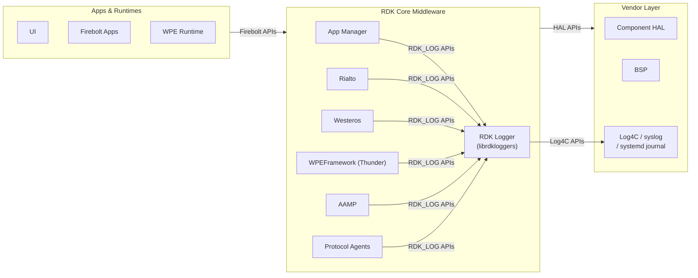
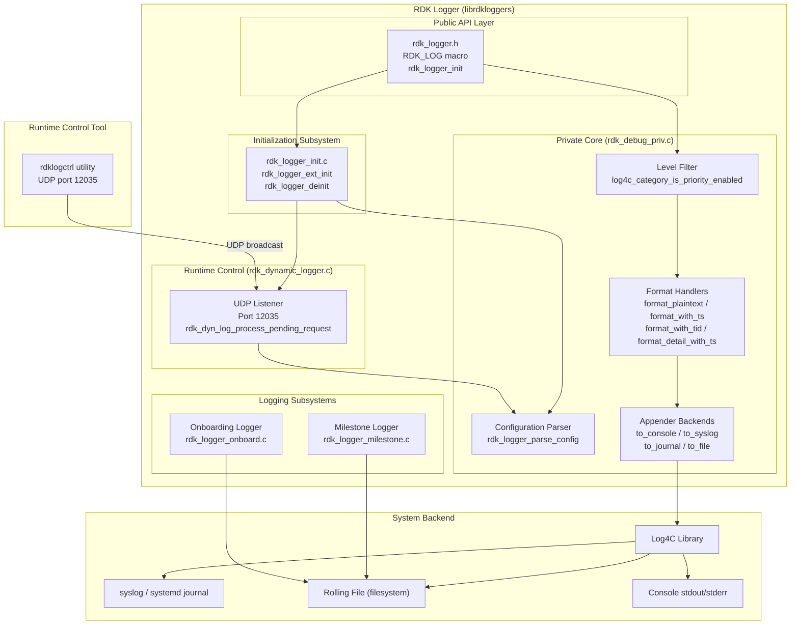
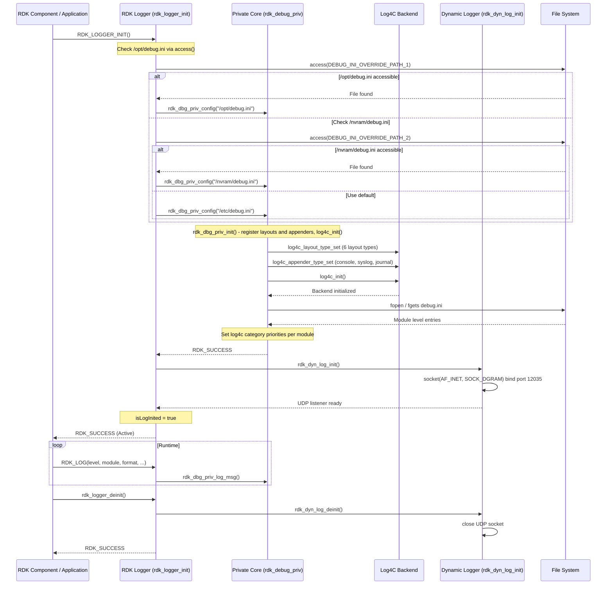
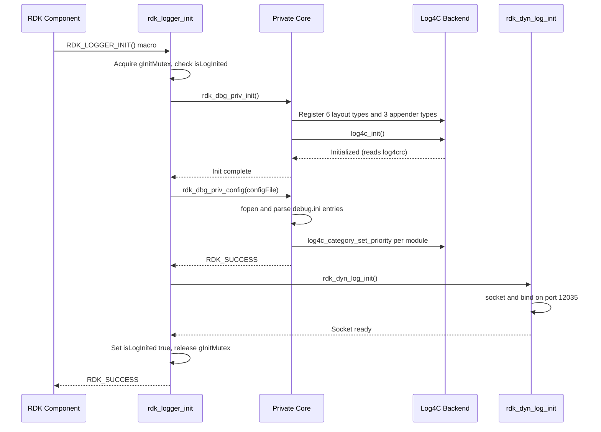
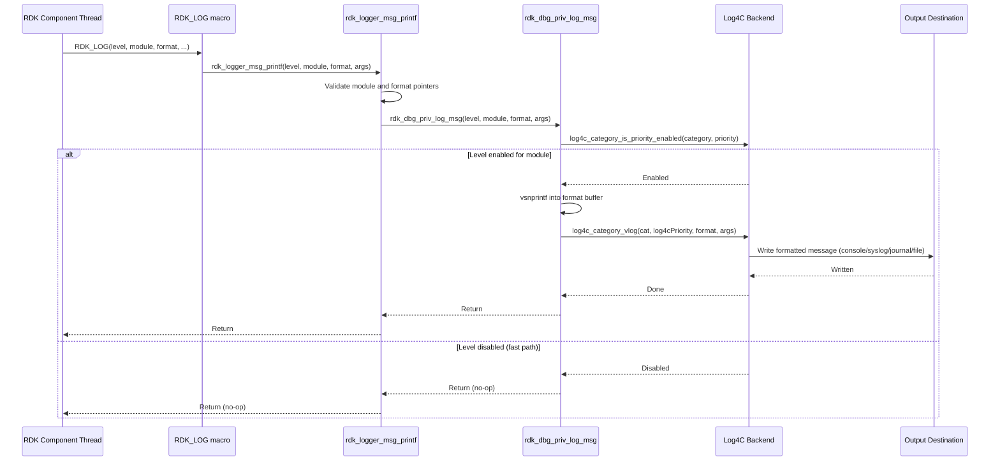
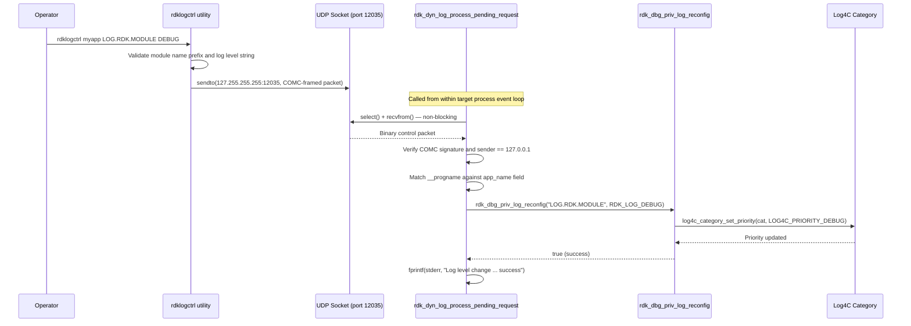
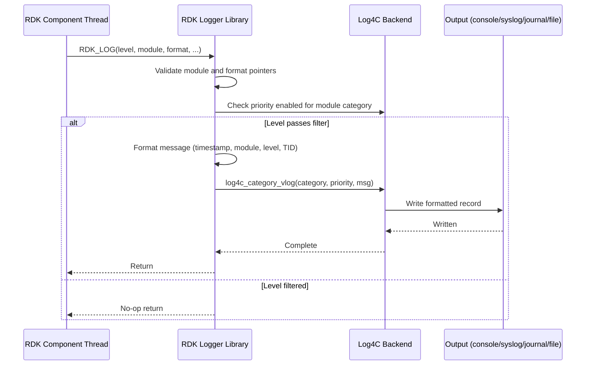
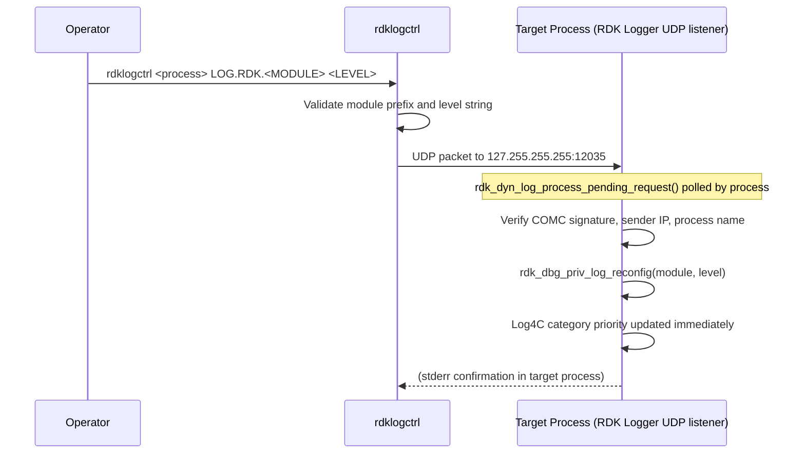

# RDK Logger

RDK Logger is a general-purpose logging framework for RDK middleware components across video and broadband platform stacks. It provides a unified logging interface that standardizes how RDK components generate, filter, format, and route log messages. The framework supports configurable log levels per module through a centralized configuration file, enables runtime log level changes without service restarts, and routes output to multiple destinations including console, syslog, systemd journal, and rolling files.

On video platforms, RDK Logger serves as the logging backbone for middleware components such as the application manager, media pipeline, compositor, and Thunder plugin ecosystem. On broadband platforms, it fulfills the same role for protocol agents, platform management, and connectivity services. The same library binary and configuration model apply across all platform stacks, with the module naming convention (`LOG.RDK.<MODULE>`) providing the separation boundary between subsystems.

RDK Logger operates as a shared library (`librdkloggers`) that client processes link against. It uses Log4C as its underlying backend for log routing and formatting, and exposes a compact C API centered on the `RDK_LOG` macro. A companion command-line utility (`rdklogctrl`) communicates with running processes over a local UDP socket to change log levels at runtime without requiring a restart.



**Key Features & Responsibilities:**

- **Unified Logging API**: Provides the `RDK_LOG(level, module, format, ...)` macro as a single, consistent logging interface used by all RDK middleware components, replacing direct use of `printf`, `fprintf`, or `syslog`.
- **Module-Specific Log Level Control**: Maintains independent log level configuration per component using the `LOG.RDK.<MODULE>` naming convention. Modules not explicitly configured inherit the default level set under `LOG.RDK.DEFAULT`.
- **Three-Tier Configuration Override**: Resolves the active configuration file at startup using a priority chain — `/opt/debug.ini` (highest) → `/nvram/debug.ini` → `/etc/debug.ini` (default) — enabling field-level overrides without modifying the base system image.
- **Runtime Log Level Control**: The `rdklogctrl` utility sends UDP control messages to running processes on port 12035, enabling immediate log level changes per module without process restart.
- **Multiple Output Destinations**: Supports console (`stdout`/`stderr`), syslog daemon, systemd journal (when available), and rolling file appenders through a pluggable Log4C backend.
- **Configurable Log Formats**: Six log message layouts are available, ranging from plain text to detailed formats including timestamps, thread IDs, module name, and log level.
- **Milestone Logging**: Provides a dedicated `logMilestone()` API that records timestamped system lifecycle events (using `CLOCK_MONOTONIC_RAW`) to a dedicated milestones log file, separate from general component logs.
- **Onboarding Log Support**: Writes structured onboarding events to a dedicated log path during the device provisioning phase, with suppression logic based on provisioning state flags.
- **Thread-Safe Operation**: Uses mutex protection (`pthread_mutex_t`) around initialization and log message dispatch, enabling safe concurrent use from multi-threaded RDK components without external synchronization.
- **Performance-Optimized Filtering**: Log level checks are performed before any formatting or I/O, ensuring that log levels below the configured threshold impose negligible overhead on the calling thread.

---

## Design

RDK Logger follows a modular library architecture where the logging policy, output routing, and runtime control concerns are separated into distinct subsystems. The public API layer provides the `RDK_LOG` macro and initialization functions. A private implementation layer (`rdk_debug_priv.c`) handles Log4C backend integration, configuration parsing, and the actual message dispatch. A runtime control layer (`rdk_dynamic_logger.c`) implements a non-blocking UDP listener that processes log level change requests from the `rdklogctrl` utility. This separation allows the logging path to remain lightweight while control plane operations are handled independently.

The design prioritizes minimal overhead on the fast logging path. Level checks are performed first, and if the level is disabled for the given module, the call returns immediately without any formatting or I/O. Message formatting, timestamp generation, and backend dispatch only occur for messages that pass the level check. The Log4C backend manages output routing, file rotation, and integration with system logging facilities.

Northbound integration is achieved through the `rdk_logger.h` public header and the `librdkloggers` shared library. Any RDK component — whether a Thunder plugin, a standalone daemon, or a user-space utility — links against this library and calls `RDK_LOGGER_INIT()` once before issuing log messages. The `RDK_LOGGER_INIT()` macro automatically resolves the correct configuration file using the three-tier priority chain.

Southbound integration is handled by the Log4C library. RDK Logger registers custom layout types (formatters) and custom appender types (output backends) with Log4C before calling `log4c_init()`. The `log4crc` XML file controls how Log4C wires these layouts and appenders to log categories. This design allows the output format and destination to be changed by modifying `log4crc` rather than recompiling.

The runtime control IPC mechanism uses a UDP socket (port 12035, loopback broadcast `127.255.255.255`). When `rdklogctrl` is invoked, it constructs a structured binary message with a `"COMC"` signature, the target process name, the module name, and the new log level, then broadcasts it. Each running process that has initialized RDK Logger maintains a non-blocking UDP socket and calls `rdk_dyn_log_process_pending_request()` to drain any pending control messages. The receiving side validates the signature, verifies the target process name against `__progname`, and applies the level change atomically.

Data persistence at the logging level is fully delegated to Log4C's rolling file appender and the system log infrastructure. RDK Logger itself only maintains an in-memory configuration cache loaded at startup. Milestone log entries are persisted directly to a flat log file via `fopen`/`fprintf`. Onboarding log entries are appended to a separate file path and are suppressed once the device is marked as provisioned.



### Threading Model

- **Threading Architecture**: Multi-threaded (library — runs in the context of the client process threads)
- **Main Thread / Client Application Thread**: Issues `RDK_LOG()` calls from arbitrary client threads. Mutex (`gLoggingMutex`) serializes concurrent log message dispatch through the Log4C backend.
- **Initialization Thread**: The first caller of `rdk_logger_init()` acquires `gInitMutex` to run the one-time initialization sequence. Subsequent callers find `isLogInited = true` and return immediately under the same mutex.
- **UDP Control Path**: The runtime control mechanism is non-blocking; `rdk_dyn_log_process_pending_request()` uses `select()` with a zero timeout and is called from within the client process's own event loop or logging path. The runtime control path requires no dedicated listener thread.
- **Synchronization**: Two `pthread_mutex_t` instances are used — `gInitMutex` guards the initialization state flag and `rdk_logger_ext_init` path; `gLoggingMutex` guards extended initialization of per-module appenders. The main logging path relies on Log4C's own thread safety for category priority checks.
- **Async / Event Dispatch**: All log messages are written synchronously within the calling thread. Runtime control updates apply immediately after `rdk_dbg_priv_log_reconfig()` updates the Log4C category priority.

### Platform and Integration Requirements

- **Build Dependencies**: `log4c >= 1.2.3` (mandatory, detected via `PKG_CHECK_MODULES`); `libglib-2.0` (mandatory, linked in `librdkloggers_la_LDFLAGS`); `libsystemd >= 209` (optional, auto-detected via `PKG_CHECK_MODULES`; enables systemd journal appender when present).
- **Plugin Dependencies**: RDK Logger is a foundational library that other RDK middleware components depend on for logging services.
- **Systemd Services**: When `libsystemd` is available at build time, log output can be directed to the systemd journal via the `to_journal` appender.
- **Configuration Files**: `/etc/debug.ini` must exist as the default configuration file. `/opt/debug.ini` and `/nvram/debug.ini` are optional override paths. `log4crc` must be installed at the location Log4C searches by default (typically `/etc/log4crc` or the path set by `LOG4C_RCPATH`) to configure appenders and layouts.
- **Startup Order**: RDK Logger must be initialized before any RDK middleware component that issues `RDK_LOG()` calls. As a shared library, initialization occurs in-process at the time the first component calls `RDK_LOGGER_INIT()`.

---

### Component State Flow

#### Initialization to Active State

The component transitions through the following states during its lifecycle: **Initializing** (mutex acquired, check `isLogInited` flag) → **LoadingConfig** (parse the selected debug.ini, populate Log4C category priorities) → **InitializingBackend** (register custom layouts and appenders, call `log4c_init()`) → **StartingDynamicControl** (open UDP socket on port 12035, bind to any interface) → **Active** (processing `RDK_LOG()` calls, servicing runtime control messages) → **Shutdown** (close UDP socket, release resources).



#### Runtime State Changes

**State Change Triggers:**

- **Module Log Level Change via rdklogctrl**: When a valid UDP control message is received matching the process name and a recognized module name, `rdk_dbg_priv_log_reconfig()` updates the Log4C category priority for that module immediately. Subsequent `RDK_LOG()` calls for that module reflect the new level without any restart.
- **Invalid Control Message**: Messages that fail signature validation (`"COMC"` check), have a mismatched process name, or carry an out-of-range log level are silently discarded by `rdk_dyn_log_validate_component_name()`.
- **Configuration File Not Found**: If the selected debug.ini cannot be opened, `rdk_logger_parse_config()` returns `RDK_FAILURE`, initialization of RDK Logger fails, and `isLogInited` remains false. Log messages issued before a successful initialization are suppressed.

**Context Switching Scenarios:**

- **Three-Tier Configuration Resolution**: At startup, `RDK_LOGGER_INIT()` checks `/opt/debug.ini`, then `/nvram/debug.ini`, then `/etc/debug.ini`. The first accessible file is used exclusively; the others are not merged.
- **Extended Initialization (`rdk_logger_ext_init`)**: A component may call `rdk_logger_ext_init()` with an `rdk_logger_ext_config_t` structure to register a specific module name with a dedicated appender, output type, format, and file policy. This is used for components that require a separate log file rather than the shared console or syslog output.

---

### Call Flows

#### Initialization Call Flow



#### Request Processing Call Flow

`RDK_LOG()` is an alias for `rdk_logger_msg_printf()`. On every invocation the module and format pointer are validated before calling `rdk_dbg_priv_log_msg()`. Inside `rdk_dbg_priv_log_msg()`, the Log4C category priority check acts as the fast-path filter: if the level is not enabled for the module, the function returns without any formatting or I/O.



#### Runtime Control Call Flow



---

## Internal Modules

| Module / Class            | Description                                                                                                                                                                                                                                                              | Key Files                                                                          |
| ------------------------- | ------------------------------------------------------------------------------------------------------------------------------------------------------------------------------------------------------------------------------------------------------------------------ | ---------------------------------------------------------------------------------- |
| `Core Logging API`        | Exposes the `RDK_LOG` macro, initialization functions, and log level enumeration. Entry point for all RDK components.                                                                                                                                                    | `include/rdk_logger.h`, `include/rdk_debug.h`                                      |
| `Initialization Manager`  | Implements `rdk_logger_init()`, `rdk_logger_ext_init()`, and `rdk_logger_deinit()`. Guards one-time initialization with a mutex. Receives external data through the debug.ini file path.                                                                                 | `src/rdk_logger_init.c`                                                            |
| `Private Core`            | Implements Log4C backend integration, all six layout formatters, three appender backends, configuration file parsing (`rdk_logger_parse_config`), module-level log category management, and the `rdk_dbg_priv_log_msg` dispatch function.                                | `src/rdk_debug_priv.c`, `src/include/rdk_debug_priv.h`                             |
| `Debug Dispatch`          | Public-facing wrappers (`rdk_logger_msg_printf`, `rdk_dbg_MsgRaw`, `rdk_logger_msg_vsprintf`) that validate parameters and forward to `rdk_dbg_priv_log_msg`. Also provides `rdk_logger_set_logLevel`, `rdk_logger_enable_logLevel`, and `rdk_logger_level_from_string`. | `src/rdk_debug.c`                                                                  |
| `Dynamic Logger`          | Implements the non-blocking UDP listener (port 12035) used for runtime log level control. Validates incoming `"COMC"`-signed messages and calls `rdk_dbg_priv_log_reconfig` on matched entries.                                                                          | `src/rdk_dynamic_logger.c`, `src/include/rdk_dynamic_logger.h`                     |
| `Milestone Logger`        | Provides `logMilestone(msg_code)` which appends a `<code>:<uptime_ms>` record to the milestones log file using `CLOCK_MONOTONIC_RAW`. Receives external data through the `msg_code` string argument.                                                                     | `src/rdk_logger_milestone.c`, `include/rdk_logger_milestone.h`                     |
| `Onboarding Logger`       | Provides `rdk_logger_log_onboard(module, msg, ...)` for writing provisioning-phase log entries to a dedicated onboarding log file. Suppressed when `/nvram/.device_onboarded` or `/nvram/DISABLE_ONBOARD_LOGGING` exists.                                                | `src/rdk_logger_onboard.c`                                                         |
| `Runtime Control Utility` | CLI tool (`rdklogctrl`) that constructs and sends `"COMC"`-framed UDP messages to change log levels in running processes. Also includes the milestone CLI tool (`rdklogmilestone`) and the onboarding utility (`rdk_logger_onboard_main`).                               | `utils/rdklogctrl.c`, `utils/rdklogmilestone.c`, `utils/rdk_logger_onboard_main.c` |

---

## Component Interactions

RDK Logger is a foundational library where all interactions flow inward — middleware components call into RDK Logger, and RDK Logger calls down into system libraries.

### Interaction Matrix

| Target Component / Layer          | Interaction Purpose                                                  | Key APIs / Topics                                                                                                          |
| --------------------------------- | -------------------------------------------------------------------- | -------------------------------------------------------------------------------------------------------------------------- |
| **Video Platform Middleware**     |                                                                      |                                                                                                                            |
| Thunder Plugins                   | Log output from plugin implementations                               | `RDK_LOG()`, `RDK_LOGGER_INIT()`, module names of the form `LOG.RDK.<PLUGIN>`                                              |
| AAMP                              | Media pipeline and DRM event logging                                 | `RDK_LOG()`, module `LOG.RDK.AAMP` (and sub-modules)                                                                       |
| Westeros / Compositor             | Compositor and graphics event logging                                | `RDK_LOG()`, `LOG.RDK.WESTEROS`                                                                                            |
| App Manager                       | Application lifecycle event logging                                  | `RDK_LOG()`, application-specific module names                                                                             |
| **Broadband Platform Middleware** |                                                                      |                                                                                                                            |
| Protocol Agents (TR-069 / TR-369) | Protocol event and diagnostic logging                                | `RDK_LOG()`, module `LOG.RDK.TR069` / `LOG.RDK.TR369`                                                                      |
| WiFi Agent                        | WiFi connection and security event logging                           | `RDK_LOG()`, module `LOG.RDK.WIFI`                                                                                         |
| Platform Management               | System status and configuration logging                              | `RDK_LOG()`, module `LOG.RDK.PAM`                                                                                          |
| WAN Manager                       | WAN interface and failover event logging                             | `RDK_LOG()`, module `LOG.RDK.WANMGR`                                                                                       |
| **System & Platform Layers**      |                                                                      |                                                                                                                            |
| Log4C Library                     | Backend log message formatting, routing, and file management         | `log4c_init()`, `log4c_category_get()`, `log4c_category_set_priority()`, `log4c_category_log()`                            |
| syslog daemon                     | System-wide log integration                                          | `openlog()`, `syslog()`, `closelog()` — active when `HAVE_SYSLOG_H` is defined                                             |
| systemd journal                   | Modern Linux logging integration                                     | `sd_journal_print()` — active when `HAVE_SYSTEMD` is defined and `libsystemd >= 209` is present                            |
| File system                       | Configuration file parsing; milestone and onboarding log persistence | `fopen()`, `fgets()`, `fprintf()` on `/etc/debug.ini`, `/opt/debug.ini`, `/nvram/debug.ini`, milestone log, onboarding log |
| UDP socket (loopback)             | Runtime log level control from `rdklogctrl`                          | `socket(AF_INET, SOCK_DGRAM)`, port 12035, `127.255.255.255` broadcast                                                     |

### Events Published

RDK Logger operates as a logging service, receiving log messages and control commands from RDK components and routing output to configured destinations. The table below captures the operational signals it emits.

| Signal                          | Destination                                                          | Trigger Condition                                                        |
| ------------------------------- | -------------------------------------------------------------------- | ------------------------------------------------------------------------ |
| Log level change acknowledgment | `stderr` of the target process                                       | Valid `rdklogctrl` message received and applied successfully             |
| Milestone record                | `/opt/logs/rdk_milestones.log` or `/rdklogs/logs/rdk_milestones.log` | `logMilestone()` called by any component                                 |
| Onboarding record               | `/rdklogs/logs/OnBoardingLog.txt.0`                                  | `rdk_logger_log_onboard()` called before device provisioning is complete |

### IPC Flow Patterns

**Primary Logging Flow:**



**Runtime Control Flow:**



---

## Implementation Details

### Major HAL APIs Integration

RDK Logger operates at the middleware library layer, interfacing directly with system-level APIs. The table below lists the system-level APIs it calls directly.

| System API                                     | Purpose                                                         | Implementation File                                      |
| ---------------------------------------------- | --------------------------------------------------------------- | -------------------------------------------------------- |
| `socket()`, `bind()`, `recvfrom()`, `select()` | UDP socket for runtime log level control                        | `src/rdk_dynamic_logger.c`                               |
| `sendto()`                                     | Sends log level change commands from `rdklogctrl`               | `utils/rdklogctrl.c`                                     |
| `fopen()`, `fgets()`, `fclose()`               | Configuration file parsing (debug.ini)                          | `src/rdk_debug_priv.c`                                   |
| `fopen()`, `fprintf()`, `fclose()`             | Milestone and onboarding log file writing                       | `src/rdk_logger_milestone.c`, `src/rdk_logger_onboard.c` |
| `log4c_init()`, `log4c_category_get()`         | Log4C backend initialization and category lookup                | `src/rdk_debug_priv.c`                                   |
| `log4c_category_set_priority()`                | Apply parsed or runtime log level to a module category          | `src/rdk_debug_priv.c`                                   |
| `log4c_category_vlog()`                        | Emit a formatted log event through the Log4C routing chain      | `src/rdk_debug_priv.c`                                   |
| `gmtime_r()`, `syscall(SYS_gettid)`            | Timestamp and thread ID generation for log message formatting   | `src/rdk_debug_priv.c`                                   |
| `clock_gettime(CLOCK_MONOTONIC_RAW, ...)`      | Uptime timestamp for milestone log entries                      | `src/rdk_logger_milestone.c`                             |
| `pthread_mutex_lock/unlock()`                  | Thread safety for initialization and extended config            | `src/rdk_logger_init.c`, `src/rdk_debug_priv.c`          |
| `access()`                                     | Configuration file existence check in `RDK_LOGGER_INIT()` macro | `include/rdk_logger.h`                                   |
| `sd_journal_print()`                           | systemd journal output (conditional on `HAVE_SYSTEMD`)          | `src/rdk_debug_priv.c`                                   |
| `openlog()`, `syslog()`, `closelog()`          | syslog output (conditional on `HAVE_SYSLOG_H`)                  | `src/rdk_debug_priv.c`                                   |

### Key Implementation Logic

- **Initialization and Lifecycle Management**: `rdk_logger_init()` in `src/rdk_logger_init.c` serializes initialization using `gInitMutex` and the `isLogInited` flag to ensure idempotent behavior in multi-threaded environments. The initialization sequence calls `rdk_dbg_priv_init()` to register layout and appender types with Log4C and invoke `log4c_init()`, then calls `rdk_dbg_priv_config()` to parse the debug.ini file and set category priorities, then `rdk_dyn_log_init()` to open the UDP control socket.

- **Configuration Parsing**: `rdk_logger_parse_config()` in `src/rdk_debug_priv.c` reads the debug.ini file line-by-line, skipping comments and lines without `=`. For the `LOG.RDK.DEFAULT` entry it sets the root `LOG.RDK` category priority; for all other `LOG.RDK.*` entries it calls `log4c_category_get()` and `log4c_category_set_priority()`. Whitespace trimming is applied to both name and value tokens before comparison. Level strings are parsed case-insensitively by `rdk_logger_level_from_string()`.

- **Log4C Layout and Appender Registration**: Six layout types (`format_plaintext`, `format_with_ts`, `format_with_tid`, `format_with_ts_tid`, `format_detail_with_ts`, `format_detail_without_ts`) and three appender types (`to_console`, `to_syslog`, `to_journal`) are registered in `rdk_dbg_priv_init()` before `log4c_init()` is called, so that the `log4crc` XML configuration file can reference them by name. A legacy `comcast_dated` layout alias is also registered for backward compatibility.

- **Extended Initialization**: `rdk_logger_ext_init()` accepts an `rdk_logger_ext_config_t` structure specifying a module name, log level, output type, format type, and optional file policy (`rdk_LogOutput_File` with file name, directory, max size, and max file count). This path, implemented in `rdk_dbg_priv_ext_init()`, creates or retrieves a Log4C category and attaches a dedicated appender to it, enabling per-component log files distinct from the shared output.

- **Runtime Log Level Control**: `rdk_dyn_log_process_pending_request()` in `src/rdk_dynamic_logger.c` uses a non-blocking `select()` call on the UDP socket to drain any pending control messages in a loop. Each message is validated for the `"COMC"` signature and loopback source address before `rdk_dyn_log_validate_component_name()` matches the target process name against `__progname`. Validated messages invoke `rdk_dbg_priv_log_reconfig()` which calls `log4c_category_set_priority()` with the new level.

- **Error Handling Strategy**: If configuration file parsing fails, `rdk_logger_init()` returns `RDK_FAILURE` and writes a diagnostic message to `printf`. When `log4c_init()` encounters an error, `rdk_dbg_priv_init()` writes a diagnostic message to `stderr` and the process continues with category state unchanged. When the UDP socket cannot be bound, `rdk_dyn_log_init()` writes a diagnostic to `stderr` and the process continues with static log levels only. Onboarding log file write failures produce output on `printf` as a fallback.

- **Logging & Diagnostics**: All `RDK_LOG()` calls use the `LOG.RDK.<MODULE>` naming convention. The root category `LOG.RDK` acts as the default parent for any module not explicitly listed in `debug.ini`. RDK Logger itself writes internal diagnostic messages to `stderr` (not through the `RDK_LOG` path) to avoid recursion during initialization or error conditions.

---

## Configuration

### Key Configuration Files

| Configuration File | Purpose                                                                                                                                     | Override Mechanism                                                                                                                   |
| ------------------ | ------------------------------------------------------------------------------------------------------------------------------------------- | ------------------------------------------------------------------------------------------------------------------------------------ |
| `/etc/debug.ini`   | Default system-wide log level configuration for all `LOG.RDK.*` modules. Installed by the build system (`sysconf_DATA` in `Makefile.am`).   | Overridden at runtime by `/opt/debug.ini` (highest priority) or `/nvram/debug.ini` (second priority) when either file is accessible. |
| `/opt/debug.ini`   | Platform-specific or field override configuration. Takes highest priority in the `RDK_LOGGER_INIT()` resolution chain.                      | Takes precedence over all other configuration files when present and readable.                                                       |
| `/nvram/debug.ini` | Runtime-writable override for temporary or persistent log level changes that survive reboots. Checked when `/opt/debug.ini` is not present. | Overridden by `/opt/debug.ini` when present.                                                                                         |
| `log4crc`          | Log4C XML configuration file. Defines layout types, appender types, and category-to-appender bindings. Installed by the build system.       | Log4C environment variable `LOG4C_RCPATH` may redirect to an alternate file.                                                         |

### Key Configuration Parameters

| Parameter          | Type                | Default                           | Description                                                                                                                                               |
| ------------------ | ------------------- | --------------------------------- | --------------------------------------------------------------------------------------------------------------------------------------------------------- |
| `LOG.RDK.DEFAULT`  | string (log level)  | `INFO` (per `debug.ini`)          | Sets the log level for the root `LOG.RDK` category. All modules not explicitly listed in `debug.ini` inherit this level.                                  |
| `LOG.RDK.<MODULE>` | string (log level)  | Inherits `LOG.RDK.DEFAULT`        | Sets the log level for a specific named module. Accepted values: `FATAL`, `ERROR`, `WARNING`, `NOTICE`, `INFO`, `DEBUG`, `TRACE`, `NONE`.                 |
| `DEBUG_CONF_FILE`  | compile-time string | `"debug.ini"`                     | Fallback configuration file name used when `rdk_logger_init()` receives a `NULL` path argument. Set via `-DDEBUG_CONF_FILE` in `librdkloggers_la_CFLAGS`. |
| `LOGMILESTONE`     | compile-time flag   | Undefined (uses `/rdklogs/logs/`) | When defined at build time, milestone events are written to `/opt/logs/rdk_milestones.log` instead of `/rdklogs/logs/rdk_milestones.log`.                 |

### Runtime Configuration

Log levels for individual modules can be changed at runtime using the `rdklogctrl` utility:

```bash
# Change log level for a module in a running process
rdklogctrl <process_name> <module_name> <log_level>

# Examples
rdklogctrl myapp LOG.RDK.NETWORK DEBUG
rdklogctrl mediaPlayer LOG.RDK.AAMP TRACE
rdklogctrl wpeProcess LOG.RDK.THUNDER INFO

# Disable all logging for a module
rdklogctrl myapp LOG.RDK.NETWORK NONE

# Available levels: FATAL, ERROR, WARN, NOTICE, INFO, DEBUG, TRACE, NONE
```

### Configuration Persistence

Runtime log level changes applied through `rdklogctrl` are in-memory only and are lost when the target process restarts. To persist a level change across restarts, the `debug.ini` file at `/nvram/debug.ini` or `/opt/debug.ini` must be updated directly, as RDK Logger reads configuration only at initialization time.
