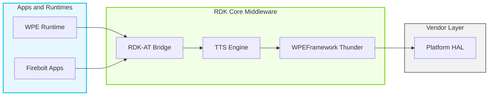
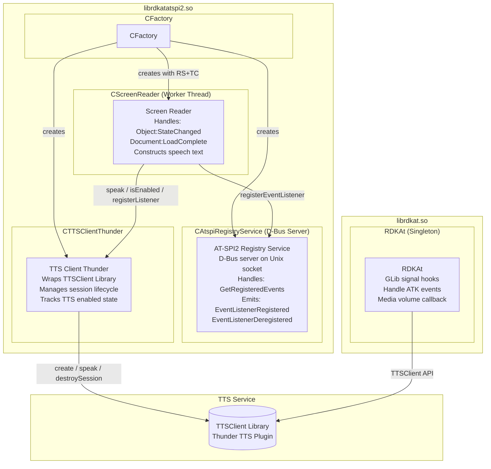
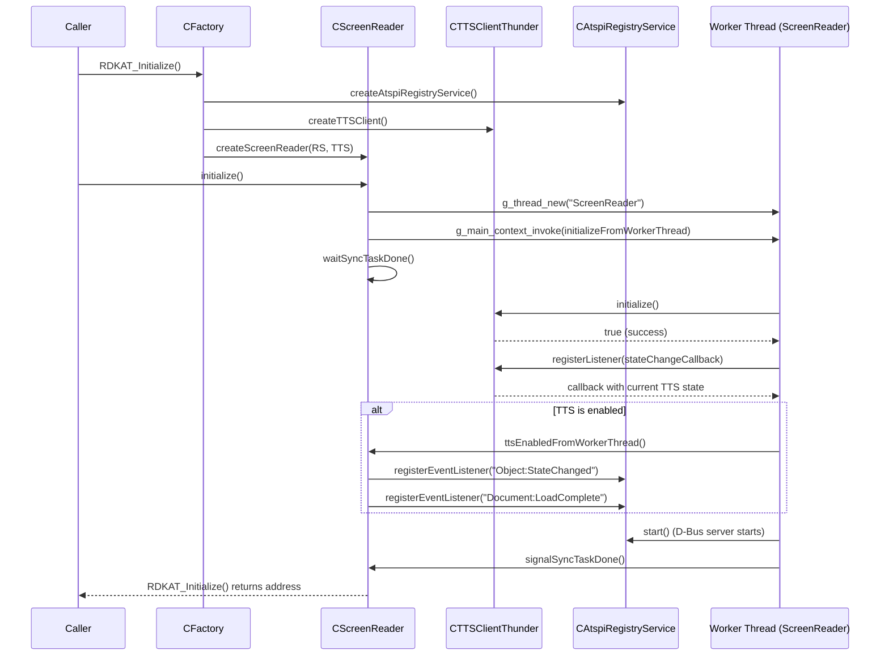
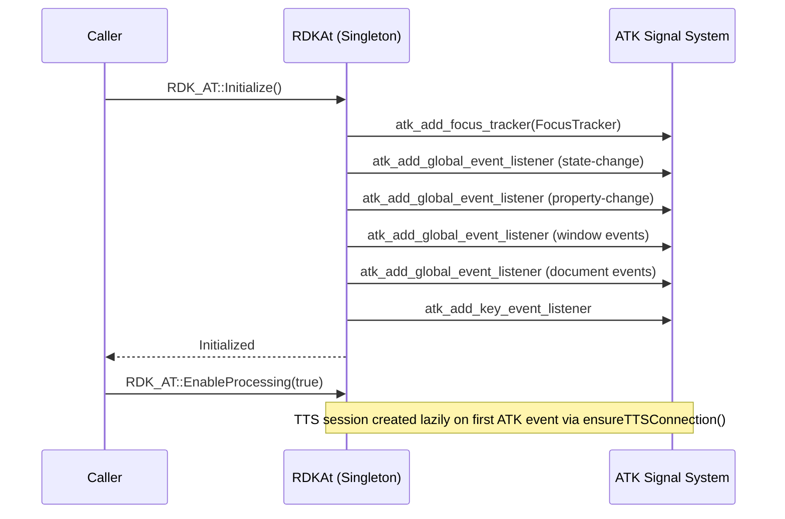
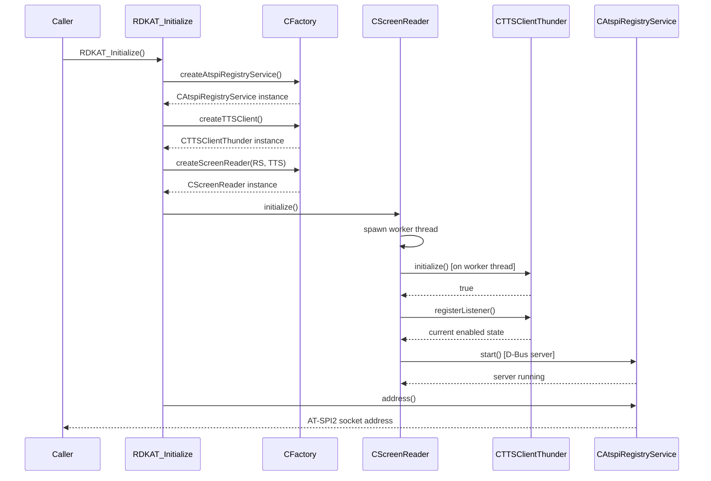
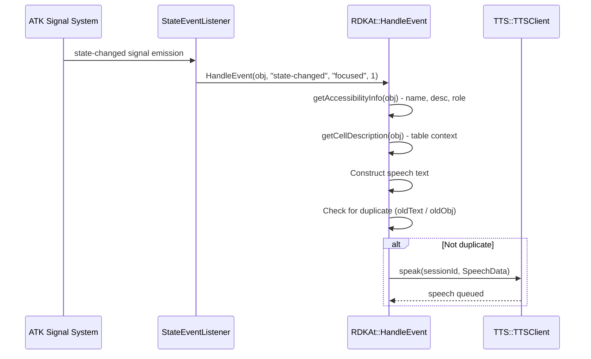
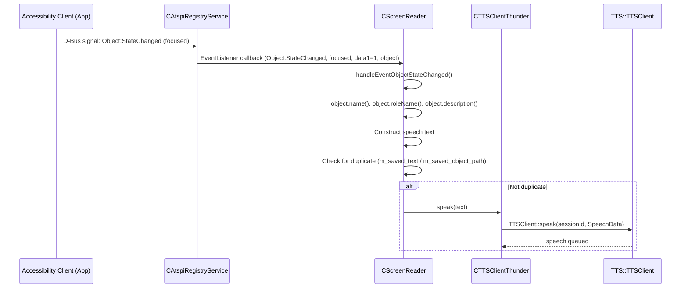
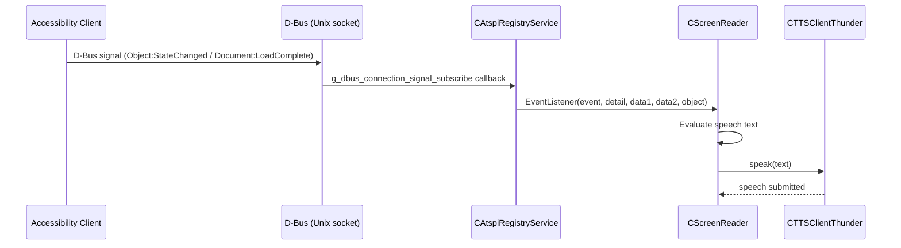
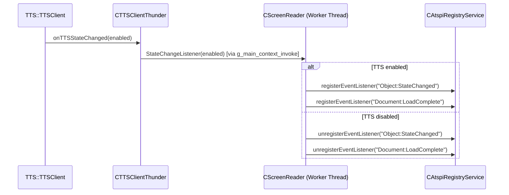

# RDK-AT Bridge (rdkat)

The RDK-AT Bridge (rdkat) is an accessibility middleware component that enables Text-To-Speech (TTS) output driven by UI accessibility events in RDK-based devices. It intercepts accessibility information from UI runtimes and translates focused element names, roles, descriptions, and document load events into text that is forwarded to the TTS service for audible speech output.

The component ships as two independent shared libraries built from the same repository, each targeting a different accessibility protocol:

- **librdkat.so** — an ATK-based bridge that registers GLib signal hooks at the ATK (Accessibility Toolkit) layer within the WPE runtime process. Accessibility events are received inline within the runtime process.
- **librdkatatspi2.so** — an AT-SPI2-based bridge that runs a D-Bus server implementing a trimmed-down AT-SPI2 registry service. Applications connect to this service over D-Bus and emit accessibility events, which the embedded screen reader consumes to produce TTS output.

Both variants connect to the TTS service through a TTSClient abstraction and react to TTS enable/disable state changes to conditionally process accessibility events.



**Key Features & Responsibilities:**

- **ATK-based event interception**: The ATK bridge registers GLib emission hooks on ATK signals such as `state-changed`, `load-complete`, `property-change`, and window events. When a UI element receives focus or its state changes, the hook fires synchronously and the bridge extracts the accessible name, description, and role to construct speech text.
- **AT-SPI2 registry service**: The AT-SPI2 bridge provides a D-Bus server that implements a subset of the AT-SPI2 protocol. Applications register with the service and emit accessibility events (`Object:StateChanged`, `Document:LoadComplete`) over D-Bus, which the embedded screen reader processes to produce speech.
- **Screen reader logic**: Both variants implement the same accessibility-to-speech translation rules — focused buttons are announced with their name and role suffix ("button"), checkboxes report their checked or unchecked state, and documents announce their name followed by "is loaded".
- **TTS state tracking**: Both variants monitor the TTS service enable/disable state. Accessibility event processing is suspended when TTS is disabled and resumed when it is re-enabled, avoiding unnecessary DOM traversals.
- **Media volume control (ATK variant)**: The ATK bridge provides a caller-supplied callback (`MediaVolumeControlCallback`) that is invoked to reduce media volume to 25% before speaking and restore it to full after speech completes or on error.
- **Duplicate speech suppression**: Both variants track the last spoken text and the associated accessible object path. If an identical text for the same object is detected, the speak call is skipped to avoid repeating the same phrase.
- **TTS session management**: The ATK bridge and the AT-SPI2 bridge both create a TTS session upon initialization and destroy it on shutdown. The AT-SPI2 bridge (`CTTSClientThunder`) also handles TTS server reconnection by requesting a new session upon server re-connection.
- **Table cell description**: The ATK bridge walks the ATK object hierarchy to retrieve table caption and row heading information, prepending this contextual description to the focused cell's speech text.

---

## Design

The component is designed around a strict separation between the accessibility event source, the screen reader logic, and the TTS output path. Each layer is defined by a pure-virtual interface (`IAtspiRegistryService`, `IScreenReader`, `ITTSClient`), and concrete implementations are wired together at startup by the `CFactory` class. This structure allows the individual layers to be tested independently using mocks.

The ATK bridge follows a simpler, callback-heavy design. A singleton `RDKAt` instance registers multiple GLib emission hooks on the ATK signal system at initialization time. All event callbacks invoke a central `HandleEvent` dispatch function that performs role-based text construction and drives TTS output. This design leverages the fact that ATK events are delivered in the same thread context as the WPE runtime, so no additional threading is required.

The AT-SPI2 bridge separates the D-Bus server and screen reader onto a dedicated GLib worker thread. The `CScreenReader::initialize()` call spawns a named worker thread (`ScreenReader`) that runs a private `GMainLoop`. Initialization, uninitialization, and TTS state-change callbacks are all dispatched to this worker thread via `g_main_context_invoke`, ensuring all interactions with the D-Bus server and event listeners occur from a single thread context. Synchronization between the caller thread and the worker thread is handled using a GMutex/GCond pair.

The northbound interface for the ATK bridge is the `RDK_AT` C++ namespace API (`Initialize`, `EnableProcessing`, `SetVolumeControlCallback`, `Uninitialize`), exposed through `rdkat.h`. The northbound interface for the AT-SPI2 bridge is a plain C API (`RDKAT_Initialize`, `RDKAT_Uninitialize`), exposed through `rdkat-atspi2.h`, making it callable from C linkage contexts.

The southbound interface to the TTS service is abstracted behind the `ITTSClient` interface. The production implementation `CTTSClientThunder` uses the `TTS::TTSClient` library to create a named session (`WPE`) and invoke `speak()` on it. The `TTSClient` library handles the underlying Thunder plugin communication.

IPC between the AT-SPI2 bridge and accessibility clients uses D-Bus over a Unix domain socket. The socket path is derived from a temporary directory created at runtime unless the `AT_SPI_BUS_ADDRESS` environment variable is set. The D-Bus server is started with anonymous authentication (`G_DBUS_SERVER_FLAGS_AUTHENTICATION_ALLOW_ANONYMOUS`).

All TTS session state and accessible object state are held in memory for the lifetime of the process.



### Threading Model

- **Threading Architecture**: The ATK bridge (`librdkat.so`) is single-threaded and event-driven, relying on the caller's GLib main loop. The AT-SPI2 bridge (`librdkatatspi2.so`) is multi-threaded.
- **Main Thread (AT-SPI2 bridge)**: Calls `RDKAT_Initialize` / `RDKAT_Uninitialize` and blocks on synchronization primitives while the worker thread completes startup or shutdown tasks.
- **Worker Thread (AT-SPI2 bridge)**:
  - _ScreenReader_: A dedicated GLib thread running a private `GMainLoop`. All D-Bus server operations, AT-SPI2 event listener registration, and TTS state-change handling are dispatched to and executed on this thread. The thread is created by `g_thread_new("ScreenReader", ...)` during `CScreenReader::initialize()`.
- **Synchronization**: A GMutex (`m_sync_task_mutex`) and GCond (`m_sync_task_condition`) pair is used to synchronize the caller thread with the worker thread for initialization and uninitialization. The `waitSyncTaskDone` / `signalSyncTaskDone` helpers implement a one-shot completion barrier.
- **Async / Event Dispatch**: TTS state-change callbacks arrive on an unspecified thread context. They are forwarded to the worker thread context using `g_main_context_invoke`, ensuring all screen reader and D-Bus state mutations occur from the worker thread.

### Prerequisites and Dependencies

- **Build Dependencies (ATK variant)**: `atk-1.0`, `glib-2.0`, `TTSClient` library. Optionally `rdkloggers` and `log4c` when `ENABLE_RDK_LOGGER` is set at build time.
- **Build Dependencies (AT-SPI2 variant)**: `glib-2.0`, `gio-2.0`, `TTSClient` library. Optionally `rdkloggers` and `log4c` when `ENABLE_RDK_LOGGER` is set at build time. Test targets additionally require `gtest` and `gmock`.
- **Plugin Dependencies**: The TTS Thunder plugin must be active before speech output is possible. Audible output becomes available once the TTS service is running and a session has been established.
- **Device Services / HAL**: All platform-level audio interaction is delegated to the TTS service through the TTSClient library.
- **Configuration Files**: `/etc/debug.ini` is read by the RDK logger backend when `USE_RDK_LOGGER` is enabled at build time.
- **Startup Order**: The TTS service (Thunder TTS plugin) must be running before `speak()` calls can succeed. When the TTS server becomes available, the component establishes a connection and creates a session automatically.

---

### Component State Flow

#### Initialization to Active State

**AT-SPI2 bridge lifecycle:**

The AT-SPI2 bridge transitions through the following states: **Uninitialized** (no resources allocated) → **Initializing** (factory creates subsystems, worker thread spawned) → **ConnectingTTS** (TTS client initialized, session created) → **Active** (D-Bus server running, AT-SPI2 event listeners registered when TTS is enabled) → **Shutdown** (event listeners unregistered, D-Bus server stopped, TTS session destroyed, worker thread exits).



**ATK bridge lifecycle:**

The ATK bridge initializes as a singleton and registers GLib signal emission hooks on the ATK signal system. It relies on the host process's GLib event loop for event delivery.



#### Runtime State Changes

**State Change Triggers:**

- When the TTS service toggles from disabled to enabled, the AT-SPI2 bridge registers `Object:StateChanged` and `Document:LoadComplete` event listeners with the registry service and begins processing incoming events.
- When the TTS service toggles from enabled to disabled, the AT-SPI2 bridge unregisters all event listeners and stops forwarding accessibility information to the TTS client.
- If the TTS server closes while the ATK bridge is active, the `onTTSServerClosed` callback resets the session ID and clears the session creation flag. On the next event that arrives, the bridge re-establishes the connection and recreates the session.
- The ATK bridge can be runtime-disabled by setting the `DISABLE_RDKAT` environment variable. When set, the event dispatch function returns early without performing any ATK object traversal.

**Context Switching Scenarios:**

- If `RDK_AT::EnableProcessing(false)` is called on the ATK bridge, all incoming ATK events are discarded and any active TTS session is destroyed. Media volume is restored to full before the session is torn down.
- In the AT-SPI2 bridge, if `RDKAT_Uninitialize()` is called, the worker thread posts an uninitialization task that stops the AT-SPI2 registry service, unregisters the TTS listener, and quits the GLib main loop, after which the worker thread exits cleanly.

---

### Call Flows

#### Initialization Call Flow (AT-SPI2 Bridge)



#### Request Processing Call Flow (ATK Bridge — Focus Event)

When the user navigates to a focusable UI element, the ATK signal system fires the registered `state-changed` emission hook. The bridge extracts accessible information from the focused object and invokes TTS speech.



#### Request Processing Call Flow (AT-SPI2 Bridge — Focus Event)



---

## Internal Modules

| Module / Class           | Description                                                                                                                                                                                                                                                       | Key Files                                                              |
| ------------------------ | ----------------------------------------------------------------------------------------------------------------------------------------------------------------------------------------------------------------------------------------------------------------- | ---------------------------------------------------------------------- |
| `RDKAt`                  | Singleton class for the ATK bridge. Registers GLib emission hooks on ATK signals, implements `TTS::TTSConnectionCallback` and `TTS::TTSSessionCallback`, drives TTS session lifecycle, and dispatches all ATK events to the central handler.                      | `rdkat.cpp`, `rdkat.h`                                                 |
| `CFactory`               | Factory class that creates and destroys concrete instances of `IAtspiRegistryService`, `ITTSClient`, and `IScreenReader`. Determines the D-Bus socket address from `AT_SPI_BUS_ADDRESS` or a temporary directory.                                                 | `CFactory.cpp`, `CFactory.h`                                           |
| `CScreenReader`          | Implementation of `IScreenReader`. Runs a dedicated GLib worker thread, registers AT-SPI2 event listeners conditionally on TTS state, and translates `Object:StateChanged` and `Document:LoadComplete` events into speech text forwarded to the TTS client.       | `screenreader/CScreenReader.cpp`, `screenreader/CScreenReader.h`       |
| `CAtspiRegistryService`  | Trimmed-down D-Bus server implementing the AT-SPI2 registry protocol. Manages D-Bus client connections, dispatches incoming method calls and signals, and delivers accessibility events to registered `EventListener` callbacks.                                  | `atspi2/CAtspiRegistryService.cpp`, `atspi2/CAtspiRegistryService.h`   |
| `CAtspiAccessibleObject` | Concrete implementation of `IAtspiAccessibleObject`. Wraps an AT-SPI2 accessible object received over D-Bus and provides accessor methods for name, description, role, states, and cell description. Receives external data from D-Bus clients.                   | `atspi2/CAtspiAccessibleObject.cpp`, `atspi2/CAtspiAccessibleObject.h` |
| `CDBusClientRegistry`    | Tracks all active D-Bus client connections to the registry service. Used by `CAtspiRegistryService` to manage connection lifecycle and clean up registrations when a client disconnects.                                                                          | `atspi2/CDBusClientRegistry.cpp`, `atspi2/CDBusClientRegistry.h`       |
| `CTTSClientThunder`      | Production implementation of `ITTSClient` using the `TTS::TTSClient` library. Manages a TTS session, implements `TTSConnectionCallback` and `TTSSessionCallback`, and exposes the `speak()`, `initialize()`, `registerListener()` interface to the screen reader. | `tts/CTTSClientThunder.cpp`, `tts/CTTSClientThunder.h`                 |
| `Logger`                 | Logging abstraction supporting two backends: RDK logger (`rdk_debug.h`) when built with `USE_RDK_LOGGER`, or a stdout-based fallback. Provides macros `RDKLOG_TRACE`, `RDKLOG_VERBOSE`, `RDKLOG_INFO`, `RDKLOG_WARNING`, `RDKLOG_ERROR`, `RDKLOG_FATAL`.          | `logger.cpp`, `logger.h`                                               |

---

## Component Interactions

Both variants of the component interact primarily with the TTS service. The AT-SPI2 variant additionally acts as a D-Bus server for accessibility clients.

### Interaction Matrix

| Target Component / Layer            | Interaction Purpose                                                                                     | Key APIs / Topics                                                                                                         |
| ----------------------------------- | ------------------------------------------------------------------------------------------------------- | ------------------------------------------------------------------------------------------------------------------------- |
| **TTS Service**                     |                                                                                                         |                                                                                                                           |
| `TTS::TTSClient`                    | Create and manage a TTS session; submit text for speech; receive connection and session state callbacks | `TTSClient::create()`, `createSession()`, `speak()`, `destroySession()`, `abort()`, `isTTSEnabled()`, `isActiveSession()` |
| **ATK Signal System**               |                                                                                                         |                                                                                                                           |
| ATK / GLib signal hooks             | Receive accessibility events from the WPE runtime process inline via GLib signal emission hooks         | `atk_add_focus_tracker()`, `atk_add_global_event_listener()`, `atk_add_key_event_listener()`                              |
| **D-Bus Clients (AT-SPI2 variant)** |                                                                                                         |                                                                                                                           |
| Accessibility client apps           | Receive AT-SPI2 accessibility events from applications over a D-Bus Unix socket                         | `org.a11y.atspi.Registry`, `org.a11y.atspi.Event.*` D-Bus interfaces                                                      |
| **Logging**                         |                                                                                                         |                                                                                                                           |
| RDK Logger / stdout                 | Emit diagnostic log output at configurable levels                                                       | `LOG.RDK.RDKAT` (RDK logger category)                                                                                     |

### Events Published

The D-Bus registry service emits AT-SPI2 protocol signals to connected D-Bus clients as part of the AT-SPI2 protocol handshake.

| Event Name                  | IARM / JSON-RPC Topic                  | Trigger Condition                                                                                   | Subscriber Components           |
| --------------------------- | -------------------------------------- | --------------------------------------------------------------------------------------------------- | ------------------------------- |
| `EventListenerRegistered`   | `org.a11y.atspi.Registry` D-Bus signal | `CScreenReader` calls `registerEventListener()` on the registry service when TTS becomes enabled    | Connected AT-SPI2 D-Bus clients |
| `EventListenerDeregistered` | `org.a11y.atspi.Registry` D-Bus signal | `CScreenReader` calls `unregisterEventListener()` on the registry service when TTS becomes disabled | Connected AT-SPI2 D-Bus clients |

### IPC Flow Patterns

**AT-SPI2 D-Bus Event Flow:**

Accessibility client applications connect to the D-Bus server run by `CAtspiRegistryService`. When an accessible event occurs in the client application, it emits a D-Bus signal to the registry service. `CAtspiRegistryService` dispatches the signal to the registered `EventListener` callback on the worker thread. The `CScreenReader` callback processes the event and calls `ITTSClient::speak()` if appropriate.



**TTS State Change Notification Flow:**

When the TTS service changes its enabled state, the `TTS::TTSClient` library invokes the registered `TTSSessionCallback`. In the AT-SPI2 bridge, this triggers `g_main_context_invoke` to dispatch the state change handling to the worker thread, where event listener registration or deregistration is performed.



---

## Implementation Details

### Major HAL APIs Integration

All hardware-level audio output flows through the `TTS::TTSClient` library.

| TTS::TTSClient API                      | Purpose                                                                | Implementation File                      |
| --------------------------------------- | ---------------------------------------------------------------------- | ---------------------------------------- |
| `TTSClient::create(callback)`           | Create a TTS client instance and register connection/session callbacks | `tts/CTTSClientThunder.cpp`, `rdkat.cpp` |
| `createSession(appId, "WPE", callback)` | Establish a named TTS session for speech output                        | `tts/CTTSClientThunder.cpp`, `rdkat.cpp` |
| `speak(sessionId, SpeechData)`          | Submit a speech request with text and a sequence ID                    | `tts/CTTSClientThunder.cpp`, `rdkat.cpp` |
| `abort(sessionId)`                      | Cancel any in-progress speech before destroying a session              | `tts/CTTSClientThunder.cpp`, `rdkat.cpp` |
| `destroySession(sessionId)`             | Release the TTS session                                                | `tts/CTTSClientThunder.cpp`, `rdkat.cpp` |
| `isTTSEnabled()`                        | Query whether TTS is currently enabled at initialization time          | `tts/CTTSClientThunder.cpp`              |
| `isActiveSession(sessionId)`            | Verify the session is active before calling `speak()`                  | `tts/CTTSClientThunder.cpp`, `rdkat.cpp` |

### Key Implementation Logic

- **State / Lifecycle Management**: The ATK bridge tracks initialization state via the `m_initialized` flag and processing state via `m_process`. The AT-SPI2 bridge tracks initialization in `CScreenReader::m_initialized` and screen reader activation in `m_enabled`. State transitions are driven by TTS state callbacks and the caller's `initialize` / `uninitialize` calls.
  - ATK bridge state: `rdkat.cpp`
  - AT-SPI2 bridge state: `screenreader/CScreenReader.cpp`

- **Event Processing**: In the ATK bridge, GLib signal emission hooks deliver events synchronously in the ATK signal emission path. A single central `HandleEvent` function performs role-based branching to build speech text. In the AT-SPI2 bridge, the `CAtspiRegistryService` dispatches D-Bus signals to registered `EventListener` callbacks. `CScreenReader` maintains separate handler methods per event type (`handleEventObjectStateChanged`, `handleEventDocumentLoadComplete`). All handlers execute on the worker thread.

- **Error Handling Strategy**: TTS client creation failure in the AT-SPI2 bridge (`CTTSClientThunder::initialize()` returning `false`) causes a warning log and an early return from the worker thread initialization, signaling completion so the caller is not blocked. Speech calls issued when no active session exists log a warning and are silently dropped. D-Bus server creation failure is logged and the service start is aborted without crashing.

- **Logging & Diagnostics**:
  - RDK Logger module name: `LOG.RDK.RDKAT`
  - Log levels available: FATAL, ERROR, WARNING, INFO, VERBOSE, TRACE
  - When built without `USE_RDK_LOGGER`, the log level can be set at runtime using the `RDKAT_DEFAULT_LOG_LEVEL` environment variable (integer value corresponding to the `LogLevel` enum)
  - Key log points: D-Bus server start/stop address, TTS connection established/closed, TTS state changes, speech text submitted, duplicate text skipped, session creation/destruction

---

## Configuration

### Key Configuration Files

| Configuration File | Purpose                                                   | Override Mechanism                                             |
| ------------------ | --------------------------------------------------------- | -------------------------------------------------------------- |
| `/etc/debug.ini`   | RDK logger configuration for `LOG.RDK.RDKAT` log category | Applicable only when `USE_RDK_LOGGER` is enabled at build time |

### Key Configuration Parameters

| Parameter                 | Type                 | Default                                                         | Description                                                                                                                                                                  |
| ------------------------- | -------------------- | --------------------------------------------------------------- | ---------------------------------------------------------------------------------------------------------------------------------------------------------------------------- |
| `ENABLE_RDK_LOGGER`       | Build flag           | Not set                                                         | When defined at build time, switches the logging backend from stdout to RDK logger (`rdk_debug.h`) and links `rdkloggers` and `log4c`.                                       |
| `AT_SPI_BUS_ADDRESS`      | Environment variable | Derived from a temporary directory (`/tmp/rdkat.XXXXXX/socket`) | Specifies the D-Bus socket address the AT-SPI2 registry service listens on. Read at startup by `CFactory::createAtspiRegistryService()`.                                     |
| `DISABLE_RDKAT`           | Environment variable | Not set                                                         | When set, the ATK bridge skips all accessible object traversal and TTS output after logging a single warning. Takes effect at the first ATK event after the variable is set. |
| `ENABLE_RDKAT_DEBUGGING`  | Environment variable | Not set                                                         | When set, the ATK bridge performs accessible object traversal even if TTS is disabled, enabling debug observation of accessibility data without audible output.              |
| `RDKAT_DEFAULT_LOG_LEVEL` | Environment variable | `INFO_LEVEL` (3)                                                | Sets the minimum log level for the stdout backend (used when `USE_RDK_LOGGER` is not enabled). Integer value: 0=FATAL, 1=ERROR, 2=WARNING, 3=INFO, 4=VERBOSE, 5=TRACE.       |
| `SYNC_STDOUT`             | Environment variable | Not set                                                         | When set, configures stdout as line-buffered to ensure log output is flushed immediately. Applies to both logging backends.                                                  |

### Runtime Configuration

The AT-SPI2 bridge socket address must be set before process start as the `AT_SPI_BUS_ADDRESS` environment variable is read once during `RDKAT_Initialize()`:

```bash
# Set a custom AT-SPI2 D-Bus socket address before starting the process
export AT_SPI_BUS_ADDRESS="unix:path=/var/run/rdkat/socket"
```

The ATK bridge can be dynamically disabled or re-enabled at runtime by setting or unsetting the `DISABLE_RDKAT` environment variable, since it is checked on every event delivery.
