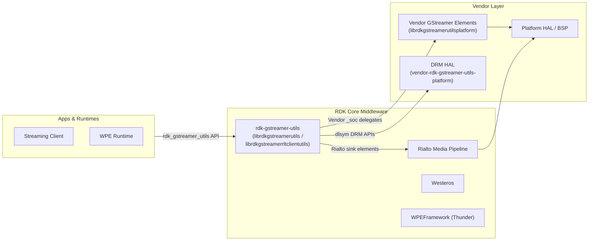
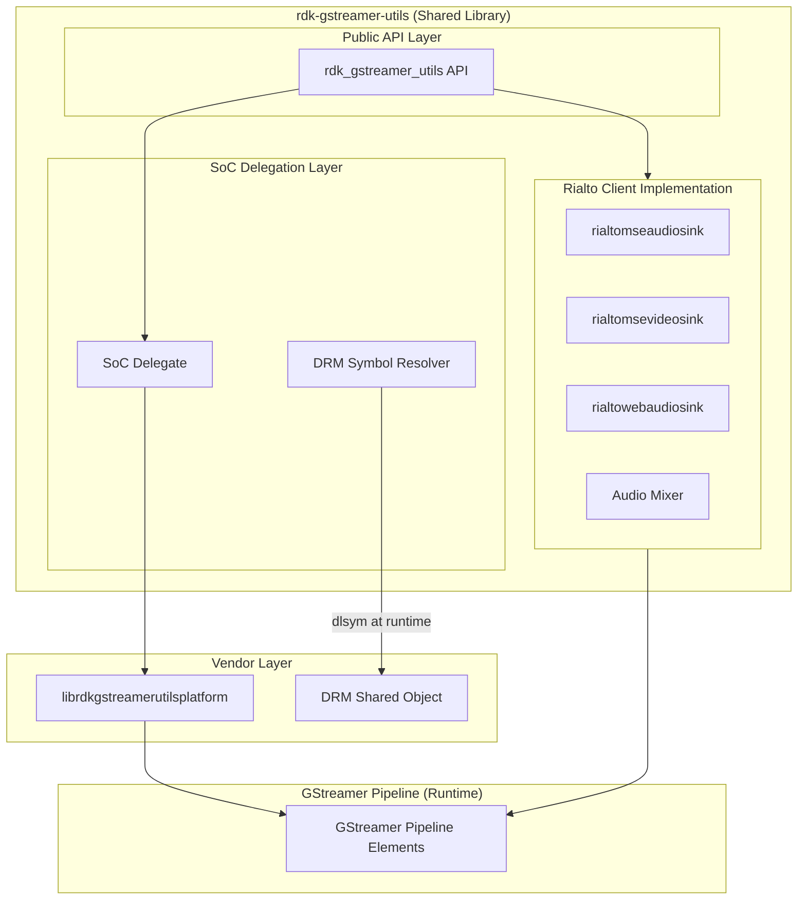
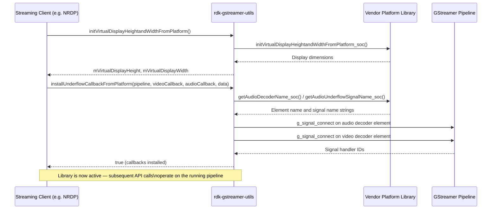
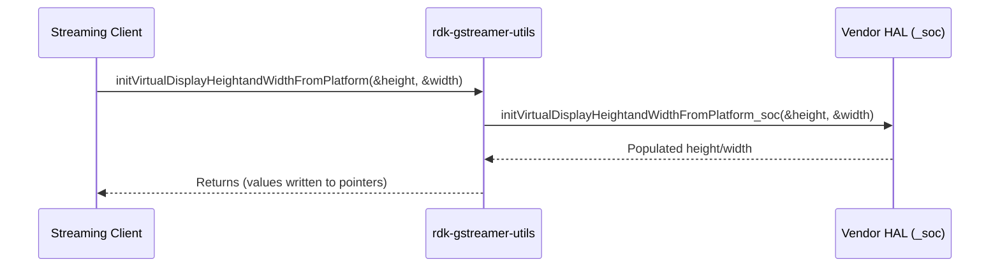
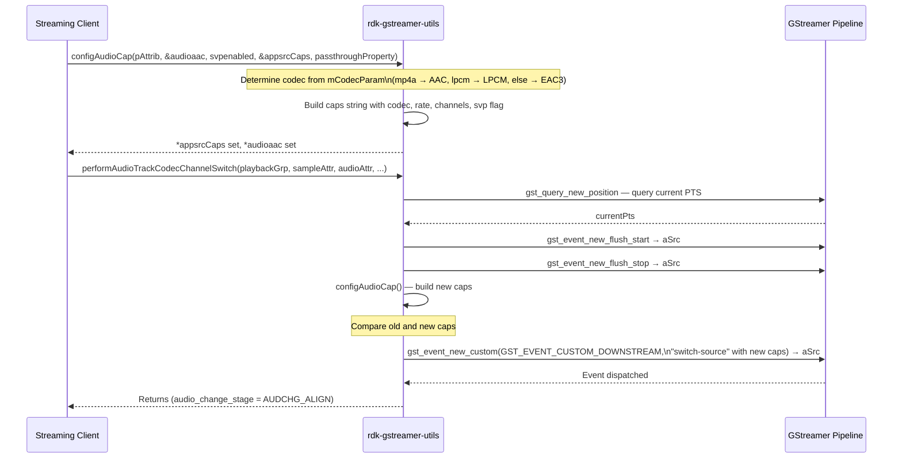
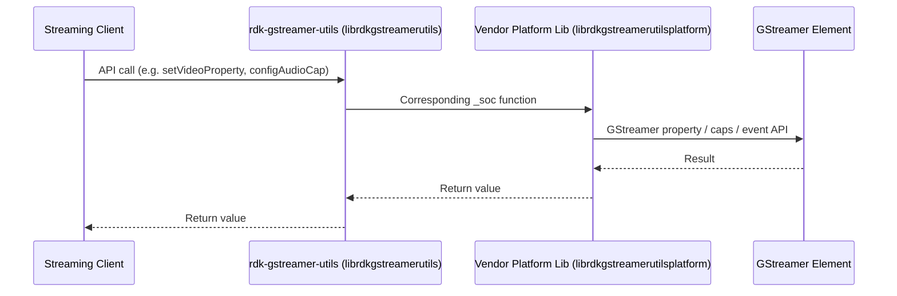
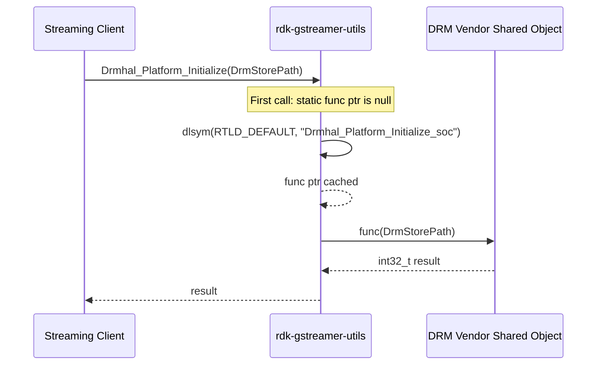
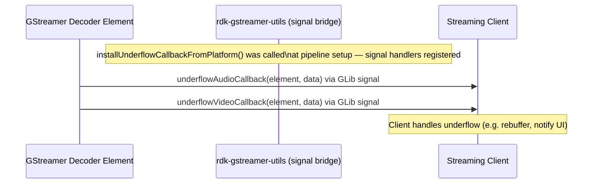

# RDK GStreamer Utils

`rdk-gstreamer-utils` is a platform abstraction library that provides GStreamer utility functions for media playback within the RDK middleware. It mediates between upper-layer streaming clients and the underlying platform-specific GStreamer pipeline elements, enabling audio/video pipeline operations such as codec capability negotiation, track switching, underflow detection, audio mixing, and DRM HAL access to be expressed through a stable, platform-agnostic API. The library ships two shared objects: a vendor-delegating build (`librdkgstreamerutils.so`) that forwards every call to a vendor-supplied platform implementation, and a Rialto client build (`librdkgstreamerrltclientutils.so`) that implements the same interface directly against Rialto media pipeline sinks.

At the device level, this component enables reliable, codec-agnostic media playback on RDK streaming devices by providing a consistent GStreamer abstraction to upper-layer streaming clients. It decouples the streaming client from the specifics of the vendor GStreamer element names and vendor DRM library symbols, allowing platform integrations to be swapped without modifying higher-layer application logic.

At the module level, the component provides a `rdk_gstreamer_utils` C++ namespace that encapsulates all pipeline utility operations. The public API is defined in a single header, while the implementation chooses at build time between the vendor-delegating path or the Rialto client path. DRM-related HAL functions are resolved at runtime via dynamic symbol loading, removing any direct link-time dependency on the DRM shared object.

**Key Features & Responsibilities:**

- **Platform-Agnostic GStreamer API**: Provides a unified C++ namespace (`rdk_gstreamer_utils`) through which streaming clients configure and control GStreamer pipelines without requiring knowledge of vendor element names or signal identifiers.
- **Audio Codec Capability Configuration**: Translates high-level audio attributes (codec, sample rate, channels, codec-specific data) into GStreamer caps strings for AAC (MPEG-4), EAC3, and LPCM formats, including SVP-enabled variants.
- **Video Codec Capability Configuration**: Constructs GStreamer caps strings for H.264, H.265/HEVC, and AV1 video streams, embedding resolution, frame rate, and SVP flags.
- **Audio Track and Codec Switching**: Manages seamless audio codec and channel changes mid-playback by flushing the pipeline, reconfiguring caps, and dispatching a `switch-source` downstream custom event.
- **Buffer Underflow Detection**: Installs platform-appropriate callbacks on audio and video decoder elements to notify the streaming client of buffer underflow conditions.
- **Audio Easing and Fade**: Provides a smooth audio volume transition API with configurable easing curves (linear, ease-in cubic, ease-out cubic), delegated to the vendor HAL.
- **Audio Mixer Integration**: Exposes functions for audio mixer pipeline setup, FIFO sizing, buffer delay calculation, queued byte tracking, and device capability queries.
- **DRM HAL Abstraction**: Exposes a set of DRM HAL APIs (platform initialization, store management, license batch query, output protection, pre-decrypt) resolved at runtime via dynamic symbol lookup, decoupling link-time DRM dependencies.
- **Rialto Client Variant**: Delivers a self-contained implementation of the full API targeting Rialto GStreamer sinks (`rialtomseaudiosink`, `rialtomsevideosink`, `rialtowebaudiosink`), supporting audio gap handling, low-latency audio player construction, and stream context setup.
- **Low-Latency Audio Player Construction**: Builds a minimal GStreamer pipeline for low-latency audio output (e.g., UI audio / TTS) with configurable channel count and sync settings.

---

## Design

The component follows a strict two-layer delegation pattern. The public-facing API layer, implemented in `rdk_gstreamer_utils.cpp`, provides thin wrapper functions that forward every call to a corresponding `_soc`-suffixed function defined in the vendor-supplied platform library. This separation ensures that the public API contract remains stable across platform integrations while all hardware-specific logic resides in the vendor layer. The Rialto client build provides an alternate, self-contained implementation of the same API targeting Rialto pipeline sinks, enabling dynamic selection of the media pipeline backend at link time. DRM functions further decouple from the vendor layer by resolving their implementation symbols at runtime using `dlsym`, keeping DRM shared object linkage entirely at runtime.

The northbound interface is a C++ header declaring all functions within the `rdk_gstreamer_utils` namespace. Streaming clients include this header and link against either `librdkgstreamerutils.so` (vendor path) or `librdkgstreamerrltclientutils.so` (Rialto path). The southbound interface, for the vendor path, is defined by a second header (`rdk_gstreamer_utils_soc.h`) listing the `_soc` function signatures that the vendor platform library must implement. For the Rialto path, the southbound interaction occurs entirely via standard GStreamer element factory and property APIs against named Rialto sink elements.

The library operates as a synchronous in-process utility library, invoked directly from the streaming client's threads. On the Rialto path, communication with the Rialto server process is handled transparently by the Rialto client GStreamer elements themselves.

Within a process lifetime, the component retains a small set of static function pointer caches used for `dlsym`-based DRM API resolution, and a module-level `mPassthroughEnabled` flag in the Rialto client that tracks the current audio passthrough property across cap changes. All other state is transient, scoped to individual API calls.

The **Public API Layer** exposes the `rdk_gstreamer_utils` namespace as the single entry point for all streaming client calls. On the vendor path, the **SoC Delegation Layer** forwards each call to the corresponding `_soc`-suffixed function in `librdkgstreamerutilsplatform`, while the **DRM Symbol Resolver** lazily loads DRM HAL symbols at first call via `dlsym`. On the Rialto path, the **Rialto Client Implementation** handles all operations directly against the Rialto GStreamer sink elements (`rialtomseaudiosink`, `rialtomsevideosink`, `rialtowebaudiosink`) and manages the audio mixer pipeline inline.

### Threading Model

- **Threading Architecture**: The library executes all API calls synchronously on the invoking thread.
- **Main Thread**: All public API functions execute synchronously on whichever thread the caller invokes them from.
- **Synchronization**: DRM API resolution relies on static local function pointers populated on first call. In the Rialto client, a module-level `mPassthroughEnabled` boolean is written during `configAudioCap` and read during `deepElementAdded`. Callers are responsible for external synchronization if these functions are invoked concurrently.
- **Async / Event Dispatch**: Underflow callbacks registered via `installUnderflowCallbackFromPlatform` are invoked by the GStreamer element signaling mechanism on the GStreamer streaming thread; the caller provides the callback function and is responsible for thread-safe handling within it.

### RDK-V Platform and Integration Requirements

- **Build Dependencies**: GStreamer 1.0 core and base plugins, GLib 2.0, vendor audio service (`virtual/vendor-audio-service`), vendor platform GStreamer utils implementation (`virtual/vendor-rdk-gstreamer-utils-platform`).
- **Plugin Dependencies**: At runtime, the vendor path requires `librdkgstreamerutilsplatform` to be present and to export all `_soc`-suffixed symbols. DRM HAL functions require the DRM vendor shared object to export the `Drmhal_*_soc` symbols.
- **Device Services / HAL**: The vendor-supplied platform library (`librdkgstreamerutilsplatform`) constitutes the HAL for this component. Its header contract is defined by `rdk_gstreamer_utils_soc.h`.
- **Startup Order**: The library is loaded into the streaming client process and initialises on first API call.

---

### Component State Flow

#### Initialization to Active State

As a shared library, this component initializes implicitly when the hosting streaming client process first calls into the library. The sequence below describes the path taken on the first playback session establishment.

#### Runtime State Changes

Runtime behaviour changes are driven by the calling client passing different parameters to existing API functions.

**State Change Triggers:**

- A change in the audio codec or channel layout in the incoming media stream triggers `performAudioTrackCodecChannelSwitch`, which flushes the audio source element and reconfigures GStreamer caps, dispatching a `switch-source` custom downstream event to re-negotiate the pipeline.
- A buffer underflow detected by the registered GStreamer signal callback notifies the streaming client, which then decides on recovery action (rebuffering, stall notification).

**Context Switching Scenarios:**

- When the media pipeline switches between the vendor GStreamer path and the Rialto path, the caller selects the appropriate library variant at link time. As of version 2.0.3, dynamic switching between pipeline backends within a session is supported via the two separate shared libraries.
- When passthrough audio mode changes, the `passthroughProperty` parameter propagated through `configAudioCap` and `performAudioTrackCodecChannelSwitch` updates the `mPassthroughEnabled` flag, which then governs the `syncmode-streaming` property applied to the video sink in `deepElementAdded`.

---

### Call Flows

#### Library Entry and Display Resolution Query

#### Audio Codec Capability Configuration and Track Switch Call Flow

---

## Internal Modules

| Module / Class                        | Description                                                                                                                                                                                                                                             | Key Files                                                             |
| ------------------------------------- | ------------------------------------------------------------------------------------------------------------------------------------------------------------------------------------------------------------------------------------------------------- | --------------------------------------------------------------------- |
| `rdk_gstreamer_utils` (public API)    | Thin delegation layer. Each function checks for the corresponding `_soc` implementation and forwards the call. DRM functions additionally use `dlsym` for runtime symbol resolution.                                                                    | `rdk_gstreamer_utils.cpp`, `rdk_gstreamer_utils.h`                    |
| `rdk_gstreamer_utils` (Rialto client) | Self-contained implementation of the full public API targeting Rialto GStreamer sinks. Implements audio/video cap building, codec switching, audio gap handling, mixer integration, and low-latency audio player construction.                          | `rialto/rdk_gstreamer_utils_rltclient.cpp`                            |
| SoC HAL Interface                     | Defines the `_soc`-suffixed function signatures that a vendor platform library must implement to serve as the backend for the main library build.                                                                                                       | `rdk_gstreamer_utils_soc.h`                                           |
| DRM Abstraction                       | A set of DRM HAL functions (platform init, store deletion, batch ID query, callback precheck, output protection config, pre-decrypt) whose implementations are resolved at runtime via `dlsym` to avoid link-time coupling with the DRM vendor library. | `rdk_gstreamer_utils.cpp`                                             |
| `retrieveGstElementByName`            | Internal utility that recursively iterates a GStreamer bin hierarchy to locate an element whose name contains a given substring. Used by underflow callback installation and audio gap processing.                                                      | `rdk_gstreamer_utils.cpp`, `rialto/rdk_gstreamer_utils_rltclient.cpp` |

---

## Component Interactions

### Interaction Matrix

| Target Component / Layer            | Interaction Purpose                                                                                                                                                                                         | Key APIs / Topics                                                                                                                                                                                                                                |
| ----------------------------------- | ----------------------------------------------------------------------------------------------------------------------------------------------------------------------------------------------------------- | ------------------------------------------------------------------------------------------------------------------------------------------------------------------------------------------------------------------------------------------------ |
| **GStreamer Pipeline**              |                                                                                                                                                                                                             |                                                                                                                                                                                                                                                  |
| GStreamer core                      | Pipeline traversal, caps construction, event dispatch, signal connection, property setting                                                                                                                  | `gst_bin_iterate_elements()`, `gst_caps_from_string()`, `gst_event_new_custom()`, `g_signal_connect()`, `g_object_set()`                                                                                                                         |
| Vendor audio/video decoder elements | Underflow signal registration; audio gap property injection; decoder property configuration                                                                                                                 | `g_signal_connect()` on audio/video underflow signals; `g_object_set("gap", ...)`                                                                                                                                                                |
| **Rialto Sinks**                    |                                                                                                                                                                                                             |                                                                                                                                                                                                                                                  |
| `rialtomseaudiosink`                | Audio decoding and rendering via Rialto server; receives flush events and `switch-source` custom event for track switching; buffering limit (1500 ms) and `use-buffering` configured via element properties | `g_object_set("limit-buffering-ms", ...)`, `g_object_set("use-buffering", ...)`, `gst_element_send_event()`                                                                                                                                      |
| `rialtomsevideosink`                | Video decoding and rendering via Rialto server; `syncmode-streaming` property set based on passthrough mode                                                                                                 | `g_object_set("syncmode-streaming", ...)`                                                                                                                                                                                                        |
| `rialtowebaudiosink`                | UI / web audio output via Rialto                                                                                                                                                                            | `gst_element_factory_make("rialtowebaudiosink", ...)`                                                                                                                                                                                            |
| **Vendor Platform Library**         |                                                                                                                                                                                                             |                                                                                                                                                                                                                                                  |
| `librdkgstreamerutilsplatform`      | Provides all `_soc`-suffixed implementations for the vendor path                                                                                                                                            | All `*_soc()` function pointers resolved at link time                                                                                                                                                                                            |
| **DRM Vendor Library**              |                                                                                                                                                                                                             |                                                                                                                                                                                                                                                  |
| DRM HAL shared object               | DRM store management, license batch ID query, output protection config fetch, content pre-decrypt                                                                                                           | `Drmhal_Platform_Initialize_soc`, `Drmhal_DeleteDrmStore_soc`, `Drmhal_QueryBatchIDFromLicenseResponse_soc`, `Drmhal_bindCallbackPrecheck_soc`, `Drmhal_FetchOutputProtectionConfigData_soc`, `Drmhal_PreDecrypt_soc` — all resolved via `dlsym` |

### Events Published

The component registers GStreamer signal callbacks on behalf of the calling client via `installUnderflowCallbackFromPlatform`. When the underlying decoder element emits an underflow signal, GStreamer invokes the callback function pointer supplied by the client.

| Signal / Callback | GStreamer Signal / Mechanism                                      | Trigger Condition                               | Recipient                                            |
| ----------------- | ----------------------------------------------------------------- | ----------------------------------------------- | ---------------------------------------------------- |
| Audio underflow   | Platform-specific audio underflow signal on audio decoder element | Audio decoder buffer runs empty during playback | Streaming client callback (`underflowAudioCallback`) |
| Video underflow   | Platform-specific video underflow signal on video decoder element | Video decoder buffer runs empty during playback | Streaming client callback (`underflowVideoCallback`) |

### IPC Flow Patterns

**Library API Request Flow (vendor path):**

**DRM HAL Runtime Resolution Flow:**

**Underflow Notification Flow:**

---

## Implementation Details

### Major HAL APIs Integration

| HAL / API                                                           | Purpose                                                                                                                                                           | Implementation                                                               |
| ------------------------------------------------------------------- | ----------------------------------------------------------------------------------------------------------------------------------------------------------------- | ---------------------------------------------------------------------------- |
| `installUnderflowCallbackFromPlatform()`                            | Retrieves platform audio/video decoder element names and underflow signal names from the HAL, then registers the client-supplied callbacks via `g_signal_connect` | Public API layer                                                             |
| `initVirtualDisplayHeightandWidthFromPlatform()`                    | Queries the HAL for the platform virtual display resolution                                                                                                       | Public API layer → `_soc`                                                    |
| `configAudioCap()`                                                  | Builds a GStreamer `GstCaps` object from `AudioAttributes` for AAC, EAC3, and LPCM codecs including SVP flag                                                      | Rialto client: inline; vendor path: `_soc`                                   |
| `configVideoCap()`                                                  | Builds a GStreamer caps string for H.264, H.265/HEVC, and AV1 video streams including resolution, frame rate, and SVP flag                                        | Rialto client: inline; vendor path: `_soc`                                   |
| `performAudioTrackCodecChannelSwitch()`                             | Manages mid-playback audio codec change: queries position, sends flush events, rebuilds caps, dispatches `switch-source` downstream event                         | Rialto client: inline; vendor path: `_soc`                                   |
| `audioMixerConfigurePipeline()`                                     | Adds audio source and sink elements to a GStreamer pipeline, links them, and optionally attenuates output volume                                                  | Rialto client: inline; vendor path: `_soc`                                   |
| `audioMixerGetDeviceInfo()`                                         | Returns preferred and maximum audio frame counts based on FIFO size constants                                                                                     | Rialto client: computed from `GST_FIFO_SIZE_MS` (48 ms); vendor path: `_soc` |
| `constructLLAudioPlayer()`                                          | Builds a low-latency audio pipeline using `rialtomseaudiosink`, sets stream context, configures low-latency and sync properties                                   | Rialto client: inline; vendor path: `_soc`                                   |
| `Drmhal_Platform_Initialize()` / `Drmhal_PreDecrypt()` (and others) | DRM HAL operations resolved at runtime — platform init, store deletion, batch ID query, output protection data, content pre-decrypt                               | Public API layer via `dlsym`                                                 |

### Key Implementation Logic

- **Platform Delegation**: Every public function in the vendor path is a one-line forward to the corresponding `_soc` function. The only exception is `getPtsOffsetAdjustment`, which guards the `_soc` call behind an `isPtsOffsetAdjustmentSupported_soc()` check, returning zero when the platform indicates PTS offset adjustment is unavailable.

- **Audio Codec Detection**: `configAudioCap` identifies the codec by comparing the leading four characters of `AudioAttributes::mCodecParam`. Strings beginning with `mp4a` map to AAC; `lpcm` maps to linear PCM; all other values are treated as EAC3.

- **Video Codec Detection**: `configVideoCap` determines the video format by substring search on the codec string. Matches for `h265`, `hdr10`, `dvhe`, `dvh1`, `hvc1`, or `hev1` select the HEVC caps template; `av1` selects the AV1 template; all others default to H.264.

- **Passthrough Tracking**: The Rialto client maintains a module-level `mPassthroughEnabled` boolean. It is written by `configAudioCap` and `getNativeAudioFlag`, and read in `deepElementAdded` to conditionally enable `syncmode-streaming` on the video sink element.

- **Audio Buffering for Switching**: In `deepElementAdded`, when the `rialtomseaudiosink` element is added to the pipeline, a 1500 ms buffering limit is set and `use-buffering` is turned off to enable faster audio track switching.

- **Audio Gap Handling**: `processAudioGap` (Rialto path) constructs a `gap-params` GstStructure containing start PTS, duration, discontinuity gap, and AAC flag, then injects it into the Rialto audio sink via `g_object_set("gap", ...)`. The function returns early when both duration and discontinuity are zero.

- **DRM Symbol Caching**: Each DRM function declares a `static` local function pointer initialised to `nullptr`. On the first call, `dlsym(RTLD_DEFAULT, "<symbol_name>")` is called to resolve the vendor symbol. The resolved pointer is cached for all subsequent calls. When symbol resolution fails, the function logs an error and returns a failure code.

- **Error Handling Strategy**: Functions that are unable to locate required GStreamer elements emit a GLib warning (`g_warning`) and return `false`. DRM resolution failures print to stdout and return `-1` or `false`. The underflow callback installation function returns `true` only when both audio and video signal handlers are connected with non-zero handler IDs.

- **Logging**: Diagnostic output uses the `LOG_RGU` macro, which writes formatted messages prefixed with `[RGU:<filename>:<line>]` to `stderr` with immediate flush. This applies to the Rialto client implementation; the vendor path delegates all logging to the `_soc` layer.

---

## Configuration

### Key Configuration Parameters

| Parameter                                  | Type                       | Default           | Description                                                                                                                                                   |
| ------------------------------------------ | -------------------------- | ----------------- | ------------------------------------------------------------------------------------------------------------------------------------------------------------- |
| `AUDIOMIXER_NOT_SUPPORTED`                 | bool (CMake)               | `""` (false)      | Set to `true` when the `disable_audio_mixer` distro feature is present. Controls whether audio mixer pipeline functions are compiled in.                      |
| `PLATFORM_FLAGS`                           | string (Makefile)          | (vendor-provided) | Additional compile-time flags injected by the vendor platform recipe to configure platform-specific behaviour at build time.                                  |
| SVP enabled                                | bool (runtime parameter)   | caller-controlled | Passed as `svpenabled` to `configAudioCap` and `configVideoCap`. When `true`, the `enable-svp=true` field is embedded in the generated GStreamer caps string. |
| `GST_FIFO_SIZE_MS`                         | int (compile-time, Rialto) | `48`              | FIFO duration in milliseconds used by the Rialto client to calculate audio mixer FIFO byte size and preferred/maximum frame counts.                           |
| `PLATFORM_VIRTUALDISPLAY_WIDTH` / `HEIGHT` | int (compile-time, Rialto) | `1280` / `720`    | Virtual display resolution returned by the Rialto client's `initVirtualDisplayHeightandWidthFromPlatform` implementation.                                     |

### Configuration Persistence

Configuration changes are not persisted across reboots.
