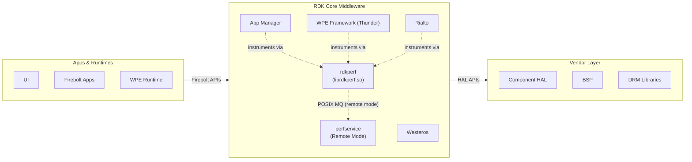
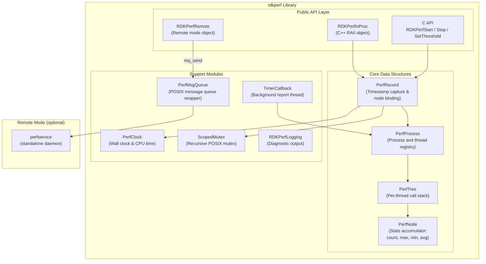
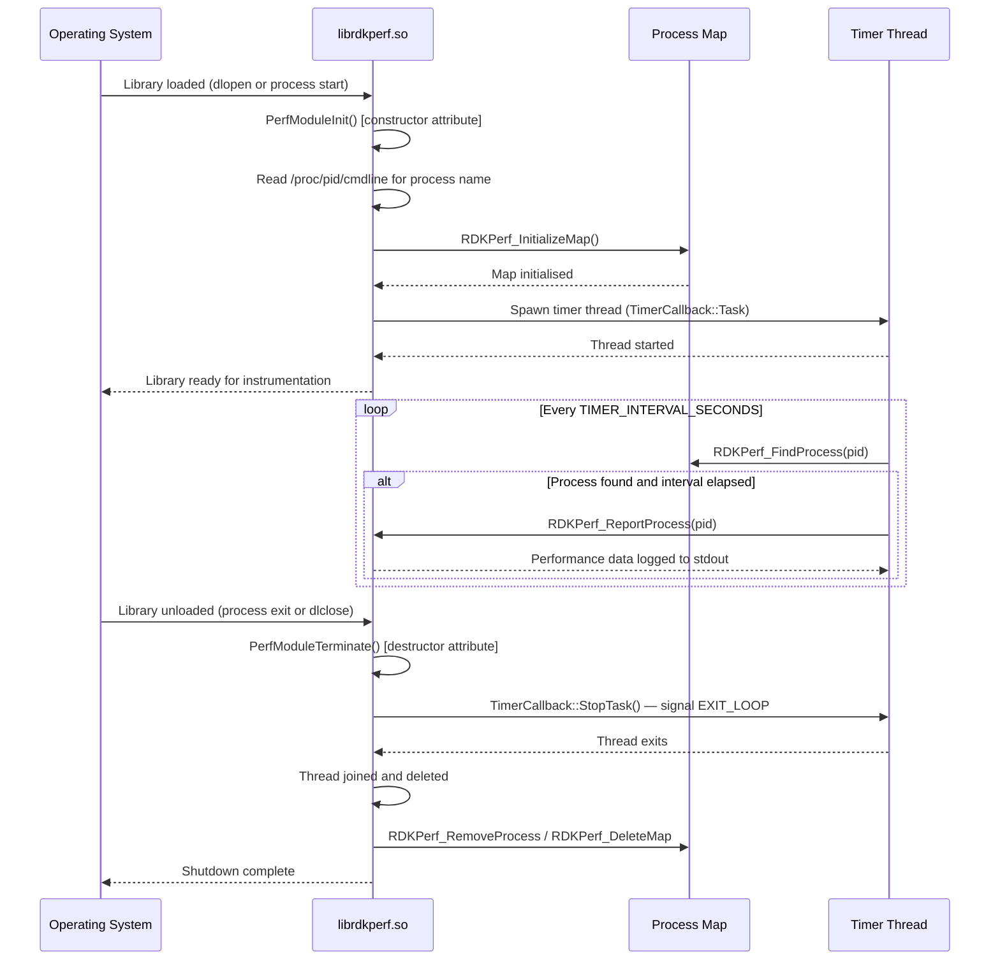
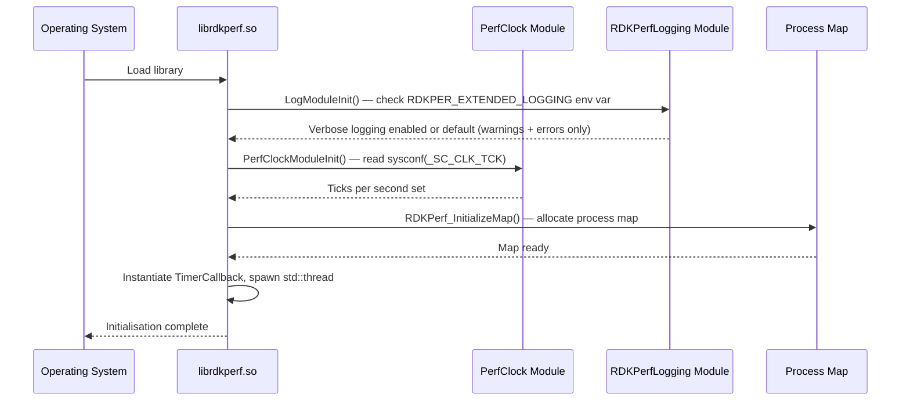
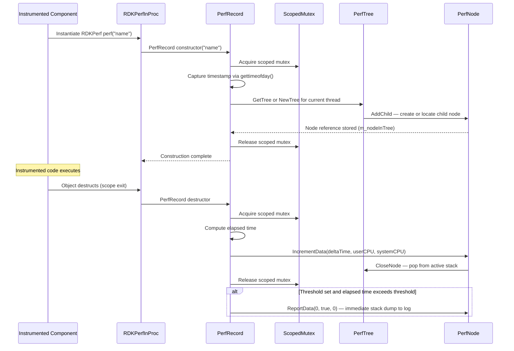
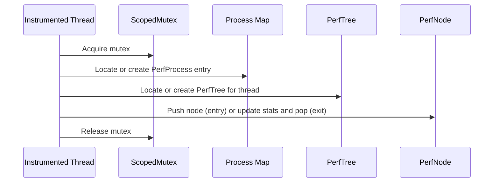
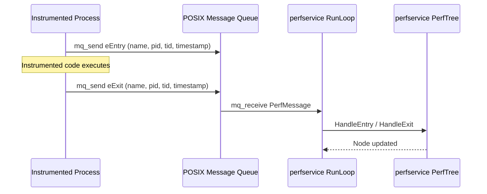

# rdkperf

RDKPerf is a non-invasive, lightweight performance profiling library for RDK middleware processes. It allows any RDK component to instrument functions or code sections with minimal changes to the original code flow. Timing data is captured automatically using RAII-based objects: a timestamp is recorded when the profiling object is created, and elapsed time is accumulated when it goes out of scope. Metrics are organized into per-thread call trees and reported at automatically increasing intervals in the background, or on demand via explicit API calls. The library is delivered as a shared object (`librdkperf.so`) that any instrumented process links against at build time.

The library supports two runtime collection modes. In the default in-process mode, all timing data is collected and stored within the instrumented process itself. In the optional remote mode, timing events are forwarded over a POSIX message queue to a standalone `perfservice` daemon, which maintains the call trees externally. A compile-time no-op mode (`NO_PERF`) is also available to strip all instrumentation overhead in production builds without changing source code.

Reports output a hierarchical call stack showing every instrumented entry point and its children. Each node carries total and interval statistics: invocation count, maximum, minimum, and average elapsed time in milliseconds. Inactive threads are pruned automatically from the data structures during each reporting cycle.



**Key Features & Responsibilities:**

- **RAII-based function instrumentation**: Instantiating an `RDKPerfInProc` (or `RDKPerfRemote`) object on the stack captures a start timestamp at construction and records elapsed time at destruction, requiring no manual start/stop calls in normal C++ usage.
- **C and C++ instrumentation APIs**: Both a C++ scoped object interface and a C handle-based API (`RDKPerfStart` / `RDKPerfStop` / `RDKPerfSetThreshold`) are provided, enabling instrumentation of C-only modules.
- **Hierarchical per-thread call trees**: Each thread's active instrumentation points are maintained as a tree of `PerfNode` objects, reflecting the nesting of instrumented calls and preserving parent–child relationships in the output.
- **Threshold-triggered immediate reporting**: An optional threshold value (in microseconds) may be set per instrumentation point. If the elapsed time exceeds the threshold, the call stack from that point is immediately logged without waiting for the next scheduled report.
- **Automatic background reporting**: A background timer thread fires at progressively increasing intervals, starting within seconds of library load and extending up to approximately 100 minutes at steady state, reducing overhead on long-running processes.
- **In-process and remote collection modes**: In-process mode accumulates all data within the instrumented process. Remote mode forwards entry and exit events to the `perfservice` daemon over a POSIX message queue, allowing data aggregation outside the target process.
- **Compile-time instrumentation bypass**: The `NO_PERF` build flag replaces all instrumentation with a zero-overhead stub (`RDKPerfEmpty`), allowing the same source code to be shipped in both profiling and non-profiling builds.
- **Optional CPU time tracking**: When built with `PERF_SHOW_CPU`, reports include user and system CPU time percentages per reporting interval alongside wall-clock timing, using `getrusage()`.

---

## Design

The library is designed around the principle that instrumentation must not alter the logical behavior of the code it measures. All profiling state is encapsulated in objects with automatic storage duration, so the act of measurement is tied to the natural C++ scope lifetime. The two-library architecture separates the core data engine (`libperftool.so`) from the public API wrapper (`librdkperf.so`), allowing the instrumentation interface to be decoupled from internal data management. The compile-time feature flags `PERF_REMOTE`, `PERF_SHOW_CPU`, and `NO_PERF` control which backend is active at link time, meaning the calling code is unchanged regardless of the selected mode. A global process map (`std::map<pid_t, PerfProcess*>`) is the central registry, initialized once via a library constructor and destroyed via a library destructor, ensuring no explicit setup or teardown is required by the calling application. All mutations to shared data structures are guarded by a scoped POSIX recursive mutex (`ScopedMutex`), providing thread safety without requiring callers to manage locks.

The northbound interface is the public C/C++ API defined in `rdk_perf.h`. Instrumented code links against `librdkperf.so` and calls into `RDKPerfInProc` or the C handle API. All system-level interactions are made directly against standard POSIX and C runtime interfaces (`gettimeofday`, `getrusage`, `pthread_*`, `mq_*`).

In in-process mode, all IPC is eliminated. A `PerfRecord` object interacts directly with the in-memory `PerfProcess` and `PerfTree` data structures through the scoped mutex. In remote mode, `RDKPerfRemote` encodes each entry and exit event into a `PerfMessage` structure and delivers it to the `perfservice` daemon via a POSIX message queue (`/RDKPerfServerQueue`) using `mq_send`. The daemon's `RunLoop` continuously dequeues messages and dispatches them to the same `PerfProcess` / `PerfTree` / `PerfNode` structures, maintaining an identical data model to the in-process path.

All timing statistics are held in memory within the `TimingStats` structure embedded in each `PerfNode`. The reporting functions `RDKPerf_ReportProcess` and `RDKPerf_ReportThread` write formatted output to stdout or stderr via `RDKPerfLogging`.



### Threading Model

- **Threading Architecture**: Multi-threaded. One background timer thread runs per process for the lifetime of the loaded library. All other activity occurs on the calling threads of the instrumented process.
- **Main / Calling Thread**: Instantiates `RDKPerfInProc` or `RDKPerfRemote` objects. In in-process mode, the constructor and destructor directly read and write the `PerfProcess` / `PerfTree` / `PerfNode` data structures.
- **Worker Threads**:
  - _Timer thread_ (`TimerCallback::Task`): Runs a loop waking every `TIMER_INTERVAL_SECONDS` (10 seconds). On each wake it checks whether the reporting interval counter has elapsed and, if so, calls `RDKPerf_ReportProcess`. The interval counter increments by 5 after each report up to a maximum of 600, extending the period between reports up to approximately 100 minutes. Exits when `TimerCallback::StopTask()` signals `EXIT_LOOP` via a `std::condition_variable`.
- **Synchronization**: A single recursive `pthread_mutex_t` (wrapped by `ScopedMutex`) guards all accesses to the global process map and the `PerfTree` / `PerfNode` structures. `std::mutex` and `std::condition_variable` are used within `TimerCallback` for inter-thread signaling between the main thread (library destructor) and the timer thread.
- **Async / Event Dispatch**: Threshold violations trigger an immediate inline call to `PerfNode::ReportData` from within the destructor of `PerfRecord`, on the calling thread, without queuing or deferring to the timer thread.

### Prerequisites and Dependencies

- **Build Dependencies**: `librt` (POSIX real-time extensions for `mq_*`), `libpthread` (POSIX threads), `libstdc++`. The `perfservice` daemon is built and installed only when `ENABLE_PERF_REMOTE=1` is set at build time.
- **Systemd Services**: The `rdkperf.service` unit starts `/usr/bin/perfservice` in remote mode builds. `WantedBy=multi-user.target`.
- **Startup Order**: The library self-initializes via `__attribute__((constructor))` when loaded by any instrumented process.

---

### Component State Flow

#### Initialization to Active State

The library transitions through the following states during its lifecycle: **Uninitialised** (before library load) → **Initialising** (library constructor running) → **Active** (timer running, instrumentation available) → **Shutdown** (timer stopped, process map released, library destructor complete).



#### Runtime State Changes

**State Change Triggers:**

- Each call to `PerfRecord` constructor pushes a node onto the active thread's `PerfTree` stack. Each destructor pops the node and updates its `TimingStats`. The tree's `m_ActivityCount` counter increments on every push, tracking whether a thread has been active since the last report.
- When the timer fires a `ReportData` cycle, `CloseInactiveThreads()` is called. Any `PerfTree` whose `m_ActivityCount` has not changed since the previous report and whose stack holds only the root node is considered inactive and removed from the process map. This prevents unbounded memory growth from short-lived threads.

**Context Switching Scenarios:**

- If an instrumented process creates and destroys threads rapidly, the associated `PerfTree` objects are pruned during the next timer-driven report cycle, keeping the process map bounded.
- In remote mode, when `perfservice` is unavailable at process startup, `PerfMsgQueue::GetQueue` returns an error and `RDKPerfRemote` logs the condition on each instrumentation attempt. The instrumented process continues operating normally.

---

### Call Flows

#### Initialization Call Flow



#### Request Processing Call Flow

When a component instruments a function, the profiling object's lifetime mirrors the function's scope. On construction, a timing record is opened; on destruction, elapsed time is committed to the call tree.



---

## Internal Modules

| Module / Class   | Description                                                                                                                                                                                                                                                                                                                                                                                         | Key Files                                          |
| ---------------- | --------------------------------------------------------------------------------------------------------------------------------------------------------------------------------------------------------------------------------------------------------------------------------------------------------------------------------------------------------------------------------------------------- | -------------------------------------------------- |
| `RDKPerfInProc`  | Public C++ instrumentation class. Delegates entirely to an embedded `PerfRecord` instance. Constructed on the caller's stack; destruction triggers elapsed time recording.                                                                                                                                                                                                                          | `rdk_perf.h`, `rdk_perf.cpp`                       |
| `RDKPerfRemote`  | Public C++ instrumentation class for remote mode. Sends `eEntry` and `eExit` messages to `perfservice` via `PerfMsgQueue` on construction and destruction respectively.                                                                                                                                                                                                                             | `rdk_perf.h`, `rdk_perf.cpp`                       |
| `RDKPerfEmpty`   | No-op stub class active when `NO_PERF` is defined. All methods are empty, providing zero overhead for builds that disable profiling.                                                                                                                                                                                                                                                                | `rdk_perf.h`, `rdk_perf.cpp`                       |
| `PerfRecord`     | Captures the start timestamp and thread ID at construction, locates or creates the owning `PerfProcess` and `PerfTree`, and pushes a node onto the call stack. On destruction, computes elapsed time and invokes `IncrementData` on the corresponding `PerfNode`.                                                                                                                                   | `rdk_perf_record.h`, `rdk_perf_record.cpp`         |
| `PerfProcess`    | Represents a single OS process. Maintains a `std::map<pthread_t, PerfTree*>` of all active thread trees. Provides `ReportData()` which iterates all trees and logs CPU utilisation using `getrusage` interval deltas. Reads the process name from `/proc/<pid>/cmdline`.                                                                                                                            | `rdk_perf_process.h`, `rdk_perf_process.cpp`       |
| `PerfTree`       | Represents the instrumentation state for one thread. Holds a root `PerfNode` and a `std::stack<PerfNode*>` of currently open (active) nodes. Tracks an activity counter to detect idle threads for pruning.                                                                                                                                                                                         | `rdk_perf_tree.h`, `rdk_perf_tree.cpp`             |
| `PerfNode`       | Stores the accumulated `TimingStats` for one named instrumentation point within a thread's call tree. Statistics include total and interval count, maximum, minimum, and average elapsed times. Also stores optional user and system CPU time fields. Child nodes are kept in a `std::map<std::string, PerfNode*>` keyed by name.                                                                   | `rdk_perf_node.h`, `rdk_perf_node.cpp`             |
| `PerfClock`      | Captures wall-clock time via `gettimeofday()` and process CPU time via `getrusage()`. Supports `Marker` (record a point in time) and `Elapsed` (compute difference from a prior marker) operations. Used by `PerfRecord` and `PerfProcess` for interval CPU reporting.                                                                                                                              | `rdk_perf_clock.h`, `rdk_perf_clock.cpp`           |
| `PerfMsgQueue`   | POSIX message queue wrapper using `mq_open`, `mq_send`, and `mq_receive`. The queue name is `/RDKPerfServerQueue`. Used only when `PERF_REMOTE` is defined. Supports reference counting via `AddRef` / `Release`.                                                                                                                                                                                   | `rdk_perf_msgqueue.h`, `rdk_perf_msgqueue.cpp`     |
| `ScopedMutex`    | RAII mutex wrapper. Uses a static `pthread_mutex_t` (or `std::recursive_mutex` when `USE_LIBC_SCOPED_LOCK` is defined) to serialise access to the global process map and call tree structures across concurrent threads.                                                                                                                                                                            | `rdk_perf_scopedlock.h`, `rdk_perf_scopedlock.cpp` |
| `TimerCallback`  | Implements the background reporting timer. Runs `Task()` in a dedicated `std::thread`. Wakes on a `std::condition_variable` with a 10-second timeout. Increments a counter after each wake; when the counter exceeds the current delay threshold, triggers `RDKPerf_ReportProcess`. The delay threshold grows by 5 per cycle up to 600.                                                             | `rdk_perf.cpp`                                     |
| `RDKPerfLogging` | Internal logging utility. Writes formatted messages to stdout (warnings) or stderr (errors) with a `[RDKPerf P <pid> : T <tid>]` prefix. Trace-level messages are suppressed unless the environment variable `RDKPER_EXTENDED_LOGGING=true` is set.                                                                                                                                                 | `rdk_perf_logging.h`, `rdk_perf_logging.cpp`       |
| `perfservice`    | Standalone daemon built only when `ENABLE_PERF_REMOTE=1`. Opens the POSIX message queue as the server side and runs `RunLoop`, dispatching received `PerfMessage` packets to the same `PerfProcess` / `PerfTree` / `PerfNode` data structures used by in-process mode. Exits if the queue already exists (duplicate service guard) or after `MAX_TIMEOUT` consecutive message timeouts (~1 minute). | `perfservice.cpp`                                  |

---

## Component Interactions

rdkperf is a profiling library consumed by other RDK components. All interactions flow from instrumented callers into rdkperf, and from rdkperf into standard operating system interfaces.

### Interaction Matrix

| Target Component / Layer                  | Interaction Purpose                                        | Key APIs / Topics                                                                                                                                    |
| ----------------------------------------- | ---------------------------------------------------------- | ---------------------------------------------------------------------------------------------------------------------------------------------------- |
| **Instrumented Middleware Components**    |                                                            |                                                                                                                                                      |
| Any RDK process                           | Calls rdkperf to start and stop timing measurements        | `RDKPerf(name)`, `RDKPerfStart()`, `RDKPerfStop()`, `RDKPerfSetThreshold()`                                                                          |
| **OS / Runtime**                          |                                                            |                                                                                                                                                      |
| POSIX time                                | Wall-clock timestamp capture                               | `gettimeofday()`                                                                                                                                     |
| POSIX resource usage                      | CPU time measurement (when `PERF_SHOW_CPU` is enabled)     | `getrusage(RUSAGE_SELF, ...)`                                                                                                                        |
| POSIX threads                             | Thread identification and naming                           | `pthread_self()`, `pthread_getname_np()`                                                                                                             |
| POSIX message queue                       | Inter-process event delivery in remote mode                | `mq_open()`, `mq_send()`, `mq_receive()` — queue name `/RDKPerfServerQueue`                                                                          |
| procfs                                    | Process name discovery                                     | `/proc/<pid>/cmdline`                                                                                                                                |
| **perfservice daemon (remote mode only)** |                                                            |                                                                                                                                                      |
| `perfservice`                             | Receives timing events and maintains call trees externally | `PerfMsgQueue::SendMessage()` with message types `eEntry`, `eExit`, `eThreshold`, `eReportProcess`, `eReportThread`, `eCloseThread`, `eCloseProcess` |

### Events Published

rdkperf emits diagnostic log data to stdout/stderr via `RDKPerfLogging`. In remote mode, structured `PerfMessage` packets are sent to `perfservice` over a POSIX message queue as internal profiling system events.

| Event Name                      | Topic                       | Trigger Condition                                                                         | Subscriber                           |
| ------------------------------- | --------------------------- | ----------------------------------------------------------------------------------------- | ------------------------------------ |
| Performance report (inline log) | stdout via `RDKPerfLogging` | Timer interval elapsed, or explicit `RDKPerf_ReportProcess` / `RDKPerf_ReportThread` call | Log consumers (e.g. log aggregation) |
| Threshold violation log         | stdout via `RDKPerfLogging` | Instrumented scope elapsed time exceeds configured threshold                              | Log consumers                        |

### IPC Flow Patterns

**In-Process Data Flow:**

All instrumentation calls in in-process mode access the call tree directly within the same process. The scoped mutex serialises concurrent access across threads.



**Remote Mode Message Flow:**

In remote mode, each instrumentation boundary sends a message to `perfservice`. The daemon processes messages serially from the queue and updates its own copy of the call trees.



---

## Implementation Details

### System Interface Integration

| System Interface                           | Purpose                                                                                             | Implementation File                          |
| ------------------------------------------ | --------------------------------------------------------------------------------------------------- | -------------------------------------------- |
| `gettimeofday()`                           | Wall-clock timestamp capture with microsecond resolution                                            | `rdk_perf_record.cpp`, `rdk_perf_clock.cpp`  |
| `getrusage(RUSAGE_SELF, ...)`              | User and system CPU time capture (active when `PERF_SHOW_CPU` is defined)                           | `rdk_perf_clock.cpp`                         |
| `pthread_self()`                           | Current thread ID used as key in process thread map                                                 | `rdk_perf_record.cpp`, `rdk_perf_tree.cpp`   |
| `pthread_getname_np()`                     | Thread name capture for report labelling                                                            | `rdk_perf_tree.cpp`, `rdk_perf_msgqueue.cpp` |
| `mq_open()` / `mq_send()` / `mq_receive()` | POSIX message queue communication between instrumented process and `perfservice` (remote mode only) | `rdk_perf_msgqueue.cpp`                      |
| `fopen` / `fread` on `/proc/<pid>/cmdline` | Process name discovery for report headers                                                           | `rdk_perf_process.cpp`, `rdk_perf.cpp`       |
| `sysconf(_SC_CLK_TCK)`                     | System clock tick rate retrieval for CPU time normalisation                                         | `rdk_perf_clock.cpp`                         |

### Key Implementation Logic

- **State / Lifecycle Management**: The global process map is allocated in `RDKPerf_InitializeMap()` (called from `PerfModuleInit`) and released in `RDKPerf_DeleteMap()` (called from `PerfModuleTerminate`). Both functions are bound to library load and unload via `__attribute__((constructor))` and `__attribute__((destructor))`, requiring the calling application to make no explicit setup or teardown calls.
  - Library constructor / destructor: `rdk_perf.cpp`
  - Process map management: `rdk_perf_process.cpp`

- **Call Stack Management**: `PerfTree` maintains a `std::stack<PerfNode*>` of open nodes. When `PerfRecord` is constructed, it calls `PerfTree::AddNode`, which adds the new node as a child of the current stack top and pushes it. When `PerfRecord` is destructed, `PerfNode::CloseNode` calls `PerfTree::CloseActiveNode`, which pops the node. A stack-top mismatch is logged via `RDKPerfLogging` for diagnostic purposes.
  - Stack push: `rdk_perf_tree.cpp` — `PerfTree::AddNode`
  - Stack pop: `rdk_perf_tree.cpp` — `PerfTree::CloseActiveNode`

- **Statistics Accumulation**: `PerfNode::IncrementData` updates both lifetime totals (`nTotalCount`, `nTotalMax`, `nTotalMin`, `nTotalAvg`) and interval statistics (`nIntervalCount`, `nIntervalMax`, `nIntervalMin`, `nIntervalAvg`). Interval statistics are reset after each `ReportData` call via `PerfNode::ResetInterval`. Minimum values are initialised to `INITIAL_MIN_VALUE` (1,000,000,000) so the first actual measurement always replaces the initial value.
  - Accumulation: `rdk_perf_node.cpp` — `PerfNode::IncrementData`
  - Interval reset: `rdk_perf_node.cpp` — `PerfNode::ResetInterval`

- **Inactive Thread Pruning**: During each timer-driven report cycle, `PerfProcess::CloseInactiveThreads()` iterates all `PerfTree` entries. A tree is deemed inactive when its `m_ActivityCount` has not changed since the last report and its active stack holds only the root node (all scopes closed). Inactive trees are deleted and removed from the map.
  - Pruning logic: `rdk_perf_process.cpp` — `PerfProcess::CloseInactiveThreads`

- **Event Processing**: In remote mode, `perfservice` runs a single-threaded `RunLoop` blocking on `mq_receive` with a 10-second timeout. Messages are dispatched by type to `HandleEntry`, `HandleExit`, `HandleThreshold`, `HandleReportThread`, `HandleReportProcess`, `HandleCloseThread`, and `HandleCloseProcess`. Consecutive timeouts are counted; after `MAX_TIMEOUT` (6) consecutive timeouts, the service exits.
  - Dispatch: `perfservice.cpp` — `HandleMessage`, `RunLoop`

- **Error Handling Strategy**: Errors from POSIX calls (`mq_open`, `getrusage`, `fopen`) are logged at `eError` level via `RDKPerfLogging` with the errno value and string. The library continues operating in a degraded state where possible — for example, a missing process name defaults to an empty string, and a failed message queue open causes remote reporting to operate in a bypassed state for that session.

- **Logging & Diagnostics**:
  - All messages carry the format `[RDKPerf P <pid> : T <tid>] : <function>(<line>) : <message>`.
  - Log levels: `eTrace` (suppressed by default), `eWarning` (stdout), `eError` (stderr).
  - Verbose trace logging is enabled at runtime by setting the environment variable `RDKPER_EXTENDED_LOGGING=true` before the library loads.

---

## Configuration

### Key Configuration Parameters

The following parameters are controlled at build time via make command-line flags defined in `Makefile.Features`.

| Parameter              | Make Flag              | Compiler Define   | Default | Description                                                                                                                                                                 |
| ---------------------- | ---------------------- | ----------------- | ------- | --------------------------------------------------------------------------------------------------------------------------------------------------------------------------- |
| Remote service mode    | `ENABLE_PERF_REMOTE=1` | `-DPERF_REMOTE`   | Off     | Routes all instrumentation events to the `perfservice` daemon via POSIX message queue instead of accumulating data in-process. Also enables the `perfservice` binary build. |
| CPU time tracking      | `ENABLE_SHOW_CPU=1`    | `-DPERF_SHOW_CPU` | Off     | Adds user and system CPU time fields to each report node, captured via `getrusage`. When off, `PerfRecord` uses `gettimeofday` only and skips `PerfClock` entirely.         |
| Instrumentation bypass | `ENABLE_NO_PERF=1`     | `-DNO_PERF`       | Off     | Replaces `RDKPerf` with the `RDKPerfEmpty` no-op stub. All instrumentation calls compile to empty functions, producing zero overhead.                                       |

### Runtime Configuration

Trace-level log output can be enabled at runtime without a rebuild:

```bash
export RDKPER_EXTENDED_LOGGING=true
```

This environment variable is read during library initialisation (`LogModuleInit`). It must be set before the instrumented process starts.
