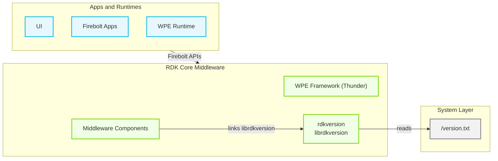
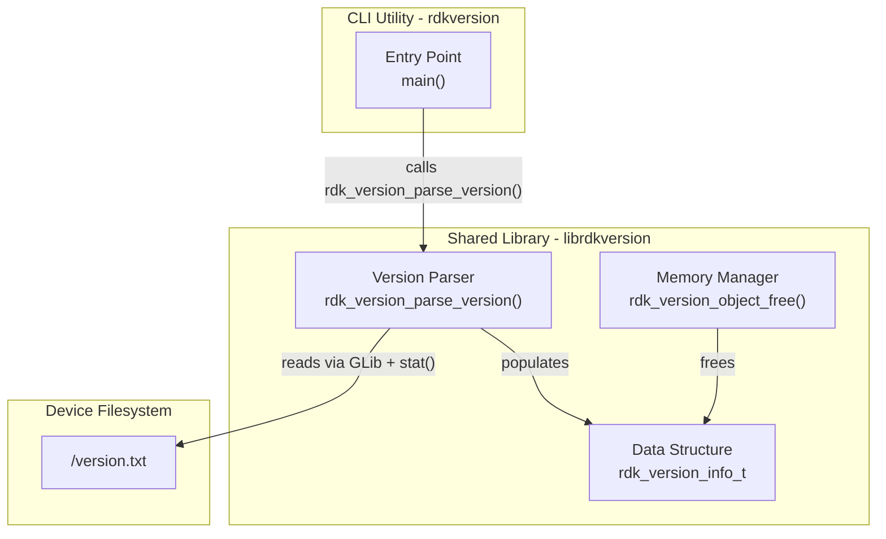
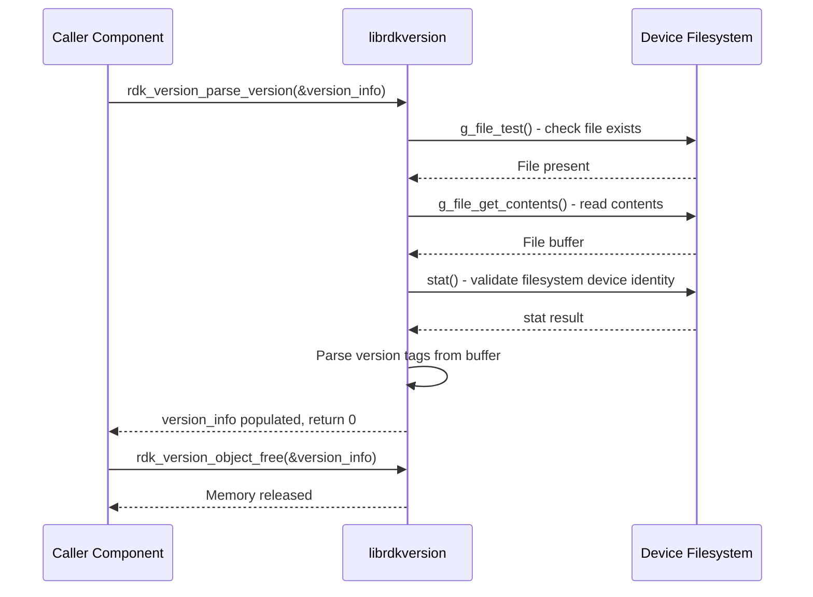
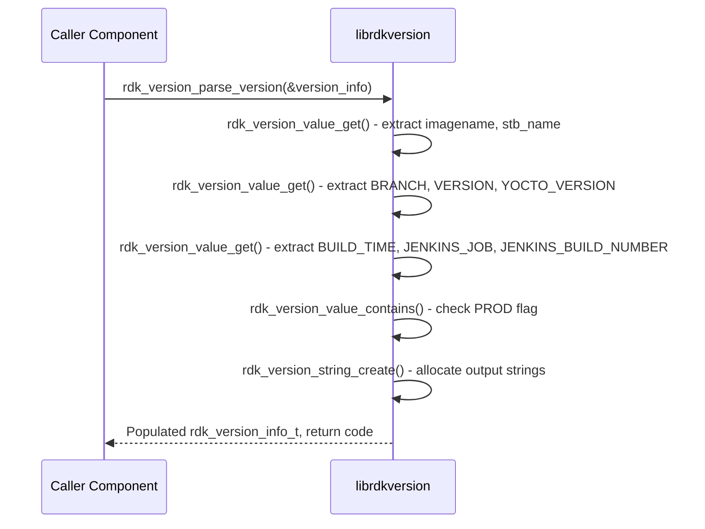
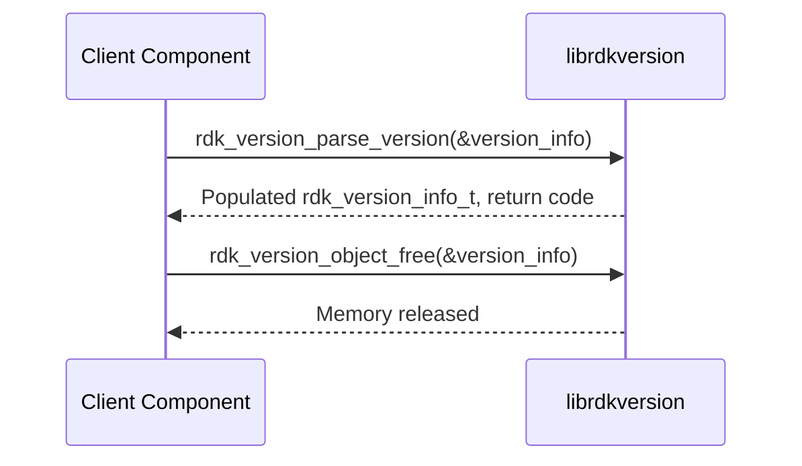

# rdkversion

rdkversion provides a shared library (`librdkversion`) and a command-line utility that expose the RDK software version information recorded on the device. The library reads a structured version manifest file from the device filesystem and parses it into a well-defined data structure, giving any component in the middleware stack a consistent and programmatic way to retrieve the current firmware image identity.

At the device level, rdkversion acts as the authoritative source for build identity. Middleware components and management agents that need to report firmware version, branch, or build provenance query the shared library directly, ensuring a consistent view of version data across the platform without duplicating parsing logic.

At the module level, the library exposes two functions: one to parse the version manifest and populate a typed data structure with all relevant version fields, and one to release the memory allocated during parsing. The command-line utility wraps this API to provide a shell-accessible interface for version queries by diagnostic tools and build scripts.

**Key Features & Responsibilities:**

- **Version Manifest Parsing**: Reads `/version.txt` and extracts structured version fields — image name, branch, version string, Yocto version, build timestamp, and CI job identity — into a single typed data object.
- **Production Build Detection**: Inspects the image name field for the `PROD` identifier to determine whether the running image is a production build, populating the `production_build` flag accordingly.
- **Mount-Point Validation**: Compares the `st_dev` fields of `/version.txt` and its parent directory via `stat()` to confirm the file resides on the same device as its parent, providing integrity assurance for the version data.
- **Shared Library API**: Delivers version data through a C-compatible API (`librdkversion`) that any middleware component can link against at build time.
- **Command-Line Utility**: Provides a lightweight binary (`rdkversion`) that prints the active version string to standard output, enabling shell-based diagnostic and scripting use cases.

---

## Design

rdkversion is designed as a stateless utility library with a minimal footprint. Each call to `rdk_version_parse_version()` performs a complete read-and-parse cycle on `/version.txt`, and all allocated memory is returned to the caller for explicit management via `rdk_version_object_free()`. The library uses GLib's file access utilities for file existence checks and content retrieval, while POSIX `stat()` provides filesystem-level mount-point validation. The parsing logic employs line-by-line key matching, anchoring each tag search to the start of a line so that tags sharing a common prefix — such as `VERSION` and `YOCTO_VERSION` — are correctly distinguished. Memory for each string field in the output structure is individually heap-allocated and ownership transfers to the caller on return.

The northbound interface is the C library API (`rdk_version_parse_version` and `rdk_version_object_free`), consumed by any component that links against `librdkversion`. The CLI utility (`rdkversion`) provides an additional northbound interface for shell-level consumers. The southbound interface is the device filesystem, specifically `/version.txt`.

All interactions are direct in-process function calls and filesystem reads, making the integration lightweight and straightforward for consumers.

The library allocates memory for each string field in `rdk_version_info_t` individually. Memory ownership transfers to the caller upon successful return from `rdk_version_parse_version()`, and the caller is responsible for invoking `rdk_version_object_free()` to release it. Each invocation is fully scoped, with all context and data lifetime tied to that specific call.

#### Threading Model

- **Threading Architecture**: Single-threaded
- **Main Thread**: Performs all file I/O, mount-point validation, and tag parsing synchronously within the `rdk_version_parse_version()` call.
- **Synchronization**: Each invocation operates on caller-provided stack-allocated storage and heap memory scoped entirely to that call.

### Prerequisites and Dependencies

#### Platform and Integration Requirements

- **Build Dependencies**: `glib-2.0` — used for file existence checks (`g_file_test`) and file content retrieval (`g_file_get_contents`); `gio-2.0` and `gobject-2.0` as transitive GLib runtime dependencies.

---

### Component State Flow

#### Initialization to Active State

rdkversion operates as a call-on-demand library rather than a long-running service. Invoking `rdk_version_parse_version()` with a caller-allocated `rdk_version_info_t` triggers the complete read-and-parse lifecycle. The library validates the file's existence, confirms the file resides on the same device as its parent directory, parses each version tag in sequence, and populates the output struct before returning control to the caller. On completion, the caller holds a fully populated version data object and is responsible for releasing it via `rdk_version_object_free()`.

#### Runtime State Changes

The component is invoked on demand and each call operates independently on the current state of `/version.txt`. If the version file is updated on the filesystem, the next call to `rdk_version_parse_version()` returns the updated values without requiring any reset or re-initialization.

**State Change Triggers:**

- A firmware update that replaces `/version.txt` causes subsequent calls to reflect the updated version fields immediately on the next invocation.
- If `/version.txt` is temporarily inaccessible or becomes a bind-mount, the library records a diagnostic message in the `parse_error` field and returns a non-zero status; the caller can inspect `parse_error` for the specific failure reason.

**Context Switching Scenarios:**

- Each call to `rdk_version_parse_version()` is fully independent, with all processing and allocated data scoped to that single invocation.

---

### Call Flows

#### Request Processing Call Flow

Once the file buffer is loaded, the library sequentially extracts each version tag and determines the production build flag before populating the output structure.

---

## Internal Modules

| Module / Class   | Description                                                                                                                                                                                                                           | Key Files                        |
| ---------------- | ------------------------------------------------------------------------------------------------------------------------------------------------------------------------------------------------------------------------------------- | -------------------------------- |
| `librdkversion`  | Shared library providing the version parsing API. Reads `/version.txt`, validates the file, extracts all version fields into `rdk_version_info_t`, and manages associated heap memory. Receives all input from the device filesystem. | `rdkversion.cpp`, `rdkversion.h` |
| `rdkversion` CLI | Command-line entry point that invokes `rdk_version_parse_version()` and prints the version string to standard output. Exits cleanly after printing, making it suitable for use in shell scripts.                                      | `main.c`                         |

---

---

## Component Interactions

### Interaction Matrix

| Target Component / Layer | Interaction Purpose                                 | Key APIs / Topics                                  |
| ------------------------ | --------------------------------------------------- | -------------------------------------------------- |
| **Device Filesystem**    |                                                     |                                                    |
| `/version.txt`           | Read version manifest to extract all version fields | `g_file_test()`, `g_file_get_contents()`, `stat()` |

### IPC Flow Patterns

**Primary Request / Response Flow:**

rdkversion is an in-process shared library. Callers invoke `rdk_version_parse_version()` as a direct function call. The library reads `/version.txt`, validates it, parses all version fields, and returns the result through the caller-provided `rdk_version_info_t` structure along with a return code indicating success or failure.

---

## Implementation Details

### Key Implementation Logic

- **State / Lifecycle Management**: Each call to `rdk_version_parse_version()` initializes the output struct with `bzero()`, performs all file reads and tag parsing, and returns a status code. Memory cleanup is the caller's responsibility via `rdk_version_object_free()`.
  - Core implementation: `rdkversion.cpp`

- **Error Handling Strategy**: Errors encountered during file access, mount-point validation, or tag parsing are recorded in the `parse_error` field of `rdk_version_info_t`. The function returns a non-zero status to signal that one or more fields may be missing or invalid. Partial results can coexist with error descriptions, allowing callers to inspect `parse_error` for diagnostics while still accessing any fields that were successfully parsed.
  - Core implementation: `rdkversion.cpp`

- **Logging & Diagnostics**: Diagnostic information is surfaced through the `parse_error` string field in `rdk_version_info_t` rather than a logging framework. This field carries a human-readable description of any file access or tag extraction failure encountered during a parse call.
