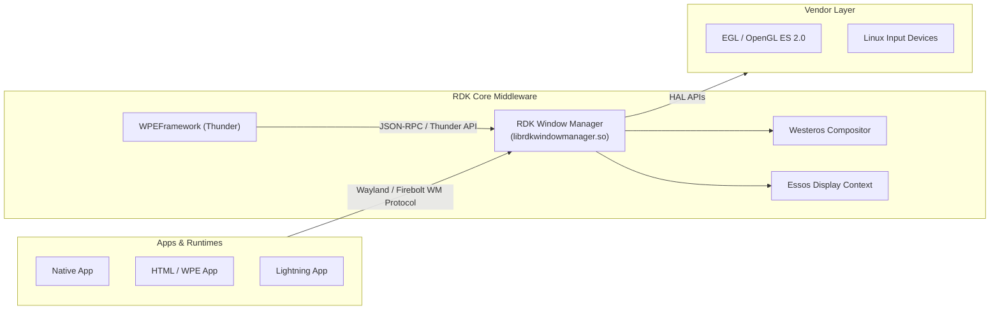
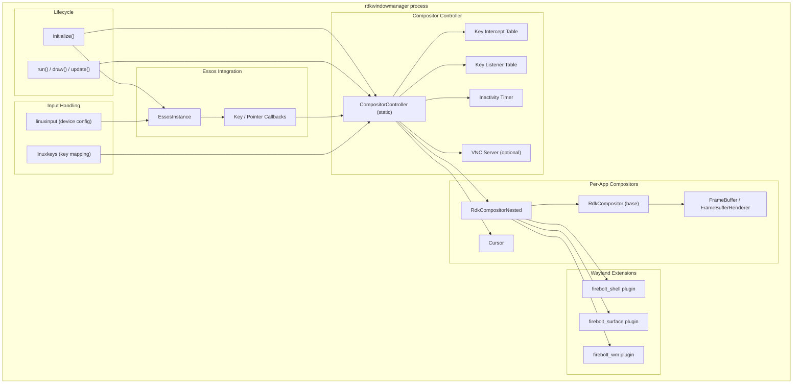
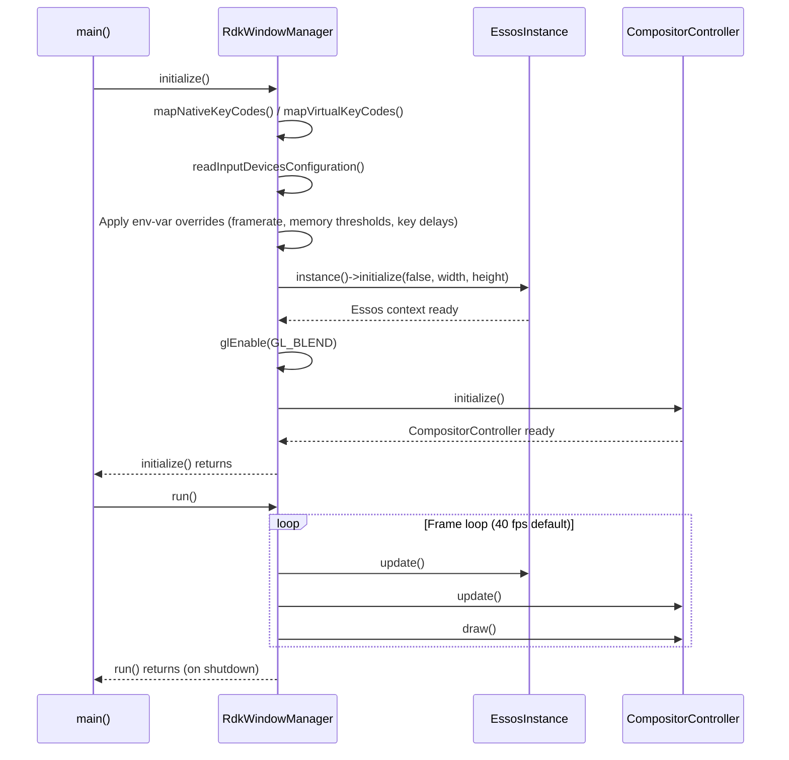
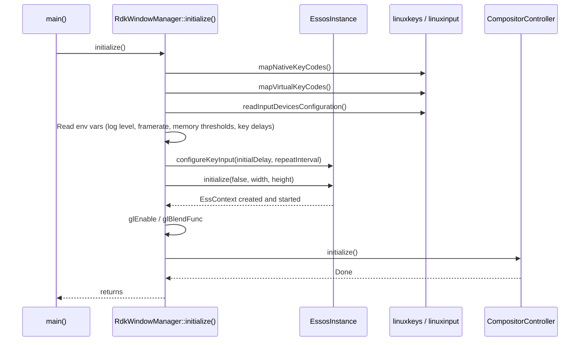
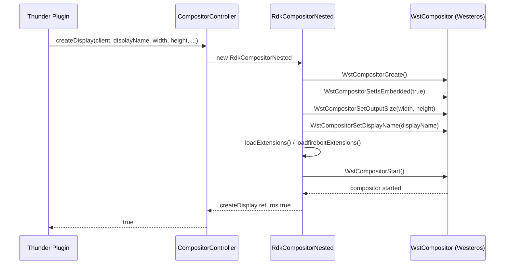
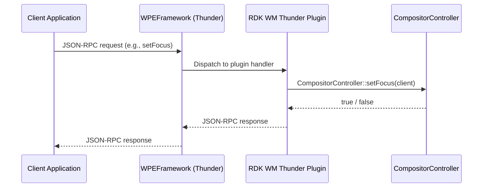
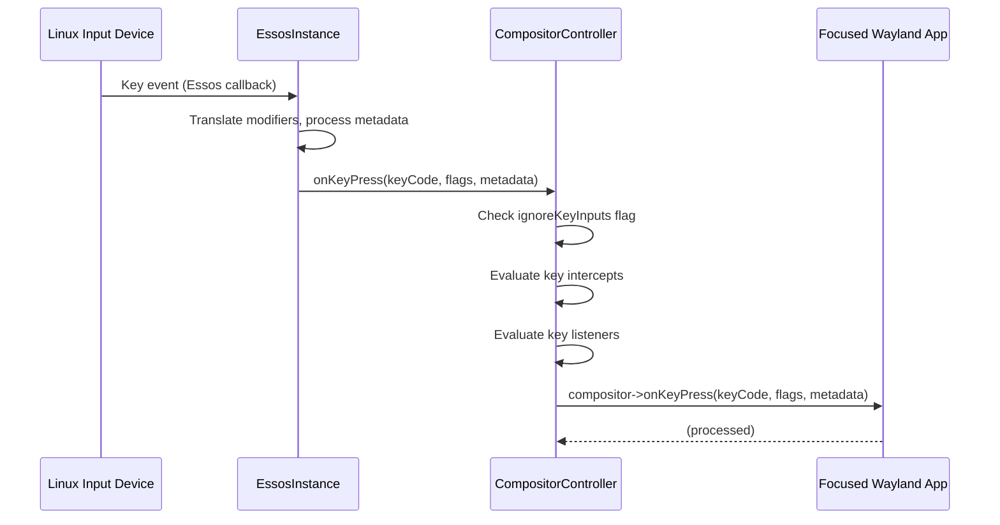
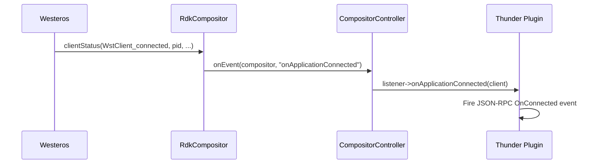

# RDK Window Manager

RDK Window Manager (rdkwindowmanager) is responsible for creating Wayland displays, compositing application surfaces, managing window properties, and handling input routing and focus on RDK video and entertainment devices. It depends on Westeros for Wayland compositor creation and Essos for display context management, and exposes its control surface as a Thunder plugin that clients reach through the Firebolt API layer.

RDK Window Manager is the display and input management layer within the RDK Core Middleware stack. It initialises a Westeros-backed Wayland compositor, allocates per-application display surfaces, composites those surfaces onto the screen using OpenGL ES 2.0, and routes key and pointer input from Linux input devices to the correct application. Window properties — position, size, opacity, z-order, visibility, and crop — are managed at runtime. An inactivity-detection mechanism monitors the elapsed time since the last key event and notifies subscribers when the device becomes idle.

The component ships three Wayland protocol extensions (`firebolt_shell`, `firebolt_surface`, `firebolt_wm`) that give Wayland clients direct access to surface creation and property control without requiring a Thunder round-trip. When enabled at build time, a VNC server provides remote frame-buffer access over a TCP connection.

From a device perspective the component acts as the single Wayland display server for all applications — native, HTML, and Lightning — and arbitrates which application receives keyboard focus at any given moment. It is consumed by the Thunder plugin that bridges higher-level Firebolt API calls down to the compositor.

**Key Features & Responsibilities:**

- **Wayland Display Creation**: Creates and manages per-application embedded Westeros compositor instances, assigns display names, and tracks client connection and disconnection lifecycle.
- **Surface Composition**: Composites multiple application surfaces onto the display each frame using OpenGL ES 2.0, respecting z-order, opacity, position, size, and crop parameters for each surface.
- **Input Routing and Focus Management**: Receives key and pointer events from Essos, maps Linux/Wayland key codes to RDK virtual key codes, and dispatches events to the focused application or to registered key intercept and listener handlers.
- **Key Intercept and Listener Registration**: Allows applications to register intercepts for specific key codes — with optional focus-only and propagation modes — and listeners that can activate or suppress key propagation.
- **Inactivity Reporting**: Tracks elapsed time since the last key event and fires an inactivity notification to registered listeners once the configurable threshold is exceeded.
- **Firebolt Wayland Extensions**: Provides `firebolt_shell`, `firebolt_surface`, and `firebolt_wm` Westeros protocol plugins that give Wayland clients fine-grained surface management without a Thunder round-trip.
- **VNC Remote Access**: Optionally starts a TCP-based VNC server that captures the current frame buffer and serves it to remote clients (enabled at build time via `RDK_WINDOW_MANAGER_VNC_SERVER`).
- **Input Device Classification**: Reads a JSON configuration file to classify attached Linux input devices by vendor, product, and device type, allowing key metadata to carry device-type information to applications.
- **Memory Monitoring**: Monitors system RAM and swap usage against configurable thresholds, emitting low-memory and critically-low-memory notifications when limits are crossed.

---

## Design

RDK Window Manager is designed as a standalone process (`rdkwindowmanager`) that owns the Wayland display server role entirely. Its architecture separates concerns across five focused layers: initialisation and lifecycle (`RdkWindowManager` namespace), Essos context and input ingestion (`EssosInstance`), compositor creation and per-client surface management (`RdkCompositor` / `RdkCompositorNested`), the orchestration and routing logic that operates across all active compositors (`CompositorController`), and the Wayland extension plugins (`firebolt_shell`, `firebolt_surface`, `firebolt_wm`). Each layer communicates through well-defined C++ interfaces, and the component exposes its full north-bound API as a C++ shared library (`librdkwindowmanager.so`) linked by the Thunder plugin.

Northbound interaction is through the Thunder JSON-RPC interface exposed by the companion Thunder plugin. That plugin forwards calls directly to `CompositorController` static methods. The Wayland extension layer provides an orthogonal northbound path: Wayland clients load the extension protocols and communicate directly with the window manager process over the existing Wayland socket, bypassing Thunder entirely for performance-sensitive surface property updates.

Southbound, the component binds to Essos for display context initialisation and key/pointer event delivery, and to Westeros for embedded compositor creation (`WstCompositorCreate`, `WstCompositorStart`, and associated callbacks). OpenGL ES 2.0 is used directly for off-screen frame buffer rendering and final composition. Linux input devices are enumerated and classified through a JSON configuration file parsed by `RdkWindowManagerJson`, and raw Wayland key codes are translated to RDK virtual key codes by `linuxkeys`.

IPC between the Thunder plugin and the window manager process is through the shared library interface (`librdkwindowmanager.so`). Communication between the window manager and Wayland client applications is through the standard Wayland socket protocol, extended by the three Firebolt Westeros protocol plugins.

Runtime state — including window property changes, focus assignments, and key intercept registrations — is held in process memory for the duration of the session.

### Threading Model

- **Threading Architecture**: Multi-threaded.
- **Main Thread**: Runs the `RdkWindowManager::run()` loop, calling `EssosInstance::update()`, `CompositorController::update()`, and `CompositorController::draw()` at the configured frame rate (default 40 fps, overridable via `RDK_WINDOW_MANAGER_FRAMERATE`). All Westeros callbacks and key-event processing also execute on this thread.
- **Worker Threads**:
  - _Application launch thread_: Each `RdkCompositor` can spawn a background thread via `launchApplicationInBackground()` to start the associated application process without blocking the main loop.
  - _VNC GMainLoop thread_ (when `RDK_WINDOW_MANAGER_VNC_SERVER` is enabled): `VncServer` runs a GLib main loop on a dedicated thread to serve VNC TCP connections.
- **Synchronization**: A `std::mutex` (`gFireboltExtensionListenerMapMutex`) guards the Firebolt extension event listener map. `RdkCompositor` uses `mInputLock` and `mStateChangeLock` mutexes to protect its input-listener and state-change-listener maps. `FireboltWindowManager` and `FireboltShell` each hold a `mContextLock` mutex protecting their per-compositor client maps.
- **Async / Event Dispatch**: Essos delivers key and pointer callbacks synchronously on the main thread. Application lifecycle events (connect, disconnect, terminate) are dispatched from Westeros `WstClient_*` status callbacks, also on the main thread, and forwarded to registered `RdkWindowManagerEventListener` implementations.

### Platform and Integration Requirements

- **Build Dependencies**: `westeros`, `wayland`, `essos`, `virtual/egl`, `rapidjson`, `jpeg`, `libpng`, `curl`. When `RDK_WINDOW_MANAGER_VNC_SERVER=ON`: additionally `libsoup-2.4`, `boost`, `libsyswrapper`. When `BUILD_ENABLE_ERM`: additionally `essos-resmgr`.
- **Wayland Protocol Extensions**: `firebolt_shell`, `firebolt_surface`, and `firebolt_wm` protocol XML files are compiled into server-side Westeros plugins (`libwstplugin_rdkwmfirebolt*.so`) and client-side shared libraries (`librdkwmext*.so`). Extensions are loaded from the path defined by `RDK_WINDOW_MANAGER_WESTEROS_PLUGIN_DIRECTORY` (default `/usr/lib/plugins/westeros/`).
- **Configuration Files**: Input device type configuration file path supplied through `RDK_WINDOW_MANAGER_INPUT_DEVICES_CONFIG`. Splash screen suppression: presence of `/tmp/.rdkwindowmanagersplash` controls splash rendering.
- **Startup Order**: The `rdkwindowmanager` executable must be started before any Wayland client applications attempt to connect.

---

### Component State Flow

#### Initialization to Active State

The component progresses from system start through Essos and Westeros initialisation before entering its render and event loop.

The component transitions through the following states during its lifecycle: **Initializing** (configure logging, read key mappings, read input device config, apply environment-variable overrides) → **DisplaySetup** (initialise Essos context at target resolution) → **CompositorReady** (`CompositorController::initialize()` called, OpenGL blend state configured) → **Active** (frame-rate render loop running, key and pointer events dispatched) → **Shutdown** (loop exits, resources released).

#### Runtime State Changes

Application connection and disconnection events arrive through Westeros `WstClient_*` callbacks and are forwarded to registered `RdkWindowManagerEventListener` instances. Focus changes are driven by explicit `CompositorController::setFocus()` calls from the Thunder plugin. Inactivity detection runs inside `CompositorController::update()`: when `gEnableInactivityReporting` is true and the time since the last key event exceeds `gInactivityIntervalInSeconds`, `onUserInactive` is fired on the registered listener.

**State Change Triggers:**

- A new Wayland client connecting fires `onApplicationConnected`; disconnection fires `onApplicationDisconnected`.
- Receipt of the first rendered frame from a client fires `onReady`.
- Time elapsed without key input exceeding `gInactivityIntervalInSeconds` fires `onUserInactive`.
- Visibility changes (set via `CompositorController::setVisibility()`) fire `onApplicationVisible` or `onApplicationHidden`.
- Focus assignment via `CompositorController::setFocus()` fires `onApplicationFocus` on the newly focused client and `onApplicationBlur` on the previously focused one.

**Context Switching Scenarios:**

- When `ignoreKeyInputs(true)` is active, all key events are dropped before reaching the intercept or listener evaluation logic.
- Key intercept entries marked `focusOnly=true` suppress delivery to non-focused applications.
- Topmost compositor entries (stored in `gTopmostCompositorList`) are evaluated independently from the standard compositor list, allowing system overlays to receive input regardless of normal focus order.

---

### Call Flows

#### Initialization Call Flow

#### Request Processing Call Flow

The following illustrates `CreateDisplay` — the most common setup call — flowing from the Thunder plugin down through `CompositorController` to the Westeros-backed nested compositor. The component validates the provided parameters before forwarding the request, and propagates the Westeros API result back to the caller as a boolean response.

---

## Internal Modules

| Module / Class                        | Description                                                                                                                                                                                                                                                                                                                                                        | Key Files                                                                                                      |
| ------------------------------------- | ------------------------------------------------------------------------------------------------------------------------------------------------------------------------------------------------------------------------------------------------------------------------------------------------------------------------------------------------------------------ | -------------------------------------------------------------------------------------------------------------- |
| `RdkWindowManager` namespace          | Top-level lifecycle: `initialize()` applies environment-variable configuration, sets up Essos, configures OpenGL blend state, and calls `CompositorController::initialize()`. `run()` drives the frame loop.                                                                                                                                                       | `src/rdkwindowmanager.cpp`, `include/rdkwindowmanager.h`                                                       |
| `EssosInstance`                       | Wraps the Essos display context (`EssContext*`). Owns key and pointer event callbacks from Essos and forwards them to `CompositorController`. Manages resolution, key-repeat configuration, and AV blocking (when ERM is enabled).                                                                                                                         | `src/essosinstance.cpp`, `include/essosinstance.h`                                                             |
| `CompositorController`                | Static class providing the full public API: display creation, focus, z-order, bounds, opacity, visibility, key intercepts, key listeners, inactivity reporting, cursor control, screenshot, VNC server lifecycle, and Firebolt surface management. Maintains the ordered compositor lists (`gCompositorList`, `gTopmostCompositorList`) and the key intercept map. | `src/compositorcontroller.cpp`, `include/compositorcontroller.h`                                               |
| `RdkCompositor`                       | Abstract base class for a per-application Westeros compositor instance. Manages the `WstCompositor` context, draw/update cycle, input forwarding, surface properties (position, size, opacity, z-order, visibility, crop), Firebolt surface list, and application process lifecycle.                                                                               | `src/rdkcompositor.cpp`, `include/rdkcompositor.h`                                                             |
| `RdkCompositorNested`                 | Concrete subclass of `RdkCompositor` that creates a nested (embedded) Westeros display. Loads Westeros protocol extension plugins and starts the compositor.                                                                                                                                                                                                       | `src/rdkcompositornested.cpp`, `include/rdkcompositornested.h`                                                 |
| `FrameBuffer` / `FrameBufferRenderer` | Off-screen render target (OpenGL FBO + texture) and the GLSL shader program that blits a frame buffer onto the screen with alpha blending, matrix transform, and crop support.                                                                                                                                                                                     | `src/framebuffer.cpp`, `src/framebufferrenderer.cpp`, `include/framebuffer.h`, `include/framebufferrenderer.h` |
| `Cursor`                              | Manages loading, positioning, showing/hiding, and drawing a cursor image on screen. Supports configurable inactivity-based auto-hide.                                                                                                                                                                                                                              | `src/cursor.cpp`, `include/cursor.h`                                                                           |
| `linuxkeys`                           | Provides `mapNativeKeyCodes()`, `mapVirtualKeyCodes()`, and `keyCodeFromWayland()` to translate raw Wayland/Linux key codes and modifier flags to RDK virtual key codes.                                                                                                                                                                                           | `src/linuxkeys.cpp`, `include/linuxkeys.h`                                                                     |
| `linuxinput`                          | Reads the JSON input device configuration file (path from `RDK_WINDOW_MANAGER_INPUT_DEVICES_CONFIG`) and populates the device-type and device-mode tables used by the key-metadata path.                                                                                                                                                                           | `src/linuxinput.cpp`, `include/linuxinput.h`                                                                   |
| `RdkWindowManagerJson`                | Thin wrapper around RapidJSON for reading JSON configuration files from disk.                                                                                                                                                                                                                                                                                      | `src/rdkwindowmanagerjson.cpp`, `include/rdkwindowmanagerjson.h`                                               |
| `Image`                               | Loads JPEG, PNG, and BMP images from disk or raw data using libjpeg and libpng, creates an OpenGL texture, and renders it with a GLSL shader. Used for watermarks and the splash screen.                                                                                                                                                                           | `src/rdkwindowmanagerimage.cpp`, `include/rdkwindowmanagerimage.h`                                             |
| `Logger`                              | Lightweight, level-filtered logger (`Debug`, `Information`, `Warn`, `Error`, `Fatal`). Log level is runtime-configurable via `RDK_WINDOW_MANAGER_LOG_LEVEL`. When built with `RDK_WINDOW_MANAGER_LOGGER`, output goes to `/opt/logs/rdkwindowmanager.log`.                                                                                                         | `src/logger.cpp`, `include/logger.h`                                                                           |
| `firebolt_shell` extension            | Westeros plugin implementing the `firebolt_shell` Wayland protocol. Handles `get_firebolt_surface` requests from Wayland clients, forwarding surface-ID and type information to `CompositorController`.                                                                                                                                                            | `extensions/firebolt_shell/src/firebolt_shell.cpp`, `extensions/firebolt_shell/include/firebolt_shell.h`       |
| `firebolt_surface` extension          | Westeros plugin implementing the `firebolt_surface` protocol: destroy, set_name, set_visible, set_bounds, set_crop, set_zorder, set_opacity.                                                                                                                                                                                                                       | `extensions/firebolt_surface/src/`, `extensions/firebolt_surface/include/`                                     |
| `firebolt_wm` extension               | Westeros plugin implementing the `firebolt_wm` protocol for full surface management (create, create_with_bounds, create_with_properties, destroy, set_properties, set_client_bounds, set_client_display_bounds, set_client_focus, get_properties, get_focused_client, get_clients, set_owner, get_owner) and associated events.                                    | `extensions/firebolt_wm/src/firebolt_wm.cpp`, `extensions/firebolt_wm/include/firebolt_wm.h`                   |
| `VncServer` (optional)                | TCP VNC server built on libsoup. Captures the compositor frame buffer into a `VncFrameBuffer` and serves it to connecting `VncClient` instances. Enabled only when `RDK_WINDOW_MANAGER_VNC_SERVER=ON`.                                                                                                                                                   | `src/VncServer/`, `include/VncServer/`                                                                         |

---

## Component Interactions

### Interaction Matrix

| Target Component / Layer         | Interaction Purpose                                                                                                       | Key APIs / Topics                                                                                                                                                                                                                                                                                  |
| -------------------------------- | ------------------------------------------------------------------------------------------------------------------------- | -------------------------------------------------------------------------------------------------------------------------------------------------------------------------------------------------------------------------------------------------------------------------------------------------- |
| **Westeros Compositor**          | Create, configure, and start per-application embedded Wayland compositors; receive client-status and invalidate callbacks | `WstCompositorCreate()`, `WstCompositorStart()`, `WstCompositorSetIsEmbedded()`, `WstCompositorSetOutputSize()`, `WstCompositorSetDisplayName()`, `WstCompositorSetInvalidateCallback()`, `WstCompositorSetClientStatusCallback()`, `WstCompositorSetDispatchCallback()`, `WstCompositorDestroy()` |
| **Essos**                        | Obtain display context, receive key and pointer events, manage resolution, control key repeats, block AV by app           | `EssContextCreate()`, `EssContextSetKeyListener()`, `EssContextSetPointerListener()`, `EssContextGetDisplaySize()`, `EssContextUpdateDisplay()`, `EssContextRunEventLoopOnce()`                                                                                                                                                                               |
| **Essos Resource Manager (ERM)** | Resource management and AV block/unblock per application (optional, enabled by `BUILD_ENABLE_ERM`)                        | `essos-resmgr` API, `EssRMgr` context                                                                                                                                                                                                                                                              |
| **Thunder Plugin**               | Receive JSON-RPC control calls and forward to `CompositorController`; publish events back to Thunder clients              | `librdkwindowmanager.so` — `CompositorController` static methods                                                                                                                                                                                                                                   |
| **Wayland Client Applications**  | Deliver key/pointer events; notify of display size changes; receive connect/disconnect lifecycle events                   | Wayland socket protocol; `firebolt_wm`, `firebolt_shell`, `firebolt_surface` protocol extensions                                                                                                                                                                                                   |
| **OpenGL ES 2.0 / EGL**          | Off-screen frame buffer rendering, texture blit, alpha blending                                                           | `glEnable`, `glBlendFunc`, `glUseProgram`, `glDrawArrays`, `glUniform*`, FBO management                                                                                                                                                                                                            |
| **libjpeg / libpng**             | Decode image assets (watermarks, splash screen, cursor)                                                                   | `loadJpeg()`, `loadPng()` in `rdkwindowmanagerimage.cpp`                                                                                                                                                                                                                                           |
| **RapidJSON**                    | Parse input-device configuration JSON                                                                                     | `RdkWindowManagerJson::readJsonFile()`                                                                                                                                                                                                                                                             |
| **libsoup / GLib** (optional)    | TCP server for VNC remote access                                                                                          | `VncSoupTcpServer`, GLib `GMainLoop`                                                                                                                                                                                                                                                               |

### Events Published

| Event Name                  | Topic                                                             | Trigger Condition                                                                     | Subscriber                                                                                |
| --------------------------- | ----------------------------------------------------------------- | ------------------------------------------------------------------------------------- | ----------------------------------------------------------------------------------------- |
| `onApplicationConnected`    | `RDK_WINDOW_MANAGER_EVENT_APPLICATION_CONNECTED`                  | Westeros client connects to a display                                                 | Thunder plugin / `RdkWindowManagerEventListener`                                          |
| `onApplicationDisconnected` | `RDK_WINDOW_MANAGER_EVENT_APPLICATION_DISCONNECTED`               | Westeros client disconnects from a display                                            | Thunder plugin / `RdkWindowManagerEventListener`                                          |
| `onApplicationTerminated`   | `RDK_WINDOW_MANAGER_EVENT_APPLICATION_TERMINATED`                 | Application process exits                                                             | Thunder plugin / `RdkWindowManagerEventListener`                                          |
| `onReady`                   | `RDK_WINDOW_MANAGER_EVENT_APPLICATION_FIRST_FRAME`                | First frame rendered for a client                                                     | Thunder plugin / `RdkWindowManagerEventListener`                                          |
| `onUserInactive`            | `RDK_WINDOW_MANAGER_EVENT_USER_INACTIVE`                          | No key event for `gInactivityIntervalInSeconds` while inactivity reporting is enabled | Thunder plugin / `RdkWindowManagerEventListener`                                          |
| `onApplicationVisible`      | `RDK_WINDOW_MANAGER_EVENT_APPLICATION_VISIBLE`                    | Visibility set to true for a client                                                   | Thunder plugin / `RdkWindowManagerEventListener`                                          |
| `onApplicationHidden`       | `RDK_WINDOW_MANAGER_EVENT_APPLICATION_HIDDEN`                     | Visibility set to false for a client                                                  | Thunder plugin / `RdkWindowManagerEventListener`                                          |
| `onApplicationFocus`        | `RDK_WINDOW_MANAGER_EVENT_APPLICATION_FOCUS`                      | Focus assigned to a client                                                            | Thunder plugin / `RdkWindowManagerEventListener` / `firebolt_wm` (`focused_client` event) |
| `onApplicationBlur`         | `RDK_WINDOW_MANAGER_EVENT_APPLICATION_BLUR`                       | Focus removed from a client                                                           | Thunder plugin / `RdkWindowManagerEventListener` / `firebolt_wm`                          |
| `client_connected`          | `RDK_WINDOW_MANAGER_FIREBOLT_EXTENSION_EVENT_CLIENT_CONNECTED`    | Wayland client connects (Firebolt WM extension path)                                  | `firebolt_wm` Wayland clients                                                             |
| `client_disconnected`       | `RDK_WINDOW_MANAGER_FIREBOLT_EXTENSION_EVENT_CLIENT_DISCONNECTED` | Wayland client disconnects (Firebolt WM extension path)                               | `firebolt_wm` Wayland clients                                                             |

### IPC Flow Patterns

**Primary Request / Response Flow (Thunder JSON-RPC to CompositorController):**

The Thunder plugin receives a JSON-RPC request, validates parameters, and calls the corresponding `CompositorController` static method directly through the shared library interface. The method return value or output parameter is converted back to a JSON-RPC response.

**Key Event Flow (Essos to CompositorController to Application):**

**Event Notification Flow (Westeros client lifecycle to Thunder plugin):**

---

## Implementation Details

### Major HAL APIs Integration

| HAL / API                                                                    | Purpose                                                                       | Implementation File                                                                        |
| ---------------------------------------------------------------------------- | ----------------------------------------------------------------------------- | ------------------------------------------------------------------------------------------ |
| `WstCompositorCreate()`                                                      | Allocate a new Westeros compositor context                                    | `src/rdkcompositornested.cpp`                                                              |
| `WstCompositorSetIsEmbedded()`                                               | Configure compositor as an embedded (nested) display                          | `src/rdkcompositornested.cpp`                                                              |
| `WstCompositorSetOutputSize()`                                               | Set the output resolution of the compositor                                   | `src/rdkcompositornested.cpp`                                                              |
| `WstCompositorSetDisplayName()`                                              | Assign a Wayland display name to the compositor                               | `src/rdkcompositornested.cpp`                                                              |
| `WstCompositorSetInvalidateCallback()`                                       | Register invalidate (repaint request) callback                                | `src/rdkcompositornested.cpp`                                                              |
| `WstCompositorSetClientStatusCallback()`                                     | Register client connect/disconnect/terminate callback                         | `src/rdkcompositornested.cpp`                                                              |
| `WstCompositorSetDispatchCallback()`                                         | Register display-size-change dispatch callback                                | `src/rdkcompositornested.cpp`                                                              |
| `WstCompositorStart()`                                                       | Start the Westeros compositor and its Wayland socket                          | `src/rdkcompositornested.cpp`                                                              |
| `WstCompositorDestroy()`                                                     | Release a Westeros compositor context                                         | `src/rdkcompositor.cpp`                                                                    |
| `WstCompositorGetDisplayName()`                                              | Retrieve the auto-assigned Wayland display name                               | `src/rdkcompositornested.cpp`                                                              |
| Essos context APIs                                                           | Initialise display context, register key/pointer listeners, update event loop | `src/essosinstance.cpp`                                                                    |
| GLES2 draw calls (`glEnable`, `glBlendFunc`, `glUseProgram`, `glDrawArrays`) | Configure alpha blending; render compositor surfaces and images to screen     | `src/rdkwindowmanager.cpp`, `src/framebufferrenderer.cpp`, `src/rdkwindowmanagerimage.cpp` |

### Key Implementation Logic

- **State / Lifecycle Management**: Application state per compositor (`Unknown`, `Running`, `Suspended`, `Stopped`) is tracked in `RdkCompositor::mApplicationState`. Transitions are driven by `WstClient_*` status codes received in `RdkCompositor::onClientStatus()`. The global flag `gRdkWindowManagerIsRunning` controls the main frame loop.
  - Core lifecycle: `src/rdkwindowmanager.cpp`
  - Per-compositor state: `src/rdkcompositor.cpp`

- **Event Processing**: Essos key callbacks (`processKeyEvent` in `essosinstance.cpp`) translate raw Wayland key codes using `keyCodeFromWayland()`, pack modifier flags, and call `CompositorController::onKeyPress` / `onKeyRelease`. `CompositorController` first checks `gIgnoreKeyInputEnabled`, then evaluates the key-intercept map (`gKeyInterceptInfoMap`), and finally dispatches to the focused compositor or evaluates the key-listener table for each matching compositor. Key-repeat generation is handled in `CompositorController::update()` using `gKeyRepeatConfig`.

- **Error Handling Strategy**: Westeros API failures are logged at `Information` level and propagate as `bool` return values from `createDisplay()`. A failure at any Westeros setup step sets a local `error` flag that causes `createDisplay` to return `false`, which the caller (Thunder plugin) maps to a JSON-RPC error response.

- **Logging & Diagnostics**: Log output uses the `RdkWindowManager::Logger` class. Log levels: `Debug`, `Information`, `Warn`, `Error`, `Fatal`. Runtime log level is set via the `RDK_WINDOW_MANAGER_LOG_LEVEL` environment variable. When built with `RDK_WINDOW_MANAGER_LOGGER`, log output is written to `/opt/logs/rdkwindowmanager.log`.

---

## Configuration

### Key Configuration Files

| Configuration File                                  | Purpose                                                                                                        | Override Mechanism                    |
| --------------------------------------------------- | -------------------------------------------------------------------------------------------------------------- | ------------------------------------- |
| Path from `RDK_WINDOW_MANAGER_INPUT_DEVICES_CONFIG` | JSON file mapping input device vendor/product IDs to device type and mode, used to annotate key-press metadata | Environment variable at process start |

### Key Configuration Parameters

| Parameter                                            | Type           | Default                      | Description                                                                                                    |
| ---------------------------------------------------- | -------------- | ---------------------------- | -------------------------------------------------------------------------------------------------------------- |
| `RDK_WINDOW_MANAGER_FRAMERATE`                       | int            | `40`                         | Target render frames per second for the main compositor loop.                                                  |
| `RDK_WINDOW_MANAGER_LOW_MEMORY_THRESHOLD`            | double (MB)    | `200`                        | RAM level below which a low-memory notification is emitted.                                                    |
| `RDK_WINDOW_MANAGER_CRITICALLY_LOW_MEMORY_THRESHOLD` | double (MB)    | `100`                        | RAM level below which a critically-low-memory notification is emitted.                                         |
| `RDK_WINDOW_MANAGER_SWAP_MEMORY_INCREASE_THRESHOLD`  | double (MB)    | `50`                         | Swap increase (MB per interval) above which a swap-growth notification is emitted.                             |
| `RDK_WINDOW_MANAGER_KEY_INITIAL_DELAY`               | int (ms)       | `500`                        | Delay before key-repeat begins, forwarded to Essos.                                                            |
| `RDK_WINDOW_MANAGER_KEY_REPEAT_INTERVAL`             | int (ms)       | `100`                        | Interval between repeated key events while a key is held.                                                      |
| `RDK_WINDOW_MANAGER_LOG_LEVEL`                       | string         | `Information`                | Runtime log level (`Debug`, `Information`, `Warn`, `Error`, `Fatal`).                                          |
| `RDK_WINDOW_MANAGER_SET_GRAPHICS_720`                | string (`"1"`) | unset                        | Force graphics resolution to 1280×720 instead of 1920×1080. Requires `RDK_WINDOW_MANAGER_BUILD_FORCE_1080=ON`. |
| `RDK_WINDOW_MANAGER_INPUT_DEVICES_CONFIG`            | string (path)  | unset                        | Path to the JSON input-device classification configuration file.                                               |
| `RDK_WINDOW_MANAGER_WESTEROS_PLUGIN_DIRECTORY`       | string (path)  | `/usr/lib/plugins/westeros/` | Directory from which Westeros extension plugins are loaded.                                                    |

### Runtime Configuration

The render frame rate and memory thresholds are configured through environment variables read at process startup. Key-intercept and key-listener registrations, focus assignments, visibility, opacity, z-order, and bounds are adjustable at runtime through the `CompositorController` API, surfaced via the Thunder plugin JSON-RPC interface.

### Build-Time Configuration Flags

The following flags are defined in `CMakeLists.txt` and control compiled-in feature availability:

| Flag                                                                | Default                                   | Effect                                                                                                    |
| ------------------------------------------------------------------- | ----------------------------------------- | --------------------------------------------------------------------------------------------------------- |
| `RDK_WINDOW_MANAGER_VNC_SERVER`                                     | `OFF` (prod), `ON` (non-prod via bb file) | Builds the VNC server (libsoup/GLib/Boost required).                                                      |
| `RDK_WINDOW_MANAGER_BUILD_EXTENSIONS`                               | `ON`                                      | Enables compilation of `firebolt_shell`, `firebolt_surface`, and `firebolt_wm` Wayland extension plugins. |
| `RDK_WINDOW_MANAGER_BUILD_FORCE_1080`                               | `ON`                                      | Enables 1080p/720p forced-resolution logic at startup.                                                    |
| `RDK_WINDOW_MANAGER_BUILD_KEY_METADATA`                             | `OFF`                                     | Enables key-press metadata (device-type, device-mode info) propagation to applications.                   |
| `RDK_WINDOW_MANAGER_BUILD_HIDDEN_SUPPORT`                           | `OFF`                                     | Enables hidden-surface support.                                                                           |
| `RDK_WINDOW_MANAGER_BUILD_KEYBUBBING_TOP_MODE`                      | `ON`                                      | Enables key-bubbling-to-topmost-compositor mode.                                                          |
| `RDK_WINDOW_MANAGER_BUILD_ENABLE_KEYREPEATS`                        | `OFF`                                     | Enables built-in key-repeat delivery.                                                                     |
| `RDK_WINDOW_MANAGER_BUILD_EXTERNAL_APPLICATION_SURFACE_COMPOSITION` | `ON`                                      | Enables external application surface composition path.                                                    |
| `BUILD_ENABLE_ERM`                                                  | unset                                     | Enables Essos Resource Manager integration for AV blocking.                                               |

