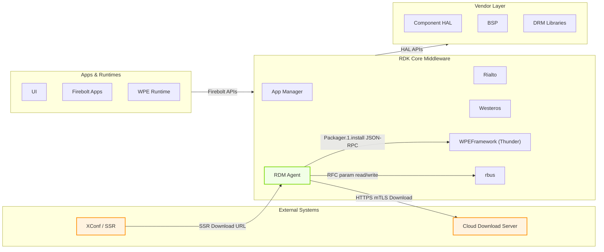
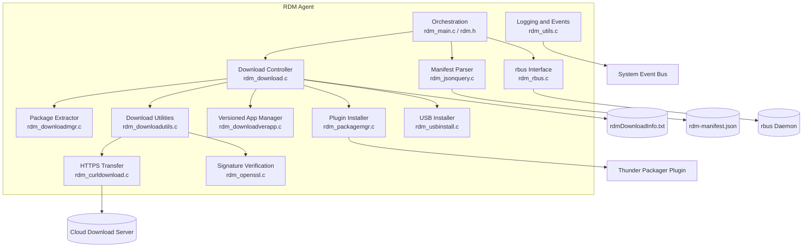
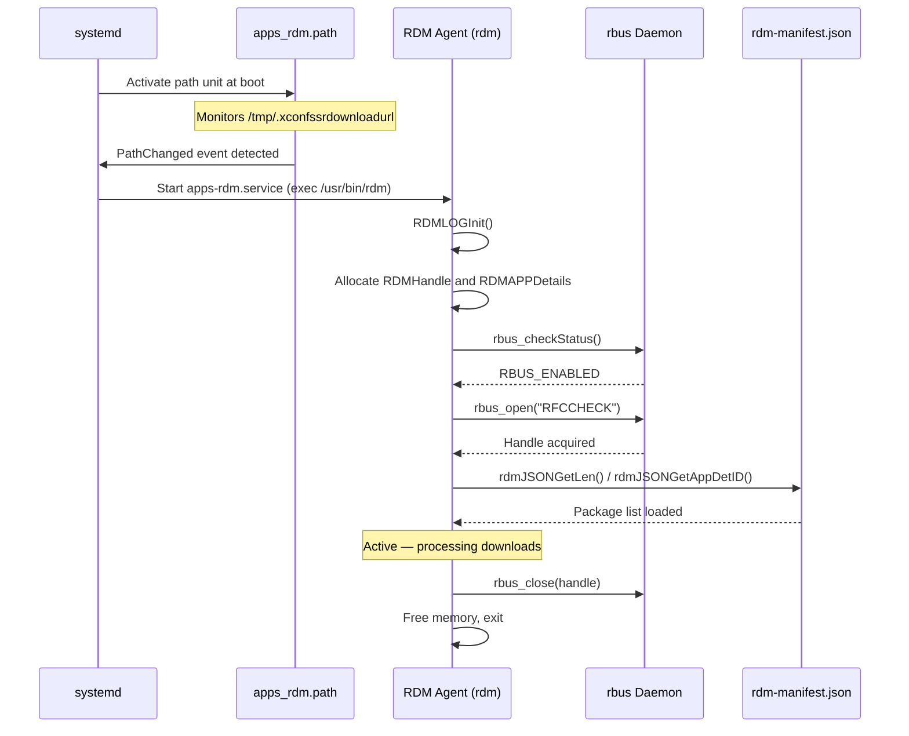
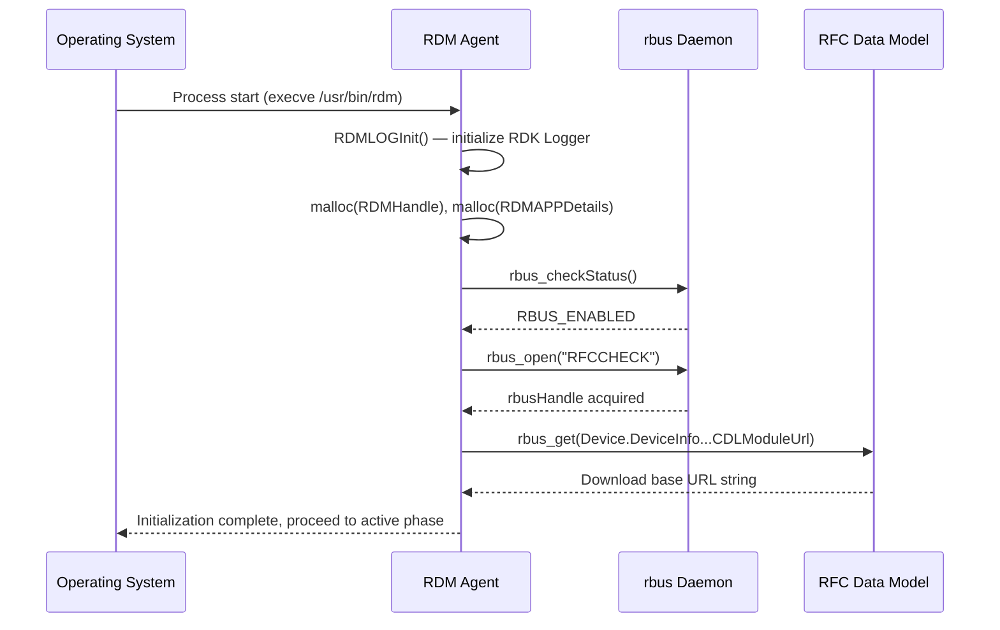
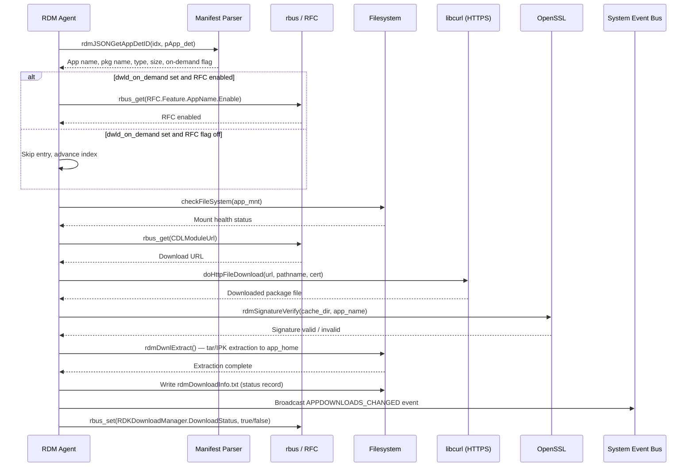
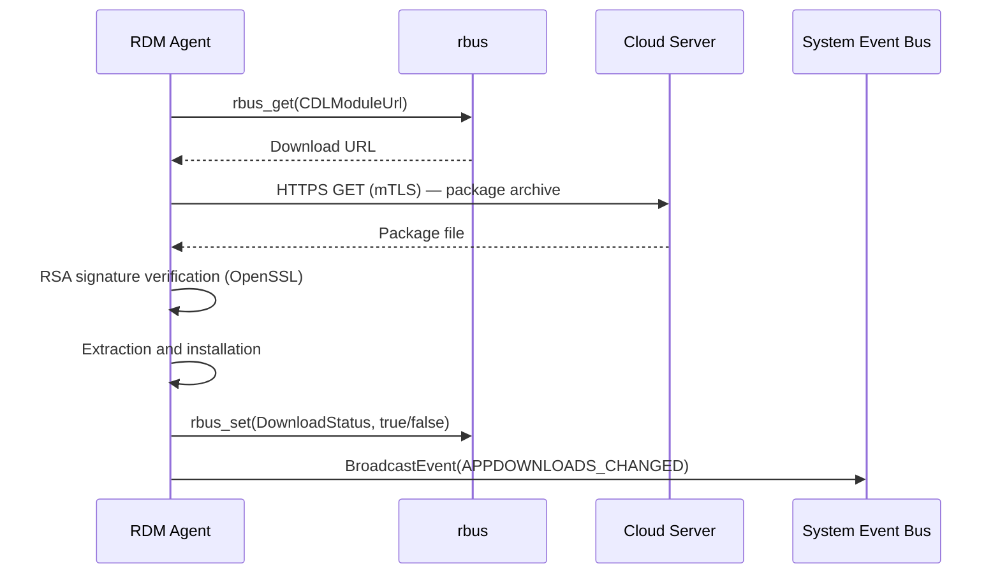
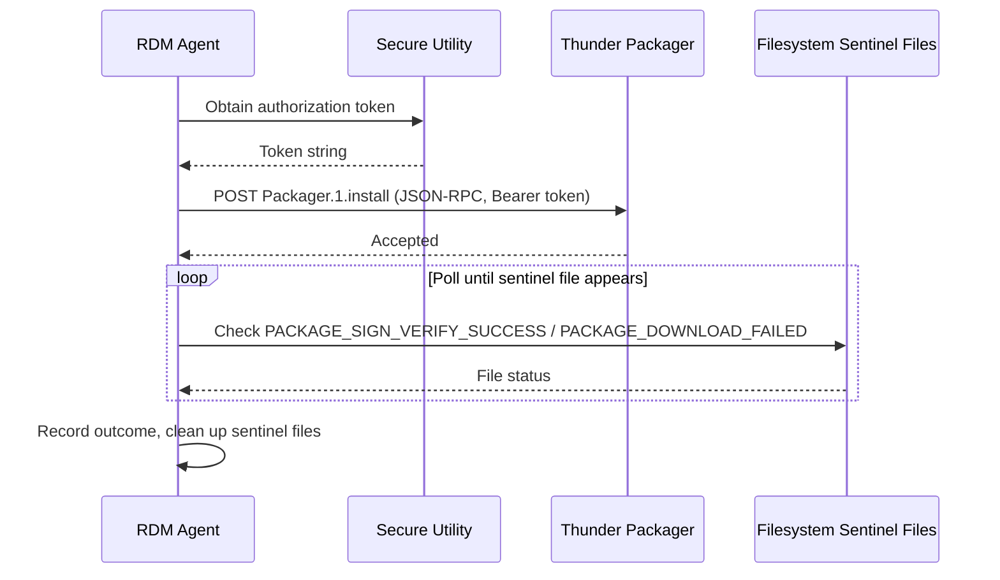

# RDM Agent

RDM Agent (RDK Download Manager Agent) is a standalone C executable in the RDK middleware layer that manages the full lifecycle of downloadable application packages on a device. It reads a device manifest (`rdm-manifest.json`) to determine which packages are required, retrieves the download URL from the system configuration parameter store via rbus, and transfers packages from a cloud server over HTTPS with mutual TLS authentication. After each transfer, the package's RSA signature is verified before extraction and installation. Download outcomes are persisted to a status tracking file and broadcast to other components through the system event bus. The agent supports four operational modes triggered from the command line: manifest-driven bulk download, targeted single-application install, versioned or bundle application install, and USB-based local install. It is launched as a one-shot systemd service that activates when the XConf SSR download URL file appears or changes on the filesystem.

As a middleware service, RDM Agent provides the device with the ability to acquire and update software components independently of firmware upgrades. It connects to cloud delivery infrastructure to pull application packages, enforces security through cryptographic signature verification, and integrates with the plugin runtime (WPEFramework/Thunder Packager) to handle plugin-type packages through the standard plugin installation path.

At the module level, RDM Agent is structured around a set of focused C modules covering orchestration, download control, package extraction, signature verification, manifest parsing, rbus-based configuration access, and event notification. These modules are composed at runtime by the main entry point to execute the appropriate download path based on the operation mode.

**Key Features & Responsibilities:**

- **Manifest-driven package download**: Reads `rdm-manifest.json` to enumerate the full set of application packages that the device requires, then iterates through each entry to fetch and install them in sequence.
- **RFC-gated on-demand downloads**: For packages marked as on-demand in the manifest, queries the rbus data model for a per-application RFC flag (`Device.DeviceInfo.X_RDKCENTRAL-COM_RFC.Feature.<AppName>.Enable`) before proceeding with the download, skipping packages whose RFC is not enabled.
- **HTTPS mutual TLS package transfer**: Downloads packages from the configured cloud URL using libcurl with mTLS certificate authentication, enforcing HTTPS by replacing any HTTP scheme in the resolved URL before initiating the transfer.
- **RSA signature verification**: Validates every downloaded package using OpenSSL RSA before extraction, rejecting packages whose signature does not match the embedded public key material.
- **Filesystem health check**: Before downloading to secondary storage, verifies that the target mount point is writable and has sufficient free space, falling back to a default temporary path if the check fails.
- **Multiple installation paths**: Supports distinct install flows for legacy tar/IPK packages, versioned applications with `package.json` metadata, plugin-type packages delegated to Thunder Packager, and local USB packages.
- **Download status persistence and notification**: Appends download outcomes per application to `rdmDownloadInfo.txt` and broadcasts a status event over the system event bus and via rbus to notify dependent components of completion or failure.
- **Post-install script execution**: After successful installation, runs per-application post-scripts from `/etc/rdm/post-services/` to perform any additional device-side configuration.

---

## Design

RDM Agent follows a single-threaded, sequential processing model suited to its role as a one-shot daemon. The component is structured as a layered set of C modules, each with a well-defined responsibility: the orchestration layer (main entry point) drives control flow, the download layer manages the fetch-verify-install pipeline, and the infrastructure layer provides reusable services for rbus access, HTTPS transfer, JSON parsing, signature verification, and event notification. This separation allows each concern to be tested independently, as reflected in the unit test structure that mocks each infrastructure module.

Northbound interaction is handled through rbus, from which the agent reads RFC parameters to obtain the download URL and per-feature enable flags, and to which it writes the download status. Southbound interaction targets the local filesystem for package storage, the system event bus for status broadcasting, and the Thunder Packager plugin for plugin-type package installs. The agent is invoked as a one-shot process by systemd and exits on completion, with IPC interactions limited to outbound rbus calls and event broadcasts made during execution.

The download pipeline integrates rbus for configuration resolution, libcurl for transfer, and OpenSSL for signature verification in a chain that mirrors the security requirements of package delivery: the URL is resolved from a trusted RFC parameter, the transfer uses mutual TLS, and the resulting file is rejected if its RSA signature is invalid. This chain is enforced at each stage before the next step proceeds.

Download metadata is persisted to a plain-text tracking file (`rdmDownloadInfo.txt`) whose location varies by device type (persistent storage for video devices, NVRAM path for broadband). The file records the application name, package name, home path, size, and download status for each processed entry, and is updated atomically by writing to a temporary file and renaming it.

### Threading Model

- **Threading Architecture**: Single-threaded
- **Main Thread**: Handles the entire execution lifecycle — logger initialization, rbus initialization, manifest parsing, RFC querying, filesystem checks, package download, signature verification, extraction, installation, status persistence, and event notification. All operations are performed sequentially in the main thread; the process exits on completion.
- **Synchronization**: The single-threaded execution model means all operations are naturally serialized; each stage completes before the next begins.
- **Async / Event Dispatch**: Status events broadcast over the system event bus are fire-and-forget calls initiated from the main thread before the process exits.

### Platform and Integration Requirements

- **Build Dependencies**: rbus, opkg, commonutilities (provides `downloadUtil`, `json_parse`, `system_utils`), telemetry (T2 event API), libsyswrapper (`secure_wrapper`), SafeC (`libsafec`), libcurl, OpenSSL, cJSON.
- **Plugin Dependencies**: WPEFramework Thunder with Packager plugin active — required only for plugin-type package installations.
- **IARM Bus / System Event Bus**: Registers as `AppDownloadEvent`; broadcasts to the `RDMMGR` event namespace. Enabled at build time with `--enable-iarmbusSupport`.
- **Systemd Services**: `apps_rdm.path` must be enabled at boot so that `apps-rdm.service` is triggered when the SSR download URL file appears.
- **Configuration Files**: `/etc/rdm/rdm-manifest.json` — mandatory; defines the package list. `/tmp/.xconfssrdownloadurl` — triggers service activation and provides the download base URL. `/nvram` — optional persistent path for broadband device download info.
- **Startup Order**: The service starts only when `/tmp/.xconfssrdownloadurl` exists, meaning the XConf/SSR URL resolution step must have completed before the agent runs.

---

### Component State Flow

#### Initialization to Active State

RDM Agent transitions through a linear lifecycle from invocation to completion. On startup, the logger subsystem is initialized (`RDMLOGInit`), followed by heap allocation for the application details structure and handle. The rbus subsystem is then opened (`rdmRbusInit`), which verifies rbus availability and opens a named handle (`RFCCHECK`). Once initialization succeeds, the agent enters its active processing phase, which varies by operational mode. On completion or error, rbus is closed and allocated memory is freed before the process exits.

#### Runtime State Changes

During active processing, the agent steps through each manifest entry and transitions between sub-states for each package:

**State Change Triggers:**

- If an application has `dwld_on_demand` set in the manifest and its RFC flag is not enabled, the entry is skipped and the index advances without downloading.
- If the filesystem health check for the secondary storage mount fails, download paths are rerouted to the default temporary path (`/tmp`) and processing continues rather than aborting.
- If a download attempt fails and the retry count (`RDM_RETRY_COUNT = 2`) is not exhausted, the download path is cleaned and the attempt is retried; after all retries are consumed, an error status is recorded and the loop advances.
- For plugin-type packages, the agent polls a set of sentinel files (`PACKAGE_SIGN_VERIFY_SUCCESS`, `PACKAGE_DOWNLOAD_FAILED`, etc.) in a timed loop to determine whether the Thunder Packager completed the installation.

**Context Switching Scenarios:**

- If the manifest is exhausted or an unrecoverable error occurs mid-loop, the loop exits and the agent writes the final status before terminating.
- A USB install mode entirely bypasses the manifest download loop; the agent instead scans the provided USB path for signed tar archives, matches them against the manifest, and proceeds with the installation flow.

---

### Call Flows

#### Initialization Call Flow

#### Request Processing Call Flow

The manifest-driven bulk download is the primary processing path. The agent validates each manifest entry, checks RFC state when needed, and drives the fetch–verify–install pipeline for each package.

---

## Internal Modules

| Module / Class       | Description                                                                                                                                                                                                                                                                                        | Key Files                                                  |
| -------------------- | -------------------------------------------------------------------------------------------------------------------------------------------------------------------------------------------------------------------------------------------------------------------------------------------------- | ---------------------------------------------------------- |
| `rdm_main`           | Entry point and top-level orchestration. Parses command-line arguments to select the operational mode, calls `rdmInit`, and drives the appropriate download loop or install path. Also contains bundle list parsing logic for versioned installs.                                                  | `rdm_main.c`, `rdm.h`                                      |
| `rdm_download`       | Download controller that dispatches to the correct installation flow — versioned app, plugin, or legacy — based on the `pkg_type` and `is_versioned` flags in the app details structure. Updates the persistent download info file on completion.                                                  | `src/rdm_download.c`, `include/rdm_download.h`             |
| `rdm_downloadmgr`    | Package extractor that handles the extraction of outer and inner package archives (tar and IPK). Reads `packages.list` to determine the constituent files, handles LXC container IPK format, and invokes the system event bus on extraction errors.                                                | `src/rdm_downloadmgr.c`                                    |
| `rdm_downloadutils`  | Download utility layer providing URL resolution from the SSR location file, directory creation, download blocking enforcement, mTLS certificate selection, direct HTTPS download (via `downloadUtil`), post-install script execution, and app uninstall helpers.                                   | `src/rdm_downloadutils.c`, `include/rdm_downloadutils.h`   |
| `rdm_downloadverapp` | Manages versioned application downloads. Resolves the installed and available versions from `package.json` metadata, computes which version to install or uninstall, handles bundle-type metadata path resolution for certificate and application bundles, and drives the verify-install sequence. | `src/rdm_downloadverapp.c`, `include/rdm_download.h`       |
| `rdm_rbus`           | rbus interface module. Opens and closes the rbus handle, reads RFC parameters (boolean and string types) via `rbus_get`, and writes the download completion status via `rbus_set` to `Device.DeviceInfo.X_RDKCENTRAL-COM_RDKDownloadManager.DownloadStatus`.                                       | `src/rdm_rbus.c`, `include/rdm_rbus.h`                     |
| `rdm_curldownload`   | libcurl wrapper providing low-level HTTPS download capability with configurable SSL version, connection timeout, full transfer timeout, mTLS certificate parameters, and peer verification.                                                                                                        | `src/rdm_curldownload.c`, `include/rdm_curldownload.h`     |
| `rdm_openssl`        | RSA signature verification module. Reads the package data file and signature file, converts ASCII-hex signatures and hashes to binary, and verifies the RSA2048 signature using OpenSSL EVP APIs. Also provides key decryption (`rdmDecryptKey`) and SSL library initialization.                   | `src/rdm_openssl.c`, `include/rdm_openssl.h`               |
| `rdm_jsonquery`      | JSON manifest parser built on cJSON. Provides path-based queries into the manifest file to retrieve the total package count and per-index or per-name application details. Receives data from the manifest file on the filesystem.                                                                 | `src/rdm_jsonquery.c`, `include/rdm_jsonquery.h`           |
| `rdm_packagemgr`     | Plugin-type package installer. Obtains an authorization token via a secure utility, constructs a `Packager.1.install` JSON-RPC request, posts it to the Thunder Packager endpoint, and polls filesystem sentinel files to determine installation outcome.                                          | `src/rdm_packagemgr.c`, `include/rdm_packagemgr.h`         |
| `rdm_usbinstall`     | USB installation module. Scans the given USB path for signed tar archives, matches each against the manifest by package name, populates the app details structure, and routes each matched package through the standard download/install pipeline without a network fetch.                         | `src/rdm_usbinstall.c`, `include/rdm_usbinstall.h`         |
| `rdm_utils`          | Logging subsystem initialization and system event bus helpers. Initializes RDK Logger with the `LOG.RDK.RDMAGENT` module name, and provides `rdmIARMEvntSendStatus` and `rdmIARMEvntSendPayload` for broadcasting download status and package install payload events.                              | `src/rdm_utils.c`, `include/rdm_utils.h`                   |
| `codebigUtils`       | OAuth-based download path utilities (conditionally compiled with `RDM_ENABLE_CODEBIG`). Provides token generation and codebig-authenticated HTTPS download as an alternative to the direct download path.                                                                                          | `src/codebig/codebigUtils.c`, `src/codebig/codebigUtils.h` |

---

## Component Interactions

### Interaction Matrix

| Target Component / Layer              | Interaction Purpose                                         | Key APIs / Topics                                                                  |
| ------------------------------------- | ----------------------------------------------------------- | ---------------------------------------------------------------------------------- |
| **rbus**                              |                                                             |                                                                                    |
| rbus daemon                           | Read download base URL from RFC parameter                   | `rbus_get("Device.DeviceInfo.X_RDKCENTRAL-COM_RFC.Feature.CDLDM.CDLModuleUrl")`    |
| rbus daemon                           | Read per-application RFC enable flag for on-demand packages | `rbus_get("Device.DeviceInfo.X_RDKCENTRAL-COM_RFC.Feature.<AppName>.Enable")`      |
| rbus daemon                           | Read CodeBig enable flag                                    | `rbus_get("Device.DeviceInfo.X_RDKCENTRAL-COM_RFC.Feature.CodeBigFirst.Enable")`   |
| rbus daemon                           | Write download completion status                            | `rbus_set("Device.DeviceInfo.X_RDKCENTRAL-COM_RDKDownloadManager.DownloadStatus")` |
| **Plugins**                           |                                                             |                                                                                    |
| Thunder Packager                      | Install plugin-type packages via JSON-RPC                   | `Packager.1.install` (POST to `RDM_JSONRPC_URL`)                                   |
| **System Event Bus**                  |                                                             |                                                                                    |
| System event bus                      | Broadcast download status change (status-only)              | `IARM_BUS_RDMMGR_EVENT_APPDOWNLOADS_CHANGED` on `IARM_BUS_RDMMGR_NAME`             |
| System event bus                      | Broadcast detailed package install result                   | `IARM_Bus_RDMMgr_EventData_t` (pkg name, version, install path, status)            |
| **External Systems**                  |                                                             |                                                                                    |
| Cloud download server                 | Fetch application packages over HTTPS with mTLS             | `doHttpFileDownload()` via libcurl                                                 |
| XConf / SSR                           | Obtain device-specific download URL                         | `/tmp/.xconfssrdownloadurl` — read on startup                                      |
| **Filesystem**                        |                                                             |                                                                                    |
| `/etc/rdm/rdm-manifest.json`          | Source of the package list                                  | Read via `rdmJSONGetLen`, `rdmJSONGetAppDetID`, `rdmJSONGetAppDetName`             |
| `/opt/persistent/rdmDownloadInfo.txt` | Persist download outcomes per application                   | File read and written by `rdm_download.c`                                          |
| `/etc/rdm/post-services/`             | Per-application post-install scripts                        | Executed via `rdmDwnlRunPostScripts()`                                             |

### Events Published

| Event Name              | Topic                                                                  | Trigger Condition                                        | Subscriber Components                                 |
| ----------------------- | ---------------------------------------------------------------------- | -------------------------------------------------------- | ----------------------------------------------------- |
| Download Status Changed | `IARM_BUS_RDMMGR_EVENT_APPDOWNLOADS_CHANGED` on system event bus       | After each package download attempt (success or failure) | Components registered to the `RDMMGR` event namespace |
| Package Install Result  | `IARM_Bus_RDMMgr_EventData_t` payload on system event bus              | On package extraction error or install completion        | Components registered to the `RDMMGR` event namespace |
| Download Status (rbus)  | `Device.DeviceInfo.X_RDKCENTRAL-COM_RDKDownloadManager.DownloadStatus` | After the download sequence completes                    | Any rbus subscriber monitoring this parameter         |

### IPC Flow Patterns

**Primary Download / Status Flow:**

The agent resolves configuration parameters from rbus before initiating the download. The result of each operation is propagated through the system event bus and rbus parameter store for downstream consumers.

**Plugin Package Installation Flow:**

For packages with `pkg_type = "plugin"`, the agent delegates installation to the Thunder Packager plugin and polls for completion via filesystem sentinel files.

---

## Implementation Details

### Major HAL APIs Integration

Platform-level capabilities are accessed through system utility libraries (`system_utils`, `downloadUtil`) and standard POSIX interfaces.

| API                                  | Purpose                                                          | Implementation File       |
| ------------------------------------ | ---------------------------------------------------------------- | ------------------------- |
| `rbus_checkStatus()`                 | Verify rbus daemon availability before opening a handle          | `src/rdm_rbus.c`          |
| `rbus_open()`                        | Open a named rbus client handle                                  | `src/rdm_rbus.c`          |
| `rbus_get()`                         | Read RFC parameters (boolean and string types)                   | `src/rdm_rbus.c`          |
| `rbus_set()`                         | Write download completion status to rbus data model              | `src/rdm_rbus.c`          |
| `rbus_close()`                       | Release the rbus handle on exit                                  | `src/rdm_rbus.c`          |
| `doHttpFileDownload()`               | Perform HTTPS file transfer with mTLS certificate authentication | `src/rdm_downloadutils.c` |
| `tarExtract()`                       | Extract a tar archive to a target directory                      | `src/rdm_downloadmgr.c`   |
| `arExtract()`                        | Extract an IPK (ar) archive to a target directory                | `src/rdm_downloadmgr.c`   |
| `checkFileSystem()`                  | Verify that a mount point is in a healthy, writable state        | `src/rdm_download.c`      |
| `getFreeSpace()`                     | Query available free space on a mount point                      | `src/rdm_download.c`      |
| `rdmOpensslRsafileSignatureVerify()` | Verify RSA2048 signature of a package file against a public key  | `src/rdm_openssl.c`       |

### Key Implementation Logic

- **State / Lifecycle Management**: The agent tracks per-package download state through fields in `RDMAPPDetails` (`dwld_status`, `dwld_on_demand`, `is_versioned`, `is_usb`, `pkg_type`). The main loop in `rdm_main.c` resets this structure before each manifest entry and uses return codes from each stage to decide whether to advance the index or abort.
  - Core loop: `rdm_main.c`
  - Per-package state: `rdm.h` (`RDMAPPDetails` struct)

- **Event Processing**: The agent operates in a pull model triggered by systemd. Status events are emitted at the end of each package install via `rdmIARMEvntSendStatus` and `rdmIARMEvntSendPayload` in `rdm_utils.c`. For plugin packages, completion detection uses polling on filesystem sentinel files in `rdm_packagemgr.c` with a fixed sleep interval between polls.

- **Error Handling Strategy**: Each stage of the download pipeline returns an integer status code. On failure, the error is logged using the `RDMError` macro and the stage-specific error is recorded in `rdmDownloadInfo.txt`. For legacy app installs, the download and cleanup are retried up to `RDM_RETRY_COUNT` (2) times before the package is marked as failed. For plugin installs, the maximum poll iterations are bounded by `MAX_LOOP_COUNT`. Download URLs that contain only HTTP (not HTTPS) are automatically upgraded to HTTPS before the curl transfer is initiated.
  - Retry logic: `rdm_download.c` (legacy path), `rdm_packagemgr.c` (plugin path)
  - URL scheme enforcement: `rdm_downloadutils.c` (`rdmDwnlUpdateURL`)

- **Download Blocking**: If a direct download has failed recently, `rdmDwnlIsBlocked` in `rdm_downloadutils.c` checks the last modification time of a block sentinel file against the configured block period (`DIRECT_BLOCK_TIME = 86400` seconds for direct, `CB_BLOCK_TIME = 1800` for codebig). Downloads are held until the block period expires.

- **Logging & Diagnostics**: Logging is initialized via `RDMLOGInit()` in `rdm_utils.c`. When RDK Logger is available, output is routed to `LOG.RDK.RDMAGENT` using `RDK_LOG` at ERROR, WARN, INFO, DEBUG, and TRACE levels; otherwise output is directed to `stderr`. Telemetry markers (`t2CountNotify`, `t2ValNotify`) are emitted at key points such as package download start, URL resolution, and error conditions when `T2_EVENT_ENABLED` is defined.
  - RDK Logger module name: `LOG.RDK.RDMAGENT`
  - Key log points: rbus init failure, RFC skip, filesystem check failure, download URL resolution, signature verification result, extraction errors.

---

## Configuration

### Key Configuration Files

| Configuration File           | Purpose                                                                                                                                                        | Override Mechanism                                                             |
| ---------------------------- | -------------------------------------------------------------------------------------------------------------------------------------------------------------- | ------------------------------------------------------------------------------ |
| `/etc/rdm/rdm-manifest.json` | Defines the list of application packages the agent should download and install, including package name, type, version, size, and on-demand flags.              | Deployed with the firmware image; updated by replacing the file on the device. |
| `/tmp/.xconfssrdownloadurl`  | Contains the XConf/SSR base URL used as the package download location. Written by the XConf client process; triggers service activation via systemd path unit. | Managed by the XConf client process.                                           |
| `/etc/debug.ini`             | RDK Logger configuration file read during logger initialization.                                                                                               | Replace file on device.                                                        |

### Key Configuration Parameters

| Parameter                                                              | Type    | Source            | Description                                                                                 |
| ---------------------------------------------------------------------- | ------- | ----------------- | ------------------------------------------------------------------------------------------- |
| `Device.DeviceInfo.X_RDKCENTRAL-COM_RFC.Feature.CDLDM.CDLModuleUrl`    | string  | rbus / RFC        | Base URL used to construct the package download path. Fetched via `rbus_get` at runtime.    |
| `Device.DeviceInfo.X_RDKCENTRAL-COM_RFC.Feature.<AppName>.Enable`      | boolean | rbus / RFC        | Per-application enable flag evaluated for on-demand packages before initiating download.    |
| `Device.DeviceInfo.X_RDKCENTRAL-COM_RFC.Feature.CodeBigFirst.Enable`   | boolean | rbus / RFC        | Controls whether the codebig authenticated download path is preferred over direct download. |
| `Device.DeviceInfo.X_RDKCENTRAL-COM_RDKDownloadManager.DownloadStatus` | boolean | rbus (write)      | Set by the agent to `true` on successful completion and `false` on failure.                 |
| `DIRECT_BLOCK_TIME`                                                    | int     | Compiled constant | Duration in seconds (86400) for which a direct download is blocked after a prior failure.   |
| `CB_BLOCK_TIME`                                                        | int     | Compiled constant | Duration in seconds (1800) for which a codebig download is blocked after a prior failure.   |
| `RDM_RETRY_COUNT`                                                      | int     | Compiled constant | Number of retry attempts (2) for legacy app download failures before marking as failed.     |

### Runtime Configuration

RFC parameters are managed through the device's parameter store interface via rbus. Changes to RFC values take effect on the next invocation of the agent, as all RFC parameters are read at startup through `rbus_get` calls.

### Configuration Persistence

RFC parameters are managed externally by the configuration delivery infrastructure and persist across reboots via the rbus data model backing store. The `rdmDownloadInfo.txt` status file persists across reboots at `/opt/persistent/rdmDownloadInfo.txt` (video path) or `/nvram/persistent/rdmDownloadInfo.txt` (broadband path). The `rdm-manifest.json` file is deployed as part of the firmware image and remains static on the device.
