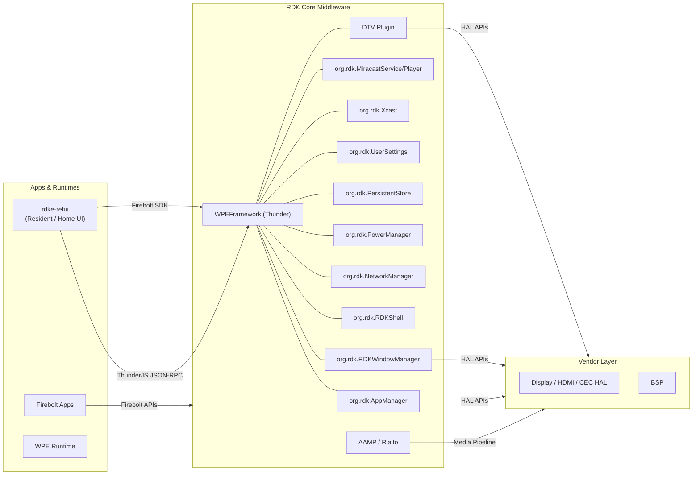
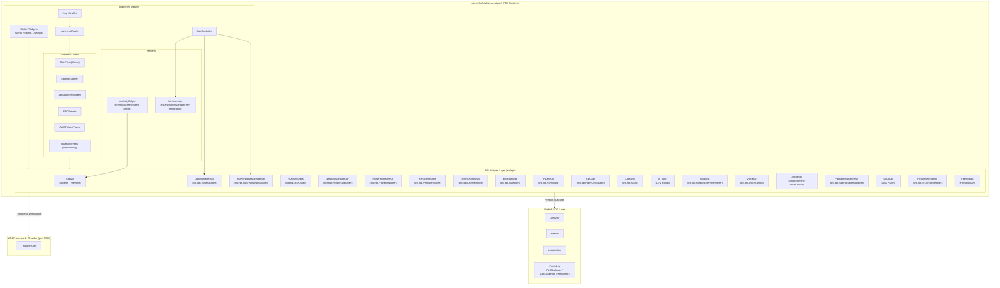
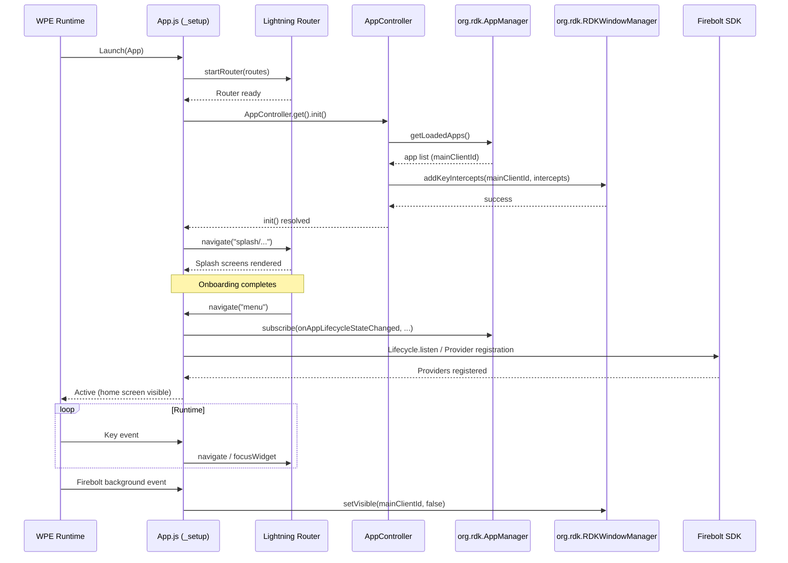
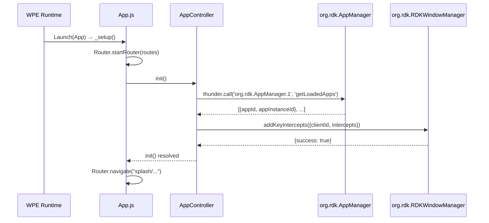
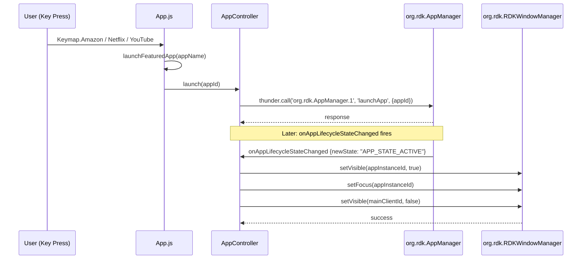
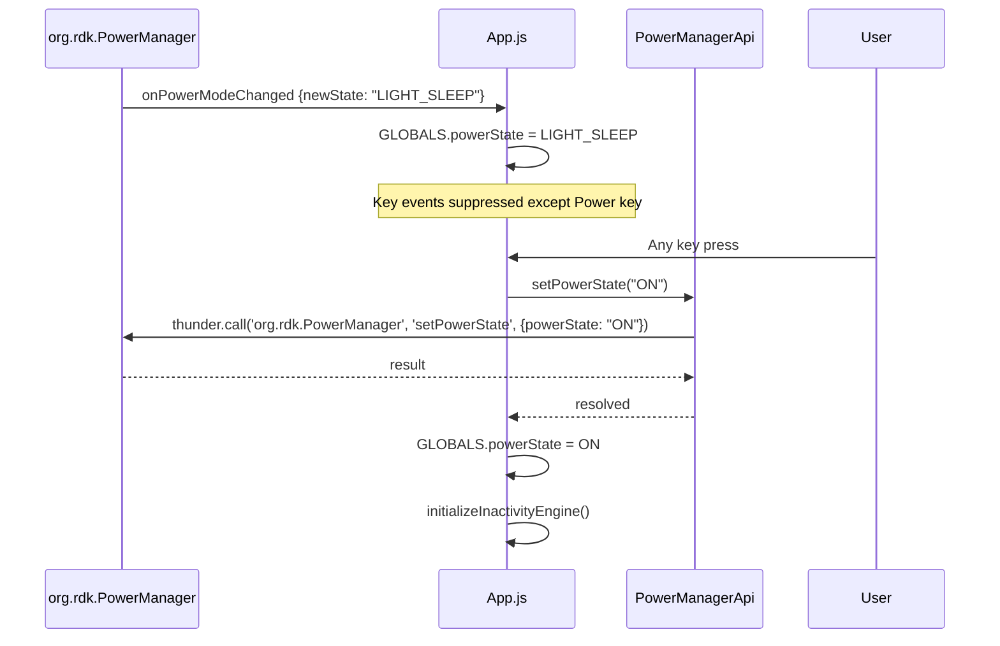
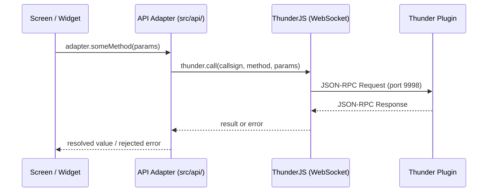
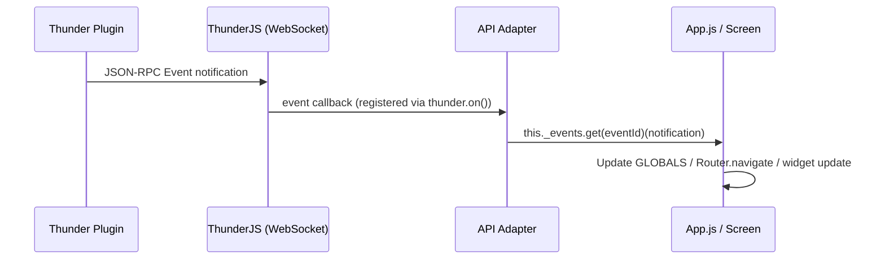

# RDK Reference UI (rdke-refui)

---

RDK Reference UI (`rdke-refui`) is a Lightning.js-based resident application that serves as the home screen and UI shell for RDK Video reference platforms. It runs as the always-present foreground application on the device, presenting a navigable home screen, settings, media playback controls, and an application launcher. The UI communicates bidirectionally with the RDK middleware stack — primarily through ThunderJS (WPEFramework JSON-RPC) for device service control and through the Firebolt SDK for application lifecycle, localization, and metrics.

At the device level, it acts as the orchestrator of the user-visible surface: managing which application window is in focus, intercepting remote-control key presses, handling power state transitions, and launching or exiting third-party applications. At the module level, it encapsulates distinct API adapter classes for every Thunder plugin it interacts with, a Lightning Router-based screen navigation engine, and a set of overlay and widget components that can be rendered independently of the active route.



**Key Features & Responsibilities:**

- **Home Screen & Navigation**: Presents the main menu, side panel, top panel, and a configurable application grid through the Lightning Router. Supports routes including `menu`, `settings`, `epg`, `applauncher`, `usb`, and `player`.
- **Application Lifecycle Management**: Launches, monitors, and terminates third-party applications via `org.rdk.AppManager`, updates window visibility and focus via `org.rdk.RDKWindowManager`, and tracks the currently topmost application in `GLOBALS.topmostApp`.
- **Remote Control Key Handling**: Registers key intercepts with `org.rdk.RDKWindowManager` at startup for Home, Power, Volume, and shortcut keys. Routes key events to the active screen or widget, and forwards relevant keys to the focused application window.
- **Power State Management**: Subscribes to `onPowerModeChanged` from `org.rdk.PowerManager` and suppresses non-power key events during sleep states. Wakes the device to the `ON` state on any user key press.
- **Network Management**: Interfaces with `org.rdk.NetworkManager` for Wi-Fi scanning, connecting, IP configuration, and internet connectivity checks. Displays network setup screens during the splash/onboarding flow.
- **Media Playback**: Embeds an AAMP-based video player (`AAMPVideoPlayer`) for VOD and DTV channel playback. The `DTVApi` class interfaces with the `DTV` Thunder plugin for live TV channel and EPG data.
- **Settings Management**: Provides screens and overlays for picture settings (`org.rdk.tv.ControlSettings`), audio settings, sleep timer, screen saver, language, and time zone. User preferences are persisted via `org.rdk.PersistentStore` and `org.rdk.UserSettings`.
- **Voice & Alexa Integration**: Activates `org.rdk.VoiceControl` for keyword detection and voice session lifecycle. The `AlexaApi` class extends `VoiceApi` to handle SmartScreen activation and application state reporting to the Alexa cloud.
- **Firebolt Provider Integration**: Registers `PinChallengeProvider`, `AckChallengeProvider`, and `KeyboardUIProvider` with the Firebolt manage SDK to satisfy UI challenge prompts from Firebolt-capable applications.
- **Miracast Screen Mirroring**: Activates `org.rdk.MiracastService` and `org.rdk.MiracastPlayer`, presents the connection notification overlay, and manages accept/reject flows for incoming Miracast client connections.
- **Application Package Management**: Uses `org.rdk.AppPackageManager` (via `PackageManagerApi`) to list, install, and remove application packages, and relays install/uninstall events from `org.rdk.AppManager` to registered UI listeners.
- **Inactivity & Energy Saving**: Monitors user inactivity through `org.rdk.RDKShell` inactivity reporting, and applies configurable screen saver, energy saver, and sleep timer timeouts stored in browser-side `localStorage`/`Storage`.

---

## Design

The application is structured as a single-page Lightning.js application bootstrapped via `@lightningjs/sdk`'s `Launch()` entry point. The root `App` class extends `Router.App` and owns all global widgets (Menu, Volume overlay, Channel overlay, Settings overlay, App Carousel, Miracast notification). Page-level components are managed by the Lightning Router, which maps URL-like hash paths to Lightning components. This decouples screen logic from the shell layer: each screen or overlay only needs to know its own state, while the `App` class orchestrates global events and key routing.

Interactions with the northbound (Firebolt apps) are handled by registering Firebolt SDK providers (`PinChallenge`, `AcknowledgeChallenge`, `Keyboard`) so that Firebolt-capable apps can invoke UI challenges. The southbound layer — WPEFramework/Thunder — is accessed exclusively through ThunderJS over a WebSocket connection to `127.0.0.1:9998`. Each plugin has a dedicated adapter class in `src/api/`, isolating JSON-RPC call construction and event subscription from UI logic.

State shared across screens is held in `GLOBALS` (a module-level object in `Config.js`) and in the Lightning `Storage` API, which wraps `localStorage`. `AppController` maintains the identity of the main client window and the currently focused application instance, coordinating window visibility transitions when apps are launched or exit.

Firebolt SDK's `Metrics` API is used consistently across all API adapter classes to report plugin errors to the telemetry layer without blocking the UI thread.



#### Threading Model

- **Threading Architecture**: Single-threaded (JavaScript event loop within the WPE browser runtime).
- **Main Thread**: Handles all Lightning rendering, key events, ThunderJS WebSocket callbacks, and Firebolt SDK event callbacks. All API calls are asynchronous (Promise-based) and do not block the render loop.
- **Async / Event Dispatch**: ThunderJS delivers JSON-RPC event notifications via WebSocket callbacks registered with `thunder.on()`. Firebolt SDK delivers lifecycle and localization events via `Lifecycle.listen()` / `Localization.listen()`. All callbacks dispatch synchronously on the JavaScript event loop and update component state or trigger `Router.navigate()` calls.
- **Synchronization**: All shared state is accessed through the JavaScript event loop, which serialises execution. Each API adapter class exposes a static `get()` factory method that returns a shared instance per class. `GLOBALS` properties use getter/setter pairs to manage shared state with logging side effects.

### Prerequisites and Dependencies

#### Platform and Integration Requirements

- **Build Dependencies**: `@lightningjs/sdk ^4.8.1`, `ThunderJS` (rdkcentral fork), `@firebolt-js/sdk 0.15.0`, `@firebolt-js/manage-sdk 1.1.0`, `esbuild ^0.17.18` (bundler), Lightning CLI (`@lightningjs/cli`).
- **Plugin Dependencies**: `org.rdk.AppManager`, `org.rdk.RDKWindowManager`, `org.rdk.RDKShell`, `org.rdk.NetworkManager`, `org.rdk.PowerManager`, `org.rdk.PersistentStore`, `org.rdk.UserSettings`, `org.rdk.Bluetooth`, `org.rdk.HdmiInput`, `org.rdk.HdmiCecSource`, `org.rdk.Xcast`, `org.rdk.VoiceControl`, `org.rdk.MiracastService`, `org.rdk.MiracastPlayer`, `org.rdk.TextToSpeech`, `org.rdk.tv.ControlSettings`, `DTV`, `LISA`, `org.rdk.AppPackageManager`, `org.rdk.System`, `SmartScreen`.
- **Systemd Services**: The application is served by a `lighttpd` web server instance that maps the `/lxresui` alias to the installed dist directory. The WPE browser process must be running and pointing to the UI's `index.html`.
- **Configuration Files**:
  - `settings.json` — Lightning SDK platform and stage settings, loaded at application startup from the static directory.
  - `bolt/package-configs/com.rdkcentral.refui.json` — Application manifest used by the package manager to describe entry point, version, and required permissions.
  - `static/data/AppListInfo.js` — Static list of pre-configured partner applications shown in the home screen application grid.
  - `static/moreChannels/ChannelData.json` — Supplementary channel list fetched at runtime from `http://127.0.0.1:50050/lxresui/static/moreChannels/ChannelData.json`.
- **Startup Order**: The WPE browser runtime must be fully initialised and the ThunderJS WebSocket endpoint (`127.0.0.1:9998`) must be reachable before `AppController.init()` completes its `AppManager.getLoadedApps()` call. `org.rdk.RDKWindowManager` must be active for key intercept registration to succeed.

---

### Component State Flow

#### Initialization to Active State

When the WPE runtime loads the application, `index.js` calls `Launch(App)`, which triggers `App._setup()`. The router is started, `AppController.get().init()` identifies the main client window through `org.rdk.AppManager` or `org.rdk.RDKWindowManager`, and key intercepts are registered with `org.rdk.RDKWindowManager`. Once the splash screen route completes its onboarding checks (language selection, network configuration, pairing code if required), the router navigates to the main `menu` route and the application is fully active.

The component transitions through the following states: **Loading** (Lightning SDK bootstraps the renderer, `App._setup()` runs) → **Splash** (onboarding screens: language, network, activation code) → **AppControllerInit** (`AppController.init()` resolves the main client ID, registers key intercepts) → **Active** (main `menu` route, all overlays available, ThunderJS event listeners registered) → **Suspended/Background** (Firebolt `background` lifecycle event received, UI hidden) → **Shutdown** (WPE browser exits).



#### Runtime State Changes

**State Change Triggers:**

- **Power state change** (`onPowerModeChanged` from `org.rdk.PowerManager`): When the device enters `LIGHT_SLEEP` or `DEEP_SLEEP`, all non-power key presses are suppressed. The first key press wakes the device by calling `setPowerState("ON")`.
- **App lifecycle change** (`onAppLifecycleStateChanged` from `org.rdk.AppManager`): When a launched app transitions to `APP_STATE_ACTIVE`, `AppController` makes that app's window visible and focused, and hides the main UI window. When the app exits `APP_STATE_ACTIVE`, the main UI window is brought back into focus.
- **HDMI source change** (`onInputStatusChanged` from `org.rdk.HdmiInput`): The TV overlay is updated to reflect the active HDMI input and triggers navigation to the HDMI input overlay route.
- **Network state change** (events from `org.rdk.NetworkManager`): The `IsConnectedToInternet` flag in `GLOBALS` is updated, and network status is reflected in the settings overlay and top panel.
- **Miracast connection request** (events from `org.rdk.MiracastService`): The `MiracastNotification` overlay is displayed with accept/reject options. The Miracast state in `GLOBALS.Miracastclientdevicedetails` is updated through the connection lifecycle.

**Context Switching Scenarios:**

- When a third-party application is launched, the router navigates to `applauncher`, the main UI window is hidden, and focus is transferred to the application's window client ID.
- On a Home key press while a third-party app is topmost, `jumpToRoute("menu")` is called, which sets the main UI window visible and focused, and calls `AppManager.closeApp()` or lets the lifecycle event handle the app exit.
- On entry into a sleep power state, the inactivity engine is paused by calling `enableInactivityReporting(false)` and is re-enabled on wakeup.

---

### Call Flows

#### Initialization Call Flow



#### Application Launch Call Flow



#### Power State Handling Call Flow



---

## Internal Modules

| Module / Class      | Description                                                                                                                                                                                                         | Key Files                                                     |
| ------------------- | ------------------------------------------------------------------------------------------------------------------------------------------------------------------------------------------------------------------- | ------------------------------------------------------------- |
| `App`               | Root Lightning application class. Owns global widget tree, key capture logic, power state handling, and Firebolt provider registration. Extends `Router.App`.                                                       | `src/App.js`                                                  |
| `AppController`     | Resolves the main client window ID at startup, registers key intercepts, manages app window visibility transitions on lifecycle events, and relays package install/uninstall notifications to registered listeners. | `src/AppController.js`                                        |
| `Router / Routes`   | Lightning Router configuration defining all navigable routes and their associated screen components and active widgets.                                                                                             | `src/routes/routes.js`, `src/routes/*.js`                     |
| `GLOBALS / CONFIG`  | Shared mutable state object (topmost app, power state, network status, Miracast state, client IDs) and static configuration (Thunder host, theme, language).                                                        | `src/Config/Config.js`                                        |
| `API Adapter Layer` | One class per Thunder plugin or Firebolt module. Each class wraps ThunderJS calls and event subscriptions, exposing Promise-based methods to the UI layer. Errors are reported via `Firebolt.Metrics`.              | `src/api/*.js`                                                |
| `FireBoltApi`       | Facade aggregating Firebolt sub-modules: `FBTDeviceInfo`, `FBTLifecycle`, `FBTDiscovery`, `FBTLocalization`.                                                                                                        | `src/api/firebolt/FireBoltApi.js`, `src/api/firebolt/FBT*.js` |
| `InactivityHelper`  | Manages three inactivity timers (energy saver, screen saver, sleep timer) using values stored in `localStorage`. Enables/disables `org.rdk.RDKShell` inactivity reporting based on active timer state.              | `src/helpers/InactivityHelper.js`                             |
| `keyIntercept`      | Registers the global key intercept list with `org.rdk.RDKWindowManager` for the main client window. Called during `AppController.init()`.                                                                           | `src/keyIntercept/keyIntercept.js`                            |
| `MainView`          | Home screen view component. Displays the partner application grid, Gracenote content recommendations, and DAC-installed application items.                                                                          | `src/views/MainView.js`                                       |
| `Menu`              | Persistent navigation widget composed of `TopPanel` and `SidePanel`. Always present across primary routes.                                                                                                          | `src/views/Menu.js`                                           |
| `AAMPVideoPlayer`   | Lightning component wrapping the AAMP media player. Handles VOD URL playback and DTV channel playback with an info overlay.                                                                                         | `src/MediaPlayer/AAMPVideoPlayer.js`                          |
| `Screens`           | Individual full-screen route components: settings, Wi-Fi, Bluetooth, EPG, USB apps, splash/onboarding, Alexa login, Miracast notification, camera streaming, and error screens.                                     | `src/screens/*.js`                                            |
| `Overlays`          | Floating overlay components rendered as widgets: `SettingsOverlay`, `AppCarousel`, `VideoInfoChange`, audio/network/live TV settings overlays.                                                                      | `src/overlays/*.js`                                           |
| `Redux Store`       | Minimal Redux store used to track voice recognition session state (`ACTION_LISTEN_START` / `ACTION_LISTEN_STOP`).                                                                                                   | `src/redux.js`                                                |

---

## Component Interactions

### Interaction Matrix

| Target Component / Layer                   | Interaction Purpose                                                                                 | Key APIs / Topics                                                                                                                     |
| ------------------------------------------ | --------------------------------------------------------------------------------------------------- | ------------------------------------------------------------------------------------------------------------------------------------- |
| **Thunder Plugins**                        |                                                                                                     |                                                                                                                                       |
| `org.rdk.AppManager`                       | Launch apps, query loaded apps, receive install/uninstall/lifecycle events                          | `launchApp()`, `getLoadedApps()`, `isInstalled()`, `onAppLifecycleStateChanged`, `onAppInstalled`, `onAppUninstalled`                 |
| `org.rdk.RDKWindowManager`                 | Set window visibility and focus, register key intercepts, query running apps                        | `setFocus()`, `setVisible()`, `getApps()`, `addKeyIntercepts()`                                                                       |
| `org.rdk.RDKShell`                         | Window z-order, opacity, virtual display, inactivity reporting, key injection                       | `getZOrder()`, `setVisibility()`, `setOpacity()`, `moveToFront()`, `enableInactivityReporting()`, `addKeyIntercept()`, `getClients()` |
| `org.rdk.NetworkManager`                   | Wi-Fi scan and connect, IP settings, internet connectivity check                                    | `GetAvailableInterfaces()`, `SetInterfaceState()`, `GetIPSettings()`, `IsConnectedToInternet()`, `StartConnectivityMonitoring()`      |
| `org.rdk.PowerManager`                     | Read and set device power state, subscribe to power mode changes, configure wakeup sources          | `setPowerState()`, `setWakeupSourceConfig()`, `onPowerModeChanged`                                                                    |
| `org.rdk.PersistentStore`                  | Read and write persistent key-value pairs for user preferences                                      | `getValue()`, `setValue()`, `deleteKey()`, `onValueChanged`, `onStorageExceeded`                                                      |
| `org.rdk.UserSettings`                     | Get/set voice guidance and presentation language preferences                                        | `setVoiceGuidance()`, `getVoiceGuidance()`, `setPresentationLanguage()`, `getPresentationLanguage()`                                  |
| `org.rdk.Bluetooth`                        | Device discovery, pairing, connection for remote controls and audio devices                         | `startScan()`, `pair()`, `connect()`, `onDiscoveredDevice`, `onStatusChanged`, `onPairingRequest`                                     |
| `org.rdk.HdmiInput`                        | Query and switch HDMI input sources                                                                 | `getHDMIInputDevices()`, `setHDMIInput()`, `stopHDMIInput()`, `onInputStatusChanged`, `onSignalChanged`                               |
| `org.rdk.HdmiCecSource`                    | Enable CEC and manage TV control actions via HDMI-CEC                                               | `getEnabled()`, `setEnabled()`, `performOTP()`, `getActiveSourceStatus()`                                                             |
| `org.rdk.Xcast`                            | Enable cast discovery, receive cast application launch/stop/hide requests                           | `setEnabled()`, `onApplicationLaunchRequest`, `onApplicationStopRequest`, `onApplicationHideRequest`                                  |
| `org.rdk.VoiceControl`                     | Activate voice session, subscribe to keyword and stream events                                      | `configureVoice()`, `onKeywordVerification`, `onSessionBegin`, `onSessionEnd`                                                         |
| `SmartScreen`                              | Display Alexa smart screen overlay during voice interactions                                        | `Controller.activate()`, `Controller.deactivate()`                                                                                    |
| `org.rdk.MiracastService`                  | Enable/disable Miracast, accept/reject incoming connections                                         | `setEnable()`, `getEnable()`, `acceptClientConnection()`, `stopClientConnection()`, `stopRequest()`                                   |
| `org.rdk.MiracastPlayer`                   | Start/stop Miracast media playback                                                                  | `activate()`, `deactivate()`                                                                                                          |
| `DTV`                                      | Retrieve DTV country list, service list, and schedule event data                                    | `numberOfCountries()`, `countryList()`, `serviceList()`                                                                               |
| `org.rdk.TextToSpeech`                     | Enable/disable TTS and speak UI text                                                                | `enabletts()`, `isttsenabled()`, `speak()`                                                                                            |
| `org.rdk.tv.ControlSettings`               | Get and set picture mode, color temperature, backlight, brightness, contrast, sharpness, saturation | `getPictureMode()`, `setPictureMode()`, `getBacklight()`, `setBacklight()`, etc.                                                      |
| `LISA`                                     | Retrieve DAC application metadata and platform configuration for DAC app installation               | `getMetadata()`                                                                                                                       |
| `org.rdk.AppPackageManager`                | List, install, and remove application packages                                                      | `listPackages()`, `install()`, `uninstall()`                                                                                          |
| `org.rdk.System`                           | Query and set time zone                                                                             | `getTimeZones()`, `getTimeZoneDST()`, `setTimeZoneDST()`                                                                              |
| **Firebolt SDK**                           |                                                                                                     |                                                                                                                                       |
| `@firebolt-js/sdk` — `Lifecycle`           | Subscribe to app foreground/background/inactive/suspended/unloading events                          | `Lifecycle.listen()`, `Lifecycle.close()`                                                                                             |
| `@firebolt-js/sdk` — `Metrics`             | Report plugin errors and media playback errors to the telemetry layer                               | `Metrics.error()`                                                                                                                     |
| `@firebolt-js/sdk` — `Localization`        | Retrieve device language and locale for UI language selection                                       | `Localization.language()`                                                                                                             |
| `@firebolt-js/manage-sdk` — Providers      | Register UI challenge providers for Firebolt apps                                                   | `PinChallenge.provide()`, `AcknowledgeChallenge.provide()`, `Keyboard.provide()`                                                      |
| `@firebolt-js/manage-sdk` — `Localization` | Listen for locale change events and retrieve country code                                           | `Localization.listen()`, `Localization.additionalInfo()`, `Localization.countryCode()`                                                |

### Events Published

| Event Name                   | Source Plugin / Topic     | Trigger Condition                                   | Consumer in refui                                      |
| ---------------------------- | ------------------------- | --------------------------------------------------- | ------------------------------------------------------ |
| `onPowerModeChanged`         | `org.rdk.PowerManager`    | Device power state changes                          | `App.js` (key suppression, wakeup logic)               |
| `onAppLifecycleStateChanged` | `org.rdk.AppManager`      | Launched app transitions to/from `APP_STATE_ACTIVE` | `AppController` (window focus/visibility management)   |
| `onAppInstalled`             | `org.rdk.AppManager`      | Application package installed                       | `AppController` → registered `packageChangedListeners` |
| `onAppUninstalled`           | `org.rdk.AppManager`      | Application package uninstalled                     | `AppController` → registered `packageChangedListeners` |
| `onInputStatusChanged`       | `org.rdk.HdmiInput`       | HDMI input port connected/disconnected              | `HDMIApi` event handler → TV overlay update            |
| `onSignalChanged`            | `org.rdk.HdmiInput`       | HDMI signal state changes                           | `HDMIApi` event handler                                |
| `onDiscoveredDevice`         | `org.rdk.Bluetooth`       | New Bluetooth device discovered during scan         | `BluetoothApi` → Bluetooth screen                      |
| `onStatusChanged`            | `org.rdk.Bluetooth`       | Pairing or connection state changes                 | `BluetoothApi` → Bluetooth screen                      |
| `onKeywordVerification`      | `org.rdk.VoiceControl`    | Wake word detected                                  | `VoiceApi` → Alexa/voice UI                            |
| `onApplicationLaunchRequest` | `org.rdk.Xcast`           | Cast source requests app launch                     | `XcastApi` → app launch handler                        |
| `onValueChanged`             | `org.rdk.PersistentStore` | A stored value changes                              | `PersistentStoreApi` event handler                     |
| `onStorageExceeded`          | `org.rdk.PersistentStore` | Persistent storage quota exceeded                   | `PersistentStoreApi` event handler                     |

### IPC Flow Patterns

**Primary Request / Response Flow:**

All Thunder plugin interactions follow a uniform Promise-based JSON-RPC pattern. The UI calls an adapter method, which constructs and dispatches a ThunderJS call. The resolved or rejected Promise result is propagated back to the calling screen or widget.



**Event Notification Flow:**

Adapter classes subscribe to plugin events during `activate()`. When an event arrives, the adapter dispatches it to a registered callback, which was set by the screen or the `App` root component.



---

## Implementation Details

### Major HAL APIs Integration

| Plugin / API                 | Method Called                                           | Purpose                                                          | Implementation File                                                  |
| ---------------------------- | ------------------------------------------------------- | ---------------------------------------------------------------- | -------------------------------------------------------------------- |
| `org.rdk.AppManager`         | `launchApp()`                                           | Launch a registered application by ID                            | `src/api/AppManagerApi.js`                                           |
| `org.rdk.AppManager`         | `getLoadedApps()`                                       | Retrieve list of currently loaded app instances                  | `src/api/AppManagerApi.js`                                           |
| `org.rdk.RDKWindowManager`   | `setFocus()`                                            | Transfer input focus to a window client                          | `src/api/RDKWindowManagerApi.js`                                     |
| `org.rdk.RDKWindowManager`   | `setVisible()`                                          | Show or hide a window client                                     | `src/api/RDKWindowManagerApi.js`                                     |
| `org.rdk.RDKWindowManager`   | `addKeyIntercepts()`                                    | Register key intercepts for the main client window               | `src/api/RDKWindowManagerApi.js`, `src/keyIntercept/keyIntercept.js` |
| `org.rdk.PowerManager`       | `setPowerState()`                                       | Set device power state (ON / STANDBY / LIGHT_SLEEP / DEEP_SLEEP) | `src/api/PowerManagerApi.js`                                         |
| `org.rdk.PowerManager`       | `setWakeupSourceConfig()`                               | Configure hardware wakeup sources                                | `src/api/PowerManagerApi.js`                                         |
| `org.rdk.NetworkManager`     | `GetAvailableInterfaces()`                              | List network interfaces                                          | `src/api/NetworkManagerAPI.js`                                       |
| `org.rdk.NetworkManager`     | `IsConnectedToInternet()`                               | Check active internet connectivity                               | `src/api/NetworkManagerAPI.js`                                       |
| `org.rdk.NetworkManager`     | `GetIPSettings()`                                       | Retrieve IP configuration for an interface                       | `src/api/NetworkManagerAPI.js`                                       |
| `org.rdk.PersistentStore`    | `getValue()` / `setValue()`                             | Read/write persistent user preferences                           | `src/api/PersistentStore.js`                                         |
| `org.rdk.HdmiInput`          | `getHDMIInputDevices()`                                 | List available HDMI input ports                                  | `src/api/HDMIApi.js`                                                 |
| `org.rdk.HdmiInput`          | `setHDMIInput()` / `stopHDMIInput()`                    | Activate or deactivate an HDMI input source                      | `src/api/HDMIApi.js`                                                 |
| `org.rdk.HdmiCecSource`      | `getEnabled()`, `setEnabled()`, `performOTP()`          | Query and enable CEC; trigger OTP action on the HDMI source      | `src/api/CECApi.js`                                                  |
| `org.rdk.tv.ControlSettings` | `getPictureMode()` / `setPictureMode()`                 | Read and write picture mode setting                              | `src/api/PictureSettingsApi.js`                                      |
| `org.rdk.tv.ControlSettings` | `getBacklight()` / `setBacklight()`                     | Read and write backlight level                                   | `src/api/PictureSettingsApi.js`                                      |
| `org.rdk.Xcast`              | `setEnabled()`                                          | Enable cast discovery advertisement                              | `src/api/XcastApi.js`                                                |
| `org.rdk.MiracastService`    | `setEnable()` / `acceptClientConnection()`              | Enable Miracast and accept/reject peer connections               | `src/api/Miracast.js`                                                |
| `org.rdk.VoiceControl`       | `configureVoice()`                                      | Configure voice endpoint and enable keyword detection            | `src/api/VoiceApi.js`                                                |
| `org.rdk.TextToSpeech`       | `enabletts()` / `speak()`                               | Enable TTS and synthesise speech for UI elements                 | `src/api/TTSApi.js`                                                  |
| `org.rdk.System`             | `getTimeZoneDST()` / `setTimeZoneDST()`                 | Read and write device time zone                                  | `src/api/AppApi.js`                                                  |
| `DTV`                        | `numberOfCountries()`, `countryList()`, `serviceList()` | Retrieve DTV country configuration and channel service list      | `src/api/DTVApi.js`                                                  |
| `LISA`                       | `getMetadata()`                                         | Retrieve DAC bundle platform and config URL metadata             | `src/api/LISAApi.js`                                                 |

### Key Implementation Logic

- **State / Lifecycle Management**: `GLOBALS` (module-level object in `Config.js`) is the authoritative store for runtime state: `topmostApp`, `powerState`, `selfClientId`, `IsConnectedToInternet`, `Miracastclientdevicedetails`. `AppController` maintains the focused client ID and main client ID for window management. State transitions on power mode or app lifecycle events are handled by callbacks registered in `App.js` and `AppController.js`.

- **Event Processing**: Plugin events are registered in each adapter's `activate()` method via `thunder.on(callsign, eventName, callback)`. Callbacks invoke registered handler functions stored in the adapter's `_events` Map. The `App.js` root registers handlers on adapters directly, or adapters forward events to UI components through the Lightning component event system.

- **Error Handling Strategy**: Each adapter wraps ThunderJS calls in Promise constructors. On `catch`, the error is logged via `console.error` and reported to the telemetry layer via `Firebolt.Metrics.error()` with a component-specific error name string. The Promise is typically resolved with a default value (empty array, `false`) rather than rejected, so the UI degrades gracefully. `AppController` uses the `ThunderError` helper class to produce structured error strings.

- **Logging & Diagnostics**: All classes use `console.info`, `console.log`, `console.error`, and `console.warn` assigned to `this.INFO`, `this.LOG`, `this.ERR`, `this.WARN` respectively. Log output is available in the WPE browser console or through the device's logging infrastructure.

---

## Configuration

### Key Configuration Files

| Configuration File                               | Purpose                                                                                                       | Override Mechanism                                  |
| ------------------------------------------------ | ------------------------------------------------------------------------------------------------------------- | --------------------------------------------------- |
| `accelerator-home-ui/settings.json`              | Lightning SDK stage settings (clear color, image worker), platform ID, version string, and debug flag         | Replace file in the installed dist directory        |
| `bolt/package-configs/com.rdkcentral.refui.json` | Application package manifest: entry point, version, permissions, runtime dependency on WPE                    | Updated at package build time                       |
| `static/data/AppListInfo.js`                     | Static list of partner applications with callsigns, URLs, and launch parameters shown in the home screen grid | Replace file in the installed static data directory |

### Key Configuration Parameters

| Parameter                               | Type   | Default                                      | Description                                                                                                       |
| --------------------------------------- | ------ | -------------------------------------------- | ----------------------------------------------------------------------------------------------------------------- |
| `platformSettings.version`              | string | `"6.0.18"`                                   | Application version string logged at startup and shown when `showVersion` is enabled.                             |
| `platformSettings.debug`                | bool   | `false`                                      | Enables Lightning.js debug overlay when set to `true`.                                                            |
| `platformSettings.enableAppSuspended`   | bool   | `true`                                       | Enables the Lightning app-suspended lifecycle mode.                                                               |
| `platformSettings.stage.useImageWorker` | bool   | `true`                                       | Offloads image decoding to a Web Worker for smoother rendering.                                                   |
| `CONFIG.thunderConfig.host`             | string | `"127.0.0.1"`                                | ThunderJS WebSocket host address.                                                                                 |
| `CONFIG.thunderConfig.port`             | number | `9998`                                       | ThunderJS WebSocket port.                                                                                         |
| `CONFIG.language`                       | string | `localStorage "Language"` or `"en"`          | UI display language; read from `localStorage` on startup.                                                         |
| `GLOBALS.selfclientAppName`             | string | `"FireboltMainApp-refui"` or `"ResidentApp"` | Self-identifier used in AppManager and window manager calls; determined at runtime by Firebolt endpoint presence. |
| `EnergySaverInterval`                   | string | —                                            | Inactivity timeout for energy saver mode; stored in `localStorage` via Lightning `Storage`.                       |
| `ScreenSaverTimeoutInterval`            | string | —                                            | Inactivity timeout for screen saver; stored in `localStorage`.                                                    |
| `TimeoutInterval`                       | string | —                                            | Sleep timer timeout; stored in `localStorage`.                                                                    |

### Runtime Configuration

The language preference can be changed at runtime through the Settings screen, which writes the selected language code to the `localStorage` key `"Language"`. On the next load, `CONFIG.language` reads this stored value and applies the corresponding locale.

The device power state can be changed at runtime via the `org.rdk.PowerManager` Thunder plugin:

```bash
curl -d '{"jsonrpc":"2.0","id":1,"method":"org.rdk.PowerManager.1.setPowerState","params":{"powerState":"STANDBY","standbyReason":"Manual"}}' http://127.0.0.1:9998/jsonrpc
```

### Configuration Persistence

User-configurable settings (language, inactivity timer intervals, energy saver mode) are persisted across reboots via the Lightning `Storage` API (backed by `localStorage` in the WPE browser). Device-level preferences such as voice guidance and audio description are persisted by `org.rdk.UserSettings` and `org.rdk.PersistentStore` on the middleware side.
