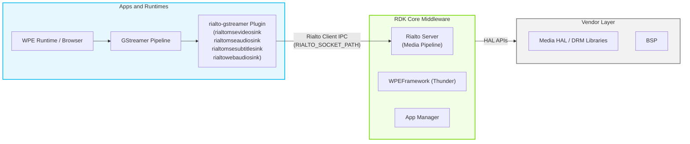
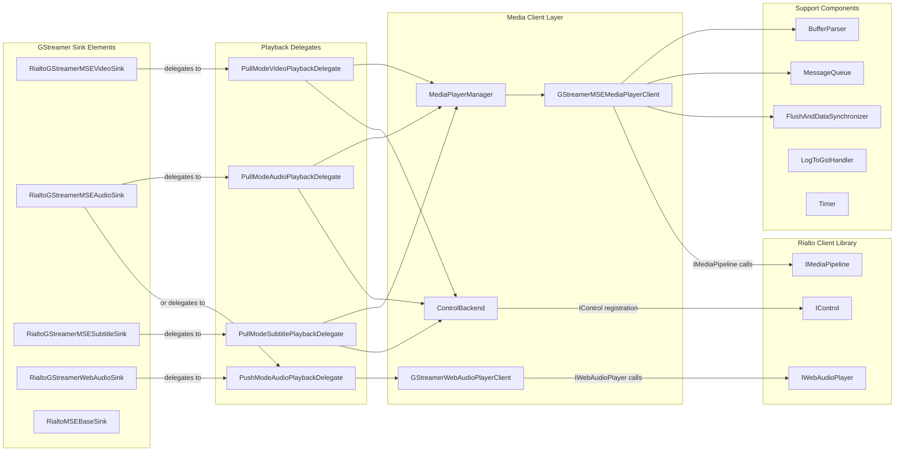
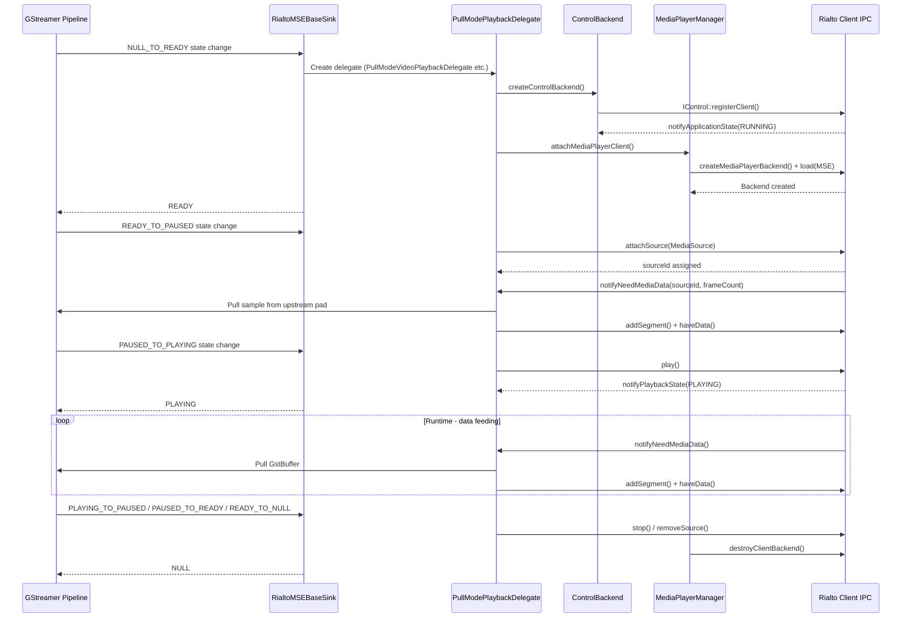
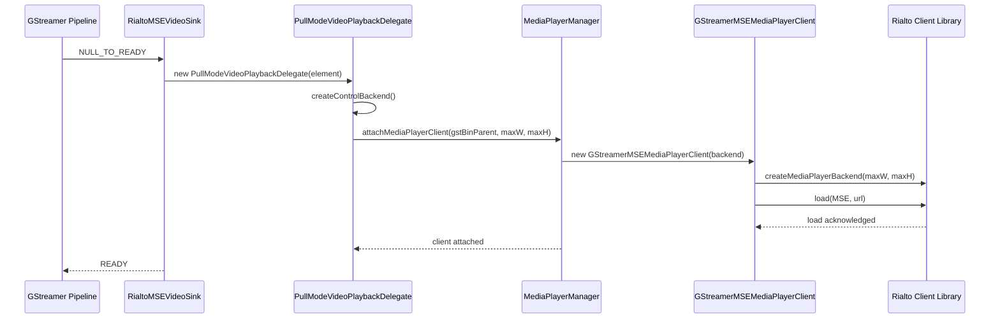
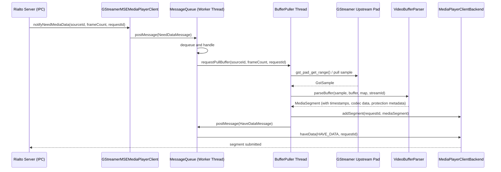
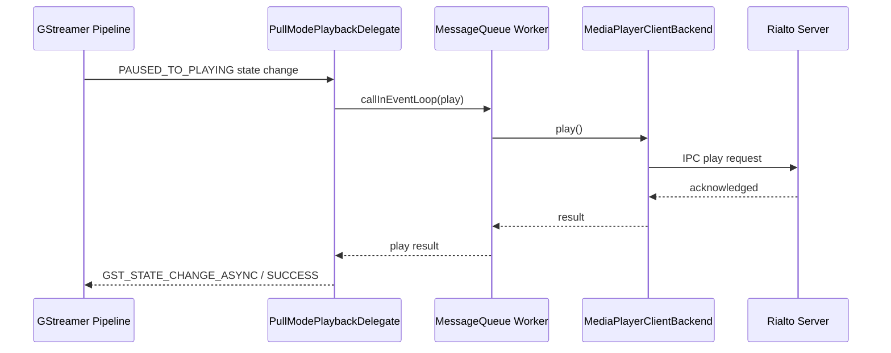
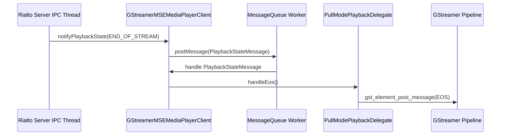

# rialto-gstreamer

rialto-gstreamer is a GStreamer plugin that provides custom sink elements enabling media pipelines within containerized applications to offload audio, video, and subtitle rendering to the Rialto server. It acts as the GStreamer-side adapter in the Rialto framework, translating standard GStreamer pipeline events, state transitions, and media buffers into Rialto Client API calls over IPC. The plugin registers four sink elements — a video sink, an audio sink, a subtitle sink, and a web audio sink — each targeting a distinct media type. By running inside the application process while the actual media processing occurs in the Rialto server, the plugin ensures that hardware-specific resources and DRM handles are never exposed to the application container.

From the device perspective, rialto-gstreamer allows browsers and native application runtimes using GStreamer-based media stacks to deliver protected and unprotected AV content without modifications to the playback engine. The plugin intercepts GStreamer pipeline control and data flows and routes them transparently to the Rialto server, which manages the actual hardware-accelerated decode and render pipeline. This decoupling enables robust isolation between application containers and platform media resources.

At the module level, rialto-gstreamer manages the full lifecycle of a media session: sink element construction and capability negotiation, GStreamer state machine transitions mapped to Rialto pipeline state transitions, media buffer parsing and submission (in both pull and push modes), playback control forwarding, EME-based content protection metadata extraction, and event propagation back to the GStreamer pipeline. A shared `MediaPlayerManager` allows multiple sink elements belonging to the same GStreamer pipeline to share a single `GStreamerMSEMediaPlayerClient` instance, coordinating their interactions with one Rialto media pipeline session.



**Key Features & Responsibilities:**

- **GStreamer sink element registration**: Registers four GStreamer sink elements (`rialtomsevideosink`, `rialtomseaudiosink`, `rialtomsesubtitlesink`, `rialtowebaudiosink`) at a configurable rank so the GStreamer element selection mechanism routes media data through the Rialto path.
- **Pull-mode media data feeding**: Responds to `notifyNeedMediaData` requests from the Rialto server by pulling GStreamer samples upstream, parsing them through `BufferParser`, and submitting them as `IMediaPipeline::MediaSegment` objects via `addSegment`.
- **Push-mode web audio delivery**: Delivers web audio streams via `GStreamerWebAudioPlayerClient`, queuing incoming GStreamer buffers and pushing PCM audio data to the Rialto web audio backend using `writeBuffer()` as buffer space becomes available.
- **EME / content protection handling**: Extracts per-buffer DRM protection metadata (key ID, IV, subsamples, cipher mode) from GStreamer buffer protection metadata and attaches it to each submitted media segment.
- **Playback lifecycle management**: Maps GStreamer element state transitions (NULL→READY→PAUSED→PLAYING and reverse) to the corresponding Rialto pipeline operations (load, attach source, play, pause, stop, flush).
- **Multi-sink coordination**: Coordinates audio and video sinks sharing the same parent GstBin so that a single Rialto media pipeline session is created and managed jointly by all active sinks through `MediaPlayerManager`.
- **Flush and data synchronization**: Uses `FlushAndDataSynchronizer` to guard against race conditions between flush operations and data submissions across multiple media sources.
- **Rialto log bridging**: Forwards internal Rialto client library log messages into the GStreamer debug log system via `LogToGstHandler`.

---

## Design

The plugin is designed around a delegate pattern layered over standard GStreamer element infrastructure. Each sink element type (`RialtoMSEBaseSink`, `RialtoGStreamerMSEVideoSink`, `RialtoGStreamerMSEAudioSink`, `RialtoGStreamerMSESubtitleSink`, `RialtoGStreamerWebAudioSink`) inherits the low-level GStreamer element boilerplate from a common base while delegating all media pipeline logic to a `IPlaybackDelegate` implementation. Delegates are created at the NULL→READY state transition and destroyed at READY→NULL, cleanly separating GStreamer element lifecycle from Rialto session lifecycle. The base sink element routes all GStreamer callbacks — `chain`, `event`, `query`, `change_state`, `send_event` — through the delegate, keeping the GStreamer element code minimal and testable.

The design separates two distinct data-flow modes. In pull mode, used by MSE video, audio, and subtitle sinks, `PullModePlaybackDelegate` maintains a local queue of incoming GStreamer samples and satisfies Rialto server `NeedData` requests by dequeuing, parsing, and submitting samples asynchronously. In push mode, used by the web audio path, `PushModeAudioPlaybackDelegate` drives the `GStreamerWebAudioPlayerClient` which opens a Rialto web audio session and feeds audio frames directly.

Northbound integration with the GStreamer pipeline is handled entirely through standard GStreamer APIs: caps negotiation, pad events, buffer chains, state change notifications, and GObject properties. The sink elements advertise supported capabilities queried dynamically from `IMediaPipelineCapabilities` at element registration time. Southbound integration is entirely through the Rialto Client library interfaces `IMediaPipeline`, `IMediaPipelineClient`, `IWebAudioPlayer`, `IWebAudioPlayerClient`, and `IControl`, which abstract all IPC with the Rialto server.

IPC with the Rialto server is performed entirely by the Rialto Client library using a Unix domain socket identified by the `RIALTO_SOCKET_PATH` environment variable. The `ControlBackend` registers the plugin as a Rialto control client and waits for the server to signal the `RUNNING` application state before allowing state transitions to proceed.

All playback state, position, and configuration are maintained in memory for the duration of the media session and re-established when a new GStreamer pipeline is created.



#### Threading Model

- **Threading Architecture**: Multi-threaded with one dedicated worker thread per `MessageQueue` instance, plus per-source `BufferPuller` threads in pull mode.
- **Main Thread**: GStreamer state-change dispatching, property get/set, and pad event handling execute on the calling GStreamer thread (typically a streaming thread or the application thread).
- **Worker Threads**:
  - _MessageQueue worker thread_: Owned by `GStreamerMSEMediaPlayerClient`. Processes all messages posted from Rialto server callbacks (`NeedDataMessage`, `PlaybackStateMessage`, `SetPositionMessage`, `QosMessage`, `BufferUnderflowMessage`, `SourceFlushedMessage`, etc.) serially to prevent concurrent access to pipeline state.
  - _BufferPuller queue thread_: One per attached source in pull mode. Receives `PullBufferMessage` requests, pulls GStreamer samples from the upstream pad, parses them with `BufferParser`, and submits segments via `addSegment`.
  - _Timer thread_: Used by `Timer` for one-shot or periodic callbacks, primarily in the web audio path.
- **Synchronization**: `m_sinkMutex` (per sink) protects the delegate pointer and queued properties. `m_mediaPlayerClientsMutex` (static on `MediaPlayerManager`) protects the shared media player client map. `m_playbackInfoMutex` protects the `PlaybackInfo` struct updated by the Rialto server notification. `FlushAndDataSynchronizer` uses a `std::condition_variable` to block data submissions while a flush is in progress.
- **Async / Event Dispatch**: Rialto server callbacks (e.g., `notifyPlaybackState`, `notifyNeedMediaData`) are received on the Rialto client IPC thread and immediately posted as `Message` objects to the `MessageQueue`, which processes them on the worker thread. This prevents IPC callback threads from blocking on GStreamer pipeline operations.

### Prerequisites and Dependencies

#### Platform and Integration Requirements

- **Build Dependencies**: `gstreamer1.0`, `gstreamer1.0-plugins-base` (`gstreamer-app-1.0`, `gstreamer-audio-1.0`, `gstreamer-pbutils-1.0`), `glib-2.0`, `openssl`, `jsoncpp`, `protobuf`, `rialto` (RialtoClient), `rialto-ocdm`. Requires `enable_rialto` Yocto distro feature flag.
- **HAL**: Hardware abstraction is fully handled by the Rialto server; this component operates exclusively through the Rialto Client library interfaces.
- **Systemd Services**: The Rialto server daemon must be running and have signaled the `RUNNING` application state before sink elements can transition beyond the READY state. `ControlBackend::waitForRunning` blocks with a 1-second timeout waiting for this signal.
- **Runtime Configuration**: Runtime behavior is governed by the `RIALTO_SOCKET_PATH` and `RIALTO_SINKS_RANK` environment variables.
- **Startup Order**: The Rialto server process must be active and its Unix domain socket available at `RIALTO_SOCKET_PATH` before any sink element transitions from NULL to READY.

---

### Component State Flow

#### Initialization to Active State

The plugin is loaded by the GStreamer plugin registry when the runtime process starts a GStreamer pipeline. Sink registration occurs inside `rialto_mse_sinks_init`, which checks the `RIALTO_SOCKET_PATH` and `RIALTO_SINKS_RANK` environment variables to determine the element rank. When the rank resolves to zero, the GStreamer pipeline proceeds with its standard element selection.

Each sink element transitions through the following states: **NULL** (element constructed, no resources allocated) → **READY** (delegate created, `ControlBackend` initialized, Rialto server `RUNNING` state awaited, media player client attached via `MediaPlayerManager`) → **PAUSED** (source attached to Rialto pipeline, streaming started, data requested) → **PLAYING** (Rialto pipeline play issued) → **PAUSED** → **READY** → **NULL** (flush, stop, source removal, delegate destroyed, media player client released).



#### Runtime State Changes

During normal playback, the Rialto server periodically sends `notifyNeedMediaData` to request more frames. The delegate responds by pulling samples from the GStreamer pipeline and submitting them. Position and duration updates arrive via `notifyPosition` and `notifyDuration`, which are forwarded to the GStreamer segment and posted as messages.

**State Change Triggers:**

- `notifyPlaybackState(PLAYING/PAUSED/STOPPED/END_OF_STREAM)` posted to the MessageQueue triggers corresponding GStreamer state or EOS message propagation upstream.
- A flush event from the GStreamer pipeline (`GST_EVENT_FLUSH_START/STOP`) triggers `flush()` on the Rialto pipeline via `MediaPlayerClientBackendInterface::flush()`, and `FlushAndDataSynchronizer` blocks any concurrent `addSegment` calls until the server confirms flush completion via `notifySourceFlushed`.
- `notifyBufferUnderflow` emits the `underflow` GSignal on the sink element, which the parent pipeline can handle to adjust buffering.
- `notifyPlaybackError(DECRYPTION / OUTPUT_PROTECTION)` posts a GStreamer error message to the pipeline bus.

**Context Switching Scenarios:**

- If `notifyApplicationState` delivers `INACTIVE` from the Rialto server, `lostState()` is called on the delegate, which can trigger recovery or error propagation.
- A seek event (`GST_EVENT_SEEK`) results in a `setSourcePosition` call followed by a flush sequence to realign the server-side pipeline to the new position.
- Rate change events trigger `setPlaybackRate` on the media player backend.

---

### Call Flows

#### Initialization Call Flow



#### Request Processing Call Flow

The video sink receives a `notifyNeedMediaData` callback from the Rialto server, which is enqueued on the `MessageQueue`. The worker thread dequeues it, posts a `PullBufferMessage` to the `BufferPuller` queue, which pulls a `GstSample` from the upstream GStreamer pad, parses it using `VideoBufferParser`, and calls `addSegment` followed by `haveData` on the Rialto pipeline backend.



---

## Internal Modules

| Module / Class                     | Description                                                                                                                                                                                                                                                                                                                                                                                    | Key Files                                                                                               |
| ---------------------------------- | ---------------------------------------------------------------------------------------------------------------------------------------------------------------------------------------------------------------------------------------------------------------------------------------------------------------------------------------------------------------------------------------------- | ------------------------------------------------------------------------------------------------------- |
| `RialtoGStreamerMSEVideoSink`      | GStreamer sink element for video streams. Registers the `rialtomsevideosink` element. On NULL→READY creates a `PullModeVideoPlaybackDelegate`. Exposes GObject properties for window geometry, max resolution, immediate output, sync mode, and decode error reporting. Emits `first-video-frame-received` signal.                                                                             | `RialtoGStreamerMSEVideoSink.cpp`, `RialtoGStreamerMSEVideoSink.h`                                      |
| `RialtoGStreamerMSEAudioSink`      | GStreamer sink element for audio streams. Registers the `rialtomseaudiosink` element. Selects between `PullModeAudioPlaybackDelegate` and `PushModeAudioPlaybackDelegate` at NULL→READY based on the `PlaybackMode` setting. Implements `GstStreamVolume` interface. Exposes volume, mute, sync, low-latency, buffering, and audio-fade properties. Emits `first-audio-frame-received` signal. | `RialtoGStreamerMSEAudioSink.cpp`, `RialtoGStreamerMSEAudioSink.h`                                      |
| `RialtoGStreamerMSESubtitleSink`   | GStreamer sink element for subtitle streams. Registers the `rialtomsesubtitlesink` element. Creates a `PullModeSubtitlePlaybackDelegate` on NULL→READY. Exposes mute, text-track-identifier, and window-id properties.                                                                                                                                                                         | `RialtoGStreamerMSESubtitleSink.cpp`, `RialtoGStreamerMSESubtitleSink.h`                                |
| `RialtoGStreamerWebAudioSink`      | GStreamer sink element for web audio streams. Registers the `rialtowebaudiosink` element. Uses `PushModeAudioPlaybackDelegate` backed by `GStreamerWebAudioPlayerClient`. Exposes volume and ts-offset properties.                                                                                                                                                                             | `RialtoGStreamerWebAudioSink.cpp`, `RialtoGStreamerWebAudioSink.h`                                      |
| `RialtoMSEBaseSink`                | Common base GStreamer element for all MSE sinks. Owns the sink pad and routes all GStreamer callbacks (chain, event, query, send_event, change_state) to the active `IPlaybackDelegate`. Manages queued properties before the delegate is initialized.                                                                                                                                         | `RialtoGStreamerMSEBaseSink.cpp`, `RialtoGStreamerMSEBaseSink.h`, `RialtoGStreamerMSEBaseSinkPrivate.h` |
| `PullModePlaybackDelegate`         | Base class for pull-mode delegates. Manages the GStreamer sample queue, handles upstream pad events (EOS, flush, segment, caps), drives the `MediaPlayerManager` attachment, and orchestrates the flush sequence with the Rialto server.                                                                                                                                                       | `PullModePlaybackDelegate.cpp`, `PullModePlaybackDelegate.h`                                            |
| `PullModeVideoPlaybackDelegate`    | Extends `PullModePlaybackDelegate` for video. Constructs a `MediaSourceVideo` from negotiated GstCaps. Manages video window rectangle, max resolution, immediate output, syncmode-streaming, and render-frame-step-on-preroll properties.                                                                                                                                                      | `PullModeVideoPlaybackDelegate.cpp`, `PullModeVideoPlaybackDelegate.h`                                  |
| `PullModeAudioPlaybackDelegate`    | Extends `PullModePlaybackDelegate` for audio. Constructs a `MediaSourceAudio` from negotiated GstCaps. Manages volume, mute, low-latency, sync, sync-off, stream-sync-mode, audio-fade, buffering-limit, and use-buffering properties.                                                                                                                                                         | `PullModeAudioPlaybackDelegate.cpp`, `PullModeAudioPlaybackDelegate.h`                                  |
| `PullModeSubtitlePlaybackDelegate` | Extends `PullModePlaybackDelegate` for subtitles. Constructs a `MediaSourceSubtitle` from negotiated GstCaps. Manages text-track-identifier, window-id, and mute properties.                                                                                                                                                                                                                   | `PullModeSubtitlePlaybackDelegate.cpp`, `PullModeSubtitlePlaybackDelegate.h`                            |
| `PushModeAudioPlaybackDelegate`    | Handles push-mode audio (web audio). Owns a `GStreamerWebAudioPlayerClient` and a `ControlBackend`. Responds to GStreamer buffer chain calls by writing audio data to the Rialto web audio pipeline.                                                                                                                                                                                           | `PushModeAudioPlaybackDelegate.cpp`, `PushModeAudioPlaybackDelegate.h`                                  |
| `GStreamerMSEMediaPlayerClient`    | Implements `IMediaPipelineClient`. Receives Rialto server callbacks (position, duration, playback state, need-data, QoS, underflow, flush) and dispatches them as messages on the `MessageQueue` worker thread. Owns the `MediaPlayerClientBackendInterface` and manages the set of `AttachedSource` entries.                                                                                  | `GStreamerMSEMediaPlayerClient.cpp`, `GStreamerMSEMediaPlayerClient.h`                                  |
| `GStreamerWebAudioPlayerClient`    | Implements `IWebAudioPlayerClient`. Opens and closes the Rialto web audio session and feeds PCM audio data by calling `writeBuffer()` on the Rialto web audio backend as incoming GStreamer buffers are queued and drained. Uses a timer to schedule periodic write attempts when the backend buffer is temporarily full.                                                                      | `GStreamerWebAudioPlayerClient.cpp`, `GStreamerWebAudioPlayerClient.h`                                  |
| `MediaPlayerManager`               | Manages the lifecycle of shared `GStreamerMSEMediaPlayerClient` instances, keyed by the top-level `GstBin` parent. Allows multiple sink elements in the same pipeline to share a single Rialto media pipeline session and coordinates control acquisition.                                                                                                                                     | `MediaPlayerManager.cpp`, `MediaPlayerManager.h`                                                        |
| `BufferParser`                     | Abstract base for per-media-type GstBuffer parsing. Extracts timestamp, duration, codec data, display offset, and DRM protection metadata from a `GstSample`, producing an `IMediaPipeline::MediaSegment`. Concrete subclasses: `AudioBufferParser`, `VideoBufferParser`, `SubtitleBufferParser`.                                                                                              | `BufferParser.cpp`, `BufferParser.h`                                                                    |
| `MessageQueue`                     | Thread-safe FIFO queue backed by a dedicated `std::thread`. Supports `postMessage` (asynchronous), `callInEventLoop` (synchronous, caller blocks until processed), and `scheduleInEventLoop` (asynchronous dispatch).                                                                                                                                                                          | `MessageQueue.cpp`, `MessageQueue.h`                                                                    |
| `FlushAndDataSynchronizer`         | Tracks per-source flush and data states. Blocks `addSegment` calls on sources that are currently being flushed or that have not yet received their first data after a flush, preventing stale data from reaching the Rialto server.                                                                                                                                                            | `FlushAndDataSynchronizer.cpp`, `FlushAndDataSynchronizer.h`                                            |
| `ControlBackend`                   | Wraps the Rialto `IControl` interface. Registers the sink as a control client, receives `notifyApplicationState` transitions from the Rialto server, and exposes a `waitForRunning()` method that blocks until the server is active.                                                                                                                                                           | `ControlBackend.h`                                                                                      |
| `GStreamerEMEUtils`                | Reads GStreamer protection metadata from a `GstBuffer` (CENC and WebM encryption formats) and populates a `BufferProtectionMetadata` struct with key ID, IV, subsample map, and cipher mode for downstream attachment to media segments.                                                                                                                                                       | `GStreamerEMEUtils.cpp`, `GStreamerEMEUtils.h`                                                          |
| `GStreamerMSEUtils`                | Utility functions for capabilities setup: translates GstCaps structures into Rialto-native types (`Layout`, `Format`, `StreamFormat`, `SegmentAlignment`, codec data, Dolby Vision profile). Also sets supported caps on element classes using `IMediaPipelineCapabilities`.                                                                                                                   | `GStreamerMSEUtils.cpp`, `GStreamerMSEUtils.h`                                                          |
| `LogToGstHandler`                  | Implements `IClientLogHandler` to redirect Rialto client library internal log messages to the GStreamer debug logging system.                                                                                                                                                                                                                                                                  | `LogToGstHandler.cpp`, `LogToGstHandler.h`                                                              |
| `Timer` / `TimerFactory`           | Provides one-shot and periodic timer functionality used by the web audio client to schedule periodic data writes. Each `Timer` runs its own `std::thread`.                                                                                                                                                                                                                                     | `Timer.cpp`, `Timer.h`                                                                                  |

---

## Component Interactions

rialto-gstreamer communicates upward with the GStreamer pipeline through standard GStreamer pad and element APIs, and downward with the Rialto server through the Rialto Client library interfaces over IPC.

### Interaction Matrix

| Target Component / Layer     | Interaction Purpose                                                                                                                     | Key APIs / Topics                                                                                                                                                                                                                               |
| ---------------------------- | --------------------------------------------------------------------------------------------------------------------------------------- | ----------------------------------------------------------------------------------------------------------------------------------------------------------------------------------------------------------------------------------------------- |
| **Rialto Client Library**    |                                                                                                                                         |                                                                                                                                                                                                                                                 |
| `IMediaPipeline`             | Load, play, pause, stop, seek, rate change, window set, and source management for MSE playback                                          | `load()`, `play()`, `pause()`, `stop()`, `attachSource()`, `removeSource()`, `allSourcesAttached()`, `addSegment()`, `haveData()`, `flush()`, `setSourcePosition()`, `setPlaybackRate()`, `setVideoWindow()`, `renderFrame()`, `switchSource()` |
| `IMediaPipelineClient`       | Receive server-driven notifications for playback state, position, duration, data requests, QoS, underflow, errors, and flush completion | `notifyPlaybackState()`, `notifyPosition()`, `notifyDuration()`, `notifyNeedMediaData()`, `notifyQos()`, `notifyBufferUnderflow()`, `notifyPlaybackError()`, `notifySourceFlushed()`, `notifyFirstFrameReceived()`, `notifyPlaybackInfo()`      |
| `IWebAudioPlayer`            | Open, write, play, pause, and close web audio sessions                                                                                  | `open()`, `writeBuffer()`, `play()`, `pause()`, `setVolume()`, `getVolume()`                                                                                                                                                                    |
| `IWebAudioPlayerClient`      | Receive server-driven notifications for web audio playback state transitions                                                            | `notifyState()`                                                                                                                                                                                                                                 |
| `IControl`                   | Register as a Rialto control client to receive application state transitions                                                            | `IControl::registerClient()`, `notifyApplicationState()`                                                                                                                                                                                        |
| `IMediaPipelineCapabilities` | Query supported MIME types at sink element class initialization to populate GstCaps                                                     | `getSupportedMimeTypes()`                                                                                                                                                                                                                       |
| **GStreamer Pipeline**       |                                                                                                                                         |                                                                                                                                                                                                                                                 |
| GStreamer upstream           | Receive media buffers via pad chain or pull-mode sample requests                                                                        | `gst_pad_get_range()`, `gst_pad_pull_range()`, GstBuffer chain                                                                                                                                                                                  |
| GStreamer bus                | Post EOS, error, state-change, and QoS messages upstream                                                                                | `gst_element_post_message()`, `gst_message_new_eos()`, `gst_message_new_error()`                                                                                                                                                                |
| GStreamer pad events         | Handle CAPS, SEGMENT, EOS, FLUSH_START, FLUSH_STOP, SEEK events                                                                         | `gst_pad_event_default()`, `GST_EVENT_*`                                                                                                                                                                                                        |

### Events Published

| Event Name                   | GStreamer Signal / Message                      | Trigger Condition                                                        | Subscriber Components            |
| ---------------------------- | ----------------------------------------------- | ------------------------------------------------------------------------ | -------------------------------- |
| `first-video-frame-received` | GObject signal on `RialtoGStreamerMSEVideoSink` | `notifyFirstFrameReceived` received from Rialto server for video source  | GStreamer pipeline / application |
| `first-audio-frame-received` | GObject signal on `RialtoGStreamerMSEAudioSink` | `notifyFirstFrameReceived` received from Rialto server for audio source  | GStreamer pipeline / application |
| `underflow`                  | GObject signal on `RialtoMSEBaseSink`           | `notifyBufferUnderflow` received from Rialto server                      | GStreamer pipeline / application |
| EOS message                  | `GstMessageEOS` on pipeline bus                 | `notifyPlaybackState(END_OF_STREAM)` from Rialto server                  | GStreamer pipeline               |
| Error message                | `GstMessageError` on pipeline bus               | `notifyPlaybackError(DECRYPTION / OUTPUT_PROTECTION)` from Rialto server | GStreamer pipeline               |

### IPC Flow Patterns

**Primary Request / Response Flow:**

GStreamer state transitions, property changes, and playback control operations are forwarded synchronously (via `callInEventLoop`) or asynchronously (via `postMessage`) through the `MessageQueue` worker thread to the Rialto Client library, which serializes them over IPC to the Rialto server.



**Event Notification Flow:**

Rialto server callbacks arrive on the IPC receiver thread, are immediately wrapped as `Message` objects and posted to the `MessageQueue`, then processed on the worker thread to update pipeline state or propagate events into the GStreamer pipeline.



---

## Implementation Details

### Major HAL APIs Integration

Hardware-level operations are handled by the Rialto server. The Rialto Client APIs listed below represent the full southbound API surface of this component.

| Rialto Client API                           | Purpose                                                                                                  | Implementation File                                                         |
| ------------------------------------------- | -------------------------------------------------------------------------------------------------------- | --------------------------------------------------------------------------- |
| `createMediaPlayerBackend()`                | Creates a media player session on the Rialto server with max video resolution constraints                | `GStreamerMSEMediaPlayerClient.cpp`                                         |
| `load(MSE, url)`                            | Loads the MSE media type into the Rialto pipeline                                                        | `GStreamerMSEMediaPlayerClient.cpp`                                         |
| `attachSource()`                            | Registers an audio, video, or subtitle source with the Rialto pipeline                                   | `PullModePlaybackDelegate.cpp`                                              |
| `removeSource()`                            | Detaches a source from the Rialto pipeline                                                               | `PullModePlaybackDelegate.cpp`                                              |
| `allSourcesAttached()`                      | Signals that all sources have been attached and the pipeline may proceed                                 | `GStreamerMSEMediaPlayerClient.cpp`                                         |
| `addSegment()`                              | Submits a parsed media segment (with timestamps and optional encryption metadata) to the Rialto pipeline | `GStreamerMSEMediaPlayerClient.cpp`                                         |
| `haveData()`                                | Notifies the Rialto server of the data submission status for a given `NeedData` request ID               | `GStreamerMSEMediaPlayerClient.cpp`                                         |
| `play()`                                    | Starts or resumes playback                                                                               | `GStreamerMSEMediaPlayerClient.cpp`                                         |
| `pause()`                                   | Pauses playback                                                                                          | `GStreamerMSEMediaPlayerClient.cpp`                                         |
| `stop()`                                    | Stops playback and resets the pipeline                                                                   | `GStreamerMSEMediaPlayerClient.cpp`                                         |
| `flush()`                                   | Issues a flush for a specific source, with optional time reset                                           | `PullModePlaybackDelegate.cpp`                                              |
| `setSourcePosition()`                       | Sets the decode position for a source after a seek or discontinuity                                      | `PullModePlaybackDelegate.cpp`                                              |
| `setPlaybackRate()`                         | Changes the playback rate for trick-play                                                                 | `PullModePlaybackDelegate.cpp`                                              |
| `setVideoWindow()`                          | Sets the video output rectangle                                                                          | `GStreamerMSEMediaPlayerClient.cpp`                                         |
| `renderFrame()`                             | Requests a single frame render (frame-step on preroll)                                                   | `PullModeVideoPlaybackDelegate.cpp`                                         |
| `setVolume()`                               | Sets audio volume with optional fade duration and ease type                                              | `PullModeAudioPlaybackDelegate.cpp`                                         |
| `getVolume()`                               | Queries current audio volume                                                                             | `PullModeAudioPlaybackDelegate.cpp`                                         |
| `setMute()`                                 | Sets mute state per source                                                                               | `PullModeAudioPlaybackDelegate.cpp`, `PullModeSubtitlePlaybackDelegate.cpp` |
| `getMute()`                                 | Queries mute state                                                                                       | `PullModeAudioPlaybackDelegate.cpp`                                         |
| `setLowLatency()`                           | Enables or disables low-latency audio mode                                                               | `PullModeAudioPlaybackDelegate.cpp`                                         |
| `setSync()` / `setSyncOff()`                | Controls audio/video synchronization behavior                                                            | `PullModeAudioPlaybackDelegate.cpp`                                         |
| `setStreamSyncMode()`                       | Sets the stream synchronization mode per source                                                          | `PullModeAudioPlaybackDelegate.cpp`                                         |
| `setBufferingLimit()` / `setUseBuffering()` | Controls media buffering limits and behavior                                                             | `PullModeAudioPlaybackDelegate.cpp`                                         |
| `setImmediateOutput()`                      | Enables or disables immediate output mode for the video decoder                                          | `PullModeVideoPlaybackDelegate.cpp`                                         |
| `setReportDecodeErrors()`                   | Enables or disables decode error reporting per source                                                    | `PullModeVideoPlaybackDelegate.cpp`                                         |
| `getStats()`                                | Retrieves rendered and dropped frame counts                                                              | `GStreamerMSEMediaPlayerClient.cpp`                                         |
| `getQueuedFrames()`                         | Retrieves the count of frames queued in the Rialto server pipeline                                       | `GStreamerMSEMediaPlayerClient.cpp`                                         |
| `getDuration()`                             | Queries the current media duration                                                                       | `GStreamerMSEMediaPlayerClient.cpp`                                         |
| `setTextTrackIdentifier()`                  | Sets the text track identifier for subtitle selection                                                    | `PullModeSubtitlePlaybackDelegate.cpp`                                      |
| `setSubtitleOffset()`                       | Sets a timing offset for subtitle streams                                                                | `PullModeSubtitlePlaybackDelegate.cpp`                                      |
| `processAudioGap()`                         | Notifies the server of an audio gap or discontinuity                                                     | `PullModeAudioPlaybackDelegate.cpp`                                         |
| `switchSource()`                            | Switches the codec or format of an attached source without tearing down the pipeline                     | `PullModePlaybackDelegate.cpp`                                              |
| `IControl::registerClient()`                | Registers the sink as a Rialto control client to receive application state notifications                 | `ControlBackend.h`                                                          |

### Key Implementation Logic

- **State / Lifecycle Management**: GStreamer state transition handling is split between the sink element (`change_state` virtual) and the delegate. The delegate's `changeState` method executes the Rialto-side transition (create backend, attach source, play, pause, stop) and returns a `GstStateChangeReturn` value. READY→NULL resets the delegate pointer in the base sink, releasing all Rialto session resources.
  - Sink element state dispatch: `RialtoGStreamerMSEBaseSink.cpp`
  - Rialto session lifecycle: `PullModePlaybackDelegate.cpp`, `GStreamerMSEMediaPlayerClient.cpp`

- **Event Processing**: Rialto server callbacks are received on the IPC thread and posted immediately to the `MessageQueue` as typed `Message` subclasses. The worker thread processes them serially, preventing concurrent modification of playback state. The `BufferPuller` thread operates on a separate `IMessageQueue` instance, decoupled from the backend notification queue.
  - Message dispatch: `GStreamerMSEMediaPlayerClient.cpp`
  - Buffer pull: `GStreamerMSEMediaPlayerClient.cpp` (`BufferPuller`, `PullBufferMessage`)

- **Error Handling Strategy**: Errors from Rialto Client calls are checked for boolean return values; failures are logged with `GST_ERROR_OBJECT` and, where appropriate, propagated as `GstMessageError` on the pipeline bus. `notifyPlaybackError` maps to a GStreamer error message with the error type (DECRYPTION, OUTPUT_PROTECTION) included in the message string. State change failures return `GST_STATE_CHANGE_FAILURE`, which propagates naturally through the GStreamer state machine.

- **Logging & Diagnostics**: GStreamer debug categories are defined per sink element (`RialtoMSEBaseSinkDebug`, `RialtoMSEVideoSinkDebug`, `RialtoMSEAudioSinkDebug`, `RialtoMSESubtitleSinkDebug`, `RialtoWebAudioSinkDebug`) and a shared plugin-level category (`rialtoGStreamerCat`). Internal Rialto client library logs are redirected to the GStreamer logging system via `LogToGstHandler`. When the `USE_ETHANLOG` compile-time flag is set, logs are also forwarded to the EthanLog subsystem.

---

## Configuration

### Key Configuration Parameters

| Parameter            | Type                                    | Default         | Description                                                                                                                                                                                                                                               |
| -------------------- | --------------------------------------- | --------------- | --------------------------------------------------------------------------------------------------------------------------------------------------------------------------------------------------------------------------------------------------------- |
| `RIALTO_SOCKET_PATH` | Environment variable (string)           | Not set         | Path to the Rialto server Unix domain socket. When set, sink elements are registered at maximum GStreamer rank, enabling automatic selection by the pipeline. When unset, the rank resolves to zero and the pipeline uses its standard element selection. |
| `RIALTO_SINKS_RANK`  | Environment variable (unsigned integer) | Not set         | Overrides the GStreamer element rank for all registered sink elements. When set, takes precedence over the rank derived from `RIALTO_SOCKET_PATH`.                                                                                                        |
| `max-video-width`    | GObject property (uint)                 | 3840            | Maximum video width constraint passed to the Rialto server when creating the media player backend.                                                                                                                                                        |
| `max-video-height`   | GObject property (uint)                 | 2160            | Maximum video height constraint passed to the Rialto server when creating the media player backend.                                                                                                                                                       |
| `volume`             | GObject property (double)               | 1.0             | Audio volume level (0.0–1.0) forwarded to the Rialto audio pipeline.                                                                                                                                                                                      |
| `mute`               | GObject property (bool)                 | false           | Audio or subtitle mute state forwarded to the Rialto pipeline.                                                                                                                                                                                            |
| `low-latency`        | GObject property (bool)                 | false           | Enables low-latency audio mode in the Rialto server pipeline.                                                                                                                                                                                             |
| `limit-buffering-ms` | GObject property (uint)                 | 750             | Maximum buffering duration in milliseconds forwarded to the Rialto server.                                                                                                                                                                                |
| `use-buffering`      | GObject property (bool)                 | false           | Enables server-side buffering management.                                                                                                                                                                                                                 |
| `immediate-output`   | GObject property (bool)                 | false           | Enables immediate output mode for the video decoder in the Rialto server.                                                                                                                                                                                 |
| `syncmode-streaming` | GObject property (bool)                 | false           | Enables streaming sync mode for video playback.                                                                                                                                                                                                           |
| `window-set`         | GObject property (string)               | "0,0,1920,1080" | Video display rectangle as `"x,y,width,height"` forwarded to the Rialto server.                                                                                                                                                                           |

### Runtime Configuration

Sink rank can be configured at runtime before the GStreamer pipeline is instantiated by setting environment variables:

```bash
# Enable Rialto sinks with automatic maximum rank
export RIALTO_SOCKET_PATH=/tmp/rialto-0

# Override sink rank explicitly
export RIALTO_SINKS_RANK=268435455
```

### Configuration Persistence

Properties set before the NULL→READY transition are queued in `m_queuedProperties` and applied to the delegate once it is initialized.
