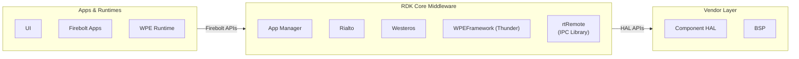
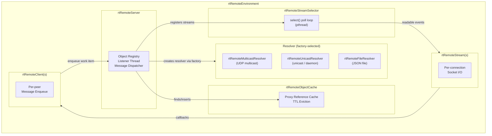
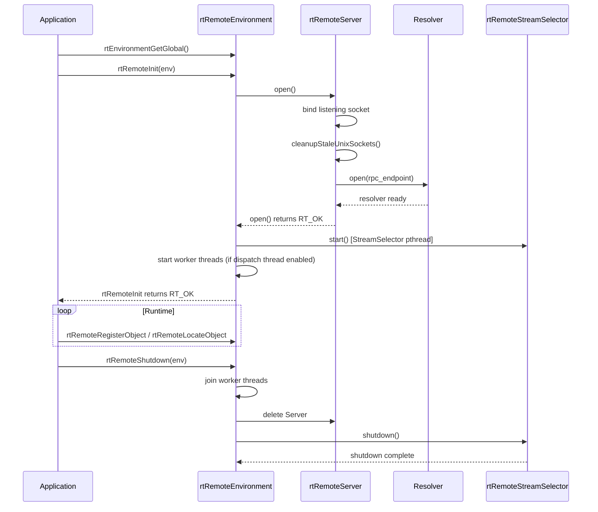
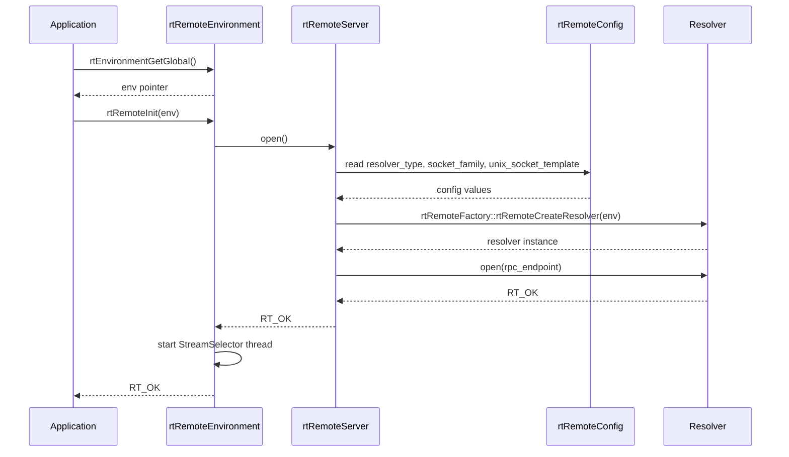
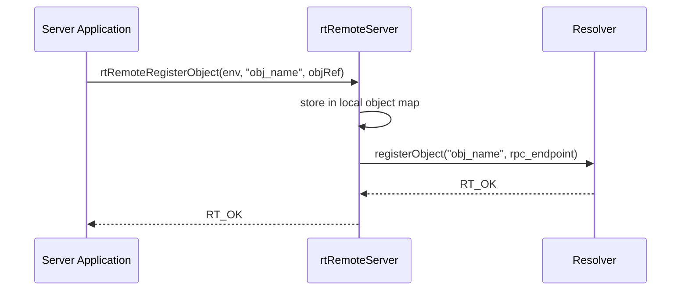
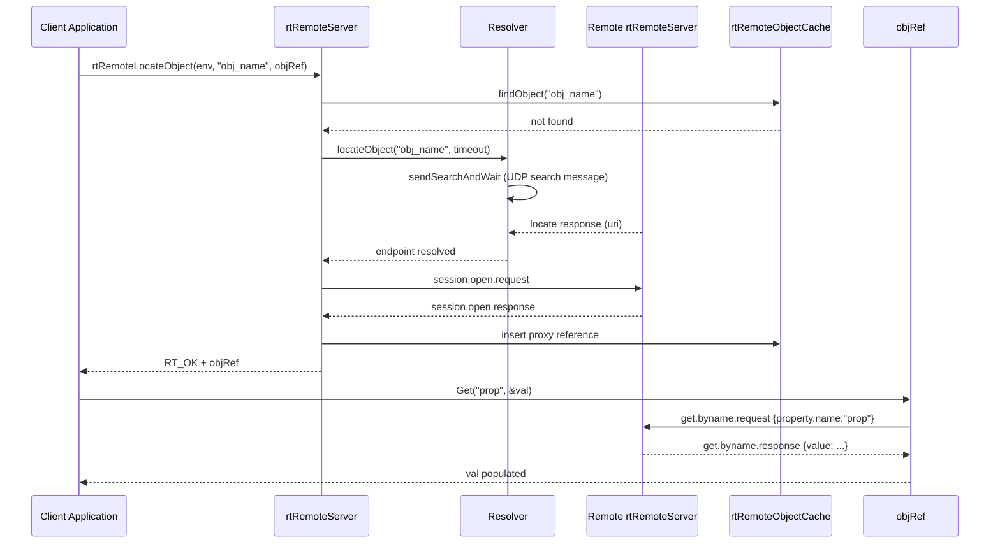
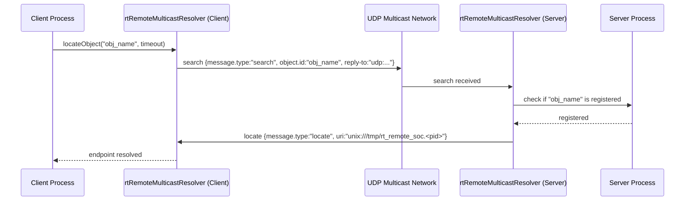
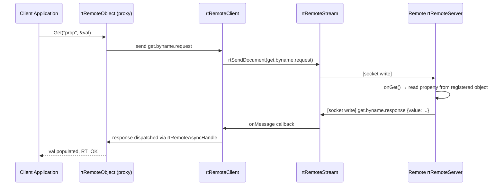

# rtRemote

---

rtRemote is a library and protocol for object-oriented inter-process communication (IPC) within the RDK middleware stack. It is built on the rt object model, which employs a dynamically typed value system. rtRemote enables any process to expose rt objects under a named identifier, and allows other processes — on the same host or across a network — to locate and interact with those objects through a transparent proxy interface. All interactions, including property reads, property writes, and method invocations, are carried out over sockets using a JSON-encoded message protocol.

As a middleware IPC component, rtRemote provides a transport-neutral communication layer that decouples object providers from object consumers. An application registers an object under a logical name; a client process calls a locate API to receive a proxy, and subsequently drives the remote object as if it were local. The resolver subsystem abstracts how named objects are discovered, supporting multicast UDP, unicast UDP via a name service daemon, and file-based resolution.

rtRemote operates independently as a shared library that any RDK middleware component can link against when cross-process object communication is required.



**Key Features & Responsibilities:**

- **Object Registration**: A server-side process registers an rt object under a string identifier using `rtRemoteRegisterObject()`, making it available to remote clients without any knowledge of transport details.
- **Object Discovery**: Clients locate registered objects by name via `rtRemoteLocateObject()`, which triggers a resolver lookup and returns a proxy object that transparently delegates calls across the socket boundary.
- **Property Get/Set**: Once a proxy is obtained, clients read or write named properties on the remote object using standard `Get()` and `Set()` calls; rtRemote encodes and transmits the operations as JSON messages.
- **Method Invocation**: Clients invoke methods on remote objects through the proxy interface; arguments and return values are serialized using the rtValue type system and conveyed over the established stream.
- **Pluggable Resolver Backends**: Object discovery is handled by an interchangeable resolver selected at runtime: multicast UDP (default), unicast UDP with a name service daemon, or a JSON file on disk.
- **Keep-Alive Management**: The stream layer detects inactivity and sends keep-alive messages to maintain sessions, reporting stream closure to registered state-change handlers.
- **Async Request Handling**: Outgoing requests return an `rtRemoteAsyncHandle` that callers can wait on, with configurable per-request timeouts and correlation-key-based response matching.
- **Object Cache**: Remote proxy references are stored in a time-bounded cache; entries expire after a configurable idle lifetime and can be marked unevictable for long-lived objects.

---

## Design

rtRemote is designed around a clean separation between the environment lifecycle, the object-serving layer, the stream I/O layer, and the resolver layer. An `rtRemoteEnvironment` instance is the root container; it owns a single `rtRemoteServer`, an `rtRemoteObjectCache`, and an `rtRemoteStreamSelector`. The environment is reference-counted, allowing multiple independent subsystems to share a global environment and shut it down cooperatively.

The serving layer (`rtRemoteServer`) handles both inbound and outbound sides. On the inbound side it listens for new TCP or Unix-domain connections, accepts them, and constructs `rtRemoteClient` objects that represent connected peers. On the outbound side it drives the resolver to locate remote objects and opens client connections to the addresses returned. All message dispatching is done through a typed handler table keyed on message type strings.

The stream I/O layer separates socket lifecycle (`rtRemoteStream`) from multiplexing (`rtRemoteStreamSelector`). Each stream owns a single file descriptor and delegates activity notifications to a callback handler. The stream selector runs a `select()`-based polling loop across all registered streams, routing readable data to the appropriate stream and triggering inactivity callbacks for keep-alive purposes.

The resolver layer is abstracted behind `rtRemoteIResolver`. The factory (`rtRemoteFactory`) instantiates the concrete resolver at environment startup based on the `rt.rpc.resolver.type` configuration parameter. The multicast resolver broadcasts UDP search messages and listens for locate responses; the unicast resolver connects to a dedicated name service daemon (`rtresolvd`); the file resolver reads and writes a shared JSON file on disk.

Serialization of all rt-typed values is handled exclusively by `rtRemoteValueReader` and `rtRemoteValueWriter`, which convert between `rtValue` instances and JSON using the RapidJSON library. All on-wire messages carry a UUID correlation key so that responses can be matched to their originating requests even when multiple in-flight requests share the same stream.

Interactions with the north-bound direction (application or middleware components that call the public API in `rtRemote.h`) are entirely synchronous at the API level: `rtRemoteLocateObject` blocks until the resolver finds the object or the locate timeout expires. `Get`, `Set`, and method call operations block on the `rtRemoteAsyncHandle` wait mechanism until a response arrives or the request timeout fires.

The south-bound direction is the platform's POSIX socket layer. rtRemote creates Unix-domain stream sockets for local communication and falls back to TCP when cross-host communication is required, communicating directly with the OS networking layer through POSIX socket primitives.

All runtime state is maintained in process memory. The file resolver maintains an on-disk JSON file as an external registry shared between processes.



#### Threading Model

- **Threading Architecture**: Multi-threaded
- **Main Thread**: Calls the public API (`rtRemoteInit`, `rtRemoteLocateObject`, `Get`, `Set`). Drives `processSingleWorkItem` when the dispatch thread is disabled.
- **Worker Threads** (if applicable):
  - _StreamSelector thread_: A single `pthread` running the `select()` loop over all registered stream file descriptors. Fires inactivity callbacks to trigger keep-alive sends. Runs unconditionally on environment startup.
  - _Dispatch worker threads_: Up to four `std::thread` workers running `processRunQueue`, consuming the work-item queue and invoking registered response handlers. Active only when `rt.rpc.server.use_dispatch_thread` is `true`.
  - _Resolver read thread_: Each resolver type (multicast, unicast, name-service) spawns its own listener thread that reads incoming UDP or TCP messages and posts results to condition-variable-protected pending-search maps.
  - _Server listener thread_: A thread inside `rtRemoteServer` that calls `accept()` on the listening socket and constructs `rtRemoteClient` instances for each new connection.
- **Synchronization**: `std::mutex` and `std::unique_lock` protect the work-item queue, the response-handler map, and the object registry. The stream selector uses its own `std::mutex` and `std::condition_variable` to gate the poll loop until at least one stream is registered. The object cache uses a module-level `std::mutex`.
- **Async / Event Dispatch**: Outbound requests register an `rtRemoteAsyncHandle` keyed on the correlation UUID. The receiving thread places the response into the environment's response map and signals a condition variable. The calling thread wakes and retrieves the result without holding any application-level lock.

### Prerequisites and Dependencies

#### Platform and Integration Requirements

- **Build Dependencies**: `util-linux` (for `libuuid`), `rtcore` (rt object model library). The build also requires CMake 2.8 or later.
- **Systemd Services**: The unicast resolver mode uses the `rtresolvd` daemon. The `rtresolvd.service` unit file is provided in the repository for deployments that use the unicast resolver.
- **Configuration Files**: `/etc/rtremote.conf` — generated from `rtremote.conf.ac` and installed by the Yocto recipe. Read at environment initialization.

---

### Component State Flow

#### Initialization to Active State

The component initializes when an application calls `rtRemoteInit()` with an environment pointer. The environment is acquired by calling `rtEnvironmentGetGlobal()` or `rtEnvironmentFromFile()`. On the first call, `rtRemoteInit` opens the `rtRemoteServer`, which binds a listening socket, cleans up stale Unix socket files, and opens the configured resolver. Once the server is open, `rtRemoteEnvironment::start()` launches the StreamSelector thread and, if configured, the dispatch worker threads. The environment is then considered initialized and ready to accept `rtRemoteRegisterObject` and `rtRemoteLocateObject` calls.

The component transitions through the following states during its lifecycle: **Uninitialized** (environment allocated but `rtRemoteInit` not yet called) → **Opening** (server socket binding, resolver initialization, stale socket cleanup) → **Running** (StreamSelector polling, listener accepting connections, worker threads processing queue) → **Shutdown** (worker threads joined, server deleted, streams closed, resolver closed).



#### Runtime State Changes

**State Change Triggers:**

- When a remote peer closes its connection, the `rtRemoteStream` detects the closure via `select()` and transitions to `State::Closed`. The `rtRemoteClient` propagates this to its registered state-change handler, which triggers disconnected callbacks registered by the caller.
- When a stream is inactive for `stream_keep_alive_interval` seconds, the StreamSelector fires an inactivity callback. The `rtRemoteClient` sends a `keep_alive.request` message. If the send fails, the stream is considered lost.
- If the environment reference count falls to zero during `rtRemoteShutdown`, all resources are released. If called with `immediate = true`, shutdown proceeds regardless of the reference count.

**Context Switching Scenarios:**

- An application can switch the resolver type by creating a new environment from a modified configuration file via `rtEnvironmentFromFile()`, running a second environment alongside the global one.
- When a `rtRemoteUnicastResolver` loses its connection to the name service daemon, it attempts to reconnect and re-registers all objects currently held in the object cache using `reregisterObjects()`.

---

### Call Flows

#### Initialization Call Flow



#### Object Registration Call Flow



#### Object Discovery and Property Get Call Flow



---

## Internal Modules

| Module / Class              | Description                                                                                                                                                                                                                                         | Key Files                                                                  |
| --------------------------- | --------------------------------------------------------------------------------------------------------------------------------------------------------------------------------------------------------------------------------------------------- | -------------------------------------------------------------------------- |
| `rtRemoteEnvironment`       | Root container that holds the server, object cache, stream selector, and config. Manages the work-item queue, response handler map, and worker thread lifecycle.                                                                                    | `src/rtRemoteEnvironment.cpp`, `include/rtRemoteEnvironment.h`             |
| `rtRemoteServer`            | Binds the listening socket, registers and unregisters objects with the resolver, accepts inbound connections, dispatches incoming messages to typed handlers for session open, get, set, method call, and keep-alive.                               | `src/rtRemoteServer.cpp`, `include/rtRemoteServer.h`                       |
| `rtRemoteClient`            | Represents a single connected peer. Owns an `rtRemoteStream`, enqueues inbound messages as work items, sends keep-alive messages on stream inactivity, and notifies a state-change handler on disconnection.                                        | `src/rtRemoteClient.cpp`, `include/rtRemoteClient.h`                       |
| `rtRemoteStream`            | Wraps a single socket file descriptor. Connects to remote endpoints, sends serialized JSON documents, and registers itself with the StreamSelector for inbound data notification.                                                                   | `src/rtRemoteStream.cpp`, `include/rtRemoteStream.h`                       |
| `rtRemoteStreamSelector`    | Runs a `select()`-based polling loop in a dedicated `pthread`. Monitors all registered streams for readability and inactivity, dispatching callbacks accordingly.                                                                                   | `src/rtRemoteStreamSelector.cpp`, `include/rtRemoteStreamSelector.h`       |
| `rtRemoteMulticastResolver` | Implements `rtRemoteIResolver` using UDP multicast. Sends search messages to the configured multicast group and waits for locate responses from object-hosting servers. Uses a spin-retry loop with configurable iteration intervals.               | `src/rtRemoteMulticastResolver.cpp`, `include/rtRemoteMulticastResolver.h` |
| `rtRemoteUnicastResolver`   | Implements `rtRemoteIResolver` by connecting to the `rtresolvd` name service daemon over TCP. Sends register/lookup messages and re-registers all cached objects on reconnect.                                                                      | `src/rtRemoteUnicastResolver.cpp`, `include/rtRemoteUnicastResolver.h`     |
| `rtRemoteNsResolver`        | Client-side resolver that communicates with `rtRemoteNameService` using UDP unicast. Handles `ns.lookup.response` messages to resolve object names to RPC endpoints.                                                                                | `src/rtRemoteNsResolver.cpp`, `include/rtRemoteNsResolver.h`               |
| `rtRemoteFileResolver`      | Implements `rtRemoteIResolver` using a shared JSON file on disk as an object directory. File access is protected with `flock()` for multi-process safety.                                                                                           | `src/rtRemoteFileResolver.cpp`, `include/rtRemoteFileResolver.h`           |
| `rtRemoteNameService`       | Server-side name service that handles register, deregister, update, and lookup messages from `rtRemoteNsResolver` clients over a UDP unicast socket.                                                                                                | `src/rtRemoteNameService.cpp`, `include/rtRemoteNameService.h`             |
| `rtRemoteObjectCache`       | Module-level cache mapping object/function id strings to `rtObjectRef` or `rtFunctionRef` entries. Each entry carries a last-used timestamp and a configurable idle lifetime for TTL eviction. Supports an unevictable flag for long-lived entries. | `src/rtRemoteObjectCache.cpp`, `include/rtRemoteObjectCache.h`             |
| `rtRemoteFactory`           | Reads `resolver_type` from the configuration and instantiates the appropriate `rtRemoteIResolver` implementation.                                                                                                                                   | `src/rtRemoteFactory.cpp`, `include/rtRemoteFactory.h`                     |
| `rtRemoteValueReader`       | Deserializes JSON value objects from incoming messages into typed `rtValue` instances, handling all rt primitive types, strings, objects, and functions.                                                                                            | `src/rtRemoteValueReader.cpp`, `include/rtRemoteValueReader.h`             |
| `rtRemoteValueWriter`       | Serializes `rtValue` instances into JSON value objects for outgoing messages. Assigns UUID-based identifiers to function and object references and inserts them into the object cache.                                                              | `src/rtRemoteValueWriter.cpp`, `include/rtRemoteValueWriter.h`             |
| `rtRemoteMessage`           | Defines message field name constants, generates correlation keys (UUID or integer), and provides helper functions for extracting typed fields from JSON documents.                                                                                  | `src/rtRemoteMessage.cpp`, `include/rtRemoteMessage.h`                     |
| `rtRemoteAsyncHandle`       | Tracks a single pending request by its correlation key. Registers a response handler with the environment, and implements `waitUntil()` to block the caller (with timeout) until the matching response arrives.                                     | `src/rtRemoteAsyncHandle.cpp`, `include/rtRemoteAsyncHandle.h`             |
| `rtRemoteConfig`            | Provides typed accessor methods for all configuration parameters. Populated from the generated `rtRemoteConfigBuilder.cpp` based on `rtremote.conf.ac`.                                                                                             | `src/rtRemoteConfig.cpp`, `include/rtRemoteConfigBuilder.h`                |
| `rtRemoteConfigGen`         | Build-time code generator that reads `rtremote.conf.ac` and emits `rtRemoteConfig.h`, `rtRemoteConfigBuilder.cpp`, and `rtremote.conf.gen`.                                                                                                         | `src/rtRemoteConfigGen.cpp`                                                |
| `rtresolvd`                 | Standalone name service daemon. Accepts unicast TCP connections from `rtRemoteUnicastResolver` clients and maintains a registry of object-to-endpoint mappings.                                                                                     | `src/rtresolvd.cpp`                                                        |
| `rtGuid`                    | Generates and parses RFC-4122 random UUIDs used as correlation keys and object identifiers.                                                                                                                                                         | `src/rtGuid.cpp`, `include/rtGuid.h`                                       |

---

## Component Interactions

rtRemote interacts with other rtRemote-enabled processes and with the host OS networking stack.

### Interaction Matrix

| Target Component / Layer             | Interaction Purpose                           | Key APIs / Topics                                                                   |
| ------------------------------------ | --------------------------------------------- | ----------------------------------------------------------------------------------- |
| **Other rtRemote-enabled Processes** |                                               |                                                                                     |
| Remote server processes              | Object registration and session establishment | `rtRemoteRegisterObject()`, `session.open.request/response`                         |
| Remote client processes              | Property access and method invocation         | `Get()`, `Set()`, `get.byname.request`, `set.byname.request`, `method_call.request` |
| `rtresolvd` daemon                   | Centralized name resolution (unicast mode)    | `ns.register`, `ns.lookup`, `ns.deregister`, `ns.update`                            |
| **OS / Platform**                    |                                               |                                                                                     |
| POSIX sockets                        | All inter-process communication transport     | `socket()`, `connect()`, `accept()`, `select()`, Unix domain and TCP stream sockets |
| `/proc` filesystem                   | Stale socket cleanup on startup               | `readdir()` to enumerate active PIDs                                                |
| Filesystem                           | File-based resolver object directory          | `/tmp/rt_remote_resolver.json` (configurable)                                       |
| Configuration file                   | Runtime parameter loading                     | `/etc/rtremote.conf`                                                                |

### Events Published

All inter-process communication uses the rtRemote protocol messages defined in the table below.

| Message Type            | Direction                 | Trigger Condition                                                       |
| ----------------------- | ------------------------- | ----------------------------------------------------------------------- |
| `search`                | Client → multicast group  | Client calls `rtRemoteLocateObject()` and resolver has no cached result |
| `locate`                | Server → client (unicast) | Server receives a `search` for an object it has registered              |
| `session.open.request`  | Client → server           | Client receives a `locate` response and opens a new session             |
| `session.open.response` | Server → client           | Server accepts a `session.open.request`                                 |
| `keep_alive.request`    | Either peer               | Stream inactivity timer fires in StreamSelector                         |
| `get.byname.request`    | Client → server           | Application calls `Get()` with a property name on a proxy object        |
| `get.byname.response`   | Server → client           | Server processes a `get.byname.request`                                 |
| `set.byname.request`    | Client → server           | Application calls `Set()` with a property name on a proxy object        |
| `set.byname.response`   | Server → client           | Server processes a `set.byname.request`                                 |
| `method_call.request`   | Client → server           | Application invokes a method on a proxy object                          |
| `method_call.response`  | Server → client           | Server processes a `method_call.request`                                |

### IPC Flow Patterns

**Object Discovery Flow (Multicast Resolver):**



**Property Get Flow:**



---

## Implementation Details

### Key Implementation Logic

- **State / Lifecycle Management**: The `rtRemoteEnvironment` reference count governs shared-environment lifetime. `rtRemoteInit` increments the count if the environment is already initialized; `rtRemoteShutdown` decrements it and tears down only when the count reaches zero (or when `immediate = true`). The `Initialized` boolean on the environment prevents re-opening the server socket on repeated `rtRemoteInit` calls.
  - Core lifecycle: `src/rtRemote.cpp`
  - Environment state: `src/rtRemoteEnvironment.cpp`

- **Event Processing**: The `rtRemoteStreamSelector` loop calls `select()` with a one-second timeout (configurable via `rt.rpc.stream.select_interval`). On a readable event, it reads the socket buffer into an `rtRemoteSocketBuffer`, deserializes the JSON document, and calls `rtRemoteClient::onMessage()`. The client enqueues the document as a work item. Worker threads (or the calling thread in non-dispatch mode) dequeue work items and invoke the response handler registered for the message's correlation key.

- **Error Handling Strategy**: All internal functions return `rtError`. Public API functions validate arguments at entry and return `RT_ERROR_INVALID_ARG` for null pointers. Socket errors are mapped to `rtError` via `rtErrorFromErrno()`. Resolver timeouts result in `RT_ERROR_TIMEOUT`. JSON protocol violations return `RT_ERROR_PROTOCOL_ERROR`. Errors are logged using `rtLogError` / `rtLogWarn` before being returned to the caller. Transient socket failures are surfaced to the caller, which is responsible for handling reconnection.

- **Stale Socket Cleanup**: On server open, `cleanupStaleUnixSockets()` reads `/proc` to enumerate active PIDs, then scans the Unix socket directory for socket files matching the configured template. Files whose embedded PID is no longer active are removed with `unlink()`.

- **Correlation Key Generation**: By default, correlation keys are UUIDs generated by `rtGuid::newRandom()`. When `RT_REMOTE_CORRELATION_KEY_IS_INT` is defined at compile time, keys are 32-bit integers composed of the process PID in the upper 16 bits and an atomic counter in the lower 16 bits.

- **Logging & Diagnostics**: rtRemote uses the `rtLog` logging framework (`rtLogDebug`, `rtLogInfo`, `rtLogWarn`, `rtLogError`). Detailed message traces are emitted at debug level. The `ENABLE_RTREMOTE_DEBUG` build flag additionally defines `RT_RPC_DEBUG` and `RT_DEBUG`, which enable further tracing in the rt core. The `ENABLE_RTREMOTE_PROFILE` flag adds `-pg` for gprof profiling.

---

## Configuration

### Key Configuration Files

| Configuration File   | Purpose                                                                                                                                                          | Override Mechanism                                                                |
| -------------------- | ---------------------------------------------------------------------------------------------------------------------------------------------------------------- | --------------------------------------------------------------------------------- |
| `/etc/rtremote.conf` | Runtime configuration for all resolver, stream, server, and cache parameters. Generated from `rtremote.conf.ac` at build time and installed by the Yocto recipe. | Replace the file on target or pass an alternate path to `rtEnvironmentFromFile()` |

### Key Configuration Parameters

| Parameter                             | Type   | Default                        | Description                                                                                                                                |
| ------------------------------------- | ------ | ------------------------------ | ------------------------------------------------------------------------------------------------------------------------------------------ |
| `rt.rpc.resolver.type`                | string | `multicast`                    | Selects the resolver backend. Valid values: `multicast`, `unicast`, `file`.                                                                |
| `rt.rpc.server.socket_family`         | string | `unix`                         | Socket family for the RPC listener. `unix` uses Unix-domain sockets; `inet` uses TCP.                                                      |
| `rt.rpc.server.unix_socket_template`  | string | `/tmp/rt_remote_soc`           | Path prefix for Unix-domain socket files. The server appends hostname and PID.                                                             |
| `rt.rpc.server.listen_interface`      | string | `lo` (Linux)                   | Network interface for the RPC server to bind on when using inet sockets.                                                                   |
| `rt.rpc.server.use_dispatch_thread`   | bool   | `false`                        | When `true`, spawns four worker threads for processing the work-item queue. When `false`, the caller's thread processes work items inline. |
| `rt.rpc.stream.socket_buffer_size`    | int32  | `1048576`                      | Socket receive buffer size in bytes allocated per stream.                                                                                  |
| `rt.rpc.stream.select_interval`       | int32  | `1`                            | Timeout in seconds for each `select()` call in the StreamSelector loop.                                                                    |
| `rt.rpc.stream.keep_alive_interval`   | int32  | `3`                            | Number of seconds of stream inactivity before a keep-alive message is sent.                                                                |
| `rt.rpc.environment.request_timeout`  | int32  | `3000`                         | Default request timeout in milliseconds used by `rtRemoteAsyncHandle` when no per-call timeout is specified.                               |
| `rt.rpc.cache.max_object_lifetime`    | int32  | `30`                           | Maximum idle lifetime in seconds for entries in the object cache before TTL eviction.                                                      |
| `rt.rpc.resolver.locate_timeout`      | int32  | `3000`                         | Timeout in milliseconds for a single `rtRemoteLocateObject` call.                                                                          |
| `rt.rpc.resolver.multicast.address`   | string | `224.10.0.12`                  | IPv4 multicast group address used by the multicast resolver.                                                                               |
| `rt.rpc.resolver.multicast.address6`  | string | `ff05:0:0:0:0:0:0:201`         | IPv6 multicast group address used by the multicast resolver.                                                                               |
| `rt.rpc.resolver.multicast.port`      | uint16 | `10004`                        | UDP port for multicast search and locate messages.                                                                                         |
| `rt.rpc.resolver.multicast.interface` | string | `lo` (Linux)                   | Network interface to bind for multicast send and receive.                                                                                  |
| `rt.rpc.resolver.unicast.address`     | string | `127.0.0.1`                    | Address of the `rtresolvd` name service daemon for the unicast resolver.                                                                   |
| `rt.rpc.resolver.unicast.port`        | uint16 | `49118`                        | TCP port of the `rtresolvd` name service daemon.                                                                                           |
| `rt.rpc.resolver.file.db_path`        | string | `/tmp/rt_remote_resolver.json` | Path of the JSON file used by the file-based resolver as a shared object directory.                                                        |
| `rt.rpc.resolver.spin_init_ms`        | uint16 | `30`                           | Initial wait interval in milliseconds between successive search retries in the multicast resolver.                                         |
| `rt.rpc.resolver.spin_iteration_ms`   | uint16 | `20`                           | Increment in milliseconds added to the spin interval on each retry iteration.                                                              |

### Runtime Configuration

Configuration is applied once at environment initialization. To use an alternate configuration, pass a custom file path to `rtEnvironmentFromFile()` before calling `rtRemoteInit()`.

```bash
rtRemoteEnvironment* env = rtEnvironmentFromFile("/path/to/custom_rtremote.conf");
rtRemoteInit(env);
```

### Configuration Persistence

The configuration file at `/etc/rtremote.conf` is generated from the build-time template `rtremote.conf.ac` and contains static defaults. Updates to the installed file on the target filesystem take effect after the environment is reinitialized.

---

## Build-Time Configurations

The following build-time flags are relevant for target builds. They are derived from the CMake `option()` and `add_definitions()` directives in `CMakeLists.txt` and from the `EXTRA_OECMAKE`, `SELECTED_OPTIMIZATION`, `TARGET_CFLAGS`, and `TARGET_CXXFLAGS` assignments in the Yocto recipe.

| Flag                                                                 | Default        | Description                                                                                                                                                                                                             |
| -------------------------------------------------------------------- | -------------- | ----------------------------------------------------------------------------------------------------------------------------------------------------------------------------------------------------------------------- |
| `BUILD_RTREMOTE_SHARED_LIB`                                          | `ON`           | Builds `librtRemote.so`. This is the primary deliverable consumed by other middleware components.                                                                                                                       |
| `BUILD_RTREMOTE_STATIC_LIB`                                          | `ON`           | Builds `librtRemote_s.a` for use in static-linked configurations.                                                                                                                                                       |
| `ENABLE_RTREMOTE_DEBUG`                                              | `OFF`          | Defines `RT_RPC_DEBUG` and `RT_DEBUG`; sets `-g -O0 -fno-inline`. Enables verbose protocol tracing.                                                                                                                     |
| `ENABLE_RTREMOTE_PROFILE`                                            | `OFF`          | Adds `-pg` for gprof profiling instrumentation.                                                                                                                                                                         |
| `RAPIDJSON_HAS_STDSTRING`                                            | always defined | Enables `std::string` support in the RapidJSON library.                                                                                                                                                                 |
| `RT_PLATFORM_LINUX`                                                  | always defined | Selects Linux-specific socket and file path behavior within rtRemote.                                                                                                                                                   |
| `RT_REMOTE_LOOPBACK_ONLY`                                            | always defined | Restricts resolver binding to the loopback interface in the default build configuration.                                                                                                                                |
| `-O3` optimization                                                   | Yocto recipe   | The recipe removes `-O1`, `-O2`, and `-Os` from `SELECTED_OPTIMIZATION` and substitutes `-O3` for all compilation units.                                                                                                |
| `-Wno-deprecated-declarations -Wno-maybe-uninitialized -Wno-address` | Yocto recipe   | Warning suppression flags appended to `SELECTED_OPTIMIZATION` to silence deprecation, conditional-initialization, and address warnings across all compilation units.                                                    |
| `-fno-delete-null-pointer-checks`                                    | Yocto recipe   | Applied to both C and C++ compilation via `TARGET_CFLAGS` and `TARGET_CXXFLAGS` to prevent the compiler from eliminating null pointer guard checks.                                                                     |
| `-Wl,--warn-unresolved-symbols`                                      | Yocto recipe   | Linker warning flag appended to `TARGET_CXXFLAGS`. Causes the linker to emit warnings for unresolved symbols rather than failing silently.                                                                              |
| `RT_INCLUDE_DIR`                                                     | Yocto recipe   | CMake variable passed via `EXTRA_OECMAKE` pointing to the staged rtcore include directory (`${STAGING_INCDIR}/rtcore`), used to locate rtcore headers during cross-compilation.                                         |
| `RTREMOTE_GENERATOR_EXPORT`                                          | Yocto recipe   | Path to the native-build `rtRemoteConfigGen_export.cmake` used during cross-compilation. Differs between Yocto release codenames: points to `${WORKDIR}/build/` for kirkstone and to `${S}/temp/` for earlier releases. |
| `--with-arm-float-abi`                                               | Yocto recipe   | ARM ABI selection driven by `TUNE_FEATURES`: set to `hard` when `callconvention-hard` is present in `TUNE_FEATURES`, otherwise `softfp`. Applied via `ARCHFLAGS:append:arm` for ARM targets.                            |
| `--with-mips-arch-variant=r1`                                        | Yocto recipe   | MIPS architecture variant pinned to revision 1. Applied unconditionally via `ARCHFLAGS:append:mipsel` for MIPS little-endian targets.                                                                                   |
