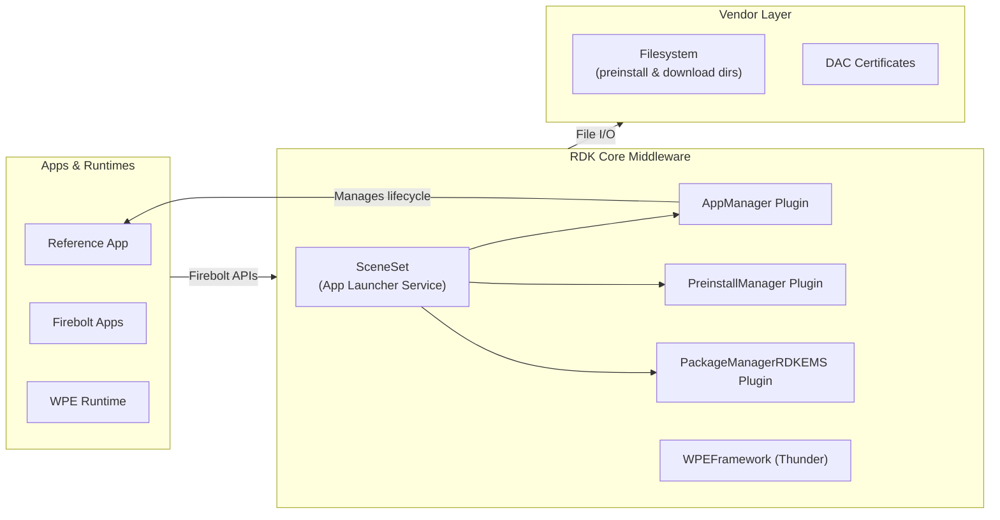
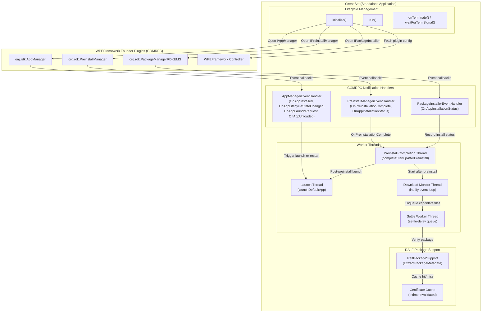
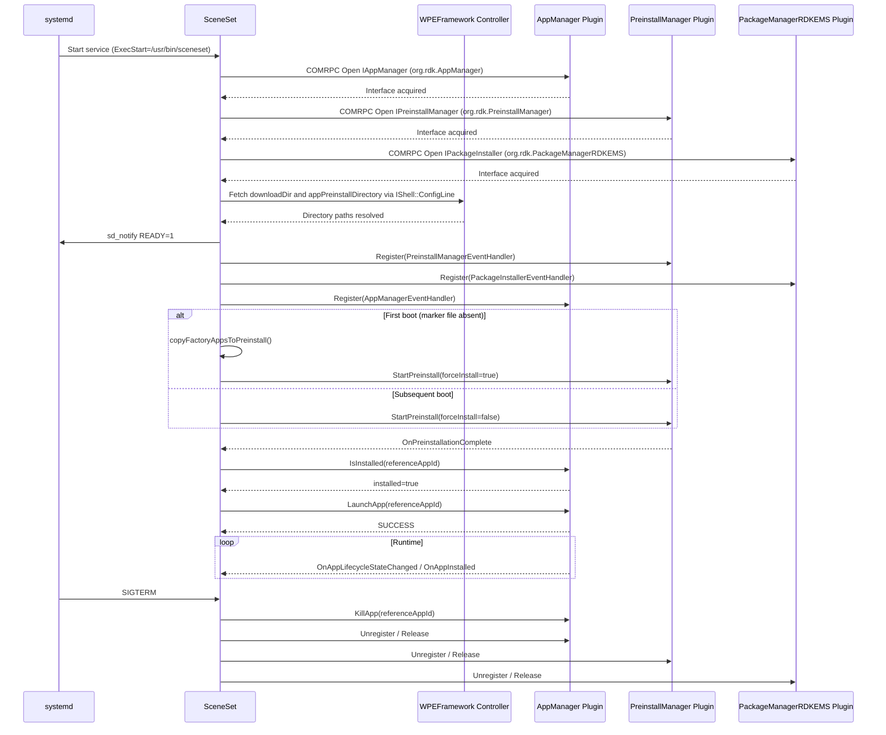
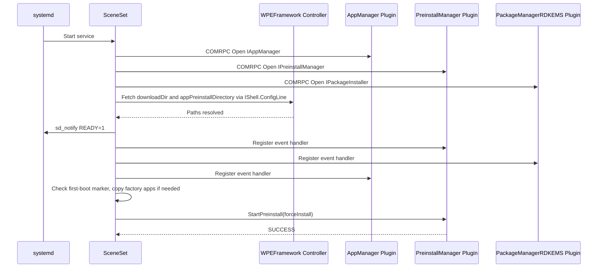
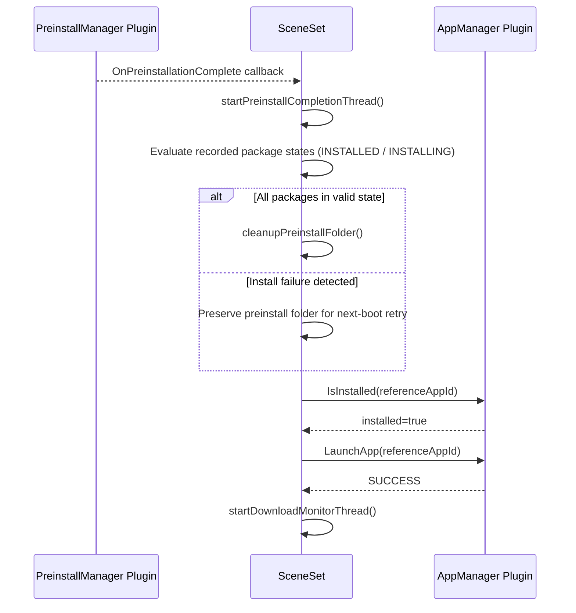
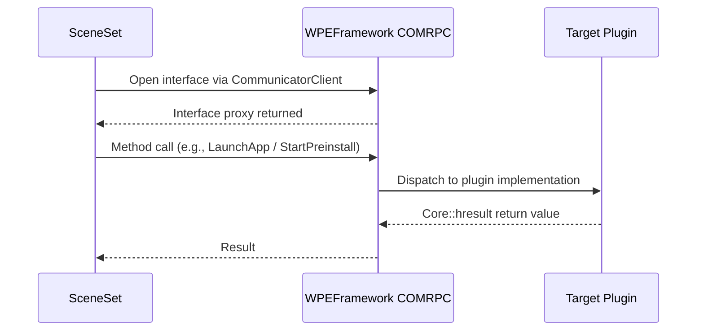
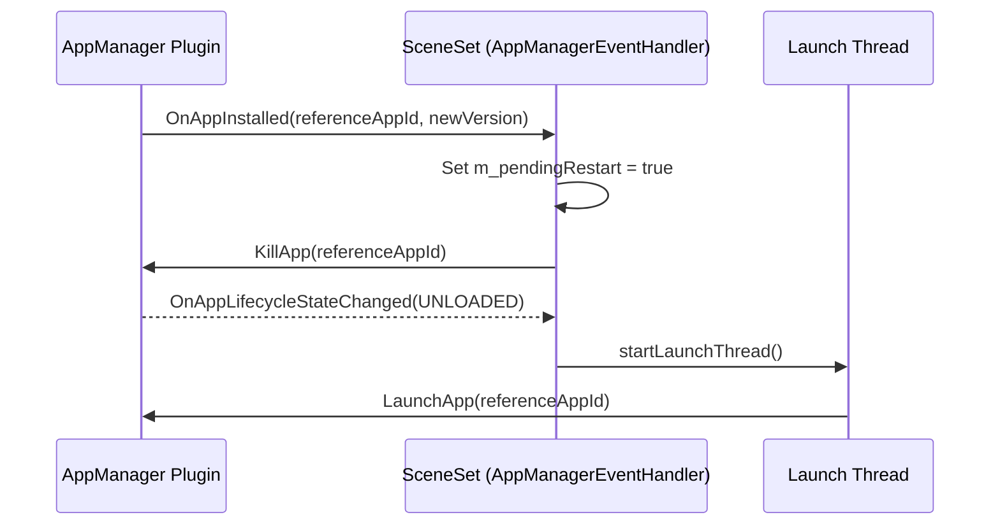

# SceneSet

SceneSet is a standalone application launcher service for RDK-based devices. It runs as a systemd service and is responsible for coordinating the boot-time preinstallation of app bundles and the launch of the configured reference application. It establishes connections to WPEFramework Thunder plugins — AppManager, PreinstallManager, and PackageManagerRDKEMS — over COMRPC, and manages the full lifecycle of the reference app from first boot through runtime updates and crash recovery.

At the device level, SceneSet ensures that the reference application is available and running after every boot. It handles the distinct first-boot scenario by copying pre-bundled factory app packages to the preinstall directory and triggering a force-install. On subsequent boots it uses a version-aware install mode. Once preinstallation completes, it launches the reference app and begins monitoring a download directory for over-the-air (OTA) update packages. When a new version of the reference app is detected and staged, SceneSet coordinates a kill-and-restart of the running app.

At the module level, SceneSet acts as a COMRPC client to three WPEFramework plugins, registering notification handlers to receive app lifecycle events, preinstall completion signals, and per-package installation status updates. It maintains internal state with atomic flags across several worker threads and handles graceful shutdown on POSIX signals.



**Key Features & Responsibilities:**

- **Reference Application Launch**: Launches the configured reference application via AppManager after preinstallation completes at boot. The app ID is set at build time and can be overridden at runtime.
- **App Bundle Preinstallation**: Triggers PreinstallManager at boot to install app bundles before the reference app is started. The service waits for the completion notification before proceeding to launch.
- **Factory Settings Reset Support**: Detects first boot by checking for a persistent marker file. On first boot, factory app bundles are copied to the preinstall directory and a force-install is used. Subsequent boots use a version-aware install mode.
- **Over-the-Air Update Monitoring**: Monitors a configured download directory for new RALF packages using inotify, verifies and identifies them using libralf, and stages them into the preinstall directory for installation.
- **Reference App Update and Restart**: Detects when a new version of the reference app is installed and automatically kills the running instance, then restarts it once the app reaches the UNLOADED state.
- **Crash Recovery**: Restarts the reference app automatically when it terminates with an ABORT error reason.
- **Systemd Integration**: Reports readiness via `sd_notify` and runs as a `Type=notify` systemd service. Service startup is conditioned on the presence of `/opt/ai2managers`.

---

## Design

SceneSet follows a focused, single-process design as a standalone C++ application that sequences preinstallation, app launch, and OTA update staging in a defined order across system boot and runtime. All interactions with the platform's app management infrastructure go through WPEFramework COMRPC interfaces, with no direct device-layer dependencies. Long-running or potentially blocking operations — app launch and preinstall completion handling — are offloaded to dedicated worker threads to keep the COMRPC event dispatch path responsive. An inotify-based file system watch monitors a configurable download directory without polling, with a settle-delay mechanism to avoid processing partially written files. The application handles graceful shutdown via POSIX signal interception using `sigwait()` on a blocked signal mask, ensuring that all spawned threads are joined and all COM resources released before exit.

SceneSet operates as an autonomous service that initiates actions based on system events and its own startup sequence, with all interactions flowing toward the WPEFramework plugin layer.

All southbound communication is through WPEFramework COMRPC. SceneSet opens COMRPC connections to `org.rdk.AppManager`, `org.rdk.PreinstallManager`, and `org.rdk.PackageManagerRDKEMS` at startup. It also queries plugin configuration through the WPEFramework Controller's `IShell` interface to resolve the download directory and preinstall directory paths dynamically at startup rather than relying solely on compile-time values.

COMRPC is the sole IPC mechanism used. All plugin calls and callbacks go over a WPEFramework COMRPC Unix domain socket. The socket path defaults to `/tmp/communicator` and can be overridden by setting the `THUNDER_ACCESS` environment variable before service start.

Persistent state is minimal. The factory apps copy state is recorded in a marker file at `/opt/persistent/.sceneset_factory_apps_copied`, which survives reboots and gates the first-boot factory app copy logic. An optional file at `/opt/sceneset_app.conf` provides a runtime override for the reference app ID that persists across reboots. Volatile runtime state — whether the app is launched, whether a restart is pending, whether preinstall completion is awaited — is tracked using `std::atomic` variables that reset with each service start.



### Threading Model

- **Threading Architecture**: Multi-threaded
- **Main Thread**: Runs `initialize()`, then `run()`. Blocks on `sigwait()` in `waitForTermSignal()` after startup is complete. SIGTERM and SIGINT are blocked via `pthread_sigmask()` before initialization so that all spawned threads inherit the blocked mask, and only the main thread consumes signals.
- **Worker Threads**:
  - _Launch Thread_: Executes `launchDefaultApp()` via `IAppManager::LaunchApp()`. Launched from a thread to avoid blocking AppManager notification callbacks, which are dispatched on a COMRPC thread.
  - _Download Monitor Thread_: Runs the inotify event loop on the configured download directory. Watches for `IN_CLOSE_WRITE` and `IN_MOVED_TO` filesystem events.
  - _Settle Worker Thread_: Internal to the download monitor; receives candidate file paths from the inotify loop and waits for a 1000 ms settle delay before processing each file to avoid acting on partially written packages.
  - _Preinstall Completion Thread_: Runs `completeStartupAfterPreinstall()` when `OnPreinstallationComplete` is received. Separated from the COMRPC callback thread to allow cleanup and launch logic to run without blocking the PreinstallManager notification path.
- **Synchronization**: `m_lock` (mutex) protects `m_isActive`; `m_launchThreadMutex`, `m_downloadMonitorMutex`, and `m_preinstallCompletionThreadMutex` protect their respective thread lifecycle. `m_appLaunched`, `m_stopLaunchThread`, `m_stopDownloadMonitorThread`, `m_waitingForStartupPreinstallCompletion`, and `m_startupPreinstallHasFailure` are `std::atomic` variables protecting shared state across threads.
- **Async / Event Dispatch**: COMRPC notification callbacks (implemented as inner classes of `SceneSetApp`) are invoked on WPEFramework's COMRPC dispatch threads. State changes that require further work (launch, preinstall completion) are dispatched to dedicated worker threads via `startLaunchThread()` and `startPreinstallCompletionThread()` to avoid blocking the dispatch path.

### Prerequisites and Dependencies

#### Platform and Integration Requirements

- **Build Dependencies**: `wpeframework` (Thunder core and COM interfaces), `entservices-apis` (Exchange interface definitions: `IAppManager`, `IPreinstallManager`, `IAppPackageManager`), `ralf-utils` (libralf for RALF package verification and metadata extraction), `libsystemd` (sd_notify integration). WPEFrameworkCore, WPEFrameworkPlugins, WPEFrameworkWebSocket, and WPEFrameworkDefinitions are resolved via pkg-config.
- **Plugin Dependencies**: `org.rdk.AppManager`, `org.rdk.PreinstallManager`, and `org.rdk.PackageManagerRDKEMS` must be active before SceneSet can complete initialization. Failure to open any of these interfaces causes the service to exit.
- **Systemd Services**: `wpeframework-appmanager.service` must be running before SceneSet starts (`Requires=` and `After=` in the service unit). The service additionally requires the path `/opt/ai2managers` to exist (`ConditionPathExists=/opt/ai2managers`).
- **Configuration Files**: `/opt/sceneset_app.conf` (optional runtime override for app ID). `/opt/persistent/.sceneset_factory_apps_copied` (first-boot state marker, created by the service itself).
- **Startup Order**: SceneSet must start after `wpeframework-appmanager.service` to ensure AppManager, PreinstallManager, and PackageManagerRDKEMS plugins are active in Thunder before COMRPC open calls are attempted.

---

### Component State Flow

#### Initialization to Active State

SceneSet transitions through the following states from service start to active operation: **Initializing** (COMRPC client creation, interface acquisition for IAppManager, IPreinstallManager, IPackageInstaller, and dynamic directory resolution via WPEFramework Controller) → **Registering** (event handler registration with all three plugins, sd_notify READY=1 sent to systemd) → **PreinstallPhase** (first-boot factory app copy if required, `StartPreinstall()` call, waiting for `OnPreinstallationComplete`) → **Active** (reference app launched, download monitor running, main thread blocked on `sigwait()`) → **Shutdown** (worker threads stopped, reference app killed, event handlers unregistered, COMRPC interfaces released).



#### Runtime State Changes

**State Change Triggers:**

- `OnAppLifecycleStateChanged` for the reference app with `APP_STATE_RUNNING` or `APP_STATE_ACTIVE` sets `m_appLaunched = true`.
- `OnAppLifecycleStateChanged` with `APP_STATE_UNLOADED` and `m_pendingRestart = true` triggers a restart via `startLaunchThread()`; this is the post-update restart path.
- `OnAppLifecycleStateChanged` with `APP_STATE_UNLOADED`, previous state `APP_STATE_TERMINATING`, and error reason `APP_ERROR_ABORT` triggers a crash recovery restart via `startLaunchThread()`.
- `OnAppInstalled` for the reference app while it is running sets `m_pendingRestart = true` and calls `KillApp()`. The restart completes when the UNLOADED lifecycle state is received.

**Context Switching Scenarios:**

- **New version installed while app is running**: `OnAppInstalled` fires, `m_pendingRestart` is set, `KillApp()` is requested. When `OnAppLifecycleStateChanged` delivers `APP_STATE_UNLOADED`, `startLaunchThread()` re-launches the app with the updated version.
- **App crash (ABORT termination)**: `OnAppLifecycleStateChanged` detects the ABORT error reason on transition to UNLOADED. `startLaunchThread()` is called to restart the app.
- **SIGTERM/SIGINT received**: `sigwait()` returns on the main thread, `onTerminate()` is called, all worker threads are stopped, the reference app is killed, handlers are unregistered, and COMRPC interfaces are released.

---

### Call Flows

#### Initialization Call Flow



#### Request Processing Call Flow

The post-preinstall launch flow is the primary runtime sequence that drives the reference app into its running state. After `OnPreinstallationComplete` is received, SceneSet validates per-package install states recorded from `PackageInstallerEventHandler` callbacks, conditionally cleans the preinstall directory, and then launches the reference app.



---

## Internal Modules

| Module / Class                  | Description                                                                                                                                                                                                                                                                                                              | Key Files                                        |
| ------------------------------- | ------------------------------------------------------------------------------------------------------------------------------------------------------------------------------------------------------------------------------------------------------------------------------------------------------------------------ | ------------------------------------------------ |
| `SceneSetApp`                   | Application entry point and lifecycle coordinator. Owns all COMRPC interface handles and orchestrates initialization, preinstall sequencing, app launch, download monitoring, and shutdown.                                                                                                                              | `SceneSet.cpp`, `SceneSet.h`                     |
| `AppManagerEventHandler`        | Inner class implementing `Exchange::IAppManager::INotification`. Handles app install, lifecycle state change, launch request, and unload events for the reference app. Drives restart and crash recovery logic.                                                                                                          | `SceneSet.cpp`, `SceneSet.h`                     |
| `PreinstallManagerEventHandler` | Inner class implementing `Exchange::IPreinstallManager::INotification`. Receives per-package installation status and the `OnPreinstallationComplete` signal, which triggers the preinstall completion worker thread.                                                                                                     | `SceneSet.cpp`, `SceneSet.h`                     |
| `PackageInstallerEventHandler`  | Inner class implementing `Exchange::IPackageInstaller::INotification`. Receives per-package installation status from PackageManagerRDKEMS during the startup preinstall window. Records failure states for cleanup decisions. Receives external installation data from the package manager.                              | `SceneSet.cpp`, `SceneSet.h`                     |
| `ralf_support` namespace        | Provides RALF package metadata extraction and signature verification using libralf. Maintains a certificate cache invalidated by modification time of the certificate directory, avoiding redundant certificate loads across repeated package verifications. Receives external package data from the download directory. | `RalfPackageSupport.cpp`, `RalfPackageSupport.h` |

---

## Component Interactions

SceneSet interacts with WPEFramework Thunder plugins and the filesystem over well-defined interfaces. All plugin communication is via COM interfaces defined in the `Exchange` namespace, resolved through COMRPC `CommunicatorClient::Open<>()` calls.

### Interaction Matrix

| Target Component / Layer          | Interaction Purpose                                                              | Key APIs / Topics                                                                                                                                                             |
| --------------------------------- | -------------------------------------------------------------------------------- | ----------------------------------------------------------------------------------------------------------------------------------------------------------------------------- |
| **Plugins**                       |                                                                                  |                                                                                                                                                                               |
| `org.rdk.AppManager`              | App launch, kill, install query, lifecycle event subscription                    | `IAppManager::LaunchApp()`, `IAppManager::KillApp()`, `IAppManager::IsInstalled()`, `IAppManager::GetInstalledApps()`, `IAppManager::Register()`, `IAppManager::Unregister()` |
| `org.rdk.PreinstallManager`       | Bundle preinstallation trigger and completion notification                       | `IPreinstallManager::StartPreinstall()`, `IPreinstallManager::Register()`, `IPreinstallManager::Unregister()`                                                                 |
| `org.rdk.PackageManagerRDKEMS`    | Per-package installation status tracking; download directory configuration query | `IPackageInstaller::Register()`, `IPackageInstaller::Unregister()`, plugin config key `downloadDir` via Controller                                                            |
| WPEFramework Controller           | Plugin configuration key-value query at startup                                  | `PluginHost::IShell::ConfigLine()`                                                                                                                                            |
| **External Systems**              |                                                                                  |                                                                                                                                                                               |
| Filesystem (download directory)   | Inotify-based watch for new RALF package files placed by a download manager      | `inotify_init1`, `inotify_add_watch` (IN_CLOSE_WRITE, IN_MOVED_TO)                                                                                                            |
| Filesystem (preinstall directory) | Staging location for app bundles consumed by PreinstallManager                   | File copy and move via `std::filesystem`                                                                                                                                      |
| Filesystem (factory apps path)    | Source of pre-bundled app packages copied on first boot                          | Directory iteration and file copy via `std::filesystem`                                                                                                                       |
| libralf                           | RALF package signature verification and app ID / version metadata extraction     | `ralf::Package::open()`, `ralf::Certificate::loadFromFile()`, `Package::metaData()`                                                                                           |

### IPC Flow Patterns

**Primary Request / Response Flow:**

SceneSet constructs a COMRPC `CommunicatorClient`, opens the target plugin interface, and calls methods directly. The return value (`Core::hresult`) is evaluated and logged; failures are handled inline.



**Event Notification Flow:**

Notification callbacks are delivered to SceneSet by WPEFramework on a COMRPC dispatch thread. Handlers that need to perform further work (launching the app, completing preinstall) delegate to dedicated worker threads to avoid blocking the dispatch path.



---

## Implementation Details

### Key Implementation Logic

- **State / Lifecycle Management**: `m_isActive` (atomic bool) tracks whether the service is in a live state. `m_appLaunched` (atomic bool) tracks whether the reference app is currently running. `m_pendingRestart` (atomic bool) flags a restart required after a new version install. State transition logic is distributed across `run()`, `onTerminate()`, and the AppManagerEventHandler callbacks.
  - Core implementation: `SceneSet.cpp`
  - State transition handlers: `SceneSet.cpp` (`AppManagerEventHandler::OnAppLifecycleStateChanged`, `onTerminate`)

- **Event Processing**: COMRPC notification callbacks are delivered synchronously on WPEFramework's dispatch thread. `OnPreinstallationComplete` and `OnAppInstalled` trigger thread creation (`startPreinstallCompletionThread()`, `startLaunchThread()`) to decouple subsequent work from the callback thread. Per-package install status from `PackageInstallerEventHandler::OnAppInstallationStatus` is parsed as a JSON array and recorded atomically via `recordStartupPreinstallStatus()`.

- **Download Monitor**: The download monitor thread uses `inotify` to watch for `IN_CLOSE_WRITE` and `IN_MOVED_TO` events in the configured download directory. New file notifications are enqueued into a settle queue with a 1000 ms delay before a settle worker thread processes them. Hidden files (filenames starting with `.`) are skipped. An optional initial sweep of the directory at monitor startup can be enabled via the `SCENESET_INITIAL_DOWNLOAD_SWEEP` environment variable. Package verification and metadata extraction are performed by `ralf_support::ExtractPackageMetadata()`, which uses libralf with a certificate directory cache invalidated by the directory's modification time.

- **Error Handling Strategy**: `Core::hresult` return codes from all COMRPC calls are checked and logged. A failed `StartPreinstall()` call falls through to `completeStartupAfterPreinstall()` immediately rather than waiting for a callback that will never arrive. Preinstall package states outside `INSTALLED` or `INSTALLING` mark the preinstall as failed, causing the preinstall directory to be preserved for retry on next boot. File rename failures in the download staging path fall back to a copy-then-delete sequence.

- **Logging & Diagnostics**: All output goes to stdout (`std::cout`) and stderr (`std::cerr`). The syslog-ng configuration defined in the Yocto recipe routes this output to `/opt/logs/sceneset.log` with a high log rate. Key log points include: COMRPC interface acquisition, sd_notify delivery, event handler registration, first-boot detection, preinstall start and completion, app launch and lifecycle transitions, OTA package detection, and shutdown sequence steps.

---

## Configuration

### Key Configuration Files

| Configuration File                              | Purpose                                                                                                                          | Override Mechanism                                                                   |
| ----------------------------------------------- | -------------------------------------------------------------------------------------------------------------------------------- | ------------------------------------------------------------------------------------ |
| `/opt/sceneset_app.conf`                        | Optional plain-text file; first line overrides the compiled-in default app ID at runtime                                         | Write a new app ID as the first line of the file; takes effect on next service start |
| `/opt/persistent/.sceneset_factory_apps_copied` | Marker file written after the first-boot factory app copy. Its presence prevents repeated factory app copies on subsequent boots | Delete this file to force the factory app copy to run again on next service start    |

### Key Configuration Parameters

| Parameter                      | Type   | Default          | Description                                                                                                                                                                                    |
| ------------------------------ | ------ | ---------------- | ---------------------------------------------------------------------------------------------------------------------------------------------------------------------------------------------- |
| `SCENESET_DEFAULT_APPNAME`     | string | `""`             | Compile-time default app ID for the reference application to launch. Can be overridden at runtime via `/opt/sceneset_app.conf`.                                                                |
| `FACTORY_APP_PATH`             | string | `""`             | Compile-time path to the directory containing factory app bundles to be copied to the preinstall directory on first boot. If set, `APP_PREINSTALL_DIRECTORY` must also be set.                 |
| `APP_PREINSTALL_DIRECTORY`     | string | `""`             | Compile-time fallback path for the preinstall directory. At runtime this value is superseded by the `appPreinstallDirectory` key from the PreinstallManager plugin configuration if available. |
| `DAC_APP_CERT_PATH`            | string | `/etc/rdk/certs` | Directory containing DAC certificates used by libralf for RALF package signature verification.                                                                                                 |
| `DISABLE_REFERENCE_APP_UPDATE` | bool   | `OFF`            | When set to `ON` at build time, disables the download directory monitor and all OTA update staging logic.                                                                                      |

### Runtime Configuration

The following environment variables can be set before service start to modify runtime behaviour:

```bash
# Override the Thunder COMRPC communicator socket path
export THUNDER_ACCESS=/tmp/communicator

# Enable initial sweep of the download directory at monitor startup
export SCENESET_INITIAL_DOWNLOAD_SWEEP=1
```

The reference app ID can be changed at runtime without rebuilding by writing to `/opt/sceneset_app.conf`:

```bash
echo "com.rdkcentral.refui" > /opt/sceneset_app.conf
```

### Configuration Persistence

- Changes to `/opt/sceneset_app.conf` are persisted across reboots and take effect on the next service start.
- The factory apps copy marker at `/opt/persistent/.sceneset_factory_apps_copied` is written once on first boot and persists indefinitely.
- Build-time parameters (`SCENESET_DEFAULT_APPNAME`, `FACTORY_APP_PATH`, `APP_PREINSTALL_DIRECTORY`, `DAC_APP_CERT_PATH`, `DISABLE_REFERENCE_APP_UPDATE`) are compiled into the binary; updates to these values require a rebuild.
- Environment variable overrides (`THUNDER_ACCESS`, `SCENESET_INITIAL_DOWNLOAD_SWEEP`) take effect for the duration of the service instance in which they are set.
