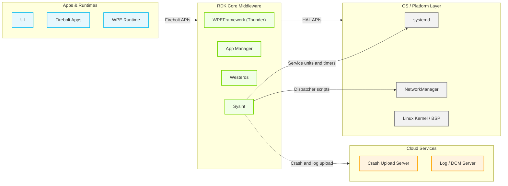
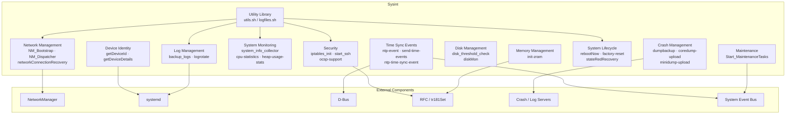
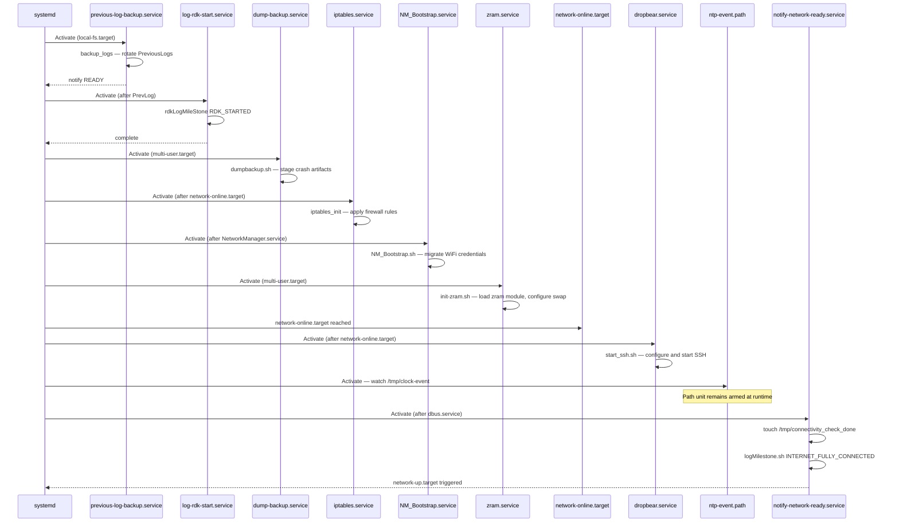
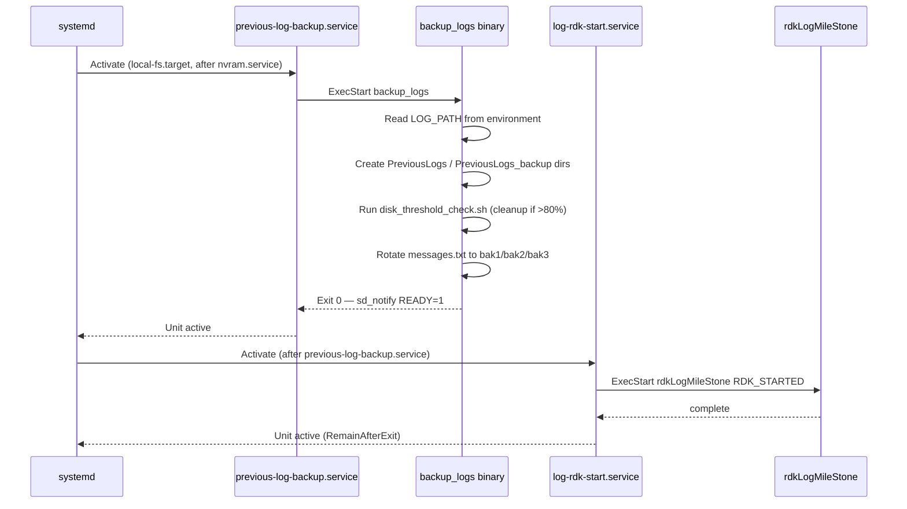
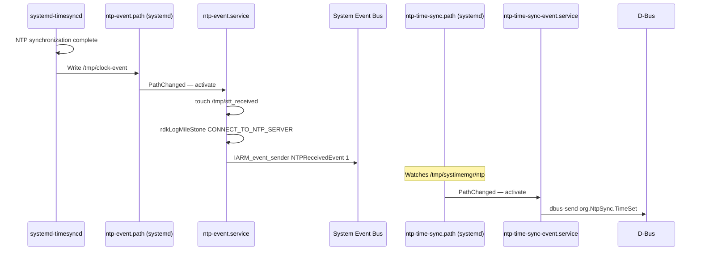
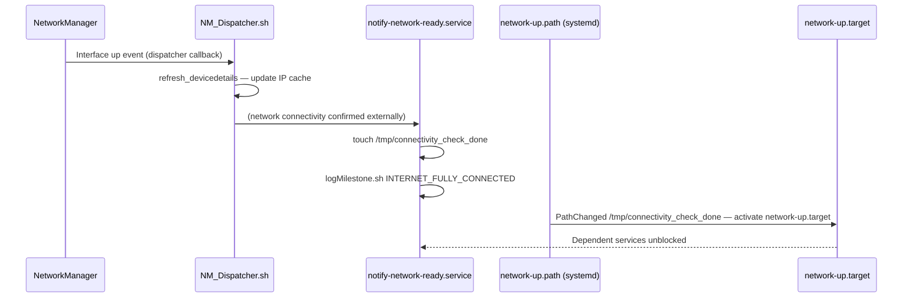

# Sysint

Sysint (System Integration) is the foundational system initialization and lifecycle management component in RDK middleware. It provides the runtime environment that all other middleware components depend on: consistent file-path abstractions, device identity resolution, network bring-up, security policy enforcement, log lifecycle management, and periodic system health monitoring. The component is implemented entirely as a collection of shell scripts, configuration property files, and systemd service and timer units — it acts as the operational integration layer that initializes the device from early boot through to an active, fully monitored state.

At the device level, Sysint ensures every RDK device boots into a known, reproducible operating state. It backs up logs from the previous boot cycle, enforces firewall rules, establishes secure remote-access sessions, initializes compressed swap space, drives the system clock signal chain, triggers crash artifact staging and upload, and recovers autonomously from network connectivity failures. It also coordinates state-change transitions such as factory reset, warehouse reset, and state-red firmware recovery, ensuring orderly teardown and restart of dependent services.

At the module level, Sysint exposes a reusable shell utility library (`utils.sh`), device property abstractions consumed by all other RDK scripts, and a catalogue of well-defined systemd service and timer units against which other components declare ordering dependencies. Its RFC integration layer reads feature-control parameters from the device configuration store at runtime, allowing behavior to be toggled without an image rebuild.



**Key Features & Responsibilities:**

- **Log Lifecycle Management**: Backs up logs from the previous boot cycle into a rolling set of `PreviousLogs` directories before new log files are opened, and runs periodic log rotation via `logrotate` to cap log directory size.
- **Network Management Integration**: Provides NetworkManager dispatcher scripts (`NM_Dispatcher.sh`, `NM_preDown.sh`) that refresh the device IP cache on interface state changes, and runs a periodic network connectivity recovery service that detects and remediates packet-loss and driver-level failures.
- **Security Enforcement**: Applies firewall rules through `iptables_init` at each boot after the network is available, manages the Dropbear SSH server lifecycle with RFC-controlled access lists, and evaluates OCSP/CRL status flags based on RFC parameters.
- **Crash and Dump Management**: Stages core dumps and mini-dumps from the previous session into upload-ready paths, and triggers upload services for both secure and non-secure dump types on network availability.
- **Time Synchronization Event Chain**: Monitors filesystem flags set by the time-sync daemon and emits system event bus signals and D-Bus signals (`org.NtpSync.TimeSet`, `org.Systime.TimeSet`) that downstream components use to gate time-dependent operations.
- **System Health Monitoring**: Periodically collects CPU utilization, free memory, process table snapshots, and disk space metrics, emitting telemetry markers via the Telemetry 2.0 shared API.
- **Disk Space Enforcement**: Monitors configured directory size thresholds using `diskMon.conf` and performs cleanup of stale log and cache files when persistent storage exceeds defined limits.
- **Device Identity Resolution**: Resolves and caches the device identifier and partner identifier from provisioned data files, falling back to bootstrap configuration or compile-time defaults when provisioning files are absent.
- **System Lifecycle Coordination**: Provides the `rebootNow.sh` entry point used by all other RDK components to request an orderly reboot; classifies the originating caller into application-triggered, operations-triggered, or maintenance-triggered categories and persists reboot metadata before invoking the OS reboot.
- **Compressed Swap Initialization**: Conditionally loads the `zram` kernel module and configures compressed swap partitions sized to a configurable percentage of total RAM, controlled by an RFC parameter.
- **Maintenance Task Orchestration**: Coordinates sequenced execution of RFC updates, software update checks, and log upload operations, reporting status events to the system event bus at each stage.

---

## Design

Sysint is designed as a systemd-centric, script-driven integration layer. Rather than a single long-running daemon, it decomposes each functional responsibility into a dedicated, focused systemd unit — a service, timer, or path unit — that activates only when its specific trigger condition is met. This keeps each unit independently auditable, restartable, and orderable against other units without creating a central point of failure. The design intentionally avoids compiled code; all behavior is expressed in POSIX shell scripts that are easy to read, patch at the field level, and override by replacing individual files.

All scripts share a common property-loading contract: each script sources `/etc/include.properties` for path constants, `/etc/device.properties` for device capability flags, and `/etc/env_setup.sh` for shell aliases. This ensures that paths such as `LOG_PATH`, `UTILITY_PATH`, `PERSISTENT_PATH`, and interface names like `ESTB_INTERFACE` and `WIFI_INTERFACE` are never hardcoded in individual scripts, making the component portable across hardware variants without code changes.

Interaction with the northbound RDK middleware (other systemd services, Thunder plugins) is achieved through two mechanisms: filesystem path units that watch for sentinel files written by those services, and system event bus signals dispatched by `IARM_event_sender` for coarser platform-wide event delivery. Interaction with the southbound OS layer uses standard POSIX interfaces — `systemctl`, `iptables`, `modprobe`, `dbus-send`, and procfs/sysfs.

Data created by Sysint that must survive across reboots is written to the persistent storage path (`/opt`). Reboot metadata is written under `/opt/secure/reboot/` so that the next boot can diagnose unexpected restart causes. Previous-boot log snapshots are retained in `/opt/logs/PreviousLogs/`. Transient state (PID lock files, connectivity flags, NTP event markers) is written to `/tmp` and is automatically discarded at each reboot.

RFC-controlled feature toggles are read at script invocation time via the `tr181Set` utility, enabling features such as ZRAM (`Device.DeviceInfo.X_RDKCENTRAL-COM_RFC.Feature.MEMSWAP.Enable`), USB storage auto-mount, OCSP/CRL policy, and SSH whitelist enforcement to be changed remotely without image reflash.



#### Threading Model

- **Threading Architecture**: All execution is through POSIX shell scripts; each service unit invocation runs as a single-threaded OS process.
- **Main Thread**: Each systemd-activated script runs as a dedicated short-lived process. One-shot services exit after completing their action; timer-triggered services are re-launched by the timer on each interval.
- **Background Execution**: Select scripts fork themselves into the background using the shell `&` operator (`init-zram.sh`, `getDeviceDetails.sh`) so that the parent systemd unit can return without blocking the boot target.
- **Synchronization**: Concurrent-instance protection is implemented with PID lock files (e.g., `/tmp/DiskCheck.pid`, `/tmp/.rebootNow.pid`). A script checks for an existing PID file and exits if a live instance is already running.
- **Async / Event Dispatch**: Systemd path units (`ntp-event.path`, `network-up.path`, `ntp-time-sync.path`, `restart-parodus.path`) watch filesystem paths and activate the corresponding service asynchronously when the watched file appears or changes, decoupling the writing component from the consuming service.

### Prerequisites and Dependencies

#### Platform and Integration Requirements

- **Build Dependencies**: `crashupload` component (Yocto `DEPENDS`); `syslog-ng-config-gen` and `logrotate_config` Yocto class inheritance for log routing and rotation rule generation.
- **Runtime Dependencies**: `bash`, `busybox` (declared as `RDEPENDS`); `logrotate`, `dropbear`, `NetworkManager`, `systemd-timesyncd`, `tr69hostif`, and `parodus` services must be present on the target image.
- **Systemd Services**: The following services must be present before Sysint services reach full operational state: `nvram.service`, `securemount.service`, `tr69hostif.service`, `NetworkManager.service`, `dbus.service`, `network-online.target`.
- **Configuration Files**: `/etc/device.properties`, `/etc/common.properties`, `/etc/include.properties`, `/etc/env_setup.sh`, `/etc/diskMon.conf`, and `/etc/rfcdefaults/sysint-generic.ini` must be installed at the paths defined in `do_install()`.
- **Startup Order**: `previous-log-backup.service` runs before `log-rdk-start.service`; both run before `multi-user.target`. Crash and dump upload services declare `After=network-online.target`.

---

### Component State Flow

#### Initialization to Active State

On each boot, Sysint transitions through a fixed sequence governed by systemd ordering constraints. The earliest units (`previous-log-backup.service`, `log-rdk-start.service`) run before `multi-user.target` and are anchored to `local-fs.target`. Once the local filesystem and NVRAM are available, these units execute. A second wave of services activates at `multi-user.target`: `dump-backup.service`, `iptables.service`, `oops-dump.service`, `zram.service`, and `NM_Bootstrap.service`. A third wave, gated on `network-online.target`, activates the time-sync event chain, crash upload services, SSH daemon, and device detail refresh. After the network reaches a fully verified state, `notify-network-ready.service` writes `/tmp/connectivity_check_done`, which triggers `network-up.path` and activates `network-up.target`, unblocking any services that depend on confirmed internet connectivity.

The component transitions through the following states during its lifecycle: **LogRecovery** (backup previous logs, mark RDK_STARTED) → **SecuritySetup** (iptables rules, OCSP flags, ZRAM) → **NetworkBringup** (NM bootstrap, dispatcher registration) → **TimeSyncMonitoring** (NTP path watches active) → **Active** (all timers running, crash upload paths watching, connection stats running) → **Shutdown** (individual services are stopped via `systemctl stop`).



#### Runtime State Changes

Once all boot-time services have completed, Sysint operates through timer-driven and path-driven activations, re-entering active execution each time a timer fires or a watched filesystem path changes.

**State Change Triggers:**

- `vitalprocess-info.timer` fires 150 seconds after boot and every 600 seconds thereafter, invoking `system_info_collector.sh` to collect CPU, memory, disk, and process metrics and emit Telemetry 2.0 markers.
- `logrotate.timer` runs on its configured schedule, invoking `logrotate` against `/etc/logrotatedata.conf` to cap log file sizes.
- `disk-threshold-check.timer` periodically invokes `disk_threshold_check.sh` to detect and remediate persistent storage exceeding configured thresholds.
- `network-connection-stats.timer` periodically invokes `networkConnectionRecovery.sh` to check gateway reachability, packet loss, and WiFi driver health; it triggers reassociation or a driver reset when configurable thresholds are exceeded.
- `ntp-event.path` watches `/tmp/clock-event` (or `/run/systemd/timesync/synchronized` on Dunfell builds). When the time-sync daemon writes this file, `ntp-event.service` fires, dispatching a system event bus signal `NTPReceivedEvent` and logging the `CONNECT_TO_NTP_SERVER` milestone.
- `restart-parodus.path` watches `/tmp/authservice_parodus_restart`. When this file appears, `restart-parodus.service` invokes `systemctl restart parodus.service` after `wpeframework.service` is confirmed active.
- `stateRedRecovery.path` watches a sentinel file; when triggered, `stateRedRecovery.sh` initiates a recovery firmware download via `rdkvfwupgrader`.

**Context Switching Scenarios:**

- **Factory Reset**: `factory-reset.sh` stops dependent services (sysmgr, storagemgr, socprovisioning, lighttpd, dnsmasq, Dobby, WiFi), clears controller-pairing data and persistent state, and triggers a reboot via `rebootNow.sh`.
- **Warehouse Reset**: `warehouse-reset.sh` follows a similar service teardown sequence with warehouse-specific data erasure.
- **State Red**: `stateRedRecovery.sh` calls `rdkvfwupgrader` with recovery parameters to initiate an emergency firmware download without requiring a full UI-driven update.
- **Cyclic Reboot Detection**: `rebootNow.sh` reads a reboot counter from `/opt/secure/reboot/rebootCounter` and applies a pause window if the counter exceeds the threshold (`REBOOT_CYCLE_THRESHOLD=5` within `REBOOT_WINDOW=10` minutes), preventing uncontrolled boot loops.

---

---

### Call Flows

#### Initialization Call Flow



#### Reboot Management Call Flow

The reboot management flow is the most widely invoked Sysint interface: all other RDK components call `rebootNow.sh` to request an orderly device restart. The script validates the caller-provided arguments, classifies the reboot reason, enforces a cyclic-reboot guard, persists reboot metadata, and delegates to the OS reboot command.

```mermaid
sequenceDiagram
    participant Caller as Calling Component
    participant RebootNow as rebootNow.sh
    participant RebootDir as /opt/secure/reboot/
    participant RFC as tr181 (RFC store)
    participant OS as /sbin/reboot

    Caller->>RebootNow: rebootNow.sh -s SourceName -o Reason
    RebootNow->>RebootNow: Validate arguments (exit if missing)
    RebootNow->>RebootDir: Read rebootCounter
    RebootNow->>RFC: Read RebootStop.Duration and RebootStop.Detection
    RebootNow->>RebootNow: Classify reason as APP / OPS / MAINTENANCE triggered
    alt Cyclic reboot detected
        RebootNow->>RebootNow: Apply pause window; write pauseReboot flag
    end
    RebootNow->>RebootDir: Write reboot.info (source, reason, timestamp, CDL file)
    RebootNow->>RebootDir: Increment rebootCounter
    RebootNow->>OS: /sbin/reboot
```

---

## Internal Modules

| Module / Class                | Description                                                                                                                                                                                                                                                                                                                                                                                                                                                              | Key Files                                                                                                                                                                                                 |
| ----------------------------- | ------------------------------------------------------------------------------------------------------------------------------------------------------------------------------------------------------------------------------------------------------------------------------------------------------------------------------------------------------------------------------------------------------------------------------------------------------------------------ | --------------------------------------------------------------------------------------------------------------------------------------------------------------------------------------------------------- |
| `utils.sh`                    | Shared utility functions sourced by all Sysint scripts: `processCheck()`, `rebootFunc()`, `checkProcess()`, `getLastModifiedTimeOfFile()`. Loads all property files in one place.                                                                                                                                                                                                                                                                                        | `lib/rdk/utils.sh`                                                                                                                                                                                        |
| `Log Management`              | Backs up previous-boot log files to `PreviousLogs` and `PreviousLogs_backup` directories. Defines the full set of known log file names and their rotation targets. Invoked by `previous-log-backup.service` at each boot.                                                                                                                                                                                                                                                | `lib/rdk/backup_logs.sh`, `lib/rdk/logfiles.sh`                                                                                                                                                           |
| `Network Management`          | `NM_Bootstrap.sh` migrates WiFi credentials and handles boot-type detection. `NM_Dispatcher.sh` refreshes IP cache and gateway information on NetworkManager interface events. `NM_preDown.sh` performs cleanup before an interface goes down. `networkConnectionRecovery.sh` monitors gateway reachability, packet loss, and WiFi driver state, and triggers self-healing actions.                                                                                      | `lib/rdk/NM_Bootstrap.sh`, `lib/rdk/NM_Dispatcher.sh`, `lib/rdk/NM_preDown.sh`, `lib/rdk/networkConnectionRecovery.sh`                                                                                    |
| `Security`                    | `iptables_init` applies IPv4 and IPv6 firewall rules, reading SSH and SNMP whitelist files from the RFC RAM path. `start_ssh.sh` configures Dropbear parameters from secure config files before the daemon is started. `ocsp-support.sh` reads RFC parameters and creates or removes `/tmp/.EnableOCSPStapling` and `/tmp/.EnableOCSPCA` flag files.                                                                                                                     | `lib/rdk/iptables_init`, `lib/rdk/start_ssh.sh`, `lib/rdk/ocsp-support.sh`                                                                                                                                |
| `System Monitoring`           | `system_info_collector.sh` is the entry point for the `vitalprocess-info.timer`; it calls CPU statistics, memory reporting, top-process snapshots, and disk usage collection functions, emitting Telemetry 2.0 markers at each step. `cpu-statistics.sh` uses `iostat` to capture instantaneous CPU metrics and emits `cpuinfo_split` and `FREE_MEM_split` telemetry values. `heap-usage-stats.sh` reports ION heap layout and CPU temperature from sysfs (rdkstb only). | `lib/rdk/system_info_collector.sh`, `lib/rdk/cpu-statistics.sh`, `lib/rdk/heap-usage-stats.sh`                                                                                                            |
| `Time Synchronization Events` | `send-time-events.sh` sends D-Bus signals on the system bus: `org.Systime.TimeSet` for system-time-set events and `org.NtpSync.TimeSet` for NTP-sync events. The `ntp-event.service` dispatches the `NTPReceivedEvent` system event bus signal and marks the `CONNECT_TO_NTP_SERVER` log milestone. Path units watch filesystem flags to trigger these services asynchronously.                                                                                          | `lib/rdk/send-time-events.sh`, `systemd_units/ntp-event.service`, `systemd_units/ntp-event.path`, `systemd_units/ntp-time-sync.path`, `systemd_units/system-time-event.service`                           |
| `Crash Management`            | `dumpbackup.sh` stages core dumps and mini-dumps from the kernel crash path into upload-ready directories at boot. Path units watch those directories; on a new file, the corresponding upload service transfers the dump to the configured crash server.                                                                                                                                                                                                                | `lib/rdk/dumpbackup.sh`, `systemd_units/coredump-upload.service`, `systemd_units/coredump-secure-upload.service`, `systemd_units/minidump-upload.service`, `systemd_units/minidump-secure-upload.service` |
| `Disk Management`             | `disk_threshold_check.sh` monitors `/opt` utilization and removes stale log and cache files when the fill level exceeds a configurable threshold (80% for flash, 90% for HDD). `diskMon.sh` independently verifies that specific directories do not exceed the size limits declared in `diskMon.conf`.                                                                                                                                                                   | `lib/rdk/disk_threshold_check.sh`, `lib/rdk/diskMon.sh`, `etc/diskMon.conf`                                                                                                                               |
| `Device Identity`             | `getDeviceId.sh` resolves device ID and partner ID from provisioned data files, falling back to bootstrap configuration or a compile-time default. `getDeviceDetails.sh` caches device IP address, MAC address, and model information in `/tmp/.deviceDetails.cache` for consumption by other scripts and services.                                                                                                                                                      | `lib/rdk/getDeviceId.sh`, `lib/rdk/getDeviceDetails.sh`                                                                                                                                                   |
| `System Lifecycle`            | `rebootNow.sh` provides the unified reboot interface for all RDK components, classifying the caller and persisting reboot metadata before issuing the OS reboot. `factory-reset.sh` and `warehouse-reset.sh` orchestrate service teardown and data erasure. `stateRedRecovery.sh` triggers emergency firmware download via `rdkvfwupgrader`.                                                                                                                             | `lib/rdk/rebootNow.sh`, `lib/rdk/factory-reset.sh`, `lib/rdk/warehouse-reset.sh`, `lib/rdk/stateRedRecovery.sh`                                                                                           |
| `Memory Management`           | `init-zram.sh` reads the `MEMSWAP.Enable` RFC parameter, loads the `zram` kernel module with a device count matching the CPU count, and configures compressed swap partitions sized to a configurable percentage (default 50%) of total RAM.                                                                                                                                                                                                                             | `lib/rdk/init-zram.sh`, `systemd_units/zram.service`                                                                                                                                                      |
| `Maintenance Orchestration`   | `Start_MaintenanceTasks.sh` sequences RFC fetch, software update check, and log upload operations, dispatching system event bus progress and completion events at each stage for consumption by the Maintenance Manager plugin.                                                                                                                                                                                                                                          | `lib/rdk/Start_MaintenanceTasks.sh`                                                                                                                                                                       |

---

---

## Component Interactions

### Interaction Matrix

| Target Component / Layer      | Interaction Purpose                                                                                                            | Key APIs / Topics                                                                              |
| ----------------------------- | ------------------------------------------------------------------------------------------------------------------------------ | ---------------------------------------------------------------------------------------------- |
| **OS Services**               |                                                                                                                                |                                                                                                |
| `NetworkManager`              | Receives IP add/del events and pre-down notifications via dispatcher scripts registered in `/etc/NetworkManager/dispatcher.d/` | `NM_Dispatcher.sh`, `NM_preDown.sh`                                                            |
| `systemd-timesyncd`           | Path unit watches the time-sync sentinel file to trigger NTP event dispatch                                                    | `ntp-event.path` watches `/tmp/clock-event` (or `/run/systemd/timesync/synchronized`)          |
| `parodus.service`             | Restarts parodus after WPEFramework signals readiness, triggered by the `authservice_parodus_restart` sentinel                 | `restart-parodus.path`, `systemctl restart parodus.service`                                    |
| `logrotate`                   | Periodic log file rotation using Sysint-installed configuration                                                                | `logrotate.service` invokes `/usr/sbin/logrotate -s ... /etc/logrotatedata.conf`               |
| **System Event Bus**          |                                                                                                                                |                                                                                                |
| Event bus signal sender       | Dispatches `NTPReceivedEvent` to the platform-wide event bus on NTP synchronization                                            | `IARM_event_sender NTPReceivedEvent 1` in `ntp-event.service`                                  |
| Event bus signal sender       | Dispatches maintenance progress and completion events during RFC, firmware update, and log upload sequences                    | `IARM_event_sender` calls in `Start_MaintenanceTasks.sh`                                       |
| **D-Bus**                     |                                                                                                                                |                                                                                                |
| `org.Systime`                 | Broadcasts `TimeSet` signal when system time is set to last-known-good or build time                                           | `dbus-send --system … org.Systime.TimeSet`                                                     |
| `org.NtpSync`                 | Broadcasts `TimeSet` signal on NTP sync completion or 180-second expiry                                                        | `dbus-send --system … org.NtpSync.TimeSet`                                                     |
| **RFC / Configuration Store** |                                                                                                                                |                                                                                                |
| `tr181Set` / `tr181` utility  | Reads RFC-controlled feature flags at script invocation time                                                                   | `Device.DeviceInfo.X_RDKCENTRAL-COM_RFC.Feature.*` parameters                                  |
| **Cloud Services**            |                                                                                                                                |                                                                                                |
| Crash upload server           | Transfers core dumps and mini-dumps via the `uploadDumps.sh` helper after network is available                                 | `coredump-upload.service`, `minidump-upload.service`                                           |
| **Telemetry 2.0**             |                                                                                                                                |                                                                                                |
| `t2Shared_api.sh`             | Emits telemetry markers for CPU, memory, and network statistics                                                                | `t2ValNotify "cpuinfo_split"`, `t2ValNotify "FREE_MEM_split"`, `t2ValNotify "ConnectionStats"` |

### Events Published

| Event Name                 | Topic / Signal    | Trigger Condition                                                     | Subscriber Components                                    |
| -------------------------- | ----------------- | --------------------------------------------------------------------- | -------------------------------------------------------- |
| `NTPReceivedEvent`         | System event bus  | Time-sync daemon writes `/tmp/clock-event` (path unit fires)          | Time-dependent middleware services                       |
| `org.Systime.TimeSet`      | D-Bus system bus  | `system-time-set.target` activated                                    | Services listening on D-Bus for system time availability |
| `org.NtpSync.TimeSet`      | D-Bus system bus  | `ntp-time-sync.target` activated                                      | Services listening on D-Bus for NTP synchronization      |
| `INTERNET_FULLY_CONNECTED` | RDK log milestone | `notify-network-ready.service` executes after `network-online.target` | Log analysis, boot milestone tracking                    |
| `RDK_STARTED`              | RDK log milestone | `log-rdk-start.service` runs before `multi-user.target`               | Boot milestone tracking                                  |
| Maintenance status events  | System event bus  | Each phase of RFC fetch, firmware update, and log upload              | Maintenance Manager plugin                               |

### IPC Flow Patterns

**NTP Event Notification Flow:**

The NTP event chain is driven entirely by filesystem path monitoring. No polling occurs: systemd watches the sentinel file, and the event dispatch service activates only when the condition is met.



**Network Ready Detection Flow:**



---

## Implementation Details

### Hardware Interface Usage

Sysint interacts with hardware through standard Linux kernel interfaces. CPU and memory metrics are read from procfs paths including `/proc/cpuinfo` and `/proc/uptime`. Thermal readings and ION heap information are retrieved from sysfs at `/sys/class/thermal/thermal_zone0/temp` and `/sys/kernel/debug/ion/heaps/`. Storage utilization is measured using `df` and filesystem utilities. Kernel modules including `zram` are managed via `modprobe`. Network packet filtering rules are applied through `iptables` and `ip6tables` calls within `iptables_init`.

### Key Implementation Logic

- **State / Lifecycle Management**: Reboot state is tracked via a persistent counter and metadata files under `/opt/secure/reboot/` (`reboot.info`, `rebootCounter`, `rebootNow`). The cyclic reboot guard in `rebootNow.sh` reads this counter at each invocation and applies a time-window pause if the threshold is exceeded. Factory and warehouse reset states are signaled to dependent services by stopping them via `systemctl stop` before clearing data.
  - Reboot management: `lib/rdk/rebootNow.sh`
  - Reset orchestration: `lib/rdk/factory-reset.sh`, `lib/rdk/warehouse-reset.sh`

- **Event Processing**: All event dispatch in Sysint is one-shot and synchronous within the activating script. Systemd path units provide the asynchronous edge-trigger mechanism: the component that writes the sentinel file is decoupled from the consuming service — each side operates independently. System event bus notifications are dispatched as fire-and-forget calls via the `IARM_event_sender` utility.

- **Error Handling Strategy**: Scripts use early-exit patterns when mandatory arguments or files are missing (e.g., `rebootNow.sh` exits with a usage message if fewer than two arguments are provided). Disk threshold checks write a PID lock file and exit immediately if a concurrent instance is detected. The network recovery script tracks consecutive failure counts per condition type before taking corrective action, avoiding false-positive resets.

- **Logging & Diagnostics**: All scripts use a consistent log pattern: ``echo "`/bin/timestamp`: $0: $*" >> $LOG_FILE``. The `rebootNow.sh` script maintains a dedicated `/opt/logs/rebootreason.log`. The network recovery script writes to `/opt/logs/ConnectionStats.txt`. Systemd unit logs are captured by syslog-ng into service-specific destinations configured at build time via the `SYSLOG-NG_*` variables in the Yocto recipe.

---

## Configuration

### Key Configuration Files

| Configuration File                    | Purpose                                                                                                                                                                        | Override Mechanism                              |
| ------------------------------------- | ------------------------------------------------------------------------------------------------------------------------------------------------------------------------------ | ----------------------------------------------- |
| `/etc/device.properties`              | Device-specific properties: interface names (`ESTB_INTERFACE`, `WIFI_INTERFACE`, `ETHERNET_INTERFACE`), feature flags (`WIFI_SUPPORT`, `HDD_ENABLED`, `DEVICE_TYPE`), hostname | Replaced per-device variant at build time       |
| `/etc/common.properties`              | Build-level constants: `BUILD_TYPE`, `LOG_PATH`, `CRASH_SVR` addresses, `UTILITY_PATH`, `RW_PATH`                                                                              | Replaced per-build configuration                |
| `/etc/include.properties`             | Filesystem path constants: `LOG_PATH`, `PERSISTENT_PATH`, `RAMDISK_PATH`, `UTILITY_PATH`, `RDK_PATH`, `DUMP_EXTN`                                                              | Replaced per-platform at build time             |
| `/etc/config.properties`              | Crash and log server upload settings: server addresses, ports, credentials paths                                                                                               | Replaced per-deployment environment             |
| `/etc/env_setup.sh`                   | Shell environment aliases (`reboot`, `ps`, `date -u`, `journalctl --utc`) applied to every Sysint shell session                                                                | Sourced by all scripts; replicated per platform |
| `/etc/diskMon.conf`                   | Directory paths and maximum sizes (MB) monitored by `diskMon.sh`                                                                                                               | Edited in-image or replaced by a platform layer |
| `/etc/rfcdefaults/sysint-generic.ini` | Default RFC parameter values for Sysint features: mTLS upload flags, secure dump, standby reboot interval                                                                      | Overridden at runtime by RFC server push        |

### Key Configuration Parameters

| Parameter                                                                        | Type | Default                   | Description                                                                                    |
| -------------------------------------------------------------------------------- | ---- | ------------------------- | ---------------------------------------------------------------------------------------------- |
| `Device.DeviceInfo.X_RDKCENTRAL-COM_RFC.Feature.MEMSWAP.Enable`                  | bool | `false`                   | Enables ZRAM compressed swap initialization on boot.                                           |
| `Device.DeviceInfo.X_RDKCENTRAL-COM_RFC.Feature.SecDump.Enable`                  | bool | `true`                    | Enables secure (encrypted) crash dump collection path.                                         |
| `Device.DeviceInfo.X_RDKCENTRAL-COM_RFC.Feature.StandbyReboot.Enable`            | bool | `true`                    | Enables automatic reboot from standby after the configured interval.                           |
| `Device.DeviceInfo.X_RDKCENTRAL-COM_RFC.Feature.StandbyReboot.StandbyAutoReboot` | int  | `86400`                   | Standby auto-reboot interval in seconds (default 24 hours).                                    |
| `Device.DeviceInfo.X_RDKCENTRAL-COM_RFC.Feature.MTLS.mTlsDCMUpload.Enable`       | bool | `true`                    | Enforces mutual TLS for DCM log upload.                                                        |
| `Device.DeviceInfo.X_RDKCENTRAL-COM_RFC.Feature.MTLS.mTlsCrashdumpUpload.Enable` | bool | `true`                    | Enforces mutual TLS for crash dump upload.                                                     |
| `Device.DeviceInfo.X_RDKCENTRAL-COM_RFC.Feature.CRL.Enable`                      | bool | —                         | Enables OCSP stapling; controls creation of `/tmp/.EnableOCSPStapling`.                        |
| `Device.DeviceInfo.X_RDKCENTRAL-COM_RFC.Feature.CRL.DirectOCSP`                  | bool | —                         | Enables direct OCSP CA validation; controls creation of `/tmp/.EnableOCSPCA`.                  |
| `Device.DeviceInfo.X_RDKCENTRAL-COM_RFC.Feature.USB_AutoMount.Enable`            | bool | —                         | Controls whether the `usb-storage` kernel module is loaded at boot.                            |
| `DEFAULT_THRESHOLD_SIZE`                                                         | int  | `80` (flash) / `90` (HDD) | Persistent storage fill percentage at which disk cleanup is triggered.                         |
| `ZRAM_MEM_MAX_PERCENTAGE`                                                        | int  | `50`                      | Maximum percentage of total RAM allocated to ZRAM swap devices, read from `device.properties`. |

### Build-Time Configurations

The following flags are evaluated in the Yocto recipe's `do_install()` and control which files and properties are deployed into the image. They are derived from `DISTRO_FEATURES` and `bb.utils.contains` conditional evaluations in `sysint_git.bb`.

| Flag                     | `DISTRO_FEATURES` Condition                                      | Effect                                                                                                                             |
| ------------------------ | ---------------------------------------------------------------- | ---------------------------------------------------------------------------------------------------------------------------------- |
| `BIND_ENABLED`           | `bind`                                                           | Appends `BIND_ENABLED=true` to `device-middleware.properties`                                                                      |
| `MMC_TYPE = EMMC`        | `storage_emmc`                                                   | Appends `SD_CARD_TYPE=EMMC`; retains `emmc_format.sh` in the image                                                                 |
| `FORCE_MTLS`             | `mtls_only`                                                      | Appends `FORCE_MTLS=true` to `device-middleware.properties`                                                                        |
| `ENABLE_MAINTENANCE`     | `enable_maintenance_manager`                                     | Appends `ENABLE_MAINTENANCE=true`; activates software opt-out if also set                                                          |
| `ENABLE_SOFTWARE_OPTOUT` | `enable_software_optout` (requires `enable_maintenance_manager`) | Appends `ENABLE_SOFTWARE_OPTOUT=true`                                                                                              |
| `ENABLE_SYSLOGNG`        | `syslog-ng`                                                      | Activates `syslog-ng-config-gen` class; configures per-service log destinations and rate limits defined by `SYSLOG-NG_*` variables |
| `DUNFELL_BUILD`          | `dunfell`                                                        | Replaces the `ntp-event.path` watched path from `/tmp/clock-event` to `/run/systemd/timesync/synchronized`                         |
| `STG_TYPE = SDCARD`      | `storage_sdc`                                                    | Activates rdkstb-specific `disk-check.service` and `usbmodule-whitelist.service`                                                   |

### Runtime Configuration

RFC parameters can be updated remotely via the RFC server. After a parameter push, the feature takes effect at the next activation of the relevant Sysint script — timer-driven services apply the change on the next timer interval, while one-shot boot services apply it on the next reboot. SSH whitelist and SNMP whitelist files can be refreshed at runtime by placing updated list files in the RFC RAM path (`/tmp/RFC/.RFC_SSHWhiteList.list`) and invoking `iptables_init` with the refresh flag.

### Configuration Persistence

Device properties (`/etc/device.properties`, `/etc/include.properties`, `/etc/common.properties`) are baked into the image and remain constant across reboots. RFC parameter overrides are stored in `/opt/persistent/rfc.properties` (non-production builds) or read from `/etc/rfc.properties` (production builds) and persist across reboots. Reboot metadata under `/opt/secure/reboot/` and the device details cache at `/tmp/.deviceDetails.cache` are managed by Sysint scripts directly; the cache file resides in `/tmp` and is refreshed each boot cycle, while reboot metadata in `/opt/secure` persists across reboots. Log files under `/opt/logs/` are retained across reboots and managed by `logrotate`.
