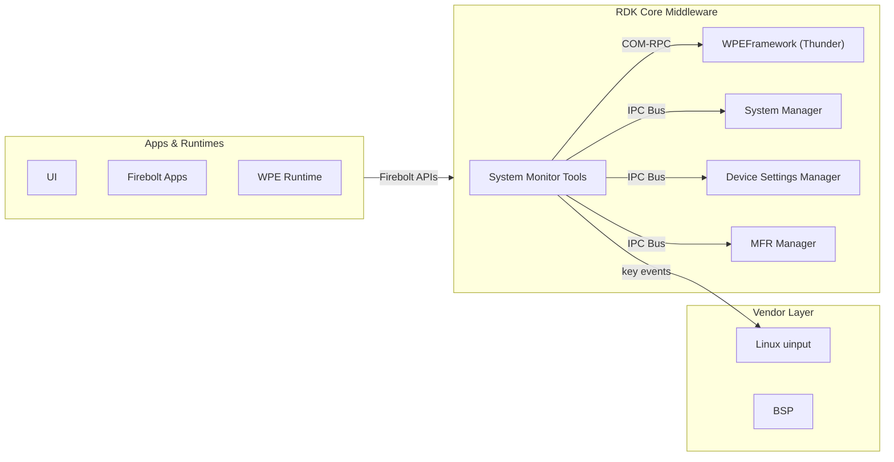
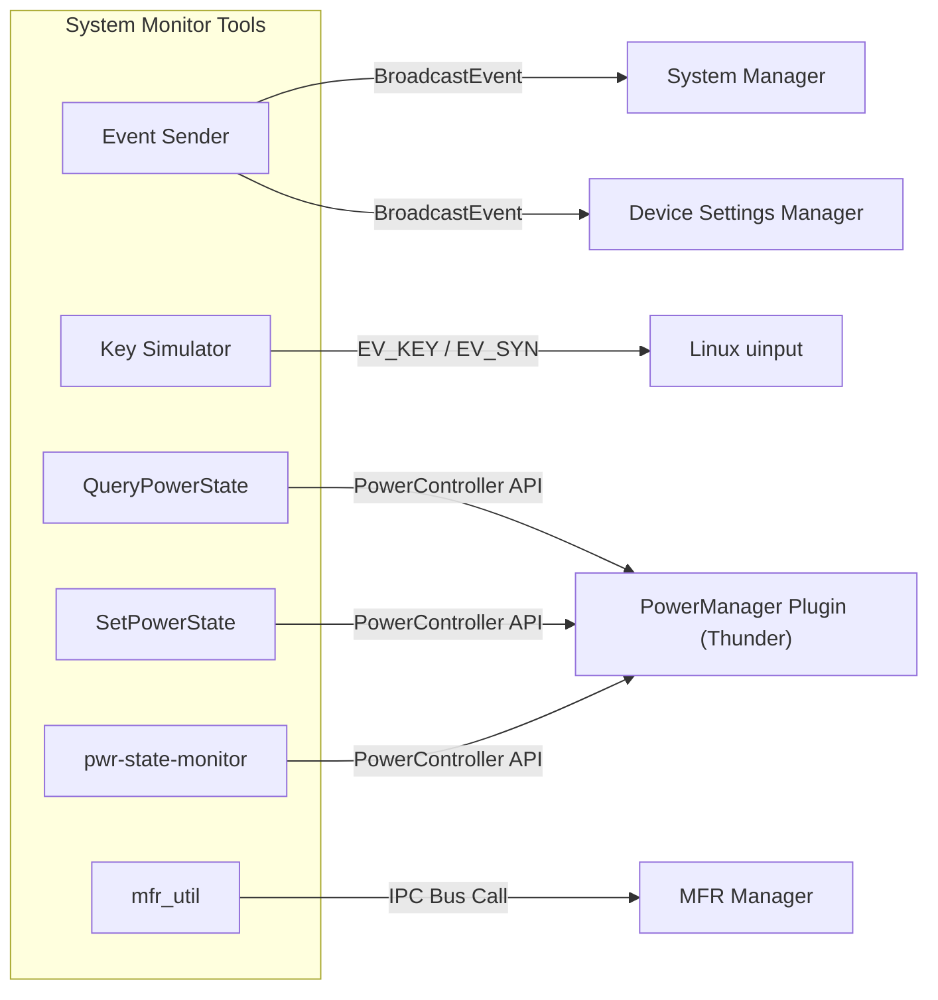
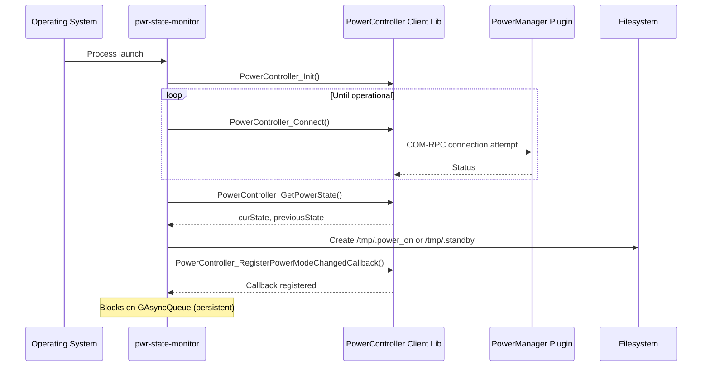
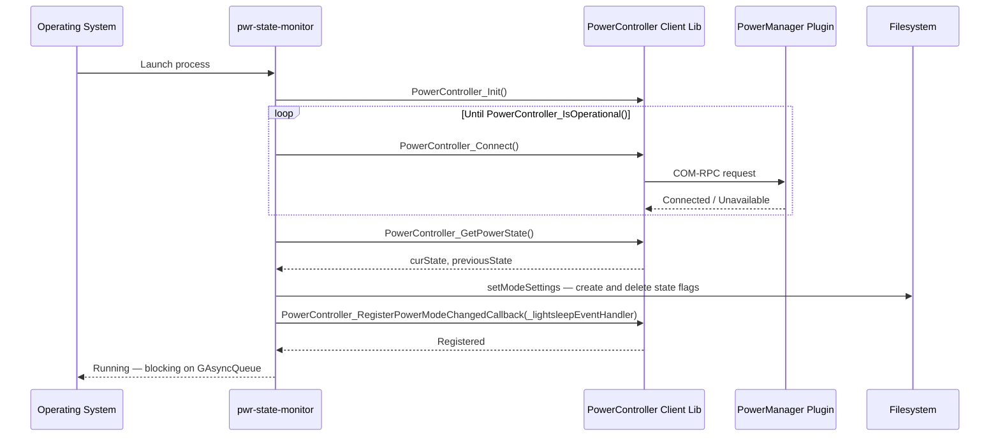
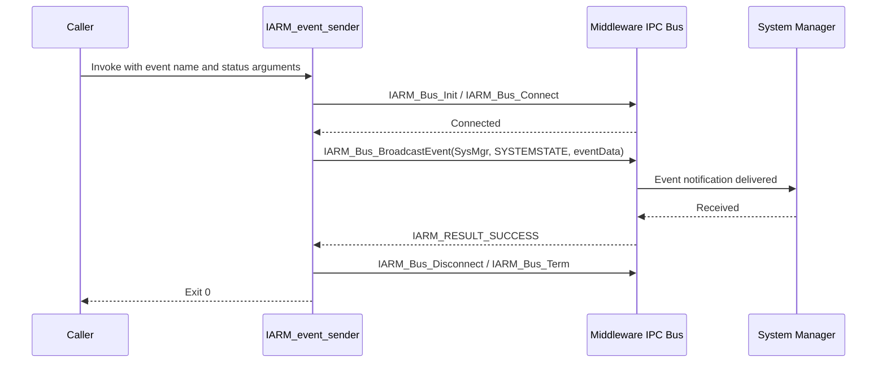
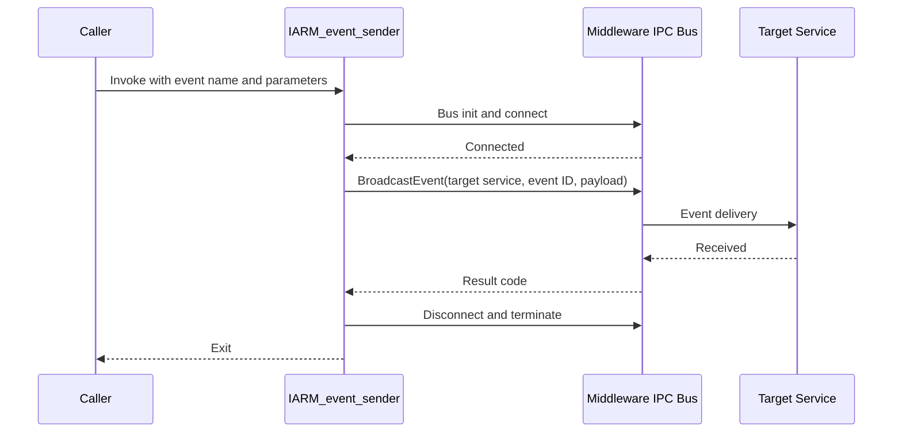
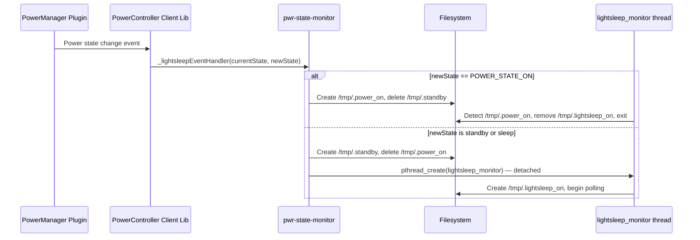

# System Monitor Tools

`sys_mon_tools` is a collection of standalone command-line utility programs that provide system monitoring and control capabilities within the RDK middleware stack. The package delivers six binaries: an event injection tool (`IARM_event_sender`), a key event simulator (`keySimulator`), a power state query tool (`QueryPowerState`), a power state control tool (`SetPowerState`), a persistent power state monitoring daemon (`pwr-state-monitor`), and a manufacturer data retrieval utility (`mfr_util`). Each tool operates independently and is designed for use in both automated test and diagnostic scenarios.

At the device level, these tools allow operators and test systems to trigger state changes, inject events into the middleware bus, simulate remote control input, query device identity, and monitor power transitions without requiring changes to production code. They provide a direct interface to running middleware services through the command line.

At the module level, each tool establishes a connection to its target middleware service, performs its operation, and exits. Power state operations communicate with the Power Manager plugin via a COM-RPC client library (`libWPEFrameworkPowerController`). Event injection tools connect to the middleware IPC bus transiently to broadcast events to the System Manager, Device Settings Manager, and other registered consumers. The key simulator injects input events directly into the Linux kernel via the `uinput` subsystem. The manufacturer utility performs a synchronous RPC call to the MFR Manager to retrieve serialized device identity data.



**Key Features & Responsibilities:**

- **System Event Injection**: The `IARM_event_sender` tool injects named system state and device manager events into the middleware IPC bus, enabling test automation and manual state simulation against live middleware services.
- **Remote Control Key Simulation**: The `keySimulator` tool simulates remote control key press events via both the middleware IPC bus and the Linux `uinput` subsystem, supporting single presses, repeated presses, press-and-hold with configurable duration, and interval-based repetition.
- **Power State Query**: The `QueryPowerState` tool retrieves the current device power state, either by querying the Power Manager plugin at runtime via the PowerController client library, or by reading the persisted power state from a binary settings file at `/opt/uimgr_settings.bin`.
- **Power State Control**: The `SetPowerState` tool transitions the device to a specified power state (ON, STANDBY, LIGHTSLEEP, DEEPSLEEP, OFF) via the Power Manager plugin, with optional support for pre-change client registration and configurable acknowledgment delays.
- **Power State Monitoring**: The `pwr-state-monitor` daemon tracks power state transitions reported by the Power Manager plugin and maintains filesystem state flags (`/tmp/.power_on`, `/tmp/.standby`) that external processes can check without establishing their own plugin connections.
- **Manufacturer Data Retrieval**: The `mfr_util` tool queries the MFR Manager for serialized manufacturer data including model name, hardware ID, manufacturer name, serial number, current image filename, and PDRI version.

---

## Design

The sys_mon_tools package follows a minimal, purpose-built design where each utility is a self-contained C program with its own `main()` entry point and no shared libraries between tools. Connections to middleware services are established at startup and released before the process exits, keeping the bus state clean. The tools operate independently within their own process address spaces, with `pwr-state-monitor` designed to run continuously as a persistent daemon. The tools are compiled as separate binaries by the build system from a single autotools project, each linked only against the libraries required for its specific function.

Each tool surfaces its results to the caller through stdout, making them suitable for scripted automation and integration into test frameworks. Southbound, they use two distinct IPC mechanisms: a COM-RPC client library for the Power Manager plugin and a direct middleware IPC bus connection for all other middleware services. This separation reflects the migration of power management from a bus-based daemon to a Thunder plugin, and the tools accordingly use the PowerController client API for all power-related operations.

The middleware IPC bus is used for event broadcasting and synchronous RPC calls. Tools initialize a named bus client, connect, perform their operation, then disconnect and terminate the client. The PowerController client library wraps COM-RPC communication with the Thunder PowerManager plugin, providing a C API for power state query, set, callback registration, and pre-change client management.

All CLI tools are configured through command-line arguments supplied at invocation. `pwr-state-monitor` uses filesystem flags under `/tmp` to externalize the current power state, making it available to other processes and scripts without requiring a direct middleware connection. Log output from `pwr-state-monitor` is written to `/tmp/lightsleep.log` with timestamps.



### Threading Model

- **Threading Architecture**: Most tools are single-threaded. `pwr-state-monitor` is multi-threaded. `SetPowerState` optionally spawns a worker thread for asynchronous pre-change acknowledgment.
- **Main Thread** (`pwr-state-monitor`): Initializes the PowerController client, queries and sets the initial power state flags, registers the power state change callback, then blocks indefinitely on a GLib async queue (`GAsyncQueue`), keeping the process alive without busy-waiting.
- **Worker Threads** (if applicable):
  - _lightsleep_monitor_: Spawned as a detached thread when the device transitions to any standby or sleep state. Polls the `/tmp/.power_on` flag at 60-second intervals and appends timestamped entries to `/tmp/lightsleep.log`. Exits when the device returns to the power-on state. Guarded by `/tmp/.lightsleep_on` to prevent duplicate thread creation.
  - _asyncThread_ (`SetPowerState`): Spawned when a positive `--ack` delay is specified. Waits for the configured acknowledgment time minus a 50 ms offset, then calls `PowerController_PowerModePreChangeComplete()` to signal pre-change completion.
- **Synchronization**: The `GAsyncQueue` in `pwr-state-monitor` provides the blocking mechanism for the main thread. The `/tmp/.lightsleep_on` flag functions as a creation guard for the `lightsleep_monitor` thread, ensuring at most one monitoring thread runs at a time.
- **Async / Event Dispatch**: Power state change callbacks (`_lightsleepEventHandler`) are delivered by the PowerController client library on its own thread context. The callback updates filesystem flags and spawns the `lightsleep_monitor` thread directly within the callback body.

### Platform and Integration Requirements

- **Build Dependencies**: `iarmbus`, `iarmmgrs`, `dbus`, `glib-2.0`, `wpeframework-clientlibraries`, `devicesettings`. When the `wifi` distro feature is enabled without the Network Manager integration, `netsrvmgr` is also required at build time.
- **Plugin Dependencies**: `QueryPowerState` (with `-c` flag), `SetPowerState`, and `pwr-state-monitor` require the PowerManager Thunder plugin to be active and operational before use. If the plugin is unavailable, these tools retry the connection or report a failure code.
- **IPC Bus**: `IARM_event_sender` uses the System Manager namespace (`IARM_BUS_SYSMGR_NAME`) and the Device Settings Manager namespace for event broadcasting. `mfr_util` uses the MFR Library namespace (`IARM_BUS_MFRLIB_NAME`) for synchronous RPC calls.
- **Configuration Files**: `QueryPowerState` optionally reads `/opt/uimgr_settings.bin` when invoked without the `-c` flag.

---

### Component State Flow

#### Initialization to Active State

**pwr-state-monitor** transitions through the following states: **Initializing** (create PowerController client instance) → **Connecting** (COM-RPC connection to PowerManager plugin, retried until operational) → **Querying** (retrieve current power state, write initial filesystem flags) → **Registering** (register power state change callback) → **Active** (blocking on GLib async queue, processing callbacks on delivery). The daemon is designed for continuous operation.

**CLI tools** (`IARM_event_sender`, `QueryPowerState`, `SetPowerState`, `keySimulator`, `mfr_util`) follow a synchronous lifecycle: **Connecting** (initialize and connect to target service) → **Executing** (perform the requested operation) → **Disconnecting** (release connection, terminate client) → **Exited**.



#### Runtime State Changes

Power state transitions are the primary runtime events handled by `pwr-state-monitor`. Each transition delivered to the registered callback results in filesystem flag updates and, on standby entry, the spawning of the `lightsleep_monitor` thread.

**State Change Triggers:**

- A transition to `POWER_STATE_ON` causes `/tmp/.power_on` to be created and `/tmp/.standby` to be deleted. Any active `lightsleep_monitor` thread detects the `/tmp/.power_on` flag on its next 60-second poll, logs a message to `/tmp/lightsleep.log`, removes `/tmp/.lightsleep_on`, and exits.
- A transition to any standby or sleep state (`POWER_STATE_STANDBY`, `POWER_STATE_STANDBY_LIGHT_SLEEP`, `POWER_STATE_STANDBY_DEEP_SLEEP`, `POWER_STATE_OFF`) causes `/tmp/.standby` to be created, `/tmp/.power_on` to be deleted, and a new detached `lightsleep_monitor` thread to be spawned.

**Context Switching Scenarios:**

- If the device enters standby while a previous `lightsleep_monitor` thread is still running (e.g., rapid standby re-entry), the presence of `/tmp/.lightsleep_on` prevents a second thread from being spawned.
- If the PowerManager plugin is unavailable at startup, `power_monitor_init()` retries the `PowerController_Connect()` call in a tight loop with 100 ms sleeps until the connection succeeds.

---

### Call Flows

#### Initialization Call Flow



#### Request Processing Call Flow

The following illustrates a system event injection using `IARM_event_sender`. The tool parses the command-line arguments to resolve the event name and status, connects to the middleware IPC bus, broadcasts the event with the appropriate payload structure, then disconnects.



---

## Internal Modules

| Module / Class        | Description                                                                                                                                                                                                                                                                                                                                                                                         | Key Files                                                             |
| --------------------- | --------------------------------------------------------------------------------------------------------------------------------------------------------------------------------------------------------------------------------------------------------------------------------------------------------------------------------------------------------------------------------------------------- | --------------------------------------------------------------------- |
| `IARM_event_sender`   | Parses command-line arguments to identify the target event name and status value, then broadcasts the matching system state or device manager event onto the middleware IPC bus. Supports System Manager state events, Device Settings Manager device events, and conditionally built events for Maintenance Manager, Wi-Fi, and RDM Manager.                                                       | `iarm-event-sender/IARM_event_sender.c`                               |
| `keySimulator`        | Accepts a key name, repeat count, interval, and optional press-and-hold duration as arguments. Resolves the key name to an RDK key code, then dispatches key-down, key-repeat, and key-up events via both the middleware IPC bus and the Linux `uinput` device.                                                                                                                                     | `key_simulator/IARM_BUS_UIEventSimulator.c`, `key_simulator/uinput.c` |
| `QueryPowerState`     | Queries the current device power state either by connecting to the PowerManager plugin when invoked with the `-c` flag, or by reading the persisted state from `/opt/uimgr_settings.bin` otherwise. Prints the state as a human-readable string (ON, STANDBY, LIGHTSLEEP, DEEPSLEEP, OFF).                                                                                                          | `iarm_query_powerstate/IARM_Bus_CheckPowerStatus.c`                   |
| `SetPowerState`       | Accepts a target power state and optional client name, acknowledgment delay, power change delay, and await duration. Connects to the PowerManager plugin, optionally registers as a pre-change client, and calls `PowerController_SetPowerState()` to initiate the transition. Receives external data from the PowerManager plugin via the `onPowerModePreChangeEvent` callback.                    | `iarm_set_powerstate/IARM_BUS_SetPowerStatus.c`                       |
| `pwr-state-monitor`   | A persistent monitoring process that maintains `/tmp/.power_on` and `/tmp/.standby` filesystem flags reflecting the current device power state. Registers with the PowerManager plugin for asynchronous power state change notifications and spawns a `lightsleep_monitor` thread on standby entry. Receives external data from the PowerManager plugin via the `_lightsleepEventHandler` callback. | `power-state-monitor/powerStateMonitorMain.c`                         |
| `mfr_util`            | Queries the MFR Manager for serialized manufacturer data via a synchronous IPC bus call. Accepts a single flag per invocation to select the data type. Temporarily redirects stdout during the bus call to suppress internal bus debug output, then restores stdout before printing the result.                                                                                                     | `mfr-utils/sys_mfr_utils.c`                                           |
| Key Code Lookup Table | Maps human-readable key command strings to RDK key code values used by `keySimulator` for argument resolution.                                                                                                                                                                                                                                                                                      | `key_simulator/UIEventSimulator.h`, `key_simulator/RDKIrKeyCodes.h`   |
| uinput Dispatcher     | Translates RDK key codes to Linux input event codes using `kcodesMap_IARM2Linux[]` and writes `EV_KEY` and `EV_SYN` events to `/dev/uinput`. Creates a virtual input device named `key-simulator` on initialization.                                                                                                                                                                                | `key_simulator/uinput.c`                                              |

---

## Component Interactions

### Interaction Matrix

| Target Component / Layer            | Interaction Purpose                                                                                             | Key APIs / Topics                                                                                                                                                                  |
| ----------------------------------- | --------------------------------------------------------------------------------------------------------------- | ---------------------------------------------------------------------------------------------------------------------------------------------------------------------------------- |
| **Plugins**                         |                                                                                                                 |                                                                                                                                                                                    |
| PowerManager Plugin (Thunder)       | Query current power state; set target power state; register for power state change and pre-change notifications | `PowerController_GetPowerState()`, `PowerController_SetPowerState()`, `PowerController_RegisterPowerModeChangedCallback()`, `PowerController_RegisterPowerModePreChangeCallback()` |
| **Middleware IPC Bus**              |                                                                                                                 |                                                                                                                                                                                    |
| System Manager                      | Broadcast system state events (firmware download, gateway connection, NTP sync, partner ID change, etc.)        | `IARM_Bus_BroadcastEvent(IARM_BUS_SYSMGR_NAME, IARM_BUS_SYSMGR_EVENT_SYSTEMSTATE, ...)`                                                                                            |
| Device Settings Manager             | Inject HDMI, composite video, audio, and display device events                                                  | `IARM_Bus_BroadcastEvent(IARM_BUS_DSMGR_NAME, ...)`                                                                                                                                |
| MFR Manager                         | Retrieve serialized manufacturer device data via synchronous RPC                                                | `IARM_Bus_Call(IARM_BUS_MFRLIB_NAME, IARM_BUS_MFRLIB_API_GetSerializedData, ...)`                                                                                                  |
| Maintenance Manager _(conditional)_ | Broadcast maintenance module status update events                                                               | `IARM_Bus_BroadcastEvent(IARM_BUS_MAINTENANCE_MGR_NAME, IARM_BUS_MAINTENANCEMGR_EVENT_UPDATE, ...)`                                                                                |
| Network Manager _(conditional)_     | Broadcast Wi-Fi interface state change events                                                                   | `IARM_Bus_BroadcastEvent(IARM_BUS_NM_SRV_MGR_NAME, IARM_BUS_NETWORK_MANAGER_EVENT_WIFI_INTERFACE_STATE, ...)`                                                                      |
| RDM Manager _(conditional)_         | Broadcast app download state change events                                                                      | `IARM_Bus_BroadcastEvent(IARM_BUS_RDMMGR_NAME, IARM_BUS_RDMMGR_EVENT_APPDOWNLOADS_CHANGED, ...)`                                                                                   |
| **Linux Kernel**                    |                                                                                                                 |                                                                                                                                                                                    |
| `/dev/uinput`                       | Inject key press, key repeat, and key release events at the input subsystem level                               | `write(devFd, &input_event, ...)` — `EV_KEY`, `EV_SYN` event types                                                                                                                 |

### Events Published

| Event Name                                                                                                                                                                                                                                      | Bus / Topic                                                               | Trigger Condition                                                            | Subscriber Components             |
| ----------------------------------------------------------------------------------------------------------------------------------------------------------------------------------------------------------------------------------------------- | ------------------------------------------------------------------------- | ---------------------------------------------------------------------------- | --------------------------------- |
| System state events (`ImageDwldEvent`, `GatewayConnEvent`, `TuneReadyEvent`, `MocaStatusEvent`, `ChannelMapEvent`, `NTPReceivedEvent`, `PartnerIdEvent`, `FirmwareStateEvent`, `IpmodeEvent`, `usbdetected`, `LogUploadEvent`, `RedStateEvent`) | `IARM_BUS_SYSMGR_EVENT_SYSTEMSTATE` on `IARM_BUS_SYSMGR_NAME`             | CLI invocation with matching event name and numeric status                   | System Manager consumers          |
| `EISSFilterEvent`                                                                                                                                                                                                                               | `IARM_BUS_SYSMGR_EVENT_EISS_FILTER_STATUS` on `IARM_BUS_SYSMGR_NAME`      | CLI invocation with `EISSFilterEvent` as event name                          | System Manager consumers          |
| `CustomEvent`                                                                                                                                                                                                                                   | `IARM_BUS_SYSMGR_EVENT_SYSTEMSTATE` on `IARM_BUS_SYSMGR_NAME`             | CLI invocation with `CustomEvent stateId state error`                        | System Manager consumers          |
| DSMgr device events (`DSMgr_HdmiHotPlug`, `DSMgr_HdmiInHotPlug`, `DSMgr_HdmiInSignalStatus`, `DSMgr_AudioFormatUpdate`, `DSMgr_DisplayFrameRatePreChange`, `DSMgr_DisplayResolutionPostChange`, and others)                                     | Corresponding event IDs on `IARM_BUS_DSMGR_NAME`                          | CLI invocation with the matching `DSMgr_` prefixed event name and parameters | Device Settings Manager consumers |
| `MaintenanceMGR` event _(conditional)_                                                                                                                                                                                                          | `IARM_BUS_MAINTENANCEMGR_EVENT_UPDATE` on `IARM_BUS_MAINTENANCE_MGR_NAME` | CLI invocation with `MaintenanceMGR` event name                              | Maintenance Manager consumers     |
| `WiFiInterfaceStateEvent` _(conditional)_                                                                                                                                                                                                       | `IARM_BUS_NETWORK_MANAGER_EVENT_WIFI_INTERFACE_STATE`                     | CLI invocation with `WiFiInterfaceStateEvent` event name                     | Network Manager consumers         |
| `AppDownloadEvent` _(conditional)_                                                                                                                                                                                                              | `IARM_BUS_RDMMGR_EVENT_APPDOWNLOADS_CHANGED`                              | CLI invocation with `AppDownloadEvent` event name                            | RDM Manager consumers             |

### IPC Flow Patterns

**Primary Request / Response Flow:**

`IARM_event_sender` follows a fire-and-forget pattern. It resolves the event name against a statically defined table, constructs the typed payload, connects to the middleware IPC bus, broadcasts the event, checks the return code, and disconnects.



**Event Notification Flow:**

`pwr-state-monitor` receives power state change notifications from the PowerManager plugin via a registered callback. The callback is invoked in the PowerController client library's thread context and directly updates filesystem flags.



---

## Implementation Details

### Major HAL APIs Integration

| HAL / DS API                                             | Purpose                                                                                                               | Implementation File                                                                                                                                 |
| -------------------------------------------------------- | --------------------------------------------------------------------------------------------------------------------- | --------------------------------------------------------------------------------------------------------------------------------------------------- |
| `PowerController_Init()`                                 | Creates the PowerController client instance                                                                           | `iarm_query_powerstate/IARM_Bus_CheckPowerStatus.c`, `iarm_set_powerstate/IARM_BUS_SetPowerStatus.c`, `power-state-monitor/powerStateMonitorMain.c` |
| `PowerController_Connect()`                              | Establishes COM-RPC connection with the PowerManager plugin; retried in a loop until operational                      | `iarm_set_powerstate/IARM_BUS_SetPowerStatus.c`, `power-state-monitor/powerStateMonitorMain.c`                                                      |
| `PowerController_IsOperational()`                        | Checks whether the COM-RPC connection to the PowerManager plugin is active                                            | `iarm_set_powerstate/IARM_BUS_SetPowerStatus.c`, `power-state-monitor/powerStateMonitorMain.c`                                                      |
| `PowerController_GetPowerState()`                        | Retrieves the current and previous power states as `PowerController_PowerState_t` enum values                         | `iarm_query_powerstate/IARM_Bus_CheckPowerStatus.c`, `power-state-monitor/powerStateMonitorMain.c`                                                  |
| `PowerController_SetPowerState()`                        | Requests a transition to the specified power state; returns an error code indicating success or plugin unavailability | `iarm_set_powerstate/IARM_BUS_SetPowerStatus.c`                                                                                                     |
| `PowerController_RegisterPowerModeChangedCallback()`     | Registers a callback function invoked on each power state transition                                                  | `power-state-monitor/powerStateMonitorMain.c`                                                                                                       |
| `PowerController_RegisterPowerModePreChangeCallback()`   | Registers a callback invoked before a power state change is committed                                                 | `iarm_set_powerstate/IARM_BUS_SetPowerStatus.c`                                                                                                     |
| `PowerController_AddPowerModePreChangeClient()`          | Registers the process as a named blocking client in the pre-change sequence                                           | `iarm_set_powerstate/IARM_BUS_SetPowerStatus.c`                                                                                                     |
| `PowerController_PowerModePreChangeComplete()`           | Signals that the registered pre-change client has completed its handling                                              | `iarm_set_powerstate/IARM_BUS_SetPowerStatus.c`                                                                                                     |
| `PowerController_DelayPowerModeChangeBy()`               | Requests that the power mode change be delayed by a specified number of seconds                                       | `iarm_set_powerstate/IARM_BUS_SetPowerStatus.c`                                                                                                     |
| `PowerController_RemovePowerModePreChangeClient()`       | Deregisters the named pre-change client on shutdown                                                                   | `iarm_set_powerstate/IARM_BUS_SetPowerStatus.c`                                                                                                     |
| `PowerController_UnRegisterPowerModePreChangeCallback()` | Deregisters the power mode pre-change callback on controller shutdown                                                 | `iarm_set_powerstate/IARM_BUS_SetPowerStatus.c`                                                                                                     |
| `PowerController_Term()`                                 | Terminates the PowerController client and releases the COM-RPC connection                                             | `iarm_query_powerstate/IARM_Bus_CheckPowerStatus.c`, `iarm_set_powerstate/IARM_BUS_SetPowerStatus.c`                                                |

### Key Implementation Logic

- **State / Lifecycle Management**: `pwr-state-monitor` tracks device power state through filesystem flags. On initialization, the current power state is retrieved via `PowerController_GetPowerState()` and `setModeSettings()` creates or deletes the appropriate flag files. On each subsequent callback, `setModeSettings()` is called with the new state value. The `lightsleep_monitor` thread guards against re-entrant spawning by checking for `/tmp/.lightsleep_on` before creating the file and proceeding.
  - Core implementation: `power-state-monitor/powerStateMonitorMain.c`

- **Event Processing**: `IARM_event_sender` resolves the event name at runtime by scanning a static `eventList[]` array for System Manager events and a `iarmEventTable[]` dispatch table for Device Settings Manager events. Events with the `DSMgr_` prefix are dispatched to dedicated handler functions that construct the appropriate typed payload struct. All processing is synchronous within the single process invocation; unrecognized event names are reported to stdout.
  - Event dispatch table: `iarm-event-sender/IARM_event_sender.c`

- **Error Handling Strategy**: PowerController API calls return `POWER_CONTROLLER_ERROR_NONE` on success. `POWER_CONTROLLER_ERROR_UNAVAILABLE` triggers a retry loop in `power_monitor_init()` and `initController()` with a 100 ms sleep between attempts. Middleware IPC bus calls return `IARM_RESULT_SUCCESS` on success; failures are logged to stdout but the tool does not retry. Filesystem flag creation failures and log file open failures are reported to stdout and the operation continues. `mfr_util` reports bus call failures with the specific error code and the requested parameter name.

- **Logging & Diagnostics**: CLI tools log progress and errors to stdout via `printf()`. `IARM_event_sender` additionally uses GLib `g_message()` for structured event send confirmation. `pwr-state-monitor` appends timestamped log entries to `/tmp/lightsleep.log` on standby entry, on power-on detection by the monitor thread, and when the monitor thread exits.

---

## Configuration

### Key Configuration Parameters

| Parameter                                    | Type    | Default | Description                                                                                                                                                             |
| -------------------------------------------- | ------- | ------- | ----------------------------------------------------------------------------------------------------------------------------------------------------------------------- |
| Event name (`IARM_event_sender` arg 1)       | string  | —       | Name of the event to broadcast on the middleware IPC bus                                                                                                                |
| Event status (`IARM_event_sender` arg 2)     | int     | —       | Numeric status value carried in the event payload                                                                                                                       |
| Key command (`keySimulator -k`)              | string  | —       | Human-readable key name resolved against the lookup table                                                                                                               |
| Repeat count (`keySimulator -r`)             | int     | `1`     | Number of times to send the key event sequence                                                                                                                          |
| Interval (`keySimulator -i`)                 | int     | `1`     | Seconds to wait between repeated key events                                                                                                                             |
| Hold duration (`keySimulator -p`)            | int     | `5`     | Seconds to hold the key when press-and-hold mode is active                                                                                                              |
| Power state (`SetPowerState` positional arg) | string  | —       | Target power state: `ON`, `STANDBY`, `LIGHTSLEEP`, `DEEPSLEEP`, `OFF`, `NOP`                                                                                            |
| Client name (`SetPowerState --client`)       | string  | `""`    | Name used when registering as a pre-change client                                                                                                                       |
| Acknowledgment delay (`SetPowerState --ack`) | int     | `-1`    | Seconds before sending pre-change complete signal; `-1` disables acknowledgment                                                                                         |
| Change delay (`SetPowerState --delay`)       | CSV int | —       | Comma-separated list of seconds to request as power mode change delays                                                                                                  |
| Await duration (`SetPowerState --await`)     | int     | `0`     | Minimum seconds to wait before the process exits                                                                                                                        |
| MFR data selector (`mfr_util` arg 1)         | string  | —       | Parameter flag: `--CurrentImageFilename`, `--FlashedFilename`, `--Modelname`, `--HardwareId`, `--Manufacturer`, `--MfgSerialnumber`, `--PDRIVersion` (Yocto build only) |

### Runtime Configuration

All tool parameters are supplied as command-line arguments at invocation time. The following examples illustrate typical usage:

```bash
# Query power state via PowerManager plugin
QueryPowerState -c

# Inject a system state event
IARM_event_sender NTPReceivedEvent 1

# Inject a DSMgr HDMI hot-plug event
IARM_event_sender DSMgr_HdmiHotPlug true

# Simulate a key press (repeat 3 times, 2-second interval)
keySimulator -kselect -r3 -i2

# Set device to standby
SetPowerState STANDBY

# Set power state with delayed pre-change acknowledgment
SetPowerState --client C1 --ack 2 STANDBY

# Retrieve model name
mfr_util --Modelname
```

### Configuration Persistence

All tool parameters are supplied at invocation time via command-line arguments and take effect for the duration of the process execution.
