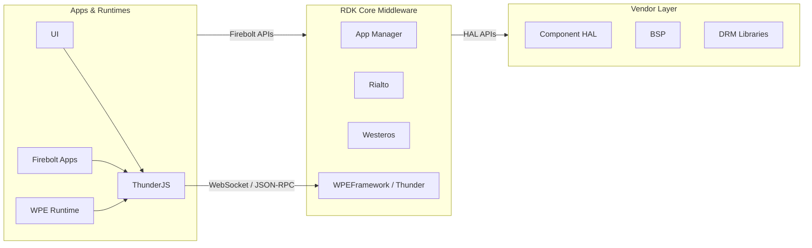
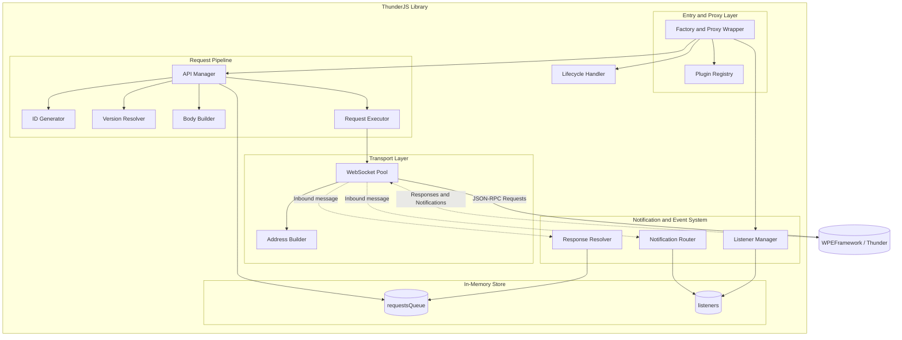
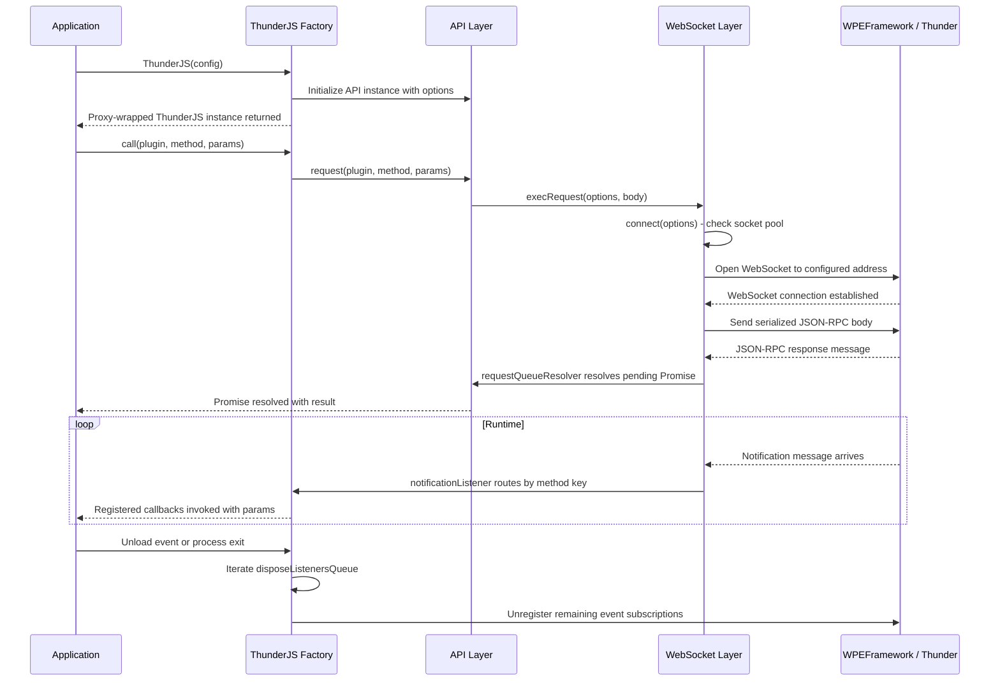
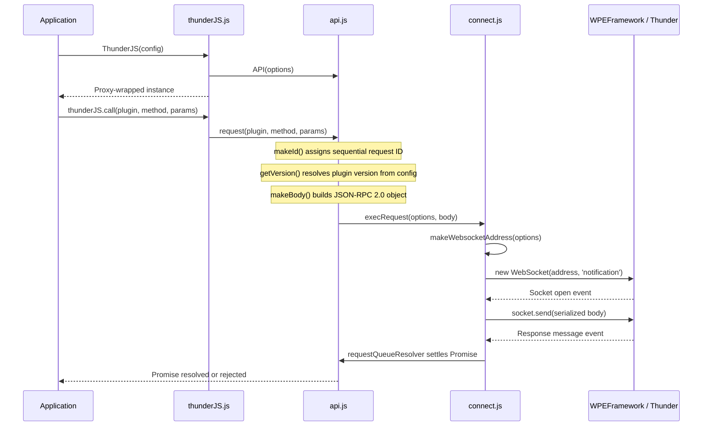
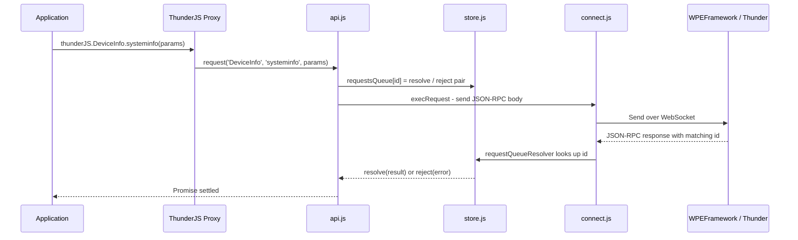
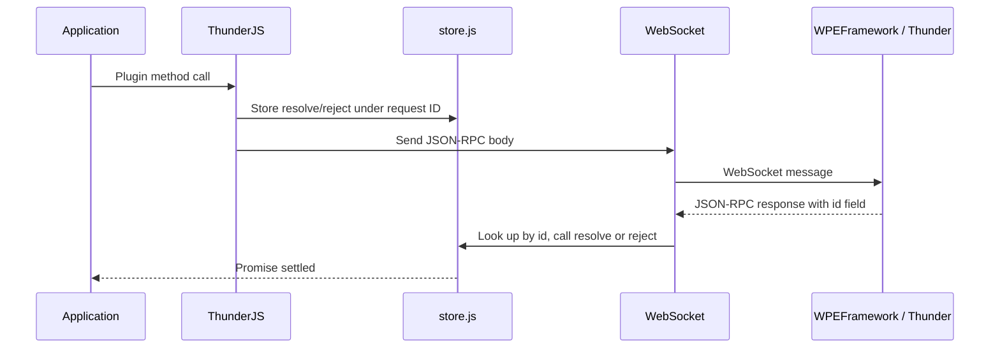
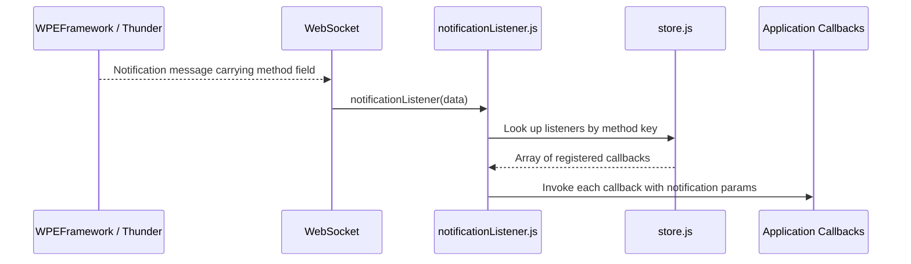

# ThunderJS

ThunderJS is a JavaScript client library that enables applications running on an RDKE/RDKV device to interact with the WPEFramework (Thunder) middleware. It abstracts the JSON-RPC 2.0 over WebSocket communication layer, providing a clean, promise-based API for invoking Thunder plugin methods and subscribing to plugin-emitted notifications.

The library is isomorphic: the same source code runs inside browser-based runtimes (such as WPE) and in Node.js environments. Build tooling produces a browser IIFE bundle, an ES module, and a CommonJS module from the same source, with the only environment-specific difference being the WebSocket implementation — native browser `WebSocket` in browser builds and the `ws` npm package in Node.js builds.

On device, ThunderJS is deployed as a single JavaScript module file and consumed by applications that need to call Thunder plugins without writing raw WebSocket or JSON-RPC logic. It handles connection management, request correlation, notification routing, and lifecycle cleanup transparently.

**Key Features & Responsibilities:**

- **JSON-RPC 2.0 over WebSocket**: Constructs well-formed JSON-RPC 2.0 request bodies — including plugin name, API version, method, and optional parameters — and transmits them over a persistent WebSocket connection to the Thunder endpoint.
- **Promise and callback dual API**: Every plugin method call returns a Promise by default. If the caller passes a function as the last argument, the result is instead delivered through a Node-style `(error, result)` callback, supporting both modern async/await and legacy callback coding styles.
- **WebSocket connection pooling**: Maintains a pool of WebSocket connections keyed by address. An existing open connection is reused without re-establishing the handshake; a connecting socket is queued until it is ready, avoiding duplicate connection attempts.
- **Plugin version management**: Resolves the API version for each request from a per-plugin version map supplied at initialization. A global default version can also be configured. Per-call version overrides are supported via a dedicated parameter key.
- **Notification subscription**: Allows callers to register persistent (`on`) or one-shot (`once`) callbacks for plugin-emitted events. The library sends a `register` JSON-RPC call to Thunder to opt in to notifications and dispatches incoming notification messages to the appropriate callbacks.
- **Extensible plugin model**: Applications can register custom plugin objects under a named namespace. Plugin methods gain access to the underlying `call` and `on` primitives through a shared context, enabling encapsulation of convenience logic around raw Thunder API calls.
- **Token-based authentication**: When running in a browser environment where `window.thunder.token()` is available, the token is automatically appended to the WebSocket connection URL, enabling authenticated sessions without additional caller configuration.
- **Graceful lifecycle cleanup**: Registers cleanup handlers for the browser `unload` event and the Node.js `exit` and `SIGINT` signals, ensuring that all active event subscriptions are disposed before the runtime exits.

---

## Design

ThunderJS is designed around the principle of providing a thin, transparent proxy over the Thunder JSON-RPC interface without imposing a heavyweight framework. The library is structured as a factory function that returns a `Proxy`-wrapped object. The `Proxy` intercepts property access, allowing callers to invoke plugin methods using natural dot-notation (`thunderJS.DeviceInfo.systeminfo()`) without requiring explicit plugin registration for every Thunder plugin. When a property is accessed that does not correspond to a pre-registered plugin, the proxy transparently delegates the call to the generic `api.request()` path.

The request pipeline separates concerns across discrete, single-responsibility modules: ID generation, API version resolution, request body construction, WebSocket connection management, and response correlation are each handled by a dedicated module. This separation keeps the transport layer independent of the application-level plugin abstraction. Request correlation is achieved through an in-memory map (`requestsQueue`) that stores the resolve and reject functions of each pending Promise, keyed by the monotonically incrementing request ID assigned at request construction time. When a response arrives over the WebSocket, the ID field is used to look up and settle the correct Promise.

Notification handling is designed symmetrically to request handling but operates through a separate in-memory map (`listeners`), keyed by a structured identifier of the form `client.{plugin}.events.{event}`. Multiple callbacks can be registered for the same plugin-event pair; each registration appends to the callback array. Unregistration removes the specific callback by index, and when the array becomes empty, a `unregister` JSON-RPC call is sent to Thunder to stop the notification stream.

The northbound interface is the JavaScript API consumed by application code: the factory function, plugin method calls, `on()`, `once()`, `registerPlugin()`, and `call()`. The southbound interface is the WebSocket connection to the WPEFramework JSON-RPC endpoint, through which all plugin invocations and event registrations are mediated.

The library relies solely on the WebSocket protocol as its IPC mechanism. In a browser runtime, the native `WebSocket` API is used. In a Node.js environment, the `ws` npm package provides the equivalent interface. The build system enforces this distinction through an alias plugin that substitutes the correct WebSocket implementation at bundle time. The WebSocket connection uses the `notification` subprotocol by default, signalling to Thunder that the client intends to both send requests and receive event notifications on the same connection.

State is held entirely in memory. The `requestsQueue` and `listeners` stores are plain in-memory JavaScript objects scoped to the lifetime of the library instance.

#### Threading Model

- **Threading Architecture**: Single-threaded. ThunderJS executes entirely on the JavaScript engine's single event loop thread.
- **Main Thread**: Handles all operations — JSON-RPC request construction, WebSocket send, response resolution, notification dispatch, listener registration, and lifecycle cleanup.
- **Synchronization**: The JavaScript event loop guarantees non-concurrent execution of callbacks. The `requestsQueue` and `listeners` objects are accessed and mutated exclusively within event loop turns.
- **Async / Event Dispatch**: Asynchronous behavior is achieved entirely through Promises and WebSocket event callbacks (`message`, `open`, `error`, `close`). Notification callbacks are invoked synchronously within the `message` event handler turn, so callers must not block within callbacks.

### Prerequisites and Dependencies

#### Platform and Integration Requirements

- **Build Dependencies**: Requires the `wpeframework` package to be present on the target device. The `ws` npm package (`^7.2.3`) is bundled into the CommonJS output for Node.js environments. Browser builds alias `ws` to the native `WebSocket` global.
- **Plugin Dependencies**: The WPEFramework daemon must be running and its JSON-RPC WebSocket endpoint must be reachable at the configured address before any ThunderJS API calls are issued.
- **Startup Order**: ThunderJS establishes its WebSocket connection lazily on the first API call; the WPEFramework endpoint must be reachable at that point.

---

### Component State Flow

#### Initialization to Active State

ThunderJS transitions through the following states during its lifecycle: **Uninitialized** → **Instantiated** (factory called, API and plugin objects allocated) → **Connecting** (first request triggers WebSocket establishment) → **Active** (WebSocket open, requests and notifications flowing) → **Torn Down** (unload or exit event triggers disposal of all registered listeners).

The WebSocket connection is established lazily: the connection is initiated on the first `call()`, `on()`, or `once()` operation that requires network communication.

#### Runtime State Changes

**State Change Triggers:**

- **WebSocket error**: When the WebSocket emits an error event, an internal `ThunderJS.error` notification is dispatched to any registered `ThunderJS` error listeners, and the socket entry in the pool is nulled out. The next API call will trigger a fresh connection attempt.
- **Event subscription added**: When `on()` is called for a plugin-event pair that has no existing listeners, a `register` JSON-RPC request is sent to Thunder to begin receiving notifications for that event. Subsequent `on()` calls for the same pair only add to the local callback array without sending additional requests.
- **Event subscription removed**: When `dispose()` is called on a listener and the callback array for that plugin-event pair becomes empty, an `unregister` JSON-RPC request is sent to Thunder to stop the notification stream for that event.

**Context Switching Scenarios:**

- **One-shot listener auto-disposal**: A listener registered with `once()` automatically calls `dispose()` after the first invocation of its callback, removing itself from the store and sending `unregister` to Thunder if it was the last subscriber.
- **Socket reconnection**: After a WebSocket error, the socket pool entry is cleared and the next `call()` or `on()` operation creates a fresh WebSocket connection. Any event subscriptions needed after reconnection are re-registered by the caller.

---

### Call Flows

#### Initialization Call Flow

#### Request Processing Call Flow

When a plugin method is invoked, the Proxy intercepts the call and routes it through the request pipeline. The request ID is stored in `requestsQueue` alongside the Promise's resolve and reject functions. When the response arrives over the WebSocket, the response resolver looks up the pending entry by ID, settles the Promise, and removes the entry from the queue.

---

## Internal Modules

| Module / Class         | Description                                                                                                                                                                                                                                                                                             | Key Files                         |
| ---------------------- | ------------------------------------------------------------------------------------------------------------------------------------------------------------------------------------------------------------------------------------------------------------------------------------------------------- | --------------------------------- |
| `thunderJS`            | Factory function and entry point. Reads the optional token from the browser environment, constructs the core object, merges built-in plugins, and wraps everything in a JavaScript `Proxy` that enables dot-notation plugin access. Also implements `call()`, `on()`, `once()`, and `registerPlugin()`. | `src/thunderJS.js`                |
| `API`                  | Request manager. Orchestrates ID generation, version resolution, body construction, and request execution. Wraps each outbound request in a Promise and stores the settle functions in `requestsQueue`.                                                                                                 | `src/api.js`                      |
| `connect`              | WebSocket connection pool. Manages a map of sockets keyed by address. Reuses open sockets, queues callers waiting for a connecting socket, and creates new sockets when none exist. Attaches `message` handlers for both response resolution and notification routing on each new socket.               | `src/api/connect.js`              |
| `execRequest`          | Transport entry point. Calls `connect()` to obtain an open socket and sends the serialized JSON-RPC body.                                                                                                                                                                                               | `src/api/execRequest.js`          |
| `makeBody`             | Constructs the JSON-RPC 2.0 request object from the plugin name, resolved version, method, and parameters. Handles the `version` / `versionAsParameter` parameter substitution.                                                                                                                         | `src/api/makeBody.js`             |
| `makeWebsocketAddress` | Assembles the WebSocket URL from the options object, applying defaults for protocol (`ws://`), host (`localhost`), port (`80`), and endpoint (`/jsonrpc`). Appends a token query parameter when present.                                                                                                | `src/api/makeWebsocketAddress.js` |
| `makeId`               | Generates monotonically incrementing integer request IDs used to correlate requests with responses.                                                                                                                                                                                                     | `src/api/makeId.js`               |
| `getVersion`           | Resolves the API version for a request from the per-plugin `versions` configuration map. Falls back to a global default, then to version `1`. Supports per-call version override via the `version` parameter.                                                                                           | `src/api/getVersion.js`           |
| `requestQueueResolver` | Processes inbound WebSocket messages that carry an `id` field. Parses the JSON, looks up the pending entry in `requestsQueue`, and resolves or rejects the corresponding Promise.                                                                                                                       | `src/api/requestQueueResolver.js` |
| `notificationListener` | Processes server-pushed notification messages arriving over WebSocket. Notifications are characterized by carrying a `method` field; the router looks up the registered callback array in `listeners` by method key and invokes each callback with the notification params.                             | `src/api/notificationListener.js` |
| `listener`             | Manages event subscription lifecycle. On first registration for a plugin-event pair, sends a `register` JSON-RPC request to Thunder. Returns a `dispose()` handle that removes the callback and sends `unregister` to Thunder when the last callback is removed.                                        | `src/listener.js`                 |
| `store`                | In-memory state store. Exports two plain objects: `requestsQueue` (pending request Promise handles indexed by request ID) and `listeners` (notification callback arrays indexed by listener key).                                                                                                       | `src/store.js`                    |
| `unload`               | Lifecycle cleanup hook. Registers a handler for the browser `unload` event or Node.js `exit` and `SIGINT` signals that iterates and calls all dispose functions queued during the session.                                                                                                              | `src/unload.js`                   |
| `DeviceInfo` plugin    | Built-in convenience plugin for the `DeviceInfo` Thunder plugin. Provides `freeRam()` and `version()` helper methods that call `systeminfo` and extract the relevant fields from the response.                                                                                                          | `src/plugins/DeviceInfo.js`       |
| `plugins/index`        | Plugin registry that exports the set of built-in plugins merged into every ThunderJS instance at construction.                                                                                                                                                                                          | `src/plugins/index.js`            |

---

---

## Component Interactions

ThunderJS routes all plugin method calls and event subscriptions through a persistent WebSocket connection to the WPEFramework JSON-RPC endpoint.

### Interaction Matrix

| Target Component / Layer   | Interaction Purpose                                 | Key APIs / Topics                                             |
| -------------------------- | --------------------------------------------------- | ------------------------------------------------------------- |
| **WPEFramework / Thunder** |                                                     |                                                               |
| Thunder JSON-RPC endpoint  | Send plugin method invocations and receive results  | `plugin.version.method` JSON-RPC method format over WebSocket |
| Thunder JSON-RPC endpoint  | Register for and receive plugin event notifications | `plugin.register`, `plugin.unregister` JSON-RPC methods       |

### Events Published

| Event Name             | JSON-RPC Topic                       | Trigger Condition                               | Subscriber Components                                         |
| ---------------------- | ------------------------------------ | ----------------------------------------------- | ------------------------------------------------------------- |
| `ThunderJS.connect`    | `client.ThunderJS.events.connect`    | WebSocket connection successfully opened        | Callers registered via `thunderJS.on('connect', callback)`    |
| `ThunderJS.disconnect` | `client.ThunderJS.events.disconnect` | WebSocket connection closed                     | Callers registered via `thunderJS.on('disconnect', callback)` |
| `ThunderJS.error`      | `client.ThunderJS.events.error`      | WebSocket connection error on the active socket | Callers registered via `thunderJS.on('error', callback)`      |

### IPC Flow Patterns

**Primary Request / Response Flow:**

The library constructs a JSON-RPC 2.0 body with a unique integer ID, stores the Promise settle functions in `requestsQueue`, and transmits the body over the WebSocket. When the response arrives, the ID field is matched against `requestsQueue` and the Promise is settled with the result or the error object from the response.

**Event Notification Flow:**

When a notification arrives — identified as a server-pushed message by its `method` field — the notification listener looks up the key in `listeners` and dispatches the `params` payload to each registered callback in the array.

---

## Implementation Details

### Key Implementation Logic

- **Request Correlation**: Each outbound request is assigned an integer ID from a module-level counter in `makeId.js`. The ID is embedded in the JSON-RPC body and simultaneously used as the key under which the Promise's resolve and reject functions are stored in `requestsQueue`. The response resolver in `requestQueueResolver.js` matches incoming responses to pending Promises by this ID and removes the entry after settlement.
  - Request queue management: `src/api.js`, `src/api/requestQueueResolver.js`
  - ID generation: `src/api/makeId.js`

- **WebSocket Connection Management**: `connect.js` maintains a module-level `sockets` map keyed by the full WebSocket URL. On each request, if a socket exists and is open (`readyState === 1`), it is reused immediately. If a socket is in the connecting state (`readyState === 0`), an `open` event listener is added and the caller waits. If no socket exists, a new one is created, `message` handlers are attached for both response resolution and notification routing, and error and close handlers manage pool cleanup.
  - Core implementation: `src/api/connect.js`

- **Notification Routing**: Inbound messages are processed by two independent handlers attached to each socket's `message` event. `requestQueueResolver.js` handles response messages identified by their `id` field; `notificationListener.js` handles server-pushed notification messages identified by their `method` field. Before JSON parsing, both handlers apply regex normalization to strip hex-escape sequences that may appear in certain string payloads.
  - Notification dispatch: `src/api/notificationListener.js`
  - Response resolution: `src/api/requestQueueResolver.js`

- **Listener Lifecycle**: `listener.js` constructs a structured key of the form `client.{plugin}.events.{event}` for each plugin-event pair. The first `on()` call for a pair sends a `register` request to Thunder using the truncated key `client.{plugin}.events` as the JSON-RPC request ID and the event name as a parameter. Callbacks are stored as an array under the full key. `dispose()` removes the callback by index; when the array is empty, `unregister` is sent to Thunder and the key is deleted from the store.
  - Subscription management: `src/listener.js`

- **Proxy Wrapper**: The factory wraps the core object in a JavaScript `Proxy`. Property access for known keys (`api`, `on`, `once`, `subscribe`) is returned directly. For other properties, the proxy returns a function that invokes `api.request()` with the plugin name (derived from the property chain) and method name, routing through the `resolve()` helper to ensure Promise semantics are always applied regardless of whether the called method returns synchronously, as a Promise, or as an `Error`.
  - Proxy and factory: `src/thunderJS.js`

- **Error Handling Strategy**: If `execRequest()` fails (e.g., the WebSocket cannot be opened), the rejection propagates to the caller's Promise. If a response arrives with an `error` field instead of a `result` field, `requestQueueResolver.js` calls `reject(data.error)`. WebSocket errors are surfaced as an internal `ThunderJS.error` notification through the `notificationListener` path. Callers receive the rejection and may implement retry logic at the application level.

- **Logging and Diagnostics**: A `debug` flag in the options object enables console logging of outgoing request bodies and incoming response data. When `debug` is `true`, each request body is logged before transmission and each raw response message is logged upon receipt.
  - Debug output points: `src/api.js`, `src/api/connect.js`

---

## Configuration

### Key Configuration Parameters

| Parameter      | Type    | Default        | Description                                                                                                                                                     |
| -------------- | ------- | -------------- | --------------------------------------------------------------------------------------------------------------------------------------------------------------- |
| `host`         | string  | `localhost`    | IP address or hostname of the device running WPEFramework.                                                                                                      |
| `port`         | number  | `80`           | Port on which the WPEFramework JSON-RPC WebSocket endpoint is listening.                                                                                        |
| `endpoint`     | string  | `/jsonrpc`     | WebSocket path for the JSON-RPC endpoint.                                                                                                                       |
| `protocol`     | string  | `ws://`        | WebSocket protocol scheme. Set to `wss://` for TLS connections.                                                                                                 |
| `subprotocols` | string  | `notification` | WebSocket sub-protocol sent during the handshake.                                                                                                               |
| `token`        | string  | `undefined`    | Authentication token appended to the WebSocket URL as a query parameter. Populated automatically from `window.thunder.token()` when available in the browser.   |
| `versions`     | object  | `undefined`    | Per-plugin API version map. Accepts a `default` key to override the baseline version of `1`. Plugin-specific entries override the default for that plugin only. |
| `debug`        | boolean | `false`        | Enables console logging of outbound request bodies and inbound response messages.                                                                               |
