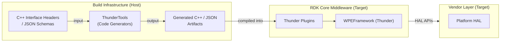
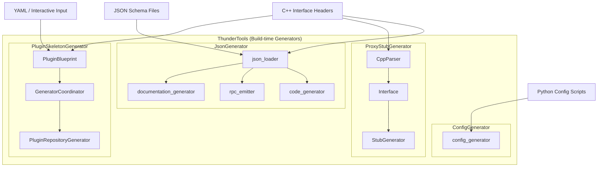
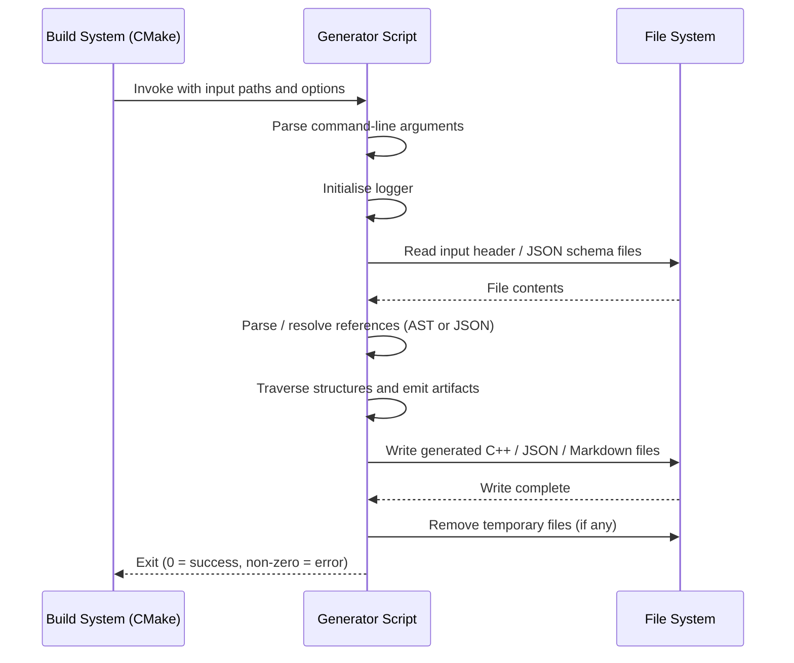
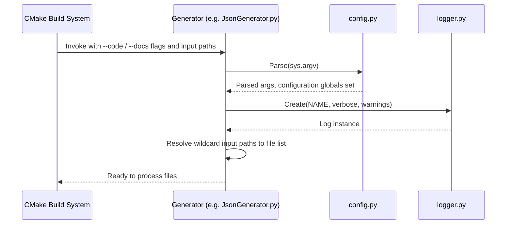
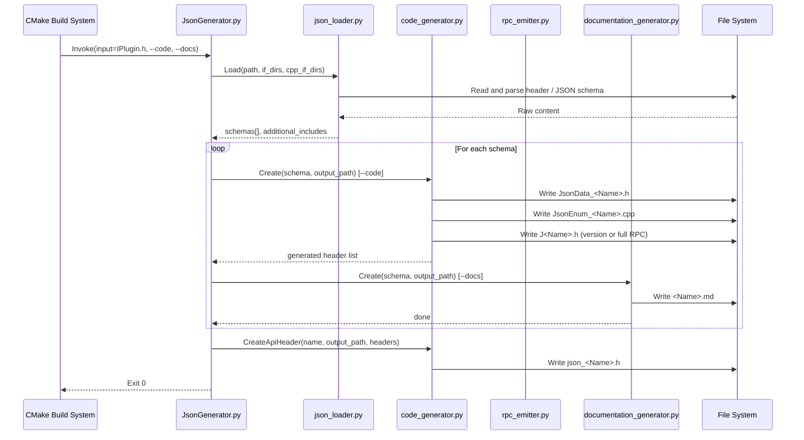
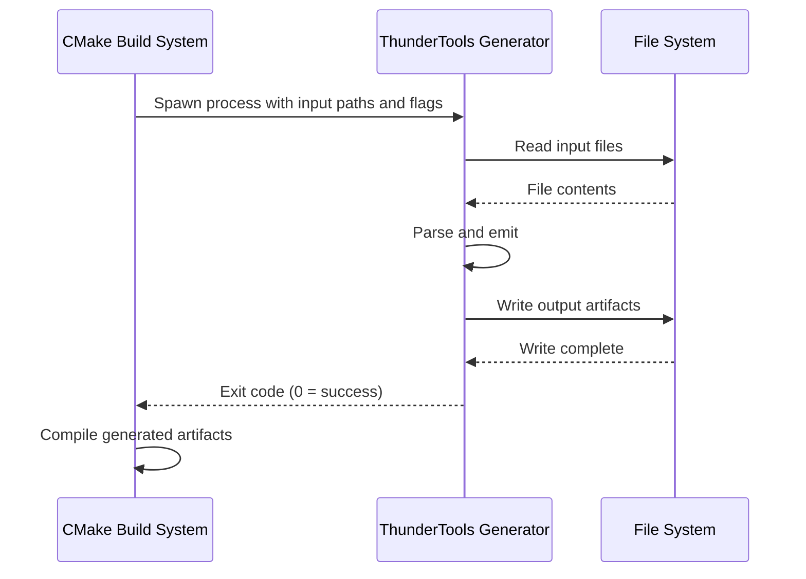
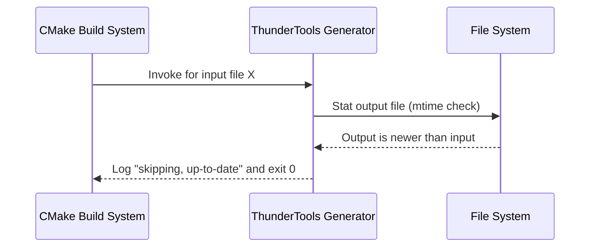

# ThunderTools

ThunderTools is a collection of host-native, build-time code generation utilities for the Thunder (WPEFramework) middleware stack. It is invoked by the build system to produce C++ source artifacts, configuration files, plugin skeletons, and reference documentation from annotated C++ headers and JSON-schema definitions. These generated artifacts are compiled into Thunder plugins and represent a prerequisite step before any Thunder plugin can be built.

ThunderTools addresses the significant boilerplate burden involved in writing COM-RPC proxy and stub classes, JSON-RPC dispatch glue, per-plugin JSON configuration, and interface documentation by hand. Each generator is a standalone Python script that can be called directly or via the CMake helper functions that ThunderTools installs.

The toolset is distributed as a `native` and `nativesdk` Yocto recipe (`wpeframework-tools_5.3.bb`), ensuring the generators run on the build host during cross-compilation.

**Key Features & Responsibilities:**

- **JsonGenerator**: Parses annotated C++ interface headers and JSON-schema definition files to produce JSON data-class headers (`JsonData_<Name>.h`), enum-registration translation units (`JsonEnum_<Name>.cpp`), JSON-RPC dispatch headers (`J<Name>.h`), combined API headers, and Markdown reference documentation for each plugin interface.
- **ProxyStubGenerator**: Parses C++ interface headers that declare COM-RPC interfaces and emits the corresponding proxy and stub implementation files (`ProxyStubs_<Name>.cpp`) that the Thunder COM-RPC transport layer uses to marshal calls across process boundaries.
- **ConfigGenerator**: Reads Python-based plugin configuration scripts and produces the JSON configuration files (`<Plugin>.json`) consumed by the Thunder plugin host at startup.
- **PluginSkeletonGenerator**: Generates a complete, ready-to-compile plugin repository scaffold—header, source, CMakeLists, conf-in, and JSON schema—from a user-supplied interface header and a small set of interactive prompts or a YAML configuration file.
- **DocumentGenerator**: Clones Thunder interface and plugin repositories, invokes JsonGenerator in documentation mode on all discovered interfaces, and assembles the results into a versioned MkDocs site.
- **ThunderDevTools**: A lightweight interactive launcher that presents a menu-driven entry point to the other development tools, primarily the PluginSkeletonGenerator.
- **binalyzer**: A shell utility that uses `lddtree` to enumerate a target binary and all its shared-library dependencies, printing a size-annotated dependency tree useful for footprint analysis.

---

## Design

ThunderTools follows a pipeline design: each generator accepts a well-defined input format (C++ header or JSON schema), produces a deterministic output artifact, and is stateless between invocations. Generators are Python 3 scripts, each running in an isolated process context, and can be parallelized at the CMake level by invoking them as separate processes for each interface file.

The JsonGenerator and ProxyStubGenerator share a common C++ parser (`CppParser.py`) and a common logging module (`Log.py`). The JsonGenerator adds a JSON-schema loader (`json_loader.py`) that understands JSON-ref (`$ref`) resolution so that interface definitions can be split across multiple files. Output is written through an `Emitter` class that handles indentation, line-length wrapping, and file flush, ensuring that generated files are consistent and readable.

The ProxyStubGenerator operates entirely from the parsed C++ AST. It identifies COM-RPC interface classes—those that inherit from `Core::IUnknown` and declare an `ID` enumerator—and walks their virtual method tables to emit serialization and deserialization code for every parameter type. Optional security, range-verification, instance-verification, and frame-coherency checks can be enabled globally at CMake configure time and are baked into the generated stubs.

The ConfigGenerator loads plugin configuration scripts as Python modules and uses introspection to discover the exported parameter objects; it then serialises them to JSON using a helper class (`JSON` in `json_helper.py`).

The PluginSkeletonGenerator uses a `PluginBlueprint` data model populated from the parsed interface header and user inputs. A `GeneratorCoordinator` orchestrates a list of `GenerationTask` objects—one per file type—each of which prepares a data object and calls the corresponding method on `PluginRepositoryGenerator`.

All generators expose their options both through command-line arguments (for standalone use) and through CMake helper functions (`JsonGenerator()`, `ProxyStubGenerator()`, `ConfigGenerator()`) installed alongside the scripts. This dual interface means developers can invoke generators manually during prototyping while the build system drives them reproducibly during compilation.

The north-bound interface of ThunderTools is the developer or build system that supplies interface headers and schemas. The south-bound interface is the filesystem: generated artifacts are written to the configured output directory and are picked up by the subsequent CMake compilation steps.

Each generator invocation reads its inputs, produces outputs, and exits. Build-system dependency tracking handles incremental regeneration, avoiding redundant runs when output artifacts are already up to date.

### Threading Model

- **Threading Architecture**: Single-threaded per generator invocation. Each generator script is an independent OS process; parallelism is achieved by the build system launching multiple generator processes simultaneously.
- **Main Thread**: All input parsing, AST traversal, code emission, and file I/O are handled on a single Python interpreter thread per invocation.

### Prerequisites and Dependencies

- **Build Dependencies**: `python3-native`, `python3-jsonref-native` (Yocto); CMake 3.15 or later; Python 3.5 or later; the `gitpython` package for DocumentGenerator.

---

### Component State Flow

#### Initialization to Active State

Each generator invocation follows a linear, self-contained lifecycle: launched as a child process by the build system, it performs its work and exits.

The generator transitions through: **Startup** (argument parsing, logger initialisation) → **Loading** (reading input files and resolving references) → **Generating** (traversing parsed structures and emitting output artifacts) → **Finalizing** (flushing output files, removing temporaries) → **Exit** (returning exit code to caller).

#### Runtime State Changes

Within a single invocation, each input file is processed independently. The generator resets its internal tracking structures—enum tracker and object tracker—before each file, ensuring that generated artifacts for one interface are independent of those for another.

**State Change Triggers:**

- Each input file resets the enum and object de-duplication trackers, keeping cross-file symbol definitions isolated to their respective input files.
- If an input file is already up-to-date relative to its output (by file modification time), the generator skips emission and logs a "skipping file, up-to-date" message. This is the only conditional branching in the per-file state.

**Context Switching Scenarios:**

- If the `--force` flag is passed, the modification-time check is bypassed and all artifacts are regenerated unconditionally.
- If a schema file lacks the required `$schema` field, the JsonGenerator skips documentation generation for that file and continues processing remaining files.

---

### Call Flows

#### Initialization Call Flow

#### Request Processing Call Flow

The flow below shows JsonGenerator producing C++ JSON data classes and JSON-RPC dispatch code from a single interface definition file. Each output artifact is written only if the input is newer than the existing output.

---

## Internal Modules

| Module / Class              | Description                                                                                                                                                                                                                                               | Key Files                                                         |
| --------------------------- | --------------------------------------------------------------------------------------------------------------------------------------------------------------------------------------------------------------------------------------------------------- | ----------------------------------------------------------------- |
| `JsonGenerator`             | Entry-point script for JSON-RPC code and documentation generation. Resolves input file wildcards, orchestrates the loader, code generator, and documentation generator for each schema.                                                                   | `JsonGenerator/JsonGenerator.py`                                  |
| `json_loader`               | Loads interface definitions from C++ header files or JSON schema files. Resolves `$ref` JSON references via `jsonref`. Converts C++ AST nodes into a schema dictionary consumed by the emitters.                                                          | `JsonGenerator/source/json_loader.py`                             |
| `code_generator`            | Drives C++ artifact emission. Calls `class_emitter` for JSON data classes and enum registrations, calls `rpc_emitter` for JSON-RPC dispatch headers, and assembles the combined API header.                                                               | `JsonGenerator/source/code_generator.py`                          |
| `class_emitter`             | Emits `Core::JSON`-typed C++ data classes and enum registration bodies. Handles object de-duplication, optional fields, range restrictions, and encode annotations (base64, hex, MAC).                                                                    | `JsonGenerator/source/class_emitter.py`                           |
| `rpc_emitter`               | Emits the JSON-RPC dispatch implementation (`J<Name>.h`) including parameter deserialization, range validation, and method dispatch for auto-mode interfaces.                                                                                             | `JsonGenerator/source/rpc_emitter.py`                             |
| `documentation_generator`   | Emits Markdown API reference pages from a parsed schema, including method tables, parameter descriptions, and event listings.                                                                                                                             | `JsonGenerator/source/documentation_generator.py`                 |
| `header_loader`             | Invokes `CppParser` to load a C++ header and converts the resulting AST into the JSON schema representation used by the JsonGenerator emitters.                                                                                                           | `JsonGenerator/source/header_loader.py`                           |
| `config` (JsonGenerator)    | Holds all configuration globals for the JsonGenerator pipeline (namespaces, output paths, RPC format, case convention) and exposes the `Parse()` function that processes the command line and sets these globals.                                         | `JsonGenerator/source/config.py`                                  |
| `trackers`                  | Provides `ObjectTracker` and `EnumTracker` singletons that de-duplicate C++ object and enum type definitions across a single input file to avoid redundant class emissions.                                                                               | `JsonGenerator/source/trackers.py`                                |
| `Emitter`                   | Low-level indented text emitter used by all code-generation backends. Manages indent level, line-length wrapping, and file flush.                                                                                                                         | `JsonGenerator/source/emitter.py`                                 |
| `rpc_version`               | Utility that extracts a semantic version triple from a schema's `"version"` field and formats it as a string.                                                                                                                                             | `JsonGenerator/source/rpc_version.py`                             |
| `StubGenerator`             | Entry-point and main emitter for COM-RPC proxy and stub generation. Reads C++ interface ASTs, locates `IUnknown`-derived interface classes, and emits serialization/deserialization code for each virtual method.                                         | `ProxyStubGenerator/StubGenerator.py`                             |
| `CppParser`                 | Full C++ header parser producing an AST of namespaces, classes, methods, and enumerations. Shared by both JsonGenerator (via `header_loader`) and ProxyStubGenerator.                                                                                     | `ProxyStubGenerator/CppParser.py`                                 |
| `Interface`                 | Traverses a parsed C++ namespace tree and returns all classes that qualify as COM-RPC interfaces (inherit from `Core::IUnknown` and declare an `ID` enumerator).                                                                                          | `ProxyStubGenerator/Interface.py`                                 |
| `Log`                       | Shared logging module for all generators. Supports verbose, warning, and doc-issue severity levels.                                                                                                                                                       | `ProxyStubGenerator/Log.py`                                       |
| `config_generator`          | Entry-point for the ConfigGenerator. Dynamically loads a Python plugin configuration module, inspects its exported parameter objects, and serialises them to a JSON configuration file.                                                                   | `ConfigGenerator/config_generator.py`                             |
| `json_helper`               | Provides the `JSON` helper class used by ConfigGenerator for building and serialising plugin configuration trees.                                                                                                                                         | `ConfigGenerator/json_helper.py`                                  |
| `PluginBlueprint`           | Data model holding all inputs needed to generate a plugin repository: name, out-of-process flag, parsed interface data, locations, and subsystem requirements.                                                                                            | `PluginSkeletonGenerator/core/PluginBlueprint.py`                 |
| `GeneratorCoordinator`      | Orchestrates all generation tasks for a single plugin. Constructs a `PluginRepositoryGenerator` and executes a list of `GenerationTask` objects covering header, source, CMakeLists, conf-in, JSON schema, and (for OOP plugins) the implementation file. | `PluginSkeletonGenerator/core/GeneratorCoordinator.py`            |
| `PluginRepositoryGenerator` | Provides one `generate*` method per output artifact type. Each method calls `prepare()` on the corresponding data object and renders the appropriate template.                                                                                            | `PluginSkeletonGenerator/generators/PluginRepositoryGenerator.py` |
| `DocumentGenerator`         | Clones upstream Thunder interface and plugin repositories, invokes JsonGenerator in documentation mode on every discovered interface, and assembles the results into a versioned MkDocs site with an auto-generated navigation YAML.                      | `DocumentGenerator/DocumentGenerator.py`                          |
| `ThunderDevTools`           | Interactive command-line launcher that presents a numbered menu of available development tools and dispatches to the selected script as a subprocess.                                                                                                     | `ThunderDevTools/ThunderDevTools.py`                              |
| `binalyzer`                 | Shell script that wraps `lddtree` to display a target binary and all its transitive shared-library dependencies annotated with sizes.                                                                                                                     | `binalyzer/binalyzer`                                             |

---

## Component Interactions

ThunderTools generators are invoked by the build system and exchange data exclusively through the file system. All interactions described below occur at build time.

### Interaction Matrix

| Target Component / Layer     | Interaction Purpose                                                                                                                        | Key APIs / Topics                                                                      |
| ---------------------------- | ------------------------------------------------------------------------------------------------------------------------------------------ | -------------------------------------------------------------------------------------- |
| **Build System**             |                                                                                                                                            |                                                                                        |
| CMake build system           | Invokes generators as child processes via the installed `JsonGenerator()`, `ProxyStubGenerator()`, and `ConfigGenerator()` CMake functions | `FindJsonGenerator.cmake`, `FindProxyStubGenerator.cmake`, `FindConfigGenerator.cmake` |
| **Inputs consumed**          |                                                                                                                                            |                                                                                        |
| C++ interface headers        | Source of interface definitions for JsonGenerator and ProxyStubGenerator                                                                   | `header_loader.py`, `CppParser.py`                                                     |
| JSON schema files            | Alternative interface definition format for JsonGenerator                                                                                  | `json_loader.py` via `jsonref`                                                         |
| Python configuration scripts | Source of plugin configuration parameters for ConfigGenerator                                                                              | `config_generator.load_module()`                                                       |
| YAML / interactive prompts   | Source of plugin metadata for PluginSkeletonGenerator                                                                                      | `PluginSkeletonGenerator/parser/`                                                      |
| **Outputs produced**         |                                                                                                                                            |                                                                                        |
| `JsonData_<Name>.h`          | C++ JSON data-class header consumed by Thunder plugin source                                                                               | `code_generator.Create()`                                                              |
| `JsonEnum_<Name>.cpp`        | Enum registration translation unit linked into the plugin                                                                                  | `code_generator.Create()`                                                              |
| `J<Name>.h`                  | JSON-RPC dispatch header or version header compiled into the plugin                                                                        | `rpc_emitter.EmitRpcCode()`                                                            |
| `json_<Name>.h`              | Combined plugin API header                                                                                                                 | `code_generator.CreateApiHeader()`                                                     |
| `ProxyStubs_<Name>.cpp`      | COM-RPC proxy and stub implementation compiled into a shared library                                                                       | `StubGenerator.py`                                                                     |
| `<Plugin>.json`              | Plugin JSON configuration file deployed to the target                                                                                      | `config_generator.py`                                                                  |
| Plugin skeleton files        | Ready-to-compile plugin repository (`.h`, `.cpp`, `CMakeLists.txt`, `.conf.in`, `.json`)                                                   | `GeneratorCoordinator.generateAll()`                                                   |
| `<Name>.md`                  | Markdown API reference documentation                                                                                                       | `documentation_generator.Create()`                                                     |

### IPC Flow Patterns

**Primary Request / Response Flow:**

ThunderTools generators are invoked synchronously by the build system. The build system (CMake) calls the generator executable with the required arguments, waits for it to exit, checks the exit code, and then proceeds to compile the generated artifacts.

**Incremental Generation Flow:**

---

## Implementation Details

### Key Implementation Logic

- **State / Lifecycle Management**: Each generator invocation is self-contained. The per-file `EnumTracker` and `ObjectTracker` are reset at the start of each input file, preventing symbol definitions from one interface from affecting the generated code for another.
  - Tracker reset: `trackers.enum_tracker.Reset()`, `trackers.object_tracker.Reset()` in `JsonGenerator.py`

- **C++ Parsing Strategy**: `CppParser.py` tokenises C++ header files using regular expressions and builds an ordered AST of namespaces, classes, methods, parameters, and enumerations. Template classes are parsed but skipped by the interface locator. Scoped enums, inheritance chains, and pointer/reference qualifiers are all modelled.

- **JSON Schema Loading**: `json_loader.py` uses `jsonref` to resolve `$ref` links across files before handing the schema to the code generator. It supports both JSON-native schema files and C++ headers (by internally invoking `header_loader`, which converts the C++ AST into an equivalent schema dictionary). Case-convention conversion (camelCase, PascalCase, snake_case, etc.) is applied at load time according to the configured `CaseConvention`.

- **Code Emission Strategy**: All generators write through the `Emitter` class. `Emitter` accumulates lines in memory, applies indentation, and wraps long lines at commas before flushing to disk on context-manager exit. This ensures that generated files are only written if generation succeeds, avoiding partial output on failure.

- **Incremental Build Optimisation**: Before writing any output file, generators compare the modification time of the output against the input source. If the output is newer, the generator logs a skip message and continues to the next file. The `--force` flag disables this check.

- **Security and Verification in ProxyStubGenerator**: Optional checks controlled by `ENABLE_SECURE` (default `False`) cover instance identity verification, parameter range validation, and frame integrity. When enabled, the generated stub emits `ASSERT()` or error-return guards around the corresponding checks.

- **Error Handling Strategy**: Each generator catches typed exceptions (`JsonParseError`, `CppParseError`, `RPCEmitterError`, `IOError`, `JsonRefError`) at the per-file loop level, logs the error, and continues processing remaining files. The overall exit code reflects the count of errors encountered.

- **Logging & Diagnostics**: All generators share the `Log` class from `ProxyStubGenerator/Log.py`. The logger supports three verbosity levels: standard, verbose (`--verbose`), and warnings-silenced (`--no-warnings`). A separate `--no-style-warnings` flag limits output to substantive errors only, suppressing style-convention notices.

---

## Configuration

### Key Configuration Parameters

The following CMake options are set at configure time and baked into the generator CMake find modules installed alongside the scripts.

| Parameter                              | Type | Default | Description                                                                                                                                                           |
| -------------------------------------- | ---- | ------- | --------------------------------------------------------------------------------------------------------------------------------------------------------------------- |
| `JSON_GENERATOR_ENABLE_STATS`          | bool | `OFF`   | When `ON`, the JsonGenerator emits JSON-RPC statistics tracking code into every generated dispatch file. Applies to all plugins built with the installed find module. |
| `PROXYSTUB_GENERATOR_ENABLE_SECURITY`  | bool | `OFF`   | When `ON`, enables instance-identity verification, parameter-range checks, and frame-integrity checks in all generated proxy stub files.                              |
| `PROXYSTUB_GENERATOR_ENABLE_COHERENCY` | bool | `OFF`   | When `ON`, enables COM-RPC frame coherency checks in generated stubs, detecting out-of-order or corrupted frames.                                                     |
| `ENABLE_TESTING`                       | bool | `ON`    | Controls whether the ProxyStub functional test suite is included in the build.                                                                                        |

Per-invocation options (passed as CMake function keywords or script flags) include:

| Parameter           | Type   | Default     | Description                                                                                    |
| ------------------- | ------ | ----------- | ---------------------------------------------------------------------------------------------- |
| `--code`            | flag   | off         | Emit C++ JSON data classes and JSON-RPC dispatch headers.                                      |
| `--docs`            | flag   | off         | Emit Markdown reference documentation.                                                         |
| `--format`          | string | `compliant` | JSON-RPC format: `compliant`, `uncompliant-extended`, or `uncompliant-collapsed`.              |
| `--secure`          | flag   | off         | Enable security checks in generated proxy stubs (ProxyStubGenerator).                          |
| `--coherent`        | flag   | off         | Enable frame coherency checks in generated stubs (ProxyStubGenerator).                         |
| `--force`           | flag   | off         | Bypass modification-time check and regenerate all output files unconditionally.                |
| `--no-versioning`   | flag   | off         | Suppress generation of the `J<Name>.h` version header.                                         |
| `--case-convention` | string | `standard`  | Naming convention applied to generated identifiers: `standard`, `legacy`, `keep`, or `custom`. |
