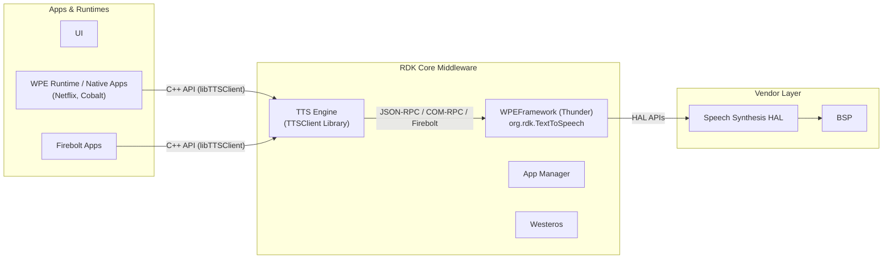
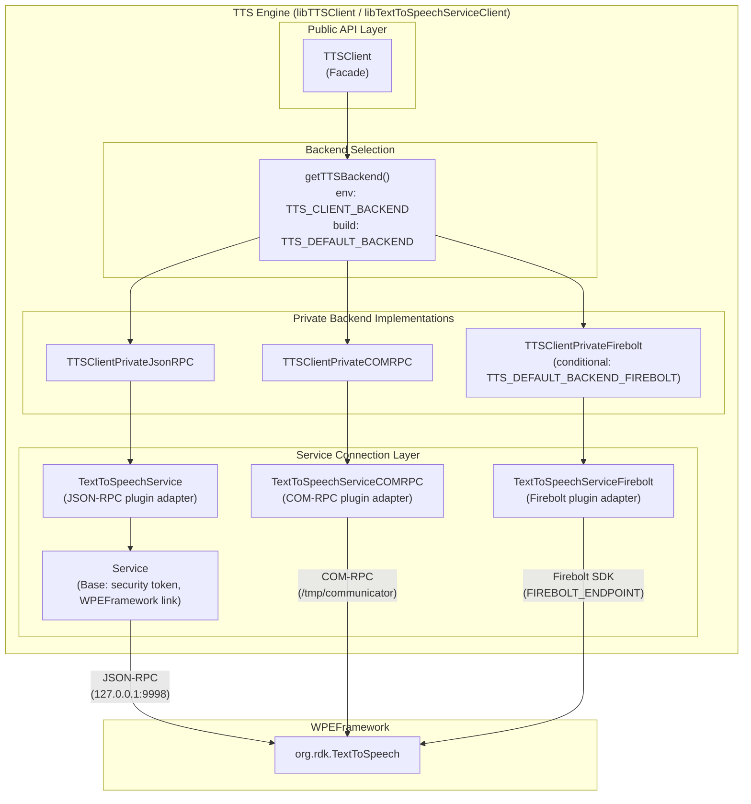
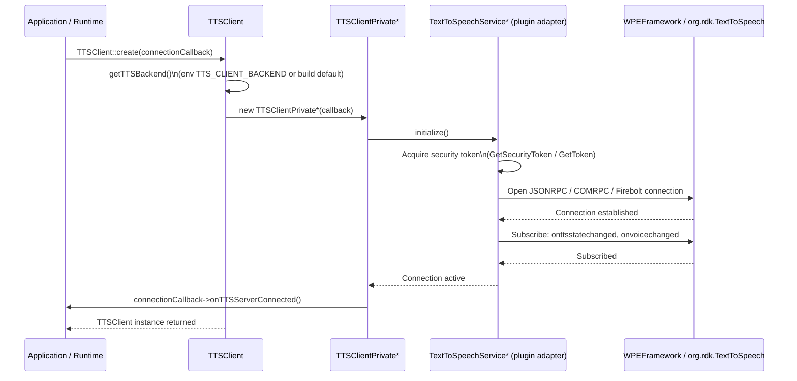
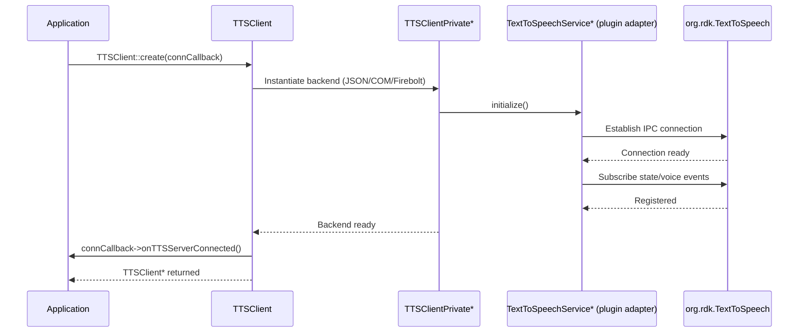
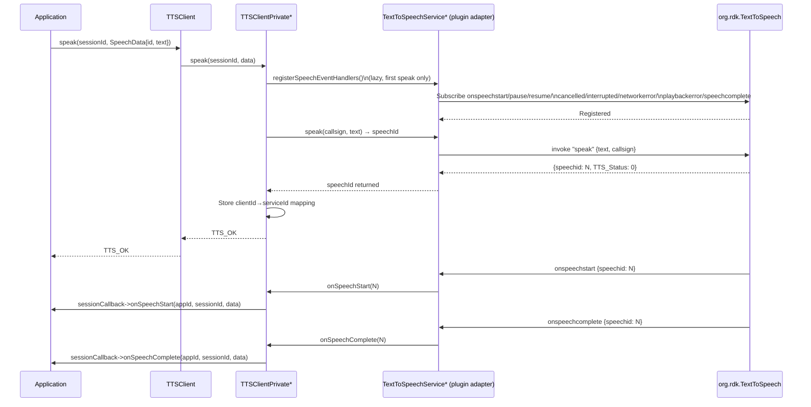
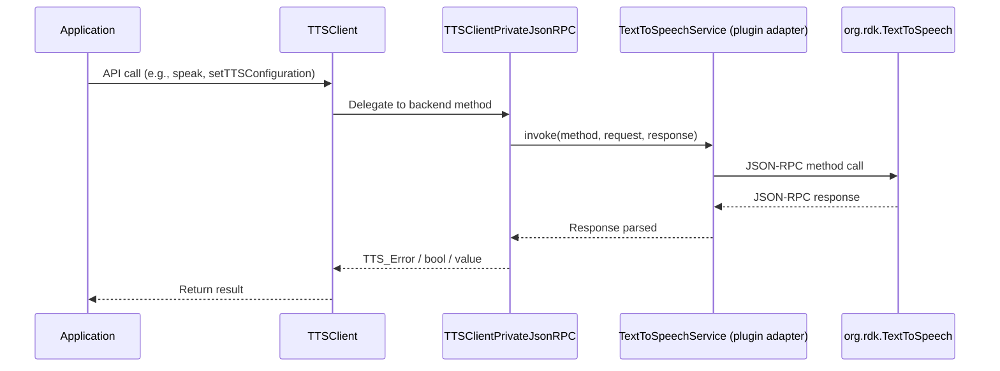
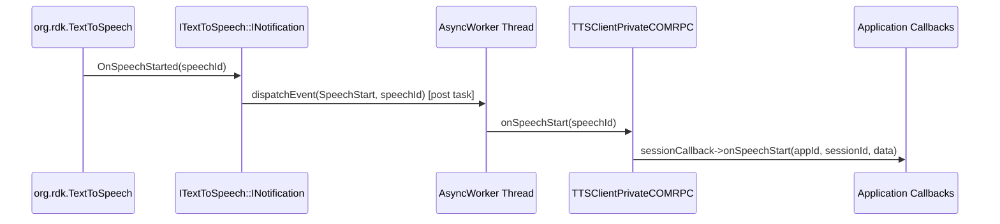

# TTS Engine

TTS Engine is a native C/C++ client library that provides a unified, app-facing interface for Text-to-Speech capabilities in the RDK middleware stack. It abstracts the communication complexity involved in invoking TTS functionality exposed by the underlying Thunder (WPEFramework) plugin, allowing application runtimes and native applications to integrate speech synthesis by linking a single shared library and calling straightforward C++ APIs.

The library supports three interchangeable IPC backends — JSON-RPC, COM-RPC, and Firebolt — and exposes a common API surface regardless of the selected backend.

The TTS Engine client library sits between the application layer and the WPEFramework (Thunder) middleware, bridging app runtimes to the `org.rdk.TextToSpeech` Thunder plugin. The plugin, in turn, interfaces with the platform's speech synthesis HAL.

**Key Features & Responsibilities:**

- **Multi-backend IPC abstraction**: Supports three communication backends — JSON-RPC (default), COM-RPC, and Firebolt — selectable at build time or runtime via environment variable, with a common API surface exposed to callers in all cases.
- **Speech session lifecycle management**: Provides APIs to create and destroy per-application speech sessions, and to track session state (active, idle).
- **Full speech control**: Exposes APIs to initiate speech synthesis (`speak`), pause, resume, and abort ongoing or pending speech requests.
- **TTS configuration management**: Allows reading and writing TTS parameters including endpoint URL, language, voice, volume, and speech rate.
- **Event-driven callback model**: Delivers asynchronous notifications to callers for all speech lifecycle events (start, pause, resume, cancel, interrupt, complete) and error conditions (network error, playback error), as well as TTS enable/disable state and voice change notifications.
- **Security token integration**: Acquires and uses WPEFramework security tokens automatically when communicating with the Thunder plugin, with fallback to unsecured operation when the security utility is absent.

---

## Design

The TTS Engine client library is structured around a Bridge pattern that cleanly separates the public API from the underlying IPC mechanism. The `TTSClient` class is the sole entry point for callers; it owns a pointer to a `TTSClientPrivateInterface` instance selected at creation time based on the configured or detected backend. This design means the calling application is fully insulated from IPC transport details and requires no change when the backend is switched.

The three backend implementations (`TTSClientPrivateJsonRPC`, `TTSClientPrivateCOMRPC`, `TTSClientPrivateFirebolt`) each own a corresponding service layer singleton (`TextToSpeechService`, `TextToSpeechServiceCOMRPC`, `TextToSpeechServiceFirebolt`) responsible for establishing and maintaining the IPC connection to the `org.rdk.TextToSpeech` Thunder plugin. The service singletons handle event subscription, connection monitoring, and per-backend protocol specifics.

Northbound, the library exposes a C++ object-oriented API (`TTSClient`) with callback interfaces (`TTSConnectionCallback`, `TTSSessionCallback`) that callers implement to receive asynchronous events. Southbound, the JSON-RPC backend communicates over the WPEFramework JSONRPC link type to the Thunder endpoint; the COM-RPC backend uses a `RPC::CommunicatorClient` to open an `Exchange::ITextToSpeech` proxy; the Firebolt backend uses the Firebolt SDK's `TextToSpeech` namespace.

IPC endpoint discovery follows a priority chain: the `THUNDER_ACCESS` environment variable is checked first; if absent, `/etc/WPEFramework/config.json` is parsed for binding address and port; the default fallback is `127.0.0.1:9998`. For COM-RPC, the Unix domain socket path is read from the `COMMUNICATOR_PATH` environment variable, defaulting to `/tmp/communicator`. The Firebolt backend requires the `FIREBOLT_ENDPOINT` environment variable to be set.

The library maintains all configuration and operational state in process memory. IPC endpoint discovery occurs at startup via the `THUNDER_ACCESS` environment variable, with `/etc/WPEFramework/config.json` serving as a secondary discovery path, and the selected backend is instantiated once and retained for the lifetime of the `TTSClient` object.

#### Threading Model

- **Threading Architecture**: Multi-threaded
- **Main Thread**: Handles all public API calls — backend selection, session creation, speak/pause/resume/abort, configuration reads and writes.
- **Worker Threads**:
  - _AsyncWorker (COM-RPC backend)_: A dedicated thread in `TextToSpeechServiceCOMRPC` that serializes event dispatch from `Exchange::ITextToSpeech::INotification` callbacks to registered client callbacks. This ensures notification callbacks do not execute on the COM-RPC transport thread.
  - _AsyncWorker (Service base, JSON-RPC backend)_: A task-queue thread used for plugin reactivation and crash recovery tasks on the JSON-RPC path.
- **Synchronization**: `std::mutex` guards the speech request ID maps (`SpeechRequestMap`, `COMRPCSpeechRequestMap`, `FireboltSpeechRequestMap`) and client registration lists. `std::condition_variable` is used in the COM-RPC `AsyncWorker` to sleep the worker thread when the task list is empty. `std::once_flag` ensures the Thunder plugin state-change handler is installed only once across all `Service` instances.
- **Async / Event Dispatch**: In the COM-RPC backend, incoming `INotification` callbacks post a task to the `AsyncWorker` queue; the worker thread then invokes the registered client callbacks. In the JSON-RPC backend, event callbacks are invoked on the WPEFramework JSONRPC callback thread.

### Prerequisites and Dependencies

#### Platform and Integration Requirements

- **Build Dependencies**: `wpeframework`, `wpeframework-clientlibraries`, `gstreamer1.0-plugins-base`, `rdk-logger`, `breakpad` (when `ENABLE_BREAKPAD=1`), `FireboltSDK` (when Firebolt backend is selected).
- **Plugin Dependencies**: `org.rdk.TextToSpeech` must be registered and active in the Thunder framework before `TTSClient::create()` can establish a connection. The library connects to the plugin in its active state; the JSON-RPC path passes `activateIfRequired=false`, relying on the Thunder framework to have the plugin active prior to library initialization.
- **Device Services / HAL**: All hardware-level speech synthesis interaction is managed by the `org.rdk.TextToSpeech` Thunder plugin. This library communicates at the plugin API boundary.
- **Systemd Services**: WPEFramework must be running and the `org.rdk.TextToSpeech` plugin must be loaded.
- **Configuration Files**: `/etc/WPEFramework/config.json` — used as a fallback to determine the Thunder RPC endpoint (`binding` + `port`).
- **Startup Order**: The TTS Engine client library is a shared library linked into the calling application process. It connects to the already-running Thunder process on demand.

---

### Component State Flow

#### Initialization to Active State

The library does not have a daemon lifecycle; it initializes per-process when `TTSClient::create()` is called. The sequence below describes the initialization path.

#### Runtime State Changes

After initialization, the client enters active state and responds to both app-driven API calls and inbound event notifications from the Thunder plugin.

**State Change Triggers:**

- When the `org.rdk.TextToSpeech` plugin fires `onttsstatechanged`, the service layer dispatches `onTTSStateChanged(bool)` to all registered `TTSConnectionCallback` instances.
- When the voice is changed on the plugin side, `onVoiceChanged(string)` is delivered.
- If the Thunder plugin deactivates (detected via the WPEFramework plugin state-change handler), registered clients receive `onTTSServerClosed()`.

**Context Switching Scenarios:**

- If `TTS_USE_THUNDER_CLIENT` environment variable is set at process start, the backend is forced to JSON-RPC regardless of build-time or `TTS_CLIENT_BACKEND` setting.
- If the Firebolt backend is selected but `FIREBOLT_ENDPOINT` is not set, `TTSClient::create()` returns `nullptr` and the application must handle the null case.

---

### Call Flows

#### Initialization Call Flow

#### Request Processing Call Flow

---

## Internal Modules

| Module / Class                                                             | Description                                                                                                                                                                                                                | Key Files                                                                             |
| -------------------------------------------------------------------------- | -------------------------------------------------------------------------------------------------------------------------------------------------------------------------------------------------------------------------- | ------------------------------------------------------------------------------------- |
| `TTSClient`                                                                | Public API facade. Owns a `TTSClientPrivateInterface*` selected at creation time. Delegates all API calls to the private implementation.                                                                                   | `TTSClient.cpp`, `TTSClient.h`                                                        |
| `TTSClientPrivateInterface`                                                | Abstract interface defining the full TTS API contract (global, session, resource, speak APIs) implemented by each backend.                                                                                                 | `TTSClientPrivateInterface.h`                                                         |
| `TTSClientPrivateJsonRPC`                                                  | JSON-RPC backend. Communicates with `org.rdk.TextToSpeech` by invoking JSON-RPC methods via the `TextToSpeechService` singleton.                                                                                         | `TTSClientPrivateJsonRPC.cpp`, `TTSClientPrivateJsonRPC.h`                            |
| `TTSClientPrivateCOMRPC`                                                   | COM-RPC backend. Communicates via the `Exchange::ITextToSpeech` proxy through the `TextToSpeechServiceCOMRPC` singleton.                                                                                                   | `TTSClientPrivateCOMRPC.cpp`, `TTSClientPrivateCOMRPC.h`                              |
| `TTSClientPrivateFirebolt`                                                 | Firebolt backend (conditionally compiled). Communicates via the Firebolt SDK's `TextToSpeech` namespace through `TextToSpeechServiceFirebolt`.                                                                             | `TTSClientPrivateFirebolt.cpp`, `TTSClientPrivateFirebolt.h`                          |
| `TextToSpeechService`                                                      | JSON-RPC service connection manager. Maintains the `WPEFrameworkPlugin` link to `org.rdk.TextToSpeech`, manages event subscriptions, and dispatches events to registered clients. Singleton.                             | `TextToSpeechService.cpp`, `TextToSpeechService.h`                                    |
| `TextToSpeechServiceCOMRPC`                                                | COM-RPC service connection manager. Opens `Exchange::ITextToSpeech` proxy via `RPC::CommunicatorClient`. Registers `INotification` for event delivery. Contains an `AsyncWorker` for off-thread event dispatch. Singleton. | `TextToSpeechServiceCOMRPC.cpp`, `TextToSpeechServiceCOMRPC.h`                        |
| `TextToSpeechServiceFirebolt`                                              | Firebolt service connection manager. Manages Firebolt SDK connection lifecycle and event subscriptions (conditionally compiled). Singleton.                                                                                | `TextToSpeechServiceFirebolt.cpp`, `TextToSpeechServiceFirebolt.h`                    |
| `Service`                                                                  | Base class for JSON-RPC plugin connection. Handles WPEFramework endpoint discovery, security token acquisition, plugin state-change monitoring, event subscription/unsubscription, and async crash-recovery task queuing.  | `Service.cpp`, `Service.h`                                                            |
| `SpeechRequestMap` / `COMRPCSpeechRequestMap` / `FireboltSpeechRequestMap` | Thread-safe bidirectional maps between caller-assigned speech IDs and service-assigned speech IDs. One per backend implementation.                                                                                         | `TTSClientPrivateJsonRPC.h`, `TTSClientPrivateCOMRPC.h`, `TTSClientPrivateFirebolt.h` |
| `logger`                                                                   | Logging utilities. Provides `TTSLOG_INFO`, `TTSLOG_WARNING`, `TTSLOG_ERROR`, `TTSLOG_VERBOSE`, `TTSLOG_TRACE`, `TTSLOG_FATAL` macros. Supports stdout and RDK Logger backends.                                             | `logger.cpp`, `logger.h`                                                              |

---

## Component Interactions

### Interaction Matrix

| Target Component / Layer | Interaction Purpose                                                                                            | Key APIs / Topics                                                                                                                                                                                           |
| ------------------------ | -------------------------------------------------------------------------------------------------------------- | ----------------------------------------------------------------------------------------------------------------------------------------------------------------------------------------------------------- |
| **Plugins**              |                                                                                                                |                                                                                                                                                                                                             |
| `org.rdk.TextToSpeech` | All TTS operations — enable/disable, configuration, voice listing, speech synthesis and control, state queries | JSON-RPC: `enabletts`, `listvoices`, `setttsconfiguration`, `getttsconfiguration`, `isttsenabled`, `speak`, `pause`, `resume`, `cancel`, `isspeaking`, `getspeechstate`; COM-RPC: `Exchange::ITextToSpeech` |
| **WPEFramework Core**    | Plugin state-change notifications (activation / deactivation)                                                  | `OnPluginStateChange`, JSONRPC controller subscription                                                                                                                                                      |
| **Firebolt SDK**         | Firebolt backend speech operations and event subscriptions                                                     | `Firebolt::TextToSpeech::ITextToSpeech` (conditional)                                                                                                                                                       |
| **Security Agent**       | Acquire security tokens for authenticated Thunder communication                                                | `GetSecurityToken()`, `GetToken()` via `securityagent.h`                                                                                                                                                    |

### Events Published

Events received from `org.rdk.TextToSpeech` are relayed to registered application callback objects. The table below lists each event, its origin, and the corresponding callback method invoked on the caller.

| Event Name            | Source                   | Delivered to Caller via                                               |
| --------------------- | ------------------------ | --------------------------------------------------------------------- |
| `onttsstatechanged`   | `org.rdk.TextToSpeech` | `TTSConnectionCallback::onTTSStateChanged(bool)`                      |
| `onvoicechanged`      | `org.rdk.TextToSpeech` | `TTSConnectionCallback::onVoiceChanged(string)`                       |
| `onspeechstart`       | `org.rdk.TextToSpeech` | `TTSSessionCallback::onSpeechStart(appId, sessionId, SpeechData)`     |
| `onspeechpause`       | `org.rdk.TextToSpeech` | `TTSSessionCallback::onSpeechPause(appId, sessionId, speechId)`       |
| `onspeechresume`      | `org.rdk.TextToSpeech` | `TTSSessionCallback::onSpeechResume(appId, sessionId, speechId)`      |
| `onspeechcancelled`   | `org.rdk.TextToSpeech` | `TTSSessionCallback::onSpeechCancelled(appId, sessionId, speechId)`   |
| `onspeechinterrupted` | `org.rdk.TextToSpeech` | `TTSSessionCallback::onSpeechInterrupted(appId, sessionId, speechId)` |
| `onnetworkerror`      | `org.rdk.TextToSpeech` | `TTSSessionCallback::onNetworkError(appId, sessionId, speechId)`      |
| `onplaybackerror`     | `org.rdk.TextToSpeech` | `TTSSessionCallback::onPlaybackError(appId, sessionId, speechId)`     |
| `onspeechcomplete`    | `org.rdk.TextToSpeech` | `TTSSessionCallback::onSpeechComplete(appId, sessionId, SpeechData)`  |

### IPC Flow Patterns

**Primary Request / Response Flow (JSON-RPC backend):**

**Event Notification Flow (COM-RPC backend):**

---

## Implementation Details

### Major HAL APIs Integration

| Thunder API / Method                              | Backend  | Purpose                                                     | Implementation File             |
| ------------------------------------------------- | -------- | ----------------------------------------------------------- | ------------------------------- |
| `enabletts`                                       | JSON-RPC | Enable or disable TTS globally                              | `TTSClientPrivateJsonRPC.cpp`   |
| `listvoices`                                      | JSON-RPC | Retrieve available voice list for a language                | `TTSClientPrivateJsonRPC.cpp`   |
| `setttsconfiguration`                             | JSON-RPC | Set TTS endpoint, language, voice, volume, rate             | `TTSClientPrivateJsonRPC.cpp`   |
| `getttsconfiguration`                             | JSON-RPC | Retrieve current TTS configuration                          | `TTSClientPrivateJsonRPC.cpp`   |
| `isttsenabled`                                    | JSON-RPC | Query whether TTS is currently enabled                      | `TTSClientPrivateJsonRPC.cpp`   |
| `speak`                                           | JSON-RPC | Submit text for speech synthesis; returns service speech ID | `TTSClientPrivateJsonRPC.cpp`   |
| `pause`                                           | JSON-RPC | Pause the ongoing speech                                    | `TTSClientPrivateJsonRPC.cpp`   |
| `resume`                                          | JSON-RPC | Resume a paused speech                                      | `TTSClientPrivateJsonRPC.cpp`   |
| `cancel`                                          | JSON-RPC | Abort an ongoing speech                                     | `TTSClientPrivateJsonRPC.cpp`   |
| `isspeaking`                                      | JSON-RPC | Query whether speech is currently in progress               | `TTSClientPrivateJsonRPC.cpp`   |
| `getspeechstate`                                  | JSON-RPC | Query state of a specific speech by ID                      | `TTSClientPrivateJsonRPC.cpp`   |
| `Exchange::ITextToSpeech::enableTTS()`            | COM-RPC  | Enable or disable TTS globally                              | `TTSClientPrivateCOMRPC.cpp`    |
| `Exchange::ITextToSpeech::setConfiguration()`     | COM-RPC  | Set TTS configuration                                       | `TTSClientPrivateCOMRPC.cpp`    |
| `Exchange::ITextToSpeech::getConfiguration()`     | COM-RPC  | Get TTS configuration                                       | `TTSClientPrivateCOMRPC.cpp`    |
| `Exchange::ITextToSpeech::speak()`                | COM-RPC  | Submit text for synthesis                                   | `TTSClientPrivateCOMRPC.cpp`    |
| `Exchange::ITextToSpeech::cancel()`               | COM-RPC  | Abort ongoing speech                                        | `TextToSpeechServiceCOMRPC.cpp` |
| `Exchange::ITextToSpeech::pause()`                | COM-RPC  | Pause ongoing speech                                        | `TextToSpeechServiceCOMRPC.cpp` |
| `Exchange::ITextToSpeech::resume()`               | COM-RPC  | Resume paused speech                                        | `TextToSpeechServiceCOMRPC.cpp` |
| `Exchange::ITextToSpeech::RegisterWithCallsign()` | COM-RPC  | Register notification listener with per-client callsign     | `TextToSpeechServiceCOMRPC.cpp` |

### Key Implementation Logic

- **State / Lifecycle Management**: Backend selection and client instantiation are protected by a `std::mutex` inside `TTSClient::create()`. The `m_firstQuery` flag in each private backend ensures `isTTSEnabled` always performs a live fetch on the first call, caching the result for subsequent calls unless `forcefetch=true` is passed.
  - Facade: `TTSClient.cpp`
  - Backend factory logic: `TTSClient.cpp` (`getTTSBackend`, `isBackendValid`)
  - Per-backend initialization: `TTSClientPrivateCOMRPC.cpp`, `TTSClientPrivateJsonRPC.cpp`, `TTSClientPrivateFirebolt.cpp`

- **Speech ID Mapping**: Each backend maintains a bidirectional map between the speech ID assigned by the caller (`SpeechData::id`) and the speech ID returned by the Thunder plugin service. This mapping is accessed under `std::mutex` and is used to translate inbound event speech IDs back to the caller's IDs.
  - Implemented in `SpeechRequestMap` (JSON-RPC), `COMRPCSpeechRequestMap` (COM-RPC), `FireboltSpeechRequestMap` (Firebolt).

- **Event Processing**: In the JSON-RPC path, event callbacks are invoked on the WPEFramework JSONRPC callback thread and dispatched synchronously to the client list under `std::mutex`. In the COM-RPC path, `INotification` callbacks post a lambda task to `AsyncWorker`, which dispatches on a dedicated worker thread. This prevents blocking the COM transport thread.
  - JSON-RPC dispatch: `TextToSpeechService::dispatchEvent()` in `TextToSpeechService.cpp`
  - COM-RPC dispatch: `TextToSpeechServiceCOMRPC::dispatchEvent()` and `dispatchEventOnWorker()` in `TextToSpeechServiceCOMRPC.cpp`

- **Error Handling Strategy**: All Thunder API invocations check the return value. On failure, a `TTSLOG_ERROR` is emitted and the corresponding `TTS_Error` code (`TTS_FAIL`, `TTS_NOT_ENABLED`) is returned to the caller. A guard macro `CHECK_CONNECTION_RETURN_ON_FAIL` is used throughout to short-circuit API calls when no active connection is present. No automatic retry logic is implemented in the client layer.

- **Logging & Diagnostics**: The `TTSLOG_*` macros resolve to `TTS::log()` which writes to stdout by default. If `USE_RDK_LOGGER` is defined at build time, log calls are routed through the RDK logger infrastructure. Log verbosity levels available: `FATAL`, `ERROR`, `WARNING`, `INFO`, `VERBOSE`, `TRACE`.
  - Logger module name: `ttsengine` (set via `MODULE_NAME` in `Service.h` and `TextToSpeechServiceCOMRPC.h`)
  - Key log points: backend selection, connection establishment, `speak` request/response, speech ID mapping, event dispatch, error paths.

---

## Configuration

### Key Configuration Files

| Configuration File              | Purpose                                                       | Override Mechanism                                          |
| ------------------------------- | ------------------------------------------------------------- | ----------------------------------------------------------- |
| `/etc/WPEFramework/config.json` | Fallback source for Thunder RPC endpoint (`binding` + `port`) | Set `THUNDER_ACCESS` environment variable to skip file read |

### Key Configuration Parameters

| Parameter                | Type       | Default             | Description                                                                                                                                                            |
| ------------------------ | ---------- | ------------------- | ---------------------------------------------------------------------------------------------------------------------------------------------------------------------- |
| `TTS_CLIENT_BACKEND`     | env string | (build default)     | Selects the active IPC backend at runtime. Accepted values: `comrpc`, `firebolt`. When absent or set to an unrecognized value, the JSON-RPC backend is used.           |
| `TTS_USE_THUNDER_CLIENT` | env string | unset               | Legacy flag. When set (any value), forces JSON-RPC backend regardless of `TTS_CLIENT_BACKEND`.                                                                         |
| `THUNDER_ACCESS`         | env string | `127.0.0.1:9998`    | Thunder JSON-RPC endpoint address and port.                                                                                                                            |
| `COMMUNICATOR_PATH`      | env string | `/tmp/communicator` | Unix domain socket path for COM-RPC communication.                                                                                                                     |
| `FIREBOLT_ENDPOINT`      | env string | unset               | Firebolt SDK connection endpoint. Required when the Firebolt backend is selected.                                                                                      |
| `CLIENT_IDENTIFIER`      | env string | unset               | Callsign string identifying the calling application. Used when registering speech event handlers in COM-RPC and JSON-RPC backends. Comma-separated suffix is stripped. |

The following flags are set at build time via CMake or the Yocto recipe and affect which code paths and features are compiled in.

| CMake / Build Flag       | Default    | Description                                                                                                                                                                                                         |
| ------------------------ | ---------- | ------------------------------------------------------------------------------------------------------------------------------------------------------------------------------------------------------------------- |
| `ENABLE_BREAKPAD`        | OFF        | Enables Breakpad crash reporting integration; defines `USE_BREAKPAD` and links `breakpadwrapper`. Set to `1` by the Yocto recipe.                                                                                   |
| `USE_THUNDER_R4`         | OFF        | Enables Thunder R4 API compatibility paths. Set automatically when `wpe_r4_4` or `wpe_r4` DISTRO_FEATURES are present.                                                                                              |
| `TTS_DEFAULT_BACKEND`    | (JSON-RPC) | Sets the compile-time default backend. Set to `comrpc` or `firebolt` to change default. When set to `firebolt`, also defines `TTS_DEFAULT_BACKEND_FIREBOLT` and compiles in Firebolt-specific sources and SDK link. |
| `SECURITY_TOKEN_ENABLED` | 1          | Set to `0` when `WPEFrameworkSecurityUtil` is unavailable at build time, switching to unauthenticated token paths.                                                                                                  |

### Configuration Persistence

Configuration changes made via `setTTSConfiguration()` are forwarded to the `org.rdk.TextToSpeech` plugin at runtime. Persistence of those changes across reboots is governed by the plugin's own implementation.
