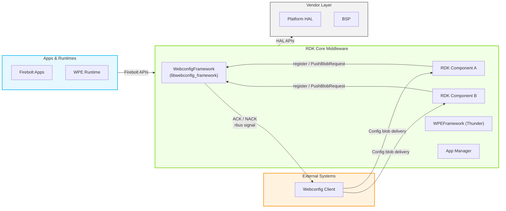
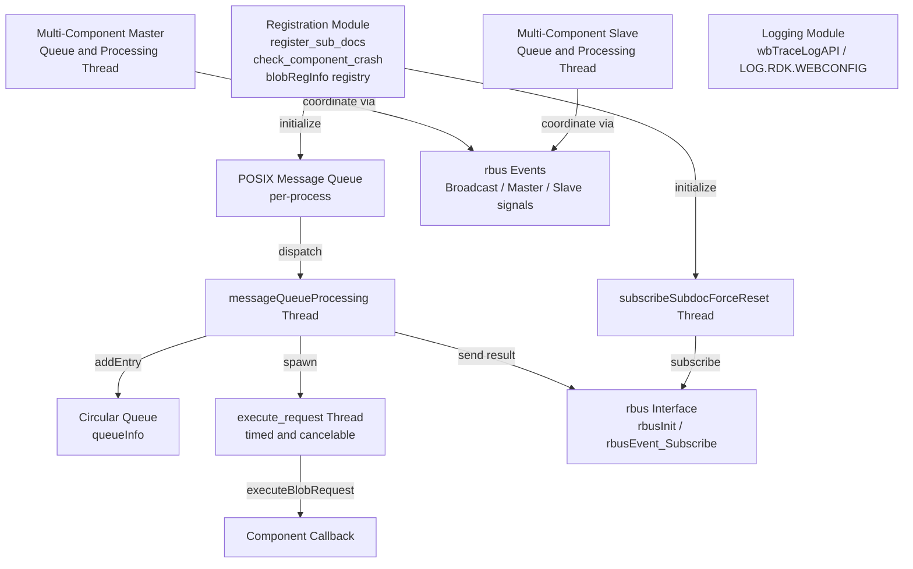
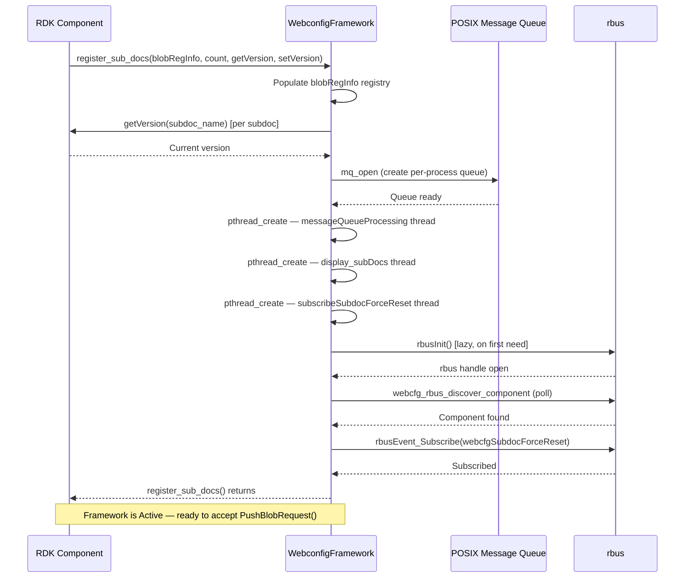
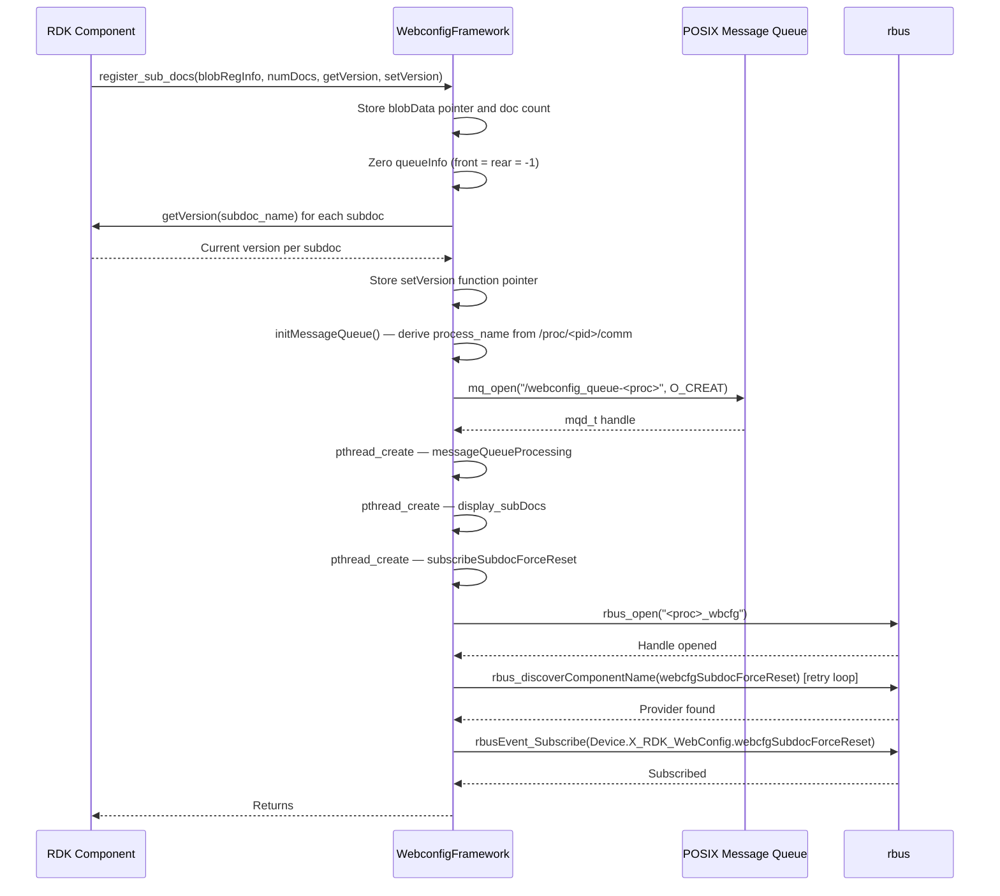
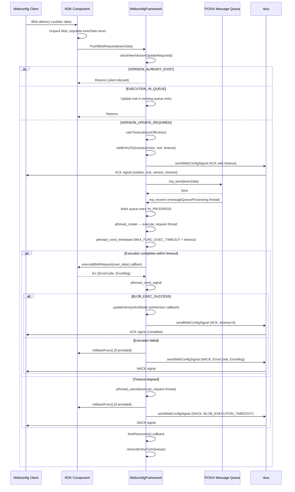
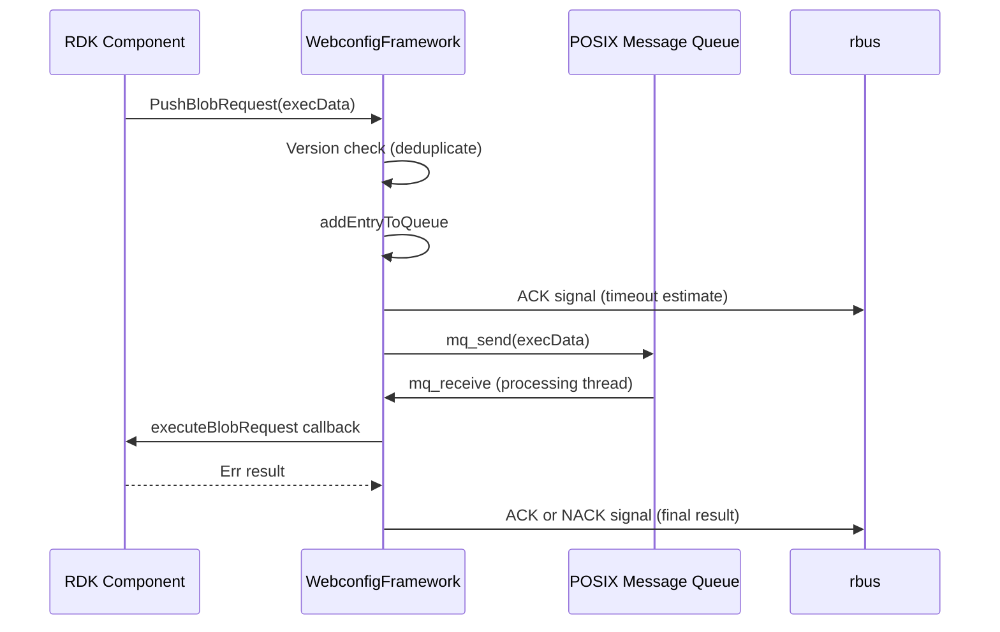
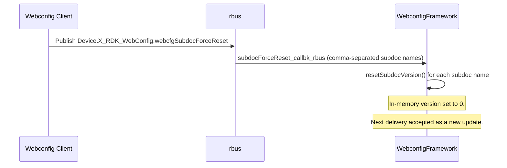
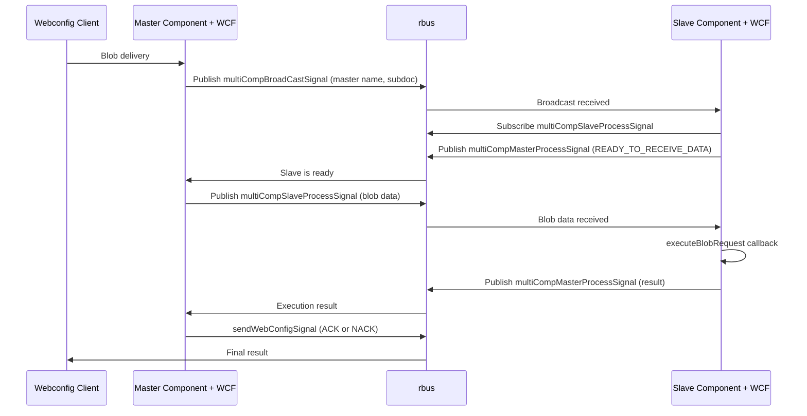

# WebconfigFramework

WebconfigFramework is a shared C library (`libwebconfig_framework`) that provides RDK middleware components with a standardized interface for registering configuration sub-documents and handling binary configuration blob updates delivered by a webconfig client. The library manages the full lifecycle of a configuration request — from initial sub-document registration and version tracking, through queued execution with timeout enforcement, to acknowledgement and rollback — without requiring each consuming component to implement these mechanisms independently.

As a device-side library, WebconfigFramework bridges cloud-driven or management-plane configuration delivery with the internal processing logic of individual RDK middleware components. A webconfig client pushes encoded configuration payloads (blobs) targeted at specific sub-documents owned by device components. Each component that participates in this model links against `libwebconfig_framework`, registers the sub-documents it manages, and provides callback function pointers to execute, roll back, and free blob data. The framework takes responsibility for queuing, scheduling, timeout management, and reporting results back to the webconfig client.

The framework is platform-agnostic and designed to support deployments across both video streaming and broadband gateway devices. Its design accommodates single-component blob execution and, through the optional multi-component execution model, coordinated blob delivery across a master component and one or more slave components running in separate processes.



**Key Features & Responsibilities:**

- **Sub-document Registration**: Components register the configuration sub-documents they own during initialization, providing the framework with the sub-document names, current versions, and getter/setter callbacks for version persistence.
- **Version Deduplication**: Before queuing any blob request, the framework checks whether the incoming version already exists or is already pending execution. Duplicate requests are discarded, and transaction IDs are updated in place rather than re-queuing.
- **Request Queuing**: Accepted blob requests are placed in a bounded circular queue and dispatched via a POSIX message queue to a dedicated processing thread, decoupling the receiving component from the execution path.
- **Timed Execution with Timeout Enforcement**: Each blob execution runs in a cancelable worker thread. The framework applies a calculated timeout (component-provided or default) and cancels the thread upon expiry, sending a NACK to the webconfig client.
- **Rollback Support**: If blob execution fails (other than a validation-only failure), the framework invokes the component-supplied rollback callback to restore the previous configuration state.
- **ACK/NACK Signaling**: The framework signals the webconfig client with ACK (success or pending with estimated timeout) or NACK (failure with error code and message) via rbus signals.
- **Crash Recovery Notification**: Components can call `check_component_crash()` at startup. The framework detects whether the component is recovering from a crash by checking for the presence of a designated init-file and notifies the webconfig client of current sub-document versions accordingly.
- **Force-Reset Event Subscription**: The framework subscribes to the `Device.X_RDK_WebConfig.webcfgSubdocForceReset` rbus event. When received, it resets the stored versions of the specified sub-documents, causing the webconfig client to re-apply those configurations on the next sync.
- **Multi-Component Coordination**: When enabled, the framework supports a master/slave execution model across processes. A master component coordinates blob data delivery to slave components using rbus events, collects their execution results, and reports a consolidated outcome to the webconfig client.

---

## Design

WebconfigFramework is designed as a thin, self-contained library that imposes minimal coupling on the consuming component. It initializes its own internal threads and POSIX message queues at registration time, requiring no daemon lifecycle management from the component. The framework operates around a producer-consumer model: the component acts as producer by calling `PushBlobRequest()` after receiving and parsing a blob, and the framework's internal processing thread acts as consumer by dispatching execution to a component-supplied callback with a bounded timeout.

Version management is central to the design. The framework maintains a registry of all registered sub-documents with their current applied versions. When a new blob arrives, the version is compared against the registered version and against any pending queue entries. This three-way check — already applied, in queue, or new — prevents redundant execution and ensures the webconfig client receives meaningful feedback for every request.

The northbound interface toward the webconfig client is handled exclusively through rbus signals. The framework opens a dedicated rbus connection at first use and sends structured signal strings encoding sub-document name, transaction ID, version, result type (ACK/NACK), timeout, error code, and error message. The framework also subscribes to force-reset events over rbus, enabling the webconfig client to invalidate previously applied versions and trigger re-delivery.

The southbound interface toward the platform is entirely callback-driven. The framework invokes function pointers provided by the component at registration time — `executeBlobRequest`, `rollbackFunc`, `calcTimeout`, and `freeResources` — keeping the library fully portable across device categories with no platform-specific code paths embedded within it.

Version state is managed through the `getVersion` and `setVersion` callbacks supplied by the consuming component at `register_sub_docs()`. The framework maintains in-memory versions in the `blobRegInfo` array and calls the component's setter after each successful blob execution.

The IPC mechanism selection is uniform across all interactions: rbus is used for all external signaling (ACK/NACK to webconfig client, force-reset subscription, and multi-component event delivery). POSIX message queues serve only as an internal, intra-process dispatch channel between the `PushBlobRequest()` API call and the `messageQueueProcessing` worker thread.



#### Threading Model

- **Threading Architecture**: Multi-threaded
- **`messageQueueProcessing` Thread**: Blocks on `mq_receive()` waiting for blob requests posted by `PushBlobRequest()`. Upon receipt, it updates queue state, spawns an `execute_request` thread, and waits on a timed condition variable (`pthread_cond_timedwait`). It owns the execution mutex (`webconfig_exec`) and the queue access mutex (`queue_access`).
- **`execute_request` Thread**: Created per blob request with `PTHREAD_CANCEL_ASYNCHRONOUS`. Invokes the component's `executeBlobRequest` callback and signals the `messageQueueProcessing` thread via `pthread_cond_signal` on completion. Cancelled by the processing thread if the timeout elapses.
- **`subscribeSubdocForceReset` Thread**: Detached thread that polls for the webconfig component's rbus presence using `webcfg_rbus_discover_component()` and then subscribes to `Device.X_RDK_WebConfig.webcfgSubdocForceReset`. Runs once at registration and exits after subscribing.
- **`display_subDocs` Thread**: Detached diagnostic thread that activates only when `/tmp/webconfig_dbg` exists. Logs registered sub-document names, versions, and queue contents at a configurable interval for a configurable number of iterations.
- **Multi-component Threads** (when `WBCFG_MULTI_COMP_SUPPORT` is enabled):
  - _`messageQueueProcessingMultiComp`_: Master-side queue processing thread that coordinates blob delivery to slave components and collects their results.
  - _`messageQueueProcessingMultiCompSlave`_: Slave-side queue processing thread that receives and executes blob data forwarded by the master.
  - _`event_register_slave`_: Per-subdoc thread that registers slave-side rbus events and signals readiness to the master.
- **Synchronization**: `webconfig_exec` mutex guards blob execution; `queue_access` mutex protects the circular queue; `reg_subdoc` mutex protects the `blobRegInfo` registry; `webcfg_rbus_enable` mutex guards the one-time rbus initialization. Timed waits use `CLOCK_MONOTONIC` via `pthread_condattr_setclock`.
- **Async / Event Dispatch**: rbus event callbacks (`subdocForceReset_callbk_rbus`, `multiComp_callbk_rbus`) are invoked on the rbus callback thread. The multi-component callbacks signal processing threads via `pthread_cond_signal` to keep callback handlers non-blocking.

### Prerequisites and Dependencies

#### Platform and Integration Requirements

- **Build Dependencies**: `rbus` (runtime bus library, required at link time); `libpthread`, `librt`, `libz` (linked via `libwebconfig_framework_la_LDFLAGS`). When `CCSP_SUPPORT_ENABLED` is set: `libccsp_common`. When the `safec` distro feature is present: `safec` (safe string library, added via Yocto recipe conditional).
- **Startup Order**: The library initializes fully within the calling component's process at `register_sub_docs()` time. There is no external daemon or service ordering requirement.

---

### Component State Flow

#### Initialization to Active State

The framework transitions through the following states during initialization when a component calls `register_sub_docs()`:

**Initializing** (populate `blobRegInfo` registry, zero the circular queue) → **Hydrating** (invoke `getVersion` callbacks to load current applied versions into the registry) → **QueueReady** (create POSIX message queue and spawn `messageQueueProcessing` thread) → **Subscribing** (spawn `subscribeSubdocForceReset` thread to establish rbus force-reset subscription) → **Active** (ready to accept `PushBlobRequest()` calls and process blob execution).



#### Runtime State Changes

**State Change Triggers:**

- A blob delivered with a version matching the currently registered version is silently discarded (`VERSION_ALREADY_EXIST`). The exception is the `hotspot` sub-document when the version-ignore override file (`/tmp/hotspot_version_ignore`) is present, in which case the framework treats the request as a new version update.
- A blob with the same version already pending in the queue results in only the transaction ID being updated in the existing queue entry.
- If `check_component_crash()` is called at startup and the init-file is present (indicating a previous crash), the framework reports all registered sub-document versions to the webconfig client with a `COMPONENT_CRASH_EVENT` tag; if absent, it sends `COMPONENT_INIT_EVENT`.
- Upon receiving `Device.X_RDK_WebConfig.webcfgSubdocForceReset`, the framework calls `resetSubdocVersion()` for each comma-separated sub-document name in the event payload, zeroing the in-memory version so the next delivery of any version is treated as `VERSION_UPDATE_REQUIRED`.

**Context Switching Scenarios:**

- If execution times out, the worker thread is cancelled, `BLOB_EXECUTION_TIMEDOUT` NACK is sent to the webconfig client, and the optional rollback function is invoked.
- If the POSIX mqueue is full (queue depth `QUEUE_SIZE = 10` reached), the new request is rejected with a `QUEUE_PUSH_FAILED` NACK immediately.
- In multi-component mode, a slave component that exceeds `MAX_RESPONSE_TIME` (150 seconds) causes the master to mark the execution as timed out and send a `SLAVE_RESPONSE_TIME_OUT` NACK to the webconfig client.

---

### Call Flows

#### Initialization Call Flow



#### Request Processing Call Flow

The component receives blob data from the webconfig client via its own delivery channel, unpacks it, and calls `PushBlobRequest()` with a populated `execData` structure containing the sub-document name, transaction ID, version, entry count, parsed user data, and callback pointers. The framework performs version checks, queues the request, and notifies the webconfig client of the estimated execution time before invoking the component's execution handler.



---

## Internal Modules

| Module / Class                   | Description                                                                                                                                                                                                                                                                                                                    | Key Files                                                |
| -------------------------------- | ------------------------------------------------------------------------------------------------------------------------------------------------------------------------------------------------------------------------------------------------------------------------------------------------------------------------------ | -------------------------------------------------------- |
| `webconfig_framework`            | Core registration and execution module. Implements `register_sub_docs()`, `check_component_crash()`, `PushBlobRequest()`, version management, the circular queue, POSIX message queue setup, `messageQueueProcessing` thread, `execute_request` thread, `send_ACK()`, `send_NACK()`, and the debug `display_subDocs` thread.   | `webconfig_framework.c`, `webconfig_framework.h`         |
| `webconfig_bus_interface`        | rbus integration module. Implements rbus handle initialization, component discovery polling, `subscribeSubdocForceReset` thread, and the `subdocForceReset_callbk_rbus` event callback. Also provides multi-component rbus event registration, subscription, and publish functions when `WBCFG_MULTI_COMP_SUPPORT` is enabled. | `webconfig_bus_interface.c`, `webconfig_bus_interface.h` |
| `webconfig_framework_multi_comp` | Multi-component coordination module. Implements master and slave message queue processing threads, broadcast/master/slave signal callbacks, execution result exchange between master and slave processes, rollback coordination, and timeout exchange. Compiled only when `WBCFG_MULTI_COMP_SUPPORT` is defined.               | `webconfig_framework_multi_comp.c`                       |
| `webconfig_logging`              | Logging abstraction module. Provides `wbTraceLogAPI()` as a `printf`-based fallback logger, active when the build is configured with neither CCSP tracing nor the camera-platform logging backend.                                                                                                                             | `webconfig_logging.c`, `webconfig_logging.h`             |
| `webconfig_err`                  | Error code definitions. Defines numeric error codes in the range 300–950 covering execution states, queue failures, validation failures, and sub-system-specific failure categories.                                                                                                                                           | `webconfig_err.h`                                        |

---

---

## Component Interactions

WebconfigFramework interacts externally with the rbus daemon for all outbound signaling and event subscriptions. All platform-specific operations are performed exclusively by the consuming component through its registered callbacks.

### Interaction Matrix

| Target Component / Layer | Interaction Purpose                                                                                                | Key APIs / Topics                                                                                                             |
| ------------------------ | ------------------------------------------------------------------------------------------------------------------ | ----------------------------------------------------------------------------------------------------------------------------- |
| **External Systems**     |                                                                                                                    |                                                                                                                               |
| Webconfig Client         | Deliver execution outcome (success / failure) and estimated timeout for each blob request                          | `sendWebConfigSignal()` encoding `ACK` / `NACK` with sub-document name, txid, version, timeout, error code, and error message |
| Webconfig Client         | Notify current sub-document versions at component startup or after crash recovery                                  | `notifyVersion_to_Webconfig()` → `sendWebConfigSignal()` with `COMPONENT_INIT_EVENT` or `COMPONENT_CRASH_EVENT`               |
| **Bus / IPC**            |                                                                                                                    |                                                                                                                               |
| rbus                     | All external IPC — outbound signals to webconfig client, inbound force-reset event, multi-component event delivery | `rbus_open`, `rbusEvent_Subscribe`, `rbus_discoverComponentName`, `rbusEvent_Publish`, `rbusEvent_Unsubscribe`                |
| POSIX Message Queue      | Intra-process dispatch of blob requests from `PushBlobRequest()` to `messageQueueProcessing` thread                | `mq_open`, `mq_send`, `mq_receive`, `mq_unlink` — queue named `/webconfig_queue-<process_name>`                               |
| **Consuming Component**  |                                                                                                                    |                                                                                                                               |
| RDK Component            | Receive blob execution request and return error code/message                                                       | `executeBlobRequest(void*)` → `pErr` callback                                                                                 |
| RDK Component            | Restore previous configuration state on execution failure                                                          | `rollbackFunc()` callback                                                                                                     |
| RDK Component            | Calculate execution time budget for a given number of blob entries                                                 | `calcTimeout(size_t numOfEntries)` callback                                                                                   |
| RDK Component            | Release parsed blob data after execution completes                                                                 | `freeResources(void*)` callback                                                                                               |
| RDK Component            | Read current applied version for a sub-document                                                                    | `getVersion(char* subdoc_name)` callback                                                                                      |
| RDK Component            | Persist a newly applied version for a sub-document                                                                 | `setVersion(char* subdoc_name, uint32_t version)` callback                                                                    |

### Events Published

| Signal / Event                 | Topic                                 | Trigger Condition                                                                                           | Receiver         |
| ------------------------------ | ------------------------------------- | ----------------------------------------------------------------------------------------------------------- | ---------------- |
| ACK with timeout               | rbus signal via `sendWebConfigSignal` | New blob version accepted and queued; reports estimated execution timeout                                   | Webconfig Client |
| ACK completion                 | rbus signal via `sendWebConfigSignal` | Blob execution returned `BLOB_EXEC_SUCCESS`                                                                 | Webconfig Client |
| NACK                           | rbus signal via `sendWebConfigSignal` | Blob execution failed, timed out, queue full, or null function pointer; includes `ErrorCode` and `ErrorMsg` | Webconfig Client |
| `COMPONENT_INIT_EVENT`         | rbus signal via `sendWebConfigSignal` | Component startup without crash (init-file absent at `check_component_crash()`)                             | Webconfig Client |
| `COMPONENT_CRASH_EVENT`        | rbus signal via `sendWebConfigSignal` | Component restart after crash (init-file present at `check_component_crash()`)                              | Webconfig Client |
| `multiCompBroadCastSignal`     | rbus event                            | Master has a blob requiring slave participation; announces master name and subdoc                           | Slave components |
| `multiCompSlaveProcessSignal`  | rbus event                            | Master sends blob data or rollback request to a specific slave component                                    | Slave component  |
| `multiCompMasterProcessSignal` | rbus event                            | Slave sends ready-signal, timeout value, or execution result back to master                                 | Master component |

### IPC Flow Patterns

**Primary Request / Response Flow:**

`PushBlobRequest()` is the API boundary between the consuming component and the framework. Validation and version deduplication occur synchronously in the caller's thread before the request enters the asynchronous queue path.



**Force-Reset Event Flow:**



**Multi-Component Execution Flow:**



---

## Implementation Details

### Key Implementation Logic

- **State / Lifecycle Management**: The circular queue (`queueInfo`) is the primary runtime state structure. Each entry tracks version, transaction ID, timeout, blob execution state (`NOT_STARTED`, `PENDING`, `IN_PROGRESS`, `COMPLETED`, `FAILED`), and the `execData` pointer for deferred memory release. Queue state transitions are protected by `queue_access` mutex.
  - Queue management: `webconfig_framework.c`
  - Version registry: `webconfig_framework.c` (`blobRegInfo` array, `reg_subdoc` mutex)

- **Event Processing**: Blob requests arrive at `PushBlobRequest()`, are serialized into the POSIX message queue (`mq_send`), and consumed by `messageQueueProcessing`. The worker thread spawns a cancelable `execute_request` thread per request and waits on `webconfig_exec_completed` condition variable with an absolute monotonic deadline of `MAX_FUNC_EXEC_TIMEOUT × calcTimeout` seconds. In multi-component mode, rbus event callbacks deliver signals to dedicated master/slave processing threads via `pthread_cond_signal` on `MultiCompCond`.

- **Error Handling Strategy**: `executeBlobRequest` returns a heap-allocated `pErr` struct containing a `uint16_t ErrorCode` and a 128-byte `ErrorMsg`. Error code `BLOB_EXEC_SUCCESS` (300) indicates success; all other non-zero codes trigger NACK. The special code `VALIDATION_FALIED` (307) suppresses rollback invocation since no state was changed. The error code and message are embedded verbatim into the NACK signal sent to the webconfig client. The framework frees the returned `pErr` struct after processing.

- **Logging & Diagnostics**: The logging module selects its backend at compile time: `WbInfo`, `WbError`, `WbWarning`, and `WbDebug` macros map to CCSP trace functions when `CCSP_SUPPORT_ENABLED` is set, to `cimplog_*` functions when `ENABLE_RDKC_SUPPORT` is set, and to `wbTraceLogAPI()` (a `printf`-based implementation) otherwise.
  - Logger module name: `LOG.RDK.WEBCONFIG`
  - Runtime debug trigger: creating `/tmp/webconfig_dbg` activates the `display_subDocs` thread to log queue state and registered sub-document versions at a configurable interval.

---

## Configuration

### Key Configuration Parameters

| Parameter                        | Type               | Default | Description                                                                                                                                                              |
| -------------------------------- | ------------------ | ------- | ------------------------------------------------------------------------------------------------------------------------------------------------------------------------ |
| `DEFAULT_TIMEOUT`                | `size_t` (seconds) | `10`    | Base timeout added to every blob execution timeout calculation when using the default `defFunc_calculateTimeout`.                                                        |
| `DEFAULT_TIMEOUT_PER_ENTRY`      | `size_t` (seconds) | `3`     | Per-entry timeout increment applied by the default timeout calculation function. Total default timeout = `DEFAULT_TIMEOUT + (numOfEntries × DEFAULT_TIMEOUT_PER_ENTRY)`. |
| `MAX_FUNC_EXEC_TIMEOUT`          | multiplier         | `3`     | Multiplier applied to the component-calculated (or default) timeout when setting the `pthread_cond_timedwait` deadline for the `execute_request` thread.                 |
| `QUEUE_SIZE`                     | int                | `10`    | Maximum number of concurrent blob requests held in the circular queue per registered component.                                                                          |
| `MAX_EVENTS_IN_MQUEUE`           | int                | `10`    | POSIX message queue depth (`mq_maxmsg`).                                                                                                                                 |
| `MAX_RESPONSE_TIME`              | int (seconds)      | `150`   | Maximum time the master component waits for a slave response in multi-component execution before declaring a timeout.                                                    |
| `SUBDOC_FORCE_RESET_SUB_TIMEOUT` | int (seconds)      | `60`    | Subscription timeout passed to `rbusEvent_Subscribe` for the force-reset event.                                                                                          |

### Runtime Configuration

The debug verbosity of the `display_subDocs` thread can be adjusted at runtime by writing interval and iteration count values to `/tmp/webconfig_dbg`:

```bash
echo "<interval_seconds> <num_iterations>" > /tmp/webconfig_dbg
```

When the file is present, the thread logs registered sub-document names, current versions, and queue state for `<num_iterations>` cycles at `<interval_seconds>` intervals, then removes the file and returns to idle.

### Configuration Persistence

Version state is maintained through the `setVersion` and `getVersion` callbacks supplied by the consuming component at registration. The framework invokes `setVersion` after each successful blob execution and calls `getVersion` at registration time to populate its in-memory version registry.
