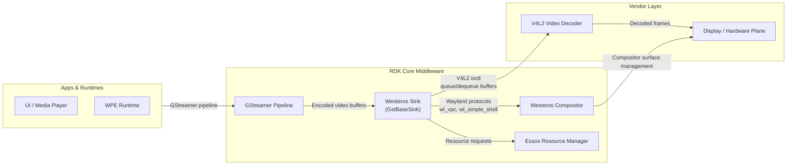
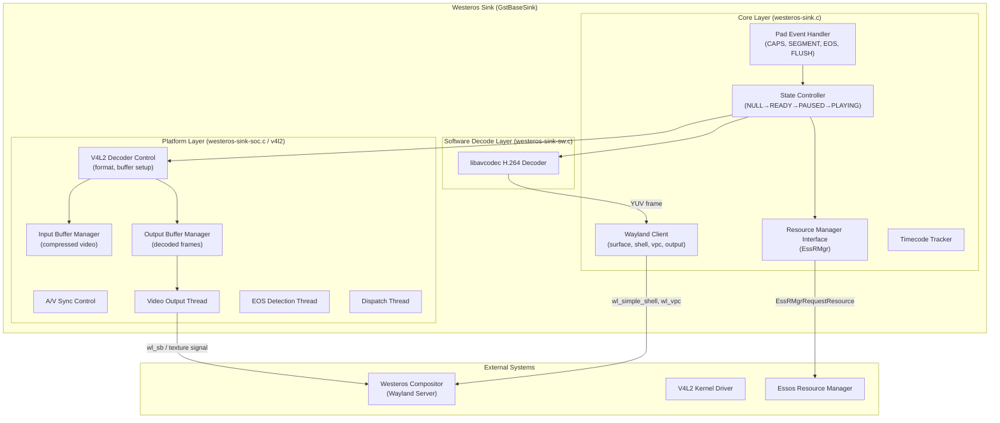
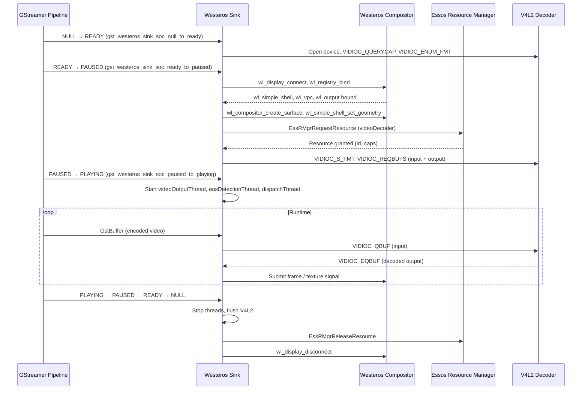
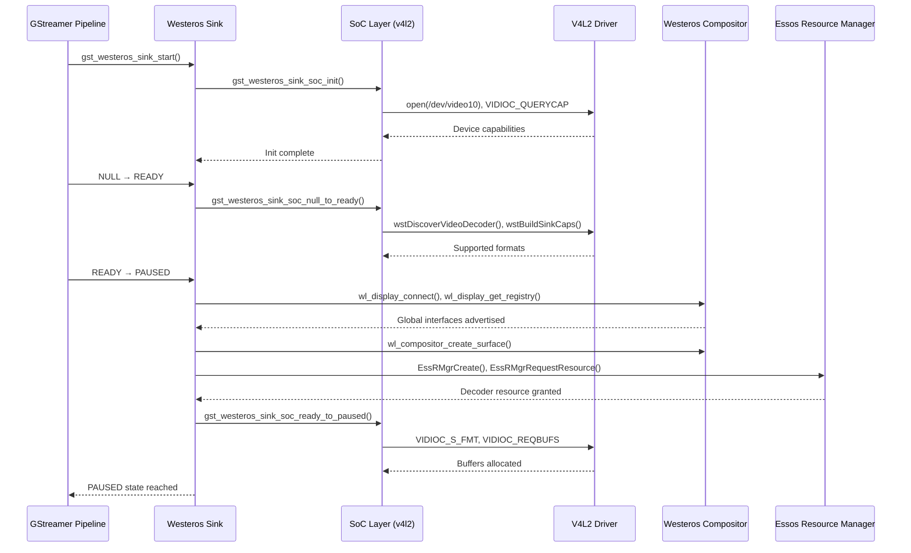
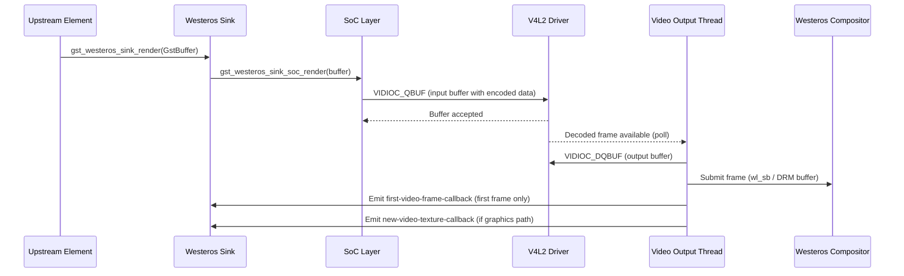
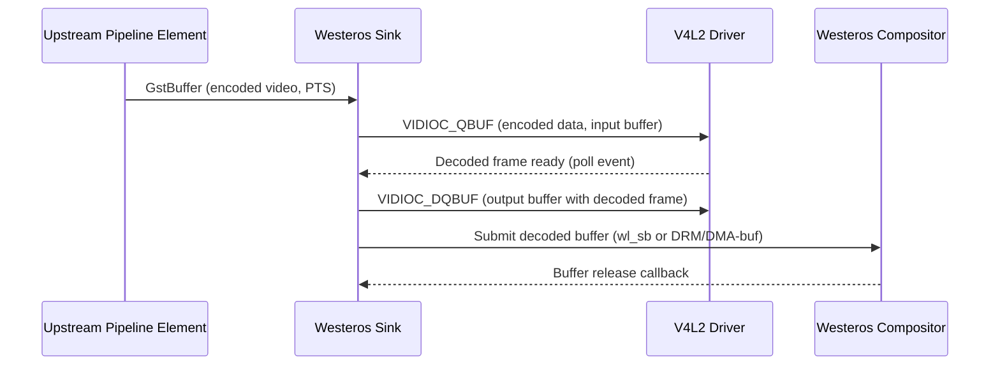
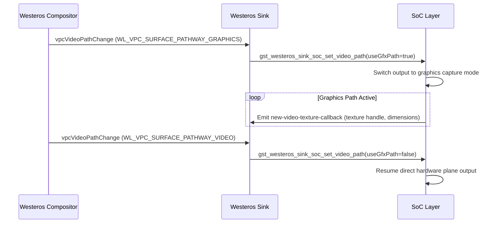

# Westeros Sink

Westeros Sink is a GStreamer video sink element that bridges the GStreamer media pipeline with the Westeros Wayland compositor. It receives compressed video bitstreams from upstream pipeline elements, submits them to the hardware video decoder through the V4L2 kernel subsystem, and manages the resulting output surface within the compositor's display stack. The element operates as a `GstBaseSink` derivative, handling the full lifecycle of a video plane — from surface allocation and Wayland registration to frame delivery, playback position tracking, and end-of-stream signaling.

At the device level, westeros-sink enables video playback applications and media players to render decoded video on the display without needing direct knowledge of the underlying graphics or compositor infrastructure. It exposes a standard GStreamer element interface, making it interchangeable within any GStreamer pipeline that produces parsed video. When multiple concurrent video streams are active, the element interacts with the Essos Resource Manager to negotiate and arbitrate access to hardware video decoder resources.

At the module level, the element maintains a Wayland client connection, creates and configures a `wl_surface`, and uses the `wl_vpc` (Video Path Control) protocol to dynamically switch the decoded video between a direct hardware plane path and a composited graphics texture path. The hardware decoding path is implemented through the V4L2 M2M (memory-to-memory) interface, where compressed input buffers are queued into the decoder and decoded output frames are dequeued by a dedicated worker thread. The element also supports an optional software decoding path using libavcodec, active when the resource manager assigns a software-capable decoder.



**Key Features & Responsibilities:**

- **GStreamer Sink Integration**: Registers as a standard GStreamer element with a single always-on sink pad, accepting parsed H.264 and MPEG video streams, and implements the `GstBaseSink` lifecycle (`start`, `stop`, `render`, `preroll`, state change handling).

- **Wayland Surface Management**: Connects to the Westeros compositor as a Wayland client and creates a `wl_surface`. Registers with `wl_simple_shell` to control surface properties such as geometry, visibility, z-order, and opacity.

- **Video Path Control via VPC**: Uses the `wl_vpc` protocol to receive video transform and scaling parameters from the compositor. Switches the video plane between a direct hardware display path and a graphics compositing path based on compositor notifications.

- **Hardware Video Decoding via V4L2**: Submits compressed video data into a V4L2 memory-to-memory decoder device. Manages separate input and output buffer pools, and dequeues decoded frames from the output queue in a dedicated worker thread.

- **Resource Management**: Integrates with the Essos Resource Manager (`EssRMgr`) to request, acquire, and release hardware video decoder resources. Handles asynchronous grant and revocation events, including fallback to a software decode path when a software-capable decoder is assigned.

- **Software Decode Fallback**: When enabled at build time (`ENABLE_SW_DECODE`), uses libavcodec to decode H.264 streams in software and submits decoded YUV frames to the compositor surface through a separate rendering path. This path is active when a software-capable decoder resource is assigned by the resource manager.

- **Playback Position Tracking**: Tracks the current presentation timestamp (PTS) and playback position using GStreamer segment information. Supports position queries from upstream and peer pipeline elements.

- **Timecode Support**: Detects and queues timecode metadata embedded in the video stream (SEI or GST video meta), matches them against the current PTS within a frame cadence tolerance, and emits a GStreamer signal upon presentation.

- **Statistics Logging**: Optionally logs frame render rate, average frame rate, and drop count at a configurable interval via the `WESTEROS_SINK_STATS_LOG` environment variable.

- **Pipeline Logging**: When enabled at build time (`USE_PIPELINE_LOGGING`), generates a textual representation of the full GStreamer pipeline for diagnostic purposes, controlled by flag files at `/tmp/enable_westeros_pipeline_dump` or `/opt/enable_westeros_pipeline_dump`.

---

## Design

The element is designed around GStreamer's `GstBaseSink` base class, which provides the core buffer scheduling, clock synchronization, and event handling infrastructure. The westeros-sink layer handles all Wayland and decoder specifics, with a clean separation between the compositor interaction layer (`westeros-sink.c`) and the platform-specific decoding layer (`westeros-sink-soc.c`). This split allows the Wayland surface management and resource arbitration logic to remain portable while the V4L2 decoding details reside in a platform-specific module.

Northbound, the element receives data from GStreamer's pad event system. It intercepts events such as `CAPS`, `SEGMENT`, `FLUSH_START`, `FLUSH_STOP`, and `EOS`, processing or forwarding them as appropriate. Southbound, it communicates with the Westeros compositor over a Wayland socket connection, using three Wayland protocol objects: `wl_compositor` (for surface creation), `wl_simple_shell` (for surface property control), and `wl_vpc` (for video path and transform events). For decoding, it communicates with the kernel V4L2 driver through standard `ioctl` calls, using a wrapper (`ioctl_wrapper`) to enable instrumentation and debugging.

IPC with the compositor uses the Wayland socket protocol, which is a Unix domain socket-based protocol. All Wayland proxy objects are assigned to a dedicated `wl_event_queue` to allow dispatch from a separate thread without interfering with other Wayland clients sharing the same display connection. The V4L2 decoder communicates through file descriptor operations (`ioctl`, `poll`, `mmap`/`dmabuf`).

Configuration state, such as window geometry and decoder properties, is maintained in memory and applied to the compositor and decoder on each pipeline state transition.



#### Threading Model

- **Threading Architecture**: Multi-threaded
- **Main Thread**: Handles GStreamer element state changes, pad event processing, property get/set, Wayland event dispatch on the element's dedicated event queue, and resource manager callbacks.
- **Worker Threads**:
  - _videoOutputThread_: Dequeues decoded frames from the V4L2 output buffer pool, forwards them to the compositor, emits the first-frame and texture signals, and manages capture mode transitions.
  - _eosDetectionThread_: Monitors the V4L2 decoder for end-of-stream events and signals EOS to the GStreamer pipeline when the last frame has been delivered.
  - _dispatchThread_: Handles compositor-side events and display synchronization separately from the main rendering loop.
- **Synchronization**: A `GMutex` (either GLIB 2.32 `GMutex` or the older pointer-based mutex) guards shared state within `GstWesterosSink`. A separate `GMutex` in `GstWesterosSinkSoc` protects the platform-specific decoder state. A `pthread_mutex_t reset_lock` serializes decoder reset operations.
- **Async / Event Dispatch**: Wayland events for the element's own `wl_event_queue` are dispatched from the main thread via `wl_display_roundtrip_queue`. GStreamer signals (`g_signal_emit`) for first-frame, underflow, texture, decode-error, and timecode are emitted from the worker threads after releasing the element mutex.

### Prerequisites and Dependencies

#### Platform and Integration Requirements

- **Build Dependencies**: `wayland`, `westeros`, `essos`, `virtual/westeros-soc`, `gstreamer1.0-plugins-base` (when GStreamer 1.x is enabled). When software decode is enabled: `libav` (providing `libavcodec`, `libavutil`).
- **Device Services / HAL**: The platform must provide a V4L2 M2M video decoder driver conforming to the RDK V4L2 HAL specification, accessible at `/dev/video10` by default (configurable via the `device` property). The driver is expected to run on Linux kernel 5.4.0 or later as a kernel module. Required device capability flags are `V4L2_CAP_DEVICE_CAPS`, `V4L2_CAP_STREAMING`, and `V4L2_CAP_VIDEO_M2M` or `V4L2_CAP_VIDEO_M2M_MPLANE`. The driver must support both `V4L2_MEMORY_MMAP` and `V4L2_MEMORY_DMABUF` memory types for output buffer allocation. Event support for `V4L2_EVENT_SOURCE_CHANGE` (resolution change notification) and `V4L2_EVENT_EOS` is required. See [Major HAL APIs Integration](#major-hal-apis-integration) for the full IOCTL surface used.
- **Systemd Services**: The Westeros compositor process must be running and its Wayland socket available before the element can connect. The Essos Resource Manager daemon must be available for resource-managed configurations.
- **Configuration Files**: When software decode is enabled, the `essrmgr.conf` file is installed to `${sysconfdir}/default/essrmgr.conf` and read at runtime for resource manager configuration.
- **Startup Order**: The Westeros compositor must be active (Wayland socket present) before the GStreamer pipeline is set to `READY`. The Essos Resource Manager service must be ready before the pipeline transitions to `PAUSED`.

---

### Component State Flow

#### Initialization to Active State

The element transitions through GStreamer states during its lifecycle. When the pipeline moves from `NULL` to `READY`, the element initializes the platform-specific SoC layer, which opens the V4L2 device, queries its capabilities, and discovers the supported input and output formats. On transition to `PAUSED`, the element connects to the Wayland display, creates the compositor surface, registers with `wl_simple_shell` and `wl_vpc`, and optionally requests a hardware video decoder resource through the Essos Resource Manager. When the resource is granted (synchronously or asynchronously), the element acquires the V4L2 decoder and configures input and output buffer pools. On transition to `PLAYING`, the element starts the video output, EOS detection, and dispatch worker threads.

The component transitions through the following states: **Initializing** (SoC init, V4L2 device open) → **Connecting** (Wayland display connect, surface creation, protocol binding) → **ResourceNegotiation** (EssRMgr request, decoder assignment) → **Active** (worker threads running, buffer queue/dequeue active) → **Shutdown** (flush, stop threads, release V4L2 buffers, disconnect Wayland, destroy EssRMgr).



#### Runtime State Changes

During playback, the compositor may instruct the element to change the video rendering path via `wl_vpc`. When `WL_VPC_SURFACE_PATHWAY_GRAPHICS` is received, the element switches to a graphics texture path, where decoded frames are captured and signaled to the application layer via the `new-video-texture-callback` GStreamer signal. When the direct hardware path is restored, the element switches back to submitting frames directly to the hardware display plane.

**State Change Triggers:**

- A `vpcVideoPathChange` event from the compositor causes the element to call `gst_westeros_sink_soc_set_video_path`, which reconfigures the output to either the hardware plane or the graphics capture path.
- A `vpcVideoXformChange` event delivers updated translation, scale, and output dimensions, which are applied by calling `gst_westeros_sink_soc_update_video_position`.
- An `EssRMgrEvent_revoked` notification from the resource manager causes the element to release the current decoder and re-request a resource. If a new resource is granted with software capabilities, the element switches to the software decode path.

**Context Switching Scenarios:**

- When the hardware decoder resource is revoked by a higher-priority consumer, the element transitions to the software decode path if `ENABLE_SW_DECODE` is compiled in. The pipeline resumes hardware-path rendering once a decoder resource is re-granted.
- A `FLUSH_START` / `FLUSH_STOP` event pair causes the element to flush the V4L2 input and output queues and reset the decoder state to handle seeks and trick-mode operations.

---

### Call Flows

#### Initialization Call Flow



#### Request Processing Call Flow

The element receives an encoded video buffer via `gst_westeros_sink_render()`. It validates the buffer, extracts the PTS, queues the data into the V4L2 input buffer, and returns. The video output thread independently dequeues decoded frames and forwards them to the compositor.



---

## Internal Modules

| Module / Class              | Description                                                                                                                                                                                                                                                                                   | Key Files                                              |
| --------------------------- | --------------------------------------------------------------------------------------------------------------------------------------------------------------------------------------------------------------------------------------------------------------------------------------------- | ------------------------------------------------------ |
| `GstWesterosSink`           | The primary GStreamer element class. Manages the Wayland client connection, surface lifecycle, Essos resource requests, GStreamer event and query handling, playback position tracking, timecode management, and media capture interface.                                                     | `westeros-sink.c`, `westeros-sink.h`                   |
| `GstWesterosSinkSoc` (V4L2) | Platform-specific decoding layer. Manages the V4L2 M2M decoder device lifecycle, input and output buffer pools (mmap or DMA-buf), video output thread, EOS detection thread, dispatch thread, pixel aspect ratio tracking, HDR metadata, A/V synchronization, and graphics texture signaling. | `v4l2/westeros-sink-soc.c`, `v4l2/westeros-sink-soc.h` |
| `SWCtx` (Software Decode)   | Optional software decode context using libavcodec. Active only when `ENABLE_SW_DECODE` is defined and a hardware decoder resource with software capability is assigned. Manages codec context, parser context, packet and frame allocation, and YUV frame delivery.                           | `westeros-sink-sw.c`, `westeros-sink-sw.h`             |
| Pipeline Logger             | Optional diagnostic utility that produces a textual ASCII-art representation of the active GStreamer pipeline graph. Activated by the presence of flag files at known filesystem paths.                                                                                                       | `pipeline_logger.cpp`                                  |
| `WstVideoClientConnection`  | Manages a Unix domain socket connection to a video server process for frame forwarding in compositor-connected configurations. Sends resource, flush, EOS, frame, frame-advance, rect, and keep-frame commands.                                                                               | `v4l2/westeros-sink-soc.c`                             |

---

## Component Interactions

### Interaction Matrix

| Target Component / Layer      | Interaction Purpose                                                                                                 | Key APIs / Topics                                                                                                                                                    |
| ----------------------------- | ------------------------------------------------------------------------------------------------------------------- | -------------------------------------------------------------------------------------------------------------------------------------------------------------------- |
| **Wayland Compositor**        |                                                                                                                     |                                                                                                                                                                      |
| Westeros Compositor           | Surface creation, geometry, visibility, z-order, and opacity control (outbound)                                     | `wl_compositor_create_surface()`, `wl_simple_shell_set_geometry()`, `wl_simple_shell_set_visible()`, `wl_simple_shell_set_zorder()`, `wl_simple_shell_set_opacity()` |
| Westeros Compositor           | Video surface geometry update sent to the compositor (outbound)                                                     | `wl_vpc_surface_set_geometry()`                                                                                                                                      |
| Westeros Compositor           | Video path and transform change events received from the compositor (inbound, via `wl_vpc_surface_add_listener()`)  | `vpcVideoPathChange`, `vpcVideoXformChange`                                                                                                                          |
| Westeros Compositor           | Decoded frame submission via simplebuffer protocol (outbound)                                                       | `wl_sb` (simplebuffer Wayland extension)                                                                                                                             |
| **Device Services / HAL**     |                                                                                                                     |                                                                                                                                                                      |
| V4L2 Kernel Subsystem         | Hardware video decoding — format negotiation, buffer management, decode control                                     | `VIDIOC_QUERYCAP`, `VIDIOC_ENUM_FMT`, `VIDIOC_S_FMT`, `VIDIOC_REQBUFS`, `VIDIOC_QBUF`, `VIDIOC_DQBUF`, `VIDIOC_STREAMON`, `VIDIOC_STREAMOFF`                         |
| DMA-buf                       | Output buffer sharing between the V4L2 decoder and the compositor using file-descriptor-based buffer export         | DMA-buf fd export via `VIDIOC_EXPBUF`, consumed by `wl_sb` or compositor import                                                                                      |
| **Resource Management**       |                                                                                                                     |                                                                                                                                                                      |
| Essos Resource Manager        | Video decoder resource request, grant, revocation, and state reporting                                              | `EssRMgrCreate()`, `EssRMgrRequestResource()`, `EssRMgrReleaseResource()`, `EssRMgrResourceGetCaps()`, `EssRMgrResourceSetState()`, `EssRMgrDestroy()`               |
| **Optional / Runtime-loaded** |                                                                                                                     |                                                                                                                                                                      |
| libmediacapture               | Optional media capture context, loaded at runtime via `dlopen` if `WESTEROSSINK_ENABLE_CAPTURE` env variable is set | `MediaCaptureCreateContext()`, `MediaCaptureDestroyContext()`                                                                                                        |
| libavcodec                    | Software H.264 decoding when a software-capable decoder resource is assigned and `ENABLE_SW_DECODE` is compiled in  | `avcodec_find_decoder()`, `avcodec_open2()`, `avcodec_send_packet()`, `avcodec_receive_frame()`                                                                      |

### Events Published

| Event Name                   | GStreamer Signal     | Trigger Condition                                                             | Notes                                     |
| ---------------------------- | -------------------- | ----------------------------------------------------------------------------- | ----------------------------------------- |
| `first-video-frame-callback` | `SIGNAL_FIRSTFRAME`  | First decoded video frame is output by the decoder                            | Emitted once per playback session start   |
| `buffer-underflow-callback`  | `SIGNAL_UNDERFLOW`   | V4L2 output queue becomes empty while stream is active                        | Indicates pipeline starvation             |
| `new-video-texture-callback` | `SIGNAL_NEWTEXTURE`  | A new decoded frame is available as a graphics texture (graphics path active) | Carries texture handle and frame geometry |
| `decode-error-callback`      | `SIGNAL_DECODEERROR` | V4L2 reports a decode error on the input stream                               | Carries error code and description        |
| `timecode-callback`          | `SIGNAL_TIMECODE`    | A timecode embedded in the video stream matches the current presentation PTS  | Carries hours, minutes, seconds           |

### IPC Flow Patterns

**Primary Render Flow:**



**Video Path Change Flow:**



---

## Implementation Details

### Major HAL APIs Integration

| HAL / DS API                | Purpose                                                                                                                                                     | Implementation File        |
| --------------------------- | ----------------------------------------------------------------------------------------------------------------------------------------------------------- | -------------------------- |
| `VIDIOC_QUERYCAP`           | Query V4L2 device capabilities and streaming type                                                                                                           | `v4l2/westeros-sink-soc.c` |
| `VIDIOC_ENUM_FMT`           | Enumerate supported compressed input and raw output pixel formats                                                                                           | `v4l2/westeros-sink-soc.c` |
| `VIDIOC_S_FMT`              | Set the input (compressed) and output (decoded) buffer formats                                                                                              | `v4l2/westeros-sink-soc.c` |
| `VIDIOC_REQBUFS`            | Allocate input and output buffer pools (mmap or DMA-buf)                                                                                                    | `v4l2/westeros-sink-soc.c` |
| `VIDIOC_QBUF`               | Queue an encoded input buffer or a free output buffer to the driver                                                                                         | `v4l2/westeros-sink-soc.c` |
| `VIDIOC_DQBUF`              | Dequeue a decoded output frame from the driver                                                                                                              | `v4l2/westeros-sink-soc.c` |
| `VIDIOC_STREAMON`           | Start the V4L2 input and output streams                                                                                                                     | `v4l2/westeros-sink-soc.c` |
| `VIDIOC_STREAMOFF`          | Stop and flush the V4L2 streams during seek or teardown                                                                                                     | `v4l2/westeros-sink-soc.c` |
| `VIDIOC_G_CTRL`             | Query minimum required buffer counts for input (`V4L2_CID_MIN_BUFFERS_FOR_OUTPUT`) and output (`V4L2_CID_MIN_BUFFERS_FOR_CAPTURE`) before buffer allocation | `v4l2/westeros-sink-soc.c` |
| `VIDIOC_G_FMT`              | Read back the current input and output format; called after `V4L2_EVENT_SOURCE_CHANGE` to retrieve updated resolution and format from the driver            | `v4l2/westeros-sink-soc.c` |
| `VIDIOC_QUERYBUF`           | Query buffer memory offset and status for each allocated input and output buffer after `VIDIOC_REQBUFS`                                                     | `v4l2/westeros-sink-soc.c` |
| `VIDIOC_EXPBUF`             | Export a decoded output buffer as a DMA-buf file descriptor for import by the Westeros compositor                                                           | `v4l2/westeros-sink-soc.c` |
| `VIDIOC_SUBSCRIBE_EVENT`    | Subscribe to `V4L2_EVENT_SOURCE_CHANGE` (resolution change) and `V4L2_EVENT_EOS` events on stream start                                                     | `v4l2/westeros-sink-soc.c` |
| `VIDIOC_UNSUBSCRIBE_EVENT`  | Unsubscribe from all V4L2 events (`V4L2_EVENT_ALL`) during stream teardown                                                                                  | `v4l2/westeros-sink-soc.c` |
| `VIDIOC_DQEVENT`            | Dequeue pending source-change and EOS events from the driver in the dispatch thread loop                                                                    | `v4l2/westeros-sink-soc.c` |
| `VIDIOC_DECODER_CMD`        | Issue `V4L2_DEC_CMD_STOP` to the decoder on EOS to flush remaining decoded frames before teardown                                                           | `v4l2/westeros-sink-soc.c` |
| `VIDIOC_ENUM_FRAMESIZES`    | Enumerate supported frame dimensions per input pixel format to determine the maximum decode resolution                                                      | `v4l2/westeros-sink-soc.c` |
| `VIDIOC_CROPCAP`            | Query pixel aspect ratio from crop capabilities after a source-change event for correct display scaling                                                     | `v4l2/westeros-sink-soc.c` |
| `EssRMgrCreate()`           | Initialize an Essos Resource Manager client instance                                                                                                        | `westeros-sink.c`          |
| `EssRMgrRequestResource()`  | Submit an asynchronous video decoder resource request with priority, usage flags, and max resolution                                                        | `westeros-sink.c`          |
| `EssRMgrReleaseResource()`  | Release a previously granted video decoder resource                                                                                                         | `westeros-sink.c`          |
| `EssRMgrResourceGetCaps()`  | Retrieve the capabilities of the assigned decoder (resolution limits, software flag)                                                                        | `westeros-sink.c`          |
| `EssRMgrResourceSetState()` | Report the current decoder operational state (idle, paused, active) to the resource manager                                                                 | `westeros-sink.c`          |

### Key Implementation Logic

- **State / Lifecycle Management**: State transitions are handled through six bridge functions (`null_to_ready`, `ready_to_paused`, `paused_to_playing`, `playing_to_paused`, `paused_to_ready`, `ready_to_null`) defined in both the core layer and the SoC layer. The core layer dispatches to the SoC layer or the software decode layer based on the currently assigned resource capabilities.
  - Core state dispatch: `westeros-sink.c` (`gst_westeros_sink_backend_*`)
  - SoC state transitions: `v4l2/westeros-sink-soc.c` (`gst_westeros_sink_soc_*`)

- **Event Processing**: GStreamer pad events (CAPS, SEGMENT, EOS, FLUSH) are intercepted in `gst_westeros_sink_event()`. CAPS events trigger capability checks against the decoder. SEGMENT events update the playback segment and position tracking. FLUSH events trigger `gst_westeros_sink_soc_flush()` to drain V4L2 queues. EOS propagation is handled by the `eosDetectionThread`, which monitors decoder output and calls `gst_westeros_sink_eos_detected()` when the final frame has been delivered.

- **Error Handling Strategy**: V4L2 `ioctl` errors are logged via `GST_ERROR` and the `postDecodeError` macro, which posts a `GST_STREAM_ERROR_DECODE` error message to the GStreamer bus and emits the `decode-error-callback` signal. The video output thread is stopped upon decode errors. Resource manager events are logged and the element awaits resource re-grant before resuming playback.

- **Logging & Diagnostics**:
  - RDK Logger category: `westerossink` (or `westerosrawsink` for the raw variant)
  - Key log points: initialization (`gst_westeros_sink_init`), state transitions, Wayland registry binding, resource grant/revoke events, V4L2 format negotiation, first frame delivery, underflow detection, and all V4L2 `ioctl` error paths.
  - Frame-level debug: enabled via the `g_frameDebug` flag, producing timestamped output to stderr.
  - A/V progression logging: enabled via the `AV_PROGRESSION` environment variable, writing timestamped PTS and sync group entries to a file or stderr.

---

## Configuration

### Key Configuration Files

| Configuration File                   | Purpose                                                                 | Override Mechanism                                                               |
| ------------------------------------ | ----------------------------------------------------------------------- | -------------------------------------------------------------------------------- |
| `${sysconfdir}/default/essrmgr.conf` | Provides resource manager configuration when software decode is enabled | Present only when `westeros_sink_software_decode` Yocto DISTRO_FEATURE is active |

### Key Configuration Parameters

| Parameter                  | Type              | Default                                        | Description                                                                                          |
| -------------------------- | ----------------- | ---------------------------------------------- | ---------------------------------------------------------------------------------------------------- |
| `window_set` / `rectangle` | string            | `"0,0,1280,720"`                               | Sets the video surface geometry as `x,y,width,height`.                                               |
| `zorder`                   | float             | `0.0`                                          | Surface z-order relative to other compositor surfaces, from 0.0 (bottom) to 1.0 (top).               |
| `opacity`                  | float             | `1.0`                                          | Surface opacity from 0.0 (transparent) to 1.0 (opaque).                                              |
| `video_width`              | int (read-only)   | `0`                                            | Current decoded video frame width in pixels.                                                         |
| `video_height`             | int (read-only)   | `0`                                            | Current decoded video frame height in pixels.                                                        |
| `video_pts`                | int64 (read-only) | `0`                                            | Current video presentation timestamp value.                                                          |
| `display-name`             | string            | `NULL`                                         | Name of the Wayland display to connect to. Connects to the default Wayland display when unspecified. |
| `enable-timecode`          | bool              | `false`                                        | Enables timecode signal extraction and emission. Requires `USE_GST_VIDEO`.                           |
| `res-priority`             | uint              | `0`                                            | Priority for video decoder resource requests (0 = highest).                                          |
| `res-usage`                | flags             | `fullResolution\|fullQuality\|fullPerformance` | Flags indicating the intended resource usage quality level.                                          |
| `device`                   | string            | `/dev/video10`                                 | Path to the V4L2 video decoder device node.                                                          |
| `force-aspect-ratio`       | bool              | `false`                                        | When enabled, applies aspect-ratio-correct scaling to the output window.                             |
| `zoom-mode`                | int               | `ZOOM_NONE`                                    | Zoom/crop mode applied to the output: none, direct, normal, stretch, pillarbox, zoom, or global.     |
| `low-memory-mode`          | bool              | `false`                                        | Reduces output buffer count to lower memory usage at the cost of potential throughput.               |
| `low-latency-mode`         | bool              | `false`                                        | Enables a low-latency output path that reduces decode-to-display delay.                              |
| `immediate-output`         | bool              | `false`                                        | Bypasses presentation timestamp scheduling and outputs frames immediately upon decode.               |
| `enable-texture`           | bool              | `false`                                        | Enables the `new-video-texture-callback` signal for graphics path texture delivery.                  |

### Runtime Configuration

Frame-level debug output can be enabled at runtime via the `WESTEROS_SINK_STATS_LOG` environment variable, which accepts an interval value in milliseconds:

```bash
# Enable frame statistics logging every 5 seconds
WESTEROS_SINK_STATS_LOG=5000 <application>
```

Pipeline graph dump can be triggered at runtime by creating the flag file:

```bash
touch /tmp/enable_westeros_pipeline_dump
```

Media capture can be enabled at runtime using:

```bash
WESTEROSSINK_ENABLE_CAPTURE=1 <application>
```

### Configuration Persistence

Configuration parameters are maintained in memory and take effect for the duration of the active pipeline session.
