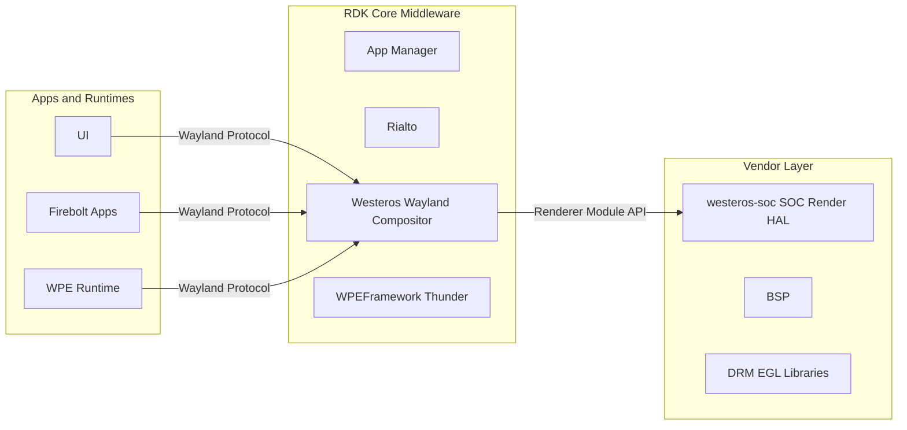
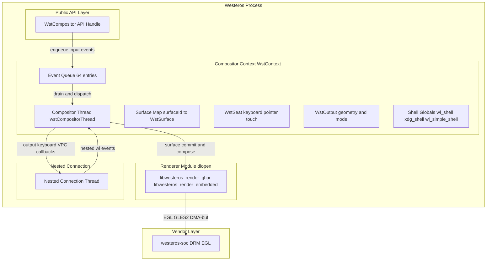
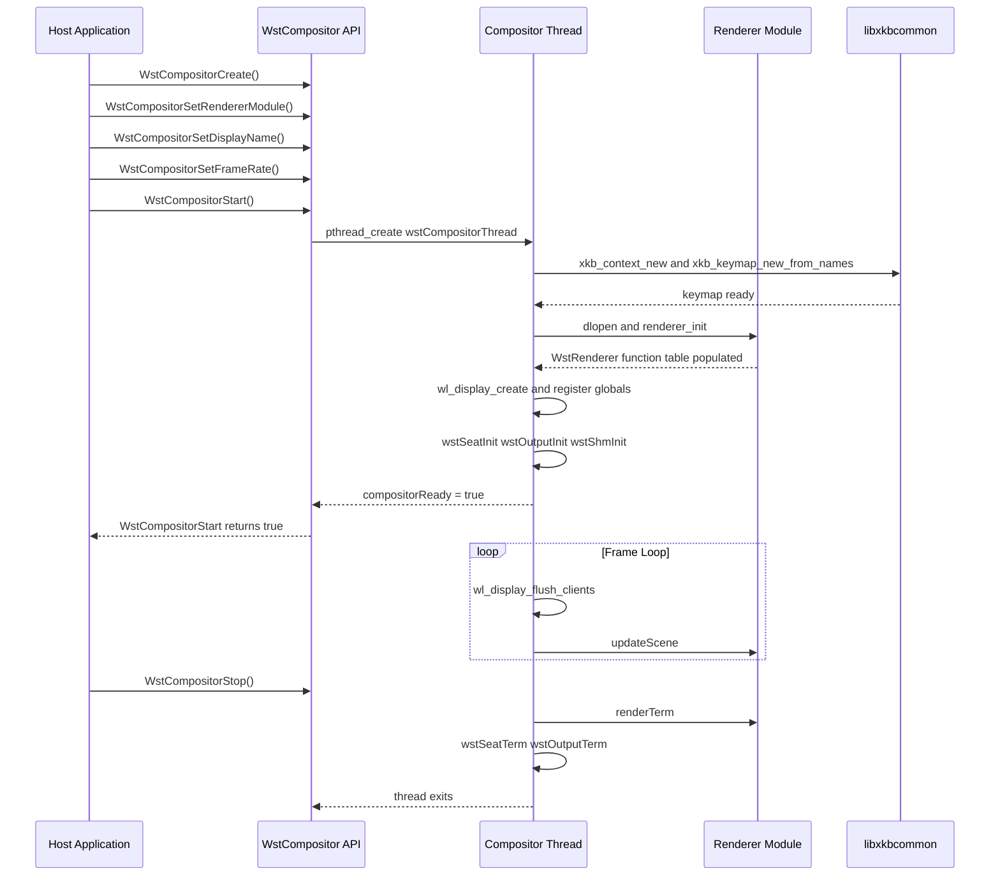
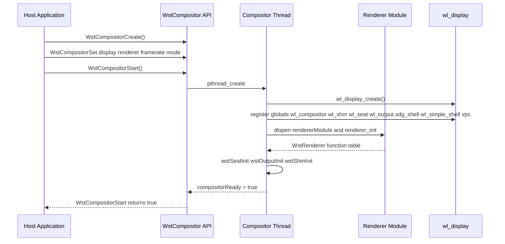
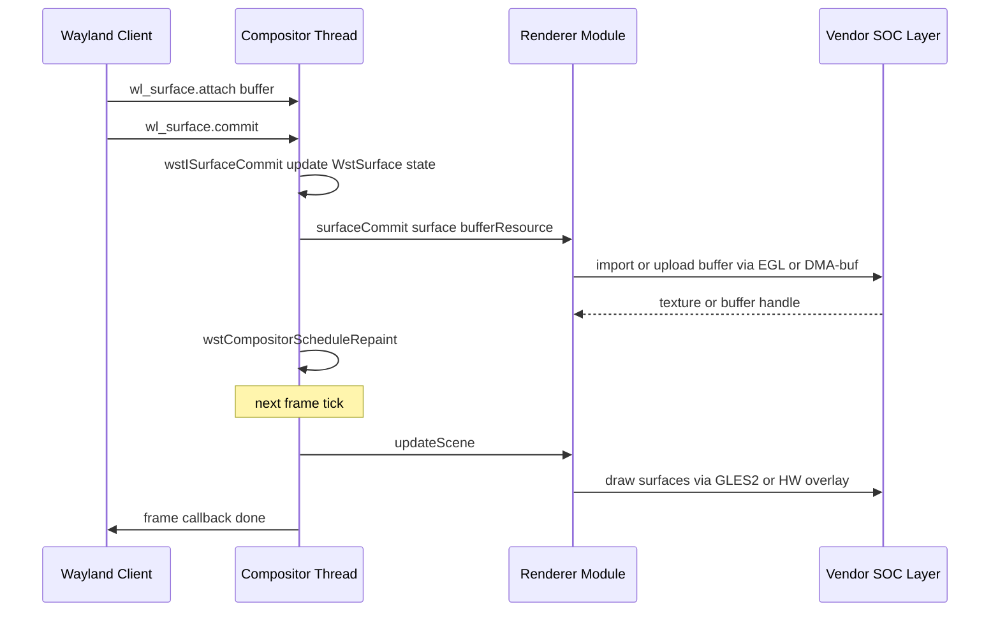
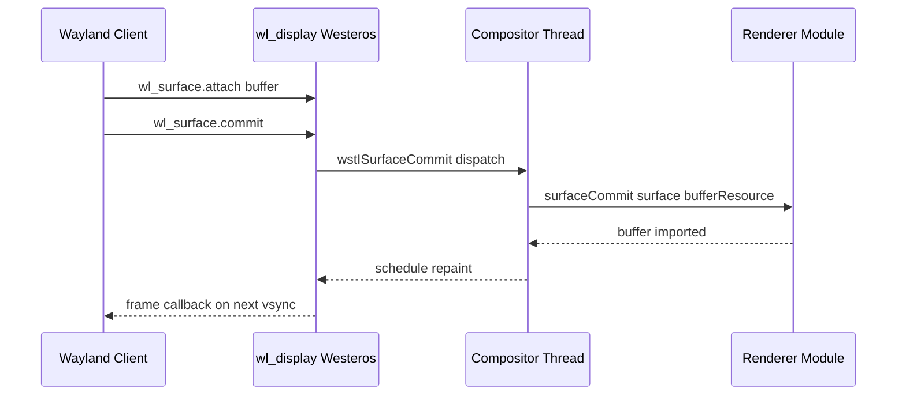
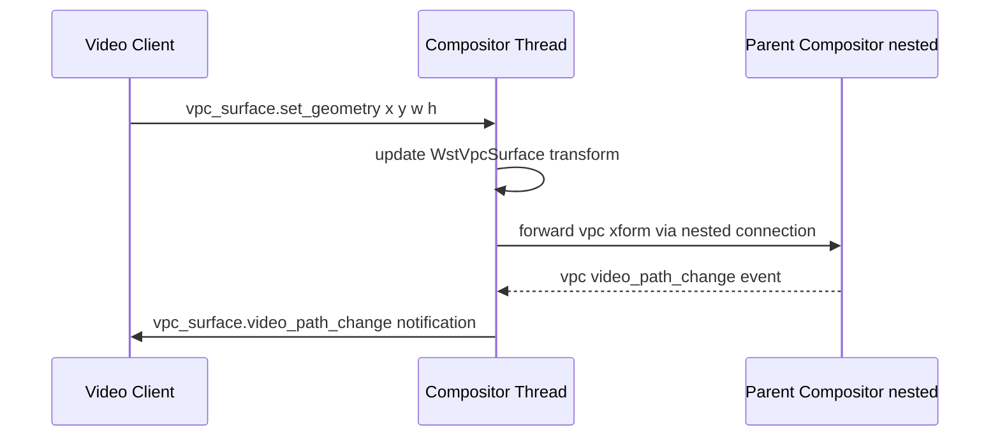

# Westeros

Westeros is a lightweight Wayland compositor library that enables applications to create one or more Wayland displays. It is designed to be compatible with applications built for standard Wayland compositors and is structured as a library rather than a standalone application, allowing it to be embedded inside a host process. It supports three compositor modes: a **normal** compositor that renders its composited output directly to the screen, a **nested** compositor that connects to another compositor as a client and renders onto a surface of that parent compositor, and an **embedded** compositor whose composited output is driven by the hosting application through explicit calls. This flexibility allows Westeros to act as the top-level display server on a device, as an intermediary layer in a compositor chain, or as an off-screen compositor integrated into an application's rendering pipeline.

At the device level, Westeros provides a Wayland display endpoint that UI frameworks, media players, and other application runtimes connect to as Wayland clients. At the module level, it exposes a C API for creating, configuring, and starting compositor instances, a pluggable renderer interface that allows vendor-specific rendering backends to be loaded at runtime, and a set of Wayland protocol extensions — Simple Shell, VPC, linux-dmabuf, and explicit sync — that provide surface management and video path control beyond the base Wayland protocol.



**Key Features & Responsibilities:**

- **Multiple Compositor Modes**: Westeros operates as a normal (top-level), nested, or embedded compositor. A nested compositor connects to a parent Wayland display and forwards its composited output as a client surface; an embedded compositor exposes its scene only when the host application triggers composition explicitly via `WstCompositorComposeEmbedded`.
- **Pluggable Renderer Interface**: The rendering backend is loaded at runtime from a shared library specified by `WstCompositorSetRendererModule`. Renderer modules implement a defined function table (`WstRenderer`) covering surface create/destroy, buffer commit, geometry, opacity, z-order, crop, and DMA-buf operations.
- **Surface and Shell Protocol Support**: Westeros implements `wl_compositor`, `wl_shell`, and `xdg_shell` (versions 4, 5, and stable) server-side protocols. Each client surface is tracked as a `WstSurface` with full position, size, opacity, z-order, and popup relationship state.
- **Input Routing**: Keyboard, pointer, and touch input is injected via the compositor API (`WstCompositorKeyEvent`, `WstCompositorPointerMoveEvent`, `WstCompositorPointerButtonEvent`, `WstCompositorTouchEvent`) and dispatched through standard Wayland seat protocols to the focused surface. Keyboard layout is managed via libxkbcommon with configurable key repeat delay and rate.
- **Video Path Control (VPC)**: The proprietary `vpc` Wayland protocol extension allows a video surface to declare whether its content follows a hardware or graphics path and communicates position and scale transforms to the compositor chain, enabling hole-punch and hardware video overlay positioning.
- **Wayland Protocol Extensions**: Optionally compiled-in extensions include `wl_sb` (shared buffer), `zwp_linux_dmabuf_v1` (DMA-buf import), `linux_explicit_synchronization_unstable_v1` (acquire/release fence synchronization), and `wl_simple_shell` for privileged surface management.
- **Extensible Module System**: Additional Wayland protocols or functionality can be added at runtime by loading external shared libraries that provide `moduleInit` and `moduleTerm` entry points, registered via `WstCompositorAddModule`.
- **Repeater Mode**: A repeating nested compositor forwards client surface buffers directly to the parent compositor without performing intermediate composition rendering, minimizing latency in layered compositor configurations.
- **Virtual Embedded Compositors**: Multiple virtual embedded compositor instances can be created from a single master embedded compositor via `WstCompositorCreateVirtualEmbedded`, allowing independent sub-scene management within one process.

---

## Design

Westeros is designed around a library model where the compositor runs inside the host process. The compositor context (`WstContext`) holds all shared state and runs a dedicated compositor thread that owns the Wayland display event loop, client connections, and frame generation. The public `WstCompositor` handle is the per-instance API object and decouples the calling thread from the compositor thread, with a 64-entry event queue (`WstEvent`) bridging input events from the application thread to the compositor thread. A recursive pthread mutex (`ctx->mutex`) serializes access to shared context state between the caller and the compositor thread.

The three compositor modes — normal, nested, and embedded — are controlled by flags set before `WstCompositorStart` is called. In nested mode, a `WstNestedConnection` is established on a separate thread to maintain the connection to the parent Wayland display, receiving output geometry, keyboard map, and VPC events from the parent and forwarding them into the local compositor event flow. In embedded mode, composition is triggered only when the hosting application calls `WstCompositorComposeEmbedded`, and both that call and `WstCompositorStart` must be issued from the same thread. Normal mode drives composition from a timer event source on the compositor thread at the configured frame rate.

Rendering is fully decoupled through the `WstRenderer` interface: the compositor calls `renderer_init` in the loaded module to populate a function table, then calls `surfaceCreate`, `surfaceCommit`, `updateScene`, and related methods for each frame. This separation means the compositor core has no dependency on any specific GPU API; EGL and GLES2 are engaged only when a GL-based renderer module is loaded. Buffer sharing between clients and the renderer is handled through `wl_shm`, `wl_sb`, `zwp_linux_dmabuf_v1`, or EGL Wayland buffer extensions, depending on which protocols are enabled at build time.

Northbound interaction is entirely via the Wayland socket protocol: clients connect, bind globals, create surfaces, attach buffers, and commit. Southbound interaction is through the renderer module's function table, which abstracts the vendor-specific GPU and display path. Westeros operates as a standalone process-level service accessed exclusively over the Wayland socket.

The keyboard map is initialized from libxkbcommon on each compositor startup using the evdev rule set and the us layout by default. All operational state is managed entirely in process memory.



#### Threading Model

- **Threading Architecture**: Multi-threaded
- **Main / Caller Thread**: Invokes `WstCompositorCreate`, `WstCompositorSet*`, `WstCompositorStart`, and input injection APIs. Posts events to the per-compositor event queue.
- **Worker Threads**:
  - _Compositor thread_ (`wstCompositorThread`): Runs the `wl_display` event loop, accepts client connections, dispatches protocol requests, schedules repaints, drives frame composition at the configured frame rate, and manages surface lifecycle.
  - _Nested connection thread_: Active in nested or repeater mode. Maintains the Wayland client connection to the parent compositor, receives output geometry, keyboard map, and VPC notifications, and posts them into the compositor context.
- **Synchronization**: A recursive pthread mutex (`ctx->mutex`) protects the compositor context and surface/client maps. A mutex and condition variable pair (`ncStartedMutex`, `ncStartedCond`) synchronizes the start of the nested connection thread with the compositor thread startup. The master embedded compositor uses a separate global mutex (`g_mutexMasterEmbedded`).
- **Async / Event Dispatch**: Input injection APIs write into the `WstCompositor::eventQueue` ring buffer (64 entries, indexed by `eventIndex`). The compositor thread calls `wstCompositorProcessEvents` on each loop iteration, draining the queue and dispatching each event type to the matching handler (`wstProcessKeyEvent`, `wstProcessPointerMoveEvent`, `wstProcessTouchDownEvent`, etc.).

### Prerequisites and Dependencies

#### Platform and Integration Requirements

- **Build Dependencies**: `wayland-client` (≥1.6.0), `wayland-server` (≥1.6.0), `wayland-egl`, `libxkbcommon` (≥0.4), `EGL`, `GLESv2`, `glib-2.0` (≥2.22.5), `gstreamer-1.0` (≥1.0), `virtual/westeros-soc` (SOC render module), `westeros-simplebuffer`, `westeros-simpleshell`, `wayland-native` (for protocol scanner at build time). `wayland-protocols` is required when the `explicit-sync` PACKAGECONFIG is enabled; `libdrm` headers are required when `incldbprotocol` is enabled.
- **Device Services / HAL**: Vendor-specific rendering is provided by the `virtual/westeros-soc` recipe, resolved at build time to a platform renderer module. The module exports a `renderer_init` symbol and populates the `WstRenderer` function table covering `renderTerm`, `updateScene`, `surfaceCreate`, `surfaceDestroy`, `surfaceCommit`, `surfaceSetVisible`, `surfaceGetVisible`, `surfaceSetGeometry`, `surfaceGetGeometry`, `surfaceSetOpacity`, `surfaceGetOpacity`, `surfaceSetZOrder`, `surfaceGetZOrder`, `surfaceSetCrop`, and `holePunch`.
- **Systemd Services**: The `westeros.service` unit sources `/etc/default/westeros-env` and executes `/usr/bin/westeros-init`. The init script waits up to 60 seconds for `XDG_RUNTIME_DIR` to be mounted before launching the compositor.
- **Configuration Files**: Runtime configuration is supplied through `/etc/default/westeros-env`, sourced by the systemd service unit.
- **Startup Order**: `RequiresMountsFor=/run` in `westeros.service`; `WantedBy=multi-user.target`.

---

### Component State Flow

#### Initialization to Active State

The compositor transitions through the following states during its lifecycle: **Uninitialized** (before `WstCompositorCreate`) → **Configured** (`WstCompositorSet*` calls establish display name, renderer module, frame rate, and mode flags) → **Starting** (`WstCompositorStart` spawns the compositor thread) → **Ready** (compositor thread creates the `wl_display`, initializes renderer, seat, output, and shell globals, then signals readiness) → **Active** (compositor thread runs the event loop, accepting client connections and generating frames) → **Shutdown** (`WstCompositorStop` signals the compositor thread to exit, renderer and seat resources are released).



#### Runtime State Changes

**State Change Triggers:**

- **Output Size Change**: `WstCompositorSetOutputSize` or `WstCompositorResolutionChangeEnd` set `outputSizeChanged` flags; the compositor thread calls `wstOutputChangeSize` on its next iteration, updating all clients with a new `wl_output.mode` event.
- **Nested Connection Loss**: When the nested connection thread detects that the parent compositor has disconnected, it invokes the `connectionEnded` callback on the compositor context, which sets `compositorAborted` and causes the compositor thread to stop cleanly.
- **First Frame Notification**: When a client surface receives its first committed buffer, the `clientStatusCB` is invoked with `WstClient_firstFrame`, allowing the host application to respond to content availability.

**Context Switching Scenarios:**

- When operating as a nested compositor, output geometry or keyboard map changes from the parent compositor propagate into the local compositor context and are forwarded to all connected clients.
- In embedded mode, the host application controls composition timing by calling `WstCompositorComposeEmbedded` directly.

---

### Call Flows

#### Initialization Call Flow



#### Request Processing Call Flow

Surface buffer rendering is the primary runtime operation. A Wayland client attaches a buffer to its surface and issues a commit. The compositor thread receives the commit, passes the buffer to the renderer module for upload or import, schedules a repaint, and on the next frame tick calls the renderer's `updateScene` to produce the composited output.



---

## Internal Modules

| Module / Class                                  | Description                                                                                                                                                                                                                                      | Key Files                                                                            |
| ----------------------------------------------- | ------------------------------------------------------------------------------------------------------------------------------------------------------------------------------------------------------------------------------------------------ | ------------------------------------------------------------------------------------ |
| `WstCompositor`                                 | Public API handle. Holds per-instance output dimensions, keyboard/pointer/touch objects, client status callbacks, and the 64-entry event queue. Each virtual embedded instance has its own `WstCompositor` sharing a single `WstContext`.        | `westeros-compositor.cpp`, `westeros-compositor.h`                                   |
| `WstContext`                                    | Internal compositor context. Owns the `wl_display`, compositor thread, renderer module, seat, output, surface maps, nested connection, and all Wayland global objects. One `WstContext` per non-virtual compositor instance.                     | `westeros-compositor.cpp`                                                            |
| `WstRenderer`                                   | Pluggable rendering interface. Loaded at runtime via `dlopen`; the module exports `renderer_init` to populate a function table of surface and scene operations. Two built-in modules are provided: a GLES2 GL renderer and an embedded renderer. | `westeros-render.h`, `westeros-render-gl.cpp`, `westeros-render-embedded.cpp`        |
| `WstNestedConnection`                           | Manages the Wayland client connection to a parent compositor in nested or repeater mode. Runs on a dedicated thread. Receives output, keyboard, and VPC events from the parent and delivers them via callbacks into the compositor context.      | `westeros-nested.h`, `westeros-nested.cpp`                                           |
| `WstSurface`                                    | Per-surface state: position, size, opacity, z-order, attached buffer resource, frame callback list, and explicit-sync fences. Maintains a reference to its `WstRenderSurface` within the renderer and to any associated `WstVpcSurface`.         | `westeros-compositor.cpp`                                                            |
| `WstSeat / WstKeyboard / WstPointer / WstTouch` | Input seat abstraction. Tracks focused surfaces, current keyboard modifiers via libxkbcommon `xkb_state`, and pointer position. Dispatches Wayland seat events to client resources.                                                              | `westeros-compositor.cpp`                                                            |
| `WstSimpleShell`                                | Server implementation of the `wl_simple_shell` protocol. Allows privileged clients to set surface name, visibility, geometry, opacity, z-order, scale, and focus by surface ID, and to receive creation/destruction broadcast notifications.     | `simpleshell/westeros-simpleshell.cpp`, `simpleshell/westeros-simpleshell.h`         |
| `WstVpcSurface`                                 | Tracks the video path control state for a surface (hardware path vs. graphics path) and the position/scale transform communicated to the compositor chain via the `vpc` protocol.                                                                | `westeros-compositor.cpp`                                                            |
| `WstLinuxDmabuf`                                | Protocol module implementing `zwp_linux_dmabuf_v1`. Handles multi-plane DMA-buf buffer import with format and modifier negotiation between client and renderer.                                                                                  | `linux-dmabuf/westeros-linux-dmabuf.cpp`, `linux-dmabuf/westeros-linux-dmabuf.h`     |
| `WstLinuxExpSync`                               | Protocol module implementing `linux_explicit_synchronization_unstable_v1`. Manages per-surface acquire fence descriptors and buffer release fence signalling between client and renderer.                                                        | `linux-expsync/westeros-linux-expsync.cpp`, `linux-expsync/westeros-linux-expsync.h` |

---

## Component Interactions

Westeros operates as a self-contained Wayland display server. Northbound communication is entirely via the Wayland socket protocol; southbound communication is via the renderer module's function table.

### Interaction Matrix

| Target Component / Layer        | Interaction Purpose                                  | Key APIs / Topics                                                                                                  |
| ------------------------------- | ---------------------------------------------------- | ------------------------------------------------------------------------------------------------------------------ |
| **Wayland Clients**             |                                                      |                                                                                                                    |
| UI / App Runtimes               | Surface creation, buffer submission, input reception | `wl_compositor`, `wl_surface`, `wl_seat`, `xdg_shell`, `wl_simple_shell`, `vpc`                                    |
| Media / Video Clients           | Video path and position negotiation                  | `vpc_surface.set_geometry`, `vpc_surface.video_path_change`                                                        |
| **Renderer Module / HAL**       |                                                      |                                                                                                                    |
| `virtual/westeros-soc` renderer | Compositing surfaces to display output               | `renderer_init()`, `surfaceCommit()`, `updateScene()`, `surfaceSetGeometry()`, `surfaceSetZOrder()`, `holePunch()` |
| EGL / GLES2 / DMA-buf           | GPU buffer import and rendering                      | `eglBindWaylandDisplayWL`, `eglQueryWaylandBufferWL`, `WstLDBBufferGet*`                                           |
| **System**                      |                                                      |                                                                                                                    |
| libxkbcommon                    | Keyboard layout and modifier state management        | `xkb_context_new`, `xkb_keymap_new_from_names`, `xkb_state_new`, `xkb_state_update_mask`                           |
| Wayland display socket          | Inter-process communication with compositor clients  | `wl_display_create`, `wl_display_add_socket`, `wl_display_run`                                                     |

### Events Published

| Event Name                                          | Wayland Topic     | Trigger Condition                                                                              | Subscriber                                    |
| --------------------------------------------------- | ----------------- | ---------------------------------------------------------------------------------------------- | --------------------------------------------- |
| `output.mode`                                       | `wl_output`       | Output size changes via `WstCompositorResolutionChangeEnd`                                     | All connected Wayland clients                 |
| `keyboard.keymap`                                   | `wl_keyboard`     | Compositor start or nested keymap update from parent                                           | Clients with keyboard focus                   |
| `keyboard.key` / `keyboard.modifiers`               | `wl_keyboard`     | Key event injected via `WstCompositorKeyEvent`                                                 | Client with keyboard focus                    |
| `pointer.motion` / `pointer.button`                 | `wl_pointer`      | Pointer event injected via `WstCompositorPointerMoveEvent` / `WstCompositorPointerButtonEvent` | Client under pointer                          |
| `touch.down` / `touch.up` / `touch.motion`          | `wl_touch`        | Touch event injected via `WstCompositorTouchEvent`                                             | Client with touch focus                       |
| `shell_surface.created` / `shell_surface.destroyed` | `wl_simple_shell` | Surface created or destroyed on the display                                                    | All `wl_simple_shell` bound clients           |
| `vpc_surface.video_path_change`                     | `vpc`             | Video surface changes path via `wstDefaultNestedVpcVideoPathChange`                            | VPC-bound client surfaces                     |
| `frame` callback                                    | `wl_callback`     | Frame composition completed                                                                    | Wayland clients that requested frame callback |

### IPC Flow Patterns

**Primary Surface Commit Flow:**

Clients communicate with Westeros over the Wayland socket. Westeros validates the buffer resource type (shm, EGL Wayland buffer, DMA-buf, or simple-buffer) at commit time and dispatches to the renderer for import. Buffer sharing is mediated through the Wayland shm pool mechanism and the enabled buffer protocol extensions.



**VPC Video Path Control Flow:**



---

## Implementation Details

### Major HAL APIs Integration

The HAL boundary for Westeros is the renderer module interface. All functions below are called through the `WstRenderer` function pointer table populated by the renderer module's `renderer_init` entry point.

| Renderer Module API                                 | Purpose                                                                                              | Implementation File                                      |
| --------------------------------------------------- | ---------------------------------------------------------------------------------------------------- | -------------------------------------------------------- |
| `renderer_init()`                                   | Entry point called after `dlopen`; populates the `WstRenderer` function table                        | `westeros-render-gl.cpp`, `westeros-render-embedded.cpp` |
| `surfaceCreate()`                                   | Allocates a per-surface render object (`WstRenderSurface`) within the renderer                       | `westeros-render-gl.cpp`                                 |
| `surfaceCommit()`                                   | Imports or uploads the Wayland client buffer into the renderer (EGL Wayland buffer, DMA-buf, or shm) | `westeros-render-gl.cpp`, `westeros-render-embedded.cpp` |
| `surfaceImportSync()`                               | Imports the explicit sync fence for a surface buffer commit                                          | `westeros-render-gl.cpp`                                 |
| `surfaceSetGeometry()`                              | Sets the position and dimensions of a surface for the next scene update                              | `westeros-render-gl.cpp`, `westeros-render-embedded.cpp` |
| `surfaceSetZOrder()`                                | Sets the rendering order of a surface                                                                | `westeros-render-gl.cpp`, `westeros-render-embedded.cpp` |
| `surfaceSetOpacity()`                               | Sets the alpha multiplier for a surface                                                              | `westeros-render-gl.cpp`, `westeros-render-embedded.cpp` |
| `surfaceSetVisible()`                               | Controls whether a surface participates in scene rendering                                           | `westeros-render-gl.cpp`, `westeros-render-embedded.cpp` |
| `surfaceSetCrop()`                                  | Sets the source crop rectangle for a surface                                                         | `westeros-render-embedded.cpp`                           |
| `updateScene()`                                     | Renders all visible surfaces to the output target for the current frame                              | `westeros-render-gl.cpp`, `westeros-render-embedded.cpp` |
| `holePunch()`                                       | Clears a screen region to allow hardware video overlay to show through                               | `westeros-render-embedded.cpp`                           |
| `queryDmabufFormats()` / `queryDmabufModifiers()`   | Queries supported DMA-buf pixel formats and modifiers from the renderer                              | `westeros-render-gl.cpp`                                 |
| `resolutionChangeBegin()` / `resolutionChangeEnd()` | Signals the renderer before and after an output resolution change                                    | `westeros-render-gl.cpp`                                 |
| `renderTerm()`                                      | Releases all renderer resources at shutdown                                                          | `westeros-render-gl.cpp`, `westeros-render-embedded.cpp` |

### Key Implementation Logic

- **State / Lifecycle Management**: All compositor state is held in `WstContext` (heap-allocated, one per compositor instance). `WstCompositorCreate` allocates and zero-initialises both `WstContext` and `WstCompositor`, sets default frame rate (60 fps), default output size (1280×720), and default keymap (evdev/pc105/us). `WstCompositorStart` spawns the compositor thread; `WstCompositorStop` sets `ctx->running = false` and joins the thread.
  - Core lifecycle: `westeros-compositor.cpp` — `WstCompositorCreate`, `WstCompositorStart`, `WstCompositorStop`, `WstCompositorDestroy`
  - Compositor thread body: `westeros-compositor.cpp` — `wstCompositorThread`

- **Event Processing**: Input events injected by the host application are written into `WstCompositor::eventQueue[WST_EVENT_QUEUE_SIZE]` (64 entries, ring buffer indexed by `eventIndex`). The compositor thread calls `wstCompositorProcessEvents` on each loop iteration, draining the queue and dispatching each event type to the matching handler (`wstProcessKeyEvent`, `wstProcessPointerMoveEvent`, `wstProcessTouchDownEvent`, etc.). Each handler locates the appropriate focused surface via `WstKeyboard::focus`, `WstPointer::focus`, or `WstTouch::focus` and sends the corresponding Wayland protocol event to the client's resource list.

- **Error Handling Strategy**: API functions return `bool` (true on success). On failure, a descriptive string is stored in `WstCompositor::lastErrorDetail` and retrieved with `WstCompositorGetLastErrorDetail`. Renderer `dlopen` and `renderer_init` failures abort `WstCompositorStart`. Nested connection loss sets `compositorAborted`, which terminates the compositor thread cleanly.

- **Logging & Diagnostics**: The internal `wstLog(level, fmt, ...)` function writes to `stderr`. Verbosity is controlled at startup by the `WESTEROS_DEBUG` environment variable (integer 0–6, default 3). Log prefixes are `Westeros Fatal` (0), `Westeros Error` (0), `Westeros Warning` (1), `Westeros Info` (2), `Westeros Debug` (3), and `Westeros Trace` (4–6).

---

## Configuration

### Key Configuration Parameters

| Parameter                       | Type   | Default     | Description                                                                                                           |
| ------------------------------- | ------ | ----------- | --------------------------------------------------------------------------------------------------------------------- |
| `WESTEROS_DEBUG`                | int    | `3`         | Log verbosity level (0 = fatal/error only, 3 = info and debug, 6 = full trace). Read once at `WstCompositorCreate`.   |
| `WAYLAND_DISPLAY`               | string | `wayland-0` | Name of the Wayland socket created by the compositor, set in `westeros-init` before launch.                           |
| `XDG_RUNTIME_DIR`               | string | `/run`      | Directory used for the Wayland socket file. `westeros-init` waits up to 60 seconds for this path to become available. |
| `WESTEROS_GL_MODE`              | string | —           | Output mode string (e.g., `3840x2160x60`) passed to the GL renderer module for display mode selection.                |
| `WESTEROS_GL_GRAPHICS_MAX_SIZE` | string | —           | Maximum graphics plane size (e.g., `1920x1080`) passed to the GL renderer module.                                     |
| `WESTEROS_GL_USE_REFRESH_LOCK`  | int    | —           | When set to `1`, instructs the GL renderer to synchronise frame generation to display refresh.                        |
| `WESTEROS_VPC_BRIDGE`           | string | —           | Display name of a compositor to establish a VPC bridge with, used by embedded compositors.                            |
| `WESTEROS_RENDER_GL_FPS`        | —      | —           | Enables frame-rate reporting in the GL renderer module.                                                               |
| `WESTEROS_FAST_RENDER`          | —      | —           | Enables the fast-render optimisation path in the compositor.                                                          |

### Runtime Configuration

The `westeros-init` script selects the renderer module before launching the compositor. The renderer and launch parameters can be overridden by modifying `/etc/default/westeros-env` and restarting the `westeros.service` unit:

```bash
echo 'RENDERER="/usr/lib/libwesteros_render_gl.so.0"' >> /etc/default/westeros-env
systemctl restart westeros
```

The frame rate and display name can also be passed on the command line when invoking the `westeros` binary directly:

```bash
westeros --renderer /usr/lib/libwesteros_render_gl.so.0 --framerate 60 --display wayland-0
```
