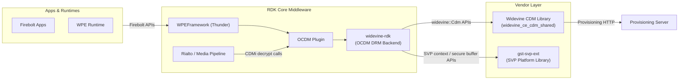
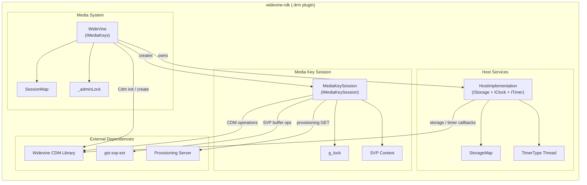
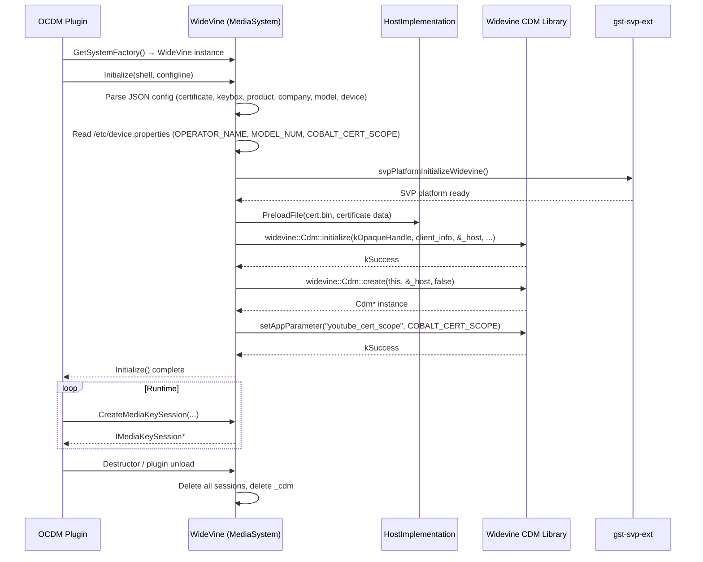
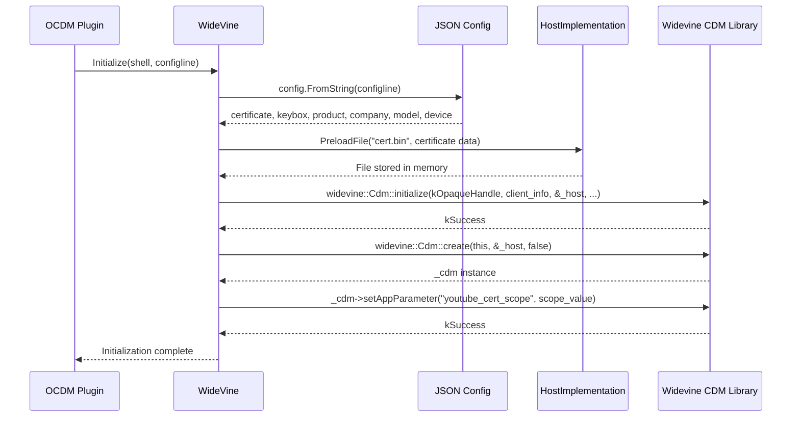
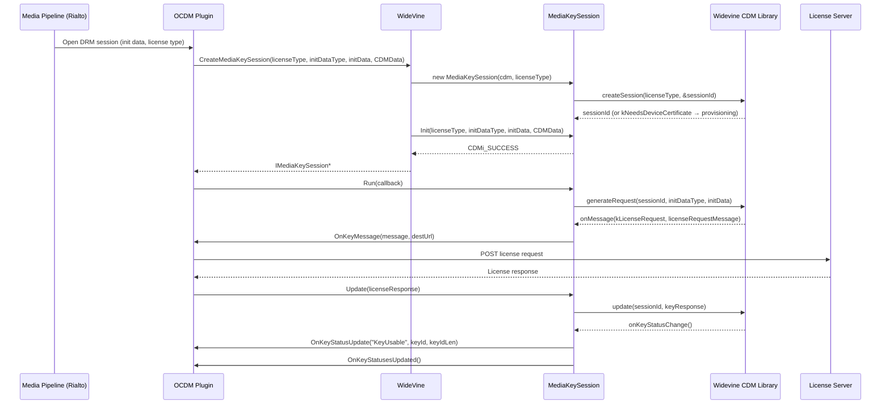
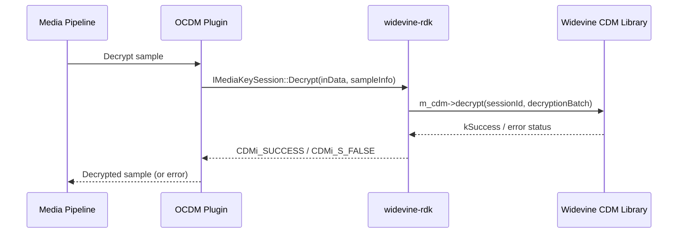
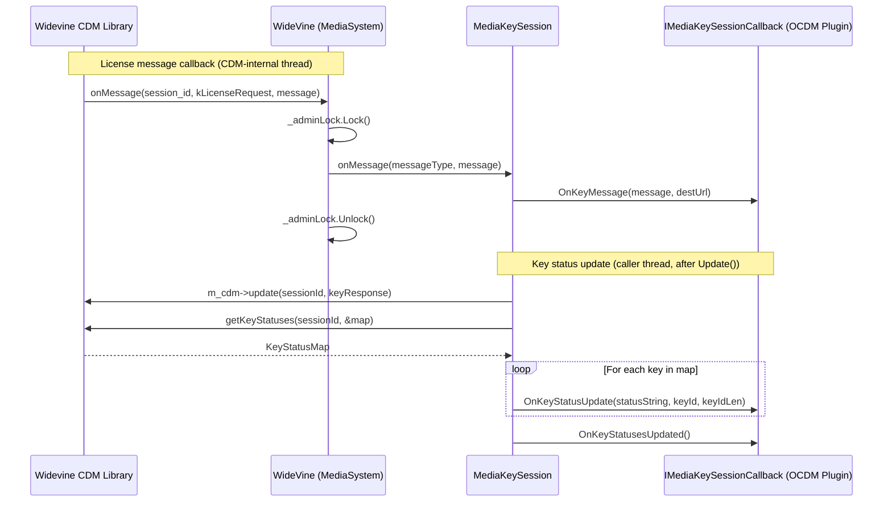

# widevine-rdk

`widevine-rdk` is the RDK-E common OCDM (Open Content Decryption Module) MediaSession implementation for the Widevine DRM system. It operates as a dynamically loaded DRM backend plugin within the WPEFramework/Thunder OCDM framework, bridging the platform-neutral OCDM interface with the vendor-supplied Widevine CDM library. The component handles the complete lifecycle of a protected media session: device provisioning, license acquisition, key status tracking, and the decryption of encrypted audio and video samples passed down from the RDK middleware playback pipeline.

At the device level, widevine-rdk enables playback of Widevine-protected content on RDK-E devices by managing DRM session state on behalf of media pipeline components. It abstracts the details of the Widevine protocol from upper layers, exposing a standard CDMi interface that the OCDM plugin consumes. Secure Video Path (SVP) integration is provided through the `gst-svp-ext` library, routing decrypted video samples directly into hardware-protected memory regions.

At the module level, widevine-rdk provides three coordinated units of functionality: a media system manager that owns the single CDM instance and the map of active sessions, a per-session media key session that drives the license request and decryption workflows, and a host-services implementation that supplies the CDM library with storage, clock, and timer services sourced from the WPEFramework core.



**Key Features & Responsibilities:**

- **Device Provisioning**: When a new session is created and the CDM reports that a device certificate is absent, the component generates a provisioning request, sends it to the provisioning server over HTTPS using libcurl, and processes the response to provision the device before retrying session creation.
- **License Acquisition**: Each `MediaKeySession` drives the Widevine license exchange by calling `generateRequest()` on the CDM, forwarding the resulting license message to the caller via `OnKeyMessage()`, and processing the license server response via `Update()`.
- **Content Decryption**: The `Decrypt()` method constructs a `widevine::Cdm::DecryptionBatch` from incoming sample metadata (IV, key ID, subsamples, encryption scheme) and delegates decryption to `m_cdm->decrypt()`, supporting both AES-CTR (CENC/CENS) and AES-CBC (CBC1/CBCS) encryption schemes.
- **Secure Video Path (SVP)**: When SVP is enabled, decryption output is directed into a hardware-protected secure memory region allocated through `gst-svp-ext`. An SVP token is written back into the output buffer header so downstream pipeline stages can access the protected buffer without exposing cleartext video data in regular memory.
- **Key Status Tracking**: Key status changes from the CDM are translated to string tokens (`KeyUsable`, `KeyExpired`, `KeyOutputRestricted`, `KeyStatusPending`, `KeyInternalError`, `KeyReleased`) and forwarded to the registered `IMediaKeySessionCallback`.
- **Host Services**: The `HostImplementation` provides the Widevine CDM library with in-memory file storage, a monotonic millisecond clock, and a timer service, all built on WPEFramework core primitives.
- **Multi-version CDM Support**: Compile-time version selection via `WIDEVINE_VERSION` adapts initialization signatures and interface usage for Widevine CDM versions 16, 17, and 18.

---

## Design

The component is designed as a shared library (`.drm` extension) loaded at runtime by the WPEFramework OCDM plugin. It implements the CDMi `IMediaKeys` interface in the `WideVine` class and the `IMediaKeySession` interface in `MediaKeySession`, with both classes residing in the `CDMi` namespace. A single `WideVine` instance owns the `widevine::Cdm` object and a session map (`std::map<std::string, MediaKeySession*>`) keyed by session ID. Each entry in the session map corresponds to one active decryption context.

The initialization path in `WideVine::Initialize()` reads a JSON configuration block provided by the OCDM plugin, extracts product/company/model/device identifiers (with fallback to `/etc/device.properties`), optionally pre-loads a DRM certificate into the host storage, and calls `widevine::Cdm::initialize()` followed by `widevine::Cdm::create()`. The resulting CDM handle is retained for the lifetime of the plugin instance.

Northbound interaction with WPEFramework/Thunder is entirely through the CDMi interface. The OCDM plugin calls `CreateMediaKeySession()` to obtain an `IMediaKeySession`, then drives the license exchange by calling `Run()`, `Update()`, and `Decrypt()` on that session. JSON-RPC routing is handled entirely by the OCDM plugin layer; this component exposes only the CDMi interface.

Southbound, the component calls into the Widevine CDM library (`widevine_ce_cdm_shared`) for all DRM operations and into `gst-svp-ext` for SVP secure memory management. Network communication with the provisioning server is performed directly from `MediaSession.cpp` using libcurl, with a write callback aggregating the HTTP response body into a `std::string`.

Data persistence for DRM artifacts (device certificates, keyboxes) is handled in two ways: the keybox path is passed to the CDM via an environment variable (`WIDEVINE_KEYBOX_PATH`), and certificate data is pre-loaded into the in-memory `HostImplementation` storage before the CDM is initialized. The `HostImplementation` uses an STL `std::map<std::string, std::string>` as its backing store; all file access for the CDM library is mediated through this in-memory layer.



### Threading Model

- **Threading Architecture**: Multi-threaded with lock-based synchronization.
- **Main Thread**: Receives OCDM plugin calls (`Initialize`, `CreateMediaKeySession`, `Decrypt`, etc.) and dispatches to the CDM library.
- **Worker Threads**:
  - _widevine (TimerType thread)_: Services timer expiry callbacks registered by the CDM library through `HostImplementation::setTimeout()`. Owned by the `HostImplementation` instance.
- **Synchronization**:
  - `_adminLock` (`WPEFramework::Core::CriticalSection`): Guards the `_sessions` map in the `WideVine` class against concurrent access from CDM event callbacks (`onMessage`, `onRemoveComplete`, `onDeferredComplete`, `onDirectIndividualizationRequest`).
  - `g_lock` (`WPEFramework::Core::CriticalSection`): Serializes individual CDM operations (`load`, `update`, `remove`, `close`, `decrypt`, `getKeyStatuses`) within `MediaKeySession`.
- **Async / Event Dispatch**: CDM library callbacks (`onMessage`, `onRemoveComplete`, `onDeferredComplete`) arrive on the CDM's internal threads. The `WideVine` class routes them under `_adminLock` to the correct `MediaKeySession`, which then invokes the registered `IMediaKeySessionCallback` synchronously. Key status changes following a license update are dispatched synchronously from `MediaKeySession::Update()` via `onKeyStatusChange()`.

### Platform and Integration Requirements

- **Build Dependencies**: `wpeframework`, `wpeframework-clientlibraries`, `wpeframework-tools-native`, `entservices-apis`, `gst-svp-ext`, `gstreamer1.0`, OpenSSL (`libssl`, `libcrypto`), `libcurl`, vendor Widevine CDM library (`widevine_ce_cdm_shared`), platform-specific Widevine adapter libraries (determined at build time via CMake platform flags).
- **Plugin Dependencies**: The widevine-rdk `.drm` library is loaded dynamically by the WPEFramework OCDM plugin at runtime.
- **Device Services / HAL**: The `gst-svp-ext` library provides the SVP platform interface. `svpPlatformInitializeWidevine()` is called once during `WideVine::Initialize()`.
- **Configuration Files**: `/etc/device.properties` (operator name, model number, device name, YouTube cert scope). Keybox and certificate paths are supplied via the OCDM plugin's JSON configuration block.
- **Startup Order**: This component is activated by the OCDM plugin. Startup ordering follows the OCDM plugin's service unit configuration.

---

### Component State Flow

#### Initialization to Active State

The component is initialized when the WPEFramework OCDM plugin loads the `.drm` shared library and calls through the `GetSystemFactory()` entry point. The factory returns a `WideVine` instance. On `Initialize()`, the component reads the JSON configuration, sets up client device identity, initializes the SVP platform, creates the Widevine CDM instance, and sets the YouTube certificate scope parameter.

The component transitions through the following states: **Initializing** (parse JSON config, read device.properties) → **CDMSetup** (call `widevine::Cdm::initialize()` and `widevine::Cdm::create()`) → **Active** (handle `CreateMediaKeySession`, `Decrypt`, CDM event callbacks) → **Shutdown** (session map cleared, CDM instance deleted in destructor).



#### Runtime State Changes

Once active, state changes within a session are driven by license exchange outcomes and CDM callbacks.

**State Change Triggers:**

- When `createSession()` returns `kNeedsDeviceCertificate` (status 101), the session constructor automatically initiates provisioning: a provisioning request is generated, sent to the provisioning server via libcurl, and the response is handled before retrying `createSession()`.
- Key status transitions (`kUsable`, `kExpired`, `kOutputRestricted`, `kReleased`, etc.) are reported to the caller via `IMediaKeySessionCallback::OnKeyStatusUpdate()` and `OnKeyStatusesUpdated()` upon each `onKeyStatusChange()` callback from the CDM.

**Context Switching Scenarios:**

- If `Decrypt()` is called while `USE_SVP` is active and `svpIsDynamicSVPEncEnabled()` returns true, audio streams bypass SVP and are decrypted in-place, while video streams use secure memory paths. This switching occurs per-call based on `IStreamProperties::GetMediaType()`.
- A persistent license session (`kPersistentLicense`) can be loaded from storage via `Load()`, allowing re-use of previously acquired licenses across sessions.

---

### Call Flows

#### Initialization Call Flow



#### Request Processing Call Flow

The most representative call flow is the license acquisition sequence: a new session is created, a license request is generated by the CDM, forwarded to the license server by the caller, and the response is applied back to the session.



---

## Internal Modules

| Module / Class       | Description                                                                                                                                                                                                                                                                                                                                                                    | Key Files                                        |
| -------------------- | ------------------------------------------------------------------------------------------------------------------------------------------------------------------------------------------------------------------------------------------------------------------------------------------------------------------------------------------------------------------------------ | ------------------------------------------------ |
| `WideVine`           | Implements `IMediaKeys`, `widevine::Cdm::IEventListener`, and `IMediaSystemMetrics`. Owns the `widevine::Cdm` instance, the session map, and the `HostImplementation`. Routes CDM event callbacks to the appropriate `MediaKeySession` under `_adminLock`. Registered with the CDMi system factory for MIME types `video/webm`, `video/mp4`, `audio/webm`, `audio/mp4`.        | `MediaSystem.cpp`                                |
| `MediaKeySession`    | Implements `IMediaKeySession`. Manages the per-session lifecycle: initialization, license request generation, license response processing, key status reporting, and sample decryption. Holds the SVP context and secure buffer state when `USE_SVP` is active. Serializes CDM operations with `g_lock`.                                                                       | `MediaSession.cpp`, `MediaSession.h`             |
| `HostImplementation` | Implements `widevine::Cdm::IStorage`, `widevine::Cdm::IClock`, `widevine::Cdm::ITimer`, and (for version 18) `widevine::Cdm::ILogger`. Provides the CDM library with an in-memory key-value file store, a millisecond timestamp from `WPEFramework::Core::Time::Now()`, and timer scheduling via `WPEFramework::Core::TimerType`.                                              | `HostImplementation.cpp`, `HostImplementation.h` |
| `Policy`             | Compile-time constants used by `MediaKeySession`: the license server URL (`kLicenseServer`), an optional embedded default server certificate (`kDefaultServerCertificate`), and CENC init data constants. An additional production provisioning service certificate (`kCpProductionServiceCertificate`) is defined in `MediaSession.cpp` for use during the provisioning flow. | `Policy.h`, `MediaSession.cpp`                   |
| `Module`             | WPEFramework module declaration required for integration with the plugin framework.                                                                                                                                                                                                                                                                                            | `Module.cpp`, `Module.h`                         |

---

## Component Interactions

### Interaction Matrix

| Target Component / Layer     | Interaction Purpose                                                                   | Key APIs / Topics                                                                                                                                                                                                                                                                                                                                                                                      |
| ---------------------------- | ------------------------------------------------------------------------------------- | ------------------------------------------------------------------------------------------------------------------------------------------------------------------------------------------------------------------------------------------------------------------------------------------------------------------------------------------------------------------------------------------------------ |
| **WPEFramework OCDM Plugin** |                                                                                       |                                                                                                                                                                                                                                                                                                                                                                                                        |
| OCDM Plugin                  | Northbound CDMi interface — session creation, decryption, server certificate, metrics | `CDMi::IMediaKeys`, `CDMi::IMediaKeySession`, `CDMi::IMediaSystemMetrics`, `CDMi::IMediaKeySessionCallback::OnKeyMessage`, `OnKeyStatusUpdate`, `OnKeyStatusesUpdated`, `OnError`                                                                                                                                                                                                                      |
| **Vendor Libraries**         |                                                                                       |                                                                                                                                                                                                                                                                                                                                                                                                        |
| `widevine_ce_cdm_shared`     | All DRM operations: CDM lifecycle, session management, decryption                     | `widevine::Cdm::initialize()`, `widevine::Cdm::create()`, `createSession()`, `generateRequest()`, `update()`, `load()`, `remove()`, `close()`, `decrypt()`, `getKeyStatuses()`, `setServiceCertificate()`, `setAppParameter()`, `setVideoResolution()`, `getMetrics()`, `getProvisioningRequest()`, `handleProvisioningResponse()`                                                                     |
| `gst-svp-ext`                | Secure Video Path — secure memory allocation, token generation, context management    | `svpPlatformInitializeWidevine()`, `gst_svp_ext_get_context()`, `gst_svp_ext_free_context()`, `svp_allocate_secure_buffers()`, `svp_release_secure_buffers()`, `svp_buffer_alloc_token()`, `svp_buffer_to_token()`, `svp_buffer_free_token()`, `svpIsDynamicSVPEncEnabled()`, `gst_svp_has_header()`, `gst_svp_header_get_start_of_data()`, `gst_svp_header_get_field()`, `gst_svp_header_set_field()` |
| **External Systems**         |                                                                                       |                                                                                                                                                                                                                                                                                                                                                                                                        |
| Provisioning Server          | Device provisioning over HTTPS                                                        | `curl_easy_perform()` with `WV_PROV_SERVER_URL + "&signedRequest=" + request` (HTTP GET carrying signed provisioning request)                                                                                                                                                                                                                                                                          |
| `/etc/device.properties`     | Device identity fallback for CDM client info                                          | File read: `OPERATOR_NAME`, `MODEL_NUM`, `DEVICE_NAME`, `COBALT_CERT_SCOPE`                                                                                                                                                                                                                                                                                                                            |

### Events Published

| Event Name           | Topic                                            | Trigger Condition                                                                                                              | Subscriber  |
| -------------------- | ------------------------------------------------ | ------------------------------------------------------------------------------------------------------------------------------ | ----------- |
| Key message          | `IMediaKeySessionCallback::OnKeyMessage`         | CDM calls `onMessage()` with `kLicenseRequest`, `kLicenseRenewal`, or `kLicenseRelease`                                        | OCDM Plugin |
| Key status update    | `IMediaKeySessionCallback::OnKeyStatusUpdate`    | After `Update()` processes a license response (`MediaKeySession::onKeyStatusChange()`), or when CDM calls `onRemoveComplete()` | OCDM Plugin |
| Key statuses updated | `IMediaKeySessionCallback::OnKeyStatusesUpdated` | After all per-key `OnKeyStatusUpdate` calls are dispatched                                                                     | OCDM Plugin |
| Error                | `IMediaKeySessionCallback::OnError`              | `generateRequest()` fails; or CDM `update()`/`load()`/`remove()` returns a non-success status                                  | OCDM Plugin |

### IPC Flow Patterns

**Primary Request / Response Flow:**

The OCDM plugin dispatches calls synchronously to the WideVine CDMi interface. The component delegates to the CDM library and returns the result.



**Event Notification Flow:**

CDM library callbacks (`onMessage`, `onRemoveComplete`, `onDeferredComplete`) arrive on CDM-internal threads. The `WideVine` class routes them under `_adminLock` to the corresponding session. Key status updates after a license exchange are dispatched directly from `MediaKeySession::Update()`.



---

## Implementation Details

### Major HAL APIs Integration

| API                                   | Purpose                                                                              | Implementation File                   |
| ------------------------------------- | ------------------------------------------------------------------------------------ | ------------------------------------- |
| `widevine::Cdm::initialize()`         | One-time CDM library initialization with client identity and host service interfaces | `MediaSystem.cpp`                     |
| `widevine::Cdm::create()`             | Creates a CDM instance that manages key sessions                                     | `MediaSystem.cpp`                     |
| `m_cdm->createSession()`              | Opens a new Widevine key session of the specified type (temporary, persistent)       | `MediaSession.cpp`                    |
| `m_cdm->generateRequest()`            | Generates a license request message for a given initialization data type and data    | `MediaSession.cpp`                    |
| `m_cdm->update()`                     | Provides a license server response to the CDM to install keys                        | `MediaSession.cpp`                    |
| `m_cdm->decrypt()`                    | Decrypts an encrypted sample using the installed keys                                | `MediaSession.cpp`                    |
| `m_cdm->getKeyStatuses()`             | Retrieves the current status of all keys in a session                                | `MediaSession.cpp`                    |
| `m_cdm->load()`                       | Loads a persistent license session from storage                                      | `MediaSession.cpp`                    |
| `m_cdm->remove()`                     | Removes a persistent license from storage                                            | `MediaSession.cpp`                    |
| `m_cdm->close()`                      | Closes and releases a key session                                                    | `MediaSession.cpp`                    |
| `m_cdm->setServiceCertificate()`      | Sets a service certificate for encrypted license requests                            | `MediaSystem.cpp`, `MediaSession.cpp` |
| `m_cdm->setAppParameter()`            | Sets CDM application-level parameters (e.g., YouTube cert scope)                     | `MediaSystem.cpp`                     |
| `m_cdm->setVideoResolution()`         | Notifies the CDM of the current video resolution for output protection               | `MediaSession.cpp`                    |
| `m_cdm->getMetrics()`                 | Retrieves CDM telemetry metrics                                                      | `MediaSystem.cpp`                     |
| `m_cdm->getProvisioningRequest()`     | Generates a device provisioning request when no device certificate is present        | `MediaSession.cpp`                    |
| `m_cdm->handleProvisioningResponse()` | Processes the provisioning server response to install a device certificate           | `MediaSession.cpp`                    |
| `svpPlatformInitializeWidevine()`     | Initializes the SVP platform subsystem for Widevine                                  | `MediaSystem.cpp`                     |
| `gst_svp_ext_get_context()`           | Obtains an SVP context handle for the current session                                | `MediaSession.cpp`                    |
| `svp_allocate_secure_buffers()`       | Allocates a hardware-protected secure memory region for a decrypted sample           | `MediaSession.cpp`                    |
| `svp_buffer_to_token()`               | Converts a secure buffer descriptor to an opaque token for downstream use            | `MediaSession.cpp`                    |
| `svp_release_secure_buffers()`        | Releases a previously allocated secure memory region                                 | `MediaSession.cpp`                    |

### Key Implementation Logic

- **State / Lifecycle Management**: Session state is entirely implicit: the `WideVine` session map tracks live sessions, and the `MediaKeySession` destructor calls `Close()` to clean up the CDM session. Session creation with auto-provisioning is implemented inline in the `MediaKeySession` constructor (`MediaSession.cpp`).

- **Provisioning Flow**: Provisioning is triggered when `createSession()` returns status `101` (`kNeedsDeviceCertificate`). The sequence is: optionally set a default provisioning service certificate → `getProvisioningRequest()` → HTTP GET via libcurl (signed request appended to the provisioning URL as a `&signedRequest=` query parameter) → `handleProvisioningResponse()` → retry `createSession()`. This flow is contained in `MediaSession.cpp`.

- **Decrypt Path with SVP**: The `Decrypt()` method in `MediaSession.cpp` checks `svpIsDynamicSVPEncEnabled()` to determine whether SVP applies to the current stream type. For video with SVP, the encrypted data is copied into a secure allocation via `svp_allocate_secure_buffers()`, passed to `m_cdm->decrypt()` as the input buffer, and the resulting secure buffer address is used as the decryption output target. An SVP token (`svp_buffer_to_token()`) is written into the output data header so downstream GStreamer elements can access the protected frame.

- **Error Handling Strategy**: CDM error codes are mapped to CDMi string tokens (`NeedsDeviceCertificate`, `SessionNotFound`, `DecryptError`, `TypeError`, `QuotaExceeded`, `NotSupported`, `UnExpectedError`) and forwarded via `IMediaKeySessionCallback::OnError()`. Decryption failures are logged to stdout with `[RDK_LOG]` prefix. Decryption error recovery is delegated to the calling layer.

- **Logging & Diagnostics**: All log output uses `std::cout` with `[RDK_LOG]` prefix and is gated on the `DEBUG` preprocessor macro (disabled by default). Entry and exit of functions are traced with `ENT_WV` / `EXT_WV` macros when `DEBUG` is defined. The module name for WPEFramework tracing is `OCDM_Widevine` (defined in `Module.h`). WPEFramework `TRACE_L1` is used in `HostImplementation.cpp` for storage operation traces.

---

## Configuration

### Key Configuration Files

| Configuration File                       | Purpose                                                                                                           | Override Mechanism                                                              |
| ---------------------------------------- | ----------------------------------------------------------------------------------------------------------------- | ------------------------------------------------------------------------------- |
| OCDM plugin JSON config (Thunder config) | Supplies certificate path, keybox path, product/company/model/device identity strings to `WideVine::Initialize()` | Set via WPEFramework plugin configuration; parsed using `Core::JSON::Container` |
| `/etc/device.properties`                 | Fallback source for `OPERATOR_NAME`, `MODEL_NUM`, `DEVICE_NAME`, `COBALT_CERT_SCOPE` when not set in JSON config  | Write to file; values are read on each `Initialize()` call                      |

### Key Configuration Parameters

| Parameter                                | Type   | Default                                       | Description                                                                                                                                                                                           |
| ---------------------------------------- | ------ | --------------------------------------------- | ----------------------------------------------------------------------------------------------------------------------------------------------------------------------------------------------------- |
| `certificate`                            | string | —                                             | Filesystem path to a pre-loaded DRM certificate file (`cert.bin`). Loaded into in-memory host storage before CDM initialization.                                                                      |
| `keybox`                                 | string | —                                             | Filesystem path to the Widevine keybox. Set as the `WIDEVINE_KEYBOX_PATH` environment variable for the CDM library.                                                                                   |
| `product`                                | string | `"WPEFramework"`                              | Product name reported to the CDM as `client_info.product_name`.                                                                                                                                       |
| `company`                                | string | value of `OPERATOR_NAME` in device.properties | Company name reported to the CDM as `client_info.company_name`.                                                                                                                                       |
| `model`                                  | string | value of `MODEL_NUM` in device.properties     | Model name reported to the CDM as `client_info.model_name`.                                                                                                                                           |
| `device`                                 | string | `"Linux"`                                     | Device name reported to the CDM as `client_info.device_name`.                                                                                                                                         |
| `WIDEVINE_VERSION` (build-time)          | int    | `16`                                          | Selects the Widevine CDM API version (16, 17, or 18). Derived from Yocto distro features (`widevine_v18` → 18, `widevine_v17` → 17, default → 16). Passed as `-DWIDEVINE_VERSION=<n>` at build time.  |
| `WV_PROV_SERVER_URL_STRING` (build-time) | string | —                                             | Mandatory provisioning server base URL (must include a query parameter). Injected at build time as `-DWV_PROV_SERVER_URL`. The string `&signedRequest=` and the request body are appended at runtime. |

### Runtime Configuration

The CDM session's stream metadata can be updated at runtime through `IMediaKeySession::SetParameter()`:

```bash
# Set media type (drives SVP stream type selection)
SetParameter("mediaType", "video/mp4")

# Set video resolution (forwarded to CDM for output protection)
SetParameter("RESOLUTION", "1920,1080")

# Set SVP RPC ID for gst-svp-ext context binding
SetParameter("rpcId", "<hex_id>")
```

### Configuration Persistence

The keybox path is communicated to the CDM library via the `WIDEVINE_KEYBOX_PATH` environment variable; the CDM library manages keybox reading and persistence. Certificate data is pre-loaded into `HostImplementation`'s in-memory store before CDM initialization. Configuration changes applied through `SetParameter()` are session-scoped and apply for the duration of the active session.

---
