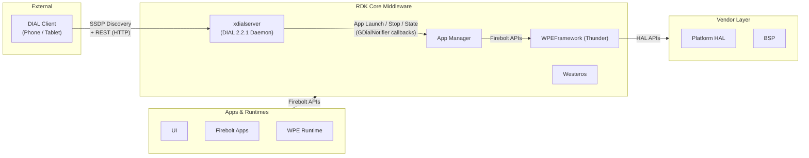
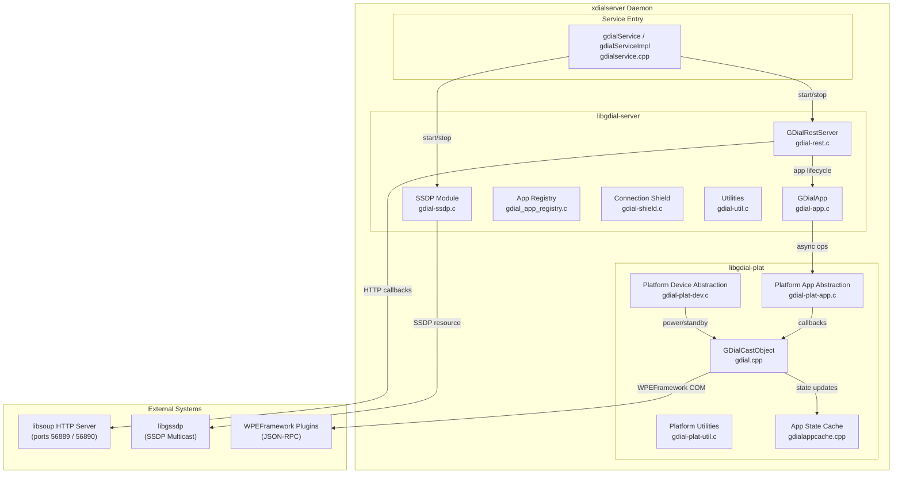
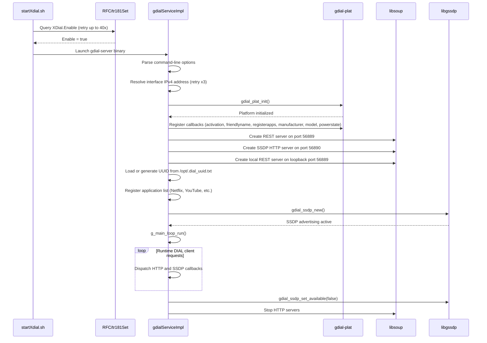
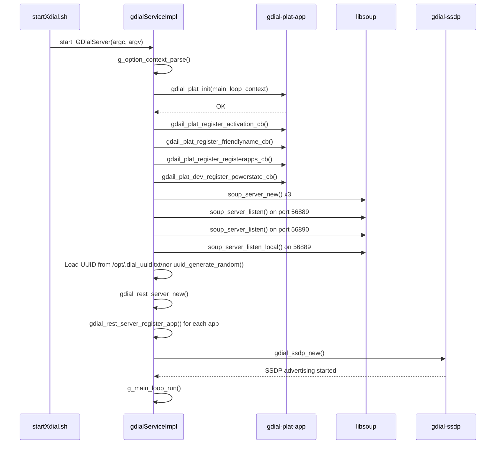
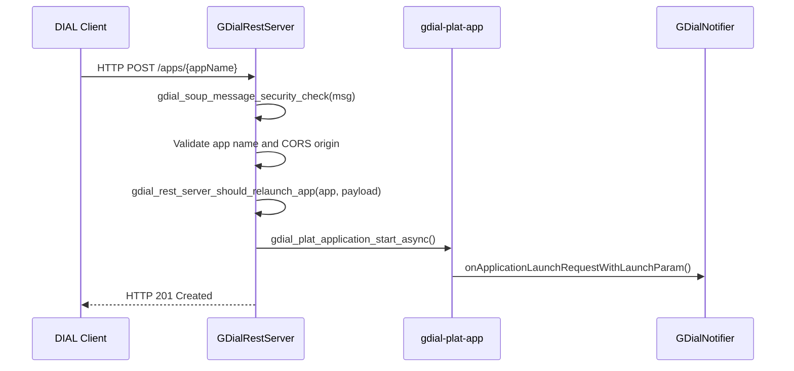
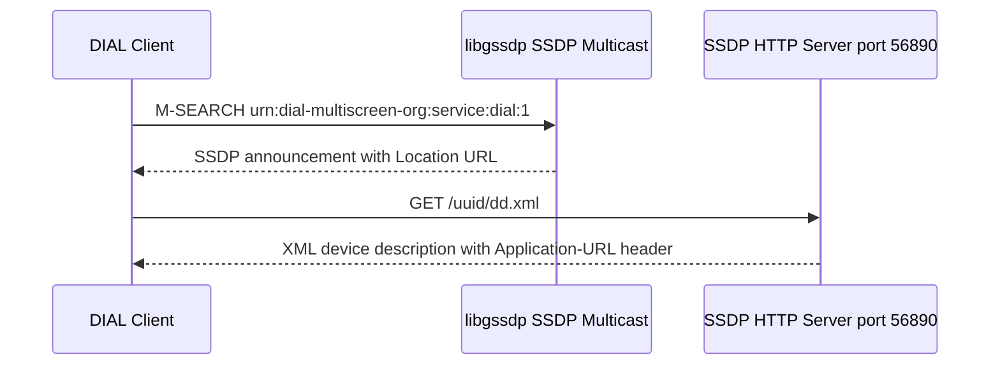
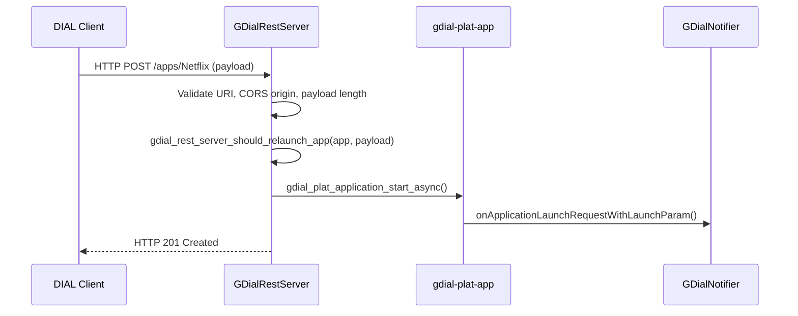
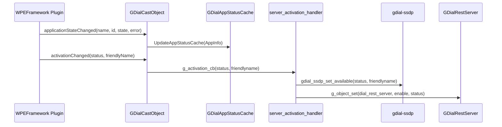

# xdialserver

---

xdialserver is an RDK middleware daemon that implements the DIAL (Discovery and Launch) 2.2.1 protocol, enabling peer devices on the local network — such as smartphones and tablets — to discover the RDK device and remotely launch or control registered streaming applications. The server advertises itself on the local network through SSDP (Simple Service Discovery Protocol) and handles application lifecycle requests from DIAL clients through an HTTP REST interface.

At the device level, xdialserver bridges the gap between external cast clients and the local application ecosystem. A client running on a companion device can discover the RDK device as a cast target, query the availability and state of supported applications, and send launch, stop, hide, resume, or state-query commands. The server translates these protocol-level operations into application management events that are dispatched to the registered application manager or Thunder plugin layer.

At the module level, xdialserver is organized as two shared libraries. The `libgdial-server` library contains the DIAL protocol engine: the REST HTTP server that processes incoming DIAL requests, the SSDP advertising subsystem, application registry management, application instance state tracking, and HTTP connection protection. The `libgdial-plat` library provides the platform integration layer, bridging the protocol engine with the WPEFramework-based application management infrastructure, maintaining an in-memory application state cache, and translating DIAL lifecycle events into callbacks consumed by the upper service layer.



**Key Features & Responsibilities:**

- **DIAL 2.2.1 Protocol Implementation**: Implements the full DIAL 2.2.1 specification, including the REST-based application lifecycle interface and the SSDP-based device discovery advertisement. The protocol version string is defined as `2.2.1` and the XML namespace is `urn:dial-multiscreen-org:schemas:dial`.
- **SSDP Device Discovery**: Advertises the device on the local network using the `urn:dial-multiscreen-org:service:dial:1` service type via the GSSDP library, making the device discoverable by DIAL-compatible clients. The service description XML (`dd.xml`) is served over HTTP on port 56890.
- **REST Application Lifecycle Interface**: Exposes an HTTP REST server on port 56889 that accepts application launch, stop, hide, resume, and state-query requests from DIAL clients, enforcing CORS origin validation per registered application.
- **Application Registry**: Maintains a list of applications registered for DIAL control (Netflix, YouTube, YouTubeTV, YouTubeKids, AmazonInstantVideo, System), with per-application properties including allowed origins, URI prefixes, and singleton configuration.
- **Application State Cache**: Maintains an in-memory cache (`GDialAppStatusCache`) of the last-reported application state for each registered application. Updated by the platform layer when WPEFramework reports state changes, and queried when the platform layer handles application state requests from the REST server.
- **Platform Integration via WPEFramework**: The platform layer communicates with the WPEFramework plugin infrastructure to dispatch application launch, stop, hide, resume, and state requests. It also queries the `org.rdk.AuthService.1.getExperience` JSON-RPC method to determine device experience values used in device identity.
- **RFC-Controlled Activation**: The server's availability on the network is gated by the RFC flag `Device.DeviceInfo.X_RDKCENTRAL-COM_RFC.Feature.XDial.Enable`. Startup is deferred until this RFC value is confirmed. The application list, friendly-name feature, and Wake-on-LAN feature are also RFC-configurable at runtime.
- **HTTP Connection Protection**: The `gdial-shield` subsystem enforces per-connection read timeouts on the HTTP server, closing connections that do not complete their request within the configured window.
- **Power State and Network Standby Handling**: Receives power state change commands (`ON`, `STANDBY`, `TOGGLE`) and network standby mode changes from upper layers, propagating them to the platform device abstraction layer. In network standby mode, a `WAKEUP` header is appended to SSDP advertisements to support Wake-on-LAN.

---

## Design

xdialserver is designed as a self-contained, event-driven daemon using the GLib main loop as its central event dispatcher. The architecture is split into a protocol engine layer (`libgdial-server`) and a platform integration layer (`libgdial-plat`), connected through a set of registered callback functions. This separation keeps the DIAL protocol logic independent of the underlying application management mechanism, allowing the platform layer to be replaced or extended without modifying the protocol engine.

The protocol engine uses `libsoup` as its embedded HTTP server and `libgssdp` for SSDP resource management. Both servers share the same GLib main context, ensuring all network I/O and timer events are handled in a single-threaded, non-blocking loop. Application instances are tracked as GObject-derived `GDialApp` objects, and each registered application has a corresponding `GDialAppRegistry` entry specifying its URI, allowed origins, and singleton behavior. Incoming REST requests are validated for URI length and origin, then dispatched to the appropriate application handler.

The platform layer (`libgdial-plat`) integrates with WPEFramework by creating JSON-RPC connections to registered plugins. Application state changes and activation events received from WPEFramework are forwarded back into the protocol engine via the registered callback interfaces (`gdial_plat_activation_cb`, `gdial_plat_friendlyname_cb`, `gdial_plat_registerapps_cb`, `gdial_plat_manufacturername_cb`, `gdial_plat_modelname_cb`). The `gdialServiceImpl` class owns the GLib main loop and manages the request and response event queues shared between the DIAL server thread and the platform integration thread using mutex and condition variable synchronization.

The northbound interface is the `GDialNotifier` abstract class, which the upper service layer implements to receive application lifecycle events (launch, stop, hide, resume, state query, power state update). The southbound interface to the hardware and platform is mediated through the `gdial-plat-dev` abstraction, which translates power state and network standby commands into the appropriate platform-level callbacks.

The device UUID is persisted at `/opt/.dial_uuid.txt`, created with a randomly generated UUID on first boot and reused on subsequent starts. The registered application list is reconstructed on each startup from RFC configuration (`Device.DeviceInfo.X_RDKCENTRAL-COM_RFC.Feature.XDial.AppList`) and command-line arguments, with application runtime state maintained in-memory through the `GDialAppStatusCache`.



### Threading Model

- **Threading Architecture**: Multi-threaded with a GLib GMainLoop driving all network I/O on a dedicated server thread.
- **Main Thread**: Owns the `gdialServiceImpl` instance, starts the GLib main loop, registers platform callbacks, and creates the three `SoupServer` instances (external REST, local REST, SSDP HTTP).
- **Worker Threads**:
  - _GLib Main Loop Thread_: Runs the GLib event loop; handles all HTTP request callbacks from `libsoup`, SSDP resource events from `libgssdp`, and application state change signals from `GDialApp` objects.
  - _Request Handler Thread_ (gdialServiceImpl): Processes the inbound `RequestHandlerPayload` queue (`APP_STATE_CHANGED`, `ACTIVATION_CHANGED`, `FRIENDLYNAME_CHANGED`, `REGISTER_APPLICATIONS`, `UPDATE_NW_STANDBY`, `UPDATE_MANUFACTURER_NAME`, `UPDATE_MODEL_NAME`) forwarded from the platform layer.
- **Synchronization**: `pthread_mutex_t` protects the SSDP event handling path (`ssdpServerEventSync`). `std::mutex` and `std::condition_variable` are used in `gdialServiceImpl` to coordinate the request/response event queues between threads.
- **Async / Event Dispatch**: Application start and state-query operations are posted as GLib timeout sources (`g_timeout_add`) on the main context, ensuring they execute on the GLib main loop thread rather than on the calling thread.

### Platform and Integration Requirements

- **Build Dependencies**: `libsoup-2.4`, `gssdp`, `glib-2.0`, `openssl`, `c-ares`, `curl`, `util-linux`, `wpeframework`, `wpeframework-clientlibraries`, `entservices-apis`, `iarmmgrs`, `cmake-native`, `libxml-2.0`.
- **Plugin Dependencies**: `org.rdk.AuthService` must be active before startup, as the launch script waits for a successful `getExperience` response before starting the daemon.
- **Device Services / HAL**: Platform interaction for network configuration is performed via POSIX socket `ioctl` calls (`SIOCGIFADDR`, `SIOCGIFHWADDR`) implemented in `gdial-plat-util.c`.
- **Systemd Services**: `tr69hostif.service`, `virtual-wifi-iface.service`, `virtual-moca-iface.service` must be running before `xdial.service` starts, as declared in the `After=` directive.
- **Configuration Files**: `/etc/device.properties`, `/etc/include.properties` (sourced for `MODEL_NUM`, `MFG_NAME`, `MOCA_INTERFACE`, `RDK_PROFILE`, `RDK_PATH`). UUID file: `/opt/.dial_uuid.txt`.
- **Startup Order**: `xdial.service` is ordered after network interface services; the startup script additionally polls the RFC `Device.DeviceInfo.X_RDKCENTRAL-COM_RFC.Feature.XDial.Enable` with up to 40 retries (2-second interval) before starting the server binary.

---

### Component State Flow

#### Initialization to Active State

The xdialserver daemon transitions from startup to active DIAL service through the following stages: **Initializing** (parse command-line options, resolve interface IP) → **Registering** (register platform callbacks, create HTTP server instances) → **Binding** (bind REST server to port 56889, SSDP HTTP server to port 56890, local REST server on loopback) → **SSDP Advertising** (register SSDP resource group on the network interface) → **Active** (processing DIAL client requests) → **Shutdown** (deactivate SSDP advertisement, close servers).



#### Runtime State Changes

During normal operation, the server changes its advertisement and REST availability based on activation signals received from the WPEFramework plugin layer.

**State Change Triggers:**

- **Activation Changed** (`server_activation_handler`): Received when the Thunder plugin calls `ActivationChanged`. When activation is `true`, the SSDP resource group is advertised and the REST server begins accepting requests. When `false`, the SSDP advertisement is withdrawn and the REST server returns `404` for all requests via the throttle callback.
- **RFC Runtime Disable**: The `signal_handler_rest_server_rest_enable` handler processes a REST-enable signal. Setting it to `false` deactivates the server without restarting the process.
- **Power State Change**: `server_powerstate_handler` forwards power state strings (`ON`, `STANDBY`, `TOGGLE`) into the `gdialServiceImpl` request queue for asynchronous processing.
- **Network Standby Mode**: When the platform signals network standby mode, the SSDP module appends a `WAKEUP` header to SSDP announcements (if the `XDial.WolWakeEnable` RFC feature is enabled), allowing Wake-on-LAN capable clients to power on the device.

**Context Switching Scenarios:**

- **FriendlyName Update**: When the Thunder layer calls `FriendlyNameChanged`, `server_friendlyname_handler` updates the SSDP-advertised friendly name, which is reflected in the `dd.xml` response on the next request.
- **RegisterApplications**: When the platform calls `server_register_application`, all previously registered apps are removed from the REST server and the new list is registered, updating CORS and URI handlers dynamically without restarting.

---

### Call Flows

#### Initialization Call Flow



#### Request Processing Call Flow

When a DIAL client sends an application launch request, the REST server validates the request and routes it through the platform layer to the application manager.



---

## Internal Modules

| Module / Class                      | Description                                                                                                                                                                                                                                                                                                           | Key Files                                      |
| ----------------------------------- | --------------------------------------------------------------------------------------------------------------------------------------------------------------------------------------------------------------------------------------------------------------------------------------------------------------------- | ---------------------------------------------- |
| `GDialRestServer`                   | GObject-derived REST HTTP server. Handles DIAL REST requests (launch, stop, hide, resume, state). Manages the registered application list, enforces CORS validation per application, and owns the `SoupServer` instances for both the external and local-loopback interfaces.                                         | `gdial-rest.c`, `gdial-rest.h`                 |
| `gdial-ssdp`                        | Manages SSDP advertisement of the DIAL service on the local network via `libgssdp`. Serves the UPnP device description (`dd.xml`) over HTTP. Handles friendly name, manufacturer, model name, Wake-on-LAN header, and availability updates.                                                                           | `gdial-ssdp.c`, `gdial-ssdp.h`                 |
| `GDialApp`                          | GObject representing a single application instance. Tracks application name, instance ID, state, DIAL data payload, and additional per-instance data. Emits a `state-changed` signal when the platform reports a state update.                                                                                        | `gdial-app.c`, `gdial-app.h`                   |
| `GDialAppRegistry`                  | Per-application registration record. Stores the application URI, allowed CORS origins, URI prefixes, singleton flag, additional-data flag, and properties hash table. Used by `GDialRestServer` to route incoming REST requests.                                                                                      | `gdial_app_registry.c`, `gdial_app_registry.h` |
| `gdial-shield`                      | HTTP connection protection subsystem. Tracks active connections using `GSocket` weak references and enforces read timeouts. Closes connections that do not complete a read within the allowed window.                                                                                                                 | `gdial-shield.c`, `gdial-shield.h`             |
| `gdialService` / `gdialServiceImpl` | Singleton service entry point. `gdialService` provides the public API (application state change, activation, friendly name, registration). `gdialServiceImpl` owns the GLib main loop thread, event queues, and drives the request/response dispatch between the platform layer and the DIAL server.                  | `gdialservice.cpp`, `gdialserviceimpl.h`       |
| `GDialCastObject`                   | Internal class within `libgdial-plat`. Implements the WPEFramework COM interface for receiving plugin callbacks (application state changes, activation, friendly name, app registration). Translates WPEFramework events into calls on the registered C-style platform callbacks.                                     | `gdial.cpp`, `gdial.hpp`                       |
| `GDialAppStatusCache`               | In-memory cache for application state. Keyed by a per-application cache ID. Stores the last-reported `AppInfo` (application name, ID, state, error string). Updated by `GDialCastObject` when the WPEFramework layer reports application state changes; queried by the platform layer when processing state requests. | `gdialappcache.cpp`, `gdialappcache.hpp`       |
| `gdial-plat-app`                    | Platform application abstraction layer. Implements the `gdial_plat_application_*` family of functions (start, stop, hide, resume, state). Routes synchronous and asynchronous application operations from the REST server to the `GDialCastObject`.                                                                   | `gdial-plat-app.c`, `gdial-plat-app.h`         |
| `gdial-plat-dev`                    | Platform device abstraction. Implements power state transitions (`gdial_plat_dev_set_power_state_on`, `gdial_plat_dev_set_power_state_off`, `gdial_plat_dev_toggle_power_state`) and network standby mode changes. Dispatches these events through registered callbacks.                                              | `gdial-plat-dev.c`, `gdial-plat-dev.h`         |
| `gdial-plat-util`                   | Platform utility functions. Provides interface IPv4 and MAC address retrieval via POSIX `ioctl`, and the logging subsystem (`gdial_plat_util_log`).                                                                                                                                                                   | `gdial-plat-util.c`, `gdial-plat-util.h`       |

---

## Component Interactions

xdialserver interacts with external DIAL clients over the network, with WPEFramework plugins for application management and device configuration, and with the platform OS for network interface information and firewall setup.

### Interaction Matrix

| Target Component / Layer                          | Interaction Purpose                                                                                          | Key APIs / Topics                                                                                                  |
| ------------------------------------------------- | ------------------------------------------------------------------------------------------------------------ | ------------------------------------------------------------------------------------------------------------------ |
| **Plugins**                                       |                                                                                                              |                                                                                                                    |
| `org.rdk.AuthService`                             | Retrieves device experience value (`Flex` or other) used to compose device model name for SSDP advertisement | `org.rdk.AuthService.1.getExperience` (JSON-RPC via curl in `startXdial.sh`)                                       |
| WPEFramework plugin layer (via `GDialCastObject`) | Receives application state changes, activation changes, friendly name changes, and app registration lists    | WPEFramework COM interfaces; `Exchange::` plugin IDs                                                               |
| **External Systems**                              |                                                                                                              |                                                                                                                    |
| DIAL Client (phone / tablet)                      | Application discovery, launch, stop, hide, resume, and state query over HTTP                                 | HTTP REST on port 56889; SSDP on `urn:dial-multiscreen-org:service:dial:1`; `dd.xml` on port 56890                 |
| RFC / tr181 parameter store                       | Runtime control of server enable/disable, application list, friendly name feature, WoL feature               | `Device.DeviceInfo.X_RDKCENTRAL-COM_RFC.Feature.XDial.Enable`, `.AppList`, `.FriendlyNameEnable`, `.WolWakeEnable` |
| **OS / Platform**                                 |                                                                                                              |                                                                                                                    |
| Network interface                                 | Bind REST and SSDP servers to the device IP; retrieve MAC for WoL WAKEUP header                              | POSIX `ioctl` (`SIOCGIFADDR`, `SIOCGIFHWADDR`) in `gdial-plat-util.c`                                              |
| iptables                                          | Open ports 56889 (DIAL REST), 56890 (SSDP HTTP), 9081 (Netflix MDX) on the ESTB interface                    | `iptables -I INPUT` in `startXdial.sh`                                                                             |
| UUID file                                         | Persist device UUID across reboots                                                                           | `/opt/.dial_uuid.txt`                                                                                              |

### Events Published

| Event Name                         | GDialNotifier Callback                        | Trigger Condition                                                              | Subscriber Components                     |
| ---------------------------------- | --------------------------------------------- | ------------------------------------------------------------------------------ | ----------------------------------------- |
| Application Launch                 | `onApplicationLaunchRequest()`                | DIAL client sends HTTP POST to `/apps/{appName}` with no launch parameters     | Registered `GDialNotifier` implementation |
| Application Launch with Parameters | `onApplicationLaunchRequestWithLaunchParam()` | DIAL client sends HTTP POST with payload, query string, or additional data URL | Registered `GDialNotifier` implementation |
| Application Stop                   | `onApplicationStopRequest()`                  | DIAL client sends HTTP DELETE to `/apps/{appName}/{instanceId}`                | Registered `GDialNotifier` implementation |
| Application Hide                   | `onApplicationHideRequest()`                  | DIAL client sends HTTP POST to `/apps/{appName}/{instanceId}/hide`             | Registered `GDialNotifier` implementation |
| Application Resume                 | `onApplicationResumeRequest()`                | DIAL client sends HTTP POST to `/apps/{appName}/{instanceId}` (resume)         | Registered `GDialNotifier` implementation |
| Application State Query            | `onApplicationStateRequest()`                 | DIAL client sends HTTP GET to `/apps/{appName}`                                | Registered `GDialNotifier` implementation |
| Power State Update                 | `updatePowerState()`                          | Platform signals a power state change (`ON`, `STANDBY`, `TOGGLE`)              | Registered `GDialNotifier` implementation |

### IPC Flow Patterns

**SSDP Discovery Flow:**

A DIAL client queries the local network via SSDP multicast. The GSSDP resource group responds with the SSDP announcement containing the location of the device description document. The client then fetches `dd.xml` over HTTP, which includes the `Application-URL` header pointing to the DIAL REST base URL.



**Application Launch Flow:**



**Application State Changed Flow:**



---

## Implementation Details

### Major HAL APIs Integration

Platform interaction is performed through OS-level POSIX calls for network interface information and through WPEFramework COM interfaces for application management.

| API / Function                           | Purpose                                                                                                                                | Implementation File |
| ---------------------------------------- | -------------------------------------------------------------------------------------------------------------------------------------- | ------------------- |
| `gdial_plat_util_get_iface_ipv4_addr()`  | Retrieves the IPv4 address of the network interface using `ioctl(SIOCGIFADDR)` to bind the REST and SSDP servers                       | `gdial-plat-util.c` |
| `gdial_plat_util_get_iface_mac_addr()`   | Retrieves the MAC address of the network interface using `ioctl(SIOCGIFHWADDR)` for WAKEUP header construction in network standby mode | `gdial-plat-util.c` |
| `gdial_plat_application_start()`         | Forwards an application start request to the OS-level application handler via `gdial_os_application_start()`                           | `gdial-plat-app.c`  |
| `gdial_plat_application_stop()`          | Forwards an application stop request via `gdial_os_application_stop()`                                                                 | `gdial-plat-app.c`  |
| `gdial_plat_application_hide()`          | Forwards an application hide request via `gdial_os_application_hide()`                                                                 | `gdial-plat-app.c`  |
| `gdial_plat_application_resume()`        | Forwards an application resume request via `gdial_os_application_resume()`                                                             | `gdial-plat-app.c`  |
| `gdial_plat_application_state()`         | Queries the current application state via `gdial_os_application_state()`                                                               | `gdial-plat-app.c`  |
| `gdial_plat_dev_set_power_state_on()`    | Forwards a power-on state change to the registered power state callback                                                                | `gdial-plat-dev.c`  |
| `gdial_plat_dev_set_power_state_off()`   | Forwards a standby power state change to the registered power state callback                                                           | `gdial-plat-dev.c`  |
| `gdial_plat_dev_toggle_power_state()`    | Forwards a toggle power state request to the registered power state callback                                                           | `gdial-plat-dev.c`  |
| `gdial_plat_dev_nwstandby_mode_change()` | Signals a network standby mode change, driving SSDP WAKEUP header management                                                           | `gdial-plat-dev.c`  |

### Key Implementation Logic

- **State / Lifecycle Management**: Application instance lifecycle is tracked in `GDialApp` objects held in the `application_instances_` GLib list. On launch, the REST server checks whether a singleton app instance already exists and whether the launch payload has changed; a relaunch is only triggered if the state is stopped or the payload differs (`gdial_rest_server_should_relaunch_app`). The `gdialServiceImpl` singleton owns the main loop and is created once; `destroyInstance()` cleans up.
  - Core implementation: `gdialservice.cpp`, `gdial-app.c`
  - State transition handlers: `gdial-plat-app.c`, `gdial.cpp`

- **Event Processing**: Platform events arrive via registered C-style callbacks (`gdial_plat_activation_cb`, `gdial_plat_friendlyname_cb`, etc.) registered during initialization. These callbacks post updates synchronously into the SSDP and REST modules on the calling thread. Application start and state-query operations initiated from the REST server are dispatched as GLib `g_timeout_add` sources (with a 100 ms throttle delay defined as `GDIAL_THROTTLE_DELAY_US`) so they execute on the GLib main loop thread.

- **Error Handling Strategy**: HTTP error responses are generated using `gdial_soup_message_set_http_error()`, which sets the `Connection: close` header and the appropriate HTTP status code (400 Bad Request, 403 Forbidden, 404 Not Found, 500 Internal). Application errors reported by the platform (forbidden, unavailable, invalid, internal) are mapped to the corresponding HTTP error codes in the REST response and returned to the DIAL client.

- **Logging & Diagnostics**: The logging subsystem is implemented in `gdial-plat-util.c` with six log levels: FATAL, ERROR, WARNING, INFO, VERBOSE, and TRACE. Log entries include the function name, filename, line number, and thread ID. Macros `GDIAL_LOGINFO`, `GDIAL_LOGERROR`, `GDIAL_LOGWARNING`, `GDIAL_LOGTRACE`, `GDIAL_LOGVERBOSE`, and `GDIAL_LOGFATAL` are used throughout the codebase. Log output is written to standard output.

---

## Configuration

### Key Configuration Files

| Configuration File        | Purpose                                                                                                   | Override Mechanism                         |
| ------------------------- | --------------------------------------------------------------------------------------------------------- | ------------------------------------------ |
| `/etc/device.properties`  | Provides `MODEL_NUM`, `MFG_NAME`, `MOCA_INTERFACE`, `RDK_PROFILE`, `RDK_PATH`; sourced at service startup | Sourced once at launch via `startXdial.sh` |
| `/etc/include.properties` | Provides additional device environment variables; sourced at service startup                              | Sourced once at launch via `startXdial.sh` |
| `/opt/.dial_uuid.txt`     | Persists the device UUID across reboots; auto-generated on first launch if absent                         | Written by the daemon on first run         |

### Key Configuration Parameters

| Parameter                     | Type   | Default                                | Description                                                                                      |
| ----------------------------- | ------ | -------------------------------------- | ------------------------------------------------------------------------------------------------ |
| `--friendly-name`             | string | `DialClient`                           | Friendly name advertised in SSDP and `dd.xml`.                                                   |
| `--manufacturer`              | string | `OEM`                                  | Manufacturer name in `dd.xml`.                                                                   |
| `--model-name`                | string | `Device`                               | Model name in `dd.xml`.                                                                          |
| `--uuid`                      | string | `12345678-abcd-abcd-1234-123456789abc` | UPnP device UUID. Overridden by `/opt/.dial_uuid.txt` at runtime.                                |
| `--ifname`                    | string | `lo`                                   | Network interface name for SSDP and REST server binding.                                         |
| `--app-list`                  | string | (none)                                 | Comma-separated list of applications to register at startup (e.g., `netflix,youtube,youtubetv`). |
| `--feature-friendlyname`      | flag   | disabled                               | Enable dynamic friendly name updates from the platform layer.                                    |
| `--feature-wolwake`           | flag   | disabled                               | Enable Wake-on-LAN WAKEUP header in SSDP announcements during network standby.                   |
| `GDIAL_REST_HTTP_PORT`        | int    | `56889`                                | TCP port for the DIAL REST HTTP server (compile-time constant).                                  |
| `GDIAL_SSDP_HTTP_PORT`        | int    | `56890`                                | TCP port for the SSDP device description HTTP server (compile-time constant).                    |
| `GDIAL_REST_HTTP_MAX_PAYLOAD` | int    | `4096`                                 | Maximum accepted HTTP POST payload size in bytes (compile-time constant).                        |

### Runtime Configuration

The server's availability can be toggled at runtime via the RFC flag, without restarting the process:

```bash
# Enable xdial at runtime via RFC
tr181Set -s Device.DeviceInfo.X_RDKCENTRAL-COM_RFC.Feature.XDial.Enable true

# Update the application list
tr181Set -s Device.DeviceInfo.X_RDKCENTRAL-COM_RFC.Feature.XDial.AppList "netflix,youtube"

# Enable dynamic friendly name updates
tr181Set -s Device.DeviceInfo.X_RDKCENTRAL-COM_RFC.Feature.XDial.FriendlyNameEnable true

# Enable Wake-on-LAN in SSDP
tr181Set -s Device.DeviceInfo.X_RDKCENTRAL-COM_RFC.Feature.XDial.WolWakeEnable true
```

### Configuration Persistence

The device UUID is persisted across reboots at `/opt/.dial_uuid.txt`. The application list is reconstructed from RFC configuration and command-line arguments on each startup. RFC parameter values are managed by the tr181 parameter store and persist across reboots through that mechanism.
