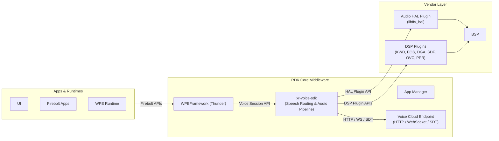
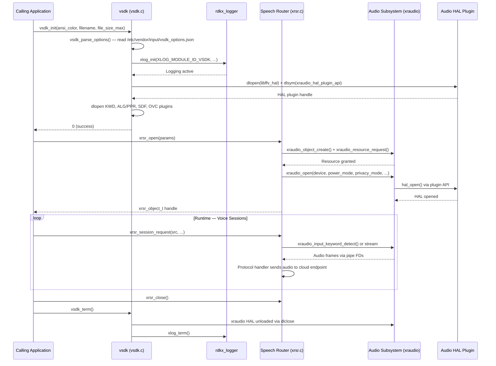
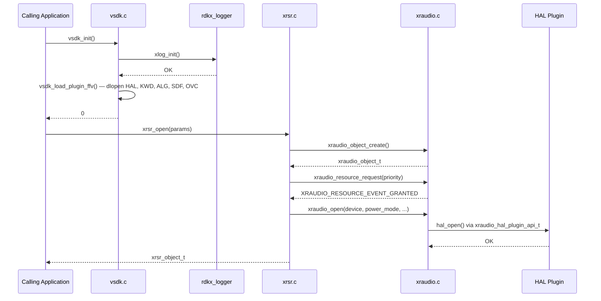
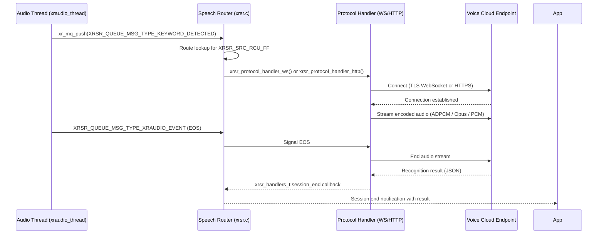
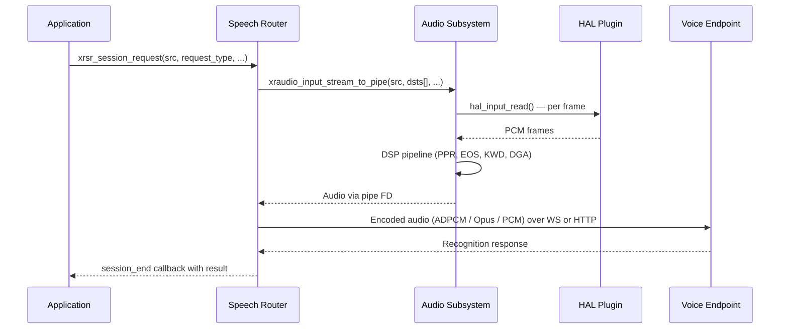
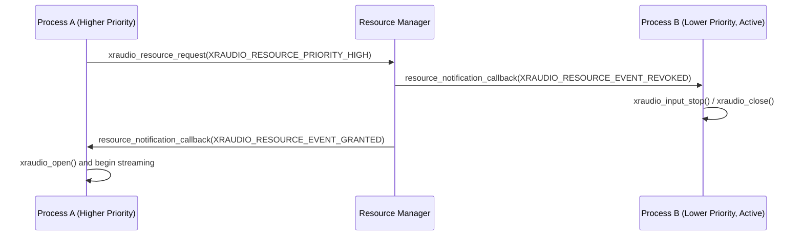

# xr-voice-sdk

xr-voice-sdk is a shared library that manages the capture, processing, and routing of voice audio from connected remote controls and local microphones on RDK-V middleware devices. The SDK accepts audio from push-to-talk (PTT) and far-field (FF) remote control sources as well as local microphone inputs, runs the audio through a configurable DSP pipeline, and routes the processed speech to a cloud or on-device voice recognition endpoint via HTTP, WebSocket, or SDT protocols. It exposes a C API to the calling application and loads hardware-specific audio and signal-processing capabilities at runtime via dynamically linked plugins.

The SDK is structured around three principal concerns: audio acquisition and pipeline processing (xraudio), protocol-aware speech routing (xrsr), and speech endpoint request handling (xrsv). These concerns are internally connected through a message queue and a dedicated speech router thread. The calling application interacts only with the top-level `vsdk` API and the speech router and speech endpoint APIs; all lower-layer audio HAL and DSP plugin interactions are encapsulated within the library.

At the device layer, the SDK integrates with platform audio hardware through a runtime-loaded HAL plugin (`libffv_hal`). Optional DSP processing plugins — keyword detection (KWD), end-of-speech detection (EOS), dynamic gain adjustment (DGA), sound direction finding (SDF), output volume control (OVC), and pre-processing (PPR) — are also loaded dynamically at startup when present on the target filesystem.



**Key Features & Responsibilities:**

- **Multi-Source Audio Capture**: Accepts audio from push-to-talk remote controls (`XRSR_SRC_RCU_PTT`), far-field remote controls (`XRSR_SRC_RCU_FF`), local microphones (`XRSR_SRC_MICROPHONE`), and microphone tap sources (`XRSR_SRC_MICROPHONE_TAP`), routing each through an independent processing pipeline.
- **DSP Plugin Pipeline**: Applies a chain of pluggable DSP processing blocks — keyword detection, end-of-speech detection, dynamic gain adjustment, sound direction finding, output volume control, and pre-processing — each loaded as a discrete shared library plugin at initialization.
- **Protocol-Flexible Speech Routing**: Routes processed audio streams to a remote voice recognition endpoint using HTTP (via libcurl), WebSocket (via libnopoll), or SDT, with all three protocols selectable at build time and managed by dedicated state machine handlers.
- **Voice Activity Detection**: Integrates a software VAD module that can operate in disabled, enabled, or enforced modes, with configurable sensitivity, analysis window, RMS floor, and intro window parameters.
- **Resource Management**: Manages shared audio hardware resources across multiple processes using shared memory and a priority-based resource arbitration model, granting and revoking input/output device access based on request priority.
- **Runtime Audio Encoding**: Supports ADPCM-framed and Opus audio encoding for transmission, with the encoding path compiled conditionally based on the presence of `libopus` at build time.
- **Logging Subsystem**: Provides a self-contained structured logging framework (`rdkx_logger`) with per-module log levels, optional ANSI color output, optional file logging, and optional integration with the Curtail log management system.
- **Thread Health Polling**: Exposes a `vsdk_thread_poll()` API that allows the calling application to verify that the internal speech router thread is responsive.

---

## Design

The SDK is designed as a single shared library (`libxr-voice-sdk.so`) built from a cohesive set of C source modules. The design separates three functional planes: the hardware/DSP plane (xraudio), the transport plane (xrsr), and the endpoint request plane (xrsv). Each plane is independently configurable and interacts with the others through well-defined internal interfaces rather than direct coupling. The `vsdk` layer serves as the lifecycle coordinator, initializing logging and loading HAL and DSP plugins before passing their plugin API handles down into xraudio.

Northbound integration is through the public C API defined in `xr_voice_sdk.h`, `xrsr.h`, and `xrsv.h`. The calling application opens the speech router, configures source-to-destination routes, and initiates voice sessions. Southbound integration is through the audio HAL plugin API defined in `xraudio_hal.h`. The HAL plugin is resolved at runtime via `dlopen`/`dlsym`, allowing the SDK binary to remain hardware-agnostic; the platform-specific audio HAL is supplied separately.

All inter-thread communication within the speech router uses a lightweight message queue (`xr_mq`) and POSIX semaphores rather than shared memory, keeping the design free of complex locking hierarchies. Protocol state transitions in the WebSocket and HTTP handlers are driven by a reusable state machine engine (`xr_sm_engine`). Timers across the SDK are managed through a single timer abstraction (`xr_timer`) backed by `select()` or equivalent.

Configuration for both the audio subsystem and the speech router is read from JSON files at initialization. Default configurations are embedded in `xraudio_config_default.json` and `xrsr_config_default.json`; operator-supplied values can overlay or supplement these defaults at deployment time.

```mermaid
flowchart TD

    subgraph VSDK_LIB["xr-voice-sdk (libxr-voice-sdk.so)"]

        subgraph CoreSub["SDK Lifecycle (vsdk.c)"]
            VSDK_NODE["vsdk_init / vsdk_term / vsdk_thread_poll"]
        end

        subgraph RouterSub["Speech Router (xrsr)"]
            XRSR_NODE["Route and Session Management"]
            PROTO_WS_NODE["WS Protocol Handler"]
            PROTO_HTTP_NODE["HTTP Protocol Handler"]
            PROTO_SDT_NODE["SDT Protocol Handler"]
            SM_NODE["State Machine (xr_sm_engine)"]
            MQ_NODE["Message Queue (xr_mq)"]
        end

        subgraph VrexSub["Speech Endpoint Handler (xrsv)"]
            XRSV_HTTP_NODE["xrsv_http"]
            XRSV_WS_NODE["xrsv_ws_nextgen"]
        end

        subgraph AudioSub["Audio Subsystem (xraudio)"]
            AUDIO_NODE["xraudio core"]
            INPUT_NODE["Audio Input"]
            OUTPUT_NODE["Audio Output"]
            THREAD_NODE["Audio Thread"]
            RSRC_NODE["Resource Manager"]
            VAD_NODE["VAD"]
            ADPCM_NODE["ADPCM Decoder"]
            OPUS_NODE["Opus Decoder"]
        end

        subgraph LogSub["Logging (rdkx_logger)"]
            LOG_NODE["Per-module Log Levels"]
        end

        subgraph UtilSub["Utilities"]
            UTIL_NODE["xr_timer / xr_timestamp / xr_fdc"]
        end

    end

    subgraph PluginSub["Runtime Plugins (dlopen)"]
        HAL_NODE["Audio HAL Plugin (libffv_hal)"]
        KWD_NODE["KWD Plugin"]
        DSP_NODE["DSP ALG Plugin (PPR)"]
        SDF_NODE["SDF Plugin"]
        OVC_NODE["OVC Plugin"]
    end

    subgraph NetSub["Transport Libraries"]
        CURL_NODE["libcurl (HTTP)"]
        NOPOLL_NODE["libnopoll (WebSocket)"]
    end

    VSDK_NODE --> AUDIO_NODE
    VSDK_NODE --> XRSR_NODE
    VSDK_NODE --> HAL_NODE
    VSDK_NODE --> KWD_NODE
    XRSR_NODE --> XRSV_HTTP_NODE
    XRSR_NODE --> XRSV_WS_NODE
    XRSR_NODE --> MQ_NODE
    XRSR_NODE --> SM_NODE
    PROTO_HTTP_NODE --> CURL_NODE
    PROTO_WS_NODE --> NOPOLL_NODE
    AUDIO_NODE --> INPUT_NODE
    AUDIO_NODE --> OUTPUT_NODE
    AUDIO_NODE --> THREAD_NODE
    AUDIO_NODE --> RSRC_NODE
    INPUT_NODE --> VAD_NODE
    INPUT_NODE --> ADPCM_NODE
    INPUT_NODE --> OPUS_NODE
```



#### Threading Model

- **Threading Architecture**: Multi-threaded
- **Main Thread**: Owned by the calling application. Invokes `vsdk_init()`, `xrsr_open()`, session begin/terminate APIs, and `vsdk_thread_poll()`.
- **Worker Threads**:
  - _Speech Router Thread_ (`XRSR_THREAD_MAIN`): Processes all internal speech router message queue events, manages route configuration, session lifecycle, and protocol state transitions. Created during `xrsr_open()` and torn down on `xrsr_close()`.
  - _Audio Thread_ (`xraudio_thread`): Drives the audio frame processing loop — reading frames from the HAL input, running DSP pipeline stages (PPR, KWD, EOS, DGA, SDF), and writing encoded audio into the pipe FDs consumed by the speech router.
  - _Resource Manager Thread_: Runs the audio hardware resource arbitration loop, polling for stale resource holders and granting/revoking access based on priority.
- **Synchronization**: POSIX semaphores are used to synchronize thread startup and message queue operations. Shared memory regions used by the resource manager are protected with file-based locking (`sys/file.h`). The `xraudio_atomic` module provides atomic operations used in the audio input path.
- **Async / Event Dispatch**: The speech router thread posts results back to registered callback functions supplied by the calling application via `xrsr_handlers_t`. Audio pipeline events (EOS, keyword detected, VAD trigger) are conveyed as typed messages delivered to the speech router thread message queue (`xr_mq`).

### Prerequisites and Dependencies

#### Platform and Integration Requirements

- **Build Dependencies**: `libbsd`, `util-linux`, `safec-common-wrapper` or dummy safec API (`SAFEC_DUMMY_API`), `gperf-native` (HTTP log filter hash generation), `jansson` (JSON configuration), `openssl` (TLS for HTTPS/WSS), `libuuid`, `libwebrtc_audio_processing`. Optional: `libcurl` (HTTP protocol), `libnopoll` (WebSocket protocol), `libopus` (Opus audio decoding), `curtail` (log management integration), `rdkversion` (RDK version stamping).
- **Device Services / HAL**: Audio HAL plugin (`libffv_hal`) loaded at runtime via `dlopen`. The plugin must export the `xraudio_hal_plugin_api_t` interface. Optional DSP plugins (`libffv_kwd`, `libffv_alg`, `libffv_sdf`, `libffv_ovc`) must each export their respective plugin API structures. HAL configuration JSON files are provided at build time via Yocto recipe variables (`XRAUDIO_CONFIG_HAL`, `XRAUDIO_CONFIG_KWD`, `XRAUDIO_CONFIG_EOS`, `XRAUDIO_CONFIG_DGA`, `XRAUDIO_CONFIG_SDF`, `XRAUDIO_CONFIG_OVC`, `XRAUDIO_CONFIG_PPR`).
- **Configuration Files**: `/etc/vendor/input/vsdk_options.json` (runtime options: curtail enable, allow input failure); `vsdk_config.json` installed to `SYSCONF`; `rdkx_logger.json` installed to `SYSCONF`; `xraudio_config_default.json` (default audio pipeline configuration); `xrsr_config_default.json` (default speech router configuration including VAD and WebSocket timeout parameters).
- **Startup Order**: The SDK is initialized inline within the calling process, typically a voice control application or middleware daemon.

---

### Component State Flow

#### Initialization to Active State

The SDK transitions through the following states during its lifecycle: **Uninitialized** → **Initializing** (parse vendor options, initialize logging, load FFV HAL and DSP plugins via `dlopen`) → **Active** (speech router running, voice sessions handled) → **Terminated** (plugins unloaded, logging shut down).



#### Runtime State Changes

**State Change Triggers:**

- **Power Mode Update** (`XRSR_QUEUE_MSG_TYPE_POWER_MODE_UPDATE`): The speech router switches between full-power mode (FPM) and low-power mode (LPM) WebSocket connection parameters (different connect check intervals, timeouts, and backoff delays defined in `xrsr_config_default.json`). In LPM, the router may enter networked standby mode (`networked_standby` flag).
- **Privacy Mode Update** (`XRSR_QUEUE_MSG_TYPE_PRIVACY_MODE_UPDATE`): When privacy mode is active, the audio input pipeline withholds audio from being forwarded to the remote endpoint. The current privacy mode state can be queried via `XRSR_QUEUE_MSG_TYPE_PRIVACY_MODE_GET`.
- **Resource Revoked** (`XRSR_QUEUE_MSG_TYPE_XRAUDIO_REVOKED`): If the resource manager revokes audio hardware access (e.g., due to a higher-priority request from another process), the speech router receives a revoke notification and transitions accordingly.
- **Keyword Detected** (`XRSR_QUEUE_MSG_TYPE_KEYWORD_DETECTED`): The audio thread posts a keyword detection message to the speech router, which then initiates a voice session toward the configured destination endpoint.

**Context Switching Scenarios:**

- On receiving `XRSR_POWER_MODE_LOW`, the speech router switches to the LPM WebSocket configuration with longer connect and session timeouts.
- On `XRSR_POWER_MODE_SLEEP`, streaming is suppressed and the `local_mic` flag governs whether the local microphone remains active.

---

### Call Flows

#### Initialization Call Flow



#### Request Processing Call Flow

The speech router receives an audio keyword detection event from the audio thread, assembles session parameters, establishes a connection to the configured voice endpoint, and streams encoded audio until end-of-speech is detected. The recognition response is delivered to the calling application via a registered session-end handler callback.



---

## Internal Modules

| Module / Class         | Description                                                                                                                                                                                                                         | Key Files                                                                             |
| ---------------------- | ----------------------------------------------------------------------------------------------------------------------------------------------------------------------------------------------------------------------------------- | ------------------------------------------------------------------------------------- |
| `vsdk`                 | SDK lifecycle coordinator. Parses vendor options, initializes logging, loads all FFV HAL and DSP plugins via `dlopen`, and exposes the top-level `vsdk_init`, `vsdk_term`, `vsdk_thread_poll`, and log-level APIs.                  | `vsdk.c`, `xr_voice_sdk.h`, `vsdk_private.h`                                          |
| `xrsr` (Speech Router) | Manages audio source-to-destination routing, voice session lifecycle, power and privacy mode, and dispatches audio to the appropriate protocol handler. Runs on a dedicated thread with a message queue for all internal events.    | `xrsr.c`, `xrsr_msgq.c`, `xrsr_xraudio.c`, `xrsr_utils.c`, `xrsr.h`, `xrsr_private.h` |
| `xrsr_protocol_ws`     | WebSocket protocol handler. Manages connection, reconnection backoff, session audio streaming, and message receipt over secure or plain WebSocket connections using libnopoll. Driven by a state machine.                           | `xrsr_protocol_ws.c`, `xrsr_protocol_ws.h`, `xrsr_protocol_ws_sm.h`                   |
| `xrsr_protocol_http`   | HTTP protocol handler. Manages audio streaming over HTTPS using libcurl, including PII-aware request log filtering. Driven by a state machine.                                                                                      | `xrsr_protocol_http.c`, `xrsr_protocol_http.h`, `xrsr_protocol_http_sm.h`             |
| `xrsr_protocol_sdt`    | SDT protocol handler for secure data transfer. Built only when `SDT_ENABLED` is set.                                                                                                                                                | `xrsr_protocol_sdt.c`, `xrsr_protocol_sdt.h`                                          |
| `xrsv_http`            | Speech endpoint handler for the HTTP voice recognition service. Formats session metadata (device ID, receiver ID, partner ID, language), manages session begin/end callbacks, and processes transcription responses.                | `xrsv_http/xrsv_http.c`, `xrsv_http/xrsv_http.h`                                      |
| `xrsv_ws_nextgen`      | Speech endpoint handler for the WebSocket next-generation voice service. Manages message framing, TV control integration, and session response handling.                                                                            | `xrsv_ws_nextgen/xrsv_ws_nextgen.c`, `xrsv_ws_nextgen/xrsv_ws_nextgen.h`              |
| `xraudio`              | Audio subsystem. Creates and manages audio input/output objects, coordinates HAL and DSP plugin interactions, and provides the top-level xraudio API.                                                                               | `xraudio.c`, `xraudio.h`, `xraudio_private.h`                                         |
| `xraudio_input`        | Audio input path. Manages microphone and remote control audio input sessions in idle, recording, streaming, and detecting states. Drives the DSP pipeline (PPR, KWD, EOS, DGA, SDF) per audio frame.                                | `xraudio_input.c`, `xraudio_input.h`                                                  |
| `xraudio_output`       | Audio output path. Manages speaker playback sessions.                                                                                                                                                                               | `xraudio_output.c`, `xraudio_output.h`                                                |
| `xraudio_thread`       | Audio processing thread. Implements the frame-level processing loop, integrates ADPCM and Opus decoders, applies audio gain, and writes frames to the FIFO/pipe destinations consumed by the speech router.                         | `xraudio_thread.c`                                                                    |
| `xraudio_resource`     | Shared memory-based resource manager. Arbitrates access to audio input and output hardware resources across multiple processes using a priority queue and a periodic poll-based health check.                                       | `xraudio_resource.c`                                                                  |
| `xraudio_vad`          | Voice Activity Detection. C++ module integrating the WebRTC audio processing library for VAD.                                                                                                                                       | `xraudio_vad.cpp`, `xraudio_vad.h`                                                    |
| `rdkx_logger`          | Structured, per-module logging subsystem. Supports configurable log levels per module, optional file output, optional ANSI color, and optional Curtail log forwarding. Module configuration loaded from `rdkx_logger_modules.json`. | `xr-logger/rdkx_logger.c`, `rdkx_logger_mw.h`, `rdkx_logger_private.h`                |
| `xr_sm_engine`         | Generic finite state machine engine used by the WebSocket and HTTP protocol handlers to manage connection and session state transitions.                                                                                            | `xr-sm-engine/xr_sm_engine.c`, `xr_sm_engine.h`                                       |
| `xr_mq`                | Lightweight POSIX-based message queue abstraction used for inter-thread communication within the speech router and audio subsystem.                                                                                                 | `xr-mq/xr_mq.c`, `xr_mq.h`                                                            |
| `xr_timer`             | Timer abstraction providing create, set, cancel, and fire operations used across the speech router and audio subsystem.                                                                                                             | `xr-timer/xr_timer.c`, `xr_timer.h`                                                   |
| `xr_timestamp`         | Timestamp utility providing monotonic and wall-clock timestamps used for session statistics and audio timing.                                                                                                                       | `xr-timestamp/xr_timestamp.c`, `xr_timestamp.h`                                       |
| `xr_fdc`               | File descriptor checker utility used to monitor and report open file descriptor counts and enforce soft/hard limits.                                                                                                                | `xr-fdc/xr_fdc.c`, `xr_fdc.h`                                                         |
| `adpcm`                | ADPCM audio decoder used to decode ADPCM-framed audio received from remote controls before streaming.                                                                                                                               | `xr-audio/adpcm/adpcm_decode.c`, `adpcm.h`                                            |
| `xraudio_opus`         | Opus audio decoder wrapper, compiled when `XRAUDIO_DECODE_OPUS` is defined (i.e., when `libopus` is present at build time).                                                                                                         | `xr-audio/opus/xraudio_opus.c`, `xraudio_opus.h`                                      |

---

## Component Interactions

The SDK communicates with the voice cloud endpoint over the network via libcurl (HTTP/HTTPS) or libnopoll (WebSocket/WSS). Internally, the speech router and audio subsystem communicate over message queues and POSIX pipes. The calling application provides route handlers and session callbacks at initialization time.

### Interaction Matrix

| Target Component / Layer        | Interaction Purpose                                                                           | Key APIs / Topics                                                            |
| ------------------------------- | --------------------------------------------------------------------------------------------- | ---------------------------------------------------------------------------- |
| **Audio HAL Plugin**            |                                                                                               |                                                                              |
| `libffv_hal`                    | Open/close audio hardware, provide input PCM frames, control volume                           | `xraudio_hal_plugin_api_t` — `hal_open()`, `hal_close()`, `hal_input_read()` |
| **DSP Plugins**                 |                                                                                               |                                                                              |
| `libffv_kwd`                    | Keyword detection on incoming audio frames                                                    | `xraudio_kwd_plugin_api_t`                                                   |
| `libffv_alg` (PPR)              | Pre-processing: noise suppression, echo cancellation, beamforming                             | `xraudio_ppr_plugin_api_t`                                                   |
| `libffv_sdf`                    | Sound direction finding — determines direction of arrival for beam steering                   | `xraudio_sdf_plugin_api_t`                                                   |
| `libffv_ovc`                    | Output volume control via DSP                                                                 | `xraudio_ovc_plugin_api_t`                                                   |
| **Network Libraries**           |                                                                                               |                                                                              |
| `libcurl`                       | Audio streaming and metadata delivery over HTTP/HTTPS to voice endpoint                       | `curl_easy_setopt()`, `curl_easy_perform()`                                  |
| `libnopoll`                     | WebSocket connection management and audio frame delivery                                      | `nopoll_conn_send_binary()`, `nopoll_conn_get_msg()`                         |
| **Calling Application**         |                                                                                               |                                                                              |
| Application callbacks           | Deliver session begin, session end, and received message events to the caller                 | `xrsr_handlers_t` — `session_begin`, `session_end`, `recv_msg` callbacks     |
| `xrsv_http` / `xrsv_ws_nextgen` | Speech endpoint handlers registered by the application for processing voice service responses | `xrsv_http_create()`, `xrsv_ws_nextgen_create()`                             |

### Events Published

All session and stream events are delivered to the calling application through registered callback functions in `xrsr_handlers_t`.

| Callback / Event                   | Trigger Condition                                                        | Direction                            |
| ---------------------------------- | ------------------------------------------------------------------------ | ------------------------------------ |
| `session_begin`                    | A voice session has started (keyword detected or PTT pressed)            | SDK → Application                    |
| `session_end`                      | Voice session ended (EOS detected, timeout, server disconnect, or error) | SDK → Application                    |
| `recv_msg`                         | A message has been received from the voice cloud endpoint                | SDK → Application                    |
| `resource_notification_callback_t` | Audio hardware resource granted or revoked                               | Resource Manager → Calling component |
| `keyword_callback_t`               | Keyword detection event (detected or error) from audio input             | Audio Thread → Speech Router         |
| `audio_in_callback_t`              | Audio input stream event (EOS, first frame, overflow, VAD, keyword info) | Audio Thread → Speech Router         |

### IPC Flow Patterns

**Primary Audio Streaming Flow:**



**Resource Arbitration Flow:**



---

## Implementation Details

### Major HAL APIs Integration

| HAL / Plugin API                           | Purpose                                                                                                      | Implementation File                                                                         |
| ------------------------------------------ | ------------------------------------------------------------------------------------------------------------ | ------------------------------------------------------------------------------------------- |
| `xraudio_hal_plugin_api_t` — `hal_open()`  | Open the audio hardware device and configure input/output parameters                                         | `xraudio.c`, `xraudio_input.c`                                                              |
| `xraudio_hal_plugin_api_t` — `hal_close()` | Release audio hardware resources                                                                             | `xraudio.c`                                                                                 |
| `xraudio_hal_plugin_api_t` — input read    | Read PCM frames from the audio hardware per processing cycle                                                 | `xraudio_thread.c`                                                                          |
| `xraudio_kwd_plugin_api_t`                 | Run keyword detection on each audio frame; report detection score, SNR, and endpoints                        | `xraudio_input.c`, `xraudio_thread.c`                                                       |
| `xraudio_eos_plugin_api_t`                 | Run end-of-speech detection; report `XRAUDIO_EOS_EVENT_ENDOFSPEECH`, initial timeout, and end timeout events | `xraudio_input.c` — `xraudio_input_eos_run()`                                               |
| `xraudio_dga_plugin_api_t`                 | Calculate and apply dynamic gain adjustment to audio frames                                                  | `xraudio_thread.c`                                                                          |
| `xraudio_sdf_plugin_api_t`                 | Compute sound direction and update beam steering for multi-channel input                                     | `xraudio_input.c` — `xraudio_input_sound_focus_set()`, `xraudio_input_sound_focus_update()` |
| `xraudio_ppr_plugin_api_t`                 | Run DSP pre-processing (noise suppression, beamforming, echo cancellation) per frame                         | `xraudio_input.c` — `xraudio_input_ppr_run()`                                               |

### Key Implementation Logic

- **State / Lifecycle Management**: The `vsdk_global_t` structure in `vsdk.c` tracks the initialized state and all plugin handles. The `xrsr` object (defined in `xrsr_private.h`) tracks open state, power mode, privacy mode, and per-source route configurations. The `xraudio_input_state_t` enumeration (`CREATED`, `IDLING`, `RECORDING`, `STREAMING`, `DETECTING`) drives the audio input path state transitions.
  - Core lifecycle: `vsdk.c`
  - Speech router state: `xrsr.c`, `xrsr_private.h`
  - Audio input state: `xraudio_input.c`, `xraudio_input.h`

- **Event Processing**: Audio processing events (keyword detected, EOS, stream minimum time reached, voice activity, errors) are assembled as typed message structures and pushed onto the speech router's message queue via `xr_mq_push()`. The speech router thread unblocks on `xr_mq_pop()`, dispatches the message to the appropriate handler function, and updates protocol state via the state machine engine. This decoupling ensures the audio thread is never blocked waiting on network operations.

- **Error Handling Strategy**: `xraudio_result_t` error codes from the audio subsystem are logged at the error level and surfaced to the speech router as session end reasons (`xrsr_session_end_reason_t`). The speech router maps these to callback parameters delivered to the application. Network errors in the WebSocket handler trigger a reconnection backoff mechanism with a configurable `backoff_delay` and `retry_cnt`. On audio input open failure, the `xraudio_allow_input_failure` flag (read from vendor options) controls whether the SDK continues initialization or treats the failure as fatal.

- **Logging & Diagnostics**: Logging uses the `rdkx_logger` framework with per-module IDs defined in `rdkx_logger_modules.json`. The active modules and their default levels are: `VSDK`, `XRSR`, `XRAUDIO`, `XRSV`, `XLOG`, `XRMQ`, `XRTIMER`, `XRSTAMP`, `XRFDC`, `XRSM`, `XRBT`, `XRTA`, `VMIC`, `BLE`, `RDKX`, `CTRLM` — all defaulting to `XLOG_LEVEL_INFO`. Log levels can be changed at runtime via `vsdk_log_level_set()` and `vsdk_log_level_set_all()`.

---

## Configuration

### Key Configuration Files

| Configuration File                          | Purpose                                                                                                                                                        | Override Mechanism                                                                                           |
| ------------------------------------------- | -------------------------------------------------------------------------------------------------------------------------------------------------------------- | ------------------------------------------------------------------------------------------------------------ |
| `/etc/vendor/input/vsdk_options.json`       | Runtime vendor options: enable/disable Curtail logging for xlog and xraudio, allow audio input failure                                                         | Replace or modify file on target filesystem                                                                  |
| `vsdk_config.json` (installed to `SYSCONF`) | Combined audio pipeline and speech router configuration derived at build time from HAL, KWD, EOS, DGA, SDF, OVC, PPR JSON inputs and OEM add/subtract overlays | Supplied via Yocto recipe variables; OEM overlay via `XRAUDIO_CONFIG_JSON_ADD` and `XRAUDIO_CONFIG_JSON_SUB` |
| `rdkx_logger.json` (installed to `SYSCONF`) | Per-module log level defaults                                                                                                                                  | Replace file on target; runtime override via `vsdk_log_level_set()`                                          |
| `xraudio_config_default.json`               | Default audio subsystem configuration including DSP plugin section stubs                                                                                       | Embedded in source; overridden by `vsdk_config.json` at runtime                                              |
| `xrsr_config_default.json`                  | Default speech router configuration including WebSocket FPM/LPM timeout parameters and VAD configuration                                                       | Embedded in source; overridden by deployment config at runtime                                               |

### Key Configuration Parameters

| Parameter                         | Type         | Default | Description                                                     |
| --------------------------------- | ------------ | ------- | --------------------------------------------------------------- |
| `ws.fpm.connect_check_interval`   | int (ms)     | `50`    | WebSocket connection check polling interval in full-power mode. |
| `ws.fpm.timeout_connect`          | int (ms)     | `2000`  | WebSocket connection establishment timeout in full-power mode.  |
| `ws.fpm.timeout_inactivity`       | int (ms)     | `10000` | WebSocket inactivity timeout in full-power mode.                |
| `ws.fpm.timeout_session`          | int (ms)     | `5000`  | Voice session maximum duration in full-power mode.              |
| `ws.fpm.ipv4_fallback`            | bool         | `true`  | Fall back to IPv4 if IPv6 connection fails in full-power mode.  |
| `ws.fpm.backoff_delay`            | int (ms)     | `50`    | Reconnection backoff delay in full-power mode.                  |
| `ws.lpm.timeout_connect`          | int (ms)     | `10000` | WebSocket connection establishment timeout in low-power mode.   |
| `ws.lpm.timeout_session`          | int (ms)     | `10000` | Voice session maximum duration in low-power mode.               |
| `ws.lpm.backoff_delay`            | int (ms)     | `100`   | Reconnection backoff delay in low-power mode.                   |
| `xraudio.vad.sensitivity`         | float        | `1.0`   | VAD sensitivity level.                                          |
| `xraudio.vad.analysis_window_ms`  | int (ms)     | `150`   | VAD analysis window duration.                                   |
| `xraudio.vad.audio_rms_level_min` | float (dBFS) | `-78.0` | Minimum RMS audio level for VAD activation.                     |
| `xraudio.vad.intro_window_ms`     | int (ms)     | `100`   | VAD introductory window before speech decision.                 |
| `http.debug`                      | bool         | `false` | Enable libcurl debug output for HTTP protocol.                  |

### Runtime Configuration

Log levels can be adjusted at runtime for any registered module:

```bash
# Change log level for a specific module
vsdk_log_level_set(XLOG_MODULE_ID_XRSR, XLOG_LEVEL_DEBUG);

# Change log level for all modules
vsdk_log_level_set_all(XLOG_LEVEL_DEBUG);
```

### Build-Time Configuration

The following flags are set in the Yocto recipe (`xr-voice-sdk_1.0.bb`) and passed to CMake via `EXTRA_OECMAKE`:

| Flag                      | Default (bb file)                     | Description                                                                                  |
| ------------------------- | ------------------------------------- | -------------------------------------------------------------------------------------------- |
| `HTTP_ENABLED`            | `OFF` (`ENABLE_HTTP_SUPPORT = "0"`)   | Enables the HTTP speech router protocol handler and links `libcurl`.                         |
| `WS_ENABLED`              | `ON` (`ENABLE_WS_SUPPORT = "1"`)      | Enables the WebSocket speech router protocol handler and links `libnopoll`.                  |
| `WS_NOPOLL_PATCHES`       | `ON` (when `WS_ENABLED`)              | Enables nopoll-specific patches in the WebSocket handler.                                    |
| `SDT_ENABLED`             | `OFF` (`ENABLE_SDT_SUPPORT = "0"`)    | Enables the SDT speech router protocol handler.                                              |
| `XRAUDIO_RESOURCE_MGMT`   | `OFF` (`XRAUDIO_RESOURCE_MGMT = "0"`) | Enables shared-memory audio resource management for multi-process arbitration.               |
| `VSDK_DECODE_OPUS`        | `ON` (`VSDK_DECODE_OPUS = "1"`)       | Links `libopus` and enables Opus audio decoding in the audio thread.                         |
| `XLOG_CURTAIL_ENABLED`    | `OFF` (`XLOG_USE_CURTAIL = "0"`)      | Enables integration with the Curtail log forwarding system.                                  |
| `XRAUDIO_CURTAIL_ENABLED` | `OFF` (`XRAUDIO_USE_CURTAIL = "0"`)   | Enables Curtail integration in the xraudio subsystem.                                        |
| `RDK_VERSION_ENABLED`     | `ON` (set unconditionally in recipe)  | Links `rdkversion` and embeds RDK build version information.                                 |
| `VSDK_VENDOR_XLOG`        | `OFF` (CMakeLists default)            | Selects the vendor-layer logging variant of `rdkx_logger` instead of the middleware variant. |

### Configuration Persistence

Log level configuration is read from `rdkx_logger.json` on each SDK initialization. Runtime changes applied via `vsdk_log_level_set()` remain in effect for the lifetime of the current process. Audio pipeline and speech router configurations are read from `vsdk_config.json` at `xrsr_open()` time.
