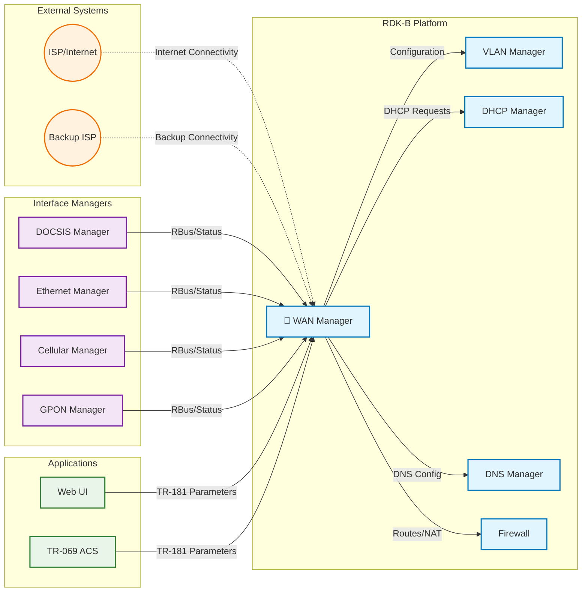
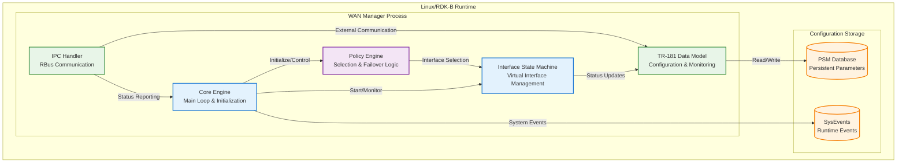
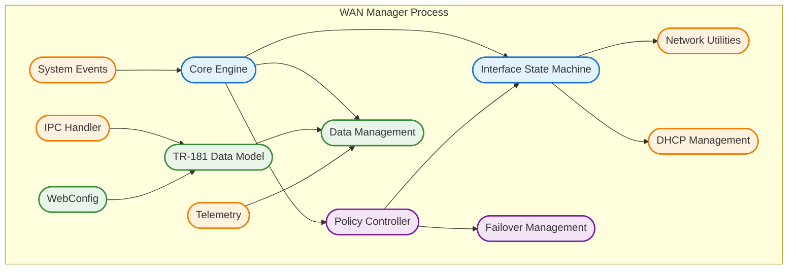
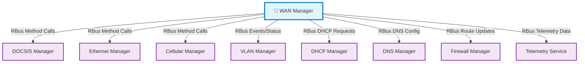
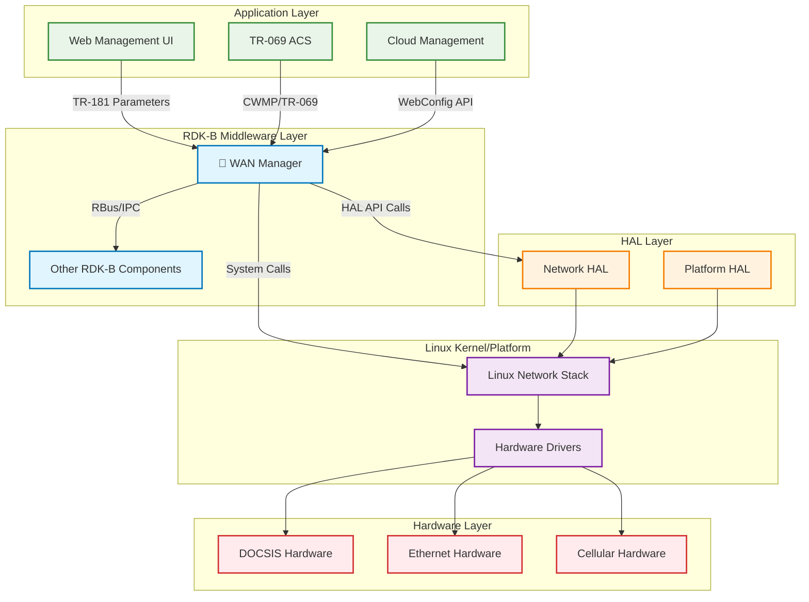
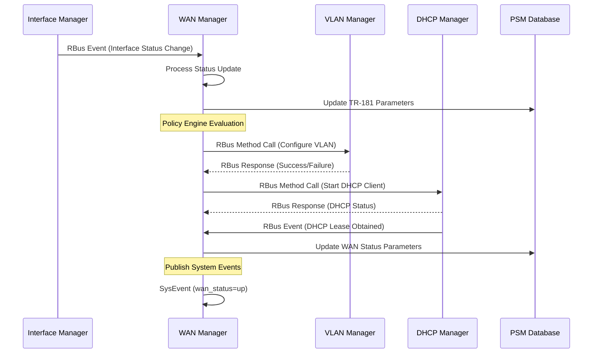

# WAN Manager Documentation

The WAN Manager is a critical RDK-B middleware component responsible for managing all Wide Area Network (WAN) interfaces and their connectivity. It orchestrates WAN interface selection, configuration, failover policies, and ensures Internet connectivity across multiple WAN technologies including DOCSIS, Ethernet, GPON, xDSL, and Cellular. The component acts as the central intelligence for WAN connectivity decisions, interfacing with physical Interface Managers and higher-level RDK-B components to provide seamless Internet access.

- **Multi-Interface Management**: **Coordinates multiple WAN technologies** including DOCSIS, Ethernet, Cellular, GPON, and xDSL, managing their lifecycle and selection priorities.
- **Intelligent Failover Policies**: **Implements various failover strategies** such as Auto WAN, Primary Priority, Fixed Mode, and Parallel Scan to ensure continuous Internet connectivity.
- **Virtual Interface State Machines**: **Manages N instances of virtual interface state machines** that handle the complete network stack configuration from link layer to IP layer protocols.
- **TR-181 Data Model Implementation**: **Provides comprehensive TR-181 parameter support** for remote configuration and monitoring via RBus and WebConfig interfaces.
- **Dynamic Policy Selection**: **Supports runtime switching between different selection policies** per interface group, enabling flexible WAN management strategies.
- **Integration with RDK-B Ecosystem**: **Seamlessly interfaces with VLAN Manager, DHCP Manager, DNS services** and other middleware components for complete network stack management.

## Design

### High‑Level Design Principles

The WAN Manager follows a modular, event-driven architecture built around state machines and policy engines. The design emphasizes separation of concerns where physical Interface Managers handle hardware-specific operations while WAN Manager focuses on higher-level orchestration and business logic. The component supports scalability through configurable interface groups and multiple concurrent state machines, enabling complex multi-WAN scenarios. Security is maintained through controlled TR-181 parameter access and validated configuration changes. Reliability is ensured through robust failover mechanisms, health monitoring, and graceful error handling. The maintainability aspect is addressed through clear module boundaries, comprehensive logging, and standardized IPC mechanisms using RBus for inter-component communication.

The architecture supports loose coupling between physical interface management and WAN logic, allowing new interface types to be added without core changes. Policy-based design enables flexible business rules for interface selection and failover behavior. The state machine approach provides predictable behavior and easier debugging of complex network scenarios.

Interface boundaries are clearly defined with Interface Managers responsible for physical layer status reporting and basic configuration, while WAN Manager handles all link and IP layer configuration. The data model boundary separates TR-181 parameter management from internal data structures, and IPC boundaries isolate WAN Manager from other RDK-B components through standardized message passing.

### C4 Container Diagram

### Design Explanation & Request Flow

- **Request Flow Sequence**: The most critical flow begins when an Interface Manager reports physical layer status via RBus IPC. The WAN Manager Core Engine receives this through the IPC Handler, which updates the internal data model and triggers the Policy Engine. The Policy Engine evaluates current failover rules and interface priorities, potentially selecting a new active interface. If interface switching is needed, the Policy Engine communicates with the Interface State Machine to configure the new virtual interface stack (VLAN, DHCP, routing). The State Machine coordinates with external components (VLAN Manager, DHCP Manager) to establish connectivity, and finally updates TR-181 parameters to reflect the new WAN status.

### Threading Model

The WAN Manager implements a hybrid threading model combining a main event loop with worker threads for specific tasks. The main thread runs the Policy Controller's state machine in a continuous loop with 500ms polling intervals, handling policy decisions and interface management. Worker threads are created on-demand for IPC communication handling, particularly for RBus message processing and responses to external component requests. The Interface State Machines run within the main thread context but maintain separate state for each virtual interface instance. Background processes are spawned for specific tasks like DHCP client operations and network monitoring. Thread synchronization is handled through data locking mechanisms around shared data structures, ensuring consistent access to interface configuration and status information.

## Internal Modules

The WAN Manager consists of several key modules that work together to provide comprehensive WAN interface management. The Core Engine handles initialization, main control loops, and coordinates other modules. The Policy Engine implements various selection strategies and failover logic. The Interface State Machine manages virtual interface lifecycle and network stack configuration. The Data Model module provides TR-181 parameter management and external configuration interface. IPC components handle communication with other RDK-B components and Interface Managers. Utility modules provide network operations, system events handling, telemetry, and DHCP client management.

| Module/Class | Description | Key Files |
|-------------|------------|-----------|
| Core Engine | Main initialization, control loop, and module coordination | `wanmgr_main.c`, `wanmgr_core.c` |
| Policy Controller | Implements failover policies and interface selection algorithms | `wanmgr_controller.c`, `wanmgr_policy_*_impl.c` |
| Interface State Machine | Manages virtual interface state and network stack configuration | `wanmgr_interface_sm.c`, `wanmgr_interface_sm.h` |
| Data Management | Internal data structures and configuration management | `wanmgr_data.c`, `wanmgr_data.h` |
| TR-181 Data Model | Implements TR-181 parameters for external configuration | `wanmgr_dml_apis.c`, `wanmgr_dml.h` |
| IPC Handler | RBus communication and message processing | `wanmgr_ipc.c`, `wanmgr_ssp_messagebus_interface.c` |
| Network Utilities | Network operations and system interface management | `wanmgr_net_utils.c`, `wanmgr_utils.c` |
| DHCP Management | DHCPv4/v6 client operations and event handling | `wanmgr_dhcpv4_apis.c`, `wanmgr_dhcpv6_apis.c` |
| System Events | System event handling and status reporting | `wanmgr_sysevents.c`, `wanmgr_platform_events.h` |
| Failover Management | WAN failover logic and interface switching | `wanmgr_wan_failover.c` |
| Telemetry | Performance monitoring and diagnostic reporting | `wanmgr_telemetry.c`, `wanmgr_t2_telemetry.c` |
| WebConfig | WebConfig protocol support for remote configuration | `wanmgr_webconfig.c`, `wanmgr_webconfig_apis.c` |

## Interaction with Other Middleware Components

The WAN Manager interfaces extensively with other RDK-B middleware components to provide complete WAN connectivity management. Communication with Interface Managers occurs through RBus messaging for physical layer status reporting and configuration. The VLAN Manager receives VLAN configuration requests for interface tagging. DHCP Manager handles IP address acquisition and lease management. DNS Manager receives DNS server configurations. The Firewall component gets routing table updates and NAT configuration changes.

| Component | Purpose of Interaction | Protocols/Mechanisms |
|-----------|-----------------------|----------------------|
| DOCSIS Manager | Physical layer status monitoring and cable modem configuration | RBus events, method calls |
| Ethernet Manager | Ethernet interface status and configuration management | RBus events, status polling |
| Cellular Manager | Cellular modem status, signal strength, and PDP context management | RBus method calls, async events |
| VLAN Manager | VLAN tagging configuration for egress traffic | RBus configuration calls |
| DHCP Manager | IP address lease management and DHCP client control | RBus service requests |
| DNS Manager | DNS server configuration and resolver settings | RBus parameter updates |
| Firewall Manager | Routing table updates, NAT configuration, traffic rules | RBus configuration events |
| Telemetry Service | Performance metrics, connectivity statistics, error reporting | RBus telemetry data publishing |

The WAN Manager publishes several system-wide events and status updates that other components can subscribe to for coordination and monitoring purposes.

| Event | Purpose of Event | Reason for Trigger |
|-----------|-----------------------|----------------------|
| WAN_INTERFACE_ACTIVE | Indicates active WAN interface change | Interface failover completed, new primary interface established |
| WAN_STATUS_CHANGED | Reports overall WAN connectivity status | Internet connectivity gained/lost, interface state transitions |
| INTERFACE_PHY_STATUS | Physical layer status updates | Cable connected/disconnected, cellular signal changes |
| DHCP_LEASE_OBTAINED | DHCP IP address successfully acquired | DHCP client receives valid IP lease from ISP |
| DNS_SERVERS_UPDATED | DNS server configuration changed | New DNS servers received via DHCP or manual configuration |
| WAN_FAILOVER_EVENT | WAN failover operation initiated/completed | Primary interface failure detected, backup interface activated |

## Interaction with Other Layers

The WAN Manager operates within the RDK-B middleware layer and interacts with both lower Hardware Abstraction Layer (HAL) components and upper application layers. HAL interactions involve direct hardware interface management through standardized APIs. Platform-specific layers handle system-level network configuration through Linux networking commands and utilities. External services include ISP connectivity, remote management systems, and cloud-based configuration services.

| Layer/Service | Interaction Description | Mechanism |
|---------------|-------------------------|----------|
| HAL          | Direct hardware interface control and status monitoring | RBus API calls, HAL function calls |
| Platform     | System network configuration, routing, firewall rules | Linux system calls, iptables, ip route commands |
| External ISP | Internet connectivity, DHCP servers, DNS services | DHCP protocol, DNS queries, ICMP connectivity checks |
| TR-069 ACS   | Remote management and configuration updates | TR-069 protocol over CWMP, parameter synchronization |
| WebConfig    | Cloud-based configuration management | HTTPS REST API, JSON configuration payloads |

## IPC Mechanism

| Type of IPC | Message Format | Mechanism |
|---------------|-------------------------|----------|
| RBus Events and Method Calls | JSON-structured messages with method names, parameters, and return values | RBus message bus with publish/subscribe and request/response patterns |
| System Events | Key-value pairs with event names and string values | SysEvents library for inter-process event notification |
| WebConfig Messages | JSON configuration payloads with versioning and validation | HTTPS REST API with JSON message bodies |
| TR-181 Parameter Access | Hierarchical parameter paths with typed values (string, integer, boolean) | Component Software Platform (CSP) framework via RBus |

## TR‑181 Data Models

- **Implemented Parameters**: The WAN Manager implements a comprehensive set of TR-181 parameters under the Device.X_RDK_WanManager object tree, including interface configuration, policy settings, connectivity status, and failover management. Parameters support both read and write operations with proper validation and persistence through PSM.
- **Parameter Registration**: Parameters are registered through the RBus framework during component initialization, with automatic subscription to parameter change events and validation callbacks for configuration updates.
- **Custom Extensions**: The component implements RDK-specific extensions including multi-WAN policy configuration, interface grouping, remote interface management, connectivity validation settings, and telemetry collection parameters.

| Parameter | Description | Access (R/W) | Default | Notes |
|-----------|-------------|-------------|---------|-------|
| `Device.X_RDK_WanManager.Enable` | Master enable/disable for WAN Manager | R/W | `true` | Controls overall WAN management functionality |
| `Device.X_RDK_WanManager.Policy` | Active WAN selection policy | R/W | `AUTOWAN_MODE` | Enum: FIXED_MODE, PRIMARY_PRIORITY, AUTOWAN_MODE, etc. |
| `Device.X_RDK_WanManager.AllowRemoteInterfaces` | Enable remote WAN interfaces | R/W | `false` | Allows mesh/satellite WAN interfaces |
| `Device.X_RDK_WanManager.RestorationDelay` | Failback delay in seconds | R/W | `300` | Time before failing back to primary interface |
| `Device.X_RDK_WanManager.Interface.{i}.Enable` | Per-interface enable control | R/W | `true` | Individual interface activation |
| `Device.X_RDK_WanManager.Interface.{i}.Name` | Interface name identifier | R | varies | System-assigned interface name |
| `Device.X_RDK_WanManager.Interface.{i}.DisplayName` | Human-readable interface name | R/W | varies | User-friendly interface description |
| `Device.X_RDK_WanManager.Interface.{i}.Group` | Interface group assignment | R/W | `1` | Grouping for policy application |
| `Device.X_RDK_WanManager.Interface.{i}.Priority` | Interface selection priority | R/W | `1` | Lower numbers = higher priority |
| `Device.X_RDK_WanManager.Interface.{i}.Status` | Current interface status | R | `Down` | Enum: Up, Down, Unknown, Error |
| `Device.X_RDK_WanManager.Interface.{i}.Type` | Interface type classification | R/W | `PRIMARY` | Enum: PRIMARY, SECONDARY, UNCONFIGURED |
| `Device.X_RDK_WanManager.Interface.{i}.IPMode` | IP stack configuration mode | R/W | `DUAL_STACK` | Enum: IPV4_ONLY, IPV6_ONLY, DUAL_STACK |
| `Device.X_RDK_WanManager.DnsConnectivityCheck.Enable` | Enable DNS-based connectivity validation | R/W | `true` | Custom connectivity testing |
| `Device.X_RDK_WanManager.DnsConnectivityCheck.ServerList` | DNS servers for connectivity tests | R/W | `8.8.8.8,8.8.4.4` | Comma-separated DNS server IPs |

## Implementation Details

- **Key Algorithms or Logic**: The core algorithm is the Policy Engine state machine located in `wanmgr_controller.c` which runs a continuous 500ms polling loop evaluating interface status and policy rules. Selection algorithms are implemented in policy-specific files like `wanmgr_policy_autowan_impl.c` for Auto WAN mode and `wanmgr_policy_pp_impl.c` for Primary Priority mode. The Interface State Machine in `wanmgr_interface_sm.c` implements a comprehensive state machine for virtual interface lifecycle management, handling transitions between INITIALIZING, OBTAINING_IP, CONFIGURING, UP, and DOWN states with proper error handling and recovery logic.

- **Error Handling Strategy**: Errors are detected through multiple mechanisms including RBus call failures, DHCP timeout events, connectivity validation failures, and system event monitoring. Errors are logged using the CcspTrace logging framework with categorized severity levels. Error propagation follows a hierarchical approach where interface-level errors trigger policy reevaluation, policy errors are logged and reported via TR-181 parameters, and critical system errors cause graceful component shutdown with systemd notification.

- **Logging & Debugging**: The component uses RDK-B's standard CcspTrace logging framework with categories including TRACE_LEVEL_ERROR, TRACE_LEVEL_WARNING, TRACE_LEVEL_INFO, and TRACE_LEVEL_DEBUG. Log verbosity is controlled via runtime configuration. Debug hooks include TR-181 parameter dumping, state machine transition logging, policy decision tracing, and network operation logging. Telemetry integration provides performance metrics and error statistics for remote monitoring and debugging.

## Key Configuration Files

| Configuration File | Purpose | Key Parameters | Default Values | Override Mechanisms |
|--------------------|---------|---------------|----------------|--------------------|
| `RdkWanManager.xml` | TR-181 data model definition | Object definitions, parameter types, access controls | N/A | Compile-time customization |
| `RdkWanManager_v2.xml` | Extended TR-181 model for advanced features | Multi-WAN parameters, remote interface support | N/A | Build configuration flags |
| `wanmanager.conf` | Runtime configuration parameters | Policy defaults, timeout values, interface mappings | Policy=AUTOWAN_MODE, Timeout=300s | Environment variables, syscfg overrides |
| `/tmp/wanmanager_initialized` | Component initialization marker | Startup completion flag | Created on successful init | Systemd integration, health monitoring |
| `debug.ini` | Logging configuration | Log levels, output destinations, category filters | TRACE_LEVEL_INFO | Runtime parameter updates |