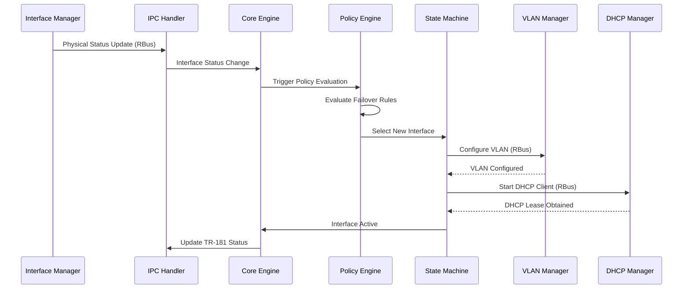
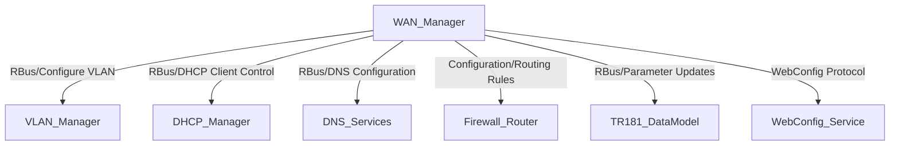
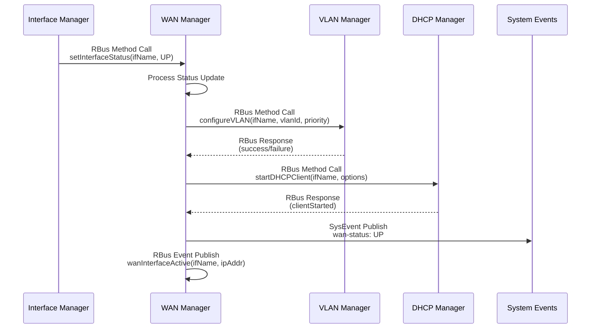

# WAN Manager Documentation

The WAN Manager is a central orchestration component within the RDK-B middleware stack responsible for managing Wide Area Network interfaces across multiple physical technologies. It coordinates interface selection, failover policies, and network stack configuration while providing intelligent business logic for ensuring continuous Internet connectivity. The component abstracts physical interface complexities from higher-level services and implements policy-driven interface management strategies including Auto WAN, Primary Priority, Fixed Mode, and Parallel Scan approaches. WAN Manager integrates with Interface Managers (DOCSIS, Ethernet, Cellular, GPON) to receive physical layer status and coordinates with other RDK-B components like VLAN Manager, DHCP Manager, and DNS services for complete network stack provisioning. It serves as the single point of control for WAN configuration and monitoring, implementing TR-181 data models for remote management via WebConfig and TR-069 protocols.

```mermaid
graph LR
    subgraph External ["External Systems & Users"]
        ISP1[ISP Provider 1]
        ISP2[ISP Provider 2] 
        WEBUI[Web Management UI]
        TR069[TR-069 ACS]
        CloudMgmt[Cloud Management Platform]
    end
    
    subgraph "WAN Management"
        WM[📡 WAN Manager]
        VLAN[VLAN Manager]
        DHCP[DHCP Manager] 
        DNS[DNS Services]
        FW[Firewall/Router]
    end
    
    subgraph InterfaceManagers ["Interface Managers"]
        DOCSIS[DOCSIS Manager]
        ETH[Ethernet Manager]
        CELLULAR[Cellular Manager]
        GPON[GPON Manager]
    end
    
    ISP1 -->|Internet Connectivity| WM
    ISP2 -->|Backup Connectivity| WM
    WEBUI -->|TR-181 Parameters| WM
    TR069 -->|CWMP/TR-069| WM
    CloudMgmt -->|WebConfig API| WM
    
    WM -->|RBus IPC| VLAN
    WM -->|RBus IPC| DHCP
    WM -->|RBus IPC| DNS
    WM -->|Configuration| FW
    
    DOCSIS -->|Physical Status/RBus| WM
    ETH -->|Physical Status/RBus| WM
    CELLULAR -->|Physical Status/RBus| WM
    GPON -->|Physical Status/RBus| WM

    classDef external fill:#ffebee,stroke:#d32f2f,stroke-width:2px;
    classDef component fill:#e1f5fe,stroke:#0277bd,stroke-width:2px;
    classDef manager fill:#f3e5f5,stroke:#7b1fa2,stroke-width:2px;
    classDef app fill:#e8f5e8,stroke:#2e7d32,stroke-width:2px;
    
    class ISP1,ISP2 external;
    class WM,VLAN,DHCP,DNS,FW component;
    class DOCSIS,ETH,CELLULAR,GPON manager;
    class WEBUI,TR069,CloudMgmt app;
```

- **Key Features & Responsibilities**: 
  - **Multi-Interface Management**: **Coordinates multiple WAN technologies** including DOCSIS, Ethernet, Cellular, GPON, and xDSL, managing their lifecycle and selection priorities.
  - **Intelligent Failover Policies**: **Implements various failover strategies** such as Auto WAN, Primary Priority, Fixed Mode, and Parallel Scan to ensure continuous Internet connectivity.
  - **Virtual Interface State Machines**: **Manages N instances of virtual interface state machines** that handle the complete network stack configuration from link layer to IP layer protocols.
  - **TR-181 Data Model Implementation**: **Provides comprehensive TR-181 parameter support** for remote configuration and monitoring via RBus and WebConfig interfaces.
  - **Dynamic Policy Selection**: **Supports runtime switching between different selection policies** per interface group, enabling flexible WAN management strategies.
  - **Integration with RDK-B Ecosystem**: **Seamlessly interfaces with VLAN Manager, DHCP Manager, DNS services** and other middleware components for complete network stack management.

## Design

### High‑Level Design Principles

The WAN Manager follows a modular, event-driven architecture built around state machines and policy engines. The design emphasizes separation of concerns where physical Interface Managers handle hardware-specific operations while WAN Manager focuses on higher-level orchestration and business logic. The component supports scalability through configurable interface groups and multiple concurrent state machines, enabling complex multi-WAN scenarios. Security is maintained through controlled TR-181 parameter access and validated configuration changes. Reliability is ensured through robust failover mechanisms, health monitoring, and graceful error handling. The maintainability aspect is addressed through clear module boundaries, comprehensive logging, and standardized IPC mechanisms using RBus for inter-component communication.

The architecture supports loose coupling between physical interface management and WAN logic, allowing new interface types to be added without core changes. Policy-based design enables flexible business rules for interface selection and failover behavior. The state machine approach provides predictable behavior and easier debugging of complex network scenarios.

Interface boundaries are clearly defined with Interface Managers responsible for physical layer status reporting and basic configuration, while WAN Manager handles all link and IP layer configuration. The data model boundary separates TR-181 parameter management from internal data structures, and IPC boundaries isolate WAN Manager from other RDK-B components through standardized message passing.

### C4 Container Diagram

### Design Explanation & Request Flow

- **Request Flow Sequence**: The most critical flow begins when an Interface Manager reports physical layer status via RBus IPC. The WAN Manager Core Engine receives this through the IPC Handler, which updates the internal data model and triggers the Policy Engine. The Policy Engine evaluates current failover rules and interface priorities, potentially selecting a new active interface. If interface switching is needed, the Policy Engine communicates with the Interface State Machine to configure the new virtual interface stack (VLAN, DHCP, routing). The State Machine coordinates with external components (VLAN Manager, DHCP Manager) to establish connectivity, and finally updates TR-181 parameters to reflect the new WAN status.

### Threading Model

The WAN Manager implements a hybrid threading model combining a main event loop with worker threads for specific tasks. The main thread runs the Policy Controller's state machine in a continuous loop with 500ms polling intervals, handling policy decisions and interface management. Worker threads are created on-demand for IPC communication handling, particularly for RBus message processing and responses to external component requests. The Interface State Machines run within the main thread context but maintain separate state for each virtual interface instance. Background processes are spawned for specific tasks like DHCP client operations and network monitoring. Thread synchronization is handled through data locking mechanisms around shared data structures, ensuring consistent access to interface configuration and status information.

## Internal Modules

The WAN Manager consists of several key modules that work together to provide comprehensive WAN interface management. The Core Engine handles initialization, main control loops, and coordinates other modules. The Policy Engine implements various selection strategies and failover logic. The Interface State Machine manages virtual interface lifecycle and network stack configuration. The Data Model module provides TR-181 parameter management and external configuration interface. IPC components handle communication with other RDK-B components and Interface Managers. Utility modules provide network operations, system events handling, telemetry, and DHCP client management.

| Module/Class | Description | Key Files |
|-------------|------------|-----------|
| Core Engine | Main initialization, control loop, and module coordination | `wanmgr_main.c`, `wanmgr_core.c` |
| Policy Controller | Implements failover policies and interface selection algorithms | `wanmgr_controller.c`, `wanmgr_policy_*_impl.c` |
| Interface State Machine | Manages virtual interface state and network stack configuration | `wanmgr_interface_sm.c`, `wanmgr_interface_sm.h` |
| Data Management | Internal data structures and WAN interface configuration data | `wanmgr_data.c`, `wanmgr_data.h` |
| TR-181 Data Model | TR-181 parameter implementation and DML APIs | `wanmgr_dml_*.c`, `wanmgr_apis.h` |
| IPC Handler | RBus communication and external component messaging | `wanmgr_ipc.c`, `wanmgr_ssp_messagebus_interface.c` |
| Network Utilities | Network configuration, routing, and utility functions | `wanmgr_net_utils.c`, `wanmgr_net_utils.h` |
| DHCP Management | DHCPv4/v6 client coordination and IP address management | `wanmgr_dhcpv4_*.c`, `wanmgr_dhcpv6_*.c` |
| System Events | System event handling and inter-process notifications | `wanmgr_sysevents.c`, `wanmgr_sysevents.h` |
| Failover Management | WAN failover detection and coordination logic | `wanmgr_wan_failover.c`, `wanmgr_wan_failover.h` |
| Telemetry | Performance monitoring and diagnostic reporting | `wanmgr_telemetry.c`, `wanmgr_t2_telemetry.c` |
| WebConfig | WebConfig protocol support for remote configuration | `wanmgr_webconfig.c`, `wanmgr_webconfig_apis.c` |

## Interaction with Other Middleware Components

The WAN Manager coordinates with multiple RDK-B middleware components to provide comprehensive network management. It communicates with VLAN Manager for virtual LAN configuration, DHCP Manager for IP address assignment, DNS services for name resolution, and Firewall/Router components for traffic routing. Each interaction uses RBus IPC mechanisms with specific message types and data structures. The component also interfaces with TR-181 data model components for parameter management and WebConfig services for remote configuration capabilities.

| Component | Purpose of Interaction | Protocols/Mechanisms |
|-----------|-----------------------|----------------------|
| VLAN Manager | Configure virtual LAN interfaces for WAN traffic segmentation | RBus IPC, VLAN configuration messages |
| DHCP Manager | Control DHCP client operations for IP address assignment | RBus IPC, DHCP lease management |
| DNS Services | Configure DNS servers and resolver settings for WAN interfaces | RBus IPC, DNS configuration parameters |
| Firewall/Router | Update routing tables and firewall rules for WAN traffic | System calls, iptables configuration |
| TR-181 Data Model | Synchronize WAN parameters with TR-181 data model | RBus IPC, parameter notification messages |
| WebConfig Service | Receive remote configuration updates via WebConfig protocol | HTTP/HTTPS, JSON configuration data |

The WAN Manager publishes several key events to notify other components of significant WAN state changes and operational events. These events enable loosely coupled integration and allow other services to react appropriately to WAN interface changes.

| Event | Purpose of Event | Reason for trigger |
|-----------|-----------------------|----------------------|
| `wan-status` | WAN interface status change notification | Published when WAN interface transitions between UP/DOWN states |
| `wan_service_ready` | WAN Manager service initialization complete | Published when WAN Manager completes startup and is ready to handle requests |
| `ipv4_wan_addr_set` | IPv4 address assignment notification | Published when WAN interface successfully obtains IPv4 address via DHCP |
| `ipv6_wan_addr_set` | IPv6 address assignment notification | Published when WAN interface successfully obtains IPv6 address via DHCPv6 or SLAAC |
| `wan_interface_active` | Active WAN interface change notification | Published when failover policy selects a new active WAN interface |
| `dhcp_wan_state_changed` | DHCP client state change notification | Published when DHCP client state machine changes (discover, offer, request, bound) |

## Interaction with Other Layers

The WAN Manager integrates across multiple layers of the RDK-B software stack, from application layer management interfaces down to hardware abstraction layers. It receives configuration from web UIs, TR-069 ACS, and cloud management platforms through TR-181 parameters. The component interfaces with HAL layers for hardware-specific network operations and communicates directly with the Linux network stack for routing and interface configuration.

| Layer/Service | Interaction Description | Mechanism |
|---------------|-------------------------|----------|
| Web Management UI | Receives WAN configuration and policy settings via TR-181 parameters | HTTP/TR-181 parameter access |
| TR-069 ACS | Remote management and configuration via CWMP protocol | TR-069/CWMP parameter management |
| Cloud Management | WebConfig-based remote configuration and monitoring | HTTPS/WebConfig protocol |
| HAL Layer | Hardware-specific network interface operations and status queries | HAL API calls, shared libraries |
| Platform Services | System event handling, persistent storage, and logging services | SysEvents, PSM database, system calls |
| Linux Network Stack | Direct network interface configuration, routing table updates | Netlink sockets, system calls (ip, ifconfig) |

## IPC Mechanism

The WAN Manager uses RBus as its primary IPC mechanism for communication with other RDK-B components and Interface Managers. RBus provides a D-Bus based messaging system optimized for RDK environments, supporting both synchronous request-response patterns and asynchronous event notifications.

| Type of IPC | Message Format | Mechanism |
|---------------|-------------------------|----------|
| RBus Method Calls | JSON-structured method parameters with typed arguments including strings, integers, booleans, and complex objects | RBus/D-Bus method invocation with response handling |
| RBus Event Notifications | JSON event payloads containing event name, source component, and event-specific data fields | RBus publish-subscribe event broadcasting |
| System Events | Key-value pairs with event names and string-based parameter values for inter-process notifications | SysEvents shared memory and file-based event system |
| WebConfig Protocol | JSON configuration documents with versioning, validation, and rollback support for remote management | HTTP/HTTPS transport with JSON payload structure |

## TR‑181 Data Models

The WAN Manager implements comprehensive TR-181 data model support for remote management and monitoring. The component provides both standard TR-181 Device.X_RDK_WanManager parameters and custom extensions for RDK-B specific functionality. Parameters are registered through RBus for runtime access and support both read-only status reporting and read-write configuration management.

- **Implemented Parameters**: The WAN Manager implements the Device.X_RDK_WanManager object tree with support for interface configuration, policy management, failover settings, and status monitoring. Parameters include interface enable/disable control, policy selection (Auto WAN, Fixed Mode, Primary Priority), failover timeouts, and interface group configuration.
- **Parameter Registration**: Parameters are registered via RBus during startup using the data model XML files (RdkWanManager.xml, RdkWanManager_v2.xml). The registration process creates method handlers for get/set operations and establishes event notification capabilities.
- **Custom Extensions**: 
  - **X_RDK_WanManager.Policy**: **Custom policy selection parameter** supporting Auto WAN, Fixed Mode, Primary Priority, and Parallel Scan modes
  - **X_RDK_WanManager.AllowRemoteInterfaces**: **Custom parameter** enabling support for remote interface management in multi-CPE scenarios
  - **X_RDK_WanManager.WanFailoverData**: **Custom JSON data structure** for complex failover configuration and coordination between interface groups

| Parameter | Description | Access (R/W) | Default | Notes |
|-----------|-------------|-------------|---------|-------|
| `Device.X_RDK_WanManager.Enable` | Master enable/disable for WAN Manager service | R/W | `true` | Controls WAN Manager operation |
| `Device.X_RDK_WanManager.Policy` | WAN interface selection policy | R/W | `AUTOWAN_MODE` | Enum: Fixed Mode, Auto WAN, Primary Priority, Parallel Scan |
| `Device.X_RDK_WanManager.AllowRemoteInterfaces` | Enable remote interface management support | R/W | `false` | For multi-CPE scenarios |
| `Device.X_RDK_WanManager.ResetActiveInterface` | Trigger active interface reset | W | `false` | Write-only trigger parameter |
| `Device.X_RDK_WanManager.RestorationDelay` | Delay before interface restoration attempts | R/W | `60` | Seconds, range 10-3600 |
| `Device.X_RDK_WanManager.Interface.{i}.Enable` | Individual interface enable/disable | R/W | `true` | Per-interface control |
| `Device.X_RDK_WanManager.Interface.{i}.Group` | Interface group assignment | R/W | `1` | Group number 1-8 |
| `Device.X_RDK_WanManager.Interface.{i}.Priority` | Interface selection priority within group | R/W | `1` | Lower numbers = higher priority |
| `Device.X_RDK_WanManager.Interface.{i}.SelectionTimeOut` | Interface validation timeout | R/W | `120` | Seconds, minimum 20 |
| `Device.X_RDK_WanManager.Interface.{i}.Status` | Current interface operational status | R | `Down` | Enum: Down, Initializing, Up, Error |

## Implementation Details

- **Key Algorithms or Logic**: 
  - **Policy State Machines**: **Core selection algorithms implemented in `wanmgr_policy_*_impl.c` files** using state machine patterns for Auto WAN (sequential interface testing), Primary Priority (priority-based failover), Fixed Mode (single interface operation), and Parallel Scan (concurrent interface validation)
  - **Interface State Machine**: **Virtual interface lifecycle management in `wanmgr_interface_sm.c`** coordinating link layer setup, IP address assignment, route configuration, and connectivity validation through sequential state transitions
  - **Failover Detection**: **Network connectivity monitoring logic in `wanmgr_wan_failover.c`** using periodic connectivity tests, DNS resolution checks, and interface status monitoring to trigger failover decisions
- **Error Handling Strategy**: Errors are detected at multiple levels including RBus communication failures, DHCP client failures, and network connectivity issues. All errors are logged via CcspTrace mechanisms with component-specific logging levels. Critical errors trigger appropriate recovery actions such as interface reset, policy re-evaluation, or service restart. Error states are reflected in TR-181 parameters for remote monitoring.
- **Logging & Debugging**: The component uses RDK-B standard logging with configurable verbosity levels (Error, Warning, Info, Debug). Log categories include policy decisions, interface state changes, IPC communications, and DHCP operations. Debug logging provides detailed state machine transitions and timing information for troubleshooting connectivity issues.

## Key Configuration Files

The WAN Manager configuration is primarily data-driven through TR-181 parameters with some build-time configuration through XML data model definitions. The component supports both compile-time feature selection and runtime parameter configuration for maximum flexibility across different deployment scenarios.

| Configuration File | Purpose | Key Parameters | Default Values | Override Mechanisms |
|--------------------|---------|---------------|----------------|--------------------|
| `RdkWanManager.xml` | TR-181 data model definition for basic WAN Manager functionality | `Enable`, `Policy`, `Interface objects` | `Enable=true`, `Policy=AUTOWAN_MODE` | Runtime TR-181 parameter updates |
| `RdkWanManager_v2.xml` | Extended TR-181 data model with enhanced interface management | `Version`, `Interface groups`, `Virtual interface support` | Enhanced interface table structure | Runtime configuration via WebConfig |
| `/nvram/wanmanager.conf` | Persistent configuration storage (if present) | Interface priorities, policy settings, timeouts | System-dependent defaults | Direct file editing, factory reset |
| `configure.ac` | Build-time feature configuration | `--enable-wanunificationsupport`, `--enable-gtestapp` | Feature flags disabled by default | Configure script parameters |
