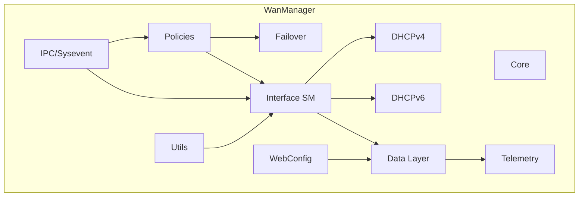
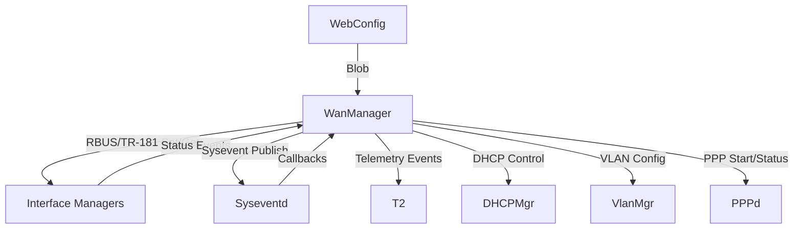
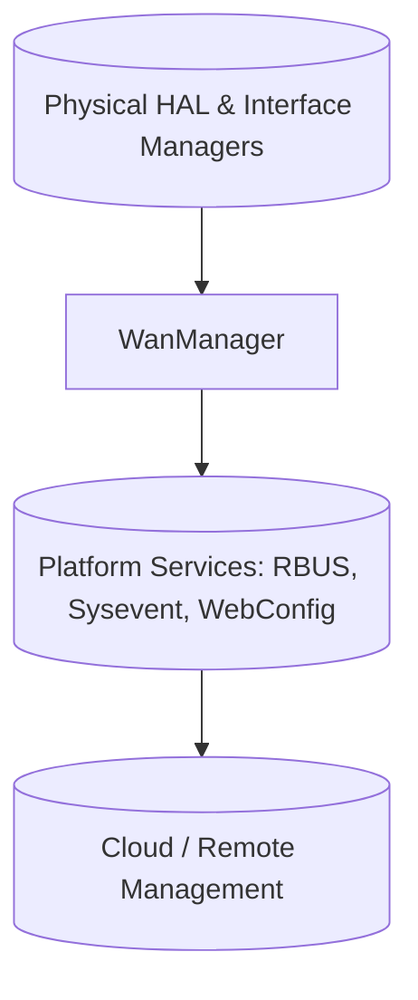
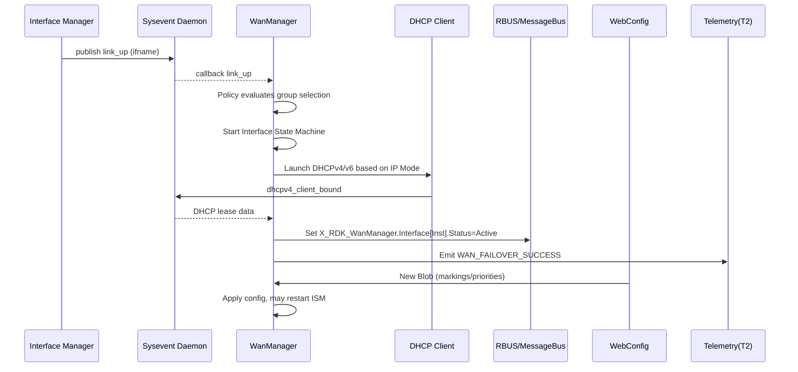

# WanManager Documentation

WAN Manager (RdkWanManager) orchestrates WAN interface selection, activation, failover, IP layer provisioning (IPv4/IPv6), DHCP lifecycle, MAP-T / DS-Lite transitions, and policy‑driven runtime behavior for residential broadband gateways in the RDK‑B stack. It mediates between physical/technology‑specific Interface Managers (DOCSIS, Ethernet, DSL, GPON, Cellular, etc.) and higher‑level platform services (telemetry, configuration, WebConfig, RBUS/TR‑181). It centralizes multi‑interface decision logic, maintains TR‑181 state, processes remote configuration (WebConfig), and exposes operational status and control points. Below is the full filled template per the provided workflow and guidelines.

- **Key Features & Responsibilities**:  
  - **Interface Abstraction & Normalization**: Aggregates heterogeneous underlying access technologies into a unified selection and state model via TR‑181.  
  - **Selection Policies**: Implements AutoWAN, Parallel Scan, priority and other policy algorithms to choose an active interface per group.  
  - **Failover & Restoration**: Monitors active groups, triggers failover, restoration delays, and emits telemetry on success/failure.  
  - **Per‑Interface State Machines**: Runs a deterministic stack bring‑up/tear‑down sequence (link → VLAN → IP (v4/v6) → MAP-T / DS-Lite / PPP) for each virtual interface.  
  - **DHCP (IPv4 & IPv6) Lifecycle Management**: Handles client configuration, option tables, renewals, and propagates lease / prefix data to data model and MAP-T logic.  
  - **Configuration & Remote Control**: Consumes WebConfig blobs, RBUS updates, TR‑181 setters (Enable, Policies, Markings, VirtualInterface modes).  
  - **Telemetry & Event Publishing**: Emits structured telemetry (T2), sysevents, and WAN failover event markers.  
  - **QoS / Traffic Marking Support**: Manages interface and VLAN marking tables (DSCP / Ethernet priority).  
  - **MAP-T / DS-Lite Support**: Integrates IPv6 transition configuration via DHCPv6 received options and dedicated sub‑objects.  
  - **Multi‑Group Coordination**: Allows multiple interface groups each with its own selection policy and cross‑group failover governance.  

## Design

### High‑Level Design Principles

The design emphasizes deterministic state transitions, pluggable policy logic, data‑model transparency, and resilience to partial failures. Modularity separates policy decision layers (selection/failover) from per‑interface orchestration (state machine). Scalability is achieved via per‑virtual‑interface controllers and group abstractions supporting future interface types. Reliability is reinforced by watchdog‑style sysevent feedback, structured telemetry, and restoration timers. Security considerations involve minimizing external surface (only exposed via vetted TR‑181 parameters / RBUS / WebConfig) and validating blob inputs before commit. Maintainability is ensured through distinct modules (*_core, *_controller, *_policy_*, *_dhcp*, *_ipc, *_webconfig, *_data). Extensibility is enabled via well‑scoped APIs and TR‑181 dynamic tables (Interface, VirtualInterface, Marking, VLAN, DHCP clients). Boundaries:  
- Policy / Failover: Chooses which interface(s) should be active.  
- State Machine: Executes ordered configuration tasks.  
- Data Layer: Centralized access to config/state structures & TR‑181 reflection.  
- IPC / Eventing: Sysevent, RBUS, message bus, WebConfig ingestion.  
Responsibilities: policy modules never directly manipulate low-level net commands; they request transitions via state machine / data abstractions. Data model modules ensure persistence & exposure; IPC layer isolates protocol specifics (sysevent tokens, RBUS handlers).  

### C4 Container Diagram

```mermaid
graph TD
    %% Classes
    classDef user fill:#fff3e0,stroke:#ef6c00,stroke-width:2px;
    classDef component fill:#e1f5fe,stroke:#0277bd,stroke-width:2px;
    classDef external fill:#e8f5e8,stroke:#2e7d32,stroke-width:2px;
    classDef service fill:#f3e5f5,stroke:#7b1fa2,stroke-width:2px;
    classDef infra fill:#eceff1,stroke:#455a64,stroke-width:2px;

    subgraph CPE["CPE Runtime (Linux/RDK-B)"]
        subgraph WanMgrProc["wanmanager Process"]
            Core[Core Init & Main Loop\nwanmgr_core.c / wanmgr_main.c]
            Policy[Policy & Failover Controllers\nwanmgr_controller.c\nwanmgr_policy_*.c\nwanmgr_wan_failover.c]
            ISM[Interface State Machines\nwanmgr_interface_sm.c]
            DHCP[DHCPv4/v6 APIs\nwanmgr_dhcpv4_apis.c\nwanmgr_dhcpv6_apis.c]
            IPC[IPC & Sysevents\nwanmgr_ipc.c\nwanmgr_sysevents.c]
            Data[Data / TR-181 Access\nwanmgr_data.c]
            WebCfg[WebConfig Handler\nwanmgr_webconfig_apis.c]
            Telemetry[T2 / Telemetry\nwanmgr_t2_telemetry.c\nwanmgr_telemetry.c]
            Utils[Utilities & Net Ops\nwanmgr_net_utils.c\nwanmgr_utils.c]
        end

        subgraph InterfaceManagers["Interface Managers"]
            DOCSIS[(DOCSIS Mgr)]
            ETH[(Ethernet Mgr)]
            XDSL[(xDSL Mgr)]
            LTE[(Cellular Mgr)]
            GPON[(GPON Mgr)]
        end

        VLANMgr[(VLAN Manager)]
        PPPProc[(PPP Daemon / pppd)]
        DHCPMgr[(DHCP Manager)] 
        RBUS[(RBUS / Message Bus)]
        Sysev[(Sysevent Daemon)]
        WebConfig[("WebConfig Subsystem")]
        T2[(Telemetry (T2))]
    end

    Cloud[(Operations / Cloud)]:::external
    Internet[((Internet))):::external

    DOCSIS --|Status/IP Mode|--> Policy
    ETH --|Status|--> Policy
    XDSL --|Status|--> Policy
    LTE --|Status|--> Policy
    GPON --|Status|--> Policy
    Policy --> ISM
    ISM --> DHCP
    ISM --> VLANMgr
    ISM --> PPPProc
    DHCP --> DHCPMgr
    WebCfg --> WebCfg
    WebCfg --> Data
    RBUS <---> Data
    Data --> Telemetry
    Telemetry --> T2
    Policy --> Sysev
    Sysev --> Policy
    ISM --> Sysev
    DHCP --> Sysev
    ISM --> Utils
    Utils --> Internet
    WanMgrProc --> Cloud
```

### Design Explanation & Request Flow

- **Request Flow Sequence**: A typical lifecycle: (1) Interface Manager signals link up via RBUS / sysevent; (2) Policy decides selection for its group; (3) Interface State Machine instantiates configuration pipeline (VLAN setup, IP mode decision, DHCPv4/v6 start, MAP-T or DS-Lite if needed); (4) DHCP events update TR‑181 nodes; (5) Failover monitors health and triggers migration if loss detected; (6) Telemetry events emitted; (7) WebConfig blob (if received) alters marking, priorities, remote allowance, triggering re‑validation. A sequence diagram is included under IPC Mechanism for IPC flow clarity.

### Threading Model (if applicable)

- Main control thread initializes core subsystems and launches controllers.  
- Per Virtual Interface State Machine threads (or worker contexts) manage interface configuration and status transitions.  
- DHCP event handling callbacks triggered asynchronously (sysevent or IPC).  
- Failover controller loop monitors timers (GroupSelectionTimer, FailOverTimer).  
- WebConfig handling executes in callback context, updating data then signaling refresh flags.  
- Telemetry publishing may use asynchronous emission path (non-blocking).  
- Assumption: RBUS / sysevent client library callbacks run on internal library threads; WanManager confines heavy logic to its own control paths.  

## Internal Modules

| Module/Class | Description | Key Files |
|-------------|------------|-----------|
| Core Initialization | Bootstraps data, message bus binding, launches controllers | `wanmgr_core.c`, `wanmgr_main.c` |
| Policy Controller | Applies selection policies per group (Auto, Parallel Scan, etc.) | `wanmgr_controller.c`, `wanmgr_policy_*_impl.c` |
| Failover Controller | Runtime failover scanning & restoration logic, telemetry events | `wanmgr_wan_failover.c` |
| Interface State Machine (ISM) | Deterministic bring-up/tear-down of virtual interface stack | `wanmgr_interface_sm.c` |
| Data Layer & Structures | Synchronized access to config, interface lists, groups, virtual interfaces | `wanmgr_data.c`, `wanmgr_data.h` |
| DHCPv4 / DHCPv6 APIs | TR‑181 exposed client lifecycle, renewals, option tables | `wanmgr_dhcpv4_apis.c/.h`, `wanmgr_dhcpv6_apis.c/.h` |
| DHCP Event Handling | Processes IPC / sysevent state changes, updates IP info | `wanmgr_dhcp_event_handler.c`, `wanmgr_dhcp_client_events.h` |
| IPC Server | Handles WAN Manager client requests & forced DHCP renew | `wanmgr_ipc.c`, `wanmgr_ipc.h` |
| Sysevents Integration | Subscribes & publishes sysevents (status, timers, mapping) | `wanmgr_sysevents.c/.h` |
| WebConfig Integration | Parses blob, updates markings, remote interface allowance | `wanmgr_webconfig_apis.c`, `wanmgr_webconfig.c` |
| Telemetry (T2) | Emits T2 counters and structured WAN failover events | `wanmgr_t2_telemetry.c`, `wanmgr_telemetry.c` |
| Message Bus / RBUS Bridge | SSP message bus interface & RBUS accessors | `wanmgr_ssp_messagebus_interface.c/.h`, `wanmgr_rbus_handler_apis.*` |
| Utilities / Net Ops | Helper functions (IP, interface queries, timers, parsing) | `wanmgr_net_utils.c/.h`, `wanmgr_utils.c/.h` |
| Policy Implementations | AutoWAN, Parallel Scan, Primary Priority variants | `wanmgr_policy_auto_impl.c`, `wanmgr_policy_autowan_impl.c`, `wanmgr_policy_parallel_scan_impl.c`, `wanmgr_policy_pp_impl.c`, `wanmgr_policy_ppob_impl.c`, `wanmgr_policy_fm_impl.c`, `wanmgr_policy_fmob_impl.c` |
| MAP-T / DS-Lite Support | DHCPv6 option ingestion, MAP / DS-Lite state tracking | DHCPv6 & MAP-related handlers |
| Marking & VLAN Handling | Manage DSCP / Ethernet priority marking & VLAN table entries | DML: marking / vlan functions in DML APIs |
| Controller Data Structures | Policy controller, failover controller, interface SM control blocks | `wanmgr_controller.h`, `wanmgr_wan_failover.h`, `wanmgr_interface_sm.h` |



## Interaction with Other Middleware Components

WAN Manager consumes events from Interface Managers (physical link status, IP capabilities), interacts with VLAN Manager for tagging, DHCP Manager (if external) or internal DHCP logic fallback, PPP daemon for PPP/IPCP state, Telemetry (T2) for metrics, WebConfig for remote config updates, RBUS/TR‑181 for configuration & status, and Sysevent for asynchronous signaling (MAP-T, IPv6 prefix changes, DHCP state). It publishes state and failover transitions, interface up/down and selection changes, and telemetry events.



| Component | Purpose of Interaction | Protocols/Mechanisms |
|-----------|-----------------------|----------------------|
| Interface Managers (DOCSIS/Eth/DSL/LTE) | Provide physical/link status, IP mode hints | RBUS, Sysevent |
| VLAN Manager | Apply VLAN tagging per virtual interface | System calls / netlink (indirect via utils) |
| DHCP Manager (optional) | Manage DHCP clients if external manager present | Sysevent, IPC |
| PPP Daemon | Establish PPP sessions | Process control, sysevent |
| Telemetry (T2) | Publish WAN-related metrics/events | T2 API |
| WebConfig | Receive remote configuration (markings, remote allow) | WebConfig blob callback |
| RBUS / Message Bus | Expose TR‑181 parameters and receive set operations | RBUS / CCSP message bus |
| Sysevent Daemon | Event distribution (prefix, MAP-T, DHCP states) | Sysevent API |
| Cloud / OSS | Consume telemetry & configuration state | Indirect via T2 & TR‑181 |

Events published or broadcast:

| Event | Purpose of Event | Reason for trigger |
|-----------|-----------------------|----------------------|
| `WAN_FAILOVER_SUCCESS` | Telemetry success marker | New group/interface activated |
| `WAN_FAILOVER_FAIL` | Telemetry failure marker | Failover attempt unsuccessful |
| `WAN_RESTORE_SUCCESS` | Log restoration to preferred path | Primary group restored |
| `WAN_RESTORE_FAIL` | Restoration failed | Attempt to return to primary failed |
| `mapt_config_flag` (sysevent) | Indicate MAP-T configuration change | DHCPv6 MAP-T options received |
| `dhcpv4_client_*` / `dhcpv6_client_*` | Lease / state transitions | DHCP event handlers |
| Interface Status (Up/Down/Validating) | State machine progression | Physical or IP layer changes |

## Interaction with Other Layers

WAN Manager sits between interface technology abstraction (HAL-proxied Interface Managers) and platform services (configuration, telemetry, cloud). It abstracts per-technology differences, surfaces consistent TR‑181 nodes, and orchestrates IP layer formation.

| Layer/Service | Interaction Description | Mechanism |
|---------------|-------------------------|----------|
| HAL / Interface Managers | Receive link operational status, configuration hints | RBUS, Sysevent |
| Platform (Sysevent, RBUS, WebConfig) | Eventing, configuration, dynamic updates | Sysevent API, RBUS API, WebConfig callbacks |
| External (Cloud Telemetry, Remote mgmt) | Telemetry consumption, remote config | T2 upload, WebConfig delivery |



## IPC Mechanism

| Type of IPC | Message Format | Mechanism |
|-------------|----------------|----------|
| Sysevent | Key=Value string pairs (e.g., DHCP lease fields, MAP-T flags) | Sysevent client API |
| RBUS / CCSP Message Bus | TR‑181 parameter operations (Get/Set, table row add/del) | RBUS / CCSP bus calls |
| Internal IPC Server | Structured messages (types like ipoe health check, DHCP renew triggers) | `WanMgr_StartIpcServer` over local domain / FIFO (ipc_msg abstraction) |
| WebConfig Blob | Binary/JSON blob parsed into `WanMgr_WebConfig_t` | WebConfig callback |
| Telemetry (T2) | Keyed metric/event emission | T2 client API |
| DHCP Client Hooks | Environment / sysevent callbacks parsed into structures | Sysevent + internal parsing |

Detailed IPC Flow Diagram:



## TR‑181 Data Models

- **Implemented Parameters**: Core root object `X_RDK_WanManager` with sub-objects: `Group`, `Interface`, `Interface.Selection`, `Interface.Marking`, `Interface.VirtualInterface` (and sub objects `IP`, `PPP`, `MAP`, `DSLite`, `Marking`, `VLAN`), DHCPv4 Client tables (`DHCPv4.Client.*`), DHCPv6 Client tables (`DHCPv6.Client.*`), MAP-T/DS-Lite receive option parameters (`X_RDKCENTRAL-COM_RcvOption.*`).
- **Parameter Registration**: Functions listed in `RdkWanManager_v2.xml` map to implementation handlers (e.g., `WanIf_GetEntry`, `WanIf_SetParamStringValue`, `WanVirtualIf_GetParamBoolValue`) exposed via RBUS / CCSP message bus.
- **Custom Extensions**:  
  - `X_RDK_WanManager.*` root object: RDK-specific WAN orchestration tree.  
  - `WanFailoverData` JSON/string for remote interface allowance & failover tuning.  
  - MAP-T specific receive options (`MapTransportMode`, `MapBRPrefix`, etc.).  
  - Marking tables enabling per-interface QoS classification.  

Representative Parameters (subset):

| Parameter | Description | Access (R/W) | Default | Notes |
|-----------|-------------|-------------|---------|-------|
| `X_RDK_WanManager.Enable` | Master enable/disable WAN Manager logic | R/W | Implementation-defined | Boolean |
| `X_RDK_WanManager.AllowRemoteInterfaces` | Permit remote (e.g., cellular offboard) interfaces | R/W | false (typical) | Updated by WebConfig |
| `X_RDK_WanManager.Group.{i}.Policy` | Selection policy enum | R/W* | Auto/Configured | Mapped numeric |
| `X_RDK_WanManager.Group.{i}.ResetSelectedInterface` | Forces reselection in group | R/W | false | Triggers policy refresh |
| `X_RDK_WanManager.Interface.{i}.Name` | Base or display name | R/W | "" | |
| `X_RDK_WanManager.Interface.{i}.Selection.Priority` | Selection ordering hint | R/W | 0/Configured | Numeric |
| `X_RDK_WanManager.Interface.{i}.Selection.Group` | Group membership | R/W | 1 | Drives grouping |
| `X_RDK_WanManager.Interface.{i}.VirtualInterface.{j}.IP.Mode` | IPv4/IPv6/Dual/No IP | R/W | DualStack (often) | Drives DHCP start |
| `X_RDK_WanManager.Interface.{i}.VirtualInterface.{j}.IP.PreferredMode` | Transition preference (MAP-T/DS-Lite) | R/W | DualStack | |
| `DHCPv4.Client.{i}.IPAddress` | Lease IPv4 address | R | dynamic | Provided by DHCP |
| `DHCPv4.Client.{i}.LeaseTimeRemaining` | Seconds left in lease | R | dynamic | -1 if unknown |
| `DHCPv6.Client.{i}.RequestedOptions` | Requested DHCPv6 options list | R/W | "" | |
| `DHCPv6.Client.{i}.SentOption.{k}.Tag` | Sent option tag | R/W | None | |
| `X_RDK_WanManager.Interface.{i}.Marking.{k}.DSCPMark` | DSCP marking value | R/W | 0 | QoS |
| `X_RDK_WanManager.Interface.{i}.VirtualInterface.{j}.VLAN.{k}.Interface` | VLAN logical interface name | R/W | "" | |

## Implementation Details

- **Key Algorithms or Logic**:  
  - AutoWAN Policy: Sequentially selects interfaces in a group, applying validation timeouts (`InterfaceSelectionTimeOut`) until an interface yields stable connectivity (detected via DHCP success + operational status).  
  - Parallel Scan Policy: Simultaneous validation of multiple candidates; first validated wins; others revert to standby.  
  - Failover Controller: Timed scanning of groups; upon loss of active, enumerates next viable candidate; restoration timer reverts to preferred group after stability criteria.  
  - Interface State Machine: Finite states (Link detection → VLAN config → IP mode application → DHCP/PPP bring-up → MAP-T / DS-Lite activation → Validating → Active / Error).  
  - DHCP Handling: IPv4 and IPv6 handlers parse sysevent-delivered environment tokens (lease, DNS, router, MAP-T). Updates internal structures, triggers MAP-T or prefix assignment procedures.  
  - Telemetry Emission: On state transitions and failover outcomes (success/fail) sets TelemetryEvent and pushes to T2 module.  
  - Marking Update Logic: WebConfig entries reconcile alias duplication, updating existing or creating new rows; reserves generic "DATA" alias for network_control collisions.  

- **Error Handling Strategy**:  
  - Core functions return `ANSC_STATUS` codes; failures logged via `CcspTraceError`.  
  - Graceful fallback (e.g., if MAP-T options missing, remains in dual-stack or existing mode).  
  - Validation failures cause interface re-selection or marking of interface as invalid/NotOperational.  
  - Memory allocation guarded with NULL checks; partial updates rolled back if commit fails.  

- **Logging & Debugging**:  
  - Macros: `CcspTraceInfo`, `CcspTraceError`, optional `_DEBUG_DHCPV4` / `_DEBUG_DHCPV6` controlling `ULOGF`.  
  - Telemetry events for failover outcomes.  
  - Sysevent examination for real-time lease / prefix changes.  

## Key Configuration Files

| Configuration File | Purpose | Key Parameters | Default Values | Override Mechanisms |
|--------------------|---------|---------------|----------------|--------------------|
| `RdkWanManager_v2.xml` | TR‑181 data model definitions & function bindings | Root object `X_RDK_WanManager`, Group, Interface, VirtualInterface, DHCPv4/6 tables, MAP-T options | As defined in XML | RBUS SetParam, WebConfig blob |
| `RdkWanManager.xml` | (Earlier/alternate version of data model) | Legacy subset (not detailed here) | Legacy defaults | Deployment/image selection |
| WebConfig Blob (runtime) | Remote update for failover & marking | `WanFailOverData`, interface marking entries | Not present until push | WebConfig service |
| Build Autotools scripts (`configure.ac`, `Makefile.am`) | Build-time feature flags | Feature macros (e.g., `WAN_MANAGER_UNIFICATION_ENABLED`) | Depends on environment | Configure flags |
| Policy Implementation Sources | Tunable timeouts, iteration logic | `InterfaceSelectionTimeOut`, timers in controllers | In code constants | Recompile / WebConfig for some toggles |

---

All sections of the provided template have been completed using source inspection of the wanmanager component, applying the workflow, and following the diagram and formatting guidelines for Mermaid and MkDocs Material compatibility. Let me know if you’d like this saved as a file in the repository or expanded with deeper per‑parameter tables or additional diagrams.
