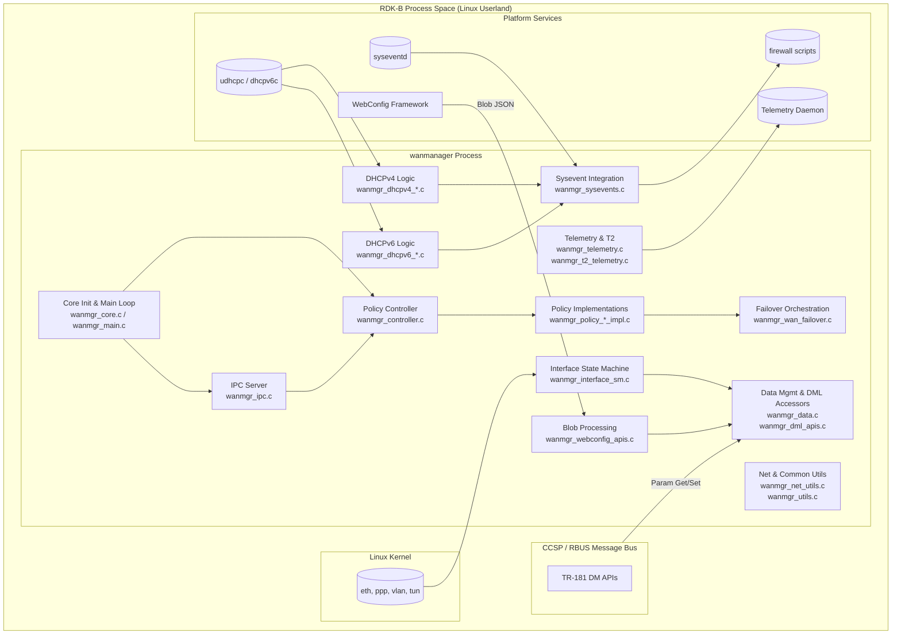
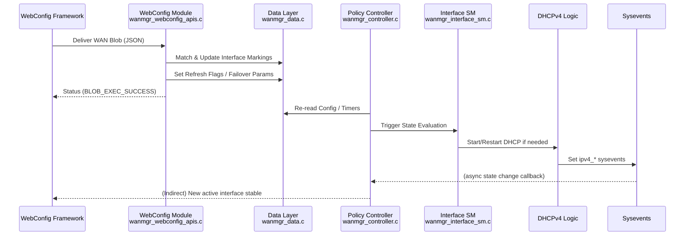
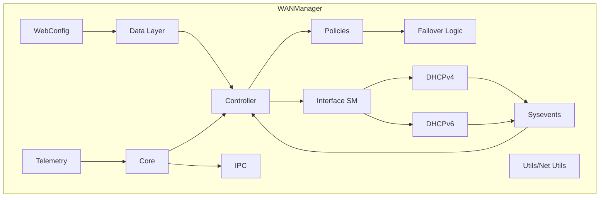
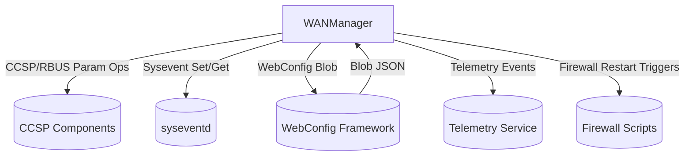
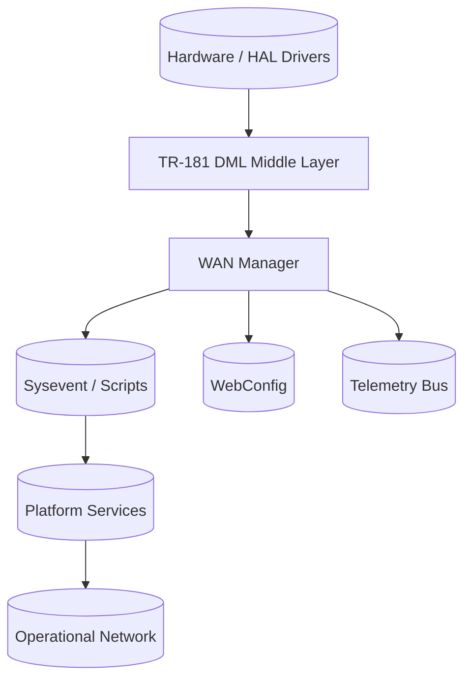
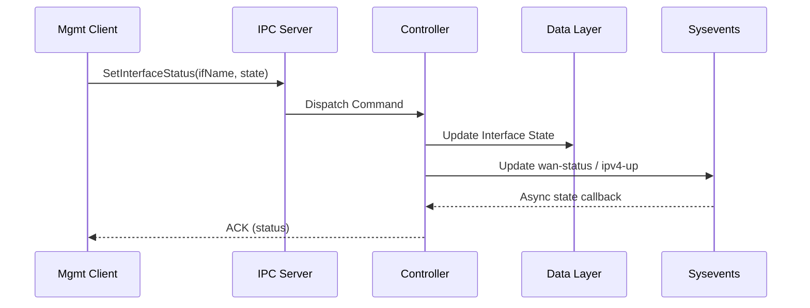

# WAN Manager Documentation

WAN Manager coordinates Wide Area Network interface selection, orchestration, failover, configuration application, TR‑181 data model exposure, DHCP lifecycle handling, and policy‑driven multi‑WAN behavior within the RDK‑B stack. It abstracts heterogeneous physical and virtual WAN interfaces (e.g., Ethernet, DSL, Cellular) into a unified policy and status model while integrating with system services (sysevents, webconfig, telemetry, RBUS/CCSP message bus). Upstream it publishes TR‑181 parameters / events, downstream it interacts with low‑level link states, DHCP clients, and platform capabilities. External control and configuration are applied via WebConfig blobs, TR‑181 setters, and IPC triggers.  

- **Key Features & Responsibilities**:  
  - **Interface Abstraction & Inventory**: Discovers, initializes, and maintains state/data structures for physical and virtual WAN interfaces (dynamic tables, markings, VLAN, PPP attributes).  
  - **Policy‑Driven Active Interface Selection**: Applies AutoWAN / selection timeout and (compiled or legacy) policy implementations to choose the active path and manage group failover.  
  - **Failover & Health Monitoring**: Monitors operational, link, IPv4/IPv6, DHCP, and policy timers; triggers failover and restoration per configured priorities and timeouts.  
  - **TR‑181 Data Model Exposure**: Implements `X_RDK_WanManager.*` objects: interface tables, PHY, WAN config, IP, PPP, MAP‑T, DHCP aspects, and policy parameters with validation/commit/rollback.  
  - **Configuration Ingestion (WebConfig Blobs)**: Parses and applies WAN marking and failover configuration updates atomically with rollback semantics.  
  - **DHCPv4/v6 Lifecycle Handling**: Processes DHCP events, updates sysevents, caches IP/gateway/DNS, and updates TR‑181 parameter states (lease times, statuses).  
  - **IPC & Message Bus Integration**: Provides internal IPC server for management commands (interface status, force renew) and integrates with CCSP / RBUS for asynchronous readiness and parameter ops.  
  - **Sysevent & System Integration**: Publishes and reacts to sysevents (WAN link state, IPv4/IPv6 readiness, firewall restart triggers, LED state) enabling coordinated system behavior.  
  - **Telemetry & Observability**: Emits telemetry (T2.0 when enabled) and structured logs for operational metrics, errors, and policy transitions.  
  - **Security & Capability Dropping**: Drops root privileges early; retains only needed Linux capabilities before entering main loop.  

## Design

### High‑Level Design Principles

WAN Manager emphasizes a modular separation between data model (DML), controller policy logic, interface state machines, and system integration utilities. Each functional region has clear ownership of data allocation, synchronization, and commit semantics. Modularity enables addition of new interface types or policies with minimal core alteration. Scalability is addressed by dynamic tables and list management for interfaces, markings, VLANs, and virtual sub‑interfaces (up to defined maxima). Reliability is reinforced via initialization ordering (data → core → controller → policies), rollback handlers for webconfig, and sysevent synchronization. Security is maintained by early privilege dropping and constrained IPC. Maintainability is achieved through layered headers (`wanmgr_core.h`, `wanmgr_data.h`, `wanmgr_controller.h`, DML/IPC segregated APIs) and TR‑181 auto‑mapping.  
- Modularity: Core loop invokes policy and state machine ticks; data accessors enforce locking discipline via *_locked / release pairs.  
- Scalability: Interface and marking lists support up to MAX_WAN_INTERFACE_ENTRY and dynamic growth for VLAN/Marking nodes.  
- Reliability: Rollback handlers, sysevent re‑init functions for IPv4/IPv6, and watchdog‑like readiness gating reduce boot race conditions.  
- Security: Capability dropping & restricted IPC server minimize process privileges.  
- Maintainability: Consistent naming (WanMgr_* prefix) and explicit separation between config data (ConfigData), interface data, and controller policy struct.  
- Clear Boundaries:  
  - Data Layer: Structure storage & getters (`wanmgr_data.c`, `wanmgr_dml_apis.c`).  
  - Control/Policy Layer: Policy decisions (`wanmgr_controller.c`, policy_*_impl.c).  
  - State Machines / Interface Logic: Link / IP state transitions (`wanmgr_interface_sm.c`).  
  - IPC / External Integration: `wanmgr_ipc.c`, sysevents, telemetry, webconfig, message bus.  
- Responsibilities:  
  - Persistence & Config: WebConfig + TR‑181 commit propagate into Data Layer.  
  - Interface Selection: Policy controller orchestrates active/standby & groups.  
  - IPC & Events: IPC server + sysevents broadcast transitions; telemetry logs instrumentation.

### C4 Container Diagram

### Design Explanation & Request Flow

- **Request Flow Sequence**: Typical configuration apply (WebConfig WAN blob) flows through parsing, interface table matching, marking update, DML commit, refresh flag, and eventual policy re‑evaluation. Below is a representative sequence of a WebConfig blob application that results in interface activation and DHCP state update.

### Threading Model (if applicable)

- The process starts as a daemon (`daemonize()`), then enters a main loop via `WanMgr_Core_Start()` inside the primary thread.  
- Auxiliary concurrency arises from:  
  - Sysevent callbacks / message bus event handlers (asynchronous invocations).  
  - Potential internal threads spawned by DHCP clients / system services outside the process.  
- Observed Model: Predominantly single main coordination thread with event‑driven callbacks (no explicit worker thread pool defined in provided sources).  
- Signal handlers registered for graceful termination and diagnostics.  
- RBUS subscription (if enabled) blocks for readiness signaling before continuing initialization.  

## Internal Modules

| Module/Class | Description | Key Files |
|-------------|------------|-----------|
| Core Initialization | Bootstraps data, engages message bus, starts main loop | `wanmgr_main.c`, `wanmgr_core.c` |
| Controller / Policy Ctrl | Maintains policy struct, selection timeouts, active interface indices | `wanmgr_controller.c` |
| Policy Implementations | Auto, fixed, parallel scan, failover, etc. selection strategies | `wanmgr_policy_auto_impl.c`, `wanmgr_policy_parallel_scan_impl.c`, `wanmgr_policy_fm_impl.c`, `wanmgr_policy_pp_impl.c`, `wanmgr_policy_autowan_impl.c`, `wanmgr_wan_failover.c` |
| Data Management | Allocation, locking, retrieval of config/interface/virtual iface entities | `wanmgr_data.c`, `wanmgr_dml_apis.c` |
| Interface State Machine | Operational/link/IP status transitions; triggers DHCP and IPv6 toggles | `wanmgr_interface_sm.c` |
| DHCPv4 Handling | Lease, DNS, gateway extraction, sysevent updates | `wanmgr_dhcpv4_apis.c`, `wanmgr_dhcpv4_internal.c`, `wanmgr_dhcp_legacy_apis.c` |
| DHCPv6 Handling | IPv6 prefix/address/state management | `wanmgr_dhcpv6_apis.c`, `wanmgr_dhcpv6_internal.c` |
| IPC Server | Handles client commands (force renew, status set) | `wanmgr_ipc.c`, `wanmgr_ipc.h` |
| WebConfig Processing | Parses WAN blob, updates markings and failover config | `wanmgr_webconfig_apis.c`, `wanmgr_webconfig.c` |
| Sysevents Integration | Publishes and retrieves WAN/IPv4/IPv6 and LED states | `wanmgr_sysevents.c`, `wanmgr_sysevents.h` |
| Telemetry | Emits operational counters and events (T2) | `wanmgr_telemetry.c`, `wanmgr_t2_telemetry.c` |
| Net Utils | Networking helpers (MTU, addressing, interface operations) | `wanmgr_net_utils.c` |
| Common Utils | Shared string/time/list utilities, validation helpers | `wanmgr_utils.c` |
| SSP / Message Bus Bridge | CCSP message bus interface glue | `wanmgr_ssp_messagebus_interface.c`, `wanmgr_ssp_action.c` |
| TR‑181 DML Middle Layer | Interface adaptation, dynamic table operations | `TR-181/middle_layer_src/*`, `wanmgr_dml_iface_apis.c`, `wanmgr_dml_iface_v2_apis.c` |
| Marking & VLAN Virtual Ifaces | Virtual interface / marking list manipulation | `wanmgr_data.c`, `wanmgr_dml_iface_apis.c` |

## Interaction with Other Middleware Components

| Component | Purpose of Interaction | Protocols/Mechanisms |
|-----------|-----------------------|----------------------|
| CCSP / RBUS Bus | TR‑181 parameter get/set, event subscriptions | CCSP Message Bus / RBUS |
| WebConfig Framework | Receives WAN blob updates | Internal callback + JSON blob parsing |
| syseventd | Publish WAN/IP states, LED, firewall triggers | Sysevent API |
| DHCP Clients (udhcpc, dhcpv6c) | Provide lease, prefix, DNS status | Process events / sysevents |
| Telemetry Service | Report operational metrics, failovers | Telemetry2.0 bus |
| Firewall Scripts | Restart on network state changes | Sysevent triggers |
| Systemd (optional) | Ready notification | sd_notify |
| Platform Capability Layer | Capability dropping & security | Linux capabilities |

| Event | Purpose of Event | Reason for trigger |
|-----------|-----------------------|----------------------|
| `wan-status` | Overall WAN state broadcast | Interface up/down, failover decision |
| `ipv4-up` | IPv4 stack ready | DHCPv4 lease acquired |
| `routed-status` | Routed service status | Routing table update / link change |
| `firewall-restart` | Firewall refresh | WAN reconfiguration or address change |
| `wan-restart` | Reinitialize WAN flow | Policy or config change |
| `rdkb_wan_status` | LED update for UI hardware | Link/operational state transitions |
| `dhcp_server-restart` | DHCP server reinit downstream | WAN addressing changes |
| `radvd_restart` | IPv6 RA daemon restart | Prefix / IPv6 config modifications |
| `lan-prefix_set` / `lan_prefix_clear` | Global IPv6 prefix state | DHCPv6 prefix / route events |

## Interaction with Other Layers

| Layer/Service | Interaction Description | Mechanism |
|---------------|-------------------------|----------|
| HAL | Indirect link/PHY stats via lower data model layers | Through TR‑181 middle-layer & bus |
| Platform (Sysevent / System Scripts) | State propagation, service restarts, LED indications | Sysevent API, system scripts |
| External (DHCP, Telemetry, WebConfig) | Configuration ingestion & status export | JSON blobs, telemetry bus, sysevent |

## IPC Mechanism

| Type of IPC | Message Format | Mechanism |
|---------------|-------------------------|----------|
| Internal IPC Server | Structured message types (e.g., interface status, DHCP renew commands) | Custom IPC (`wanmgr_ipc.c`, sockets / message abstraction via `ipc_msg.h`) |
| Sysevents | Key/value pairs (status strings, IPv4/IPv6 params) | syseventd API |
| CCSP/RBUS | Parameter operations & events (TR‑181) | CCSP message bus / RBUS |
| WebConfig Blob | JSON / (binary safe char* with parsed structures) | WebConfig framework callback |
| Telemetry | Key/value event / counter messages | Telemetry2.0 API |
| Systemd Notify (optional) | Status strings | sd_notify |

## TR‑181 Data Models

- **Implemented Parameters** (selected core set from `X_RDK_WanManager` tree):  
  - `X_RDK_WanManager.Enable` (bool) – master enable.  
  - `X_RDK_WanManager.Policy` (mapped) – active selection/failover strategy (Fixed, PrimaryPriority, MultiWAN, AutoWAN, Parallel Scan).  
  - `X_RDK_WanManager.AllowRemoteInterfaces` (bool) – remote CPE interface inclusion.  
  - `X_RDK_WanManager.ResetActiveInterface` (bool) – forces active interface reset.  
  - `X_RDK_WanManager.RestorationDelay` (uint) – failback timing.  
  - `X_RDK_WanManager.WanFailoverData` (string) – serialized failover configuration.  
  - `X_RDK_WanManager.DnsConnectivityCheck.Enable` (bool) – enable DNS health check.  
  - `X_RDK_WanManager.CPEInterface.{i}.Name` / `DisplayName` – interface identification.  
  - `X_RDK_WanManager.CPEInterface.{i}.Wan.SelectionTimeout` – interface selection window.  
  - `X_RDK_WanManager.CPEInterface.{i}.Wan.EnableDHCP` (bool).  
  - `X_RDK_WanManager.CPEInterface.{i}.Wan.EnableIPoEHealthCheck` (bool).  
  - `X_RDK_WanManager.CPEInterface.{i}.Wan.Group` (uint) – grouping for policies.  
  - `X_RDK_WanManager.CPEInterface.{i}.IP.IPv4Status` / `IPv6Status`.  
  - `X_RDK_WanManager.CPEInterface.{i}.PPP.Enable` and IPCP/IPv6CP status flags.  
  - Marking table entries (alias, ethernetPriorityMark).  
- **Parameter Registration**: Handlers mapped in `RdkWanManager.xml` referencing `WanManager_*`, `WanIf_*`, `WanIfCfg_*`, `WanIfPhy_*`, `WanIfIpCfg_*`, `WanIfPPPCfg_*` functions; dynamic tables support commit/rollback. Exposed via CCSP/RBUS to management layers.  
- **Custom Extensions**:  
  - `X_RDK_WanManager.Policy` mapped enumerations for advanced multi‑WAN strategies.  
  - Marking table under each interface enabling QoS / priority tagging (`markingTable` alias→priority).  
  - MAP‑T / DS-Lite enabling booleans for IPv4 transition technologies.  

| Parameter | Description | Access (R/W) | Default | Notes |
|-----------|-------------|-------------|---------|-------|
| `X_RDK_WanManager.Enable` | Global enable for WAN Manager | R/W | Implementation default true | Drives init/selection logic |
| `X_RDK_WanManager.Policy` | Active policy enumeration | R/W* | Device specific | May be readonly via compile flag |
| `X_RDK_WanManager.AllowRemoteInterfaces` | Accept remote interfaces | R/W | false | Updated via WebConfig blob |
| `X_RDK_WanManager.RestorationDelay` | Failback delay (sec) | R/W | Platform default | Used in auto failover |
| `X_RDK_WanManager.CPEInterface.{i}.Wan.SelectionTimeout` | Selection timeout | R/W | >=20 | Enforced min 20 |
| `X_RDK_WanManager.CPEInterface.{i}.Wan.EnableDHCP` | DHCP enable toggle | R/W | true | Affects DHCP logic |
| `X_RDK_WanManager.CPEInterface.{i}.IP.IPv4Status` | IPv4 link status | R/W | Down | Updated via DHCP events |
| `X_RDK_WanManager.CPEInterface.{i}.PPP.Enable` | PPP session enable | R/W | false | PPP use cases |
| `X_RDK_WanManager.CPEInterface.{i}.Marking.{j}.Alias` | Traffic marking alias | R/W | "DATA" | Adjusted by blob |
| `X_RDK_WanManager.CPEInterface.{i}.Marking.{j}.EthernetPriorityMark` | VLAN PCP/priority mark | R/W | 0 | QoS classification |

## Implementation Details

- **Key Algorithms or Logic**:  
  - Policy Evaluation: `WanMgr_Policy_AutoWan*` examines interface operational state, group membership, and selection timeout windows to transition active/standby roles.  
  - Interface State Machine: Monitors sysevent link status and DHCP progress to promote interface states (Initializing→Up→Standby/Operational).  
  - WebConfig Apply: For each interface entry, aligns or creates marking entries and sets refresh flags causing re‑evaluation; includes update vs. insertion logic with alias collision handling.  
  - DHCP Handling: Extracts DNS, gateway, lease parameters, updates sysevents and TR‑181 IP statuses, triggers firewall restart if necessary.  
  - Failover Logic: Observes link/operational/dhcpv4/6 statuses and restoration timers to decide switching with minimal disruption.  
- Main files: Policy logic (`wanmgr_policy_*`), core loop (`wanmgr_core.c`), data access & list building (`wanmgr_data.c`), DHCP transitions (`wanmgr_dhcpv4_internal.c`, `wanmgr_dhcpv6_internal.c`), blob processing (`wanmgr_webconfig_apis.c`).  
- **Error Handling Strategy**: Functions return `ANSC_STATUS` or allocate `pErr` with error codes for blob processing; logging macros (`CcspTraceError`, `CcspTraceInfo`) annotate failures; rollback handlers for config apply (`WanMgr_WanData_Rollback_Handler`); state initialization functions reset sysevents to known baselines.  
- **Logging & Debugging**: Uses CCSP trace categories; process writes version & PID to `/var/tmp/wanmanager.pid`; optional stack traces on signals; telemetry events for runtime readiness; debug gating via `/etc/debug.ini`.

## Key Configuration Files

| Configuration File | Purpose | Key Parameters | Default Values | Override Mechanisms |
|--------------------|---------|---------------|----------------|--------------------|
| `config/RdkWanManager.xml` | TR‑181 data model object & parameter mapping | Objects: `X_RDK_WanManager`, `CPEInterface`, nested `Wan`, `IP`, `PPP`, Marking | Versioned schema | Build-time, XML edit, WebConfig / TR‑181 set |
| `config/RdkWanManager_v2.xml` | (If present) Updated/extended data model variant | Same domains + potential v2 enhancements | Depends on version | Deployment selection |
| WebConfig Blob (WAN) | Runtime applied interface + marking config | Failover data, markingTable entries | Supplied by controller | WebConfig distribution |
| Sysevents (runtime keys) | Operational dynamic state store | `wan-status`, `ipv4_*`, `routed-status`, LED states | N/A (ephemeral) | Updated by code |
| `/etc/debug.ini` | Logging configuration | Trace modules, log levels | Platform default | File edit |
| Capability / Security (implicit) | Capabilities list for process | Dropped root caps | N/A | Build flags |

---

