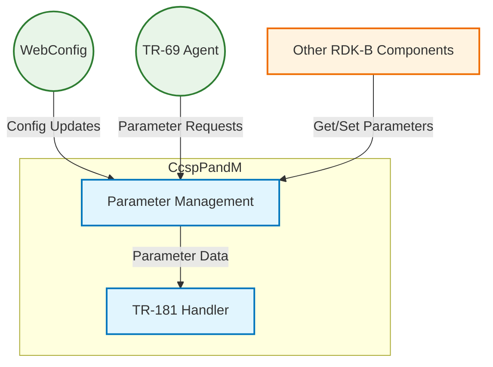
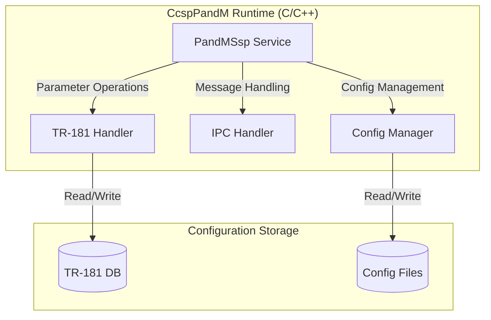
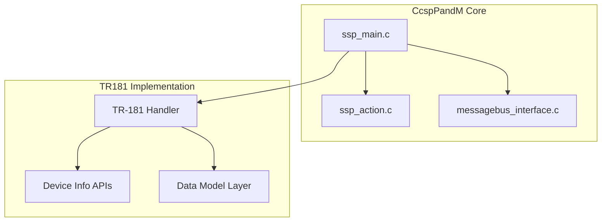
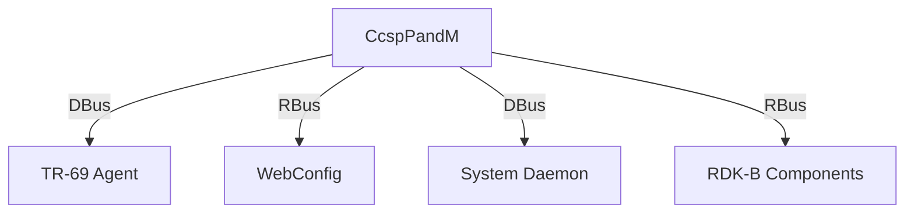
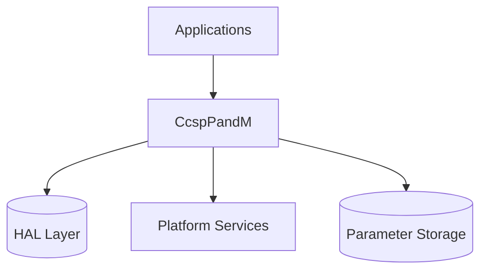
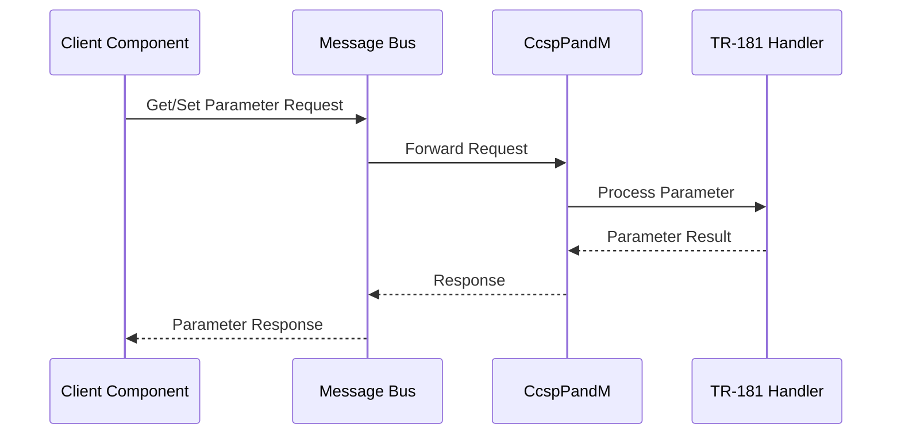

# CcspPandM Documentation

## 1. Overview

- **Purpose in RDK-B Stack**: CcspPandM (Provisioning and Management Sub-System) is a critical component in the RDK-B stack that manages device configuration, provisioning, and parameter management using the TR-181 data model. It serves as the central management interface for the device's configuration and operational parameters.

- **Key Features & Responsibilities**:
  - Implements TR-181 data model for device configuration
  - Provides parameter management (Get/Set operations)
  - Handles device provisioning and configuration
  - Manages inter-process communication for parameter access
  - Supports device information management
  - Integrates with WebConfig for remote configuration

- **Role in Broadband Router Architecture**: CcspPandM acts as the bridge between various RDK-B components and device configuration. It provides a standardized interface for managing device parameters, enabling other components to access and modify device settings through a unified TR-181 data model.

## 2. Architecture / Design

### 2.1 High-Level Design Principles

- **Modularity**: Component is structured into distinct modules (PandMSsp, TR-181 handlers, custom implementations)
- **Standardization**: Follows TR-181 data model specification for parameter management
- **Scalability**: Supports dynamic parameter registration and management
- **Reliability**: Implements robust error handling and validation
- **Extensibility**: Allows custom TR-181 parameter implementations

### 2.2 Component Boundaries & Responsibilities

- **Parameter Management**:
  - TR-181 parameter registration and access
  - Parameter value validation and storage
  - Change notification handling

- **IPC Interface**:
  - DBus/RBus message handling
  - Parameter access request processing
  - Event notification dispatch

- **Device Configuration**:
  - Configuration file management
  - WebConfig integration
  - Boot-time initialization

### 2.3 Threading Model

- Main thread handles message bus operations
- Separate threads for:
  - Parameter processing
  - Event handling
  - WebConfig operations
  - Background tasks

### 2.4 C4 System Context Diagram

### 2.5 Container Diagram

### 2.6 Design Explanation & Request Flow

- **Request Flow Sequence**: 
  1. External component sends parameter get/set request via DBus/RBus
  2. IPC Handler receives and validates request
  3. PandMSsp processes request through TR-181 handler
  4. TR-181 handler performs operation and returns result
  5. Response sent back through IPC channel

- **Technology Stack**:
  - Languages: C/C++
  - IPC: DBus, RBus
  - Configuration: XML, JSON
  - Build System: Autotools
  - Testing: GTest framework

## 3. Internal Modules

| Module/Class | Description | Key Files |
|-------------|------------|-----------|
| PandMSsp | Core service implementation | `ssp_main.c`, `ssp_action.c` |
| TR-181 Handler | Parameter management implementation | `TR-181/middle_layer_src/*.c` |
| Message Bus Interface | IPC communication handler | `ssp_messagebus_interface.c` |
| Device Info | Device information management | `cosa_deviceinfo_apis.h` |
| Configuration | Config file management | `Custom/pnm_custom.h` |

### 3.1 Module Breakdown Diagram

## 4. Interaction with Other Middleware Components

| Component | Purpose of Interaction | Protocols/Mechanisms |
|-----------|----------------------|-------------------|
| WebConfig | Remote configuration management | RBus/HTTP |
| TR-069 Agent | Device management and provisioning | DBus |
| System Daemon | System information and control | DBus |
| Other RDK Components | Parameter access and notifications | RBus/DBus |

### 4.1 Middleware Interaction Diagram

## 5. Interaction with Other Layers

| Layer/Service | Interaction Description | Mechanism |
|---------------|------------------------|-----------|
| HAL | Hardware parameter access | DBus |
| Platform Services | System configuration | DBus/RBus |
| Storage | Parameter persistence | File I/O |
| Configuration | Config file management | File I/O |

### 5.1 Layered Architecture View

## 6. IPC Mechanism

- **Type of IPC**: 
  - DBus for legacy parameter access
  - RBus for modern parameter management
  - Unix sockets for local communication

- **Message Format**: 
  - DBus messages with parameter paths and values
  - RBus messages with JSON payloads
  - Custom binary formats for specific operations

- **Flow**: 
  - Synchronous for get operations
  - Asynchronous for set operations and notifications
  - Event-based for parameter change notifications

### 6.1 IPC Flow Diagram

## 7. TR-181 Data Models

- **Implemented Parameters**: Major parameter groups include:
  - Device.DeviceInfo.*
  - Device.IP.*
  - Device.Ethernet.*
  - Device.Bridging.*
  - Device.WiFi.*
  - Device.Firewall.*

- **Parameter Registration**:
  - Parameters registered via RBus
  - Support for Get/Set operations
  - Change notification support
  - Validation handlers

- **Custom Extensions**:
  - Vendor-specific parameters under Device.X_RDKCENTRAL-COM_*
  - Custom validation rules
  - Platform-specific parameters

### 7.1 TR-181 Parameter Table

| Parameter | Description | Access (R/W) | Default | Notes |
|-----------|------------|--------------|---------|-------|
| Device.DeviceInfo.Manufacturer | Device manufacturer | R | - | Standard |
| Device.DeviceInfo.ModelName | Device model name | R | - | Standard |
| Device.DeviceInfo.Description | Device description | R | - | Standard |
| Device.IP.Interface.{i}.Enable | Enable/disable interface | R/W | true | Standard |
| Device.X_RDKCENTRAL-COM_Config.* | RDK specific config | R/W | - | Custom |

## 8. Implementation Details

- **Key Algorithms**:
  - Parameter tree traversal
  - Message queue processing
  - Configuration validation
  - Data model synchronization

- **Error Handling**:
  - Parameter validation errors
  - IPC communication failures
  - Storage access errors
  - Resource allocation failures

- **Logging & Debugging**:
  - Standard RDK logging levels
  - Parameter access logging
  - Error tracing support
  - Performance metrics

## 9. Key Configuration Files

- `config-arm/TR181-USGv2.XML`: Main TR-181 data model definition
- `config-arm/CcspPam.cfg`: PAM configuration
- `config-arm/CcspDmLib.cfg`: Data model library config
- `Custom/pnm_custom.h`: Custom parameter definitions