# CcspPandM Documentation

## 1. Overview

- **Purpose in RDK‑B Stack**: CcspPandM (Provisioning & Management, a.k.a. PAM or PandM) is a CCSP middleware component that implements TR‑181 data model glue, parameter storage (PSM) helpers, WebConfig integrations and the CCSP Component Data Model (CCD) / messagebus SSP interfaces. It provides the data model registration, PSM mapping, base CCSP callbacks and utility helpers used by many RDK‑B components.
- **Key Features & Responsibilities**:
  - Register TR‑181 data models via the DSLH CPE Controller and provide CCSP CCD interface callbacks.
  - Expose CCSP message bus base functions (Get/Set parameter values, AddTblRow/DeleteTblRow, GetParameterNames/Attributes).
  - Provide SSP (component) lifecycle: create, engage, and cancel routines plus MBI messagebus engage helpers.
  - Provide PSM parameter name definitions and platform TR‑181 glue (see `source/TR-181/include/*`).
  - Provide WebConfig and telemetry boot hooks and initialization/daemon lifecycle management for the component.
- **Role in Broadband Router Architecture**: Acts as the primary data-model glue between TR‑181 data model implementations (middle-layer) and the CCSP message bus. It is central to parameter get/set flows and to registering component Data Model Providers with the DSLH controller.

## 2. Architecture / Design

### 2.1 High‑Level Design Principles

- Keep CCSP base interface and DSLH/cpe controller integration centralized to provide a consistent entry point for TR‑181 data models.
- Use DBus/CCSP message bus for all TR‑181 parameter traffic; provide PSM-backed configuration persistence via PSM helpers.
- Provide SSP lifecycle hooks so the component can be loaded/unloaded by the CCSP daemon manager.

### 2.2 Component Boundaries & Responsibilities

- Component process: `CcspPandMSsp` (daemon) runs as a single process that registers TR‑181 models and listens on DBus/MessageBus.
- Responsibilities:
  - TR‑181 data model registration via `pDslhCpeController->RegisterCcspDataModel2`.
  - CCSP base callbacks routing (via `CcspBaseIf_SetCallback` to the `ssp_PnmMbi_*` functions).
  - PSM record definitions under `source/TR-181/include/dmsb_tr181_psm_definitions.h`.
  - Creating and engaging the component common DM and CCD interfaces (`ssp_create_pnm`, `ssp_engage_pnm`, `ssp_cancel_pnm`).

### 2.3 Threading Model (if applicable)

- The component is primarily single-threaded in its SSP main loop (daemon sleeps in the parent process). It spawns short-lived helper threads for PSM cleanup or vendor-specific tasks (see `BwgRemoveParam_Thread`, `CbrRemoveParam_Thread` in `ssp_messagebus_interface.c`).
- Message bus operations are driven by the CCSP message bus event loop (DBus callbacks handled by the CCSP stack); heavy work is delegated to worker threads where needed.

### 2.4 C4 System Context Diagram

```mermaid
graph TD
  classDef user fill:#fff3e0,stroke:#ef6c00,stroke-width:2px;
  classDef component fill:#e1f5fe,stroke:#0277bd,stroke-width:2px;
  classDef external fill:#e8f5e8,stroke:#2e7d32,stroke-width:2px;

  User[👤 Administrator / ACS/Cloud]:::user
  WebUI[🌐 Web UI / WebConfig]:::external
  MessageBus[(CCSP Message Bus / DBus)]:::external
  PSM[(PSM / Parameter Storage)]:::external

  subgraph "RDK‑B Middleware"
    PandM[📦 CcspPandM (P&M)]:::component
  end

  User -->|Config / TR-181| WebUI
  WebUI -->|msgpack / WebConfig| PandM
  PandM -->|DBus CCSP parameter APIs| MessageBus
  PandM -->|PSM records / persistent configs| PSM
```

### 2.5 C4 Container Diagram

```mermaid
graph TD
  subgraph "Runtime: RDK‑B / systemd"
    subgraph "CcspPandM process"
      SSPMain[ssp_main.c \n(core bootstrap)]
      SSPAction[ssp_action.c \n(CCD/CCSP callbacks)]
      MessageBus[ssp_messagebus_interface.c \n(MBI / Message Bus glue)]
    end
  end

  MessageBus -->|registers| DSLH[DSLH CPE Controller]
  SSPMain -->|spawn/init| SSPAction
```

### 2.6 Design Explanation & Request Flow

- Request Flow Sequence (high level):
  1. Component starts (`ssp_main.c`) → reads `CCSP_PNM_START_CFG_FILE` and constructs `gpPnmStartCfg`.
  2. `ssp_create_pnm` allocates `g_pComponent_Common_Dm`, `pPnmCcdIf`, `pPnmFcContext` and creates `pDslhCpeController`.
  3. `ssp_PnmMbi_MessageBusEngage` calls `CCSP_Message_Bus_Init` and sets `CcspBaseIf_SetCallback` with `ssp_PnmMbi_*` callbacks.
  4. `ssp_engage_pnm` registers the TR‑181 data model via `pDslhCpeController->RegisterCcspDataModel2`.
  5. Runtime: DBus/MessageBus callbacks route to the CCD functions (`ssp_PnmCCDm*` and base interface handlers) and PSM helpers handle persistent parameter storage.

- Technology Stack: C (POSIX), CCSP Message Bus (DBus), DSLH data model middle-layer, PSM helpers, WebConfig hooks, telemetry (T2) integration.

## 3. Internal Modules

| Module/Class | Description | Key Files |
|-------------|------------|-----------|
| SSP bootstrap & daemon | Process entry, daemonization, start/stop orchestration | `source/PandMSsp/ssp_main.c` |
| Component action & CCD | Component common DM, CCD interface methods and lifecycle functions | `source/PandMSsp/ssp_action.c`, `ssp_global.h` |
| Message Bus / MBI | MessageBus init, base interface callbacks, DBus method handlers | `source/PandMSsp/ssp_messagebus_interface.c`, `ssp_messagebus_interface.h` |
| TR‑181 definitions & PSM | TR‑181 header definitions and PSM parameter name constants | `source/TR-181/include/*` (e.g., `dmsb_tr181_psm_definitions.h`) |
| Custom integration & helpers | platform/feature specific cleanups and utilities | `source/PandMSsp/` threads and `scripts/` |

### 3.1 Module Breakdown Diagram


## 4. Interaction with Other Middleware Components

| Component | Purpose of Interaction | Protocols/Mechanisms |
|-----------|-----------------------|----------------------|
| DSLH CPE Controller | Registers TR‑181 data model and provides data model services | In-process API calls (pDslhCpeController interfaces) |
| CCSP Message Bus | Parameter get/set, events, DBus registration | DBus / CCSP base interface callbacks (`CcspBaseIf_SetCallback`) |
| PSM (Parameter Storage Manager) | Persistent storage for configuration | PSM APIs (PSM_Set_Record, PSM_Del_Record, PSM_Get_Record) |
| WebConfig / Telemetry | Web configuration blobs & telemetry events | WebConfig msgpack hooks, T2 telemetry API (`t2_init`) |

### 4.1 Middleware Interaction Diagram


## 5. Interaction with Other Layers

- HAL: TR‑181 data model often references HAL to resolve device-specific information (via middle-layer or helper APIs).
- Platform: systemd for process lifecycle and `/var/tmp/CcspPandMSsp.pid` for PID management; boot-time semaphores `/tmp/pam_initialized` used to coordinate initialization.
- External: ACS/Cloud writes TR‑181 parameters via SysCfg/PSM or WebConfig which the component registers and serves.

| Layer/Service | Interaction Description | Mechanism |
|---------------|-------------------------|----------|
| HAL | Device & interface properties exposed by TR‑181 objects | Middle-layer APIs (COSA helpers) |
| Platform | Startup coordination, PID file, logging | systemd, `/var/tmp/CcspPandMSsp.pid`, `/etc/debug.ini` |
| External | ACS / Web UI | TR‑181 parameter set/get via message bus, WebConfig blobs |

### 5.1 Layered Architecture View

```mermaid
graph TD
  HAL[(HAL / Kernel)] --> CcspPandM[📦 CcspPandM]
  Platform --> CcspPandM
  External[(ACS / WebUI)] --> CcspPandM
```



## 6. IPC Mechanism

- **Type of IPC**: Primary IPC is DBus (CCSP message bus). The component uses the CCSP message bus APIs (`CCSP_Message_Bus_Init`) and registers base callbacks via `CcspBaseIf_SetCallback`.
- **Message Format**: DBus method calls with typed parameter lists and CCSP parameterValStruct_t / parameterAttributeStruct_t for get/set operations.
- **Flow**: Synchronous parameter gets/sets via base interface; asynchronous events via DBus signals; WebConfig blobs handled by the WebConfig framework.

### 6.1 IPC Flow Diagram


## 7. TR‑181 Data Models

- **Implemented Parameters**: This component provides TR‑181 middle-layer headers and PSM parameter name definitions; concrete models are provided by `integration_src.shared` / `DMPackCreateDataModelXML` generated code referenced by `ssp_action.c`.
- **Parameter Registration**: The `ssp_engage_pnm` routine calls `pDslhCpeController->RegisterCcspDataModel2` with `DMPackCreateDataModelXML` (Comcast generated code) to register the TR‑181 XML and callbacks.
- **Custom Extensions**: PSM names and platform customizations are defined under `source/TR-181/include` (e.g., `dmsb_tr181_psm_definitions.h`, `dml_tr181_custom_cfg.h`).

### 7.1 TR‑181 Parameter Table (sample)

| Parameter | Description | Access (R/W) | Notes |
|-----------|-------------|--------------|-------|
| `dmsb.l3net.{i}.Enable` | L3 network interface enabled | R/W | PSM-backed via `dmsb_tr181_psm_definitions.h` |
| `dmsb.dhcpv4.server.pool.{i}.Enable` | DHCPv4 server pool enable | R/W | PSM-backed DHCP server pool keys |
| `dmsb.filetransfer.Server` | File transfer server hostname | R/W | Example PSM mapping |

## 8. Implementation Details

- **Key Algorithms or Logic**:
  - Data model registration and base callback wiring are the core responsibilities — `ssp_create_pnm`, `ssp_engage_pnm` and `ssp_cancel_pnm` manage lifecycle.
  - DBus to CCD routing is implemented in `ssp_messagebus_interface.c` which adapts DBus method calls into the `CCSP_Base_Func_CB` function pointer invocation.
- **Error Handling Strategy**:
  - CCSP status codes (ANSC_STATUS / CCSP_SUCCESS) are returned and logged via `CcspTrace*` macros. Message bus failures cause component init to abort.
- **Logging & Debugging**:
  - Logging via `RDK_LOGGER_INIT()` and `CcspTrace*`. Debug configuration is read from `/etc/debug.ini`. PID file created at `/var/tmp/CcspPandMSsp.pid`.

## 9. Key Configuration Files

| Configuration File | Purpose | Key Parameters | Notes |
|--------------------|---------|----------------|-------|
| `CCSP_PNM_START_CFG_FILE` (loaded by `CcspComponentLoadCfg`) | Component startup configuration | `ComponentName`, `DbusPath`, `ConfigFile` | Provides `gpPnmStartCfg` structure used by SSP |
| `source/TR-181/*.xml` (generated data model) | TR‑181 model XML created by `DMPackCreateDataModelXML` | parameter objects & callback names | Registered via DSLH controller |
| `source/TR-181/include/dmsb_tr181_psm_definitions.h` | PSM parameter name constants | `dmsb.*` keys | Used to map TR‑181 parameter names to PSM entries |

## 10. API Endpoints (if applicable)

- The component exposes CCD/CCSP base interface callbacks (not HTTP). Key exported/used functions include:

Public lifecycle & core APIs

- `ANSC_STATUS ssp_create_pnm(PCCSP_COMPONENT_CFG pStartCfg)` — allocate and initialize component DM structures (`ssp_action.c`).
- `ANSC_STATUS ssp_engage_pnm(PCCSP_COMPONENT_CFG pStartCfg)` — register TR‑181 data model and engage the DSLH controller (`ssp_action.c`).
- `ANSC_STATUS ssp_cancel_pnm(PCCSP_COMPONENT_CFG pStartCfg)` — unregister component and clean up resources (`ssp_action.c`).

Message Bus / MBI APIs

- `ANSC_STATUS ssp_PnmMbi_MessageBusEngage(char * component_id, char * config_file, char * path)` — init message bus and set base callbacks (`ssp_messagebus_interface.c`).
- `int ssp_PnmMbi_Initialize(void * user_data)` — MBI initialize callback (no-op / return success).
- `int ssp_PnmMbi_Finalize(void * user_data)` — MBI finalize callback.
- `int ssp_PnmMbi_Buscheck(void * user_data)` — MBI bus check callback.
- `int ssp_PnmMbi_FreeResources(int priority, void * user_data)` — MBI free resources callback.

CCD / Component info APIs

- `char* ssp_PnmCCDmGetComponentName(ANSC_HANDLE hThisObject)`
- `ULONG ssp_PnmCCDmGetComponentVersion(ANSC_HANDLE hThisObject)`
- `char* ssp_PnmCCDmGetComponentAuthor(ANSC_HANDLE hThisObject)`
- `ULONG ssp_PnmCCDmGetComponentHealth(ANSC_HANDLE hThisObject)`
- `ULONG ssp_PnmCCDmGetComponentState(ANSC_HANDLE hThisObject)`
- `BOOL ssp_PnmCCDmGetLoggingEnabled(ANSC_HANDLE hThisObject)`
- `ANSC_STATUS ssp_PnmCCDmSetLoggingEnabled(ANSC_HANDLE hThisObject, BOOL bEnabled)`
- `ULONG ssp_PnmCCDmGetMemConsumed(ANSC_HANDLE hThisObject)`
- `ANSC_STATUS ssp_PnmCCDmApplyChanges(ANSC_HANDLE hThisObject)`

DMSB / PSM helpers (headers list)

- `source/TR-181/include/dmsb_tr181_psm_definitions.h` — PSM key constants for TR‑181 elements.
- `source/TR-181/include/dml_tr181_custom_cfg.h` — platform-specific TR‑181 configuration macros.

## 11. Deployment & Runtime Environment

- **Container Runtime**: Typically runs as a native systemd service in RDK‑B Linux images (no containerization specific code inside the component).
- **Orchestration**: systemd / CCSP startup manager starts and supervises the `CcspPandMSsp` process.
- **Resource Requirements**: Lightweight middleware process; memory and CPU usage are platform dependent.
- **Supported Platforms**: RDK‑B targets; potential platform-specific features guarded by preprocessor macros (see `source/TR-181/include/dml_tr181_custom_cfg.h`).
- **Startup Parameters**: `-subsys <prefix>` (component prefix), `-c` to run in foreground, `-debugslowchildprocess` optional arg in code.

## 12. Monitoring & Security

- **Monitoring**:
  - Telemetry integration via `t2_init("CcspPandM")` and telemetry_busmessage_sender utilities.
  - Logs via `RDK_LOGGER_INIT()` and `CcspTrace*` macros; debug config from `/etc/debug.ini`.
- **Authentication & Authorization**:
  - DBus/CCSP access control is enforced by the CCSP framework; this component registers itself with the message bus and relies on bus security.
- **Auditing & Compliance**:
  - Parameter changes flow through CCD/CCSP callbacks and can be audited via PSM records and CCSP logging.

## 13. Validation & Review Checklist

- [ ] Deployment Accuracy: subgraph and runtime boundaries match the actual process.
- [ ] Communication Specificity: DBus, PSM and WebConfig flows labelled correctly in diagrams.
- [ ] Scaling Representation: this component is single-process, no horizontal scaling assumed.
- [ ] Technology Versions: C, CCSP/DBus, DSLH middle-layer; versions come from platform build.
- [ ] Implementation Details: filenames and function names included above.
- [ ] Visual Hierarchy: diagrams use `classDef` and subgraphs per guidelines.
- [ ] Mermaid Syntax: run Mermaid validator in MkDocs before publishing.
- [ ] TR‑181 Coverage: Key PSM keys and TR‑181 header references included; full TR‑181 XML comes from generated DMPack code.

## 14. Conclusion & Next Steps

CcspPandM is the TR‑181/CCSP glue that registers data models and provides base message bus callbacks and PSM mappings used across RDK‑B middleware. Next steps:

- Validate Mermaid diagrams render correctly in the MkDocs site and split developer deep-dive content into a subpage if desired.
- Optionally add example flows for PSM record writes and a small test that calls `CcspCcMbi_SetParameterValues` through the message bus test harness.

---

Requirements coverage:
- The documentation follows `rdkb-document-template.md` structure exactly.
- Applied `workflow.md` phases: examined `source/PandMSsp/` and `source/TR-181/include` to extract functions and PSM definitions, added diagrams and a validation checklist.
- Mermaid diagrams follow `diagram-guidelines.md` rules (subgraphs for runtime, protocol labels, classDef styling).

Files referenced (key paths):
- `source/PandMSsp/ssp_main.c`, `source/PandMSsp/ssp_action.c`, `source/PandMSsp/ssp_messagebus_interface.c`, `source/TR-181/include/dmsb_tr181_psm_definitions.h`, `source/TR-181/include/dml_tr181_custom_cfg.h`.

Verification performed: inspected the SSP source files and TR‑181 header definitions and extracted public API names and configuration keys.
