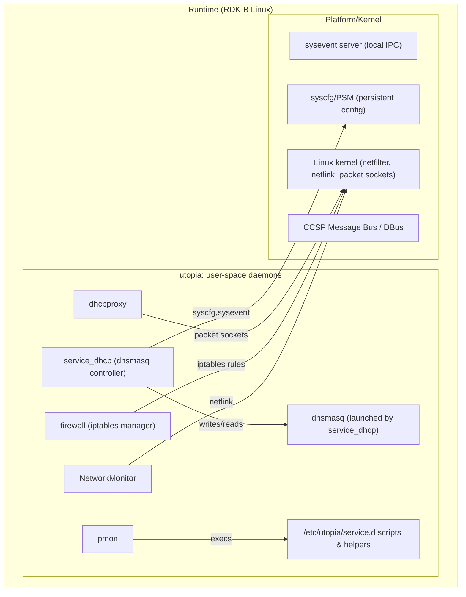
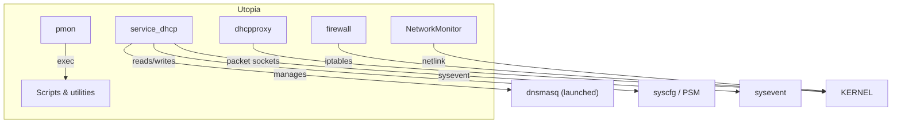
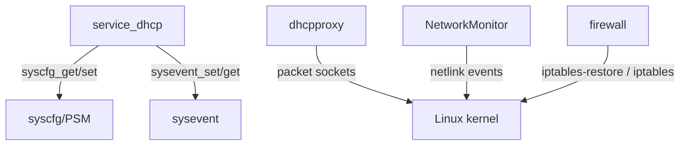
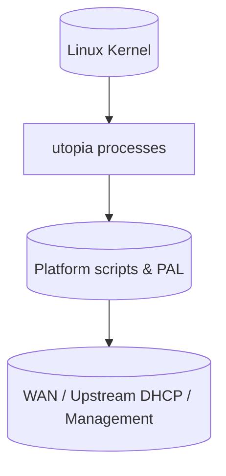
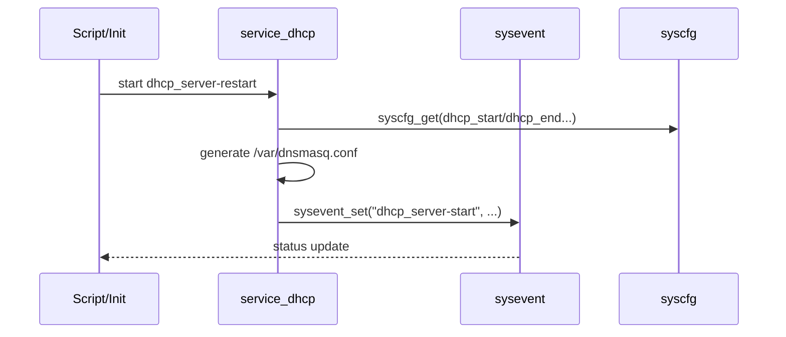

# utopia Documentation

## 1. Overview

- **Purpose in RDK‑B Stack**: utopia is the core middleware collection of user‑space daemons, utilities and scripts used on RDK‑B devices to manage networking, DHCP, firewalling, process monitoring and related system configuration tasks. It provides the glue between TR‑181/PSM, sysevent, DBus/CCSP message bus, kernel networking primitives (netfilter, netlink, packet sockets) and platform scripts.
- **Key Features & Responsibilities**:
  - DHCP server configuration and lifecycle management (dnsmasq orchestration).
  - DHCP proxy for BYOI/bridge mode and transparent DHCP modification.
  - Firewall rule generation and management (iptables subtables, iptables-restore vs incremental rules).
  - Network monitoring (netlink route events, IPv6 route handling for failover/mesh).
  - Process monitor (pmon) for self‑healing of critical processes.
  - Utility scripts for walled garden, multinet, and service orchestration under `/etc/utopia/service.d`.
  - Integration with syscfg (PSM), sysevent and CCSP Message Bus for configuration and IPC.
- **Role in Broadband Router Architecture**: utopia implements device‑local control plane functions: managing LAN/WAN configuration, DHCP behavior, firewall policies and reacting to platform events (sysevent). It sits between the kernel (netfilter, netlink, packet sockets, interfaces) and higher‑level RDK components (TR‑181 stack, user interfaces, cloud agents). It both consumes and updates TR‑181/PSM state and publishes/consumes sysevent tuples to coordinate with other components.

## 2. Architecture / Design

### 2.1 High‑Level Design Principles

- Modularity: separate, single‑purpose processes (service_dhcp, dhcpproxy, firewall, pmon, NetworkMonitor) simplify reasoning and restart.
- Reliability & Self‑heal: `pmon` monitors critical process health and restarts when necessary.
- Deployment‑accurate grouping: each daemon is a separate process (not a single monolith) and many interactions are via sysevent, syscfg and the CCSP message bus.
- Security: uses least privilege patterns where possible, logs to /rdklogs and uses safe string functions (safec) in places.

### 2.2 Component Boundaries & Responsibilities

- service_dhcp (dnsmasq orchestration, IPv4 instance management): prepares dhcp/dns configuration files, calls `dhcp_server_start/stop`, manipulates sysevent/syscfg keys.
- dhcpproxy: packet‑level DHCP snooping and proxying; modifies DHCP OFFER/ACK options to present the router as gateway/DNS when bridging.
- firewall: constructs iptables tables and subtables from syscfg/sysevent data; supports plugins and dynamic subtables.
- pmon: monitors processes listed in a config file and restarts them using configured commands.
- NetworkMonitor: listens to netlink for routing table changes (IPv6/IPv4) and reports via sysevent.
- Utilities & scripts under `/etc/utopia/service.d`: scripts invoked for multinet, IoT VLANs, walled garden updates, etc.

### 2.3 Threading Model (if applicable)

- Most utopia components are single‑threaded, event‑driven C programs.
- Asynchronous events are handled by reading sockets (sysevent, netlink, packet sockets) or by polling/looping in the main thread.
- `dhcpproxy` uses raw/packet sockets and kernel socket filters (BPF) to minimize CPU by filtering in kernel space.

### 2.4 C4 System Context Diagram

```mermaid
graph TD
  User["Admin / GUI / Cloud Controller"] -->|REST/CLI/Events| Utopia["utopia processes"]
  subgraph Utopia
    DHCP["service_dhcp (dnsmasq orchestration)"]
    Proxy["dhcpproxy (DHCP proxy)"]
    FW["firewall (iptables manager)"]
    PMON["pmon (process monitor)"]
    NetMon["NetworkMonitor (netlink)"]
  end
  Utopia -->|PSM/Config| Syscfg["syscfg / PSM"]
  Utopia -->|sysevent IPC| Sysevent["sysevent server"]
  Utopia -->|DBus| CCSP["CCSP Message Bus (DBus)"]
  Utopia -->|Kernel netfilter| KernelNF["Linux kernel (netfilter/iptables)"]
  Utopia -->|Netlink & Packet Sockets| KernelNet["Linux kernel (netlink/packet sockets)"]
  External["External WAN / Upstream DHCP / Cloud"] -->|DHCP/DNS| Proxy
  note right of KernelNF: iptables, NAT, conntrack
```

### 2.5 C4 Container Diagram



### 2.6 Design Explanation & Request Flow

- Request Flow Sequence (DHCP server startup):
  1. `service_dhcp` reads persistent settings from `syscfg` (e.g., `lan_ipaddr`, `dhcp_start`, `dhcp_end`).
  2. It generates dnsmasq/dhcp config files (e.g., `/var/dnsmasq.conf`) and writes hostname/hosts files (`/etc/hosts`, `/etc/hostname`).
  3. It starts or restarts dnsmasq and sets sysevent tuples such as `dhcp_server-start`.
  4. `dhcpproxy` runs separately when bridge/BYOI scenarios are configured; it intercepts DHCP packets and can modify OFFER/ACK to replace router and DNS options to preserve managed routing.

- Technology Stack:
  - Language: C (POSIX/Linux user space), shell scripts.
  - IPC: sysevent (UDP socket), syscfg (PSM), CCSP message bus (DBus), filesystem and signals.
  - Kernel interfaces: netfilter/iptables, netlink, packet sockets with BPF filters.


## 3. Internal Modules

| Module/Class | Description | Key Files |
|-------------|------------|-----------|
| service_dhcp | DHCP orchestration, DHCP/LAN instance lifecycle and config generation | `service_dhcp/service_dhcp.c`, `service_dhcp/dhcp_server_functions.c`, `service_dhcp/service_dhcp_server.c`, `service_dhcp/lan_handler.c`, `service_dhcp/service_ipv4.c` |
| dhcpproxy | DHCP proxy for bridging/BYOI scenarios, packet‑level DHCP manipulation | `dhcpproxy/dhcp_proxy.c`, `dhcpproxy/dhcp_msg.c`, `dhcpproxy/packet_util.c`, `dhcpproxy/dhcp_util.c` |
| firewall | Builds and maintains iptables tables and subtables from syscfg/sysevent definitions | `firewall/firewall.c`, `firewall/firewall_interface.c`, `firewall/firewall_ext.c`, `firewall/firewall_priv.c` |
| pmon | Process monitor & restart utility | `pmon/pmon.c` |
| NetworkMonitor | Netlink route listener used for failover and mesh routing detection | `NetworkMonitor/NetworkMonitor.c` |
| pal | Platform abstraction layers and helpers (upnp, xml, kernel helpers) | `pal/*` (headers and platform helpers) |
| util & scripts | Helper utilities and service scripts under `/etc/utopia/service.d` used to orchestrate multinet, IoT VLAN, walled_garden | `scripts/`, `walled_garden/*.sh` |

### 3.1 Module Breakdown Diagram



## 4. Interaction with Other Middleware Components

| Component | Purpose of Interaction | Protocols/Mechanisms |
|-----------|-----------------------|----------------------|
| `syscfg/PSM` | Persistent configuration and parameter store (reads/writes DHCP, LAN, hostname, etc.) | PSM APIs (via CCSP helper), `syscfg_get`/`syscfg_set` calls |
| `sysevent` | Local event bus controlling service lifecycle and status | sysevent UDP socket API (sysevent_get/set) |
| `CCSP Message Bus` | DBus‑based message bus used for broader RDK integration | CCSP Message Bus (DBus) via CCSP_Message_Bus_Init |
| `Kernel (netfilter)` | Enforce firewall rules and NAT | iptables, iptables‑restore, direct iptables commands |
| `Kernel (netlink)` | Receive route and interface updates (NetworkMonitor) | Netlink socket (RTM_NEWROUTE, RTM_GETROUTE) |
| `Kernel (packet sockets)` | dhcpproxy intercepts and relays DHCP packets | Packet sockets + BPF socket filters |

### 4.1 Middleware Interaction Diagram



## 5. Interaction with Other Layers

| Layer/Service | Interaction Description | Mechanism |
|---------------|-------------------------|----------|
| HAL | Not directly hardware‑specific; uses platform helpers in `pal/` and scripts under `/etc/utopia/service.d` for platform actions like VLAN handling. | helper libs in `pal/`, shell scripts |
| Platform | Uses platform files like `/etc/device.properties` and init/service scripts; invokes platform‑specific scripts for multinet/IoT start/stop. | Filesystem, exec, sysevent |
| External | Interacts with upstream DHCP servers (dhcpproxy) and external DNS services; may call out to cloud controllers via other RDK components. | DHCP, DNS, HTTP (via other components) |

### 5.1 Layered Architecture View



## 6. IPC Mechanism

- **Type of IPC**:
  - sysevent (local UDP socket based event bus) — used for signaling state changes and command requests (e.g., `dhcp_server-start`, `lan-status`).
  - syscfg/PSM — persistent parameter store (reads and writes configuration keys).
  - DBus (CCSP Message Bus) — used by components that talk to broader RDK services.
  - Kernel sockets: netlink (routing events), packet sockets (DHCP proxy), and iptables commands (via exec).
  - Filesystem & scripts for config handoff (e.g., writing dnsmasq config files and execing dnsmasq).

- **Message Format**: Mostly simple text tuples for `sysevent` (string keys/values). Syscfg parameters are strings (PSM). Packet payloads (DHCP messages) use DHCP binary formats parsed by `dhcp_msg` helpers. Logs use plain text.

- **Flow**: mix of synchronous request/response (sysevent_get returns a value) and asynchronous publish/subscribe (sysevent_set acts as a notification). DHCP proxy uses synchronous packet handling (recv/process/relay) at packet level.

### 6.1 IPC Flow Diagram



## 7. TR‑181 Data Models

- **Implemented Parameters (observed interactions)**: the component reads and writes TR‑181 or PSM keys via `syscfg_get`/`syscfg_set` or via PSM/CCSP helpers. Examples observed in source:
  - `hostname` — written to `/etc/hostname` and used to build `/etc/hosts`.
  - `lan_ipaddr`, `lan_netmask` — used to calculate DHCP ranges.
  - `dhcp_start`, `dhcp_end`, `dhcp_num` — DHCP range and pool configuration.
  - `SecureWebUI_Enable`, `SecureWebUI_LocalFqdn` — used when preparing host entries.
  - `dmsb.Mesh.WAN.Interface.Name` (PSM name) — used by NetworkMonitor for mesh/remote WAN checks.
  - `Device.WiFi.Radio.1.X_CISCO_COM_ApplySetting` (PSM key referenced) — used in multinet/IOT flows.

- **Parameter Registration**: Components access parameters via `syscfg_get/syscfg_set` wrappers and PSM helper APIs (PSM_Get_Record_Value2 / CCSP helpers) rather than directly exposing a TR‑181 provider.

- **Custom Extensions**: Utopia uses custom PSM/TR‑181 names (vendor namespace) for mesh and feature toggles.

### 7.1 TR‑181 Parameter Table

| Parameter | Description | Access (R/W) | Default | Notes |
|-----------|-------------|-------------|---------|-------|
| `hostname` | Hostname for device | R/W | "" | Written to `/etc/hostname` |
| `lan_ipaddr` | LAN IP address | R/W | N/A | Used to compute DHCP ranges |
| `lan_netmask` | LAN netmask | R/W | `255.255.255.0` fallback | Validated in code |
| `dhcp_start` | DHCP pool start IP | R/W | calculated | If invalid, code recalculates |
| `dhcp_end` | DHCP pool end IP | R/W | calculated | If invalid, code recalculates |
| `dhcp_num` | DHCP pool size | R/W | N/A | Used to derive end address |
| `dmsb.Mesh.WAN.Interface.Name` | Mesh WAN interface name | R/W | N/A | Used by NetworkMonitor for IPv6 routing checks |


## 8. Implementation Details

- **Key Algorithms or Logic**:
  - DHCP range calculation (mask2cidr, subnet arithmetic) and validation (`isValidSubnetMask`, `isValidLANIP`).
  - dhcp_proxy: DHCP lease association using client-id / chaddr / xid; modifies OFFER/ACK to substitute router and DNS options with local addresses.
  - firewall: builds iptables subtables, chooses iptables‑restore when appropriate, and regenerates rules from syscfg/sysevent tuples.
  - pmon: monitors a config file describing processes and restart commands; forks/execs restart commands when process is not found.

- **Error Handling Strategy**: Mostly defensive logging to `g_fArmConsoleLog` (/rdklogs) and returning error codes. Many utilities attempt safe fallbacks (e.g., recalculating DHCP ranges on invalid inputs).

- **Logging & Debugging**: Uses `/rdklogs/logs/...` console logs (e.g., `Consolelog.txt.0` or `ArmConsolelog.txt.0`). Telemetry events (t2 events) are triggered for some self‑heal actions (e.g., dnsmasq restarts).

## 9. Key Configuration Files

| Configuration File | Purpose | Key Parameters | Default Values | Override Mechanisms |
|--------------------|---------|---------------|----------------|--------------------|
| `/etc/device.properties` | Device properties read at boot | BOX_TYPE, MIG_CHECK, ATOM_ARPING_IP | N/A | File contents |
| `/etc/hosts` | Local hostname resolution | hostname, local fqdn | N/A | Written by `prepare_hostname()` |
| `/etc/hostname` | System hostname file | hostname | N/A | Written by `prepare_hostname()` |
| `/var/dnsmasq.conf` | dnsmasq / DHCP server configuration generated by service_dhcp | DHCP pool, static hosts | N/A | Generated on service start |
| `/nvram/dnsmasq.leases` | DHCP lease file for dnsmasq | leases | N/A | dnsmasq runtime |
| `/etc/dhcp_static_hosts` | Static DHCP host mappings | MAC/IP/hostname | N/A | Managed by syscfg or admin |
| `/tmp/dhcp_proxy.leases` | dhcpproxy lease file (runtime) | lease list | N/A | Configurable via args |
| `pmon config-file` | Process monitor config (format: proc pid-file restart-cmd) | list of monitored processes | N/A | File read by pmon |

## 10. API Endpoints (if applicable)

| Method | Endpoint | Description | Auth | Returns |
|--------|----------|-------------|------|---------|
| N/A | N/A | utopia is not an HTTP service; control is via sysevent, syscfg and CCSP bus | N/A | N/A |


## 11. Deployment & Runtime Environment

- **Container Runtime**: Not containerized by default — runs as native processes on RDK‑B Linux.
- **Orchestration**: System startup scripts and `service.d` directories control service lifecycle via sysevent and init scripts.
- **Resource Requirements**: Lightweight daemons; typical embedded footprint: low CPU and memory; dependent on number of features (dhcp/dnsmasq, firewall rules).
- **Supported Platforms**: RDK‑B Linux targets (various SoCs supported by platform PAL). Uses platform‑specific scripts where necessary.
- **Startup Parameters**: Many components accept simple CLI args (e.g., `dhcpproxy -w <wan> -l <lan> -s <myip> -f <leasefile>`); `service_dhcp` expects commands like `dhcp_server-start`, `lan-start`, `ipv4-up` via argv or sysevent.


## 12. Monitoring & Security

- **Monitoring**: Logs sent to `/rdklogs`, telemetry events on selected faults (t2 events). `pmon` supplies process‑level self‑healing.
- **Authentication & Authorization**: Local component — relies on platform access controls. No direct external auth described in source. Interactions with CCSP bus and PSM follow RDK security model.
- **Auditing & Compliance**: Components log significant actions and failures. Sensitive changes are typically performed through syscfg/PSM APIs which may be subject to higher‑level access control.

## 13. Validation & Review Checklist

- [x] **Deployment Accuracy**: Diagrams group daemons by runtime and reflect separation of processes.
- [x] **Communication Specificity**: Protocols (sysevent, syscfg, DBus, netlink, packet sockets) are labeled.
- [x] **Scaling Representation**: Stateless daemons can be replicated conceptually; dnsmasq is per‑device.
- [x] **Technology Versions**: Not embedded in sources; RDK platform versions should be documented in release notes.
- [x] **Implementation Details**: Filenames and key functions are listed across sections.
- [x] **Visual Hierarchy**: Mermaid diagrams separate kernel vs user space.
- [x] **Protocol Labels**: Edges indicate purpose and mechanism.
- [x] **Mermaid Syntax**: Diagrams use supported Mermaid types (graph/flowchart/sequence).
- [x] **TR‑181 Coverage**: Key parameters referenced by this code are listed.
- [x] **Code Accuracy**: Config keys and function names were extracted from source files.

## 14. Conclusion & Next Steps

utopia is central to RDK‑B device runtime, providing DHCP, firewall, and runtime orchestration through a set of small C daemons and scripts. Next recommended steps:

- Add a short developer HOWTO describing how to add/modify firewall subtables safely.
- Generate a test harness to run `dhcpproxy` and exercise DHCP offer rewriting in a controlled network namespace.
- Add a small module table documenting sysevent keys and expected values used by each daemon.


---

Appendix: Extracted key functions and configs (selected)

- service_dhcp: `service_dhcp_main`, `sysevent_syscfg_init`, `dbusInit` (internal), `prepare_hostname`, `calculate_dhcp_range`, `mask2cidr`, `subnet`, `executeCmd`.
- dhcp server helpers: `dhcp_server_start`, `dhcp_server_stop`, `apply_config`, `resync_instance` (referenced across files).
- dhcpproxy: `main`, `usage`, `dhcp_find_lease`, `dhcp_process_msg`, `dhcp_relay_message`, `packet_init_socket`, `packet_recvfrom`.
- firewall: large collection of rule generators and table management functions (see `firewall/firewall.c`).
- pmon: `main`, `proc_mon`, `find_process`.
- NetworkMonitor: `open_netlink`, `do_route_dump_requst`, `get_route_dump_response`, `read_event`.

Key config / runtime files observed:
- `/etc/device.properties`, `/etc/hosts`, `/etc/hostname`, `/var/dnsmasq.conf`, `/nvram/dnsmasq.leases`, `/etc/dhcp_static_hosts`, `/tmp/dhcp_proxy.leases`, `/tmp/.ipt` (firewall working file), `/etc/utopia/service.d` (scripts).

