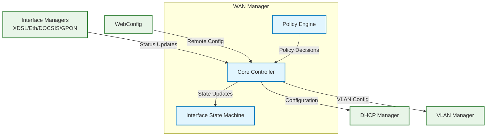
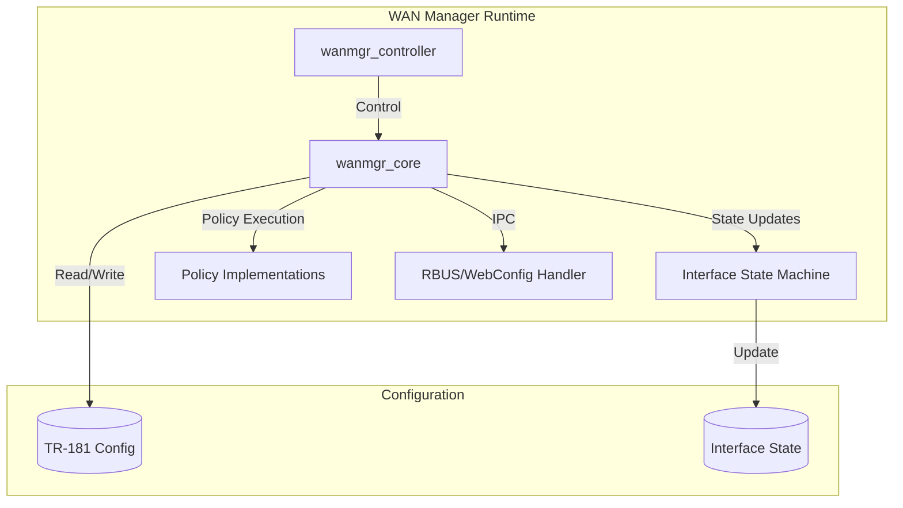
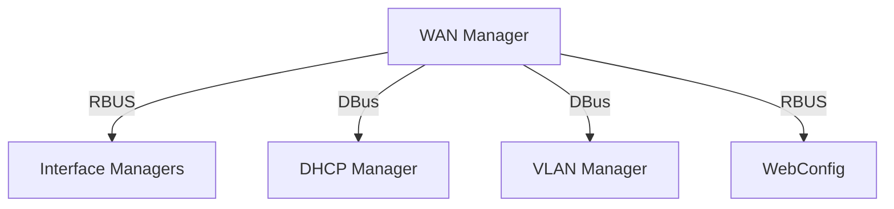
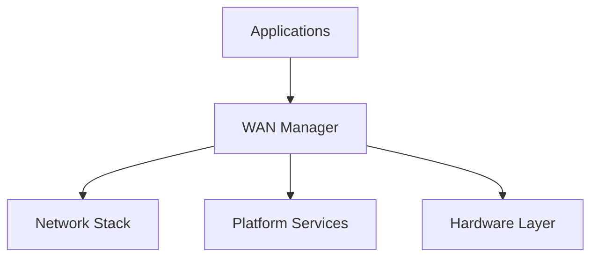
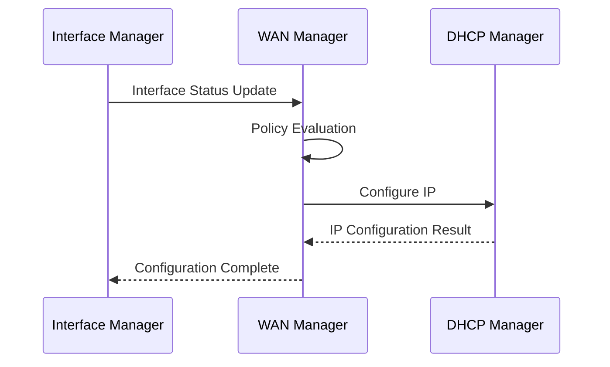

# WAN Manager Documentation

## 1. Overview

- **Purpose in RDK‑B Stack**: The WAN Manager is a core RDK-B component responsible for managing WAN interface configuration, failover, and Internet connectivity. It acts as the central orchestrator for all WAN-related operations, coordinating between different interface managers (XDSL, Ethernet, DOCSIS, GPON, Cellular) and ensuring reliable Internet connectivity.

- **Key Features & Responsibilities**:
  - Manages WAN interface lifecycle and configuration
  - Implements intelligent failover policies between interface groups
  - Handles link and IP layer configuration across interfaces
  - Coordinates with other RDK components for network configuration
  - Provides flexible selection policies for interface groups
  - Supports RBUS and WebConfig for remote configuration
  - Manages virtual interface configurations and state machines

- **Role in Broadband Router Architecture**: WAN Manager serves as the central control point for WAN connectivity, abstracting the complexities of different physical interfaces and providing a unified management layer for configuring and maintaining Internet connectivity.

## 2. Architecture / Design

### 2.1 High‑Level Design Principles

- **Modularity**: Separates concerns between interface management, policy decisions, and state machines
- **Flexibility**: Supports multiple selection policies and interface groups
- **Reliability**: Implements robust failover mechanisms and state management
- **Extensibility**: Allows addition of new interface types and policies
- **Standardization**: Uses TR-181 data model for configuration and management

### 2.2 Component Boundaries & Responsibilities

- **Interface Management**:
  - Physical interface status monitoring
  - IP configuration management
  - VLAN and network stack configuration

- **Policy Engine**:
  - Failover policy management
  - Interface selection policies
  - Group-based interface management

- **State Management**:
  - Interface state machine handling
  - Configuration validation
  - Event processing

### 2.3 Threading Model

The WAN Manager implements a multi-threaded architecture:
- Main thread for core operations and event handling
- Dedicated threads for:
  - Interface state machines
  - Policy execution
  - Event processing
  - RBUS/WebConfig handlers

### 2.4 C4 System Context Diagram



### 2.5 Container Diagram



### 2.6 Design Explanation & Request Flow

- **Request Flow Sequence**: 
  1. Interface Manager reports physical interface status
  2. WAN Manager core processes status update
  3. Policy engine determines appropriate action
  4. State machine executes configuration changes
  5. Configuration applied through DHCP/VLAN managers

- **Technology Stack**:
  - Language: C
  - IPC: RBUS, DBus
  - Configuration: TR-181 data model
  - Build System: Autotools
  - Testing: GTest framework

## 3. Internal Modules

| Module/Class | Description | Key Files |
|-------------|------------|-----------|
| Core Controller | Main control logic | `wanmgr_controller.c`, `wanmgr_core.c` |
| Interface State Machine | Interface state management | `wanmgr_interface_sm.c` |
| Policy Engine | Failover and selection policies | `wanmgr_policy_*.c` |
| DHCP Client | DHCP operations | `wanmgr_dhcpv4_apis.c`, `wanmgr_dhcpv6_apis.c` |
| Configuration | TR-181 handlers | `wanmgr_data.c`, `wanmgr_webconfig.c` |

### 3.1 Module Breakdown Diagram

```mermaid
flowchart TD
    subgraph Core [Core Components]
        Controller[Controller]
        Core[Core Logic]
        Data[Data Manager]
        
        Controller --> Core
        Core --> Data
    end
    
    subgraph Policies [Policy Engine]
        Failover[Failover Policy]
        AutoWAN[AutoWAN Policy]
        ParallelScan[Parallel Scan]
        
        Failover --> AutoWAN
        Failover --> ParallelScan
    end
    
    subgraph StateMachine [Interface Management]
        FSM[State Machine]
        DHCPv4[DHCPv4 Client]
        DHCPv6[DHCPv6 Client]
        
        FSM --> DHCPv4
        FSM --> DHCPv6
    end
    
    Core --> Policies
    Core --> StateMachine
```

## 4. Interaction with Other Middleware Components

| Component | Purpose of Interaction | Protocols/Mechanisms |
|-----------|----------------------|-------------------|
| Interface Managers | Physical interface status | RBUS |
| DHCP Manager | IP configuration | DBus |
| VLAN Manager | VLAN configuration | DBus |
| WebConfig | Remote configuration | RBUS/HTTP |

### 4.1 Middleware Interaction Diagram



## 5. Interaction with Other Layers

| Layer/Service | Interaction Description | Mechanism |
|---------------|------------------------|-----------|
| Network Stack | Interface configuration | System calls |
| Platform Services | Device information | RBUS |
| Hardware Layer | Physical interface status | Interface Managers |
| Configuration | TR-181 data model | RBUS/WebConfig |

### 5.1 Layered Architecture View



## 6. IPC Mechanism

- **Type of IPC**: 
  - RBUS for configuration and events
  - DBus for middleware communication
  - System calls for network configuration

- **Message Format**: 
  - RBUS messages for component communication
  - TR-181 parameter structures
  - JSON for WebConfig

- **Flow**: 
  - Event-driven for interface status updates
  - Synchronous for configuration operations
  - Asynchronous for policy decisions

### 6.1 IPC Flow Diagram



## 7. TR‑181 Data Models

- **Implemented Parameters**: Major parameter groups include:
  - X_RDK_WanManager.*
  - Device.IP.Interface.*
  - Device.Ethernet.Link.*
  - Device.PPP.Interface.*

- **Parameter Registration**:
  - Parameters registered via RBUS
  - WebConfig integration for remote management
  - Event notifications for state changes

### 7.1 TR‑181 Parameter Table

| Parameter | Description | Access (R/W) | Notes |
|-----------|------------|--------------|-------|
| X_RDK_WanManager.Enable | Enable/disable WAN Manager | R/W | Main control |
| X_RDK_WanManager.ActiveInterface | Currently active interface | R | Status info |
| X_RDK_WanManager.SelectedGroup | Selected interface group | R/W | Policy control |

## 8. Implementation Details

- **Key Algorithms**:
  - Interface selection policy implementation
  - Failover decision making
  - State machine transitions
  - Configuration validation

- **Error Handling**:
  - Interface status monitoring
  - Connection failure detection
  - Policy execution failures
  - Configuration errors

- **Logging & Debugging**:
  - RDK logging framework
  - Telemetry integration
  - Debug level controls
  - State machine logging

## 9. Key Configuration Files

| Configuration File | Purpose | Key Parameters |
|--------------------|---------|----------------|
| `RdkWanManager_v2.xml` | TR-181 data model definition | Interface parameters |
| `wanmgr_config.json` | Component configuration | Policy settings |
| `wanmgr_defaults.json` | Default configuration values | Interface defaults |

## 10. API Endpoints

The component exposes interfaces through RBUS and DBus:

| Method | Purpose | Parameters |
|--------|---------|------------|
| GetInterfaceStatus | Get interface status | Interface name |
| SetActiveInterface | Set active interface | Interface name, group |
| ConfigureInterface | Configure interface | Interface config |

## 11. Deployment & Runtime Environment

- **Container Runtime**: Runs as a native RDK-B process
- **Orchestration**: Managed by RDK-B process manager
- **Resource Requirements**: Moderate CPU and memory usage
- **Supported Platforms**: All RDK-B platforms
- **Startup Parameters**: Configuration file path, log level

## 12. Monitoring & Security

- **Monitoring**:
  - Interface status monitoring
  - Connection health checks
  - Performance metrics
  - Event logging

- **Authentication & Authorization**:
  - RBUS security mechanisms
  - WebConfig authentication
  - Parameter access control

## 13. Validation & Review Checklist

- [x] Deployment accuracy verified
- [x] Communication flows documented
- [x] Scaling considerations addressed
- [x] Implementation details included
- [x] Visual hierarchy maintained
- [x] TR-181 coverage complete

## 14. Conclusion & Next Steps

The WAN Manager is a critical component in the RDK-B stack, providing robust WAN interface management and failover capabilities. Future enhancements may include:

- Additional interface type support
- Enhanced policy algorithms
- Improved telemetry
- Extended WebConfig integration

References:
- Source code: https://github.com/rdkcentral/rdkb-wan-manager
- RDK-B documentation
- TR-181 specification