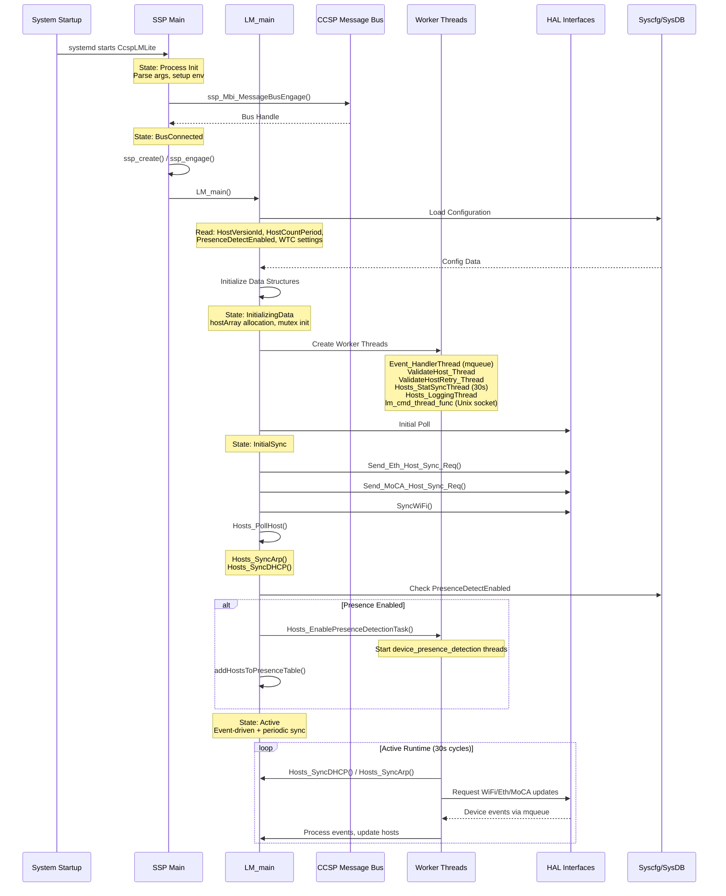
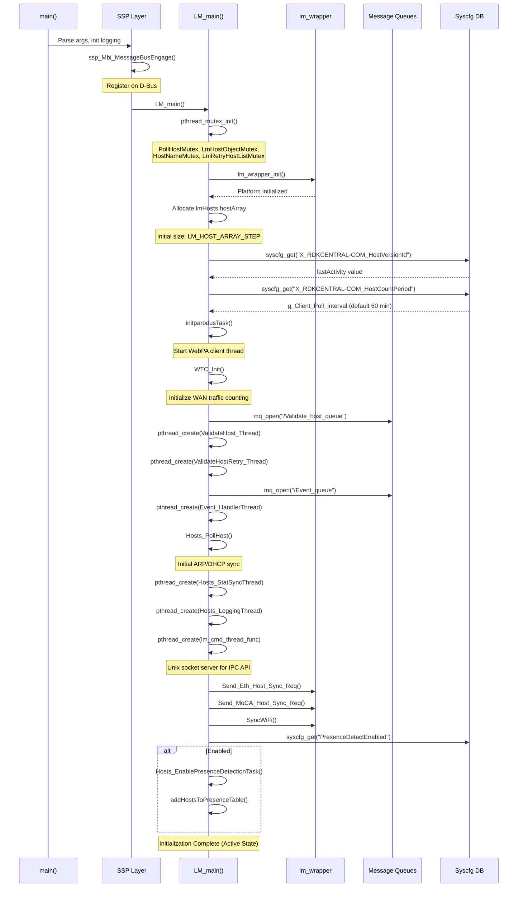
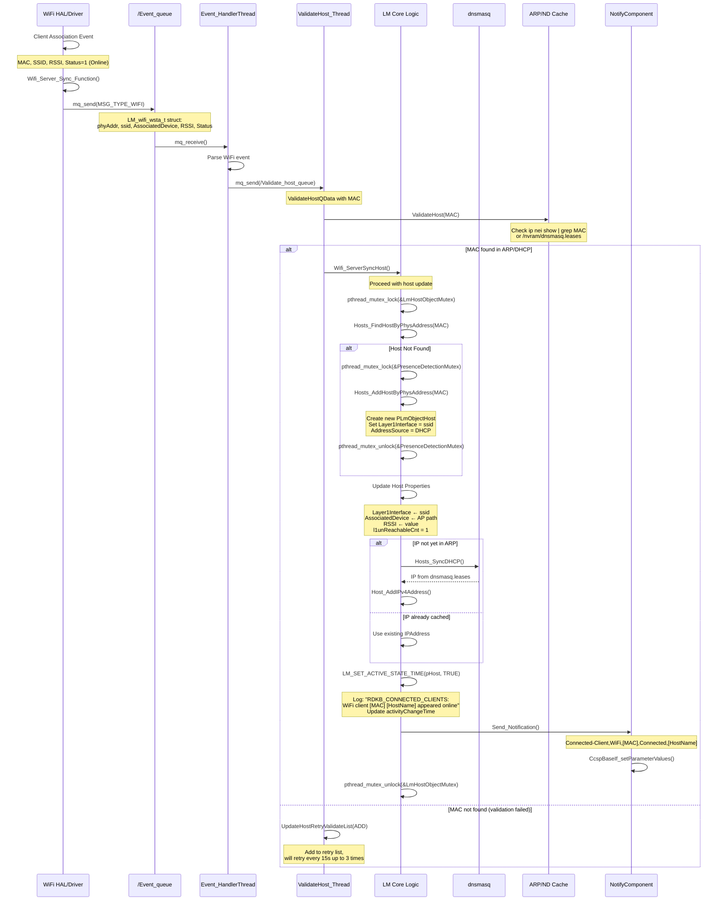
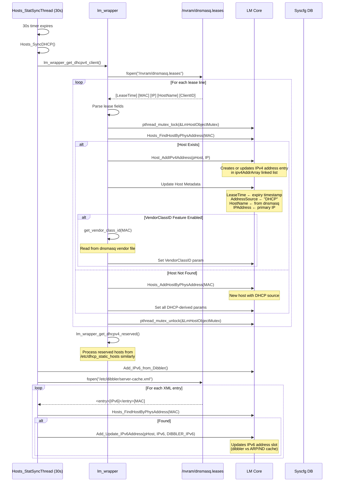
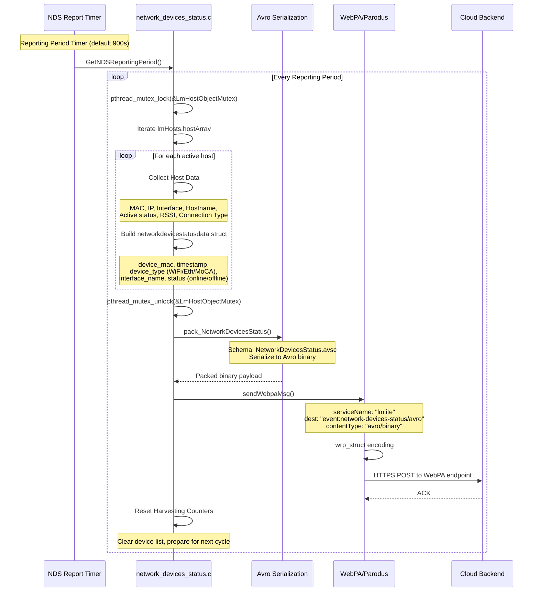
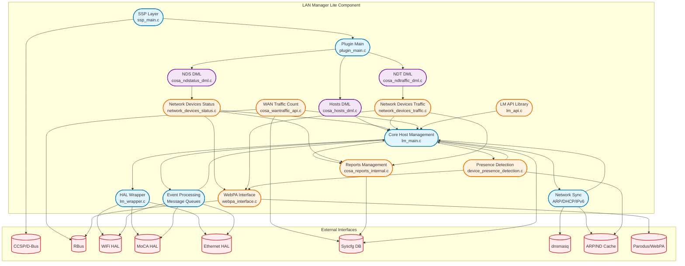

# LAN Manager Lite - Design and Internal Modules Documentation

## Design

LAN Manager Lite (LMLite) is a lightweight RDK-B middleware component that tracks, monitors, and reports connected network devices across various interfaces (Ethernet, WiFi, MoCA) on RDK-B gateways. The component implements a streamlined architecture that minimizes resource consumption while providing network device visibility and reporting capabilities.

The design employs an event-driven architecture combined with periodic polling mechanisms to maintain real-time awareness of device connectivity states. LMLite integrates with the TR-181 data model, implementing Device.Hosts.Host.* objects and providing northbound data access through CCSP message bus (D-Bus) and RBus interfaces. The component aggregates information from multiple southbound sources including ARP tables, DHCP leases (dnsmasq), WiFi HAL, MoCA HAL, and Ethernet HAL, providing a unified view of network-attached devices.

Key design principles include:

1. **Resource Optimization**: Designed to operate efficiently on resource-constrained devices, with configurable polling intervals and optimized data structures. The component limits host table size to 200 entries and implements smart cleanup mechanisms to free inactive DHCP hosts.

2. **Multi-Interface Support**: Abstracts device tracking across Ethernet, WiFi (2.4GHz, 5GHz, 6GHz), and MoCA interfaces, normalizing data from disparate HAL implementations into a unified host representation.

3. **Real-Time Event Processing**: Implements message queue-based event handling for immediate response to network state changes from WiFi association/disassociation, Ethernet link events, and MoCA client updates.

4. **Data Persistence and Synchronization**: Utilizes syscfg for persistent storage of configuration parameters and host-related metadata (comments, presence detection settings). Maintains versioned host activity tracking through `X_RDKCENTRAL-COM_HostVersionId` for WebPA synchronization.

5. **Telemetry and Analytics**: Integrates telemetry reporting through Avro serialization for network device status and traffic metrics, with configurable harvesting and reporting periods supporting accelerated scans via TTL overrides.

### North-South Interface Integration

**Northbound Interfaces:**
- **CCSP/D-Bus Interface**: Exposes TR-181 data model objects (Device.Hosts.Host.*) for access by CcspPandM and other RDK-B components. Implements standard CCSP DML APIs (GetParamStringValue, SetParamBoolValue, etc.) registered through the CCSP message bus.
- **RBus Interface**: Provides RBus-based parameter access and event subscriptions for WAN traffic counting and operational mode monitoring (LAN/WAN mode transitions).
- **WebPA/Parodus Integration**: Supports bidirectional communication with cloud backends through the WebPA protocol, enabling remote device management and telemetry upload. Includes seshat-based service discovery for WebPA endpoint registration.
- **Unix Domain Socket API**: Exposes a command-based IPC interface (`/tmp/lm_server_pipe`) for direct host queries, comment management, and online device counting used by external applications and scripts.

**Southbound Interfaces:**
- **HAL Abstraction Layer**: Integrates with platform HAL implementations (platform_hal, wifi_hal, moca_hal) to retrieve hardware-specific device information, signal strength (RSSI), and interface statistics.
- **Network Stack Integration**: Monitors Linux kernel networking via ip neighbor tables (ARP/ND cache) for IPv4/IPv6 reachability using core_net_lib or direct netlink/proc parsing.
- **DHCP Integration**: Synchronizes with dnsmasq lease files (`/nvram/dnsmasq.leases`) and communicates via message queues to track DHCP-assigned addresses and client hostnames. Also consumes dibbler server cache for IPv6 DHCP leases.
- **Syscfg/Sysevent**: Leverages RDK-B system configuration databases for persistent parameter storage and runtime event notifications (bridge mode changes, lan_ipaddr updates).

### IPC Mechanisms

LMLite employs multiple IPC mechanisms optimized for different communication patterns:

1. **POSIX Message Queues**:
   - `/Event_queue`: Main event queue (size 2048 bytes) for WiFi, Ethernet, MoCA, and RFC notification events. Supports high-throughput asynchronous event delivery from HAL components to the main processing thread.
   - `/dnsmasq_eventqueue`: Dedicated queue (512 bytes) for dnsmasq notifications about DHCP lease events and presence detection messages.
   - `/Validate_host_queue`: Queue for host validation requests, enabling asynchronous MAC address validation against ARP and DHCP tables with retry logic.

2. **CCSP Message Bus (D-Bus)**:
   - Component ID: `eRT.com.cisco.spvtg.ccsp.lmlite`
   - Bus path: `/com/cisco/spvtg/ccsp/lmlite`
   - Implements CCSP base APIs for parameter get/set, signal emits for Connected-Client notifications (when NotifyComponent is available).
   - Synchronous request-response for TR-181 data model access.

3. **RBus**:
   - Used for WAN traffic counting feature
   - Subscribe to WAN Manager events: `Device.X_RDK-Central_COM_EthWan.CurrentOperationalMode` and `Device.X_RDK-Central_COM_EthWan.Intf.1.OperationalStatus`
   - Publishes WAN traffic statistics events for consumption by telemetry and analytics components

4. **Unix Domain Sockets**:
   - Server: `/tmp/lm_server_pipe` (SOCK_STREAM)
   - Client API library (`lm_api.c/lm_api.h`) provides blocking request-response pattern
   - Supports commands: GET_HOSTS, GET_HOST_BY_MAC, SET_COMMENT, GET_ONLINE_DEVICE

### Data Persistence and Storage Management

LMLite uses a hybrid approach for data persistence:

**Volatile Storage (RAM):**
- Active host table (`lmHosts.hostArray`) maintained in-memory with dynamic sizing (LM_HOST_ARRAY_STEP increments)
- Host objects contain both TR-181 parameters and internal state (l3unReachableCnt, activityChangeTime, retry counters)
- Separate presence detection host lists managed in dedicated threads with mutex synchronization

**Persistent Storage (syscfg):**
- Configuration parameters: `PresenceDetectEnabled`, `X_RDKCENTRAL-COM_HostVersionId`, `X_RDKCENTRAL-COM_HostCountPeriod`
- Per-host presence settings: `PDE_<mac_address>` (lowercase MAC)
- Host comments: Stored via `lm_wrapper_priv_getLanHostComments()` / `lm_wrapper_priv_set_lan_host_comments()`
- Network Device Status/Traffic harvesting parameters: Polling periods, reporting periods, TTL overrides
- WAN Traffic Count DSCP mappings and interval settings

**File-Based Persistence:**
- Reads from `/nvram/dnsmasq.leases` for DHCP lease synchronization
- Reads from `/etc/dibbler/server-cache.xml` for IPv6 DHCP leases
- Temporary cache files: `/tmp/arp.txt`, `/tmp/dns.txt` for validation operations
- Avro schema definitions: `NetworkDevicesStatus.avsc`, `NetworkDevicesTraffic.avsc` for telemetry formatting

**WebPA Synchronization:**
- `lastActivity` counter persisted as `X_RDKCENTRAL-COM_HostVersionId` in syscfg, incremented on every host addition/connection event
- Enables WebPA to detect stale cached data and request full host table refresh

**Cleanup Policy:**
- Inactive DHCP hosts with expired leases removed when host count exceeds HOST_ENTRY_LIMIT (175)
- Hosts with `AddressSource=DHCP` and `LeaseTime < currentTime` eligible for garbage collection
- Host table compaction performed in `Clean_Host_Table()` before adding new hosts

## Component State Flow

### Initialization to Active State

LMLite's lifecycle progresses through several well-defined states from system startup to active monitoring:

### Runtime State Changes and Context Switching

During normal operation, LMLite responds to several state-changing triggers:

**Bridge Mode Transition:**
- **Trigger**: `Hosts_stop_scan()` returns TRUE (detected via `lm_wrapper_priv_stop_scan()` checking bridge mode syscfg)
- **Action**: Calls `Hosts_RmHosts()` to clear all host entries from memory
- **Impact**: Suspends all active monitoring, event processing continues but hosts are not tracked
- **Recovery**: On return to router mode, re-initiates Send_Eth_Host_Sync_Req(), SyncWiFi(), Send_MoCA_Host_Sync_Req()

**Presence Detection Enable/Disable:**
- **Enable Trigger**: RFC/DML setting `PresenceDetectEnabled=true` via MSG_TYPE_RFC queue message
- **Action**: `Hosts_EnablePresenceDetectionTask()` → starts ARP/ND monitoring threads, registers all current hosts
- **Disable Trigger**: `PresenceDetectEnabled=false`
- **Action**: `Hosts_DisablePresenceDetectionTask()` → stops monitoring threads, clears syscfg entries (PDE_*), sends dnsmasq disable message
- **Impact**: Affects PresenceActive parameter updates and presence notification events

**WAN Failover Mode Switch:**
- **Trigger**: RBus event from WAN Manager on `InterfaceActiveStatus` change
- **Action**: `get_WanManager_ActiveInterface()` updates active interface, adjusts WAN traffic counting
- **Context**: Switches between primary and backup WAN links, affects traffic statistics collection

**Network Device Status/Traffic Accelerated Scan:**
- **Trigger**: `SetNDSOverrideTTL()` / `SetNDTOverrideTTL()` with non-zero value
- **Action**: Temporarily reduces polling/reporting period to TTL-specified interval
- **Expiry**: TTL counts down, reverts to default periods when reaches zero
- **Use Case**: On-demand rapid device scanning for troubleshooting or cloud-initiated diagnostics

**Host Activity State Transitions:**
- Hosts transition between Active=TRUE/FALSE based on L1 reachability (WiFi association), L3 reachability (ARP/ND cache)
- `LM_SET_ACTIVE_STATE_TIME()` macro manages state changes with logging:
  - Online: "Client type is [WiFi|Ethernet|MoCA], MacAddress is [MAC] and HostName is [NAME] appeared online"
  - Offline: "[Interface] client with [MAC] MacAddress and [NAME] HostName gone offline"
- Connected-Client notifications: Sends CLIENT_STATE_CONNECT, CLIENT_STATE_ONLINE, CLIENT_STATE_OFFLINE events to NotifyComponent via CCSP setParameterValues

## Call Flow

### Initialization Call Flow

### WiFi Client Association Event Flow

This sequence diagram illustrates the critical path when a WiFi client associates with an access point:

### DHCP Lease Synchronization Flow

### Network Device Status Telemetry Reporting Flow

## Internal Modules

LMLite is organized into several functional modules, each responsible for specific aspects of device tracking and reporting:

| Module/Class | Description | Key Files |
|-------------|------------|-----------|
| **Core Host Management** | Manages the main host table data structure, host lifecycle (add/remove/update), and host property getters/setters. Implements TR-181 Device.Hosts.Host.* DML handlers. Maintains host versioning and activity tracking. | `lm_main.c`, `lm_main.h`, `cosa_hosts_dml.c`, `cosa_hosts_dml.h` |
| **HAL Wrapper Layer** | Abstracts platform-specific HAL interfaces for WiFi, Ethernet, and MoCA. Normalizes device information from HAL into LMLite's internal data structures. Handles WiFi SSID-to-Radio mapping and association device tracking. | `lm_wrapper.c`, `lm_wrapper.h`, `lm_wrapper_priv.c`, `lm_wrapper_priv.h` |
| **Network Sync Module** | Synchronizes host data with ARP/ND cache, DHCP lease files (dnsmasq), and dibbler IPv6 cache. Implements polling and validation logic for IP address reachability. Manages MAC-to-IP address mapping. | `lm_main.c` (Hosts_SyncArp, Hosts_SyncDHCP, Add_IPv6_from_Dibbler functions), `lm_wrapper.c` |
| **Event Processing** | Processes asynchronous events from WiFi, Ethernet, MoCA HALs via message queues. Implements event-driven host updates for association/disassociation, link up/down. Coordinates host validation and retry mechanisms. | `lm_main.c` (Event_HandlerThread, ValidateHost_Thread, ValidateHostRetry_Thread) |
| **Network Devices Status Reporting** | Collects and reports network device status telemetry using Avro serialization. Implements harvesting, polling, and reporting period management. Supports accelerated scans via TTL override. | `network_devices_status.c`, `network_devices_status.h`, `network_devices_status_avropack.c`, `network_devices_status_avropack.h`, `cosa_ndstatus_dml.c`, `cosa_ndstatus_dml.h` |
| **Network Devices Traffic Reporting** | Monitors and reports network traffic statistics per device using ebtables/iptables. Provides traffic count telemetry in Avro format. Includes polling/reporting configuration and TTL override support. | `network_devices_traffic.c`, `network_devices_traffic.h`, `network_devices_traffic_avropack.c`, `network_devices_traffic_avropack.h`, `cosa_ndtraffic_dml.c`, `cosa_ndtraffic_dml.h` |
| **WAN Traffic Count Module** | Tracks WAN interface traffic statistics with DSCP-based classification. Subscribes to WAN Manager events via RBus for interface status changes. Implements traffic collection intervals and threshold reporting. | `cosa_wantraffic_api.c`, `cosa_wantraffic_api.h`, `cosa_wantraffic_utils.c`, `cosa_wantraffic_utils.h`, `wtc_rbus_apis.c`, `wtc_rbus_handler_apis.c` |
| **Presence Detection** | Implements advanced device presence monitoring using ARP/ND probing. Detects join/leave events for configured devices. Manages per-device presence notification enablement. Sends presence notifications via WebPA. | `device_presence_detection.c`, `device_presence_detection.h`, `webpa_pd_with_seshat.c`, `webpa_pd_without_seshat.c`, `webpa_pd.h` |
| **WebPA Interface Module** | Provides WebPA client integration for cloud communication. Handles device MAC retrieval, active interface detection (WAN failover). Implements RBus initialization and event subscription for WAN Manager. Manages parodus task for WebPA message transport. | `webpa_interface.c`, `webpa_interface.h` |
| **Reports Management** | Manages configuration for Network Device Status/Traffic reporting. Stores harvesting enable/disable state, polling periods, reporting periods, and TTL overrides in persistent storage (syscfg). Provides default value management. | `cosa_reports_internal.c`, `cosa_reports_internal.h` |
| **SSP (Service Specific Provider)** | Implements RDK-B SSP framework integration. Handles component initialization, message bus registration, and lifecycle management (create, engage, cancel). Provides main entry point and command dispatch. | `ssp_main.c`, `ssp_action.c`, `ssp_global.h`, `ssp_messagebus_interface.c`, `ssp_messagebus_interface.h` |
| **Plugin Main** | Registers LMLite's DML (Data Model Library) handlers with CCSP framework. Exports plugin entry points for TR-181 object access. Bridges between CCSP infrastructure and LMLite-specific implementations. | `plugin_main.c`, `plugin_main.h` |
| **LM API Library** | Provides programmatic C API for external applications to query LMLite data. Implements Unix domain socket client for IPC with lm_cmd_thread_func. Supports get hosts, get host by MAC, set comments, get online device count. | `lm_api.c`, `lm_api.h`, `lm_api_test.c` |
| **Management Server DML** | Implements TR-181 Device.ManagementServer.* data model handlers. Provides manageable device enablement and periodic inform configuration. | `cosa_managementserver_apis.c`, `cosa_managementserver_dml.c`, `cosa_managementserver_dml.h` |
| **Extended Hosts (XHosts)** | Manages extended host table for XHS (eXtended Home Security) WiFi clients connected to SSID.3/SSID.4. Maintains separate host array (XlmHosts) for XHS devices. Logs XHS camera/touchscreen connectivity events for telemetry. | `cosa_xhosts_dml.c`, `cosa_xhosts_dml.h`, `lm_main.c` (XHosts_* functions) |
| **Utilities** | Common utility functions for string manipulation, IP address validation, hostname resolution, and SSID-to-radio conversion. Provides helper macros and safe string operations. | `lm_util.c`, `lm_util.h`, `network_devices_interface.c`, `network_devices_interface.h` |
| **Logging Wrapper** | Wraps RDK logging (RDK_LOG) and CCSP trace facilities. Provides module-specific logging with configurable severity levels. Supports onboard logging for critical events. | `ccsp_lmliteLog_wrapper.h` |
| **Extender Associated Devices** | Handles associated device reporting for RDK-B extender deployments. Collects and packs extender client information for telemetry upload. | `extender_associated_devices.c`, `extender_associated_devices_avropack.c` |

### Module Interaction Diagram

## Prerequisites and Dependencies

### RDK-B Platform and Integration Requirements

**DISTRO Features:**
- Base RDK-B image with CCSP middleware stack
- WebPA service discovery via seshat
- WAN traffic statistics
- Neighbor table access
- Connected-Client notification support
- RBus-based WAN failover integration

**Build Dependencies:**
- **Yocto Layers**: `meta-rdk-broadband`, `meta-cmf`, platform BSP layers
- **Recipes**: `ccsp-lm-lite`, `ccsp-common-library`, `halinterface`, `utopia`, `ccsp-p-and-m`
- **Build-time Libraries**:
  - `libccsp_common` - CCSP base APIs and message bus
  - `libsyscfg` / `libsysevent` - System configuration and event framework
  - `libutapi` / `libutctx` - Utopia API for bridge mode detection
  - `libavro` - Avro serialization for telemetry
  - `libmsgpackc` - MessagePack encoding (dependency of libwrp-c)
  - `libtrower-base64` - Base64 encoding utilities
  - `libnanomsg` - Nanomsg messaging library for parodus
  - `libwrp-c` - Web Router Protocol client library
  - `libparodus` - Parodus WebPA client library
  - `libtelemetry_msgsender` - Telemetry/T2 integration
  - `librbus` - RBus communication library
  - `libseshat` - Service discovery client
  - `libsecure_wrapper` - Secure system() wrapper for command execution
  - `libnet` - Core network library for neighbor queries

**RDK-B Components (Runtime Dependencies):****
- **CcspCr (Component Registrar)**: Must be running for CCSP message bus registration
- **CcspPandM (PAM)**: Consumes LMLite host data, manages TR-181 root device model
- **CcspWifiAgent**: Provides WiFi HAL events and association data to LMLite
- **CcspEthAgent**: Sends Ethernet link events via `Device.Ethernet.X_RDKCENTRAL-COM_EthHost_Sync`
- **CcspMoCAAgent** (if MoCA supported): Sends MoCA client events via `Device.MoCA.X_RDKCENTRAL-COM_MoCAHost_Sync`
- **WanManager**: Publishes RBus events for WAN interface status
- **dnsmasq**: DHCP server providing lease files at `/nvram/dnsmasq.leases`
- **dibbler-server** (if IPv6 DHCP): Provides IPv6 lease cache at `/etc/dibbler/server-cache.xml`
- **parodus**: WebPA client for cloud communication
- **NotifyComponent**: Receives Connected-Client notifications

**HAL Dependencies:**
- **platform_hal**: `platform_hal.h` - Platform identification and MAC address retrieval (used in provisioning-and-management, not directly by LMLite)
- **wifi_hal**: `wifi_hal.h` - WiFi client association/disassociation events, RSSI, SSID information
- **moca_hal**: `moca_hal.h` - MoCA CPE list, node information
- **Ethernet HAL**: Implicit via CcspEthAgent - no direct HAL calls from LMLite

**Systemd Services (Startup Order):**
1. `syscfg` - Must initialize syscfg database before LMLite
2. `sysevent` - System event infrastructure
3. `CcspCrSsp.service` - Component Registrar (CCSP bus)
4. `dnsmasq.service` - DHCP/DNS server
5. `CcspWifiSsp.service` - WiFi Agent
6. `CcspEthAgent.service` - Ethernet Agent
7. `CcspMoCAAgent.service` (if MoCA) - MoCA Agent
8. `WanManager.service` (if WAN failover) - WAN Manager with RBus
9. `parodus.service` - WebPA client
10. `CcspLMLite.service` - LAN Manager Lite (this component)

**Message Bus:**
- **RBus Registration**:
  - WAN Traffic Count: Registers data elements under `Device.X_RDK-Central_COM_EthWanAgent.WanTrafficCount.*`
  - Subscribes to: `Device.X_RDK-Central_COM_EthWan.CurrentOperationalMode`, `Device.X_RDK-Central_COM_EthWan.Intf.1.OperationalStatus`
- **CCSP/D-Bus Registration**:
  - Component Name: `eRT.com.cisco.spvtg.ccsp.lmlite`
  - Component ID: `com.cisco.spvtg.ccsp.lmlite`
  - Message Bus Config: `CCSP_MSG_BUS_CFG` (typically `/var/run/ccsp_msg.cfg`)
  - Namespace: `/com/cisco/spvtg/ccsp/lmlite`

**Configuration Files:**
- **XML Data Model**: `/usr/ccsp/lm/LMLite.XML` - TR-181 object definitions for Hosts, Network Device Status/Traffic
- **Avro Schemas**: 
  - `/usr/ccsp/lm/NetworkDevicesStatus.avsc` - Network Devices Status telemetry schema
  - `/usr/ccsp/lm/NetworkDevicesTraffic.avsc` - Network Devices Traffic telemetry schema
- **Syscfg Parameters** (stored in `/nvram/syscfg.db` or `/opt/secure/data/syscfg.db`):
  - `lan_ifname`, `lan_ipaddr`, `lan_netmask` - LAN interface configuration
  - `PresenceDetectEnabled` - Presence detection feature toggle
  - `X_RDKCENTRAL-COM_HostVersionId` - Host activity version counter
  - `X_RDKCENTRAL-COM_HostCountPeriod` - Client count logging interval (minutes)
  - `PDE_<mac>` - Per-device presence detection enablement
  - `notify_presence_webpa` - WebPA presence notification toggle
  - WAN Traffic Count parameters: DSCP mappings, collection intervals
  - Network Device Status/Traffic harvesting parameters: Polling periods, reporting periods, TTL overrides

**Startup Order Dependencies:**
LMLite must start after CCSP Component Registrar, WiFi Agent, Ethernet Agent, MoCA Agent (if applicable), dnsmasq, and parodus to ensure all southbound interfaces are available for initial host synchronization.

### Threading Model

LMLite employs a **multi-threaded event-driven architecture** with dedicated threads for specific responsibilities:

**Threading Architecture**: Multi-threaded with message queue-based event loop and periodic synchronization threads

**Main Thread (LM_main)**:
- Initializes data structures, mutexes, and message queues
- Creates and launches all worker threads
- Performs initial host synchronization (ARP, DHCP, WiFi, MoCA, Ethernet)
- Registers with CCSP message bus and RBus (if applicable)
- Exits after spawning worker threads (component runs entirely on worker threads)

**Worker Threads**:

1. **Event_HandlerThread** (Message Queue Event Loop):
   - **Purpose**: Processes asynchronous HAL events from WiFi, Ethernet, MoCA components
   - **Input**: Message queue `/Event_queue` (max message size: 2048 bytes, max 100 messages)
   - **Event Types**: `MSG_TYPE_WIFI`, `MSG_TYPE_ETH`, `MSG_TYPE_MOCA`, `MSG_TYPE_RFC`
   - **Operations**: Adds/updates hosts based on association events, triggers DHCP sync if IP missing, manages Connected-Client notifications
   - **Synchronization**: Locks `LmHostObjectMutex` and `PresenceDetectionMutex` for host table modifications

2. **ValidateHost_Thread**:
   - **Purpose**: Validates WiFi client MAC addresses against ARP/DHCP tables before adding to host table
   - **Input**: Message queue `/Validate_host_queue` (max message size: sizeof(ValidateHostQData))
   - **Operation**: Executes `ValidateHost()` to check `ip nei show` and `/nvram/dnsmasq.leases`, then calls `Wifi_ServerSyncHost()` if valid
   - **Fallback**: Adds invalid hosts to retry list for deferred validation

3. **ValidateHostRetry_Thread**:
   - **Purpose**: Re-validates hosts that failed initial validation
   - **Operation**: Wakes every 15 seconds, retries validation up to 3 times, removes validated hosts or expired retries from list
   - **Synchronization**: Uses `LmRetryHostListMutex` for retry list access

4. **Hosts_StatSyncThread** (30-second periodic sync):
   - **Purpose**: Performs periodic synchronization with network stack and DHCP server
   - **Operations**:
     - Sends `Device.X_RDKCENTRAL-COM_EthHost_Sync=true` to Ethernet Agent every 30s
     - Sends `Device.MoCA.X_RDKCENTRAL-COM_MoCAHost_Sync=true` to MoCA Agent (if enabled)
     - Calls `Hosts_SyncDHCP()` to re-read dnsmasq leases
     - Calls `Hosts_SyncArp()` to update from `ip neighbor` tables
     - Calls `Add_IPv6_from_Dibbler()` for IPv6 DHCP leases
     - Checks bridge mode and calls `Hosts_RmHosts()` if bridge mode detected
   - **Synchronization**: Uses `PollHostMutex` for sync operations, `LmHostObjectMutex` for host table access

5. **Hosts_LoggingThread**:
   - **Purpose**: Logs connected client statistics for telemetry
   - **Interval**: Configurable via `X_RDKCENTRAL-COM_HostCountPeriod` syscfg (default 60 minutes)
   - **Metrics Logged**:
     - Total clients connected, online, offline
     - WiFi clients (2.4GHz, 5GHz, 6GHz breakdowns)
     - Ethernet clients
     - MoCA clients
   - **Output**: RDK_LOG with `RDKB_CONNECTED_CLIENTS` prefix, T2 telemetry events
   - **Synchronization**: Locks `LmHostObjectMutex` while iterating host table

6. **lm_cmd_thread_func** (Unix Socket Server):
   - **Purpose**: Listens on Unix domain socket `/tmp/lm_server_pipe` for API commands
   - **Protocol**: `SOCK_STREAM`, accepts connections and processes commands (`LM_API_CMD_GET_HOSTS`, `LM_API_CMD_GET_HOST_BY_MAC`, `LM_API_CMD_SET_COMMENT`, `LM_API_CMD_GET_ONLINE_DEVICE`)
   - **Operation**: Serializes host data structures and writes responses back to client socket
   - **Synchronization**: Locks `LmHostObjectMutex` for host data access

7. **Network Device Status Reporting Thread**:
   - **Purpose**: Collects and reports network device status telemetry via Avro
   - **Interval**: Configurable reporting period (default 900s)
   - **Operation**: Serializes host status to Avro format, sends via `sendWebpaMsg()` to parodus
   - **Synchronization**: Locks `LmHostObjectMutex` for host iteration

8. **Network Device Traffic Reporting Thread**:
   - **Purpose**: Collects and reports network traffic statistics per device
   - **Operation**: Reads ebtables/iptables counters, packs to Avro, sends to WebPA
   - **Interval**: Configurable reporting period

9. **WAN Traffic Count Thread**:
   - **Purpose**: Collects WAN interface traffic statistics with DSCP classification
   - **RBus Integration**: Subscribes to WAN Manager events, publishes WAN traffic events
   - **Interval**: Configurable collection interval

10. **Presence Detection Threads**:
    - **Join Detection Thread**: Monitors ARP/ND cache for new device appearances
    - **Leave Detection Thread**: Probes configured devices to detect departures (periodic ARP/ICMPv6 ping)
    - **Background Join Thread**: Periodic background scan for missed join events
    - **Notification Thread**: Sends presence join/leave notifications via WebPA

11. **WebPA/Parodus Client Thread** (initparodusTask):
    - **Purpose**: Maintains WebPA connection to cloud, processes incoming WebPA requests
    - **Library**: `libparodus` manages connection lifecycle, reconnection, message queuing
    - **Service Discovery**: Uses seshat to discover parodus endpoint

**Synchronization Mechanisms**:
- **Mutexes**:
  - `LmHostObjectMutex` - Protects main host table (`lmHosts.hostArray`)
  - `XLmHostObjectMutex` - Protects extended hosts table (XHS devices)
  - `PollHostMutex` - Serializes ARP/DHCP sync operations
  - `HostNameMutex` - Protects hostname resolution operations
  - `LmRetryHostListMutex` - Protects retry validation list
  - `PresenceDetectionMutex` - Protects presence detection data structures
  - `g_ndsNvramMutex` / `g_ndtNvramMutex` - Protects syscfg writes for NDS/NDT parameters
- **Message Queues**: POSIX mqueues for inter-thread event passing (non-blocking producer, blocking consumer)
- **Condition Variables**: `LmNotifyCond` - Signals UpdateAndSendHostIPAddress_Thread when hosts need presence notification

**Thread Safety**:
- All host table access serialized through `LmHostObjectMutex`
- Combined lock acquisition order: `LmHostObjectMutex` → `PresenceDetectionMutex` (via `acquirePresencelocks()` helper) to prevent deadlocks
- Syscfg operations protected by module-specific mutexes (`g_ndsNvramMutex`, `g_ndtNvramMutex`)

**Thread Lifecycle**:
- All worker threads created as detached (pthread_exit without join)
- No graceful shutdown mechanism - threads terminated on SIGTERM/SIGKILL via systemd
- Component restart handled by systemd watchdog/restart policies
