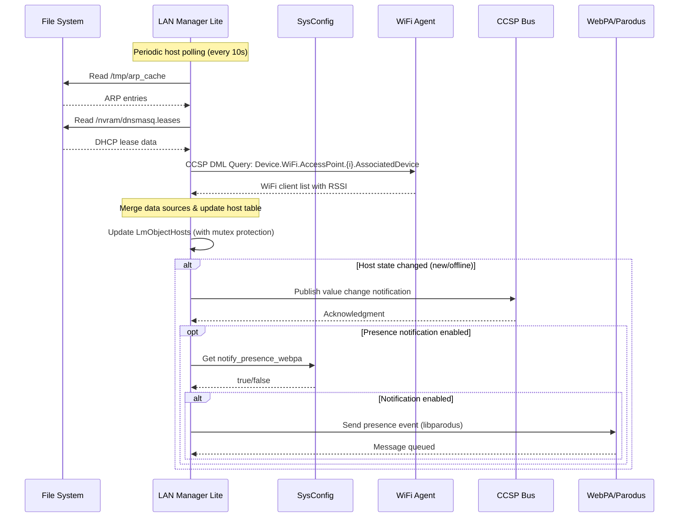
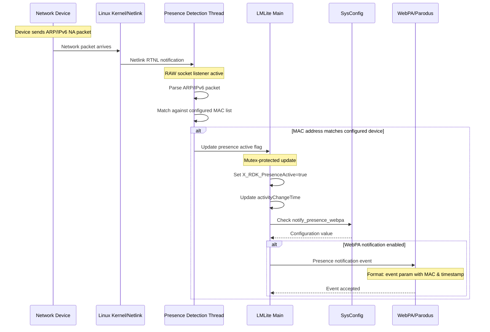
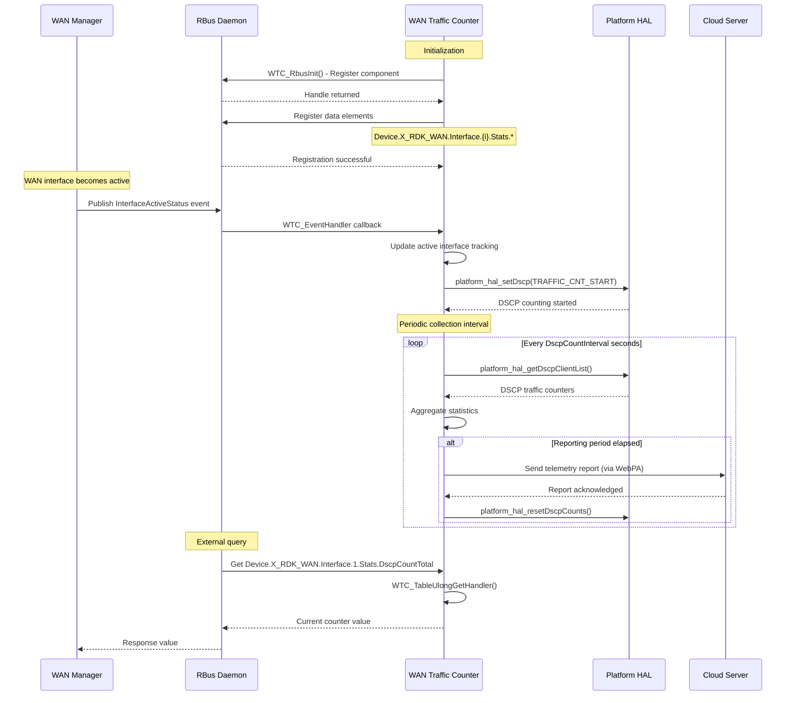
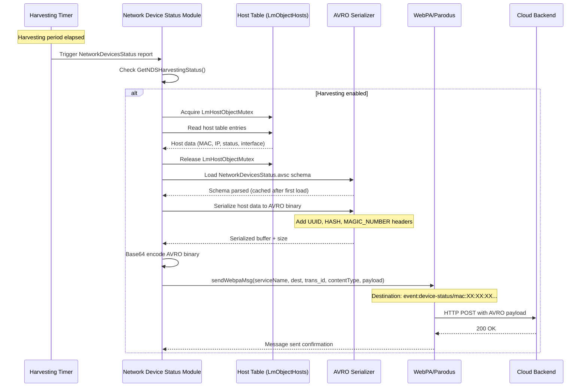

## Component Interactions

LAN Manager Lite (LMLite) is a central component in RDK-B that monitors and manages local area network devices. It interacts with various RDK-B middleware components, HAL layers, platform services, and external telemetry services to provide comprehensive network device tracking, presence detection, and traffic monitoring capabilities.

```mermaid
flowchart TD
    subgraph "External Services"
        Webpa["WebPA/Parodus
(Telemetry Server)"]
        Cloud["Cloud Servers
(AVRO Reports)"]
    end
    
    subgraph "Middleware Layer"
        LMLite["LAN Manager Lite
(lmlite)"]
        WanMgr["WAN Manager
(wanmanager)"]
        WiFiAgent["WiFi Agent
(wifiagent)"]
        CcspCR["CCSP Common
Component Registrar"]
        EthAgent["Ethernet Agent
(ethagent)"]
        WTC["WAN Traffic Counter"]
    end
    
    subgraph "HAL/Platform Layer"
        PlatformHAL["Platform HAL
(platform_hal)"]
        SysCfg["SysConfig DB
(syscfg)"]
        SysEvent["SysEvent Bus
(sysevent)"]
        FileSystem["File System
(/tmp, /nvram)"]
    end

    LMLite -->|"RBus Events/Get/Set"| WanMgr
    LMLite -->|"CCSP DML Queries"| WiFiAgent
    LMLite -->|"Component Discovery"| CcspCR
    LMLite -->|"CCSP DML Queries"| EthAgent
    LMLite <-->|"RBus Data Elements"| WTC
    LMLite -->|"libparodus/AVRO"| Webpa
    LMLite -->|"Telemetry Reports"| Cloud
    LMLite -->|"GetBaseMacAddress"| PlatformHAL
    LMLite -->|"Get/Set Config"| SysCfg
    LMLite -->|"Subscribe Events"| SysEvent
    LMLite -->|"ARP Cache/DHCP Leases"| FileSystem
    
    classDef external fill:#e8f5e8,stroke:#2e7d32,stroke-width:2px;
    classDef component fill:#e1f5fe,stroke:#0277bd,stroke-width:2px;
    classDef platform fill:#fff3e0,stroke:#ef6c00,stroke-width:2px;
    
    class Webpa,Cloud external;
    class LMLite,WanMgr,WiFiAgent,CcspCR,EthAgent,WTC component;
    class PlatformHAL,SysCfg,SysEvent,FileSystem platform;
```

### Interaction Matrix

| Target Component/Layer | Interaction Purpose | Key APIs/Endpoints |
|------------------------|-------------------|------------------|
| **RDK-B Middleware Components** |
| WAN Manager (wanmanager) | Monitor WAN interface active status for failover scenarios; subscribe to interface state changes | RBus: `Device.X_RDK_WanManager.InterfaceActiveStatus` (subscription), `lmliteRbusInit()`, `subscribeTo_InterfaceActiveStatus_Event()` |
| WiFi Agent (wifiagent) | Retrieve WiFi client associations, SSID information, RSSI values for connected devices | CCSP DML: `Device.WiFi.AccessPoint.{i}.AssociatedDevice.{i}.*`, `lm_wrapper_get_wifi_wsta_list()` |
| Ethernet Agent (ethagent) | Query ethernet WAN status and configuration | CCSP DML: `Device.Ethernet.X_RDKCENTRAL-COM_WAN.Enabled`, DBUS path: `/com/cisco/spvtg/ccsp/ethagent` |
| CCSP Common Registrar | Component registration and discovery on message bus | DBUS: `ssp_Mbi_MessageBusEngage()`, `waitConditionReady()` |
| WAN Traffic Counter (Self-contained module) | DSCP-based traffic counting and reporting for WAN interfaces | RBus: `Device.X_RDK_WAN.Interface.{i}.Stats.*` (DscpCountEnable, DscpCountPerInterval, DscpCountTotal, DscpCountInterval) |
| **Telemetry & External Services** |
| WebPA/Parodus | Send AVRO-encoded telemetry reports upstream; device presence notifications | libparodus: `sendWebpaMsg()`, `initparodusTask()`, Message Queue: Parodus client instance |
| Cloud Telemetry Servers | Report network device status, traffic statistics, associated devices (extender mode) | AVRO schemas: `NetworkDevicesStatus.avsc`, `NetworkDevicesTraffic.avsc`, Schema UUID: `3053b4ab-d3f9-4cc9-8c3e-f0bde4a2e6ca` |
| **System & HAL Layers** |
| Platform HAL | Retrieve device base MAC address; DSCP traffic control and counter retrieval | `platform_hal_GetBaseMacAddress()`, `platform_hal_setDscp()`, `platform_hal_getDscpClientList()`, `platform_hal_resetDscpCounts()` |
| SysConfig (syscfg) | Persist and retrieve configuration parameters (presence detection, harvesting periods, notification settings) | `syscfg_get()`, `syscfg_set_commit()`, `syscfg_set_u_commit()` Keys: `notify_presence_webpa`, `PresenceDetectEnabled`, `X_RDKCENTRAL-COM_HostCountPeriod`, `lan_ifname` |
| SysEvent | Subscribe to system events for network state changes | `s_sysevent_connect()`, sysevent token-based API |
| File System | Read ARP cache and DHCP lease information for host discovery | Files: `/tmp/arp_cache`, `/nvram/dnsmasq.leases`, `/etc/dhcp_static_hosts` (reserved DHCP) |

**Events Published by LAN Manager Lite:**

| Event Name | Event Topic/Path | Trigger Condition | Subscriber Components |
|------------|-----------------|-------------------|---------------------|
| Host Connection/Disconnection | `Device.Hosts.Host.{i}.*` (via CCSP notifications) | Device joins or leaves LAN (online/offline state change) | WebPA, Management Server, other monitoring components |
| Presence Active State Change | `Device.Hosts.Host.{i}.X_RDK_PresenceActiveLastChange` | Device presence detection state transitions (active/inactive) | WebPA (when `notify_presence_webpa` enabled) |
| Network Device Status Report | Webpa destination: `event:device-status/mac:...` | Periodic harvesting interval or on-demand trigger | Cloud telemetry backend |
| Network Device Traffic Report | Webpa destination: `event:device-traffic/mac:...` | Periodic reporting interval for traffic statistics | Cloud telemetry backend |
| WAN Traffic DSCP Report | RBus event on stats change | DSCP traffic count interval elapsed | WAN Manager, logging/monitoring systems |
| Extender Associated Devices | Webpa destination: `event:extender-devices/mac:...` | Extender mode periodic reporting | Cloud telemetry backend |

### IPC Flow Patterns

**Primary IPC Flow - Host Discovery and Status Update:**

**Event Notification Flow - Presence Detection:**

**RBus Interaction Flow - WAN Traffic Counter:**

**AVRO Telemetry Publishing Flow:**

## Implementation Details

### Major HAL APIs Integration

LAN Manager Lite integrates with Platform HAL to retrieve device identification and control WAN traffic monitoring. The component has minimal direct HAL dependencies, focusing primarily on platform identification and DSCP traffic control.

**Core HAL APIs:**

| HAL API | Purpose | Implementation File |
|---------|---------|-------------------|
| `platform_hal_GetBaseMacAddress()` | Retrieve the device's base MAC address for unique identification in telemetry reports | `source/lm/webpa_interface.c` |
| `platform_hal_setDscp(wanMode, action, dscpList, dscpCount)` | Start/stop DSCP-based traffic counting on WAN interfaces; configure which DSCP values to monitor | `source/lm/cosa_wantraffic_api.c` |
| `platform_hal_getDscpClientList(wanMode, *clientList)` | Retrieve aggregated traffic statistics for each DSCP class and client IP | `source/lm/cosa_wantraffic_api.c` |
| `platform_hal_resetDscpCounts(wanMode)` | Reset DSCP traffic counters after telemetry report submission | `source/lm/cosa_wantraffic_api.c` |

### Key Implementation Logic

- **Host Discovery and Tracking Engine**: The core host management logic maintains a dynamic list of network devices by correlating multiple data sources:
  
  - Main implementation in `source/lm/lm_main.c` (`Hosts_PollHost()`, `LM_main_thread()`)
  - Data source aggregation in `source/lm/lm_wrapper.c` (`lm_wrapper_get_arp_entries()`, `lm_wrapper_get_dhcpv4_client()`)
  - WiFi client synchronization in `source/lm/lm_wrapper.c` (`lm_wrapper_get_wifi_wsta_list()`, `SyncWiFi()`)
  - Mutex-protected access via `LmHostObjectMutex` for thread-safe host table operations
  
  The discovery engine performs these key functions:
  - ARP cache parsing from `/tmp/arp_cache` for IPv4 reachability
  - DHCP lease file monitoring (`/nvram/dnsmasq.leases`) for IP-to-MAC mappings
  - WiFi agent queries via CCSP DML for associated device information
  - IPv6 neighbor discovery integration
  - Host fingerprinting and device type classification

- **Presence Detection Mechanism**: Active device presence monitoring for configured devices:
  
  - RAW socket listener implementation in `source/lm/device_presence_detection.c` (`PresenceDetection_ReceiveThread()`)
  - ARP packet sniffing for IPv4 presence (`lm_arping_v4_send()` for active probing)
  - IPv6 Neighbor Advertisement (NA) packet processing
  - Configurable MAC address watchlist management (`PresenceDetection_AddMacToList()`, `PresenceDetection_RemoveMacFromList()`)
  - Background polling and leave detection with configurable retry intervals
  - Message queue integration (`DNSMASQ_PRESENCE_QUEUE_NAME`) for DNS-based presence events

- **Network Device Harvesting and Reporting**: Periodic collection and upstream reporting of network device information:

  - Network Device Status harvesting in `source/lm/network_devices_status.c` (`StartNetworkDeviceStatusHarvesting()`)
  - Network Device Traffic harvesting in `source/lm/network_devices_traffic.c` (`StartNetworkDevicesTrafficHarvesting()`)
  - Configurable polling and reporting periods with validation (`ValidateNDSPeriod()`, `ValidateNDTPeriod()`)
  - Override TTL mechanism for accelerated scans
  - AVRO schema-based serialization in `source/lm/network_devices_status_avropack.c` and `source/lm/network_devices_traffic_avropack.c`
  
- **WAN Traffic DSCP Counting**: Differentiated Services Code Point (DSCP) based traffic analysis per WAN interface:

  - State machine for traffic counting lifecycle in `source/lm/cosa_wantraffic_api.c` (`WTC_Thread()`)
  - RBus data element handlers in `source/lm/wtc_rbus_handler_apis.c` (`WTC_TableUlongGetHandler()`, `WTC_TableUlongSetHandler()`)
  - Dynamic WAN interface subscription via `subscribeTo_InterfaceActiveStatus_Event()`
  - Configurable DSCP list, count intervals, and reporting periods
  - Automatic counter reset after report submission

- **Error Handling Strategy**: Error detection and recovery mechanisms:

  - CCSP trace logging throughout (`CcspTraceError()`, `CcspTraceWarning()`, `CcspTraceDebug()`)
  - Component-specific logging wrapper in `source/lm/ccsp_lmliteLog_wrapper.h`
  - Syscfg persistence for configuration recovery after reboot
  - Graceful degradation when optional data sources unavailable (WiFi, MoCA)
  - Retry logic for HAL API calls with sleep intervals
  - Thread synchronization via mutexes to prevent race conditions

- **Logging & Debugging**: Multi-level logging with component identification:

  - RDK Logger integration with module `LOG.RDK.LM`
  - WAN Traffic Counter specific logging macros (`WTC_LOG_INFO()`, `WTC_LOG_ERROR()`)
  - Presence detection debug traces for packet-level troubleshooting
  - Host state transition logging with timestamps
  - AVRO serialization debug output for payload inspection

### Key Configuration Files

| Configuration File | Purpose | Override Mechanisms |
|--------------------|---------|---------------------|
| `config/LMLite.XML` | CCSP data model definition mapping TR-181 parameters to DML handler functions | Component XML, loaded by CCSP framework at startup |
| `/nvram/syscfg.db` | Persistent storage for configuration parameters (presence detection, harvesting settings, notification preferences) | `syscfg_get()`, `syscfg_set_commit()` API; WebPA/TR-069 parameter sets |
| `/tmp/arp_cache` | System ARP cache for IPv4 neighbor discovery | Kernel managed, read-only for LMLite |
| `/nvram/dnsmasq.leases` | DHCP lease database mapping IP to MAC addresses | DHCP server (dnsmasq), read-only for LMLite |
| `/etc/dhcp_static_hosts` | Reserved DHCP IP assignments | Manual configuration, read-only for LMLite |
| `config/NetworkDevicesStatus.avsc` | AVRO schema for network device status telemetry | Schema version controlled, loaded at runtime |
| `config/NetworkDevicesTraffic.avsc` | AVRO schema for network device traffic telemetry | Schema version controlled, loaded at runtime |

**Key Syscfg Parameters:**

- `notify_presence_webpa`: Enable/disable WebPA notifications for presence events
- `PresenceDetectEnabled`: Global enable/disable for presence detection feature
- `X_RDKCENTRAL-COM_HostCountPeriod`: Periodic host count reporting interval (seconds)
- `lan_ifname`: LAN interface name for presence detection packet capture
- `ConfiguredMacListIsSet`: Flag indicating presence MAC list persistence state
- WAN Traffic Counter parameters: `wtc_dscp_enable_1`, `wtc_dscp_interval_1`, etc.

**Environment Variables:**

- Standard CCSP environment variables for component paths and message bus configuration
- RDK Logger environment for log level control
