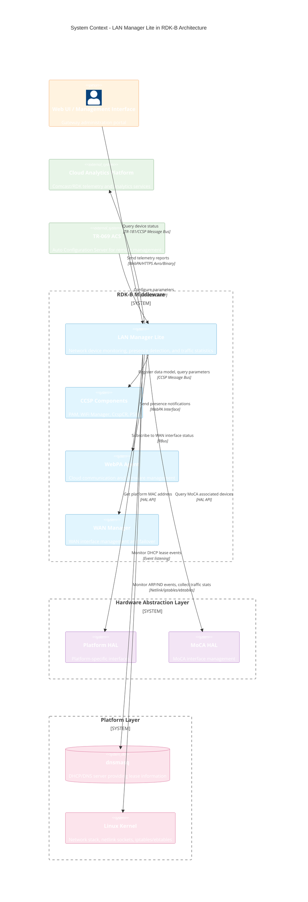

# LAN Manager Lite - Introduction

## Overview

LAN Manager Lite (LMLite) is a lightweight network management component within the RDK-B middleware stack that provides monitoring and reporting capabilities for devices connected to the local area network. It tracks device presence, collects network statistics, and reports network device information to upstream systems for analytics and monitoring.

The component operates as a CCSP (Common Component Software Platform) plugin that integrates with the RDK-B architecture, providing TR-181 data model compliance for standardized device management. LMLite continuously monitors all connected devices across Ethernet, WiFi, and MoCA interfaces, maintaining an up-to-date inventory of network hosts with detailed information including IP addresses, MAC addresses, connection status, and traffic statistics.

LMLite implements multiple subsystems: a host tracking engine that maintains real-time device state, a presence detection mechanism for monitoring device join/leave events, a network traffic monitoring system that collects per-device statistics, and a reporting framework that packages and transmits telemetry data using Avro serialization to WebPA/cloud services. The component provides APIs for other RDK-B components to query network device information and exposes TR-181 data model interfaces for configuration and status retrieval.

## System Context

**Key Features & Responsibilities**

- **Host Table Management**: Maintains an inventory of all network-connected devices (up to 256 hosts) across Ethernet, WiFi, and MoCA interfaces, tracking MAC addresses, IP addresses (IPv4/IPv6), hostnames, connection status, RSSI values, and device activity timestamps. Provides real-time synchronization with WiFi and MoCA subsystems to update host information as devices join or leave the network.

- **Device Presence Detection**: Detects when devices join or leave the network through ARP cache monitoring, dnsmasq DHCP lease events, and IPv6 Neighbor Discovery (ND) messages. Sends real-time presence notifications via WebPA to cloud services for parental controls, security alerts, and user presence analytics.

- **Network Device Status Reporting**: Periodically harvests and reports network device status information including connection state, interface type (Ethernet/WiFi/MoCA), Layer 2 details, and parent device relationships. Data is serialized using Avro format according to the `NetworkDevicesStatus.avsc` schema and transmitted to cloud analytics platforms at configurable reporting intervals (default: 900 seconds).

- **Network Device Traffic Monitoring**: Collects per-device traffic statistics by parsing iptables and ebtables counters, tracking bytes and packets transmitted and received for each connected host. Generates periodic traffic reports serialized in Avro format (`NetworkDevicesTraffic.avsc`) and uploads them to the cloud for bandwidth monitoring, usage analytics, and network optimization.

- **WAN Traffic Counting**: Monitors WAN interface traffic statistics including total bytes/packets sent and received for bandwidth usage reporting and network performance monitoring. Integrates with WAN Manager via RBus to track active WAN interface status and supports WAN failover scenarios.

- **TR-181 Data Model Integration**: Exposes a TR-181 compliant data model (`Device.Hosts.*`, `Device.X_RDKCENTRAL-COM_Report.*`) through the CCSP framework, enabling standardized configuration and monitoring via TR-069, WebPA, and dmcli command-line tools. Supports parameters for harvesting control, reporting periods, polling intervals, and device-specific attributes.

- **CCSP Plugin Architecture**: Implements the CCSP plugin lifecycle with SSP (Single Source of Provisioning) integration, message bus connectivity, and dynamic parameter registration. Provides synchronous API interfaces (`lm_api.h`) for local queries and asynchronous event-based communication for distributed operations across the RDK-B middleware stack.
