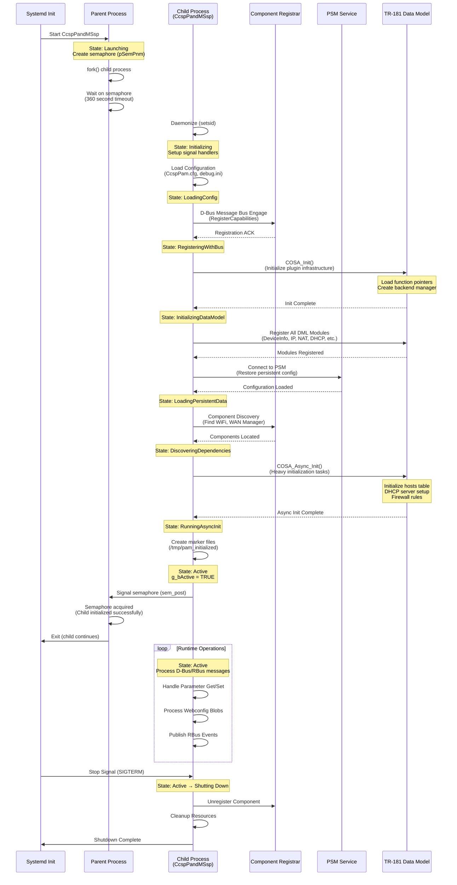
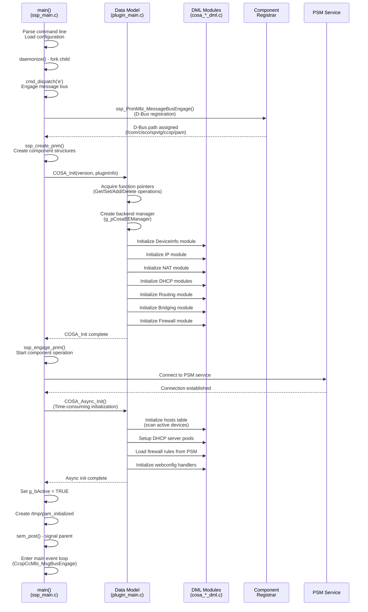
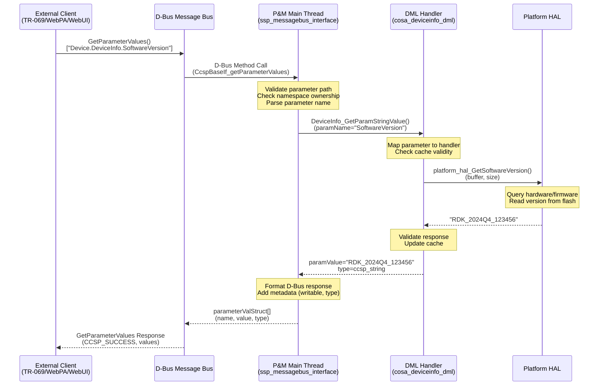
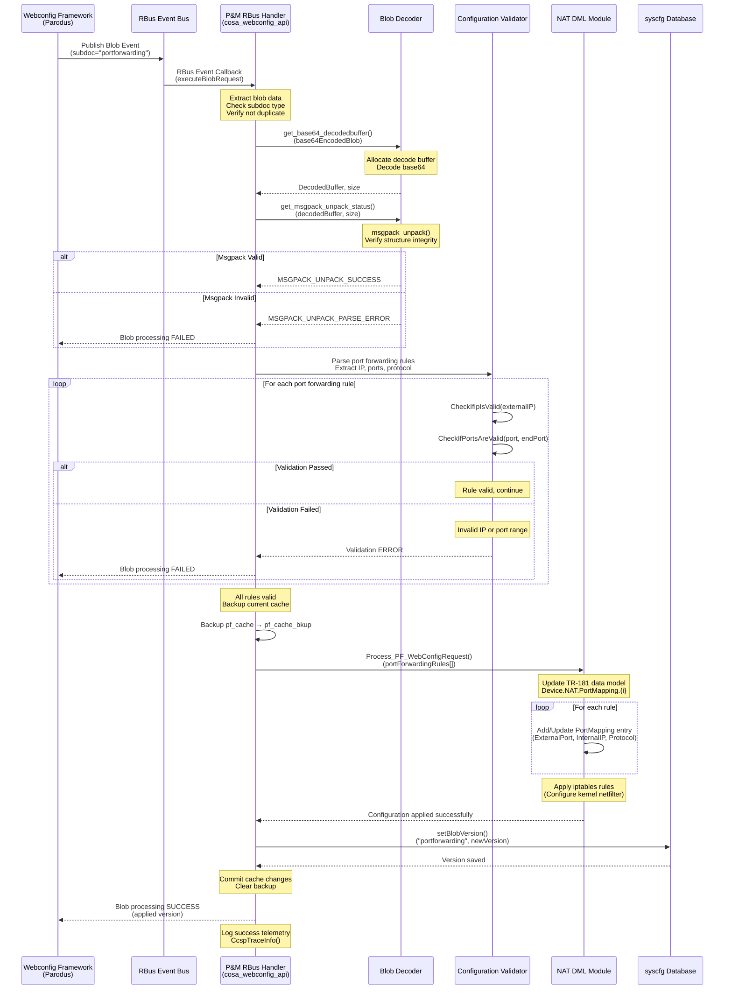
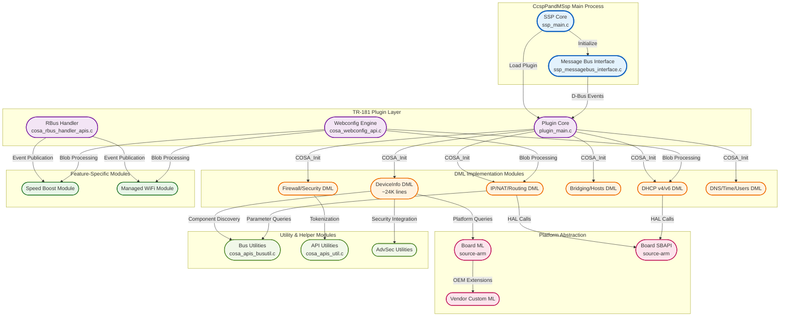

# Provisioning and Management (P&M) Component - Design and Internal Modules

## Design

The Provisioning and Management (P&M) component is a central data model manager and orchestrator within the RDK-B middleware stack, implementing a modular, event-driven design that integrates with CCSP (Common Component Software Platform) framework. The component follows a plugin-based architecture where TR-181 data model objects are implemented as dynamically loadable modules, each handling specific aspects of device configuration such as DeviceInfo, IP interfaces, routing, NAT, DHCP services, firewall rules, and bridging.

The design incorporates inter-process communication mechanisms that leverage both legacy D-Bus infrastructure for backward compatibility with existing CCSP components and modern RBus protocol for high-performance, low-latency event-driven communication. The component's state management employs a three-tier persistence strategy: in-memory caches for high-frequency access patterns, PSM (Persistent Storage Manager) integration for TR-181 parameter persistence across reboots, and syscfg database for system-level configuration parameters. The threading model is primarily single-threaded with selective use of worker threads for specific background operations (bandwidth guard parameter removal, CBR parameter cleanup).

Northbound interfaces support multiple management protocols (TR-069 CWMP, WebPA cloud management, local Web UI, RFC feature control) through a unified TR-181 parameter access layer. Southbound integration with HAL (Hardware Abstraction Layer) is achieved through platform-specific function pointers, enabling the same P&M codebase to run across diverse hardware platforms (Intel, ARM, Broadcom, Qualcomm). The design separates platform-agnostic TR-181 logic (middle_layer_src) from platform-specific adaptations (board_ml, board_sbapi, custom vendor implementations).

The component registers with the CCSP Component Registrar using D-Bus paths defined in configuration files (CcspPam.cfg), exposing standardized GetParameterValues/SetParameterValues interfaces for legacy component interaction. For modern RBus-capable platforms, the design implements selective RBus registration for high-frequency events (WAN status changes, WiFi configuration updates, Speed Boost activation). The RBus handler architecture uses a data element array (devCtrlRbusDataElements[]) that maps event names to handler functions. The design includes auto-discovery mechanisms (CcspBaseIf_discComponentSupportingNamespace) that locate dependent components at runtime.

Data persistence uses PSM for TR-181 parameter storage with automatic version tracking and rollback capabilities. Critical device configuration (last reboot reason, network mode, feature flags) is stored in syscfg database with immediate commit semantics. The design implements a backup/restore mechanism for high-value configurations (port forwarding rules, DMZ settings) where in-memory caches maintain both active and backup copies. For dynamic cloud-driven configurations delivered via Webconfig framework, the design includes version management (getBlobVersion/setBlobVersion) that prevents replay attacks and out-of-order configuration application. Boot-time initialization creates marker files (/tmp/pam_initialized, /tmp/pam_initialized_bootup) that enable crash detection and differentiate first-boot scenarios from restart-after-crash conditions.

### Component Architecture Diagram

```mermaid
graph TD
    subgraph PAMContainer ["P&M Component Container (C/C++17)<br/>Process: CcspPandMSsp"]
        subgraph IPCLayer ["IPC Communication Layer"]
            DBusInterface["D-Bus Interface<br/>(Legacy CCSP)"]
            RBusInterface["RBus Interface<br/>(Modern Event-Driven)"]
            noteIPC["Purpose: Dual-protocol support for<br/>backward compatibility and performance"]
        end

        subgraph DataModelLayer ["TR-181 Data Model Layer"]
            DMCore["Data Model Core<br/>(plugin_main.c)"]
            DeviceInfo["DeviceInfo DML<br/>(cosa_deviceinfo_dml.c)"]
            IPDML["IP/Routing DML<br/>(cosa_ip_dml.c, cosa_routing_dml.c)"]
            NATDML["NAT/Firewall DML<br/>(cosa_nat_dml.c, cosa_firewall_dml.c)"]
            DHCPDML["DHCP v4/v6 DML<br/>(cosa_dhcpv4_dml.c, cosa_dhcpv6_dml.c)"]
            BridgeDML["Bridging/Hosts DML<br/>(cosa_bridging_dml.c, cosa_hosts_dml.c)"]
            noteDM["Purpose: Implements TR-181 objects with<br/>Get/Set/Add/Delete operations"]
        end

        subgraph PersistenceLayer ["Persistence & State Management"]
            PSMClient["PSM Client<br/>(ccsp_psm_helper)"]
            SyscfgClient["syscfg Client<br/>(syscfg_get/set)"]
            CacheManager["Configuration Cache<br/>(pf_cache, dmz_cache)"]
            notePersist["Purpose: Multi-tier storage for performance<br/>and durability"]
        end

        subgraph WebconfigEngine ["Webconfig Processing Engine"]
            BlobDecoder["Base64/Msgpack Decoder<br/>(cosa_webconfig_api.c)"]
            BlobValidation["Configuration Validator<br/>(IP/Port validation)"]
            BlobHandlers["Subdoc Handlers<br/>(LAN, NAT, PortForwarding, DMZ)"]
            noteWebconfig["Purpose: Cloud-driven dynamic<br/>configuration updates"]
        end

        subgraph EventTelemetry ["Event & Telemetry Layer"]
            RBusPublisher["RBus Event Publisher<br/>(speedboost_event_publish.c)"]
            TraceLogger["Trace Logging<br/>(CcspTrace*)"]
            TelemetryMarkers["Telemetry Markers<br/>(t2_event_*)"]
            noteEvent["Purpose: Runtime monitoring and<br/>diagnostics"]
        end

        subgraph HALAbstraction ["HAL Abstraction Layer"]
            PlatformHALClient["Platform HAL Client<br/>(platform_hal_*)"]
            EthHALClient["Ethernet HAL Client<br/>(ccsp_hal_ethsw_*)"]
            CMHALClient["CM HAL Client<br/>(cm_hal_*)"]
            noteHAL["Purpose: Platform-agnostic hardware<br/>interaction"]
        end
    end

    subgraph ExternalSystems ["External Systems & Services"]
        ComponentRegistrar["Component Registrar<br/>(D-Bus)"]
        PSMService["PSM Service<br/>(D-Bus)"]
        WanManager["WAN Manager<br/>(RBus)"]
        WiFiManager["WiFi Manager<br/>(D-Bus/RBus)"]
        WebconfigFramework["Webconfig Framework<br/>(RBus/Parodus)"]
        PlatformHAL["Platform HAL<br/>(Library)"]
    end

    DBusInterface -->|"Register/Discover Components"| ComponentRegistrar
    DBusInterface -->|"Get/Set Parameters"| WiFiManager
    RBusInterface -->|"Subscribe Events"| WanManager
    RBusInterface -->|"Receive Blobs"| WebconfigFramework
    
    DMCore -->|"Initialize"| DeviceInfo
    DMCore -->|"Initialize"| IPDML
    DMCore -->|"Initialize"| NATDML
    DMCore -->|"Initialize"| DHCPDML
    DMCore -->|"Initialize"| BridgeDML

    DeviceInfo -->|"Query/Set"| PlatformHALClient
    IPDML -->|"Query/Set"| EthHALClient
    DeviceInfo -->|"CM Status"| CMHALClient

    DeviceInfo -->|"Read/Write"| PSMClient
    NATDML -->|"Read/Write"| PSMClient
    DHCPDML -->|"Store Config"| SyscfgClient
    NATDML -->|"Cache Rules"| CacheManager

    RBusInterface -->|"Blob Notifications"| BlobDecoder
    BlobDecoder -->|"Decode"| BlobValidation
    BlobValidation -->|"Apply Config"| BlobHandlers
    BlobHandlers -->|"Update DML"| NATDML
    BlobHandlers -->|"Update DML"| DHCPDML

    DeviceInfo -->|"Publish Events"| RBusPublisher
    BlobHandlers -->|"Log Events"| TraceLogger
    DMCore -->|"Send Markers"| TelemetryMarkers

    PSMClient -->|"D-Bus API"| PSMService
    PlatformHALClient -->|"Function Calls"| PlatformHAL
    EthHALClient -->|"Function Calls"| PlatformHAL
    CMHALClient -->|"Function Calls"| PlatformHAL

    classDef ipcLayer fill:#e1f5fe,stroke:#0277bd,stroke-width:2px,color:#000;
    classDef dmLayer fill:#f3e5f5,stroke:#7b1fa2,stroke-width:2px,color:#000;
    classDef persistLayer fill:#fff3e0,stroke:#ef6c00,stroke-width:2px,color:#000;
    classDef webconfigLayer fill:#e8f5e8,stroke:#2e7d32,stroke-width:2px,color:#000;
    classDef eventLayer fill:#fce4ec,stroke:#c2185b,stroke-width:2px,color:#000;
    classDef halLayer fill:#f1f8e9,stroke:#558b2f,stroke-width:2px,color:#000;
    classDef external fill:#ede7f6,stroke:#5e35b1,stroke-width:2px,color:#000;

    class DBusInterface,RBusInterface ipcLayer;
    class DMCore,DeviceInfo,IPDML,NATDML,DHCPDML,BridgeDML dmLayer;
    class PSMClient,SyscfgClient,CacheManager persistLayer;
    class BlobDecoder,BlobValidation,BlobHandlers webconfigLayer;
    class RBusPublisher,TraceLogger,TelemetryMarkers eventLayer;
    class PlatformHALClient,EthHALClient,CMHALClient halLayer;
    class ComponentRegistrar,PSMService,WanManager,WiFiManager,WebconfigFramework,PlatformHAL external;
```

### Prerequisites and Dependencies

**RDK-B Platform and Integration Requirements :**

- **Dependencies**: 
  - `ccsp-common-library` (>= 1.0)
  - `hal-platform` (device info, MACSec support)
  - `hal-cm` (cable modem management)
  - `hal-ethsw` (Ethernet switch control)
  - `hal-moca` (MoCA interface management)
  - `libparodus` (cloud connectivity via Parodus)
  - `rbus` (modern IPC framework)
  - `webconfig-framework` (dynamic configuration)
  - `libsyscfg` (system configuration database)
  - `utopia` (utapi, utctx for legacy compatibility)
  - `libsecure_wrapper` (secure system calls)
  - `trower-base64` (base64 encoding/decoding)
  - `msgpack-c` (binary serialization)
  
- **RDK-B Components**: 
  - **Mandatory**: 
    - `CcspCr` (Component Registrar) - must be running before P&M starts
    - `PsmSsp` (Persistent Storage Manager) - required for configuration persistence
  - **Optional** (based on platform):
    - `CcspWiFiAgent` - WiFi configuration management
    - `WanManager` - WAN interface coordination
    - `CcspCMAgent` - Cable modem status (DOCSIS platforms)
  
- **HAL Dependencies**: 
  - **Platform HAL**: Version >= 1.0.0 (device model, firmware info, MACSec)
  - **Ethernet HAL**: Version >= 1.0.0 (switch configuration, port management)
  - **CM HAL**: Version >= 1.0.0 (DOCSIS platforms only, SNMPv3 kickstart)
  - **MoCA HAL**: Version >= 1.0.0 (MoCA-enabled platforms)
  
- **Systemd Services**: 
  - `systemd-dbus.service` - D-Bus message bus must be active
  - `CcspCrSsp.service` - Component Registrar dependency
  - `PsmSsp.service` - Persistent Storage Manager dependency
  - Optional: `rbus.service` - RBus daemon
  
- **Message Bus**: 
  - **D-Bus Registration**: 
    - Component ID: `com.cisco.spvtg.ccsp.pam`
    - D-Bus Path: `/com/cisco/spvtg/ccsp/pam`
    - Namespace: `Device.DeviceInfo.*`, `Device.IP.*`, `Device.NAT.*`, `Device.DHCPv4.*`, `Device.DHCPv6.*`, `Device.Routing.*`, `Device.Hosts.*`, `Device.Bridging.*`, `Device.Firewall.*`, `Device.DNS.*`, `Device.Time.*`, `Device.Users.*`, vendor extensions
  - **RBus Registration**:
    - Event topics: `Device.WiFi.X_RDK_ManagedWiFi.*`, `Device.DeviceInfo.X_RDK_SpeedBoost.*`, `Device.DeviceControl.X_RDK_DeviceNetworkingMode`, `Device.DeviceInfo.X_COMCAST-COM_WAN_IP*`
  
- **Configuration Files**: 
  - **Mandatory**:
    - `/usr/ccsp/pam/CcspPam.cfg` - Component configuration (ID, D-Bus path, version)
    - `/usr/ccsp/pam/CcspDmLib.cfg` - Data model library configuration
    - `/usr/ccsp/pam/TR181-USGv2.XML` - TR-181 data model definition (18,276 lines)
    - `/etc/device.properties` - Hardware capability definitions
  - **Runtime Created**:
    - `/tmp/pam_initialized` - Initialization complete marker
    - `/tmp/pam_initialized_bootup` - First boot vs. crash recovery marker
  - **Optional**:
    - `/etc/debug.ini` - Debug logging configuration
    - `/nvram/bootstrap.json` - Bootstrap configuration (with backup at `/nvram/bootstrap.json.bak`)
  
- **Startup Order**: 
  1. **Pre-requisites** (must be running):
     - `systemd-dbus.service` (D-Bus daemon)
     - `syscfg.service` (syscfg database)
     - `CcspCrSsp.service` (Component Registrar)
     - `PsmSsp.service` (Persistent Storage Manager)
  2. **P&M Initialization**:
     - `CcspPandMSsp` process starts
     - Message bus engagement (D-Bus/RBus registration)
     - Data model initialization (COSA_Init)
     - Component registration with CR
     - Async initialization (COSA_Async_Init) for time-consuming operations
  3. **Post-P&M** (can start after P&M is active):
     - Device-specific applications requiring TR-181 access
     - Management protocol agents (TR-069, WebPA)

**Threading Model**

The P&M component employs a hybrid single-threaded with selective worker threads architecture. The main application thread handles all TR-181 parameter operations, D-Bus/RBus message processing, and HAL interactions sequentially. Worker threads are spawned on-demand for specific long-running or background operations that should not block the main event loop, with synchronization using POSIX mutexes (pthread_mutex_t) to protect shared data structures.

- **Main Thread Responsibilities**: 
  - D-Bus message loop processing (CcspBaseIf_* API calls)
  - RBus event loop processing (rbusHandle events)
  - TR-181 parameter Get/Set operations (all DML handler functions)
  - HAL API invocations (platform_hal_*, cm_hal_*, ccsp_hal_ethsw_*)
  - Webconfig blob processing (base64 decode, msgpack unpack, configuration validation)
  - Component registration and discovery
  - PSM and syscfg database operations
  - Initialization and shutdown sequencing
- **Worker Threads** (on-demand creation):
  - **Bandwidth Guard Parameter Removal Thread** (`bwg_thread` in `ssp_messagebus_interface.c` line 369):
    - Purpose: Remove bandwidth guard parameters from data model in background
    - Lifecycle: Created on-demand, self-terminating after completion
    - Synchronization: Uses pthread mutex for parameter access
  - **CBR Parameter Removal Thread** (`cbr_thread` in `ssp_messagebus_interface.c` line 385):
    - Purpose: Remove CBR (Constant Bit Rate) parameters from data model
    - Lifecycle: Created on-demand, self-terminating after completion
    - Synchronization: Uses pthread mutex for parameter access
  - **BLE Restart Handler Thread** (`handleBleRestart` in `cosa_deviceinfo_dml.c`):
    - Purpose: Handle Bluetooth Low Energy service restart asynchronously
    - Lifecycle: Created on BLE configuration changes, self-terminating
    - Synchronization: Minimal shared state, uses system calls
- **Synchronization Mechanisms**: 
  - **POSIX Mutexes**: `pthread_mutex_t mutex = PTHREAD_MUTEX_INITIALIZER` in `cosa_rbus_handler_apis.c` protects RBus event handler state
  - **Semaphores**: `sem_t *sem` in `ssp_main.c` for parent-child process synchronization during daemonization (used to detect initialization timeout)
  - **Atomic Operations**: Not heavily used due to single-threaded main architecture
  - **Lock-Free Design**: Main thread operations are inherently lock-free, avoiding contention

### Component State Flow

**Initialization to Active State**

The P&M component follows an initialization sequence that progresses through multiple states, ensuring all dependencies are satisfied before transitioning to the active operational state. The component uses a semaphore-based parent-child synchronization mechanism where the parent process monitors the child's initialization progress with a 360-second timeout (PAM_CRASH_TIMEOUT), killing the child and cleaning up if initialization stalls.

**Initialization State Sequence**:

1. **Launching State** (Parent Process):
   - Create IPC semaphore for parent-child synchronization
   - Fork child process using daemonize() function
   - Parent enters wait loop monitoring semaphore with timeout
   
2. **Initializing State** (Child Process):
   - Daemonize using setsid() to detach from terminal
   - Install signal handlers (SIGTERM, SIGINT, deadlock detection)
   - Redirect stdin/stdout/stderr to /dev/null
   
3. **LoadingConfig State**:
   - Parse CcspPam.cfg for component ID and D-Bus path
   - Load TR181-USGv2.XML data model definition
   - Read debug.ini for logging configuration
   
4. **RegisteringWithBus State**:
   - Connect to D-Bus daemon (ssp_PnmMbi_MessageBusEngage)
   - Register component with Component Registrar
   - Advertise supported TR-181 namespace (Device.*)
   
5. **InitializingDataModel State**:
   - Execute COSA_Init() to initialize plugin infrastructure
   - Acquire function pointers from plugin framework (Get/Set/Add/Delete parameter operations)
   - Create backend manager object (g_pCosaBEManager)
   
6. **RegisteringModules State**:
   - Register all DML modules: DeviceInfo, IP, Routing, NAT, DHCP v4/v6, Bridging, Firewall, DNS, Time, Users, vendor extensions
   - Each module initializes its internal data structures and HAL connections
   
7. **LoadingPersistentData State**:
   - Connect to PSM service via D-Bus
   - Restore TR-181 parameter values from persistent storage
   - Apply syscfg database values for system-level configuration
   
8. **DiscoveringDependencies State**:
   - Use CcspBaseIf_discComponentSupportingNamespace() to locate WiFi Manager, WAN Manager, CM Agent
   - Establish RBus subscriptions (WAN status, managed WiFi events)
   
9. **RunningAsyncInit State**:
   - Execute COSA_Async_Init() for time-consuming initialization
   - Initialize hosts table (scan active connections)
   - Configure DHCP server pools
   - Apply firewall rules from persistent configuration
   - Initialize webconfig framework handlers
   
10. **Active State**:
    - Set g_bActive = TRUE
    - Create /tmp/pam_initialized marker file
    - Signal parent via semaphore (sem_post)
    - Enter main event loop processing D-Bus/RBus messages

**Timeout Protection**: If child process does not signal semaphore within 360 seconds, parent kills child (SIGKILL), removes /tmp/pam_initialized, and exits.

**Runtime State Changes and Context Switching**

During normal operation, the P&M component maintains the Active state but performs internal context switching based on incoming requests, configuration changes, and external events.

**State Change Triggers:**

- **Webconfig Blob Reception**: Transition from steady-state parameter access to blob processing mode
  - Trigger: RBus event from Webconfig Framework with subdoc blob
  - Impact: Main thread dedicates time to decode, validate, and apply configuration; normal parameter access continues but with increased latency
  - Recovery: Automatic return to steady state after blob processing completes
  
- **Factory Reset Request**: Transition to configuration reset mode
  - Trigger: SetParameterValue on Device.X_CISCO_COM_DeviceControl.FactoryReset
  - Impact: Clear PSM database, syscfg values, restart DHCP servers, flush firewall rules
  - Recovery: Component remains active but returns to default configuration state
  
- **Firmware Update Notification**: Transition to firmware update preparation mode
  - Trigger: SetParameterValue on Device.DeviceInfo.X_RDKCENTRAL-COM_FirmwareDownloadStatus
  - Impact: Persist current configuration, prepare for system reboot
  - Recovery: N/A (system reboots for firmware update)
  
- **Network Mode Change** (Router ↔ Extender):
  - Trigger: SetParameterValue on Device.DeviceControl.X_RDK_DeviceNetworkingMode
  - Impact: Reconfigure routing tables, firewall rules, DHCP server state; publish RBus event for dependent components
  - Recovery: Automatic stabilization in new network mode

**Context Switching Scenarios:**

- **Parameter Access Context** (Default):
  - Normal operation: Process Get/SetParameterValues requests
  - Resources: Main thread, HAL APIs, PSM/syscfg databases
  - Duration: Microseconds to milliseconds per operation
  
- **Webconfig Blob Processing Context**:
  - Triggered by: RBus blob notification (LAN, NAT, PortForwarding, DMZ, ManagedWiFi, SpeedBoost subdocs)
  - Resources: Base64 decoder, msgpack unpacker, validation engine, DML update functions
  - Duration: 10-100 milliseconds depending on blob size and complexity
  - Concurrency: Main thread blocks normal parameter access during processing
  
- **Event Publication Context**:
  - Triggered by: Internal state changes requiring external notification (WAN IP change, Speed Boost device list update)
  - Resources: RBus event publisher, event serialization
  - Duration: Microseconds (async event dispatch)
  - Concurrency: Non-blocking, events queued by RBus infrastructure
  
- **HAL Interaction Context**:
  - Triggered by: Get/SetParameterValues requiring hardware query/configuration
  - Resources: Platform HAL, Ethernet HAL, CM HAL function calls
  - Duration: Varies (10μs for cached reads to 100ms for hardware writes)
  - Concurrency: Main thread blocks until HAL returns

**Failure Recovery Mechanisms**:

- **D-Bus Connection Loss**: Attempt reconnection every 5 seconds, maintain local state during outage
- **PSM Service Unavailable**: Use cached values, queue writes for retry when PSM recovers
- **HAL Function Failure**: Log error, return cached/default value to caller, attempt retry on next access
- **Webconfig Blob Validation Failure**: Restore backup cache, send failure response to Webconfig Framework, maintain previous configuration
- **Component Discovery Failure**: Retry discovery on-demand when interaction needed, degraded functionality until component available

### Call Flow

**Initialization Call Flow:**

**Request Processing Call Flow - TR-181 Parameter Get:**

**Request Processing Call Flow - Webconfig Blob Update:**

## Internal Modules

The P&M component is a collection of specialized modules, each responsible for specific aspects of TR-181 data model implementation and system integration.

| Module/Class | Description | Key Files |
|-------------|------------|-----------|
| **SSP (Subsystem Provider) Core** | Main entry point and component lifecycle management. Handles process initialization, daemonization, message bus registration, and component engagement with CCSP framework. Implements semaphore-based parent-child synchronization for crash detection and timeout protection. | `source/PandMSsp/ssp_main.c`, `source/PandMSsp/ssp_global.h`, `source/PandMSsp/ssp_internal.h` |
| **Message Bus Interface** | D-Bus and RBus abstraction layer providing IPC communication with other CCSP components. Implements component registration with Component Registrar, parameter namespace advertisement, and event subscription management. Handles legacy parameter removal threads (BWG, CBR) for backward compatibility. | `source/PandMSsp/ssp_messagebus_interface.c`, `source/PandMSsp/ssp_messagebus_interface.h`, `source/PandMSsp/ssp_action.c` |
| **Data Model Plugin Core** | TR-181 plugin infrastructure implementing COSA (Common OSGi Service Architecture) initialization patterns. Manages backend manager object creation, function pointer acquisition for parameter operations (Get/Set/Add/Delete), and orchestrates initialization of all DML modules. Provides COSA_Init() and COSA_Async_Init() entry points. | `source/TR-181/middle_layer_src/plugin_main.c`, `source/TR-181/middle_layer_src/plugin_main.h`, `source/TR-181/middle_layer_src/plugin_main_apis.c` |
| **DeviceInfo DML** | Implements Device.DeviceInfo.* TR-181 objects including hardware information, firmware details, memory statistics, temperature monitoring, and device identification. Integrates with Platform HAL for hardware queries, supports SNMPv3 kickstart, MACSec configuration, and extensive RFC feature flags. Largest DML module (~24,639 lines). | `source/TR-181/middle_layer_src/cosa_deviceinfo_dml.c`, `source/TR-181/middle_layer_src/cosa_deviceinfo_dml.h`, `source/TR-181/middle_layer_src/cosa_deviceinfo_internal.c`, `source/TR-181/include/cosa_deviceinfo_apis.h` |
| **IP & Routing DML** | Manages Device.IP.* and Device.Routing.* objects controlling network interfaces, IPv4/IPv6 addressing, static routes, and routing policies. Coordinates with WAN Manager for interface state, supports multiple IP address assignment per interface, and implements route priority management. | `source/TR-181/middle_layer_src/cosa_ip_dml.c`, `source/TR-181/middle_layer_src/cosa_ip_internal.c`, `source/TR-181/middle_layer_src/cosa_routing_dml.c`, `source/TR-181/middle_layer_src/cosa_routing_internal.c` |
| **NAT & Firewall DML** | Implements Device.NAT.* and Device.Firewall.* providing port forwarding, DMZ configuration, and firewall rule management. Maintains in-memory rule caches (pf_cache, dmz_cache) with backup copies for rollback on validation failures. Integrates with webconfig for cloud-driven NAT configuration updates. Applies rules to kernel netfilter (iptables/nftables). | `source/TR-181/middle_layer_src/cosa_nat_dml.c`, `source/TR-181/middle_layer_src/cosa_nat_internal.c`, `source/TR-181/middle_layer_src/cosa_firewall_dml.c`, `source/TR-181/middle_layer_src/cosa_firewall_internal.c` |
| **DHCP v4/v6 DML** | Manages Device.DHCPv4.* and Device.DHCPv6.* for both server and client operations. Controls DHCP server pool configuration, static lease management (MAC binding), option configuration, and client state monitoring. Handles webconfig blobs for LAN configuration and static client bindings. Coordinates with dibbler (DHCPv6) and udhcpc (DHCPv4) system services. | `source/TR-181/middle_layer_src/cosa_dhcpv4_dml.c`, `source/TR-181/middle_layer_src/cosa_dhcpv4_internal.c`, `source/TR-181/middle_layer_src/cosa_dhcpv6_dml.c`, `source/TR-181/middle_layer_src/cosa_dhcpv6_internal.c` |
| **Bridging & Hosts DML** | Implements Device.Bridging.* for Linux bridge management and Device.Hosts.* for connected device tracking. Manages bridge creation, port membership, VLAN tagging, and maintains active host table with MAC-to-IP mapping. Provides network visibility for parental controls and device management features. | `source/TR-181/middle_layer_src/cosa_bridging_dml.c`, `source/TR-181/middle_layer_src/cosa_bridging_internal.c`, `source/TR-181/middle_layer_src/cosa_hosts_dml.c`, `source/TR-181/middle_layer_src/cosa_hosts_internal.c` |
| **Ethernet & InterfaceStack DML** | Manages Device.Ethernet.* for Ethernet interface configuration and Device.InterfaceStack.* for layer relationship mapping. Integrates with Ethernet HAL for switch control, port statistics, and link status monitoring. Provides interface stack visualization for troubleshooting layer-2/layer-3 connectivity. | `source/TR-181/middle_layer_src/cosa_ethernet_dml.c`, `source/TR-181/middle_layer_src/cosa_ethernet_internal.c`, `source/TR-181/middle_layer_src/cosa_interfacestack_dml.c`, `source/TR-181/middle_layer_src/cosa_interfacestack_internal.c` |
| **DNS & Time DML** | Implements Device.DNS.* for DNS client/relay configuration and Device.Time.* for NTP time synchronization. Manages DNS server lists, DNS relay forwarding, NTP server configuration, and time zone settings. Provides time-based scheduling foundation for firewall rules and service activation. | `source/TR-181/middle_layer_src/cosa_dns_dml.c`, `source/TR-181/middle_layer_src/cosa_dns_internal.c`, `source/TR-181/middle_layer_src/cosa_time_dml.c`, `source/TR-181/middle_layer_src/cosa_time_internal.c` |
| **Users & Security DML** | Manages Device.Users.* for local user accounts and Device.X_CISCO_COM_Security.* for security policies. Implements password-based authentication, role-based access control, parental control integration, and SSH/console access management. | `source/TR-181/middle_layer_src/cosa_users_dml.c`, `source/TR-181/middle_layer_src/cosa_users_internal.c`, `source/TR-181/middle_layer_src/cosa_x_cisco_com_security_dml.c`, `source/TR-181/middle_layer_src/cosa_x_cisco_com_security_internal.c` |
| **RBus Handler Module** | Modern event-driven interface providing low-latency RBus-based parameter access and event publication. Implements handlers for managed WiFi, Speed Boost, WAN IP notifications, and device networking mode events. Maintains subscriber counts and auto-publish configuration for each event type. | `source/TR-181/middle_layer_src/cosa_rbus_handler_apis.c`, `source/TR-181/middle_layer_src/cosa_rbus_handler_apis.h` |
| **Webconfig Integration** | Cloud configuration blob processing engine handling base64 decoding, msgpack unpacking, and configuration validation. Implements subdoc-specific handlers for LAN, NAT, port forwarding, DMZ, static clients, managed WiFi, and Speed Boost configurations. Manages blob versioning and rollback on validation failures. | `source/TR-181/middle_layer_src/cosa_webconfig_api.c`, `source/TR-181/middle_layer_src/cosa_webconfig_api.h`, `source/TR-181/middle_layer_src/webcfgparam.c`, `source/TR-181/middle_layer_src/portmappingdoc.c`, `source/TR-181/middle_layer_src/hotspotdoc.c`, `source/TR-181/middle_layer_src/managedwifidoc.c`, `source/TR-181/middle_layer_src/speedBoostDoc.c` |
| **Speed Boost Module** | Feature-specific implementation for Speed Boost service providing enhanced bandwidth prioritization for selected devices. Manages eligible device lists, active device tracking, PvD (Provisioning Domain) advertisement configuration, and RBus event publication for device list changes. Includes webconfig blob handler for cloud-driven Speed Boost configuration. | `source/TR-181/middle_layer_src/speedboost_dml.c`, `source/TR-181/middle_layer_src/speedboost_apis.c`, `source/TR-181/middle_layer_src/speedboost_rbus_handlers.c`, `source/TR-181/middle_layer_src/speedboost_event_publish.c`, `source/TR-181/include/speedboost_webconfig_apis.h` |
| **Managed WiFi Module** | Manages X_RDK_ManagedWiFi vendor extensions for WiFi service provider integration. Controls bridge assignment, WiFi interface selection, and managed WiFi enable/disable. Publishes RBus events for configuration changes enabling dynamic WiFi management by external service providers. | `source/TR-181/middle_layer_src/cosa_managedwifi_dml.c`, `source/TR-181/middle_layer_src/managedwifidoc.c`, `source/TR-181/include/cosa_managedwifi_webconfig_apis.h` |
| **Utility & Helper Modules** | Cross-cutting utilities providing common services to all DML modules. Includes CCSP bus utilities (component discovery, parameter queries), parameter string tokenization, instance number management, bridge/interface mapping, and advanced security integration helpers. | `source/TR-181/middle_layer_src/cosa_apis_busutil.c`, `source/TR-181/middle_layer_src/cosa_apis_util.c`, `source/TR-181/middle_layer_src/cosa_advsec_utils.c`, `source/TR-181/middle_layer_src/array_helpers.c` |
| **Board & Platform Adaptation** | Platform-specific abstraction layer providing hardware-specific implementations of TR-181 operations. Separates generic middle layer logic from platform specifics (Intel, ARM, Broadcom, Qualcomm). Contains board-specific ML (middle layer) and SBAPI (southbound API) implementations. | `source-arm/TR-181/board_ml/*.c`, `source-arm/TR-181/board_sbapi/*.c`, `source-arm/TR-181/board_include/*.h` |
| **Vendor Custom Extensions** | OEM/MSO-specific customizations and proprietary TR-181 extensions. Includes Comcast-specific custom ML and SBAPI implementations for features like parental control, device control, diagnostics, and dynamic DNS. Enables vendor differentiation while maintaining core RDK-B compatibility. | `custom/comcast/source/TR-181/custom_ml/*.c`, `custom/comcast/source/TR-181/custom_sbapi/*.c` |

### Module Interaction Diagram

**Module Dependencies and Data Flow**:

- **SSP Core** initializes the process, establishes D-Bus connection, and loads the TR-181 plugin
- **Message Bus Interface** receives external parameter requests and forwards to appropriate DML modules
- **Plugin Core** orchestrates DML module initialization and manages backend object lifecycle
- **DML Modules** implement TR-181 object handlers, calling HAL APIs and utility functions as needed
- **RBus Handler** provides parallel event-driven interface for performance-critical operations
- **Webconfig Engine** processes cloud configuration blobs and updates DML modules
- **Feature Modules** implement optional capabilities (Speed Boost, Managed WiFi) with their own DML and event handlers
- **Platform Abstraction** isolates hardware-specific code, enabling portability across device types
- **Utilities** provide shared services (component discovery, parameter parsing) to all modules
