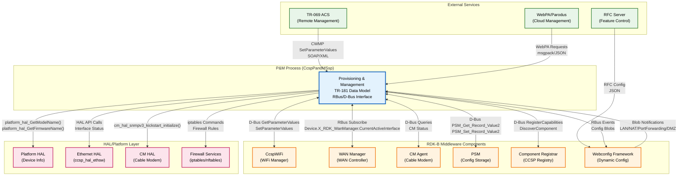
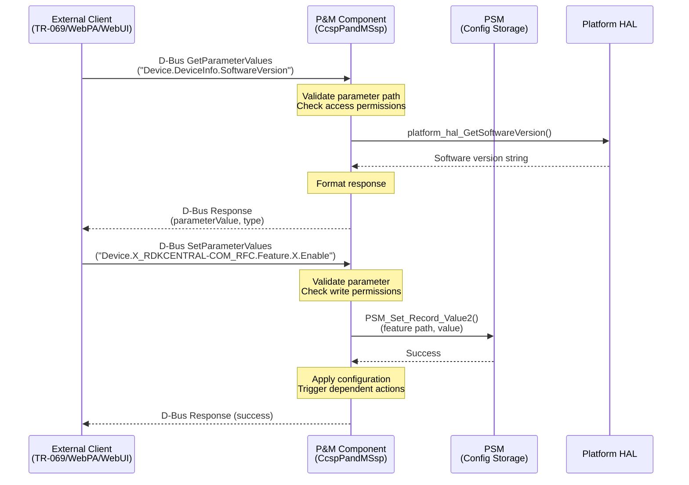
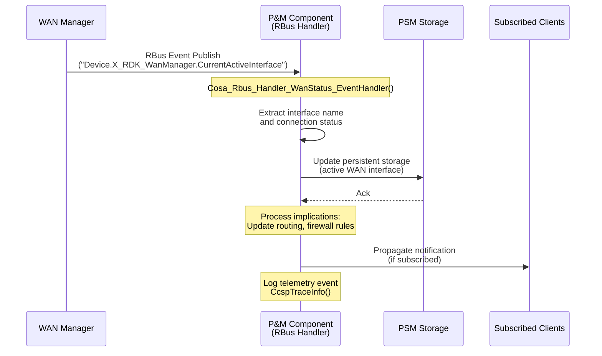
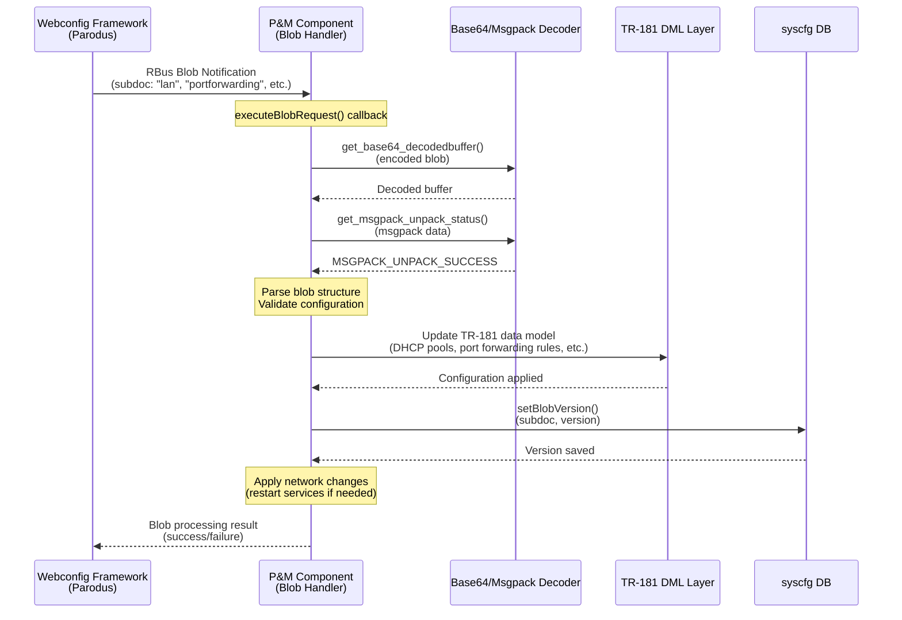
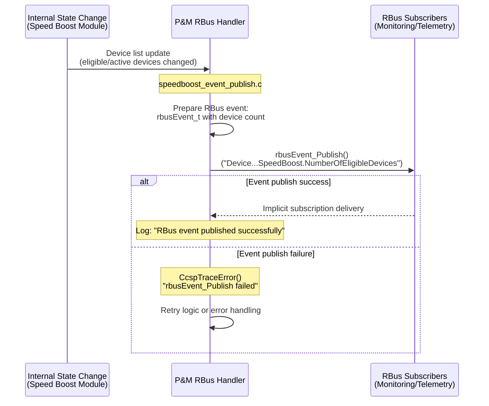

# Provisioning and Management (P&M) Component - Interactions and Implementation Details

## Component Interactions

The Provisioning and Management component serves as a central orchestrator in the RDK-B middleware stack, interacting with multiple external modules, HAL layers, and platform services through various IPC mechanisms including D-Bus, RBus, and direct API calls.

### Middleware Layer Interaction Diagram

### Interaction Matrix

| Target Component/Layer | Interaction Purpose | Key APIs/Endpoints |
|------------------------|-------------------|------------------|
| **RDK-B Middleware Components** |
| **CcspWiFi** | WiFi configuration synchronization, managed WiFi feature control, hotspot configuration | `CcspBaseIf_getParameterValues()`, `CcspBaseIf_setParameterValues()`, RBus: `Device.WiFi.X_RDK_ManagedWiFi.Bridge`, `Device.WiFi.X_RDK_ManagedWiFi.Enable` |
| **WAN Manager** | WAN status monitoring, interface configuration, network mode changes | RBus Subscribe: `Device.X_RDK_WanManager.CurrentActiveInterface`, `Device.DeviceControl.NetworkDeviceMode`, D-Bus parameter queries |
| **CM Agent (Cable Modem)** | Cable modem status, DOCSIS information, provisioning state | `CcspBaseIf_getParameterValues()` on `Device.X_CISCO_COM_CableModem.*` parameters |
| **PSM (Persistent Storage Manager)** | Configuration persistence, RFC feature flags, bootstrap data | `PSM_Get_Record_Value2()`, `PSM_Set_Record_Value2()`, paths: `dmsb.*`, `Device.DeviceInfo.X_RDKCENTRAL-COM_RFC.Feature.*` |
| **Component Registrar (CR)** | Component registration, namespace discovery, capability advertisement | `CcspBaseIf_Register_Event()`, `CcspBaseIf_discComponentSupportingNamespace()`, component path: `/com/cisco/spvtg/ccsp/pam` |
| **Webconfig Framework** | Dynamic configuration updates from cloud, blob processing for LAN/NAT/WiFi configs | RBus: `Device.X_RDK_WebConfig.webcfgRfcEnable`, Blob handlers: `Process_StaticClients_WebConfigRequest()`, `Process_Lan_WebConfigRequest()`, `Process_PF_WebConfigRequest()`, `Process_DMZ_WebConfigRequest()` |
| **System & HAL Layers** |
| **Platform HAL** | Device identification, firmware info, hardware capabilities, MACSec control | `platform_hal_GetModelName()`, `platform_hal_GetFirmwareName()`, `platform_hal_GetSoftwareVersion()`, `platform_hal_GetMACsecEnable()`, `platform_hal_SetMACsecEnable()`, `platform_hal_SetSNMPOnboardRebootEnable()` |
| **Ethernet HAL (ccsp_hal_ethsw)** | Ethernet switch control, port management, VLAN configuration | `ccsp_hal_ethsw_*()` APIs for interface control |
| **CM HAL** | Cable modem hardware abstraction, SNMP kickstart, DOCSIS configuration | `cm_hal_snmpv3_kickstart_initialize()`, `cm_hal_*()` functions |
| **syscfg (System Config DB)** | Persistent system configuration storage, boot parameters | `syscfg_get()`, `syscfg_set_commit()`, keys: `Device_Mode`, `X_RDKCENTRAL-COM_LastRebootReason`, `TelemetryEndpointURL`, `restore_reboot`, `IHC_Mode` |
| **OS/Network Services** | DHCP client control, routing daemon interaction, network interface management | System calls, process control via `v_secure_system()`, udhcpc, dibbler, zebra service management |

**Events Published by P&M:**

| Event Name | Event Topic/Path | Trigger Condition | Subscriber Components |
|------------|-----------------|-------------------|---------------------|
| **Managed WiFi Bridge Change** | `Device.WiFi.X_RDK_ManagedWiFi.Bridge` | Bridge interface assignment changes for managed WiFi | CcspWiFi, Webconfig clients |
| **Managed WiFi Enable** | `Device.WiFi.X_RDK_ManagedWiFi.Enable` | Managed WiFi feature enable/disable | CcspWiFi, WAN Manager |
| **Managed WiFi Interfaces** | `Device.WiFi.X_RDK_ManagedWiFi.Interfaces` | WiFi interface list changes | CcspWiFi |
| **Speed Boost Configuration** | `Device.DeviceInfo.X_RDK_SpeedBoost.BlobData` | Speed boost webconfig blob updates | Traffic prioritization modules |
| **Speed Boost Client Info** | `Device.DeviceInfo.X_RDK_SpeedBoost.NumberOfConfiguredDevices`, `Device.DeviceInfo.X_RDK_SpeedBoost.NumberOfEligibleDevices` | Active device list changes | Monitoring/telemetry |
| **WAN IP Address Changes** | `Device.DeviceInfo.X_COMCAST-COM_WAN_IP`, `Device.DeviceInfo.X_COMCAST-COM_WAN_IPv6` | Primary WAN IP assignment/release | WAN Manager, Firewall, Cloud agents |
| **Network Mode Change** | `Device.DeviceControl.X_RDK_DeviceNetworkingMode` | Device networking mode transitions (router/extender) | WAN Manager, WiFi, Firewall |
| **Parameter Value Changes** | Various TR-181 paths | Any TR-181 parameter modification via SetParameterValues | TR-069 ACS, WebPA, subscribed components |

**Events Subscribed by P&M:**

| Event Name | Event Source | Purpose | Handler Function |
|------------|-------------|---------|------------------|
| **WAN Manager Status** | `Device.X_RDK_WanManager.CurrentActiveInterface` | Monitor active WAN interface changes | `Cosa_Rbus_Handler_WanStatus_EventHandler()` in `cosa_rbus_handler_apis.c` |
| **DHCP Client Events (v4/v6)** | `Device.DHCPv4.Client.*`, `Device.DHCPv6.Client.*` | DHCP lease acquisition/renewal (via WAN Manager subscription passthrough) | Indirect monitoring via WAN Manager |
| **Remote Device Change** | `Device.X_RDK_RemoteDeviceChange` | Extender/mesh topology changes | Event handler for network topology updates |

### IPC Flow Patterns

**Primary IPC Flow - TR-181 Parameter Get/Set via D-Bus:**

**RBus Event Notification Flow - WAN Status Update:**

**Webconfig Blob Processing Flow:**

**Event Publishing Flow - Speed Boost Active Devices:**

## Implementation Details

### Major HAL APIs Integration

The P&M component integrates with multiple HAL layers to abstract hardware-specific operations and maintain platform portability.

**Core HAL APIs:**

| HAL API | Purpose | Implementation File |
|---------|---------|-------------------|
| **Platform HAL APIs** | | |
| `platform_hal_GetModelName(char* pValue)` | Retrieve device model name (e.g., "TG3482G", "CGM4331COM") | `cosa_deviceinfo_dml.c` (line ~878) |
| `platform_hal_GetFirmwareName(char* pValue, ULONG size)` | Get firmware image name and version | `cosa_deviceinfo_dml.c` (line ~917) |
| `platform_hal_GetSoftwareVersion(char* pValue, ULONG size)` | Retrieve software/firmware version string | `cosa_deviceinfo_dml.c` (line ~936) |
| `platform_hal_GetMACsecEnable(INT interface, BOOL* pBool)` | Check MACSec encryption status on Ethernet WAN | `cosa_deviceinfo_dml.c` (line ~4535) |
| `platform_hal_SetMACsecEnable(INT interface, BOOL bValue)` | Enable/disable MACSec encryption | `cosa_deviceinfo_dml.c` (line ~4587) |
| `platform_hal_GetMACsecOperationalStatus(INT interface, INT* flag)` | Query operational status of MACSec | `cosa_deviceinfo_dml.c` (line ~16453) |
| `platform_hal_SetSNMPOnboardRebootEnable(const char* pValue)` | Control SNMP-triggered reboot capability | `cosa_x_rdkcentral_com_xpc_internal.c` (line ~90, ~104) |
| **CM HAL APIs** | | |
| `cm_hal_snmpv3_kickstart_initialize(SNMPV3_KICKSTART_TABLE_t* table)` | Initialize SNMPv3 kickstart table for cable modem | `cosa_deviceinfo_dml.c` (line ~3679) |
| `cm_hal_*()` | Various cable modem control functions (status, provisioning, DOCSIS) | Multiple files in `cosa_deviceinfo_dml.c` |
| **Ethernet HAL APIs** | | |
| `ccsp_hal_ethsw_*()` | Ethernet switch control, port config, VLAN management | Referenced in `cosa_deviceinfo_dml.c` header (line ~85) |

### Key Implementation Logic

#### Data Model Management Engine

The P&M component implements a data model management system that maps TR-181 objects to internal data structures and HAL interactions.

- **Main Implementation**: `plugin_main.c` (COSA_Init, COSA_Async_Init functions)
  - Initializes backend manager object (`g_pCosaBEManager`)
  - Registers all TR-181 object handlers (DeviceInfo, IP, NAT, DHCP, Routing, etc.)
  - Sets up function pointers for parameter operations (Get/Set/Add/Delete)
  
- **DML Layer Architecture**: Each TR-181 object group has dedicated DML files:
  - `cosa_deviceinfo_dml.c` - Device.DeviceInfo.* (~24,639 lines)
  - `cosa_ip_dml.c` - Device.IP.Interface.*
  - `cosa_nat_dml.c` - Device.NAT.* and port forwarding
  - `cosa_dhcpv4_dml.c` - Device.DHCPv4.* server/client
  - `cosa_routing_dml.c` - Device.Routing.*
  - Pattern: Each provides `<object>_GetParamBoolValue()`, `<object>_SetParamStringValue()`, etc.

#### RBus Event Processing

RBus integration provides low-latency event-driven communication for time-sensitive operations.

- **Event Handler Registration**: `cosa_rbus_handler_apis.c`
  - `devCtrlRbusDataElements[]` array defines all RBus-exposed parameters
  - Each element specifies: name, type (PROPERTY/EVENT), handlers (get/set/subscribe)
  - Example handlers: `getUlongHandler()`, `setStringHandler()`, `eventManageWiFiBridgeSubHandler()`
  
- **Event Publishing Mechanism**: 
  - `rbusEvent_Publish(handle, &event)` sends notifications to all subscribers
  - Events contain: name, type (string/int/bool), value, filter criteria
  - Used for: WAN IP changes, WiFi config updates, Speed Boost activation
  
- **Subscription Management**:
  - `eventDevctrlSubHandler()` - Handles subscription/unsubscription for device control events
  - Maintains subscriber counts: `gSubscribersCount`, `gManageWiFiBridgeSubscribersCount`
  - Auto-publish flag support for automatic event propagation

#### Webconfig Blob Processing

Dynamic configuration updates from cloud are processed through a multi-stage pipeline.

- **Blob Decoding**: `cosa_webconfig_api.c`
  - `get_base64_decodedbuffer()` - Decodes base64-encoded configuration blobs
  - `get_msgpack_unpack_status()` - Validates msgpack structure integrity
  - Performance logging: Tracks decode time in milliseconds
  
- **Configuration Validation**:
  - `CheckIfIpIsValid()` - Validates IPv4/IPv6 addresses using `inet_pton()`
  - `CheckIfPortsAreValid()` - Ensures port numbers in valid range (1-65535)
  - Prevents invalid configurations from being applied
  
- **Version Management**:
  - `getBlobVersion()` - Retrieves current subdoc version from syscfg
  - `setBlobVersion()` - Updates version and manages rollback files
  - Pattern: `<subdoc>_version` syscfg keys track configuration generations

- **Blob-Specific Handlers**:
  - `Process_StaticClients_WebConfigRequest()` - MAC binding/static DHCP leases (`cosa_dhcpv4_dml.c`)
  - `Process_Lan_WebConfigRequest()` - LAN interface configuration (`cosa_dhcpv4_dml.c`)
  - `Process_PF_WebConfigRequest()` - Port forwarding rules (`cosa_nat_dml.c`)
  - `Process_DMZ_WebConfigRequest()` - DMZ host configuration (`cosa_nat_dml.c`)
  - `Process_ManagedWiFi_WebConfigRequest()` - Managed WiFi settings (`cosa_managedwifi_dml.c`)

#### Error Handling Strategy

Error handling ensures system stability and provides diagnostic information.

- **HAL Error Code Mapping**:
  - HAL functions return `RETURN_OK` (0) or `RETURN_ERR` (-1)
  - P&M checks return codes and logs failures: `CcspTraceError("HAL call failed")`
  - Failed HAL calls typically result in cached values or default returns
  
- **D-Bus Communication Errors**:
  - `CcspBaseIf_*()` functions return `CCSP_SUCCESS`, `CCSP_FAILURE`, `CCSP_ERR_*` codes
  - Component discovery failures are logged but don't block initialization
  - Retry logic implemented for critical operations (PSM access, component registration)
  
- **RBus Error Handling**:
  - `rbusError_t` return codes: `RBUS_ERROR_SUCCESS`, `RBUS_ERROR_BUS_ERROR`, etc.
  - `rbusError_ToString()` converts error codes to human-readable strings
  - Event publish failures logged but don't prevent parameter updates
  
- **Configuration Validation Failures**:
  - Invalid blob structures return error codes to Webconfig framework
  - Partial configuration failures: backup cache restored, rollback initiated
  - Version mismatches detected and rejected

#### Logging & Debugging

Multi-level logging provides runtime visibility and troubleshooting capabilities.

- **Logging Categories**:
  - `CcspTraceError()` - Critical failures, HAL errors, IPC communication failures
  - `CcspTraceWarning()` - Configuration issues, validation warnings, deprecated API usage
  - `CcspTraceInfo()` - Operational events, state transitions, normal IPC traffic
  - `OnboardLog()` - Persistent logging for field diagnostics
  
- **State Transition Logging**:
  - RBus event handlers log subscription changes: `"Event subscribed/unsubscribed"`
  - Webconfig blob processing: `"Base64 decode Elapsed time: X ms"`
  - WAN status changes: `"WAN status event received: <interface>"`
  
- **HAL API Call Tracing**:
  - Platform HAL calls logged with return codes
  - Performance-critical paths include timing measurements
  - Error paths include full context (function, line, parameters)
  
- **Debug Hooks**:
  - RBus-based remote debugging interface
  - Runtime issue injection for testing: `RRD_SET_ISSUE_EVENT`, `RRD_WEBCFG_ISSUE_EVENT`
  - Download trigger: `RDM_DOWNLOAD_EVENT` for firmware update scenarios

### Key Configuration Files

P&M relies on multiple configuration sources for both build-time and runtime settings.

| Configuration File | Purpose | Override Mechanisms |
|--------------------|---------|---------------------|
| **CcspPam.cfg** | CCSP component registration and D-Bus path definition | - |
| Location: `config-arm/CcspPam.cfg` | Defines: Component ID (`com.cisco.spvtg.ccsp.pam`), D-Bus path (`/com/cisco/spvtg/ccsp/pam`), Version | Environment variables can override at runtime |
| **CcspDmLib.cfg** | Data model library configuration, XML data model file mapping | - |
| Location: `config-arm/CcspDmLib.cfg` | Points to TR-181 XML definitions | Build-time configuration |
| **TR181-USGv2.XML** | Complete TR-181 data model definition with function mappings | Platform-specific variants (nowifi, bci) |
| Location: `config-arm/TR181-USGv2.XML` (18,276 lines) | Maps TR-181 objects to backend functions: `func_GetParamBoolValue`, handlers, parameter syntax | XML schema defines all exposed parameters |
| **syscfg database** | Persistent system configuration storage (flash-backed) | Command-line `syscfg set/get`, TR-181 parameter sets |
| Common keys: | `Device_Mode`, `X_RDKCENTRAL-COM_LastRebootReason`, `TelemetryEndpointURL`, `restore_reboot`, `IHC_Mode`, `<subdoc>_version` (webconfig versions) | TR-181 parameter updates trigger syscfg commits |
| **PSM database** | Persistent parameter storage for TR-181 configuration | TR-181 SetParameterValues, RFC, Webconfig |
| Namespace: | `dmsb.*` (data model storage backend), `Device.DeviceInfo.X_RDKCENTRAL-COM_RFC.Feature.*` | PSM values override defaults on boot |
| **device.properties** | Hardware/platform capability definitions | Read-only, set at build/manufacturing |
| Location: `/etc/device.properties` | Device model, features, hardware revision | Platform-specific builds |
| **debug.ini** | Debug logging configuration | Runtime editable |
| Location: `/etc/debug.ini` | Log levels per module, trace destinations | Modified without reboot for debugging |

**Configuration Precedence**:
1. **Runtime TR-181 SetParameterValues** (highest priority - from ACS, WebPA, local CLI)
2. **Webconfig blob updates** (cloud-driven feature configs)
3. **RFC feature flags in PSM** (feature rollout control)
4. **syscfg persistent values** (survives reboots)
5. **PSM database defaults** (component-specific persistence)
6. **Compiled-in defaults** (lowest priority - in source code)

**State Management**:
- **Component State Machine**: Initialization → Registration → Ready → Running
- **Configuration State**: Tracks last applied webconfig versions per subdoc
- **Connection State**: Monitors WAN status, interface operational states
- **Cache Management**: In-memory caches for port forwarding (`pf_cache`), DMZ (`dmz_cache`) with backup copies for rollback

**Bootstrap and Initialization**:
- `/tmp/pam_initialized` - Marker file indicating P&M initialization complete
- `/tmp/pam_initialized_bootup` - Tracks first-boot vs. crash recovery scenarios
- `/nvram/bootstrap.json` - Bootstrap configuration (backed up to prevent data loss)
- Timeout monitoring: 360-second watchdog for initialization (`PAM_CRASH_TIMEOUT`)
