# Provisioning and Management (P&M) Component

## Overview

The Provisioning and Management (P&M) component is a critical middleware module in the RDK-B architecture that serves as the central orchestrator for device configuration, network management, and TR-181 data model implementation. Operating as a CCSP (Common Component Software Platform) component, P&M acts as the primary interface between the device's physical layer (HAL), other RDK-B middleware components, and external management systems.

P&M implements TR-181 data model objects that expose device capabilities and configuration parameters through standardized interfaces. It manages essential networking services including IP configuration, routing, NAT, DHCP (v4 and v6), firewall rules, bridging, and device information. The component supports dynamic configuration updates through WebConfig framework integration and provides real-time parameter access via RBus messaging infrastructure.

As a service provider in the RDK-B stack, P&M enables remote device management through TR-069/TR-181 protocols, facilitates local configuration through web UI and CLI interfaces, and coordinates with other middleware components (CcspWiFi, WAN Manager, etc.) to maintain consistent network state. The component manages initialization sequencing during boot, persistent configuration storage through PSM (Persistent Storage Manager), and provides telemetry data for monitoring and diagnostics.

## System Context

The following diagram illustrates how the Provisioning and Management component interacts with users, external systems, and other components within the RDK-B ecosystem:

```mermaid
graph TD
    subgraph ExternalSystems ["External Systems"]
        ACS["TR-069 ACS<br/>(Auto Configuration Server)<br/>CWMP Protocol"]
        WebPA["WebPA Server<br/>(Cloud Management)<br/>HTTP/WebSocket"]
        WebUI["Web UI<br/>(Local Management)<br/>HTTP/HTTPS"]
        RFC["RFC Server<br/>(Feature Control)<br/>HTTP"]
    end

    subgraph PAMComponent ["P&M Component<br/>Process: CcspPandMSsp"]
        PAM["Provisioning & Management<br/>TR-181 Data Model Manager<br/>CCSP Framework"]
    end

    subgraph RDKBMiddleware ["RDK-B Middleware Components"]
        WiFi["CcspWiFi<br/>(WiFi Manager)<br/>D-Bus/RBus"]
        WAN["WAN Manager<br/>(WAN Configuration)<br/>D-Bus/RBus"]
        CM["CM Agent<br/>(Cable Modem)<br/>D-Bus"]
        PSM["PSM<br/>(Config Storage)<br/>D-Bus"]
        CR["Component Registrar<br/>(Service Registry)<br/>D-Bus"]
        Webconfig["Webconfig Framework<br/>(Dynamic Config)<br/>Parodus/RBus"]
    end

    subgraph HALLayer ["Hardware Abstraction Layer"]
        PlatformHAL["Platform HAL<br/>(Device Info)"]
        EthHAL["Ethernet HAL<br/>(Network Interfaces)"]
        CMHAL["CM HAL<br/>(DOCSIS Modem)"]
        FirewallHAL["Firewall HAL<br/>(iptables/nftables)"]
    end

    subgraph OSLayer ["Operating System Layer"]
        Linux["Linux Kernel<br/>(Network Stack)"]
        SysConfig["syscfg<br/>(System Config DB)"]
        NetStack["Network Services<br/>(udhcpc, dibbler, zebra)"]
    end

    %% External to P&M
    ACS -->|"TR-069 SetParameterValues<br/>GetParameterValues<br/>SOAP/XML"| PAM
    WebPA -->|"WebPA GET/SET<br/>JSON/msgpack"| PAM
    WebUI -->|"HTTP REST API<br/>JSON"| PAM
    RFC -->|"RFC Config Blob<br/>JSON"| Webconfig

    %% P&M to External
    PAM -->|"TR-069 Inform<br/>Event Notifications<br/>SOAP/XML"| ACS
    PAM -->|"Status/Events<br/>JSON"| WebPA

    %% P&M to Middleware
    PAM <-->|"D-Bus Messages<br/>Parameter Sync"| WiFi
    PAM <-->|"D-Bus/RBus<br/>WAN Configuration"| WAN
    PAM <-->|"D-Bus<br/>CM Status Queries"| CM
    PAM <-->|"D-Bus Get/Set<br/>Config Persistence"| PSM
    PAM <-->|"D-Bus Register<br/>Component Discovery"| CR
    PAM <-->|"RBus Events<br/>Config Updates"| Webconfig
    Webconfig -->|"Config Blobs<br/>JSON (LAN, NAT, etc.)"| PAM

    %% P&M to HAL
    PAM -->|"HAL API Calls<br/>Device Info Queries"| PlatformHAL
    PAM -->|"HAL API Calls<br/>Interface Config"| EthHAL
    PAM -->|"HAL API Calls<br/>Modem Status"| CMHAL
    PAM -->|"HAL API Calls<br/>Firewall Rules"| FirewallHAL

    %% P&M to OS
    PAM -->|"syscfg get/set<br/>Config Read/Write"| SysConfig
    PAM -->|"System Calls<br/>Process Control"| Linux
    PAM -->|"Control Commands<br/>Service Start/Stop"| NetStack
    NetStack -->|"Events/Status<br/>DHCP Lease, Routes"| PAM

    classDef external fill:#e8f5e9,stroke:#2e7d32,stroke-width:2px,color:#000;
    classDef component fill:#e3f2fd,stroke:#1565c0,stroke-width:3px,color:#000;
    classDef middleware fill:#fff3e0,stroke:#ef6c00,stroke-width:2px,color:#000;
    classDef hal fill:#fce4ec,stroke:#c2185b,stroke-width:2px,color:#000;
    classDef os fill:#f3e5f5,stroke:#7b1fa2,stroke-width:2px,color:#000;

    class ACS,WebPA,WebUI,RFC external;
    class PAM component;
    class WiFi,WAN,CM,PSM,CR,Webconfig middleware;
    class PlatformHAL,EthHAL,CMHAL,FirewallHAL hal;
    class Linux,SysConfig,NetStack os;
```

**Key Interactions:**

- **TR-069 ACS**: Remote device management via CWMP protocol for parameter configuration and firmware management
- **WebPA/Cloud**: Real-time cloud-based device management and monitoring through WebSocket connections
- **Web UI**: Local browser-based administration interface for end-users and technicians
- **RDK-B Components**: Inter-component communication via D-Bus and RBus for coordinated network management
- **Webconfig Framework**: Dynamic configuration updates delivered from cloud (LAN, NAT, Port Forwarding, DMZ, WiFi)
- **HAL Layer**: Hardware abstraction for platform-specific operations (device info, network interfaces, firewall)
- **Network Stack**: Direct interaction with Linux networking services (DHCP clients, routing daemons, iptables)

## Key Features & Responsibilities

- **TR-181 Data Model Implementation**: Implements TR-181 objects including Device.DeviceInfo, Device.IP, Device.NAT, Device.DHCPv4, Device.DHCPv6, Device.Routing, Device.Hosts, Device.Bridging, Device.Firewall, Device.DNS, Device.Time, Device.Users, and vendor-specific extensions. Provides standardized CRUD operations on all managed objects with validation and access control.

- **Network Configuration Management**: Orchestrates IP interface configuration (IPv4/IPv6), routing tables, NAT rules, port forwarding, DMZ settings, and firewall policies. Manages LAN and WAN side networking with support for multiple interfaces, VLANs, and bridging configurations. Coordinates with WAN Manager for upstream connectivity and maintains network state consistency.

- **DHCP Server and Client Management**: Controls DHCPv4 and DHCPv6 server instances for LAN-side address assignment with support for static leases, option configuration, and address pools. Manages DHCPv6 prefix delegation and stateless configuration. Provides DHCP reservation management through static client bindings and MAC-based address assignment.

- **Device Information and Monitoring**: Exposes device information including hardware version, firmware version, serial numbers, uptime, temperature, and memory statistics. Tracks network interface statistics, connection status, and performance metrics. Provides process monitoring and system diagnostics capabilities.

- **Webconfig Integration**: Integrates with RDK Webconfig framework to support dynamic configuration updates from cloud services. Handles configuration blobs for LAN settings, Port Forwarding, DMZ, Static Clients (MAC binding), Managed WiFi, and Speed Boost features. Implements blob validation, decoding, and rollback mechanisms for reliable configuration management.

- **RBus Event Handling**: Provides RBus-based publish/subscribe interface for real-time parameter change notifications and event propagation. Supports efficient data model queries and updates through RBus protocol. Enables low-latency inter-component communication for time-sensitive operations like Speed Boost activation and WiFi configuration.

- **Firewall and Security Management**: Manages iptables/nftables rules for IPv4 and IPv6 traffic filtering, port blocking, and DMZ configuration. Implements security policies including parental controls, URL filtering, and connection tracking. Coordinates with Platform HAL for hardware-accelerated firewall operations where available.

- **Hosts and Device Discovery**: Maintains active host table tracking connected devices across LAN interfaces. Provides MAC-to-IP mapping, hostname resolution, and device activity monitoring. Supports DHCPv4 and IPv6 neighbor discovery for network visibility.

- **Bridging and Interface Management**: Manages Linux bridge interfaces for LAN connectivity with support for multiple bridge instances. Controls bridge port membership, VLAN tagging, and STP configuration. Coordinates with InterfaceStack data model for proper layer-2/layer-3 relationship management.

- **Time and NTP Configuration**: Manages system time synchronization via NTP client configuration. Supports multiple NTP servers with fallback and time zone management. Provides time-of-day based scheduling for firewall rules and service activation.

- **User and Access Control**: Implements user account management for local device access with password-based authentication. Supports role-based access control for Web UI and CLI interfaces. Manages SSH and console access credentials.

- **Routing and Gateway Management**: Controls IPv4 and IPv6 routing tables including static routes, default gateways, and policy-based routing. Integrates with Quagga/FRR routing daemons for dynamic routing protocol support. Manages route priorities and interface-specific routing policies.

- **UPnP and Port Mapping**: Implements UPnP IGD (Internet Gateway Device) protocol for automatic port forwarding discovery and configuration. Manages dynamic port mapping lifecycle and security policies for UPnP-enabled applications.

- **Persistent Configuration Storage**: Integrates with PSM (Persistent Storage Manager) for non-volatile storage of configuration parameters. Manages configuration versioning, backup, and factory reset scenarios. Maintains configuration consistency across reboots and firmware upgrades.

- **Diagnostics and Testing**: Provides network diagnostic capabilities including ping, traceroute, and bandwidth testing interfaces. Supports TR-143 download/upload diagnostics for throughput measurement. Implements connectivity verification and automated health checks.

- **IPv6 Support**: Full IPv6 stack support including Router Advertisement (RA), DHCPv6, IPv6 routing, and neighbor discovery. Manages IPv6 prefix delegation from WAN and LAN-side SLAAC/DHCPv6 configuration. Supports 6rd (IPv6 Rapid Deployment) and DS-Lite tunneling mechanisms.

- **Vendor Extensions**: Implements Cisco and Comcast-specific TR-181 extensions for advanced features like Dynamic DNS, MLD (Multicast Listener Discovery), device control, remote logging, and proprietary diagnostics. Provides extensibility points for OEM customizations and platform-specific features.

- **Component Lifecycle Management**: Manages component initialization, registration with CR (Component Registrar), and graceful shutdown. Implements health monitoring, crash detection, and automatic restart capabilities. Provides component versioning and capability advertisement through CCSP framework.
