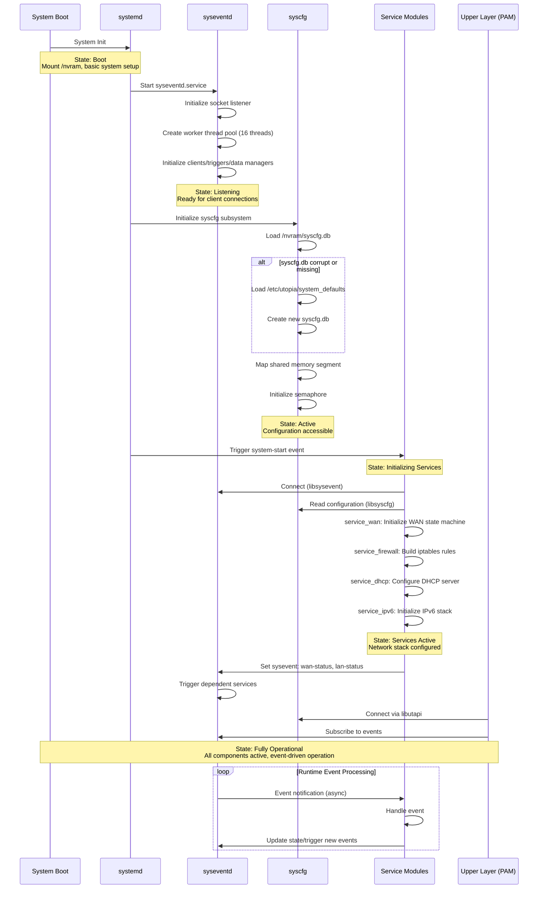
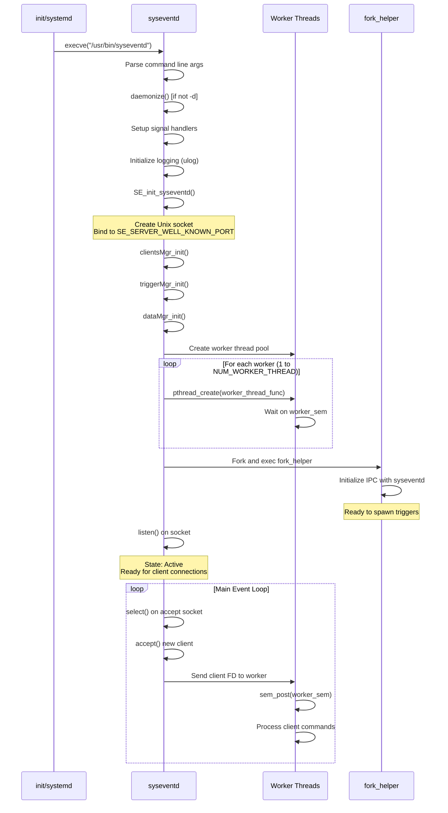
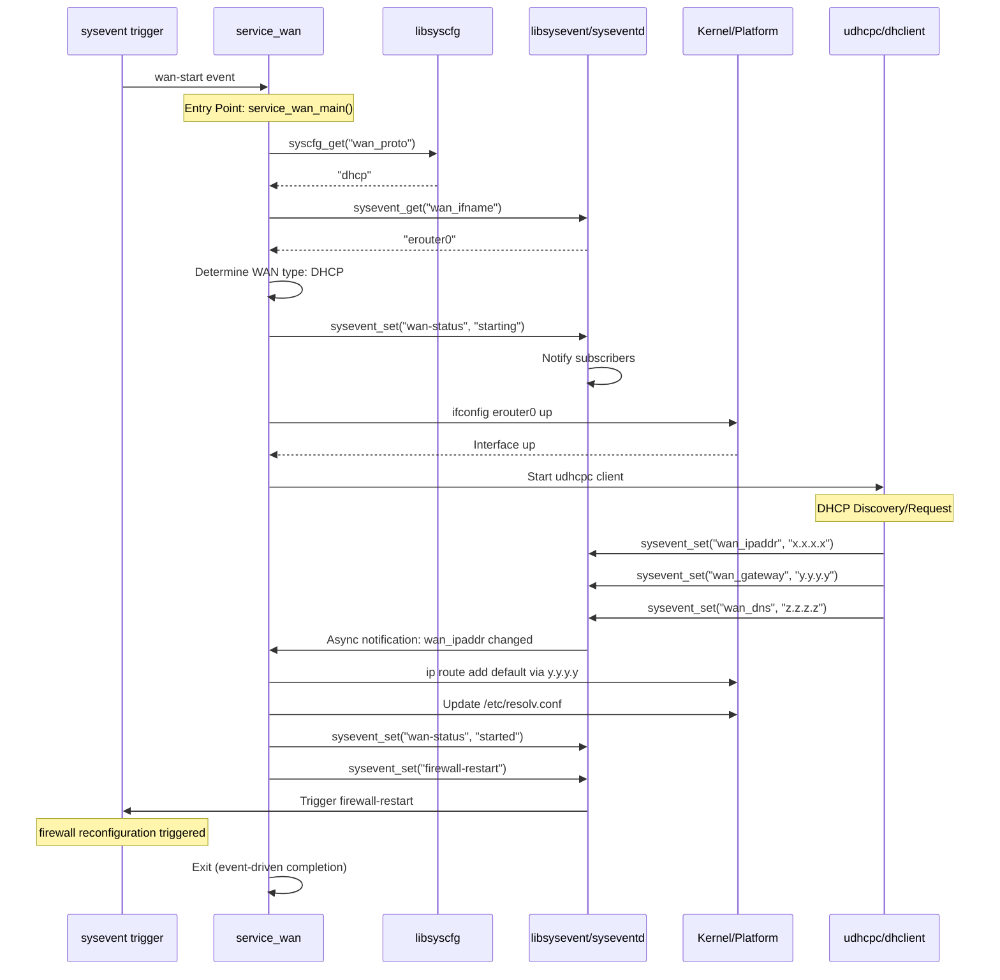
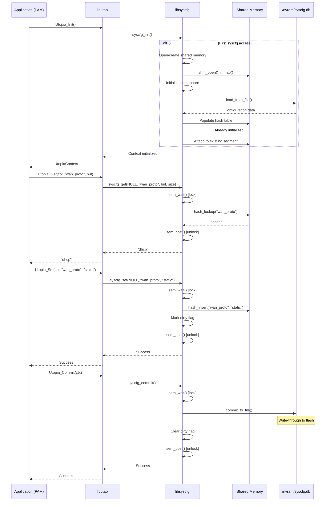
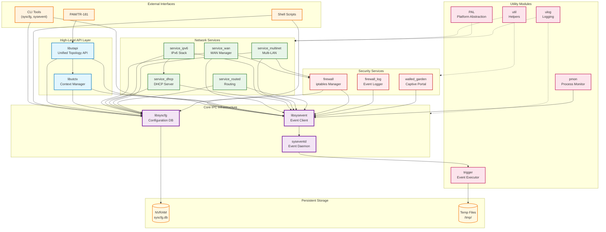

# Utopia - Design and Internal Modules

## Design

Utopia is a foundational middleware layer in the RDK-B architecture that provides system configuration management, event notification, and network service orchestration for residential gateway devices. The component implements an event-driven architecture that coordinates various network services including WAN connectivity, IPv4/IPv6 networking, firewall management, DHCP services, and routing. Utopia's design provides modularity through its separation of configuration storage (syscfg), event communication (sysevent), and high-level API abstraction (utapi), allowing inter-process communication and configuration persistence. The architecture employs a service-oriented approach where independent service modules respond to system events and configuration changes, supporting deployment across different hardware platforms and multiple WAN types (DHCP, Static, PPPoE, PPTP, L2TP). This design provides scalability, maintainability, and platform independence for network stack initialization and management on RDK-B devices.

### North-Bound and South-Bound Integration

**North-Bound Interfaces:**
Utopia exposes its functionality to upper layers through multiple mechanisms. The UTAPI library provides a C API that other RDK-B components (PAM, CcspTr069Pa, etc.) use to configure and query system settings. The sysevent mechanism allows components to subscribe to events and trigger actions through a publish-subscribe model accessible via command-line tools (sysevent) and library calls. Configuration data is made available through syscfg APIs that support get/set/commit operations. Shell scripts in `/etc/utopia/service.d/` are invoked by upper-layer components through system calls or event triggers, providing integration points for components that need to orchestrate network service lifecycle.

**South-Bound Interfaces:**
Utopia integrates with lower layers through multiple abstraction mechanisms. It interfaces with the Linux kernel networking stack through iptables/netfilter for firewall management, iproute2 for routing configuration, and standard network interface management through syscalls. The component invokes system utilities like dnsmasq, dibbler, zebra/quagga for specific protocol implementations. Platform-specific HAL interactions allow integration with Intel, Broadcom, and other hardware platforms. The PAL (Platform Abstraction Layer) modules provide isolation for platform-specific operations including logging, UPnP, and XML parsing. Persistent storage is managed through filesystem operations on `/nvram/syscfg.db` and `/tmp/` directories.

### IPC Mechanisms

Utopia implements a multi-tiered IPC architecture:

**Sysevent Daemon (syseventd):** The core IPC mechanism is a custom event notification daemon that runs as a multi-threaded server listening on a Unix domain socket. Client processes connect via `libsysevent` library which provides synchronous and asynchronous communication. The syseventd server manages:
- Event registration and subscription with callback mechanisms
- Named tuple storage (key-value pairs) for runtime state
- Trigger execution for event-driven scripts and binaries
- Multi-threaded worker pool for concurrent client handling
- Fork helper process for spawning triggered actions

**Syscfg Shared Memory:** Configuration data is accessed through a shared memory segment protected by POSIX semaphores, allowing fast lock-protected read/write access across processes. The `libsyscfg` library provides the client interface with automatic persistence to flash storage.

**D-Bus Integration:** The component integrates with CCSP D-Bus message bus for communication with TR-181 data model components, using standard D-Bus bindings for parameter access and event notification.

**Unix Domain Sockets:** Used for sysevent client-server communication and RPC-based utility communication, providing low-latency local IPC.

### Data Persistence and Storage Management

**Syscfg Database (`/nvram/syscfg.db`):** 
Primary persistent configuration store using a custom binary format with hash-table based indexing. Data is maintained in shared memory during runtime with periodic commits to flash. The database stores system defaults, user configurations, and platform-specific settings. Corruption detection and recovery mechanisms include CRC validation and fallback to `/etc/utopia/system_defaults`.

**Sysevent Runtime State:** 
Volatile state information is stored in syseventd's in-memory data structures and backed by tuple storage. Important state may be persisted to `/tmp/` filesystem for recovery across soft reboots. Trigger definitions and event subscriptions are maintained in dynamic data structures within the daemon.

**Temporary Files (`/tmp/`):**
Runtime state files including:
- `/tmp/.ipt` - iptables rules cache
- `/tmp/syseventd.pid` - daemon process ID
- Various service-specific state files for WAN, DHCP, IPv6 services
- Configuration files for dnsmasq, dibbler, and other managed daemons

**Configuration Templates:**
Static configuration templates in `/etc/utopia/` provide baseline settings and service initialization scripts that are parameterized with syscfg/sysevent values at runtime.

### Component Architecture Diagram

Utopia's internal structure showing the core libraries, service daemons, and their deployment relationships:

```mermaid
graph TD
    subgraph External["External Clients"]
        PAM["PAM<br/>(TR-181 Data Model)"]
        WanMgr["WAN Manager"]
        OtherComponents["Other RDK-B<br/>Components"]
    end

    subgraph Utopia["Utopia Middleware (C/Shell)"]
        subgraph CoreLibs["Core Libraries"]
            libsyscfg["libsyscfg<br/>(syscfg_lib.c)"]
            libsysevent["libsysevent<br/>(libsysevent.c)"]
            libutapi["libutapi<br/>(utapi.c)"]
            libutctx["libutctx<br/>(utctx.c)"]
            ulog["ulog<br/>(logging)"]
        end

        subgraph Daemons["System Daemons"]
            syseventd["syseventd<br/>(Multi-threaded Event Server)"]
            forkhelper["fork_helper<br/>(Process Spawner)"]
        end

        subgraph Services["Network Services"]
            svc_wan["service_wan<br/>(WAN Management)"]
            svc_dhcp["service_dhcp<br/>(DHCP Server)"]
            svc_ipv6["service_ipv6<br/>(IPv6 Stack)"]
            svc_routed["service_routed<br/>(Routing)"]
            svc_multinet["service_multinet<br/>(Multi-LAN)"]
            svc_firewall["firewall<br/>(iptables/netfilter)"]
        end

        subgraph Utilities["Utility Modules"]
            trigger["trigger<br/>(Event Triggers)"]
            pmon["pmon<br/>(Process Monitor)"]
            util["util<br/>(Helper Functions)"]
            pal["PAL<br/>(Platform Abstraction)"]
        end
    end

    subgraph Platform["Platform Layer"]
        kernel["Linux Kernel<br/>(Networking Stack)"]
        nvram["NVRAM Storage<br/>(/nvram/syscfg.db)"]
        iptables["iptables/netfilter"]
        dnsmasq["dnsmasq<br/>(DHCP/DNS)"]
        dibbler["dibbler<br/>(DHCPv6)"]
    end

    %% External to Core Libraries
    PAM -->|"UTAPI Calls"| libutapi
    WanMgr -->|"syscfg/sysevent API"| libsyscfg
    WanMgr -->|"sysevent API"| libsysevent
    OtherComponents -->|"Configuration API"| libutapi

    %% Core Library Dependencies
    libutapi -->|"Uses"| libsyscfg
    libutapi -->|"Uses"| libsysevent
    libutapi -->|"Uses"| libutctx
    libsyscfg -->|"Logging"| ulog
    libsysevent -->|"Logging"| ulog

    %% Library to Daemon Communication
    libsysevent -->|"Unix Socket<br/>(SE_IPC)"| syseventd
    libsyscfg -->|"Shared Memory<br/>(POSIX SEM)"| nvram

    %% Daemon Operations
    syseventd -->|"Spawns Triggers"| forkhelper
    syseventd -->|"Event Notification"| Services

    %% Services to Libraries
    svc_wan -->|"Config Access"| libsyscfg
    svc_wan -->|"Event Pub/Sub"| libsysevent
    svc_dhcp -->|"Config Access"| libsyscfg
    svc_dhcp -->|"Event Pub/Sub"| libsysevent
    svc_ipv6 -->|"Config Access"| libsyscfg
    svc_ipv6 -->|"Event Pub/Sub"| libsysevent
    svc_routed -->|"Config Access"| libsyscfg
    svc_multinet -->|"Config Access"| libsyscfg
    svc_firewall -->|"Config Access"| libsyscfg
    svc_firewall -->|"Event Pub/Sub"| libsysevent

    %% Services to Platform
    svc_firewall -->|"iptables Rules"| iptables
    svc_dhcp -->|"Configure/Control"| dnsmasq
    svc_ipv6 -->|"Configure/Control"| dibbler
    svc_routed -->|"Route Management"| kernel
    svc_wan -->|"Interface Config"| kernel

    %% Utilities
    trigger -->|"Uses"| libsysevent
    pmon -->|"Process Monitoring"| Services
    util -->|"Helper Functions"| Services
    pal -->|"Platform APIs"| kernel

    %% Platform Operations
    libsyscfg -->|"Read/Write"| nvram
    iptables -->|"Netfilter Hooks"| kernel

    classDef external fill:#fff3e0,stroke:#ef6c00,stroke-width:2px;
    classDef coreLib fill:#e1f5fe,stroke:#0277bd,stroke-width:3px;
    classDef daemon fill:#f3e5f5,stroke:#7b1fa2,stroke-width:3px;
    classDef service fill:#e8f5e9,stroke:#2e7d32,stroke-width:2px;
    classDef utility fill:#fce4ec,stroke:#c2185b,stroke-width:2px;
    classDef platform fill:#fff8e1,stroke:#f57f17,stroke-width:2px;

    class PAM,WanMgr,OtherComponents external;
    class libsyscfg,libsysevent,libutapi,libutctx,ulog coreLib;
    class syseventd,forkhelper daemon;
    class svc_wan,svc_dhcp,svc_ipv6,svc_routed,svc_multinet,svc_firewall service;
    class trigger,pmon,util,pal utility;
    class kernel,nvram,iptables,dnsmasq,dibbler platform;
```

## Prerequisites and Dependencies

### RDK-B Platform and Integration Requirements

**RDK-B Components:**
- **CcspCommon**: Base CCSP infrastructure and message bus
- **HAL**: Platform HAL (hal-cm, hal-platform, hal-moca as applicable)
- **RdkLogger**: Logging framework
- **telemetry**: Telemetry and analytics support
- **PSM (Persistent Storage Manager)**: Optional for multi-LAN configurations

**Systemd Services:**
Services that must be active before Utopia services start:
- `dbus.service` - D-Bus message bus
- `mountall.service` or equivalent - Ensures `/nvram` partition is mounted
- Platform-specific initialization services

**Message Bus:**
- **RBus**: Not used; Utopia predates RBus
- **D-Bus**: Used for CCSP component communication (PAM, TR-069)
- **Sysevent**: Custom event bus implementation within Utopia
  - Unix domain socket: `/var/run/syseventd.sock` (or configured path)
  - Namespace: Flat key-value namespace, no formal registration

**Configuration Files:**
Mandatory configuration files and locations:
- `/etc/utopia/system_defaults` - System default configuration values
- `/nvram/syscfg.db` - Persistent configuration database (created at first boot)
- `/etc/utopia/service.d/*` - Service initialization scripts
- `/usr/bin/syseventd` - Sysevent daemon binary
- `/usr/bin/syseventd_fork_helper` - Fork helper process

**Startup Order:**
1. Kernel networking subsystem initialization
2. Mount `/nvram` partition
3. `syseventd` daemon starts (provides IPC infrastructure)
4. `syscfg` initialization (loads persistent config)
5. Individual service modules (service_wan, service_dhcp, etc.) triggered by events
6. Upper-layer RDK-B components (PAM, CcspTr069Pa) connect after Utopia is ready

### Threading Model

Utopia employs a hybrid threading architecture depending on the specific module:

**Syseventd Daemon (Multi-threaded):**
- **Threading Architecture**: Multi-threaded server with thread pool
- **Main Thread**: 
  - Listens for incoming client connections on Unix domain socket
  - Accepts new connections and dispatches to worker threads
  - Manages signal handling (SIGCHLD, SIGTERM, SIGUSR1)
  - Initializes shared data structures (clients manager, triggers manager, data manager)
- **Worker Threads** (default: NUM_WORKER_THREAD = 16):
  - **Purpose**: Handle client requests concurrently
  - Each worker thread:
    - Receives connected client socket from main thread via communication FD
    - Processes sysevent commands (get, set, async, subscribe, etc.)
    - Maintains per-thread private data structure
    - Blocks on semaphore waiting for work
- **Trigger Thread**:
  - **Purpose**: Manages and executes event triggers
  - Monitors trigger queues and initiates fork_helper for process spawning
  - Handles trigger lifecycle and cleanup
- **Synchronization**:
  - `pthread_mutex_t main_communication_mutex` - Protects communication between main and worker threads
  - `pthread_mutex_t trigger_communication_mutex` - Protects trigger thread communication
  - `sem_t worker_sem` - Worker thread semaphore for work distribution
  - Per-client and per-tuple locking within managers
  - Thread-specific data using `pthread_key_t worker_data_key`

**Service Modules (Single-threaded event-driven):**
Most service modules (`service_wan`, `service_dhcp`, `service_ipv6`, `service_routed`, etc.) are single-threaded applications that:
- Execute in response to sysevent triggers
- Perform operations synchronously
- Exit upon completion (event-triggered model rather than daemon)
- May spawn child processes for external utilities (iptables, dnsmasq, dibbler)

**Libraries (Thread-safe):**
- **libsyscfg**: Thread-safe through semaphore-protected shared memory access
- **libsysevent**: Thread-safe client library, each thread can maintain independent connection to syseventd
- **libutapi**: Thread-safe as it uses underlying thread-safe syscfg/sysevent libraries

### Component State Flow

#### Initialization to Active State

The Utopia component initializes through a sequence that establishes the IPC and configuration infrastructure before activating network services. The initialization progresses from daemon startup, through configuration loading, to service registration and event-driven activation.

#### Runtime State Changes and Context Switching

**State Change Triggers:**

- **WAN State Changes**: Triggered by physical link events, DHCP lease acquisition/renewal/expiry, PPPoE authentication, static configuration changes
  - Impact: Firewall rules regeneration, routing table updates, DNS resolver reconfiguration
  - Recovery: WAN state machine handles reconnection with configurable retry intervals

- **Configuration Updates**: Initiated by PAM or TR-069 commits
  - Trigger: syscfg commit operation + sysevent notification
  - Impact: Service reconfiguration without full restart where possible
  - Recovery: Configuration rollback supported through syscfg transaction mechanism

- **Service Failures**: Detected by pmon (process monitor) or systemd watchdog
  - Trigger: Process exit, watchdog timeout
  - Impact: Service restart, state recovery from syscfg/sysevent
  - Recovery: Automatic restart with exponential backoff

- **Network Topology Changes**: Bridge creation/destruction, VLAN configuration, Multi-LAN events
  - Trigger: service_multinet events, interface add/remove
  - Impact: Firewall rule updates, DHCP server reconfiguration, routing updates
  - Recovery: Incremental updates without full network restart

**Context Switching Scenarios:**

- **WAN Failover**: Primary WAN failure triggers backup WAN activation
  - State transition: ACTIVE → DEGRADED → BACKUP_ACTIVE
  - Context: WAN interface swap, NAT reconfiguration, firewall updates
  - Coordination: service_wan orchestrates with firewall and routing services

- **IPv4/IPv6 Dual-Stack Transition**: Dynamic enable/disable of IP stacks
  - Context: IPv6 prefix delegation received, IPv4 DHCP lease obtained
  - Services affected: firewall (separate IPv4/IPv6 chains), routing, DHCP
  - Coordination: service_ipv6 coordinates with service_wan

- **Captive Portal Mode**: Device mode switching (router ↔ bridge ↔ captive portal)
  - State transition: NORMAL → CAPTIVE_PORTAL → NORMAL
  - Impact: Complete firewall reconfiguration, service enable/disable
  - Coordination: service_wan + firewall complete rebuild

- **Factory Reset**: Return to default configuration
  - Trigger: syscfg erase + reboot
  - Context: Full state reset, service reinitialization
  - Recovery: Boot from system_defaults

### Call Flow

#### Initialization Call Flow

#### Service WAN Request Processing Call Flow

The WAN connection establishment flow shows interaction between service_wan, syscfg, sysevent, and platform utilities:

#### Syscfg Configuration Access Call Flow

## Internal Modules

Utopia's architecture is organized into distinct functional modules that provide layered services from low-level configuration storage and IPC mechanisms to high-level network service orchestration.

### Core Infrastructure Modules

| Module/Class | Description | Key Files |
|-------------|------------|-----------|
| **syscfg** | Persistent configuration database manager providing shared-memory-based key-value storage with atomic commit operations. Implements hash-table indexing, semaphore-protected concurrent access, and NVRAM persistence. Supports bulk operations, transaction rollback, and corruption recovery with fallback to system defaults. | `source/syscfg/lib/syscfg_lib.c` `source/syscfg/cmd/syscfgcmd.c` `source/include/syscfg/syscfg.h` |
| **sysevent** | Event notification and runtime state management system implemented as a multi-threaded daemon (syseventd) with client library. Provides publish-subscribe event delivery, named tuple storage, asynchronous notifications, and trigger-based action execution. Supports connection pooling, client registration, and event subscription with pattern matching. | `source/sysevent/server/syseventd_main.c` `source/sysevent/server/dataMgr.c` `source/sysevent/server/clientsMgr.c` `source/sysevent/server/triggerMgr.c` `source/sysevent/lib/libsysevent.c` |
| **utapi** | High-level Unified Topology API providing abstracted interfaces for common operations (WAN configuration, LAN settings, firewall rules, WLAN parameters). Consolidates syscfg and sysevent operations behind clean C APIs used by CCSP components. Implements business logic for complex multi-step configuration changes. | `source/utapi/lib/utapi.c` `source/utapi/lib/utapi_util.c` `source/utapi/lib/utapi_wlan.c` `source/utapi/lib/utapi_tr_*.c` `source/include/utapi/utapi.h` |
| **utctx** | Context management library providing unified access to syscfg and sysevent within a single context handle. Implements reference counting, resource lifecycle management, and transaction-like semantics for configuration operations. Supports read-write locks for safe concurrent access patterns. | `source/utctx/lib/utctx.c` `source/utctx/lib/utctx_rwlock.c` `source/include/utctx/utctx_api.h` |
| **ulog** | Unified logging library providing standardized logging across Utopia modules with severity levels, module identification, and output routing. Integrates with RDK logging infrastructure and supports both syslog and file-based logging. | `source/ulog/ulog.c` `source/include/ulog/ulog.h` |

### Network Service Modules

| Module/Class | Description | Key Files |
|-------------|------------|-----------|
| **service_wan** | WAN interface lifecycle manager supporting multiple protocols (DHCP, Static IP, PPPoE, PPTP, L2TP). Implements WAN state machine, handles link up/down events, manages default routing, DNS configuration, and coordinates with firewall/NAT. Supports WAN failover and connection monitoring. | `source/service_wan/service_wan.c` `source/service_wan/service_wan_main.c` |
| **service_dhcp** | LAN-side DHCP server service managing dnsmasq configuration and lifecycle. Handles static host reservations, IP address pool management, DHCP options provisioning, and integration with LAN interface configuration. Supports multiple LAN segments and conditional serving. | `source/service_dhcp/service_dhcp.c` `source/service_dhcp/service_dhcp_server.c` `source/service_dhcp/dhcp_server_functions.c` `source/service_dhcp/lan_handler.c` |
| **service_ipv6** | IPv6 networking stack manager coordinating stateless autoconfiguration (SLAAC), DHCPv6 prefix delegation, and IPv6 addressing. Manages dibbler DHCPv6 server/client, IPv6 firewall rules, router advertisements, and integration with service_wan for dual-stack operation. | `source/service_ipv6/service_ipv6.c` `source/service_ipv6/service_ipv6_main.c` |
| **service_dhcpv6_client** | DHCPv6 client manager handling IPv6 prefix delegation requests, address acquisition, and DHCPv6 option processing. Coordinates with service_ipv6 for address assignment and prefix distribution to LAN segments. | `source/service_dhcpv6_client/service_dhcpv6_client.c` `source/service_dhcpv6_client/service_dhcpv6_client.h` |
| **service_routed** | Dynamic routing daemon manager controlling zebra/quagga routing protocol daemon. Handles RIP/OSPF configuration, static route management, and integration with WAN interface routing. Supports route redistribution and metric configuration. | `source/service_routed/service_routed.c` `source/service_routed/service_routed_main.c` |
| **service_multinet** | Multi-LAN network bridge and VLAN manager supporting software-defined network segmentation. Creates and manages Linux bridges, VLAN interfaces, and switch fabric configuration for platforms with hardware switching. Implements network instance abstraction for guest networks, IoT networks, and network isolation. | `source/service_multinet/service_multinet_main.c` `source/service_multinet/service_multinet_lib.c` `source/service_multinet/service_multinet_handler.c` `source/service_multinet/service_multinet_swfab.c` `source/service_multinet/ep_access.c` `source/service_multinet/ev_access.c` `source/service_multinet/nv_access.c` |
| **service_udhcpc** | WAN-side DHCP client service wrapper managing udhcpc execution and script-based configuration. Processes DHCP client events (bound, renew, deconfig) and updates sysevent state for WAN IP configuration. | `source/service_udhcpc/service_udhcpc.c` `source/service_udhcpc/service_udhcpc_main.c` |
| **service_dslite** | DS-Lite (Dual-Stack Lite) IPv4-over-IPv6 tunnel manager for IPv6-only WAN deployments. Configures IPv4-in-IPv6 tunnel endpoints, manages AFTR address discovery, and coordinates with firewall for tunnel traffic. | `source/service_dslite/service_dslite.c` |

### Firewall and Security Modules

| Module/Class | Description | Key Files |
|-------------|------------|-----------|
| **firewall** | iptables-based firewall manager implementing stateful packet filtering, NAT (SNAT/DNAT), port forwarding, DMZ, and application-layer gateways. Organizes rules into functional subtables (wan2self, lan2wan, wan2lan) for modular management. Supports IPv4 and IPv6 firewalls, QoS marking, trigger port ranges, parental controls, and custom rule injection. Implements incremental rule updates to minimize connection tracking disruption. | `source/firewall/firewall.c` `source/firewall/firewall_interface.c` `source/firewall/firewall_ipv6.c` `source/firewall/nfq_handler.c` `source/firewall/raw_socket_send.c` `source/firewall/firewall.h` |
| **firewall_log** | Firewall event logging daemon (GenFWLog) processing netfilter log messages and generating structured firewall event records for security monitoring and parental control enforcement. | `source/firewall_log/GenFWLog.c` |
| **walled_garden** | Captive portal / walled garden implementation restricting network access to approved destinations until authentication or provisioning completes. Implements whitelist-based filtering with iptables rules. | `source/walled_garden/walled_garden.c` |

### Utility and Support Modules

| Module/Class | Description | Key Files |
|-------------|------------|-----------|
| **trigger** | Trigger execution framework for event-driven script and binary invocation. Processes sysevent-triggered actions with environment variable passing, timeout management, and concurrent execution control. | `source/trigger/trigger.c` |
| **pmon** | Process monitor daemon tracking service availability and implementing restart policies. Monitors process health through PID files and integrates with sysevent for service lifecycle events. | `source/pmon/pmon.c` |
| **util** | Common utility library providing helper functions for string manipulation, file I/O, network operations, system calls, and platform-specific operations shared across Utopia modules. | `source/util/utils/util.c` `source/util/print_uptime/print_uptime.c` |
| **pal** | Platform Abstraction Layer isolating platform-specific functionality including UPnP device control, XML parsing, and logging mechanisms. Supports portability across different hardware platforms. | `source/pal/upnp/src/pal_upnp_device.c` `source/pal/xml/src/pal_xml.c` `source/pal/log/src/pal_log_*.c` |
| **igd** | Internet Gateway Device (IGD) UPnP implementation providing NAT traversal and port mapping services compliant with UPnP IGD specification. Allows external devices to configure port forwarding dynamically. | `source/igd/src/*` (multiple IGD-related sources) |
| **services** | Service manager library (srvmgr) providing infrastructure for service registration, startup sequencing, and dependency management across Utopia services. | `source/services/lib/srvmgr.c` |

### Platform-Specific Modules

Utopia includes platform-specific implementations for various hardware platforms:

- **Intel Puma 6/7**: L2 switch configuration, hardware NAT integration
  - `source/service_multinet/Puma6_plat/`
  - `source/service_multinet/Puma7_plat/`
- **Broadcom**: Platform-specific network acceleration
- **Generic ARM**: Standard Linux networking stack implementations

### Module Interaction Diagram

Relationships and data flow between major Utopia modules:

### Key Module Interactions

**Configuration Flow:**
1. External components (PAM, CLI) → libutapi → libsyscfg → shared memory → NVRAM persistence
2. Configuration changes trigger sysevent notifications → service reconfiguration

**Event Flow:**
1. Service modules → libsysevent → syseventd → event distribution → subscriber callbacks
2. syseventd → trigger manager → fork_helper → script/binary execution

**Service Coordination:**
1. WAN state changes → sysevent → firewall rebuild + routing updates + DNS updates
2. Multi-LAN configuration → bridge creation → firewall updates + DHCP reconfiguration
3. IPv6 prefix delegation → address assignment → firewall IPv6 rules + router advertisement

**Data Persistence:**
1. Runtime state: sysevent in-memory tuples (volatile)
2. Configuration: syscfg shared memory → periodic commit to NVRAM (persistent)
3. Service state: /tmp/ temporary files (semi-persistent across soft reboots)
