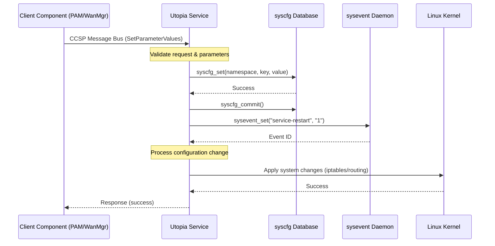
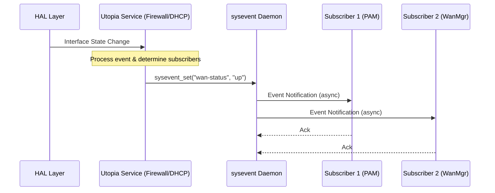
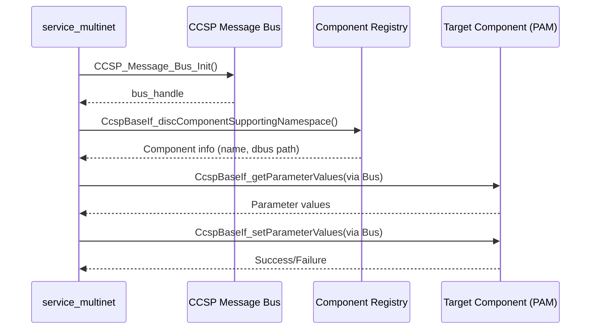

# Utopia Component Interactions and Implementation Details

## Component Interactions

The Utopia component provides core system utilities and services for RDK-B gateway devices. It implements essential networking, firewall, DHCP, routing, and configuration management functionalities that interact with multiple RDK-B middleware components, HAL layers, and platform services.

```mermaid
flowchart TD
    subgraph "External Services"
        DNS[DNS Servers]
        NTP[NTP Servers]
        DDNS[DDNS Services]
    end
    
    subgraph "RDK-B Middleware Layer"
        Utopia[Utopia Services
        C/Shell Scripts]
        PAM[PAM Component]
        WanMgr[WAN Manager]
        CcspCR[CCSP Component Registry]
        PSM[Persistent Storage Manager]
        RBus[RBus/CCSP Message Bus]
    end
    
    subgraph "Utopia Internal Services"
        Firewall[Firewall Service
        firewall.c]
        DHCP[DHCP Server
        service_dhcp_server.c]
        MultiNet[MultiNet Service
        service_multinet_main.c]
        IPv6[IPv6 Service
        service_ipv6.c]
        Routed[Routing Service
        service_routed.c]
        SysCfg[System Config
        syscfg]
        SysEvent[System Events
        sysevent]
    end
    
    subgraph "HAL/Platform Layer"
        EthSwHAL[Ethernet Switch HAL
        ccsp_hal_ethsw.h]
        PlatformHAL[Platform HAL]
        LinuxKernel[Linux Kernel
        iptables/netfilter]
    end

    Utopia -->|CCSP Message Bus| CcspCR
    Utopia -->|CCSP Message Bus| PAM
    Utopia -->|PSM Get/Set| PSM
    Utopia -->|RBus/DBUS| RBus
    
    Firewall -->|iptables rules| LinuxKernel
    MultiNet -->|HAL Calls| EthSwHAL
    DHCP -->|dnsmasq control| LinuxKernel
    IPv6 -->|routing config| LinuxKernel
    Routed -->|zebra/ripd| LinuxKernel
    
    Firewall -->|read/write| SysCfg
    DHCP -->|read/write| SysCfg
    MultiNet -->|read/write| SysCfg
    
    Firewall -->|get/set| SysEvent
    DHCP -->|get/set| SysEvent
    MultiNet -->|get/set| SysEvent
    IPv6 -->|get/set| SysEvent
    
    Utopia -->|Query| DNS
    Utopia -->|Time Sync| NTP
    Utopia -->|Updates| DDNS
    
    Utopia -->|WAN Status| WanMgr

    classDef user fill:#fff3e0,stroke:#ef6c00,stroke-width:2px;
    classDef component fill:#e1f5fe,stroke:#0277bd,stroke-width:2px;
    classDef external fill:#e8f5e8,stroke:#2e7d32,stroke-width:2px;
    classDef internal fill:#f3e5f5,stroke:#7b1fa2,stroke-width:2px;
    
    class DNS,NTP,DDNS external;
    class Utopia,PAM,WanMgr,CcspCR,PSM,RBus component;
    class Firewall,DHCP,MultiNet,IPv6,Routed,SysCfg,SysEvent internal;
    class EthSwHAL,PlatformHAL,LinuxKernel user;
```

### Interaction Matrix

Component interactions with their purposes and key APIs/endpoints:

| Target Component/Layer | Interaction Purpose | Key APIs/Endpoints |
|------------------------|-------------------|------------------|
| **RDK-B Middleware Components** |
| CCSP Component Registry | Component discovery and namespace resolution | `CcspBaseIf_discComponentSupportingNamespace()` |
| PSM (Persistent Storage Manager) | Configuration persistence and retrieval | `PSM_Get_Record_Value2()`, `PSM_VALUE_GET_STRING()` |
| PAM (Protocol & Application Manager) | Network configuration coordination | CCSP Message Bus parameters |
| WAN Manager | WAN interface status and configuration | `Device.X_RDK_WanManager.CurrentActiveInterface` |
| **System & HAL Layers** |
| CCSP Message Bus / RBus | Inter-component communication | `CCSP_Message_Bus_Init()`, `CcspBaseIf_getParameterValues()`, `CcspBaseIf_setParameterValues()` |
| Ethernet Switch HAL | VLAN configuration and port management | `ccsp_hal_ethsw.h` functions |
| Linux Kernel (iptables) | Firewall rule management | iptables-restore, netfilter hooks |
| Linux Kernel (networking) | Network interface configuration | sysctl, ip commands, routing tables |
| **Internal Data Stores** |
| syscfg | Persistent configuration storage | `syscfg_get()`, `syscfg_set()`, `syscfg_commit()` |
| sysevent | Runtime event/state management | `sysevent_get()`, `sysevent_set()`, `sysevent_setnotification()` |
| **External Services** |
| DNS Servers | Domain name resolution | Standard DNS queries |
| NTP Servers | Time synchronization | ntpclient |
| DDNS Services | Dynamic DNS updates | HTTP/HTTPS POST |

**Events Published by Utopia:**

| Event Name | Event Topic/Path | Trigger Condition | Subscriber Components |
|------------|-----------------|-------------------|---------------------|
| firewall-restart | sysevent | Firewall configuration change | PAM, other networking services |
| dhcp_server-restart | sysevent | DHCP configuration change | LAN management, PAM |
| lan-restart | sysevent | LAN interface configuration change | All LAN-dependent services |
| wan-restart | sysevent | WAN interface configuration change | All WAN-dependent services |
| ipv4-status | sysevent | IPv4 connectivity status change | Routing, firewall services |
| ipv6-status | sysevent | IPv6 connectivity status change | Routing, firewall services |
| multinet-status | sysevent | Multi-network instance status | WiFi, LAN management |

### IPC Flow Patterns

**Primary IPC Flow - Configuration Update:**

**Event Notification Flow:**

**CCSP Message Bus Communication Flow:**

## Implementation Details

### Major HAL APIs Integration

The Utopia component integrates with several HAL layers to interact with hardware and platform-specific functionality.

**Core HAL APIs:**

| HAL API | Purpose | Implementation File |
|---------|---------|-------------------|
| `ccsp_hal_ethsw` functions | Ethernet switch VLAN configuration and port management | `source/service_multinet/nv_access.c` |
| Platform-specific HAL (Puma6/Puma7) | Hardware-specific network interface configuration | `source/service_multinet/Puma6_plat/`, `Puma7_plat/` |
| `iptables/netfilter` kernel interface | Firewall rule configuration and packet filtering | `source/firewall/firewall.c` |
| Linux networking APIs | Interface configuration, routing, bridging | Multiple service files |

### Key Implementation Logic

- **Configuration Management Engine**:
  - Main implementation in `source/syscfg/lib/syscfg_lib.c`
  - Provides persistent storage for system configuration
  - Uses shared memory for fast access with file-based persistence
  - Thread-safe operations using semaphores

- **Event Processing System**:
  - Core implementation in `source/sysevent/server/syseventd_main.c`
  - Client library in `source/sysevent/lib/libsysevent.c`
  - Asynchronous event notification mechanism
  - Support for event triggers and script execution
  - Unix domain sockets for IPC

- **Firewall Engine**:
  - Main implementation in `source/firewall/firewall.c` (15,000+ lines)
  - Stateful packet inspection using iptables/netfilter
  - Support for NAT, port forwarding, DMZ, and custom rules
  - Dynamic rule generation based on configuration
  - Uses iptables-restore for atomic rule updates

- **DHCP Server Management**:
  - Core logic in `source/service_dhcp/service_dhcp_server.c`
  - Controls dnsmasq daemon for DHCP/DNS services
  - Dynamic configuration file generation
  - DHCP lease management and reservation support
  - Integration with DNS and host tracking

- **Multi-Network Service**:
  - Implementation in `source/service_multinet/service_multinet_main.c`
  - Manages multiple network instances (bridges, VLANs)
  - Platform-specific HAL abstraction
  - Dynamic network creation and destruction
  - VLAN tagging and bridging

- **IPv6 Services**:
  - Core implementation in `source/service_ipv6/service_ipv6.c`
  - DHCPv6 client/server coordination
  - Router advertisement (RA) management
  - Prefix delegation and address assignment
  - IPv6 firewall integration

- **Routing Services**:
  - Implementation in `source/service_routed/service_routed.c`
  - Zebra/Quagga routing daemon integration
  - RIP protocol support
  - Static route management
  - Dynamic routing updates

- **Error Handling Strategy**:
  - Comprehensive error code mapping across all services
  - Syslog integration for centralized logging
  - Return code validation at all API boundaries
  - Recovery mechanisms:
    - Service restart on critical failures
    - Configuration rollback support (syscfg)
    - Watchdog integration via pmon (process monitor)
    - Graceful degradation for non-critical errors

- **Logging & Debugging**:
  - Syslog-based logging framework
  - Configurable log levels (1-4): security, notice, info, debug
  - Component-specific log prefixes for filtering
  - Debug macros: `FIREWALL_DEBUG`, `ulogf(ULOG_FIREWALL, UL_INFO, ...)`
  - Trace logging for IPC operations
  - Performance logging for critical paths
  - Log rotation handled by system logger

### Key Configuration Files

| Configuration File | Purpose | Override Mechanisms |
|--------------------|---------|--------------------|
| `/var/syscfg.db` | Main persistent configuration database | Environment variables, syscfg API |
| `/var/syseventd.db` | Runtime event state storage | sysevent API |
| `/var/dnsmasq.conf` | DHCP/DNS server configuration | Generated dynamically from syscfg |
| `/tmp/.ipt` | iptables firewall rules (IPv4) | Generated by firewall service |
| `/tmp/.ipt_v6` | ip6tables firewall rules (IPv6) | Generated by firewall service |
| `/var/zebra.conf` | Zebra routing daemon configuration | Generated from syscfg |
| `/var/ripd.conf` | RIP routing daemon configuration | Generated from syscfg |
| `/etc/utopia/service.d/*` | Service control scripts | System configuration |
| `/etc/device.properties` | Device-specific properties | Device properties file |
| `/nvram/` | NVRAM-based persistent storage | Platform-specific |

**Configuration Data Model:**

- **syscfg Namespace Structure**:
  - `lan_*`: LAN interface settings (ipaddr, netmask, ifname)
  - `wan_*`: WAN interface settings
  - `firewall_*`: Firewall rules and policies
  - `dhcp_*`: DHCP server configuration
  - `dmz_*`: DMZ configuration
  - `SinglePortForward_*`, `PortRangeForward_*`: Port forwarding rules
  - `multinet_*`: Multi-network instances
  - `ipv6_*`: IPv6 configuration

- **sysevent Key Patterns**:
  - `*-status`: Service status (started/stopped/error)
  - `*-restart`: Service restart triggers
  - `current_*`: Current runtime values (IP addresses, interfaces)
  - `ipv4_*-*`: IPv4 network instance events
  - `ipv6_*-*`: IPv6 network instance events

**Implementation Notes:**

1. **Threading Model**: Most services are single-threaded with event-driven architecture
2. **IPC Mechanisms**:
   - Primary: sysevent (async events) and syscfg (config storage)
   - Secondary: CCSP Message Bus (DBUS) for component communication
   - Shared memory for high-performance data sharing (syscfg)
3. **Process Management**: Services managed by `pmon` (process monitor) with automatic restart
4. **Security**: Root privileges required for most operations; input validation at all boundaries
5. **Platform Abstraction**: Platform-specific code isolated in separate directories (Puma6_plat, Puma7_plat)

