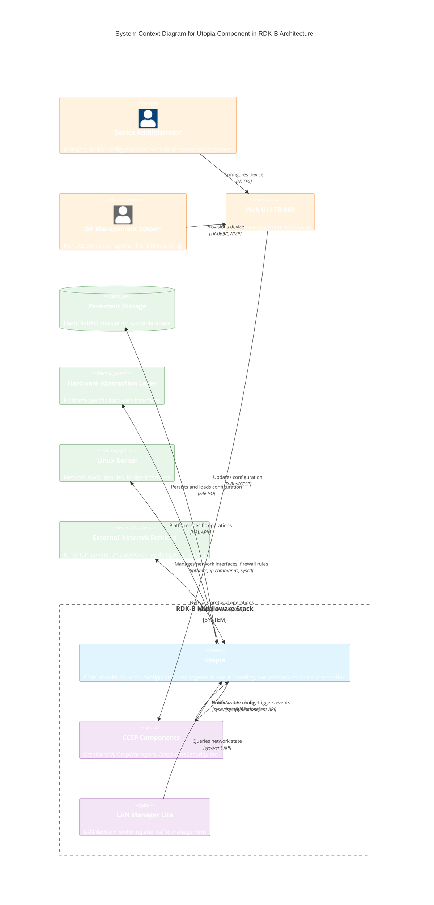

# Utopia Component - Introduction

## Overview

Utopia is a foundational middleware component in the RDK-B architecture that provides system configuration management, event handling, and network service orchestration capabilities. As a core infrastructure layer, Utopia provides dynamic runtime configuration, inter-process communication, and manages critical network services including WAN connectivity, LAN configuration, DHCP, IPv6, firewall, and routing services. The component serves as a bridge between high-level RDK-B components (like CcspPandM) and low-level platform services, abstracting platform-specific details while providing a unified API for system state management.

Utopia implements a service-oriented architecture where individual network services operate as independent processes that communicate through a centralized event system (sysevent) and shared configuration store (syscfg). This design allows for modular, event-driven network service management that can respond dynamically to system state changes, configuration updates, and runtime events without requiring service restarts or system reboots.

The component is written primarily in C and designed for embedded Linux environments typical of residential gateway devices, cable modems, and broadband routers in the RDK-B ecosystem.

## System Context

## Utopia's Role in the RDK-B Stack

### Device-Level Services

At the device level, Utopia provides the foundational infrastructure that enables RDK-B residential gateways and cable modems to function as network routers and access points. It orchestrates the complete lifecycle of network connectivity including:

- **Boot-time Initialization**: Utopia services initialize network interfaces, load persistent configuration from flash storage, and establish the initial network topology during device boot-up. This ensures the device has a consistent known state on startup.

- **WAN Connectivity Management**: Through the `service_wan` component, Utopia manages the Wide Area Network connection including DHCP client operations, static IP configuration, IPv6 address acquisition, and WAN link monitoring. It handles WAN state transitions (link up/down, IP acquisition/loss) and propagates these events to dependent services.

- **LAN Network Services**: Utopia provides LAN-side services including DHCP server functionality (`service_dhcp`), IPv6 prefix delegation and router advertisement (`service_ipv6`), multi-LAN network segmentation (`service_multinet`), and DNS proxy/forwarding capabilities. These services allow connected devices to obtain network configuration and access internet services.

- **Security and Traffic Management**: The firewall component implements iptables-based packet filtering, Network Address Translation (NAT), port forwarding, Quality of Service (QoS) marking, and parental control policies. It maintains separation between trusted LAN and untrusted WAN networks while enabling controlled traffic flow.

- **Dynamic Configuration Response**: Utopia services continuously monitor for configuration changes and network events, automatically reconfiguring network services in response to user actions (via Web UI), remote management commands (TR-069), or runtime conditions (cable unplugged, DHCP lease renewal).

### Module-Level Services

At the module level, Utopia provides three core infrastructure services that other RDK-B components depend on:

- **System Configuration Management (syscfg)**: A persistent key-value configuration database stored in flash memory that provides atomic read/write access to system settings. Components use syscfg APIs to store and retrieve configuration parameters that must survive reboots. The syscfg library implements shared memory access with semaphore-based locking to ensure thread-safe concurrent access from multiple processes.

- **System Event Framework (sysevent)**: A publish-subscribe event notification system that enables asynchronous inter-process communication. Components register interest in named events and receive notifications when those events occur. The sysevent daemon acts as a central message broker, maintaining event state and delivering notifications to subscribers via TCP/IP or Unix domain sockets. This decouples service implementations and enables event-driven architectures.

- **Unified API Library (utapi)**: A high-level abstraction layer providing consistent APIs for common operations like interface configuration, routing table management, WLAN settings, and system status queries. The utapi library wraps syscfg, sysevent, and direct system calls into cohesive functional APIs that hide implementation complexity from calling components.

- **Platform Abstraction Layer (PAL)**: Provides abstraction for platform-specific operations including logging (ulog), XML parsing, UPnP support, and kernel module interactions. This allows Utopia to run across different hardware platforms (ARM, x86, MIPS) with minimal code changes.

**Key Features & Responsibilities**:

- **Persistent Configuration Storage**: Maintains device configuration in a non-volatile flash-backed database (syscfg) that survives power cycles and firmware upgrades. Supports atomic writes, version management, and rollback capabilities to prevent configuration corruption.

- **Event-Driven Service Orchestration**: Implements a centralized sysevent daemon that coordinates state changes across distributed services. Services register event handlers and trigger cascading workflows through event publication, supporting complex multi-service operations without tight coupling.

- **WAN Connection Management**: Handles complete WAN lifecycle including physical link detection, protocol negotiation (DHCP/Static/PPPoE), IPv4/IPv6 address acquisition, default route installation, and connectivity monitoring. Supports automatic failover, connection retries, and operational state reporting.

- **DHCP Server and Client Services**: Provides DHCPv4 server for LAN clients with address pool management, static reservations, lease tracking, and option delivery. Implements DHCPv4 client for WAN interfaces and DHCPv6 client for IPv6 prefix delegation. Supports DHCP relay for multi-segment networks.

- **IPv6 Provisioning and Prefix Delegation**: Manages IPv6 router functionality including DHCPv6 prefix delegation from ISP, prefix subdivision for multiple LAN segments, router advertisement configuration, and stateless address autoconfiguration (SLAAC) support. Implements both stateful and stateless DHCPv6 server modes.

- **Firewall and NAT Implementation**: Configures and maintains iptables-based firewall with IPv4 NAT, port forwarding rules, DMZ host support, protocol-specific ALGs (Application Level Gateways), and dynamic rule management. Organizes rules into logical subtables for maintainability and supports custom firewall extensions.

- **Multi-LAN Network Segmentation**: Creates and manages multiple isolated or bridged LAN networks with independent addressing, DHCP scopes, and access policies. Supports VLAN tagging, bridge interface management, and dynamic membership changes for guest networks, IoT segments, and VPN interfaces.

- **Routing Services**: Manages static and dynamic routing tables, policy-based routing for multi-WAN scenarios, source-based routing, and route metrics. Integrates with routed daemon for RIP/OSPF support on specific platforms.

- **Quality of Service (QoS)**: Implements traffic classification and DSCP marking based on application, source/destination, protocol, or port. Configures mangle table rules for packet marking that can be used by kernel QoS schedulers and shapers.

- **Network Interface Lifecycle Management**: Handles creation, configuration, and destruction of network interfaces including bridges, VLANs, tunnels (DS-Lite, 6rd), and virtual interfaces. Manages interface addressing, MTU settings, and administrative state.

- **Walled Garden and Captive Portal Support**: Provides network isolation and controlled internet access for captive portal scenarios, supporting authentication workflows before granting full network access.

- **Trigger-based Port Forwarding**: Implements port range triggering where outbound connections on specific ports automatically create temporary inbound forwarding rules, supporting applications that require dynamic port opening.

- **MAC Address Cloning**: Supports WAN MAC address spoofing for ISP compatibility, particularly in bring-your-own-modem scenarios where specific MAC addresses are authorized by the network.

- **Device Mode Management**: Handles switching between router mode, bridge mode, and other operational modes with appropriate service enable/disable and network topology reconfiguration.

- **Network Monitoring and Host Detection**: Tracks new hosts joining the network, maintains ARP/NDP tables, and publishes host discovery events for consumption by analytics and parental control services.

- **Script-based Extension Points**: Provides init.d style service scripts and hooks for custom platform behaviors, vendor-specific features, and migration scripts for configuration format upgrades.

