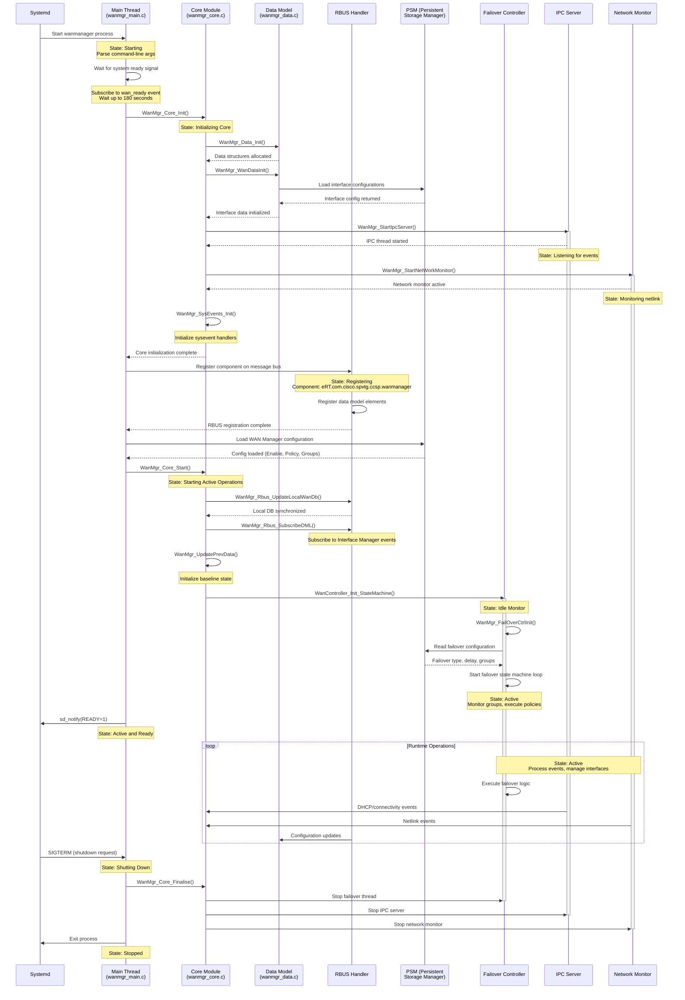
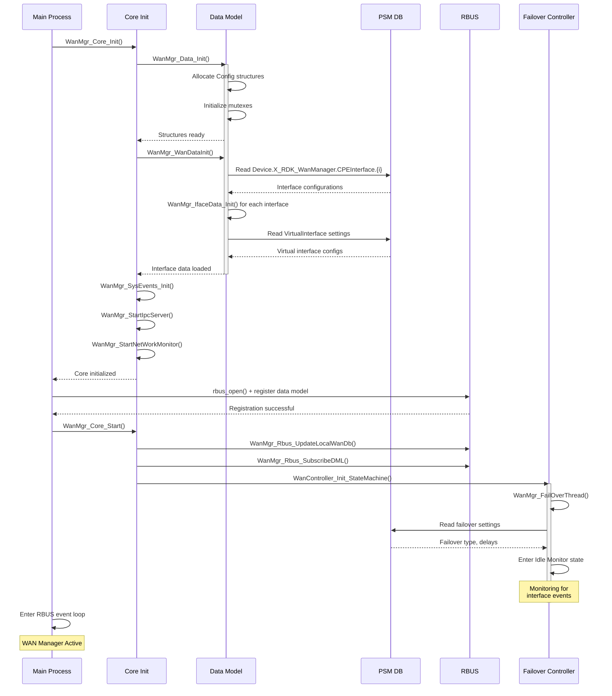
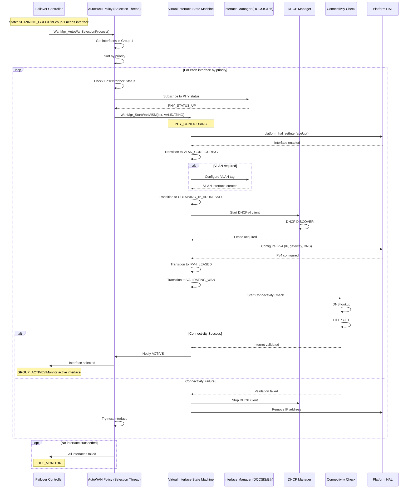
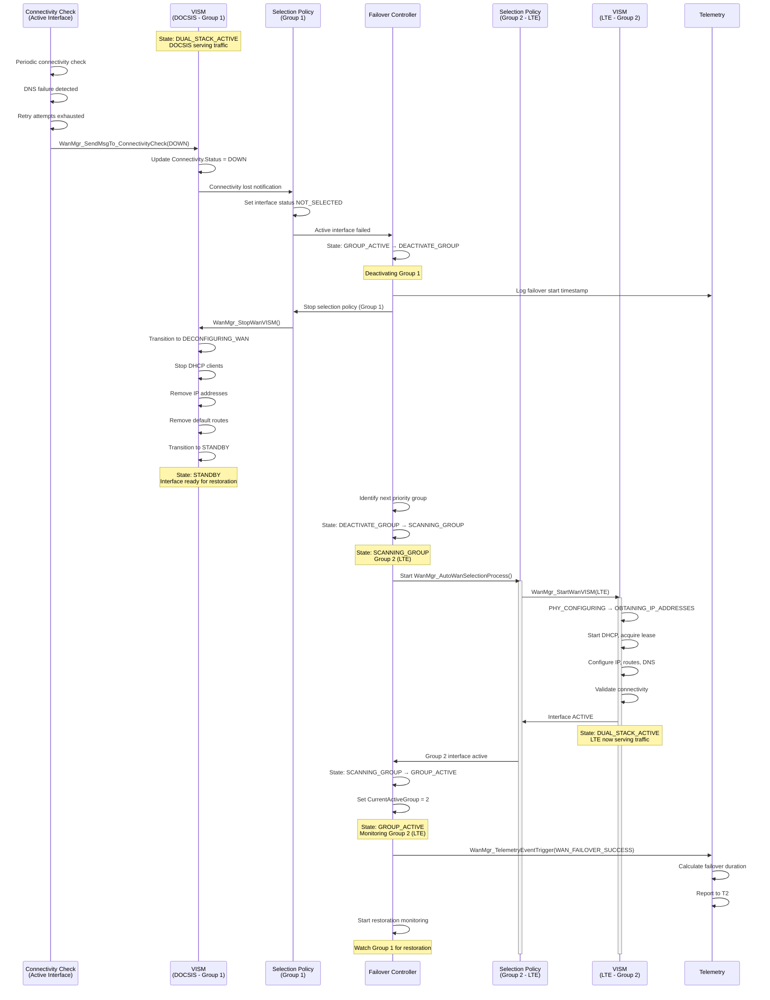
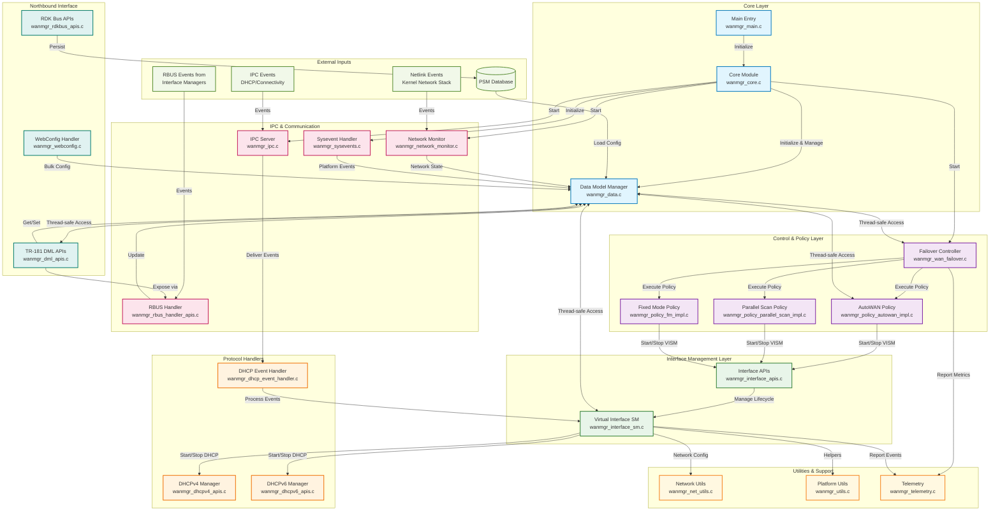

# WAN Manager - Design and Internal Modules

## Design

The WAN Manager component is architected as a multi-threaded middleware orchestrator that manages WAN connectivity across diverse physical interfaces in RDK-B powered devices. The design follows a layered architecture with clear separation of concerns: a controller layer managing failover policies, a selection policy layer implementing interface selection algorithms, and a state machine layer handling individual interface lifecycle management.

WAN Manager implements an event-driven architecture that coordinates between multiple subsystems. The design uses a policy-based approach where different selection strategies (AutoWAN, Parallel Scan, Fixed Mode, Primary Priority) can be applied to interface groups, enabling flexible deployment scenarios. The component maintains a centralized data model synchronized across all threads using mutex-protected access patterns, ensuring thread-safe operations while providing real-time responsiveness to physical layer events and configuration changes.

The architecture uses hierarchical state management: a top-level Failover Controller manages group-level transitions, per-group Selection Policies coordinate interface selection within groups, and per-interface State Machines (VISM - Virtual Interface State Machine) handle the lifecycle from PHY initialization through IP configuration to connectivity validation. This multi-level approach allows simultaneous management of multiple WAN technologies while maintaining isolation between interface groups for independent failover behavior. The design supports both hot-swap and cold-swap failover modes, automatic restoration to higher-priority interfaces, and runtime configuration updates without service interruption.

For northbound interactions, WAN Manager exposes a TR-181 compliant data model through RBUS (RDK Message Bus), enabling remote configuration via WebConfig and local management through dmcli/SNMP. The component registers as "eRT.com.cisco.spvtg.ccsp.wanmanager" on the message bus and publishes events for state changes, providing real-time visibility to management systems. Southbound, WAN Manager communicates with Interface Managers (DOCSIS, Ethernet, Cellular, DSL) through RBUS subscriptions to receive physical layer status updates and configuration parameters. It orchestrates VLAN configuration, DHCP client operations, and PPP session management by issuing commands to respective managers (VLAN Manager, DHCP Manager, PPP Manager) and interfacing directly with platform HAL for low-level network configuration.

RBUS serves as the primary IPC for all middleware-to-middleware communication, providing publish-subscribe semantics for event-driven updates and synchronous get/set operations for configuration management. An internal Unix domain socket-based IPC server handles time-critical notifications from DHCP clients and connectivity check processes. Sysevent is utilized for legacy integration and coordination with platform services. The component also uses netlink sockets for direct Linux kernel networking stack interaction, enabling real-time monitoring of interface state changes and route updates.

Data persistence and storage management follows RDK-B conventions using the Persistent Storage Manager (PSM). WAN Manager stores interface configurations, selection policies, group definitions, VLAN settings, and failover preferences in PSM, ensuring configuration survives reboots. The component uses a write-through caching strategy where runtime data model changes are immediately persisted to PSM. Configuration restoration occurs during initialization, with PSM providing the authoritative configuration source. Additionally, syscfg is used for platform-specific settings. The component implements atomic update patterns to ensure configuration consistency, and supports WebConfig-based bulk configuration updates with transactional semantics.

### Component Diagram

WAN Manager's internal structure and dependencies:

```mermaid
graph TD
    subgraph WanManagerContainer ["WAN Manager Process (wanmanager)"]
        subgraph Core ["Core Module"]
            CoreInit[Core Initialization
wanmgr_core.c]
            MainLoop[Main Entry Point
wanmgr_main.c]
            DataModel[Data Model Manager
wanmgr_data.c/h]
        end

        subgraph Controller ["Controller Layer"]
            FailoverCtrl[Failover Controller
wanmgr_wan_failover.c]
            PolicyCtrl[Policy Controller
wanmgr_controller.c]
        end

        subgraph SelectionPolicies ["Selection Policies"]
            AutoWAN[AutoWAN Policy
wanmgr_policy_autowan_impl.c]
            ParallelScan[Parallel Scan Policy
wanmgr_policy_parallel_scan_impl.c]
            FixedMode[Fixed Mode Policy
wanmgr_policy_fm_impl.c]
            PrimaryPriority[Primary Priority Policy
wanmgr_policy_pp_impl.c]
        end

        subgraph StateMachine ["Interface State Machines"]
            VISM[Virtual Interface SM
wanmgr_interface_sm.c]
            IfaceAPIs[Interface APIs
wanmgr_interface_apis.c]
        end

        subgraph DHCP ["DHCP Management"]
            DHCPv4[DHCPv4 Manager
wanmgr_dhcpv4_apis.c]
            DHCPv6[DHCPv6 Manager
wanmgr_dhcpv6_apis.c]
            DHCPEvent[DHCP Event Handler
wanmgr_dhcp_event_handler.c]
        end

        subgraph IPC ["IPC & Communication"]
            RBusHandler[RBUS Handler
wanmgr_rbus_handler_apis.c]
            IPCServer[IPC Server
wanmgr_ipc.c]
            SyseventHandler[Sysevent Handler
wanmgr_sysevents.c]
        end

        subgraph Utilities ["Utilities & Support"]
            NetUtils[Network Utils
wanmgr_net_utils.c]
            PlatformUtils[Platform Utils
wanmgr_utils.c]
            Telemetry[Telemetry
wanmgr_telemetry.c
wanmgr_t2_telemetry.c]
            NetworkMon[Network Monitor
wanmgr_network_monitor.c]
        end

        subgraph TR181 ["TR-181 Data Model Layer"]
            DMLAPIs[DML APIs
wanmgr_dml_apis.c]
            RdkBusAPIs[RDK Bus APIs
wanmgr_rdkbus_apis.c]
            WebConfig[WebConfig Handler
wanmgr_webconfig.c]
        end
    end

    subgraph ExternalRDKB ["RDK-B Components"]
        CCSP_CR[(CCSP Component
Registry)]
        PSM[(Persistent Storage
Manager)]
        InterfaceMgrs[Interface Managers
DOCSIS/Eth/Cellular/DSL]
        VLANMgr[VLAN Manager]
        DHCPMgr[DHCP Manager]
        PPPMgr[PPP Manager]
        PAM[Platform & Application
Manager]
    end

    subgraph HALLayer ["Hardware Abstraction Layer"]
        PlatformHAL[Platform HAL]
        NetworkHAL[Network HAL]
    end

    subgraph PlatformServices ["Platform Services"]
        Sysevent[Sysevent]
        LinuxNet[Linux Networking
ip/route/netlink]
        WebPA[WebPA/WebConfig]
    end

    %% Core connections
    MainLoop -->|Initialize| CoreInit
    CoreInit -->|Manages| DataModel
    CoreInit -->|Starts| FailoverCtrl
    CoreInit -->|Starts| IPCServer
    CoreInit -->|Starts| NetworkMon

    %% Controller connections
    FailoverCtrl -->|Invokes| PolicyCtrl
    PolicyCtrl -->|Executes| AutoWAN
    PolicyCtrl -->|Executes| ParallelScan
    PolicyCtrl -->|Executes| FixedMode
    PolicyCtrl -->|Executes| PrimaryPriority

    %% State Machine connections
    AutoWAN -->|Starts/Stops| VISM
    ParallelScan -->|Starts/Stops| VISM
    FixedMode -->|Starts/Stops| VISM
    PrimaryPriority -->|Starts/Stops| VISM
    VISM -->|Uses| IfaceAPIs
    VISM -->|Controls| DHCPv4
    VISM -->|Controls| DHCPv6
    DHCPEvent -->|Notifies| VISM

    %% IPC connections
    RBusHandler -->|Updates| DataModel
    IPCServer -->|Receives Events| DHCPEvent
    SyseventHandler -->|Publishes Events| Sysevent
    RBusHandler -->|Subscribes| InterfaceMgrs
    WebConfig -->|Configures| DataModel

    %% TR-181 connections
    DMLAPIs -->|Accesses| DataModel
    RdkBusAPIs -->|Persists| PSM
    DMLAPIs -->|Exposes via| RBusHandler

    %% Utility connections
    VISM -->|Uses| NetUtils
    VISM -->|Uses| PlatformUtils
    FailoverCtrl -->|Reports| Telemetry
    NetworkMon -->|Monitors| LinuxNet

    %% External connections
    RBusHandler <-->|RBUS Protocol| CCSP_CR
    RdkBusAPIs <-->|Get/Set| PSM
    RBusHandler <-->|Status/Config| InterfaceMgrs
    IfaceAPIs -->|Commands| VLANMgr
    DHCPv4 -->|Control| DHCPMgr
    DHCPv6 -->|Control| DHCPMgr
    VISM -->|PPP Control| PPPMgr
    RBusHandler <-->|IP Info| PAM
    WebConfig <-->|Configuration| WebPA

    %% HAL connections
    IfaceAPIs -->|Platform Calls| PlatformHAL
    NetUtils -->|Network Calls| NetworkHAL

    %% Platform connections
    NetUtils -->|Commands| LinuxNet
    SyseventHandler -->|Events| Sysevent

    classDef core fill:#e1f5fe,stroke:#0277bd,stroke-width:2px;
    classDef controller fill:#f3e5f5,stroke:#7b1fa2,stroke-width:2px;
    classDef policy fill:#fff3e0,stroke:#ef6c00,stroke-width:2px;
    classDef statemachine fill:#e8f5e9,stroke:#2e7d32,stroke-width:2px;
    classDef ipc fill:#fce4ec,stroke:#c2185b,stroke-width:2px;
    classDef external fill:#f1f8e9,stroke:#558b2f,stroke-width:2px;
    classDef hal fill:#fff8e1,stroke:#f57f17,stroke-width:2px;
    classDef platform fill:#e0f2f1,stroke:#00796b,stroke-width:2px;

    class CoreInit,MainLoop,DataModel core;
    class FailoverCtrl,PolicyCtrl controller;
    class AutoWAN,ParallelScan,FixedMode,PrimaryPriority policy;
    class VISM,IfaceAPIs statemachine;
    class RBusHandler,IPCServer,SyseventHandler ipc;
    class CCSP_CR,PSM,InterfaceMgrs,VLANMgr,DHCPMgr,PPPMgr,PAM external;
    class PlatformHAL,NetworkHAL hal;
    class Sysevent,LinuxNet,WebPA platform;
```

**Purpose of Key Components:**

- **Core Module**: Initializes WAN Manager, manages centralized data model with mutex-protected access, and coordinates startup of all subsystems
- **Failover Controller**: Implements group-level failover logic, monitors active group health, triggers failover/restoration based on connectivity status
- **Selection Policies**: Execute interface selection algorithms within groups - AutoWAN tries interfaces sequentially, Parallel Scan validates multiple simultaneously, Fixed Mode uses predefined interface, Primary Priority maintains preference hierarchy
- **Virtual Interface State Machine (VISM)**: Manages complete lifecycle of virtual interfaces from PHY layer through VLAN, PPP, IP configuration to connectivity validation
- **DHCP Management**: Handles DHCPv4/v6 client lifecycle, processes lease events, manages DNS server configuration, coordinates with DHCP Manager component
- **IPC & Communication**: Manages RBUS registration and subscriptions, operates internal IPC server for DHCP events, handles sysevent publishing for platform integration
- **TR-181 Layer**: Exposes standard TR-181 data model, handles remote configuration via WebConfig, persists configuration to PSM

### Prerequisites and Dependencies

**RDK-B Platform and Integration Requirements:**

- **RDK-B Components**: 
  - **CCSP Component Registry (CR)** - Required for component registration and discovery
  - **Persistent Storage Manager (PSM)** - Required for configuration persistence
  - **Platform & Application Manager (PAM)** - Required for IP interface management
  - **Interface Managers** - At least one interface manager (DOCSIS/Ethernet/Cellular/DSL) required
  - **VLAN Manager** - Required if VLAN tagging is used
  - **DHCP Manager** - Required for DHCP-based WAN interfaces
  - **PPP Manager** - Required for PPPoE/PPP-based WAN interfaces
  - **WebPA** - Required for remote management via WebConfig

- **HAL Dependencies**: 
  - **Platform HAL** - WAN interface control APIs
  - **Network HAL** - Network configuration and status APIs
  - **CM HAL** (for DOCSIS) - Cable modem status and control
  - **Cellular HAL** (for LTE/5G support) - Cellular modem management

- **Message Bus**: 
  - **RBUS Registration**: Component name `eRT.com.cisco.spvtg.ccsp.wanmanager`
  - **Namespace**: `Device.X_RDK_WanManager.*` for RDK extensions, `Device.X_RDKCENTRAL-COM_WanManager.*` for legacy paths
  - **Subscriptions**: Subscribes to Interface Manager events, system ready events, DHCP events
  - **Publications**: Publishes WAN status changes, interface selection events, connectivity events

- **Startup Order**: 
  1. Sysevent daemon
  2. PSM service
  3. Component Registry (CR)
  4. Platform HAL initialization
  5. Interface Managers (DOCSIS/Eth/Cellular)
  6. VLAN Manager (if used)
  7. DHCP Manager
  8. **WAN Manager** ← Component initialization point
  9. PAM (Platform & Application Manager)
  10. WebPA (for remote management)

**Threading Model**

WAN Manager implements a multi-threaded architecture to handle concurrent operations across multiple WAN interfaces and policy execution contexts. The component creates dedicated threads for specific functional domains, ensuring isolation and preventing blocking operations from impacting overall system responsiveness.

- **Threading Architecture**: Multi-threaded with event-driven main loops in each thread
- **Main Thread**: 
  - Initializes component, registers with CCSP Component Registry
  - Sets up RBUS message bus connection and data model registration
  - Loads configuration from PSM
  - Creates and launches worker threads
  - Handles CCSP/RBUS message processing loop
  - Responds to TR-181 get/set requests
  - Processes WebConfig configuration updates
  
- **Worker Threads**:
  - **Failover Controller Thread** (`WanMgr_FailOverThread`):
    - Manages group-level failover state machine
    - Monitors active interface group health
    - Triggers failover to backup groups
    - Handles restoration to higher-priority groups
    - Coordinates with Selection Policy threads
  
  - **Selection Policy Threads** (one per interface group):
    - Execute group-specific selection policies (AutoWAN, Parallel Scan, etc.)
    - Monitor physical layer status of interfaces in assigned group
    - Select appropriate interface based on policy algorithm
    - Start/stop Virtual Interface State Machines
    - Handle interface priority changes and group configuration updates
  
  - **Virtual Interface State Machine Threads** (one per active virtual interface):
    - Manage individual interface lifecycle (PHY → VLAN → PPP → IP → Validation)
    - Execute state transitions based on events
    - Configure VLAN tagging, PPP sessions, DHCP clients
    - Monitor connectivity and interface health
    - Report status back to selection policy
  
  - **IPC Server Thread** (`WanMgr_StartIpcServer`):
    - Listens on Unix domain socket for IPC messages
    - Receives DHCP client events (bound, renew, release)
    - Processes connectivity check results
    - Handles interface status notifications
    - Thread-safe queue for event delivery to state machines
  
  - **Network Monitor Thread** (`WanMgr_StartNetWorkMonitor`):
    - Monitors Linux netlink for interface state changes
    - Detects carrier up/down events
    - Tracks route table modifications
    - Publishes network events to interested components
  
  - **Connectivity Check Threads** (spawned per interface as needed):
    - Perform Internet connectivity validation (DNS, HTTP, ICMP)
    - Run periodic health checks on active interfaces
    - Report connectivity status back to VISM
    - Terminate when interface becomes inactive

- **Synchronization**: 
  - Pthread mutexes protect shared data model structures (`WanMgr_Iface_Data_t`, `WanMgr_Config_Data_t`)
  - Lock acquisition pattern: `WanMgr_GetIfaceData_locked()` / `WanMgrDml_GetIfaceData_release()`
  - Read-write locks for configuration data to allow concurrent readers
  - Condition variables for thread coordination (policy state changes)
  - Atomic operations for simple state flags
  - Lock hierarchy enforced to prevent deadlocks: Config → Group → Interface → VISM

### Component State Flow

**Initialization to Active State**

WAN Manager's lifecycle progresses through several distinct phases from process start to operational readiness. The component initializes its core subsystems, loads persistent configuration, establishes IPC connections, and then transitions to active policy execution where it continuously manages WAN connectivity.

**Runtime State Changes and Context Switching**

During normal operation, WAN Manager dynamically responds to various events that trigger state changes across its hierarchical state machine architecture. The component handles physical layer changes, policy reconfigurations, connectivity failures, and administrative commands.

**State Change Triggers:**

- **Physical Layer Events**: Interface up/down, carrier detection, link establishment triggers VISM state transitions and may initiate selection policy re-evaluation
- **Connectivity Events**: Internet validation success/failure, DNS resolution failures, gateway unreachability causes interface re-selection or failover
- **Configuration Changes**: Policy updates, interface priority changes, group modifications trigger policy restart and interface re-evaluation
- **DHCP Events**: Lease acquisition, renewal, expiration, NAK events advance VISM through IP configuration states
- **Administrative Commands**: Enable/disable WAN Manager, reset interface, force failover/restoration via TR-181 or WebConfig
- **Timer Expiration**: Selection timeout, restoration delay timer, connectivity check interval triggers policy decisions
- **Group Failover**: Active interface failure in current group triggers transition to scanning next priority group

**Impact of State Changes:**

- **Interface Selection Change**: Current interface deconfigured (IP removed, DHCP stopped, routes deleted), new interface initialized through VISM
- **Failover Event**: Active group deactivated, all interfaces in group brought to standby, next group scanned, telemetry events triggered
- **Policy Change**: All running selection policy threads stopped, VISMs transitioned to standby, new policy threads created with updated parameters
- **Connectivity Degradation**: Health check frequency increased, backup interface may be started in hot-standby mode, failover timer initiated

**Context Switching Scenarios:**

- **Failover Between Groups**: 
  - Trigger: Primary interface (e.g., DOCSIS) loses connectivity
  - Action: Failover controller transitions from GROUP_ACTIVE to DEACTIVATE_GROUP state
  - Impact: Primary interface VISM moves to STANDBY, backup group (e.g., LTE) enters SCANNING_GROUP
  - Recovery: Once backup validated, routes switched, primary group marked for restoration monitoring

- **Restoration to Higher Priority Group**:
  - Trigger: Higher priority interface (e.g., Fiber) regains physical link after configured restoration delay
  - Action: Failover controller transitions to RESTORATION_WAIT, then SCANNING_GROUP for higher group
  - Impact: Current active interface (e.g., LTE) continues serving traffic during restoration validation
  - Recovery: Upon successful validation, hot-swap or cold-swap to restored interface based on failover type

- **Policy Runtime Modification**:
  - Trigger: WebConfig pushes policy change from AutoWAN to Parallel Scan for a group
  - Action: Current selection policy thread receives stop signal, waits for clean state
  - Impact: Active VISM may continue or transition to standby based on new policy requirements
  - Recovery: New policy thread started, re-evaluates all interfaces in group per new algorithm

- **DHCPv6 to Static IP Transition**:
  - Trigger: Configuration change from DHCP to static IP mode for IPv6
  - Action: VISM transitions to REFRESHING_WAN state, stops DHCPv6 client
  - Impact: IPv6 address released, routes removed, dual-stack may drop to IPv4-only temporarily
  - Recovery: Static IPv6 configured via netlink, routes restored, dual-stack re-established

### Call Flow

**Initialization Call Flow:**

**Interface Selection and Activation Call Flow (AutoWAN Policy):**

**Failover Trigger and Execution Call Flow:**

## Internal Modules

WAN Manager is composed of several internal modules, each responsible for specific aspects of WAN connectivity management. The modules interact through well-defined interfaces, with the data model acting as the central coordination point.

| Module/Class | Description | Key Files |
|-------------|------------|-----------|
| **Core Module** | Provides initialization, startup, and shutdown orchestration for WAN Manager. Coordinates the startup sequence of all subsystems including IPC server, network monitor, sysevent handlers, and the failover controller. Acts as the entry point that ties together all other modules. | `wanmgr_core.c`, `wanmgr_core.h`, `wanmgr_main.c` |
| **Data Model Manager** | Manages centralized WAN configuration and runtime state using mutex-protected data structures. Provides thread-safe access APIs for interface data, configuration data, and group data. Handles PSM persistence, WebConfig updates, and data model synchronization across threads. Implements the single source of truth for WAN Manager state. | `wanmgr_data.c`, `wanmgr_data.h` |
| **Failover Controller** | Implements the top-level state machine managing group-level failover and restoration logic. Monitors active interface group health, triggers failover to backup groups on connectivity loss, handles restoration to higher-priority groups after configured delays. Orchestrates selection policy thread lifecycle and coordinates group transitions. | `wanmgr_wan_failover.c`, `wanmgr_wan_failover.h`, `wanmgr_controller.c`, `wanmgr_controller.h` |
| **Selection Policies** | Executes interface selection algorithms within groups. AutoWAN tries interfaces sequentially by priority until validation succeeds. Parallel Scan validates multiple interfaces simultaneously and selects best performing. Fixed Mode uses administratively configured interface. Primary Priority maintains strict priority ordering with automatic fallback. Each policy runs in dedicated thread per group. | `wanmgr_policy_autowan_impl.c`, `wanmgr_policy_parallel_scan_impl.c`, `wanmgr_policy_fm_impl.c`, `wanmgr_policy_fmob_impl.c`, `wanmgr_policy_pp_impl.c`, `wanmgr_policy_ppob_impl.c` |
| **Virtual Interface State Machine (VISM)** | Manages complete lifecycle of virtual WAN interfaces through hierarchical state machine. Handles transitions from PHY layer initialization through VLAN configuration, PPP session establishment, DHCP/Static IP configuration, to Internet connectivity validation. Each active virtual interface runs independent VISM thread. Coordinates with DHCP, PPP, VLAN, and connectivity check subsystems. | `wanmgr_interface_sm.c`, `wanmgr_interface_sm.h`, `wanmgr_interface_apis.c`, `wanmgr_interface_apis.h` |
| **DHCP Management** | Provides DHCPv4 and DHCPv6 client lifecycle management. Starts/stops DHCP clients, processes lease events (bound, renew, release), extracts IP addresses, gateways, DNS servers. Handles DHCP event routing from IPC server to appropriate VISM. Supports both udhcpc and dibbler DHCP clients. Manages IPv6 prefix delegation and stateless autoconfiguration (SLAAC). | `wanmgr_dhcpv4_apis.c`, `wanmgr_dhcpv4_apis.h`, `wanmgr_dhcpv4_internal.c`, `wanmgr_dhcpv6_apis.c`, `wanmgr_dhcpv6_apis.h`, `wanmgr_dhcpv6_internal.c`, `wanmgr_dhcp_event_handler.c` |
| **RBUS Handler** | Manages message bus integration for WAN Manager. Registers component on RBUS with namespace `eRT.com.cisco.spvtg.ccsp.wanmanager`. Handles subscriptions to Interface Manager events, system ready signals, and configuration changes. Publishes WAN status events, interface selection notifications, and connectivity state changes. Implements RBUS event handlers and data model element callbacks. | `wanmgr_rbus_handler_apis.c`, `wanmgr_rbus_handler_apis.h` (in source/TR-181/) |
| **IPC Server** | Operates internal Unix domain socket server for time-critical event delivery. Receives DHCP client events (lease acquired, renewed, expired), connectivity check results, and interface status updates. Implements non-blocking event queue with thread-safe delivery to VISMs and selection policies. Listens on `/tmp/wanmanager_ipc.sock`. | `wanmgr_ipc.c`, `wanmgr_ipc.h` |
| **Network Monitor** | Monitors Linux kernel networking stack via netlink sockets. Detects interface carrier state changes (up/down), route table modifications, IP address additions/removals. Publishes network events to WAN Manager modules and external components. Provides real-time visibility into Linux networking state independent of HAL abstractions. | `wanmgr_network_monitor.c`, `wanmgr_network_monitor.h` |
| **TR-181 Data Model Layer** | Exposes standard TR-181 and RDK-specific data model elements via RBUS/DBUS. Implements get/set handlers for `Device.X_RDK_WanManager.*` hierarchy. Processes remote configuration via WebConfig, validates configurations, applies changes to runtime data model. Handles data model persistence to PSM. Provides northbound API for management systems (ACS, WebPA, dmcli). | `wanmgr_dml_apis.c`, `wanmgr_dml_apis.h`, `wanmgr_rdkbus_apis.c`, `wanmgr_rdkbus_apis.h`, `wanmgr_webconfig_apis.c`, `wanmgr_webconfig.c` (in source/TR-181/) |
| **Network Utilities** | Provides common network configuration helpers. Wraps platform HAL calls for IP address configuration, routing table manipulation, interface status queries. Implements netlink-based interface configuration as alternative to HAL. Offers DNS configuration, ARP table management, and network namespace operations. Used extensively by VISM for low-level network setup. | `wanmgr_net_utils.c`, `wanmgr_net_utils.h` |
| **Platform Utilities** | General-purpose utility functions for WAN Manager. String manipulation, file operations, process management, time/date handling. Provides secure wrappers for system calls. Implements helper functions for data model navigation, instance number management, and configuration validation. | `wanmgr_utils.c`, `wanmgr_utils.h` |
| **Sysevent Handler** | Integrates with RDK-B sysevent infrastructure for legacy compatibility and platform coordination. Publishes WAN state changes to sysevent for consumption by scripts and other components. Subscribes to platform events (e.g., firewall restart, LAN status). Provides bridge between message bus and sysevent domains. | `wanmgr_sysevents.c`, `wanmgr_sysevents.h` |
| **Telemetry Module** | Reports operational metrics and events to RDK telemetry systems (T2). Tracks failover/restoration success/failure counts, connectivity check results, interface selection events, DHCP lease acquisition times. Logs timed events for performance analysis (e.g., failover duration). Publishes to both legacy telemetry and T2 infrastructure. | `wanmgr_telemetry.c`, `wanmgr_telemetry.h`, `wanmgr_t2_telemetry.c`, `wanmgr_t2_telemetry.h` |

### Module Interaction Diagram

**Module Data Flow Summary:**

1. **Initialization Flow**: Main → Core → DataModel → PSM (configuration load) → Failover Controller → Policy Threads → VISM Threads
2. **Configuration Flow**: WebConfig → TR-181 DML → DataModel → RDK Bus APIs → PSM (persistence)
3. **Event Flow**: Interface Managers → RBUS Handler → DataModel → Policy Threads → VISM
4. **DHCP Event Flow**: DHCP Client → IPC Server → DHCP Event Handler → VISM → DataModel
5. **Network Event Flow**: Linux Kernel → Network Monitor → DataModel → VISM
6. **Failover Flow**: Connectivity Check → VISM → Policy Thread → Failover Controller → New Policy Thread → New VISM
7. **Status Publication Flow**: VISM → DataModel → RBUS Handler → External Components (PAM, Interface Managers)
