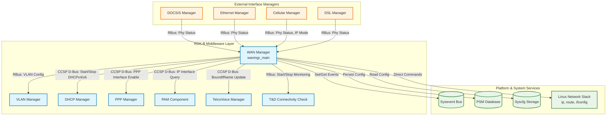
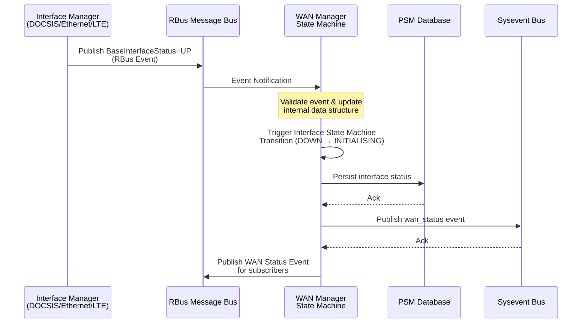
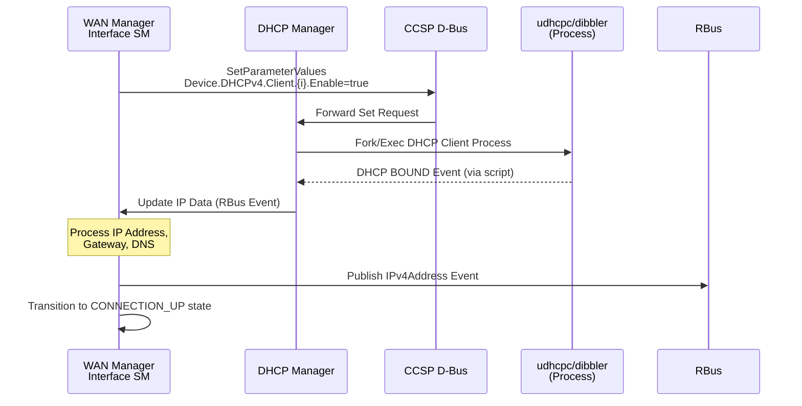
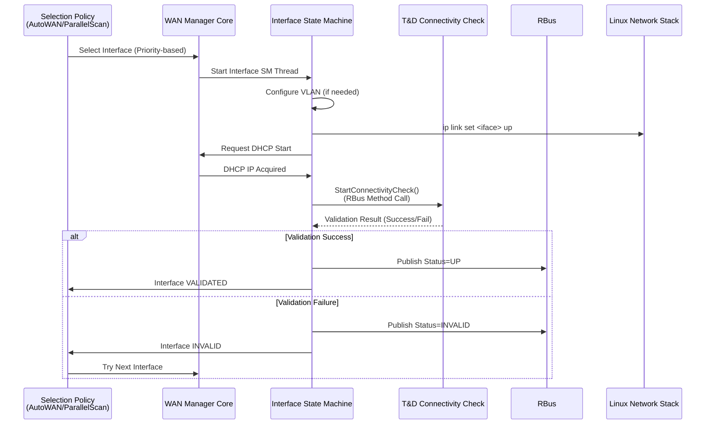
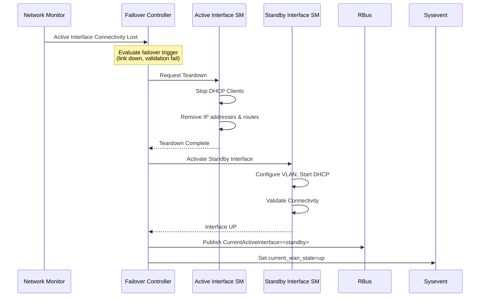
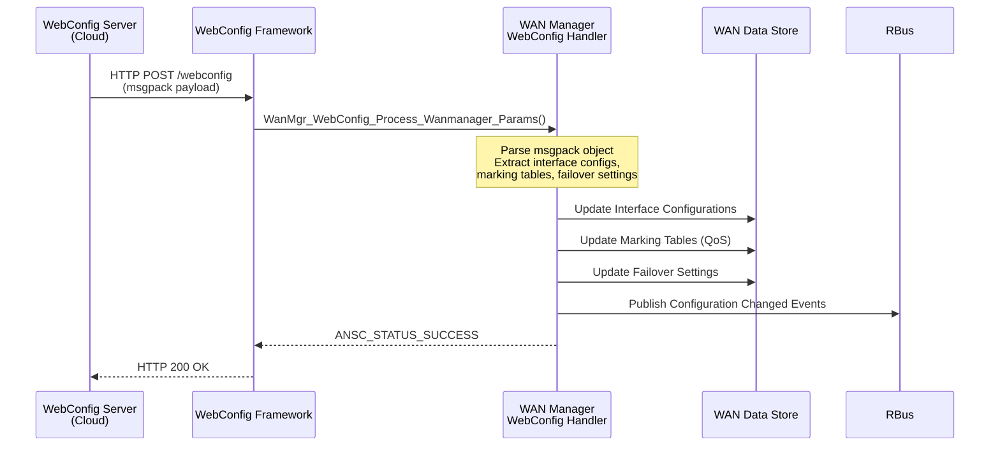

# WAN Manager - Component Interactions and Implementation Details

## Component Interactions

WAN Manager is a critical RDK-B middleware component responsible for managing WAN connectivity, interface selection, failover, and IP layer configuration. It interfaces extensively with other RDK-B components, HAL layers, DHCP services, and platform services to establish and maintain internet connectivity across multiple WAN interfaces (DOCSIS, Ethernet, Cellular, DSL, GPON).

### Interaction Matrix

| Target Component/Layer | Interaction Purpose | Key APIs/Endpoints |
|------------------------|-------------------|------------------|
| **RDK-B Middleware Components** |
| Interface Managers (DOCSIS, Ethernet, Cellular, DSL, GPON) | Receive physical layer status updates, IP mode configuration, VLAN IDs | RBus Events: `Device.X_RDK_WanManager.Interface.{i}.BaseInterfaceStatus`, RBus Subscriptions |
| VLAN Manager | Configure VLAN tagging on WAN interfaces | RBus Method Calls for VLAN creation/deletion |
| DHCP Manager | Start/stop DHCPv4/v6 clients for IP address acquisition | `Device.DHCPv4.Client.{i}.Enable`, `Device.DHCPv6.Client.{i}.Enable` via CCSP D-Bus |
| PPP Manager | Enable/disable PPP interfaces for DSL/Cellular connections | `Device.PPP.Interface.{i}.Enable`, `Device.PPP.Interface.{i}.LowerLayers` via CCSP D-Bus |
| PAM (Protocol and Application Management) | Query IP interface entries for configuration | `Device.IP.Interface.{i}.Name` via CCSP D-Bus |
| TelcoVoice Manager | Update voice service bound interface for VoIP routing | `Device.Services.VoiceService.1.X_RDK_BoundIfName` via CCSP D-Bus |
| T&D Connectivity Check | Trigger connectivity validation for active WAN interfaces | `Device.X_RDK_DNSInternet.StartConnectivityCheck()`, `Device.X_RDK_DNSInternet.StopConnectivityCheck()` via RBus |
| **System & HAL Layers** |
| Sysevent Bus | Publish WAN status events (IPv4/IPv6 up/down, current WAN state, DNS updates) | `ipv4_connection_state`, `ipv6_connection_state`, `current_wan_state`, `wan_start_time` |
| PSM Database | Persist WAN configuration (interface priorities, selected interface, marking tables) | `dmsb.wanmanager.*` parameters |
| Syscfg Storage | Retrieve last WAN mode for upgrade compatibility | `last_wan_mode`, TR-181 DHCPv6 client config keys |
| Linux Network Stack | Direct network configuration (IP addresses, routes, interface up/down) | Shell commands: `ip addr`, `ip route`, `ifconfig`, `brctl` |

**Events Published by WAN Manager:**

| Event Name | Event Topic/Path | Trigger Condition | Subscriber Components |
|------------|-----------------|-------------------|---------------------|
| Interface Physical Status Change | `Device.X_RDK_WanManager.Interface.{i}.BaseInterfaceStatus` | Physical layer up/down from Interface Managers | Selection Policies, Failover Controller |
| Interface WAN Status Change | `Device.X_RDK_WanManager.Interface.{i}.VirtualInterface.{i}.Status` | WAN interface state transitions (DISABLED, VALIDATING, UP, STANDBY) | External monitoring systems, UI components |
| Interface VLAN Link Status | `Device.X_RDK_WanManager.Interface.{i}.VirtualInterface.{i}.VlanStatus` | VLAN link layer up/down | VLAN Manager, Network Monitor |
| IPv4 Address Update | `Device.X_RDK_WanManager.Interface.{i}.VirtualInterface.{i}.IP.IPv4Address` | DHCPv4 lease acquired/renewed | Firewall, Routing services |
| IPv6 Address Update | `Device.X_RDK_WanManager.Interface.{i}.VirtualInterface.{i}.IP.IPv6Address` | DHCPv6/SLAAC address configured | Firewall, Routing services |
| IPv6 Prefix Delegation | `Device.X_RDK_WanManager.Interface.{i}.VirtualInterface.{i}.IP.IPv6Prefix` | DHCPv6 PD received | DHCPv6 Server, LAN configuration |
| Current Active Interface | `Device.X_RDK_WanManager.CurrentActiveInterface` | Active WAN interface selected | UI, Telemetry, External systems |
| Current Standby Interface | `Device.X_RDK_WanManager.CurrentStandbyInterface` | Standby interface designated for failover | Monitoring systems |
| Interface Available Status | `Device.X_RDK_WanManager.InterfaceAvailableStatus` | Summary of all interface availability states | Dashboard, Diagnostics |
| Interface Active Status | `Device.X_RDK_WanManager.InterfaceActiveStatus` | Summary of all interface active states | Dashboard, Diagnostics |
| Initial Scan Complete | `Device.X_RDK_WanManager.InitialScanComplete` | First WAN interface scan completed at bootup | Boot sequencing, Startup scripts |
| Interface IP Status | `Device.X_RDK_WanManager.InterfaceIpStatus` | IP layer status changes (IPv4/IPv6 up/down per interface) | IP stack components |

**Events Subscribed by WAN Manager:**

| Event Name | Event Source | Purpose |
|------------|--------------|---------|
| Device Networking Mode | `Device.X_RDKCENTRAL-COM_DeviceControl.DeviceNetworkingMode` | Detect Gateway/Modem mode changes requiring WAN reconfiguration |
| Remote Device Change | `Device.X_RDK_Remote.DeviceChange` | Remote CPE connection/disconnection for remote WAN interface setup |
| WAN Ready Signal | RBus event subscriptions | Cross-component synchronization for startup sequencing |

### IPC Flow Patterns

**Primary IPC Flow - Interface Status Update from Interface Manager:**

**DHCP Client Lifecycle Flow (IPv4/IPv6):**

**WAN Interface Selection & Validation Flow:**

**Failover Controller Flow - Active to Standby Switchover:**

**WebConfig Provisioning Flow:**

## Implementation Details

### Major Component Modules

WAN Manager does not directly integrate with HAL APIs as it operates at the middleware layer. Instead, it relies on specialized Interface Managers (DOCSIS Manager, Ethernet Manager, Cellular Manager) that interact with their respective HAL layers and report physical status to WAN Manager.

**Core Modules & Responsibilities:**

| Module | Purpose | Implementation Files |
|---------|---------|-------------------|
| **Core Initialization** | Bootstrap WAN Manager, initialize data structures, start message bus | `wanmgr_main.c`, `wanmgr_core.c` |
| **Data Management** | Centralized data store with mutex-protected access for WAN interface configurations | `wanmgr_data.c`, `wanmgr_data.h` |
| **Policy Controller** | Manages Failover Policy (group-level failover logic) | `wanmgr_controller.c`, `wanmgr_wan_failover.c` |
| **Selection Policies** | Interface selection algorithms (AutoWAN, Parallel Scan, Fixed Mode, Primary Priority) | `wanmgr_policy_autowan_impl.c`, `wanmgr_policy_parallel_scan_impl.c`, `wanmgr_policy_auto_impl.c`, `wanmgr_policy_fm_impl.c`, `wanmgr_policy_pp_impl.c` |
| **Interface State Machine** | Per-interface state machine for link/IP layer configuration and teardown | `wanmgr_interface_sm.c`, `wanmgr_interface_sm.h` |
| **DHCP Integration** | DHCPv4/v6 client lifecycle management, event processing | `wanmgr_dhcpv4_apis.c`, `wanmgr_dhcpv6_apis.c`, `wanmgr_dhcp_event_handler.c` |
| **RBus Handler** | RBus data model implementation, event publishing/subscribing | `wanmgr_rbus_handler_apis.c`, `wanmgr_rbus_handler_apis.h` |
| **D-Bus/CCSP Interface** | TR-181 data model implementation, CCSP component integration | `wanmgr_dml_apis.c`, `wanmgr_rdkbus_apis.c` |
| **WebConfig Handler** | Remote configuration via WebConfig (msgpack-based provisioning) | `wanmgr_webconfig.c`, `wanmgr_webconfig_apis.c` |
| **Network Utilities** | Linux network stack interactions (IP config, routing, interface control) | `wanmgr_net_utils.c`, `wanmgr_net_utils.h` |
| **Sysevent Integration** | Publish/subscribe to sysevent bus for legacy component compatibility | `wanmgr_sysevents.c`, `wanmgr_sysevents.h` |
| **Telemetry & Logging** | T2 telemetry marker posting, CcspTrace logging | `wanmgr_t2_telemetry.c`, `wanmgr_telemetry.c` |

### Key Implementation Logic

- **Failover Policy Engine**: 
  - Main implementation in `wanmgr_wan_failover.c`
  - State machine with states: `STATE_FAILOVER_SCANNING_GROUP`, `STATE_FAILOVER_GROUP_ACTIVE`, `STATE_FAILOVER_RESTORATION_WAIT`, `STATE_FAILOVER_DEACTIVATE_GROUP`, `STATE_FAILOVER_IDLE_MONITOR`
  - Runs continuously to monitor active group, trigger failovers between interface groups
  - Supports primary/secondary interface group topology with configurable restoration timers

- **Selection Policy Engines**: 
  - Each policy implemented as a separate state machine running in its own thread
  - **AutoWAN Policy** (`wanmgr_policy_autowan_impl.c`): Sequential scanning of interfaces until one is validated
  - **Parallel Scan Policy** (`wanmgr_policy_parallel_scan_impl.c`): Concurrent scanning of all interfaces, selects based on priority
  - **Fixed Mode** (`wanmgr_policy_fm_impl.c`): Single designated interface, no fallback
  - **Primary Priority** (`wanmgr_policy_pp_impl.c`): Priority-based selection with automatic restoration to higher-priority interfaces
  - State transitions orchestrated via `WanMgr_Policy_Controller_t` structure

- **Interface State Machine Engine**: 
  - Main implementation in `wanmgr_interface_sm.c`
  - Each virtual interface has its own state machine thread
  - States defined by `eWanState_t` enum (conceptual states: VALIDATING, STANDBY, UP, DOWN, TEARINGDOWN)
  - Builds network stack bottom-up: Physical → VLAN → IP (DHCPv4/v6) → Validation → Routing
  - Handles graceful teardown in reverse order
  - Controlled by Selection Policy via shared data structures

- **DHCP Event Processing**: 
  - DHCPv4 events handled via `wanmgr_dhcpv4_internal.c`, `wanmgr_dhcp_event_handler.c`
  - DHCPv6 events handled via `wanmgr_dhcpv6_internal.c`, `wanmgr_dhcp_event_handler.c`
  - Event types: BOUND, RENEW, RELEASE, DECONFIG, REBIND
  - Updates internal IP data structures, triggers RBus events, updates sysevent bus
  - Asynchronous event queue (`ipc_msg.h`) for decoupling DHCP client scripts from state machine

- **Error Handling Strategy**: 
  - State machine timeout mechanisms for each major state (configurable `SelectionTimeOut`)
  - DHCP client retry logic with exponential backoff
  - Connectivity validation failures trigger interface deselection and fallback to next interface
  - Persistent storage (PSM) for recovery after crashes/reboots
  - Telemetry markers for critical error paths (interface validation failures, DHCP timeouts)

- **Logging & Debugging**: 
  - CcspTrace macros with configurable log levels (ERROR, WARNING, INFO, DEBUG)
  - State transition logging for all state machines
  - DHCP client event logging with interface name, IP addresses, DNS servers
  - T2 telemetry markers for performance metrics (WAN uptime, failover counts)

### Key Configuration Files

WAN Manager configuration is distributed across multiple storage mechanisms for different purposes:

| Configuration File | Purpose | Override Mechanisms |
|--------------------|---------|--------------------|
| **PSM Database** (`dmsb.wanmanager.*`) | Persistent storage of TR-181 data model parameters (interface configs, marking tables, priorities) | CCSP Set API calls, WebConfig provisioning |
| **Syscfg** (`last_wan_mode`, `tr_dhcpv6c_*`) | Legacy configuration for upgrade compatibility, DHCPv6 client settings | `syscfg set` commands, factory reset |
| **XML Data Model** (`RdkWanManager.xml`, `RdkWanManager_v2.xml`) | TR-181 object/parameter schema definitions for CCSP framework | N/A |
| **WebConfig Subdoc** | Remote cloud-based provisioning of WAN settings via msgpack format | Cloud-initiated WebConfig HTTP POST |
| **Sysevent Variables** | Runtime state variables shared with other components (current WAN state, DNS servers, IP addresses) | `sysevent set` commands from WAN Manager and other components |

**Key PSM Parameters:**

- `dmsb.wanmanager.enable`: Global WAN Manager enable/disable
- `dmsb.wanmanager.policy`: Active selection policy (AutoWAN, Parallel Scan, etc.)
- `dmsb.wanmanager.iface.{i}.enable`: Per-interface enable state
- `dmsb.wanmanager.iface.{i}.priority`: Interface priority for selection policies
- `dmsb.wanmanager.iface.{i}.group`: Interface group assignment for failover logic
- `dmsb.wanmanager.iface.{i}.virtif.{j}.vlan.id`: VLAN ID for virtual interface
- `dmsb.wanmanager.marking.{i}.ethernetprioritymark`: QoS marking table entries

**Key Sysevent Variables:**

- `current_wan_state`: Overall WAN connectivity state (up/down)
- `ipv4_connection_state`: IPv4 connectivity state
- `ipv6_connection_state`: IPv6 connectivity state
- `wan_start_time`: Timestamp of last WAN interface activation
- `ipv4_wan_ipaddr`: Current active WAN IPv4 address
- `ipv6_wan_ipaddr`: Current active WAN IPv6 address
- `wan-status`: Legacy WAN status indicator

**WebConfig Schema (Msgpack Format):**

- `subdocName`: "wanmanager" or "wanfailover"
- `version`: Configuration schema version
- `transactionId`: Unique transaction identifier for idempotency
- `ifTable`: Array of interface configurations with VLAN and marking settings
- `pWanFailOverData`: Failover-specific settings (AllowRemoteIface, etc.)

### Integration Points

**RBus Integration:**

- Component Name: `Device.X_RDK_WanManager`
- RBus Handle Initialization: `wanmgr_rbus_handler_apis.c::WanMgr_Rbus_Init()`
- Data Elements Registered: All TR-181 WAN Manager parameters
- Event Publishing: `WanMgr_Rbus_EventPublishHandler()` for status change events
- Event Subscriptions: Remote device changes, networking mode changes, WAN ready signals

**CCSP D-Bus Integration:**

- Component Name: `eRT.com.cisco.spvtg.ccsp.wanmanager`
- D-Bus Path: `/com/cisco/spvtg/ccsp/wanmanager`
- Message Bus Initialization: `wanmgr_ssp_messagebus_interface.c`
- TR-181 API Handlers: `wanmgr_dml_apis.c` (GetParamValue, SetParamValue, Commit, Rollback)
- External Component Calls: PAM (IP interface queries), PPP Manager, DHCP Manager, Voice Manager

**Linux Network Stack Integration:**

- Direct shell command execution via `v_secure_system()` wrapper
- IP address configuration: `ip addr add/del`
- Routing table management: `ip route add/del`
- Interface control: `ip link set up/down`
- Bridge operations: `brctl addif/delif` (legacy), `ip link set master`
- VLAN interface creation: `ip link add link <base> name <vlan> type vlan id <vid>`

**Threading Model:**

- Main thread: Message bus event loop, initialization
- Failover Controller: Dedicated pthread for failover policy state machine
- Selection Policies: N threads (one per interface group) running selection policy state machines
- Interface State Machines: M threads (one per virtual interface) managing interface lifecycle
- DHCP Event Processing: Asynchronous via IPC message queue
- Thread synchronization: Mutex-protected data access via `WanMgr_GetIfaceData_locked()` / `WanMgrDml_GetIfaceData_release()` pattern
