# WAN Manager - Introduction

## Overview

The **WAN Manager** is a middleware component in the RDK-B (Reference Design Kit for Broadband) stack responsible for orchestrating Wide Area Network (WAN) connectivity across diverse physical interfaces. It manages WAN interface selection, configuration, failover, and Internet connectivity validation for RDK-B powered devices.

As a middleware orchestrator, WAN Manager abstracts the complexity of multiple WAN technologies (DOCSIS, Ethernet, DSL, Cellular, Fiber) and provides a unified framework for interface management. It coordinates with various RDK-B components including Interface Managers (DOCSIS Manager, Ethernet Manager, Cellular Manager), DHCP Manager, VLAN Manager, and Platform HAL to establish and maintain Internet connectivity through policy-based selection and automatic failover mechanisms.

The component operates as a standalone process (`wanmanager`) in the RDK-B middleware layer, written primarily in C, and integrates deeply with the Linux networking stack. It implements state machines for interface lifecycle management, supports multiple selection policies (AutoWAN, Parallel Scan, Fixed Mode, Primary Priority), and provides robust failover capabilities across interface groups. Through TR-181 data model exposure and RBUS/WebConfig support, WAN Manager enables both local and remote configuration and monitoring of WAN connectivity.

## System Context

The following C4 System Context diagram illustrates WAN Manager's position within the RDK-B ecosystem and its interactions with external systems, users, and other RDK-B components:

```mermaid
graph TD
    subgraph External ["External Systems"]
        RemoteMgmt["Remote Management Server
        (ACS/WebPA)"]
        ISP["Internet Service Provider
        (WAN Network)"]
        DNS["DNS Servers"]
    end

    subgraph Users ["System Users"]
        LocalWebUI["Local Web UI"]
        CLI["CLI Tools"]
    end

    WanManager["WAN Manager
    (RdkWanManager)
    C Process"]

    subgraph RdkbComponents ["RDK-B Middleware Components"]
        CcspCR["CCSP Component Registry
        (CR)"]
        PAM["Platform & Application Manager
        (PAM)"]
        VlanMgr["VLAN Manager"]
        DhcpMgr["DHCP Manager"]
        
        subgraph InterfaceMgrs ["Interface Managers"]
            DocsisIfMgr["DOCSIS Interface Manager"]
            EthIfMgr["Ethernet Interface Manager"]
            CellIfMgr["Cellular Interface Manager"]
            DslIfMgr["DSL Interface Manager"]
        end
    end

    subgraph HAL ["Hardware Abstraction Layer"]
        PlatformHAL["Platform HAL"]
        NetHAL["Network HAL"]
    end

    subgraph Platform ["Platform Services"]
        Sysevent["Sysevent"]
        PSM["Persistent Storage Manager
        (PSM)"]
        Linux["Linux Networking Stack
        (ip, route, netlink)"]
    end

    %% External connections
    RemoteMgmt -->|"WebConfig/RBUS
    (Configuration)"| WanManager
    LocalWebUI -->|"TR-181 DML
    (HTTP/SNMP)"| WanManager
    CLI -->|"dmcli/RBUS
    (Commands)"| WanManager
    WanManager -->|"Internet Validation
    (HTTP/ICMP)"| ISP
    WanManager -->|"DNS Resolution
    (DNS queries)"| DNS

    %% RDK-B Component interactions
    WanManager <-->|"RBUS/DBUS
    (Status/Events)"| CcspCR
    WanManager <-->|"RBUS
    (IP Interface Info)"| PAM
    WanManager -->|"RBUS/IPC
    (VLAN Config)"| VlanMgr
    WanManager -->|"RBUS
    (DHCP Control)"| DhcpMgr
    
    DocsisIfMgr -->|"RBUS
    (PHY Status/Config)"| WanManager
    EthIfMgr -->|"RBUS
    (PHY Status/Config)"| WanManager
    CellIfMgr -->|"RBUS
    (PHY Status/Config)"| WanManager
    DslIfMgr -->|"RBUS
    (PHY Status/Config)"| WanManager

    %% HAL interactions
    WanManager -->|"HAL APIs
    (Platform Config)"| PlatformHAL
    WanManager -->|"HAL APIs
    (Network Config)"| NetHAL

    %% Platform interactions
    WanManager <-->|"Sysevent IPC
    (Events/State)"| Sysevent
    WanManager <-->|"DBUS
    (Persistent Config)"| PSM
    WanManager -->|"Netlink/System Calls
    (IP/Route Config)"| Linux

    classDef user fill:#fff3e0,stroke:#ef6c00,stroke-width:2px;
    classDef external fill:#e8f5e9,stroke:#2e7d32,stroke-width:2px;
    classDef component fill:#e3f2fd,stroke:#1565c0,stroke-width:3px;
    classDef rdkb fill:#f3e5f5,stroke:#7b1fa2,stroke-width:2px;
    classDef hal fill:#fce4ec,stroke:#c2185b,stroke-width:2px;
    classDef platform fill:#fff9c4,stroke:#f57f17,stroke-width:2px;

    class LocalWebUI,CLI user;
    class RemoteMgmt,ISP,DNS external;
    class WanManager component;
    class CcspCR,PAM,VlanMgr,DhcpMgr,DocsisIfMgr,EthIfMgr,CellIfMgr,DslIfMgr rdkb;
    class PlatformHAL,NetHAL hal;
    class Sysevent,PSM,Linux platform;
```

**Diagram Legend:**
- **Users** (Orange): Human or automated actors that interact with WAN Manager for configuration and monitoring
- **External Systems** (Green): External network services and management systems
- **WAN Manager** (Blue - Bold): The core component being documented
- **RDK-B Components** (Purple): Other middleware components in the RDK-B stack
- **HAL Layer** (Pink): Hardware abstraction interfaces
- **Platform Services** (Yellow): OS-level and system services

## Key Features & Responsibilities

- **Multi-Interface WAN Orchestration**: Manages multiple WAN interfaces (DOCSIS, Ethernet, DSL, Cellular, Fiber) simultaneously, coordinating their lifecycle from physical layer bring-up to IP layer configuration. Provides a unified abstraction layer that hides the complexity of heterogeneous WAN technologies from upper layers.

- **Selection Policies**: Implements multiple selection algorithms including AutoWAN (sequential interface testing), Parallel Scan (concurrent validation), Fixed Mode (static interface assignment), Primary Priority (priority-based selection with bootup variants), and Multi-WAN mode. Each policy provides different trade-offs between connection time, reliability, and resource utilization.

- **Automatic Failover & Restoration**: Executes group-based failover policies that monitor active WAN interfaces and automatically switch to backup interfaces upon detecting connectivity failures. Supports configurable restoration delays to return to higher-priority interfaces when they become available, ensuring optimal WAN utilization.

- **Interface State Machine Management**: Runs independent state machines for each virtual WAN interface, handling transitions through states including PHY configuration, VLAN setup, PPP negotiation, IP address acquisition (DHCPv4/DHCPv6), validation, standby, active, and teardown. Ensures proper sequencing of layer configurations and clean error recovery.

- **DHCP Client Management**: Orchestrates DHCPv4 and DHCPv6 client operations for WAN interfaces, managing lease acquisition, renewal, release, and event handling. Supports advanced features including DHCP option processing, static IP configuration, dual-stack operation, and integration with router advertisement (RA) for IPv6.

- **Internet Connectivity Validation**: Performs active validation of WAN connectivity through configurable health checks (HTTP queries, ICMP pings, DNS resolution) to external validation servers. Distinguishes between link-layer up and actual Internet reachability, preventing selection of non-functional interfaces.

- **VLAN & PPP Configuration**: Manages link-layer protocols including VLAN tagging (802.1Q) for multi-service WAN access and PPPoE session establishment for DSL and Fiber connections. Coordinates with VLAN Manager for VLAN interface creation and handles PPP authentication and session lifecycle.

- **Network Route Management**: Configures Linux kernel routing tables including default gateway installation, static route management, policy-based routing for multi-WAN scenarios, and source-based routing rules. Monitors route changes via Netlink to detect and respond to network topology changes.

- **TR-181 Data Model Implementation**: Exposes WAN configuration and status through the TR-181 Device.X_RDK_WanManager data model tree. Provides standardized access to WAN interface parameters, operational status, statistics, and policy configuration for remote management systems and local configuration tools.

- **RBUS Integration**: Utilizes RBUS (RDK Message Bus) for efficient inter-process communication with Interface Managers, DHCP Manager, VLAN Manager, and other RDK-B components. Publishes events for WAN state changes, subscribes to physical layer status updates, and handles method invocations for WAN operations.

- **WebConfig Support**: Integrates with RDK WebConfig framework to enable remote configuration via cloud-based management systems. Processes msgpack-encoded configuration blobs for bulk WAN settings updates including interface parameters, marking tables, and failover policies.

- **Platform Event Handling**: Responds to platform-level events including system boot, network interface hotplug, cable modem registration, cellular connection events, and system configuration changes. Coordinates WAN initialization timing to ensure proper dependency ordering during system startup.

- **Telemetry & Diagnostics**: Generates telemetry events for failover transitions, restoration operations, connection timing metrics, and error conditions. Supports Telemetry 2.0 framework for detailed operational analytics and troubleshooting support including state machine traces and policy decision logging.

- **Quality of Service Integration**: Manages QoS marking tables for WAN traffic classification and priority assignment. Coordinates with downstream QoS components to ensure proper traffic shaping and prioritization based on WAN interface capabilities and service provider requirements.

---

**Technology Stack**: C (C99), RBUS/DBUS IPC, Netlink sockets, Linux networking utilities (ip, iptables), TR-181 data model, WebConfig framework, Sysevent messaging

**Runtime Environment**: RDK-B middleware process running on Linux-based broadband gateway devices (cable modems, routers, residential gateways)

**Version**: 1.5+
