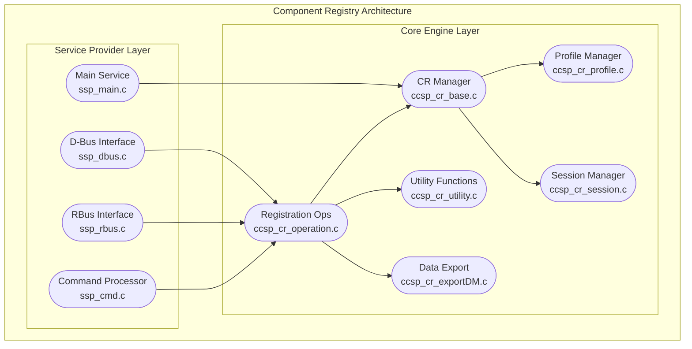

# Component Registry (CR) Documentation

The Component Registry (CR) serves as the central service discovery and component management system in the RDK-B middleware architecture. It maintains a comprehensive registry of all CCSP (Common Component Software Platform) components, their capabilities, supported namespaces, and provides dynamic service discovery mechanisms to enable inter-component communication and coordination across the RDK-B ecosystem.

The CR acts as the foundational infrastructure service that enables the distributed component architecture of RDK-B, allowing components to register their capabilities, discover other components, and establish communication paths. It manages component lifecycle events, maintains namespace ownership, and provides the essential coordination layer that allows the modular RDK-B middleware to function as a cohesive system while supporting both traditional D-Bus and modern RBus communication protocols.

The Component Registry is positioned as a core infrastructure component that interfaces directly with all other RDK-B middleware components, external management systems, and the underlying platform services. It operates as the authoritative source for component topology and capabilities within the RDK-B stack.

**Key Features & Responsibilities**: 

- **Component Registration & Discovery**: Maintains a centralized registry of all CCSP components, their capabilities, supported namespaces, and enables dynamic service discovery across the RDK-B middleware stack
- **Namespace Management**: Provides authoritative namespace ownership and resolution services, ensuring proper data model hierarchy and preventing namespace conflicts between components 
- **Inter-Component Communication Facilitation**: Acts as the broker for component-to-component communication by providing discovery services and maintaining communication pathways for both D-Bus and RBus protocols
- **Device Profile Management**: Loads and manages device-specific component profiles that define which components should be available on different hardware platforms and configurations
- **Component Lifecycle Tracking**: Monitors component health, availability, and lifecycle events including registration, deregistration, and failure recovery scenarios
- **Data Model Export**: Supports export of complete data model information in industry-standard formats for integration with external management systems and compliance validation

## Design

The Component Registry is architected as a centralized service discovery and component coordination system that follows the CCSP architectural principles. The design emphasizes modularity, protocol flexibility, and robust component lifecycle management to support the distributed nature of RDK-B middleware.

The core design principle centers around maintaining a single source of truth for component capabilities and namespace ownership while supporting multiple communication protocols (D-Bus and RBus). The CR operates as a stateful service that persists component registration information and provides both synchronous discovery services and asynchronous event notification capabilities.

The design integrates multiple IPC mechanisms to support both legacy D-Bus-based components and modern RBus-enabled components, ensuring backward compatibility while enabling migration to newer communication technologies. The component registry maintains persistent storage integration for configuration and state management through system configuration services and supports dynamic reconfiguration without service disruption.

The architecture includes comprehensive error handling and recovery mechanisms, with built-in health monitoring and component failure detection. The design supports horizontal scaling through multiple CR instances in complex deployments while maintaining consistency through coordinated namespace management.

Data persistence is achieved through integration with the Linux system configuration framework (syscfg) and XML-based device profile storage. The CR maintains transient runtime state in memory for performance while persisting critical configuration and registration data through the platform's configuration management services.

### Prerequisites and Dependencies

**Build-Time Flags and Configuration:**

| Configure Option | DISTRO Feature | Build Flag | Purpose | Default |
|------------------|----------------|------------|---------|---------|
| `--enable-notify` | `systemd` | `ENABLE_SD_NOTIFY` | Enable systemd service notification support for process lifecycle management | Disabled |
| `--enable-gtestapp` | N/A | `GTEST_ENABLE` | Enable Google Test framework support for unit testing and validation | Disabled |
| `--with-rbus-build=integrated` | N/A | `RBUS_BUILD_INTEGRATED` | Enable integrated RBus and D-Bus communication support | Integrated |
| `--with-rbus-build=only` | N/A | `RBUS_BUILD_ONLY` | Enable RBus-only communication without D-Bus legacy support | Disabled |
| `--with-rbus-build=none` | N/A | `RBUS_BUILD_NONE` | Disable RBus communication, D-Bus only mode | Disabled |

**RDK-B Platform and Integration Requirements (MUST):**

- **RDK-B Components**: None (CR is foundational - other components depend on it)
- **HAL Dependencies**: None (CR operates at middleware layer)
- **Systemd Services**: Basic system services must be active before CR starts (`dbus.service` for D-Bus support)
- **Message Bus**: RBus daemon (`rbusd`) for RBus builds, D-Bus system daemon for D-Bus builds
- **Configuration Files**: Device profile XML files in `/etc/` or component config directories (`cr-deviceprofile_embedded.xml`, `cr-ethwan-deviceprofile.xml`)
- **Startup Order**: CR must start early in RDK-B boot sequence before other CCSP components

**Threading Model** 

The Component Registry implements a single-threaded event-driven architecture with synchronous request processing to ensure data consistency and avoid race conditions in component registration state management.

- **Threading Architecture**: Single-threaded with event-driven message processing
- **Main Thread**: Handles all IPC requests, component registration/discovery operations, profile loading, and session management
- **Event Processing**: Synchronous processing of D-Bus and RBus method calls with no worker thread pool
- **Synchronization**: Not applicable - single-threaded design eliminates need for synchronization primitives

### Component State Flow

**Initialization to Active State**

The Component Registry follows a structured initialization sequence that establishes the service infrastructure, loads device profiles, and prepares for component registration requests. The initialization process is critical as other RDK-B components depend on CR availability for their own startup sequence.

**Runtime State Changes and Context Switching**

The Component Registry maintains minimal runtime state changes during normal operation. The primary state transitions occur during component registration/deregistration cycles and system configuration updates.

**State Change Triggers:**

- Component registration requests trigger addition to internal component registry
- Component deregistration or failure detection triggers cleanup of component records
- Device profile updates or system reconfiguration may trigger profile reloading
- System shutdown requests trigger graceful component notification and cleanup

**Context Switching Scenarios:**

- Profile reloading during runtime configuration updates
- Failover handling when components become unavailable or unresponsive
- Migration between D-Bus and RBus communication modes based on component capabilities

### Call Flow

**Initialization Call Flow:**

**Request Processing Call Flow:**

## Internal Modules

The Component Registry is structured into two primary layers: the Service Provider layer (CrSsp) that handles external interfaces and communication protocols, and the Core Engine layer (CCSP_CR) that implements the component registry logic and operations.

| Module/Class | Description | Key Files |
|-------------|------------|-----------|
| **Service Provider Layer (CrSsp)** |
| Main Service | Primary service entry point, initialization, and lifecycle management | `ssp_main.c`, `ssp_global.h` |
| D-Bus Interface | Legacy D-Bus IPC interface for component communication | `ssp_dbus.c` |
| RBus Interface | Modern RBus IPC interface for next-generation component communication | `ssp_rbus.c` |
| Command Processor | Command-line interface and administrative operations | `ssp_cmd.c` |
| **Core Engine Layer (CCSP_CR)** |
| CR Manager | Core component registry management and coordination | `ccsp_cr_base.c` |
| Registration Operations | Component registration, discovery, and namespace management | `ccsp_cr_operation.c` |
| Profile Manager | Device profile loading, parsing, and component configuration management | `ccsp_cr_profile.c` |
| Session Manager | Component session tracking and lifecycle management | `ccsp_cr_session.c` |
| Utility Functions | Common utility functions and helper operations | `ccsp_cr_utility.c` |
| Data Model Export | Export functionality for data model information | `ccsp_cr_exportDM.c` |

## Component Interactions

The Component Registry serves as the central hub for all inter-component communication within the RDK-B middleware, providing registration and discovery services that enable the distributed component architecture to function cohesively.

### Interaction Matrix

| Target Component/Layer | Interaction Purpose | Key APIs/Endpoints |
|------------------------|-------------------|------------------|
| **RDK-B Middleware Components** |
| Parameter Storage Manager | Component registration, namespace discovery, configuration management | `registerCapabilities()`, `discoverComponentSupportingNamespace()` |
| Protocol & Application Manager | Service discovery, component health monitoring, namespace resolution | `getRegisteredComponents()`, `getNamespaceByComponent()` |
| Cable Modem Agent | Component registration, DOCSIS namespace management | `registerCapabilities()`, `checkNamespaceDataType()` |
| WiFi Agent | Wireless namespace registration, component discovery for WiFi operations | `registerCapabilities()`, `discoverComponentSupportingNamespace()` |
| TR-069 Protocol Agent | Legacy D-Bus component registration, parameter namespace discovery | `CcspCrRegisterCapabilities()`, `CcspCrDiscoverComponentSupportingNamespace()` |
| MTA Agent | VoIP component registration, telephony namespace management | `registerCapabilities()`, `unregisterComponent()` |
| **System & Platform Services** |
| System Configuration (syscfg) | Persistent configuration storage, CR settings management | Configuration file I/O, `syscfg_get()`, `syscfg_set()` |
| Device Profile XMLs | Device-specific component configuration, supported namespace definitions | XML parsing, profile validation |
| SystemD Services | Service lifecycle management, dependency coordination | Service registration, health monitoring |

**Events Published by Component Registry:**

| Event Name | Event Topic/Path | Trigger Condition | Subscriber Components |
|------------|-----------------|-------------------|---------------------|
| ComponentRegistered | `Device.ComponentRegistry.ComponentRegistered` | New component successful registration | All middleware components, management systems |
| ComponentDeregistered | `Device.ComponentRegistry.ComponentDeregistered` | Component deregistration or failure detection | All middleware components, management systems |
| NamespaceOwnershipChanged | `Device.ComponentRegistry.NamespaceChanged` | Namespace ownership transfer or modification | Components with namespace dependencies |
| ProfileReloaded | `Device.ComponentRegistry.ProfileReloaded` | Device profile update or reload completion | All registered components |

### IPC Flow Patterns

**Primary IPC Flow - Component Registration:**

**Event Notification Flow:**

## Implementation Details

### Major HAL APIs Integration

The Component Registry operates primarily at the middleware layer and does not directly integrate with HAL APIs. Instead, it relies on system-level APIs for configuration management and IPC communication.

**Core System APIs:**

| System API | Purpose | Implementation File |
|---------|---------|-------------------|
| `syscfg_get/set` | System configuration persistence and retrieval | `ssp_main.c` |
| `libxml2 APIs` | Device profile XML parsing and validation | `ccsp_cr_profile.c` |
| `D-Bus APIs` | Legacy inter-process communication interface | `ssp_dbus.c` |
| `RBus APIs` | Modern message bus communication interface | `ssp_rbus.c` |

### Key Implementation Logic

- **Component Registry Engine**: The core registry management is implemented in `ccsp_cr_base.c` with the main data structures and registry operations in `ccsp_cr_operation.c`. The registry maintains an in-memory component table with namespace mappings and component capability information.
     - Main registry implementation in `ccsp_cr_base.c` (CcspCreateCR, CcspFreeCR functions)
     - Component registration and discovery logic in `ccsp_cr_operation.c` (CcspCrRegisterCapabilities, CcspCrDiscoverComponentSupportingNamespace)
  
- **IPC Protocol Handling**: Dual IPC support is implemented through separate interface modules that provide the same registry operations through different communication mechanisms.
     - D-Bus interface implementation for legacy component support
     - RBus interface implementation for modern message bus communication
     - Protocol selection based on build configuration and runtime detection

- **Error Handling Strategy**: Comprehensive error handling with logging, component failure detection, and graceful degradation when components become unavailable.
     - Component health monitoring and timeout handling
     - Registry cleanup on component failures  
     - Retry mechanisms for transient communication errors

- **Logging & Debugging**: Extensive logging support with configurable verbosity levels and component-specific debugging capabilities.
     - Component registration and discovery event logging
     - IPC communication tracing for troubleshooting
     - Debug hooks for runtime registry inspection

### Key Configuration Files

| Configuration File | Purpose | Override Mechanisms |
|--------------------|---------|--------------------|
| `cr-deviceprofile_embedded.xml` | Embedded device component configuration | Environment-specific profile selection |
| `cr-deviceprofile_pc.xml` | PC/desktop development configuration | Build-time profile selection |
| `cr-deviceprofile.xml` | Default device profile configuration | Runtime profile path configuration |
| `cr-ethwan-deviceprofile.xml` | Ethernet WAN specific device configuration | Platform-specific profile loading |
| `/etc/debug.ini` | Debug and logging configuration | Runtime debug level modification |
