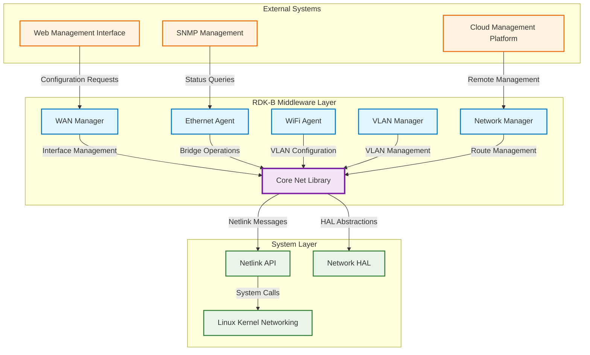
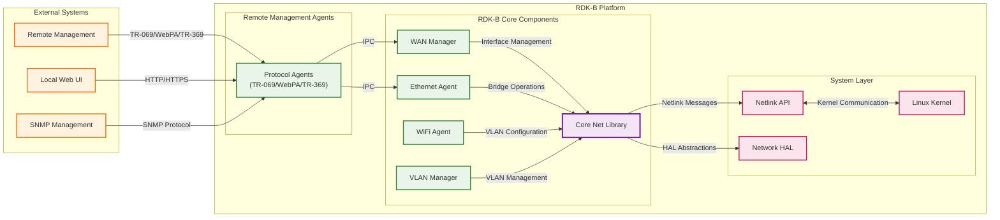
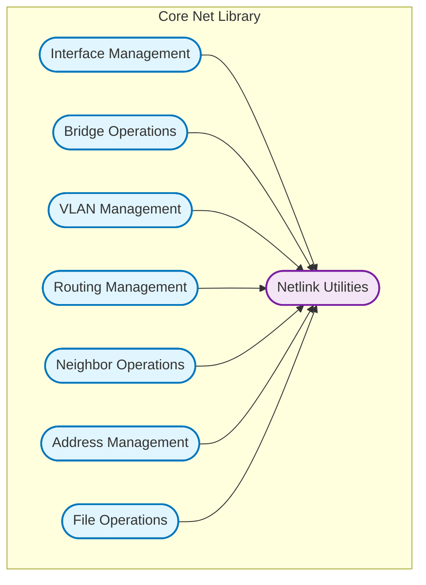
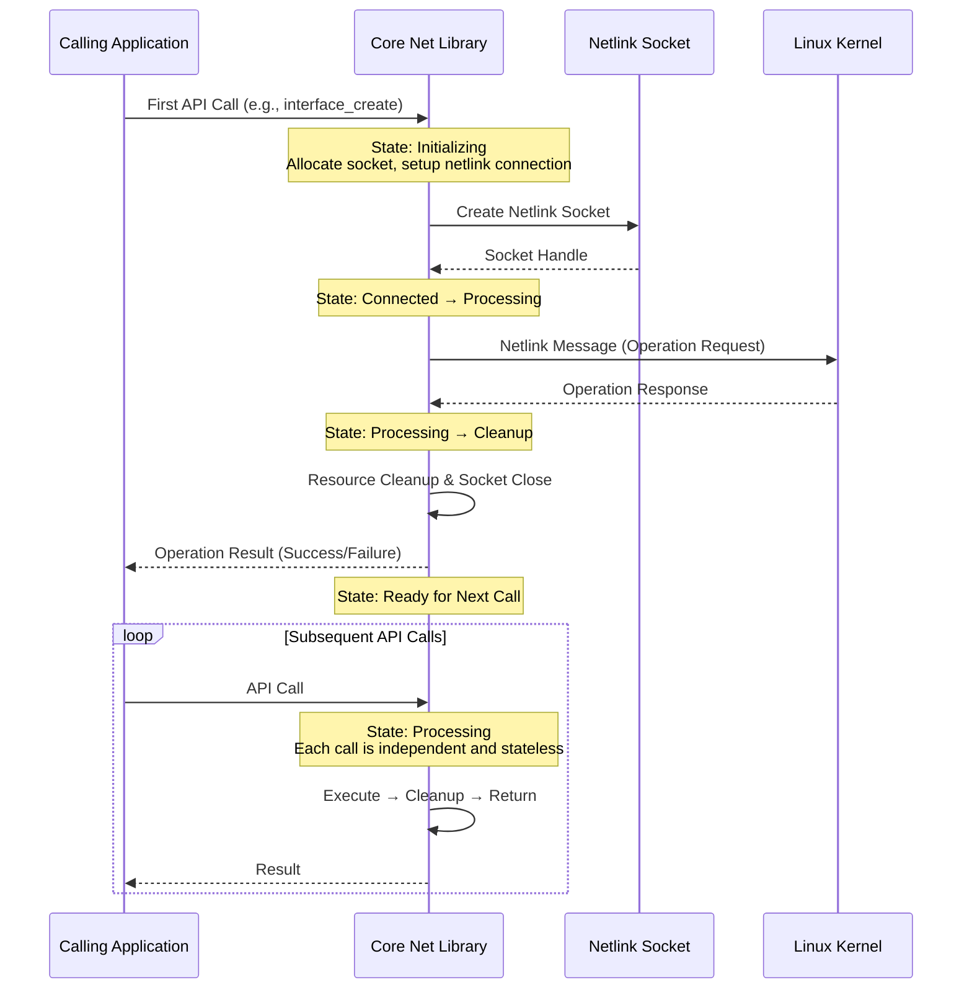
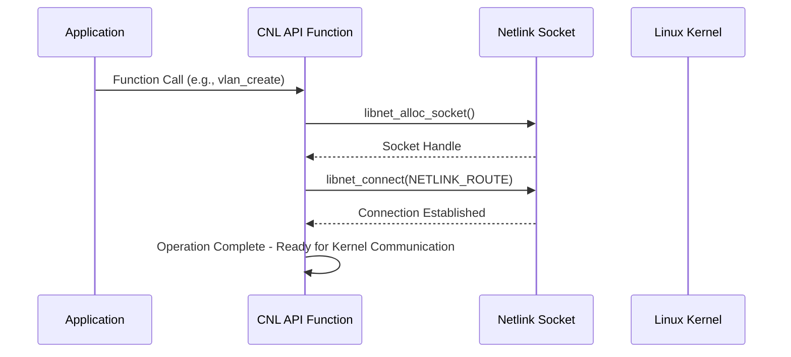
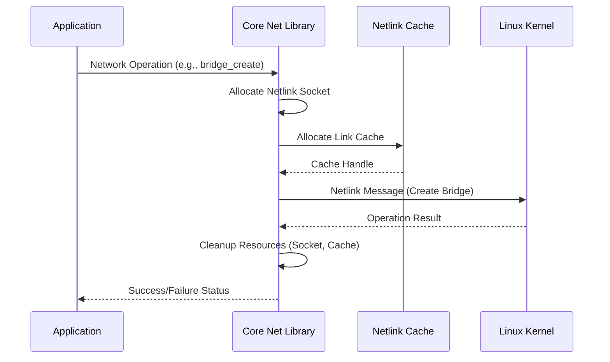
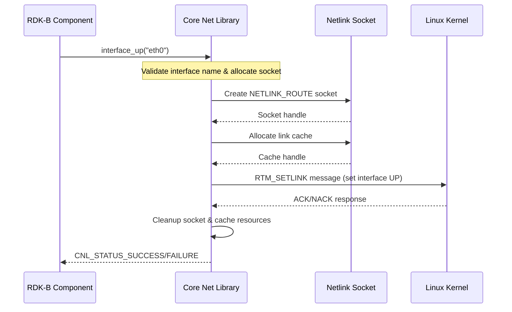
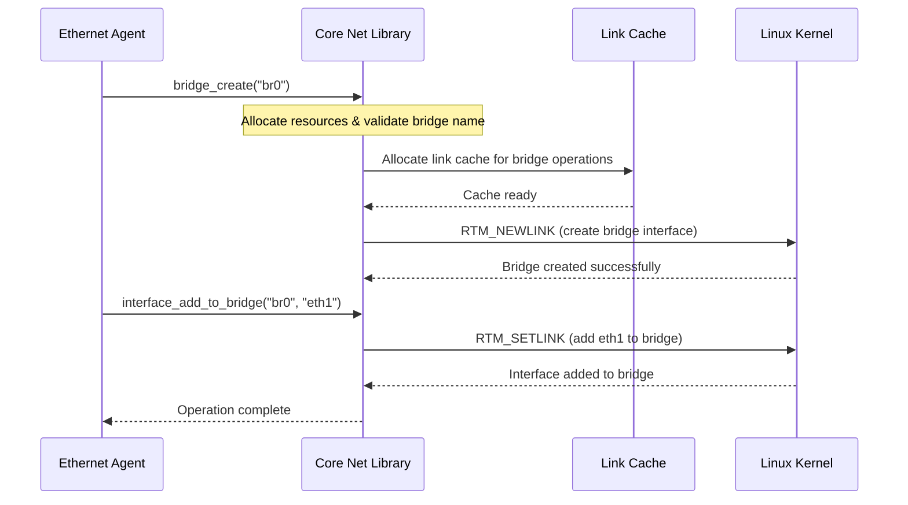

# Core Net Library Documentation

The Core Net Library (CNL) is a fundamental networking utility library in the RDK-B middleware that provides a comprehensive C API for network interface management, bridge operations, VLAN configuration, and routing table manipulation. This component serves as a critical abstraction layer between RDK-B middleware components and the underlying Linux networking subsystem, utilizing netlink sockets for kernel communication and providing a simplified, safe API for complex networking operations.

This library enables RDK-B components to perform network configuration tasks without directly interfacing with low-level kernel APIs. It provides services essential for device networking functionality including interface state management, bridge creation and configuration, VLAN management, route table manipulation, and neighbor table operations. The component is designed to be thread-safe and provides error handling mechanisms that allow calling components to gracefully handle networking failures.

At the module level, the Core Net Library provides standardized APIs for network interface lifecycle management (create, configure, delete), bridge networking capabilities for creating software bridges and managing bridge ports, VLAN tagging and untagging functionality, routing table management for both IPv4 and IPv6, and neighbor table operations for ARP/NDP management.

**Key Features & Responsibilities**: 

- **Network Interface Management**: Comprehensive APIs for creating, configuring, and managing network interfaces including setting IP addresses, MAC addresses, MTU, and interface state (UP/DOWN)
- **Bridge Networking Operations**: Full support for Linux bridge creation, deletion, STP configuration, and dynamic addition/removal of bridge ports for software-defined networking
- **VLAN Management**: Complete VLAN tagging and untagging capabilities including VLAN interface creation, deletion, and configuration with support for 802.1Q standards
- **Routing Table Management**: Advanced routing operations including route addition/deletion, policy routing, rule management, and tunnel configuration for both IPv4 and IPv6
- **Neighbor Table Operations**: ARP and NDP table management including neighbor entry creation, deletion, and neighbor discovery operations for network connectivity validation
- **File-based Configuration**: Secure file I/O operations for reading and writing kernel parameters and network configuration files with proper error handling and validation

## Design

The Core Net Library follows a layered architecture design that abstracts the complexity of Linux networking APIs while providing a safe, reliable interface for network operations. The design is built around the principle of providing a single, unified API that encapsulates various networking subsystems including interface management, bridging, VLANs, and routing. The component uses the netlink socket interface extensively to communicate with the Linux kernel's networking subsystem, ensuring efficient and direct kernel communication without requiring external utilities.

The design emphasizes thread safety through careful resource management and proper socket handling. Each major operation follows a consistent pattern of socket allocation, connection establishment, operation execution, and resource cleanup. Error handling is comprehensive, with detailed logging and status codes that allow calling components to make informed decisions about failure recovery. The component abstracts away the complexity of netlink message construction and parsing, providing simple function calls that hide the underlying kernel communication protocols.

The northbound interface provides clean C APIs that can be easily consumed by other RDK-B middleware components, while the southbound interface efficiently utilizes netlink sockets for kernel communication. The IPC mechanism is primarily based on function calls within the same process space, as this is a library component rather than a standalone service. Data persistence is handled by the calling components, though the library provides utilities for reading and writing configuration files when needed.

```mermaid
flowchart TB
    subgraph CoreNetLibContainer ["Core Net Library (C Library)"]
        subgraph NetworkAPIs ["Network Management APIs"]
            InterfaceMgmt([Interface Management<br/>Create, Configure, IP/MAC, MTU])
            BridgeMgmt([Bridge Operations<br/>Creation, STP, Port Management])
            VlanMgmt([VLAN Management<br/>802.1Q Tagging/Untagging])
        end
        
        subgraph RoutingAPIs ["Routing & Connectivity APIs"]
            RoutingMgmt([Routing Management<br/>Tables, Policies, Tunnels])
            NeighborMgmt([Neighbor Operations<br/>ARP/NDP Management])
        end
        
        subgraph UtilityAPIs ["Core Utility APIs"]
            FileOps([File Operations<br/>Kernel Parameters, Config Files])
            NetlinkUtils([Netlink Utilities<br/>Socket Management, Error Handling])
        end
    end

    subgraph KernelLayer ["Linux Kernel Networking"]
        NetlinkInterface[Netlink Socket Interface]
        NetworkStack[Kernel Network Stack]
    end

    %% API to Kernel connections
    InterfaceMgmt -->|Interface Config| NetlinkInterface
    BridgeMgmt -->|Bridge Ops| NetlinkInterface
    VlanMgmt -->|VLAN Config| NetlinkInterface
    RoutingMgmt -->|Route Mgmt| NetlinkInterface
    NeighborMgmt -->|Neighbor Ops| NetlinkInterface
    FileOps -->|File I/O| NetworkStack
    NetlinkUtils -->|Socket Mgmt| NetlinkInterface

    classDef networkApi fill:#e3f2fd,stroke:#1976d2,stroke-width:2px;
    classDef routingApi fill:#f3e5f5,stroke:#7b1fa2,stroke-width:2px;
    classDef utilityApi fill:#e8f5e8,stroke:#2e7d32,stroke-width:2px;
    classDef kernel fill:#fff3e0,stroke:#ef6c00,stroke-width:2px;
    
    class InterfaceMgmt,BridgeMgmt,VlanMgmt networkApi;
    class RoutingMgmt,NeighborMgmt routingApi;
    class FileOps,NetlinkUtils utilityApi;
    class NetlinkInterface,NetworkStack kernel;
```

### Prerequisites and Dependencies

**Build-Time Flags and Configuration:**

| Configure Option | DISTRO Feature | Build Flag | Purpose | Default |
|------------------|----------------|------------|---------|---------|
| `--enable-gtestapp` | N/A | `GTEST_ENABLE`, `WITH_GTEST_SUPPORT` | Enable Google Test support for unit testing framework | Disabled |
| N/A | `safec` | `SAFEC_DUMMY_API` (when disabled) | Enable secure C library integration for memory safety | Enabled if DISTRO supports |

 

**RDK-B Platform and Integration Requirements**

- **RDK-B Components**: No mandatory RDK-B middleware component dependencies as this is a foundational library consumed by other components
- **HAL Dependencies**: Standard Linux networking interfaces - no specific HAL requirements as the library operates directly with kernel APIs
- **Systemd Services**: No specific systemd service dependencies - library is loaded as needed by consuming components
- **Message Bus**: No RBus registration requirements - operates as a static/shared library within calling process
- **Configuration Files**: No mandatory configuration files - operates using runtime parameters passed through API calls
- **Startup Order**: Must be available during system initialization as networking components depend on this library for basic operations

**Threading Model** 

The Core Net Library implements a thread-safe library design where each API call is atomic and self-contained. The component does not create or manage its own threads, but rather provides thread-safe functions that can be called from any thread context within consuming applications.

- **Threading Architecture**: Single-threaded library with thread-safe API design - no internal threading model
- **Main Thread**: All operations execute in the context of the calling thread with proper resource isolation and cleanup
- **Synchronization**: Thread safety is achieved through stateless design and proper resource management - each function call manages its own netlink socket and resources independently

### Component State Flow

**Initialization to Active State**

The Core Net Library has no explicit initialization or active state management since it operates as a stateless library. Each API function handles its own initialization, operation, and cleanup cycle. The library becomes "active" when first called and remains available throughout the process lifetime.

**Runtime State Changes and Context Switching**

The Core Net Library maintains no persistent runtime state. Each function call creates its own execution context, performs the requested operation, and cleans up all resources before returning. This stateless design ensures that there are no context switches or state management complexities.

**State Change Triggers:**

- Function entry triggers resource allocation and socket creation
- Netlink operation completion triggers resource cleanup
- Function exit ensures complete resource deallocation

**Context Switching Scenarios:**

- No context switching occurs as each API call is independent and atomic
- Error conditions trigger immediate cleanup and return without affecting subsequent calls

### Call Flow

**Initialization Call Flow:**

**Request Processing Call Flow:**

## Internal Modules

The Core Net Library is organized into specialized modules that handle different aspects of network configuration and management. Each module provides a focused set of APIs for specific networking functionality while sharing common utility functions for netlink communication and resource management.

| Module/Class | Description | Key Files |
|-------------|------------|-----------|
| **Interface Management** | Handles network interface operations including creation, configuration, IP address management, MAC address setting, MTU configuration, and interface state control (UP/DOWN) | `libnet.c` (interface_* functions), `libnet.h` |
| **Bridge Operations** | Manages Linux bridge functionality including bridge creation/deletion, STP configuration, bridge port addition/removal, and bridge information retrieval | `libnet.c` (bridge_* functions), `libnet.h` |
| **VLAN Management** | Provides VLAN tagging and untagging capabilities with support for 802.1Q VLAN creation, deletion, and configuration on network interfaces | `libnet.c` (vlan_* functions), `libnet.h` |
| **Routing Management** | Handles routing table operations including route addition/deletion, policy routing rules, tunnel configuration, and multi-table routing support | `libnet.c` (route_*, rule_*, tunnel_* functions), `libnet.h` |
| **Neighbor Operations** | Manages ARP and NDP neighbor table operations including neighbor entry addition/deletion, neighbor discovery, and neighbor state monitoring | `libnet.c` (neighbour_* functions), `libnet.h` |
| **Address Management** | Provides IP address configuration APIs including address assignment, netmask configuration, broadcast address derivation, and address family support | `libnet.c` (addr_* functions), `libnet.h` |
| **File Operations** | Secure file I/O utilities for reading and writing kernel parameters, configuration files, and system settings with proper error handling | `libnet.c` (file_read, file_write), `libnet.h` |
| **Netlink Utilities** | Common netlink socket operations, memory management, cache handling, and error management functions shared across all networking modules | `libnet_util.c`, `libnet_util.h` |

## Component Interactions

The Core Net Library serves as a foundational networking component that is consumed by multiple RDK-B middleware components. It does not initiate interactions but responds to API calls from consuming components. The library interfaces directly with the Linux kernel through netlink sockets and provides abstraction for complex networking operations.

### Interaction Matrix

| Target Component/Layer | Interaction Purpose | Key APIs/Endpoints |
|------------------------|-------------------|------------------|
| **RDK-B Middleware Components** |
| WAN Manager | Interface management, routing configuration for WAN connectivity | `interface_up()`, `interface_down()`, `route_add()`, `addr_add()` |
| Ethernet Agent | Bridge operations, interface configuration for LAN networking | `bridge_create()`, `interface_add_to_bridge()`, `interface_set_mac()` |
| WiFi Agent | VLAN configuration, bridge port management for wireless networks | `vlan_create()`, `bridge_add_interface()`, `bridge_set_stp()` |
| VLAN Manager | VLAN interface creation, tagging, and traffic segmentation | `vlan_create()`, `vlan_delete()`, `interface_set_ip()` |
| Network Manager | IP address management, route table operations for network services | `addr_add()`, `route_add()`, `neighbour_get_list()` |
| **System & Platform Layers** |
| Linux Kernel Networking | Direct netlink communication for network stack operations | Netlink socket messages, NETLINK_ROUTE protocol |
| Filesystem Layer | Kernel parameter access and configuration file management | `/proc/sys/net/*`, `/sys/class/net/*` file operations |

**Events Published by Core Net Library:**

The Core Net Library does not publish events as it operates as a passive library. All interactions are synchronous API calls initiated by consuming components.

### IPC Flow Patterns

**Primary IPC Flow - Network Interface Configuration:**

**Bridge Operation Flow:**

## Implementation Details

### Major HAL APIs Integration

The Core Net Library operates at a lower level than typical HAL abstractions, directly interfacing with the Linux kernel through netlink sockets. It does not consume traditional HAL APIs but instead provides the foundational networking capabilities that higher-level HAL implementations might use.

**Core Linux APIs:**

| Linux API | Purpose | Implementation File |
|-----------|---------|-------------------|
| **Netlink Socket API** | Primary interface for kernel networking communication using NETLINK_ROUTE protocol | `libnet.c`, `libnet_util.c` |
| **File System API** | Reading/writing kernel parameters and network configuration through /proc and /sys | `libnet.c` (file_read, file_write) |
| **libnl3 Library** | Higher-level netlink abstraction for route, address, and interface management | All networking functions in `libnet.c` |

### Key Implementation Logic

- **Netlink Socket Management**: Core implementation centers around proper netlink socket lifecycle management with consistent patterns across all networking operations
     - Socket allocation and connection in `libnet_util.c` (libnet_alloc_socket, libnet_connect)
     - Resource cleanup and error handling in each API function
  
- **Resource Management**: Comprehensive resource management ensures no memory leaks or socket handle exhaustion
     - Automatic cleanup on both success and error paths
     - Cache management for interface and route information
     - Proper reference counting for netlink objects

- **Error Handling Strategy**: Robust error detection and reporting with detailed logging for debugging network configuration issues
     - Netlink error code translation to CNL status codes
     - Comprehensive logging with CNL_LOG_* macros for different severity levels
     - Graceful degradation and resource cleanup on failures

- **Thread Safety Implementation**: Thread-safe design through stateless operation and proper resource isolation
     - Each API call manages independent socket and cache resources
     - No shared state between function calls
     - Atomic operations with complete setup and cleanup cycles

### Key Configuration Files

The Core Net Library does not require or manage specific configuration files. It operates using runtime parameters and provides utilities for reading and writing system configuration files as needed by consuming components.

| Configuration File | Purpose | Override Mechanisms |
|--------------------|---------|--------------------|
| **Runtime Parameters** | All configuration passed via function parameters | Environment variables in calling applications |
| **/proc/sys/net/*** | Kernel networking parameters accessible via file_read/file_write | Direct file operations with proper validation |
| **/sys/class/net/*** | Network interface attributes and statistics | Interface-specific file operations through library APIs |