# NotifyComponent Documentation

The NotifyComponent is a centralized notification service in the RDK-B middleware that manages parameter change notifications between different RDK-B components and protocol agents. It acts as a notification broker that allows components to register interest in specific TR-181 parameter changes and distributes notifications when those parameters are modified. This component ensures efficient and reliable communication across the RDK-B stack by providing a unified notification mechanism for parameter value changes, reducing direct inter-component dependencies and enabling scalable event-driven architecture.

The NotifyComponent provides essential services to the RDK-B ecosystem by maintaining a dynamic registry of parameter interests from various protocol agents (WebPA, TR-069, DMCLI, SNMP, Wi-Fi, and Mesh), processing notification requests through a message queue system, and distributing parameter change notifications to all registered subscribers. At the module level, it implements a thread-safe notification engine with persistent parameter registration, message queue-based asynchronous communication, and flexible notification masks that allow fine-grained control over which protocol agents receive specific notifications.


**Key Features & Responsibilities**: 

- **Centralized Notification Management**: Acts as a broker for all TR-181 parameter change notifications across RDK-B components, eliminating the need for point-to-point notification connections
- **Dynamic Parameter Registration**: Allows protocol agents to dynamically register and unregister interest in specific TR-181 parameters using flexible notification masks
- **Multi-Protocol Support**: Supports notifications for WebPA, TR-069, DMCLI, SNMP, Wi-Fi, and Mesh protocol agents with individual notification mask management  
- **Asynchronous Message Processing**: Implements a message queue-based system for handling parameter change notifications without blocking the sender components
- **Persistent Registration Storage**: Maintains parameter registration information in persistent storage to survive component restarts and crashes
- **Thread-Safe Operations**: Uses dynamic linked list management and thread-safe operations to handle concurrent registration and notification requests


## Design

The NotifyComponent follows a broker-based design pattern that centralizes notification management while maintaining loose coupling between RDK-B components and protocol agents. The design implements a hub-and-spoke topology where the NotifyComponent serves as the central hub that receives parameter change notifications from any RDK-B component and distributes them to all registered protocol agents based on their subscription masks. This approach significantly reduces the complexity of inter-component communication by eliminating the need for each component to maintain direct connections with multiple protocol agents.

The design integrates seamlessly with the RDK-B messaging infrastructure through both synchronous and asynchronous communication patterns. For northbound interactions with protocol agents, the component uses RBus/DBUS for parameter registration and notification delivery, ensuring reliable and standardized communication. For southbound interactions, it employs POSIX message queues to receive parameter change notifications from other RDK-B components, enabling asynchronous and non-blocking communication that doesn't impact the performance of notifying components.

The IPC mechanisms are carefully chosen based on communication requirements - RBus/DBUS provides reliable synchronous communication for registration operations and notification delivery, while POSIX message queues enable high-performance asynchronous communication for parameter change events. The component also implements persistent data storage through file-based caching of registration information, allowing it to recover quickly after restarts without requiring re-registration from all protocol agents. This hybrid approach optimizes both performance and reliability across different communication scenarios.


### Prerequisites and Dependencies

**Build-Time Flags and Configuration:**

| Configure Option | DISTRO Feature | Build Flag | Purpose | Default |
|------------------|----------------|------------|---------|---------|
| `--enable-unitTestDockerSupport` | N/A | `UNIT_TEST_DOCKER_SUPPORT` | Enable Docker support for unit testing with specialized test harness | Disabled |

<br>

**RDK-B Platform and Integration Requirements:**

* **RDK-B Components**: `CcspCommonLibrary`, `CcspCr`, `utopia`, `rdk-logger`
* **HAL Dependencies**: No direct HAL dependencies - operates at middleware layer only
* **Systemd Services**: `CcspCrSsp.service` must be active before `NotifyComponent.service` starts
* **Message Bus**: RBus registration under component-specific namespace for IPC communication
* **TR-181 Data Model**: `Device.NotifyComponent.*` namespace for configuration parameters
* **Configuration Files**:`NotifyComponent.xml` for TR-181 parameter definitions with dm_pack_code_gen.py code generation, `msg_daemon.cfg` for message bus configuration, `/tmp/.NotifyParamListCache` for persistent registration storage.
* **Startup Order**: Initialize after Component Registry and message bus daemon are running

<br>

**Threading Model:** 

The NotifyComponent implements a minimal multi-threaded architecture designed for efficient notification processing while maintaining thread-safe operations and minimal resource utilization.

| Thread & Function | Purpose | Cycle/Timeout | Synchronization |
|-------------------|---------|----------------|------------------|
| **Main Thread**<br>`main()` / `ssp_main()` | Component initialization, TR-181 parameter processing, RBus message handling | Event-driven message loop, RBus callbacks, SSP lifecycle management | RBus async callbacks, component lifecycle mutexes |
| **Event Handler Thread**<br>`Event_HandlerThread()` / `CreateEventHandlerThread()` | Primary notification processing thread that monitors POSIX message queue for parameter change notifications and coordinates notification distribution to registered protocol agents | Continuous monitoring loop with `mq_receive()`, processes incoming messages from `/Notify_queue` and triggers notification distribution | POSIX message queue synchronization, AnscAllocateMemory/AnscFreeMemory for thread-safe memory operations |

### Component State Flow

**Initialization to Active State**

The NotifyComponent follows a structured initialization sequence that establishes all necessary IPC connections, recovers persistent state, and activates the notification processing system before becoming fully operational.

```mermaid
sequenceDiagram
    participant System as System Startup
    participant NotifyComp as NotifyComponent
    participant MsgBus as Message Bus (RBus/DBUS)
    participant MsgQueue as POSIX Message Queue
    participant FileSystem as File System
    participant EventThread as Event Handler Thread

    System->>NotifyComp: Initialize Component
    Note over NotifyComp: State: Initializing<br/>Setup logging, memory pools
    
    NotifyComp->>MsgBus: Connect to Message Bus
    MsgBus-->>NotifyComp: Connection Established
    Note over NotifyComp: State: Initializing → ConnectingBus
    
    NotifyComp->>MsgBus: Register TR-181 Parameters
    MsgBus-->>NotifyComp: Parameter Registration Complete
    Note over NotifyComp: State: ConnectingBus → RegisteringParams
    
    NotifyComp->>MsgQueue: Create/Open Message Queue
    MsgQueue-->>NotifyComp: Queue Ready (/Notify_queue)
    Note over NotifyComp: State: RegisteringParams → InitializingQueue
    
    NotifyComp->>FileSystem: Load Persistent Registrations
    FileSystem-->>NotifyComp: Registration Cache Loaded
    Note over NotifyComp: State: InitializingQueue → LoadingCache
    
    NotifyComp->>EventThread: Create Event Handler Thread
    EventThread-->>NotifyComp: Thread Started
    Note over NotifyComp: State: LoadingCache → Active
    
    NotifyComp->>System: Initialization Complete (Active State)
    
    loop Runtime Operations
        Note over NotifyComp: State: Active<br/>Process registrations & notifications
        EventThread->>MsgQueue: Monitor for Parameter Changes
        NotifyComp->>MsgBus: Send Notifications to Protocol Agents
    end
    
    System->>NotifyComp: Stop Request
    Note over NotifyComp: State: Active → Shutdown
    NotifyComp->>FileSystem: Save Registration Cache
    NotifyComp->>EventThread: Stop Event Handler Thread
    NotifyComp->>MsgQueue: Close Message Queue
    NotifyComp->>MsgBus: Disconnect from Message Bus
    NotifyComp->>System: Shutdown Complete
```



**Runtime State Changes and Context Switching**

The NotifyComponent maintains operational state primarily through its dynamic parameter registry and does not implement complex state machines, focusing instead on event-driven processing with minimal state transitions.

**State Change Triggers:**

- **Registration Events**: Protocol agents registering/unregistering parameter interests trigger registry updates and persistent storage operations
- **Parameter Change Notifications**: Incoming messages via POSIX queue trigger notification processing and distribution to registered subscribers
- **Component Recovery**: After crashes or restarts, loading persistent cache triggers registry reconstruction without requiring re-registration

**Context Switching Scenarios:**

- **Protocol Agent Registration**: Component switches from idle monitoring to active registration processing when receiving registration requests
- **Notification Processing**: Upon receiving parameter change messages, component switches context to notification distribution mode
- **Persistence Operations**: During registry updates, component temporarily switches to file I/O context to maintain registration cache consistency

### Call Flow

**Initialization Call Flow:**


**Parameter Registration Call Flow:**


**Notification Processing Call Flow:**


## TR‑181 Data Models

### Supported TR-181 Parameters

The NotifyComponent implements a minimal TR-181 interface focused specifically on managing parameter notification registrations. It follows the BBF TR-181 specification for parameter access patterns while providing custom extensions for notification management functionality.

### Object Hierarchy

```
Device.
└── NotifyComponent.
    ├── Notifi_ParamName (string, R/W)
    ├── SetNotifi_ParamName (string, R/W)
    ├── X_RDKCENTRAL-COM_Connected-Client (string, R)
    └── X_RDKCENTRAL-COM_PresenceNotification (string, R)
```

### Parameter Definitions

**Core Parameters:**

| Parameter Path | Data Type | Access | Default Value | Description | BBF Compliance |
|----------------|-----------|--------|---------------|-------------|----------------|
| `Device.NotifyComponent.Notifi_ParamName` | string | R/W | `""` | Read-only parameter for querying current notification registrations. Returns comma-separated list of registered parameter names for diagnostics. | Custom Extension |
| `Device.NotifyComponent.SetNotifi_ParamName` | string | R/W | `""` | Primary interface for managing parameter notification registrations. Format: "AgentName,ParameterName,Action" where Action is "true" for add or "false" for remove. | Custom Extension |
| `Device.NotifyComponent.X_RDKCENTRAL-COM_Connected-Client` | string | R | `""` | Special notification parameter for TR-069 connected client notifications. Provides information about client connection status changes. | Custom Extension |
| `Device.NotifyComponent.X_RDKCENTRAL-COM_PresenceNotification` | string | R | `""` | Special notification parameter for presence detection events. Used for device presence and connectivity state notifications. | Custom Extension |

## Internal Modules

The NotifyComponent is organized into several key modules that handle different aspects of notification management, from parameter registration to message processing and notification distribution.

| Module/Class | Description | Key Files |
|-------------|------------|-----------|
| **Registration Manager** | Handles protocol agent registration requests, maintains dynamic parameter registry using linked list, and manages persistent storage of registrations | `cosa_apis_NotifyComponent.c` (AddNotifyParam, DelNotifyParam, NotifyParam functions) |
| **Event Processing Engine** | Implements the core event handler thread that monitors POSIX message queue for parameter change notifications and coordinates notification distribution | `cosa_apis_NotifyComponent.c` (Event_HandlerThread, CreateEventHandlerThread) |
| **Notification Dispatcher** | Processes notification requests, applies notification masks to determine target protocol agents, and delivers notifications via RBus/DBUS | `cosa_apis_NotifyComponent.c` (Notify_To_PAs, Find_Param, PA_to_Mask) |
| **Persistence Layer** | Manages file-based caching of parameter registrations to survive component restarts and provides recovery mechanisms | `cosa_apis_NotifyComponent.c` (UpdateNotifyParamFile, ReloadNotifyParam) |
| **IPC Interface** | Handles communication with protocol agents through TR-181 parameter interface and manages message queue operations | `cosa_apis_NotifyComponent.c` (NotifyComponent_SetParamStringValue, MsgPosttoQueue) |
| **SSP Framework** | Provides CCSP integration layer including component lifecycle management, message bus registration, and system service integration | `ssp_main.c`, `plugin_main.c` |

## Component Interactions

The NotifyComponent serves as a central hub for notification management across the RDK-B middleware, maintaining connections with protocol agents, other RDK-B components, and system services through multiple IPC mechanisms optimized for different communication patterns.

### Interaction Matrix

| Target Component/Layer | Interaction Purpose | Key APIs/Endpoints |
|------------------------|-------------------|------------------|
| **Protocol Agents** |
| TR-069 Protocol Agent | Parameter change notifications for ACS synchronization | `Device.TR069Notify.X_RDKCENTRAL-COM_Connected-Client`, `Device.TR069Notify.X_RDKCENTRAL-COM_TR069_Notification` |
| WebPA Agent | Real-time parameter notifications for cloud management | `eRT.com.cisco.spvtg.ccsp.webpaagent` RBus interface |
| SNMP Protocol Agent | SNMP trap generation for parameter changes | `SNMP` mask notifications via RBus |
| Wi-Fi Agent | Wi-Fi specific parameter change notifications | `eRT.com.cisco.spvtg.ccsp.wifi` RBus interface |
| Mesh Agent | Mesh network topology and status notifications | `eRT.com.cisco.spvtg.ccsp.meshagent` RBus interface |
| DMCLI Agent | Command-line interface parameter notifications | `ccsp.busclient` RBus interface |
| **RDK-B Middleware Components** |
| P&M Agent | Device management parameter changes, system status updates | POSIX message queue `/Notify_queue` |
| Component Registry | Component discovery and lifecycle management | RBus component registration and discovery |
| Wi-Fi Manager | Wi-Fi configuration and status parameter changes | POSIX message queue `/Notify_queue` |
| WAN Manager | WAN connectivity and configuration notifications | POSIX message queue `/Notify_queue` |
| **System & Storage** |
| POSIX Message Queue | Asynchronous parameter change notification delivery | `mq_open()`, `mq_send()`, `mq_receive()` for `/Notify_queue` |
| File System | Persistent registration storage and crash recovery | `fopen()`, `fwrite()`, `fread()` for `/tmp/.NotifyParamListCache` |
| RBus Daemon | Inter-process communication and service discovery | RBus registration, method calls, and event publishing |

**Events Published by NotifyComponent:**

| Event Name | Event Topic/Path | Trigger Condition | Subscriber Components |
|------------|-----------------|-------------------|---------------------|
| Parameter Change Notification | Protocol-specific RBus methods | Parameter value changes received via message queue | All registered protocol agents based on notification masks |
| TR-069 Connected Client | `Device.TR069Notify.X_RDKCENTRAL-COM_Connected-Client` | Client connection status changes | TR-069 Protocol Agent |
| TR-069 Notification | `Device.TR069Notify.X_RDKCENTRAL-COM_TR069_Notification` | TR-069 specific parameter changes | TR-069 Protocol Agent |
| Presence Notification | `Device.NotifyComponent.X_RDKCENTRAL-COM_PresenceNotification` | Device presence detection events | WebPA Agent, Mesh Agent |

### IPC Flow Patterns

**Primary IPC Flow - Parameter Registration:**


**Event Notification Flow:**


## Implementation Details

### Major HAL APIs Integration

The NotifyComponent operates entirely within the RDK-B middleware layer and does not directly integrate with Hardware Abstraction Layer (HAL) APIs. It functions as a pure software service that manages inter-component communication without requiring hardware-specific operations.

**No Direct HAL Integration:**

The NotifyComponent's design philosophy emphasizes middleware-level notification management without hardware dependencies, allowing it to operate consistently across different RDK-B platform implementations regardless of underlying hardware variations.

### Key Implementation Logic

- **Dynamic Parameter Registry Management**: The core state management is implemented using a dynamic linked list structure in `cosa_apis_NotifyComponent.c`, with thread-safe operations using ANSC memory management functions
     - Main implementation in `AddNotifyParam()` and `DelNotifyParam()` functions for registration management
     - Dynamic linked list traversal and modification in `Find_Param()` function for notification lookup
  
- **Asynchronous Event Processing**: The message queue-based notification system enables non-blocking parameter change processing through dedicated thread management
     - POSIX message queue operations in `Event_HandlerThread()` with continuous monitoring loop
     - Message parsing and parameter extraction using `strtok_r()` for safe string tokenization
     - Thread-safe message processing with proper error handling and logging
  
- **Notification Mask System**: Protocol agent identification and notification targeting implemented through bitmask operations for efficient subscriber management
     - Protocol agent to mask conversion in `PA_to_Mask()` function with lookup table
     - Notification distribution logic in `Notify_To_PAs()` with per-agent message delivery
     - Support for WebPA (0x1), DMCLI (0x2), SNMP (0x4), TR-069 (0x8), Wi-Fi (0x10), and Mesh (0x20) agents

- **Persistent Registration Storage**: File-based caching system ensures registration persistence across component restarts and system failures
     - Registration serialization in `UpdateNotifyParamFile()` with atomic file operations
     - Recovery mechanism in `ReloadNotifyParam()` for startup registration reconstruction
     - Crash-resilient design with immediate cache updates on registration changes

- **Error Handling Strategy**: Comprehensive error detection and recovery mechanisms for robust operation in production environments
     - POSIX message queue error handling with automatic retry and graceful degradation
     - File I/O error management with fallback to in-memory operation
     - RBus communication error handling with logging and continuation of service

- **Logging & Debugging**: Multi-level logging system with component-specific trace categories for operational visibility
     - Parameter registration and notification activity logging with `CcspNotifyCompTraceInfo()`
     - Error condition logging with detailed context information
     - Debug support for registration state inspection and message flow tracing

### Key Configuration Files

| Configuration File | Purpose | Override Mechanisms |
|--------------------|---------|--------------------|
| `NotifyComponent.xml` | TR-181 parameter definitions and COSA API function mappings for component interface | Environment variable overrides for file location |
| `msg_daemon.cfg` | Message bus daemon configuration for RBus/DBUS connectivity | Command-line parameters during component startup |
| `/tmp/.NotifyParamListCache` | Runtime persistent storage for parameter registrations to survive restarts | Automatic regeneration if file is corrupted or missing |
| `configure.ac` | Build-time configuration for autotools integration and dependency management | Configure script parameters and cross-compilation settings |