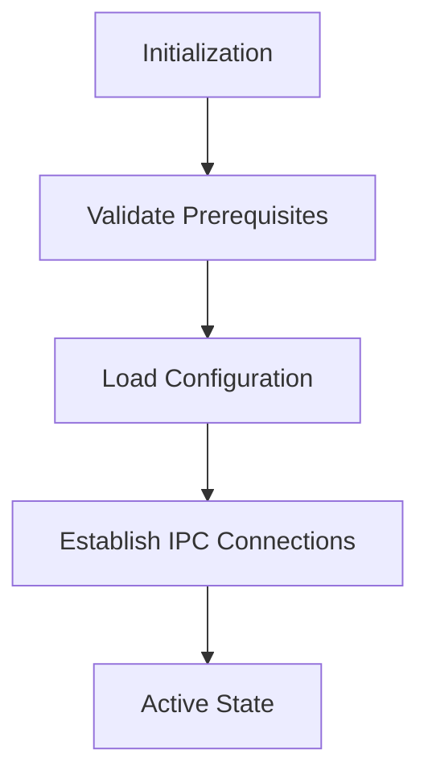
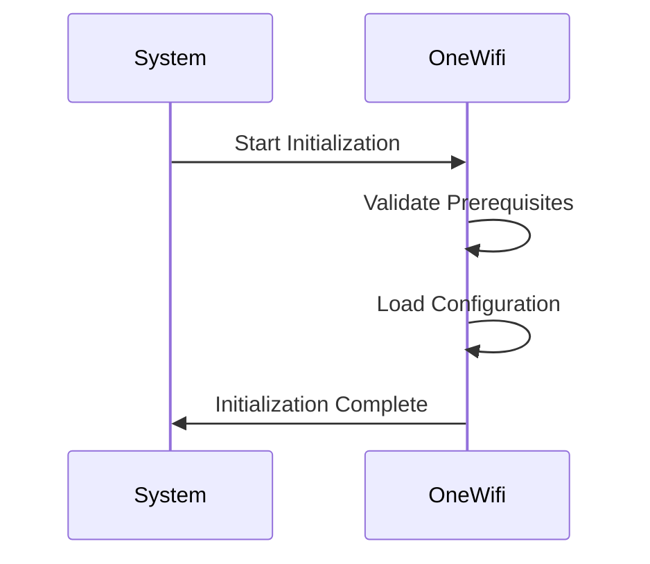
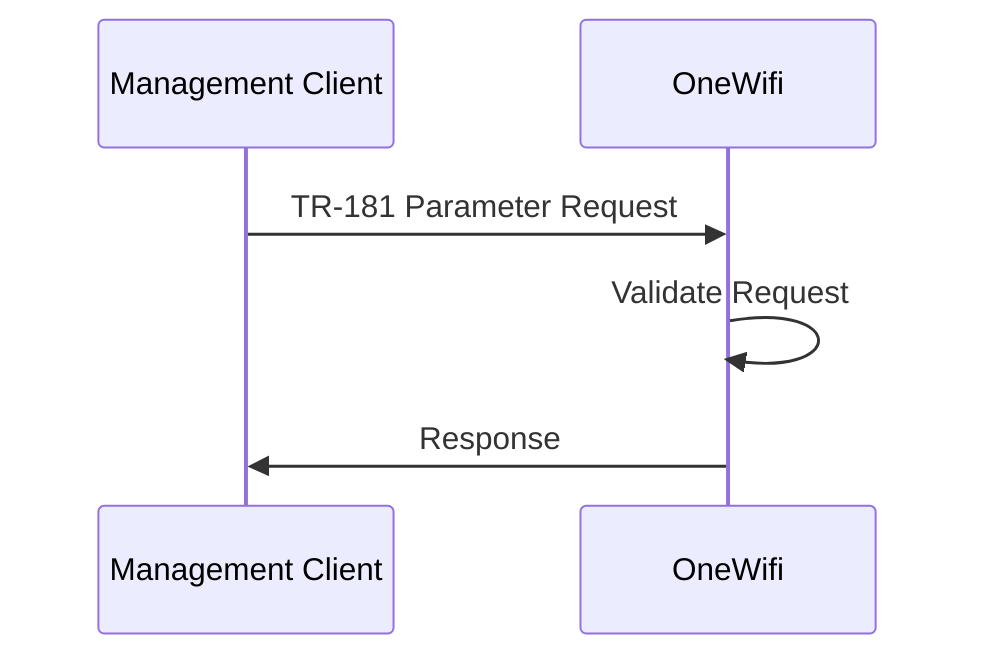
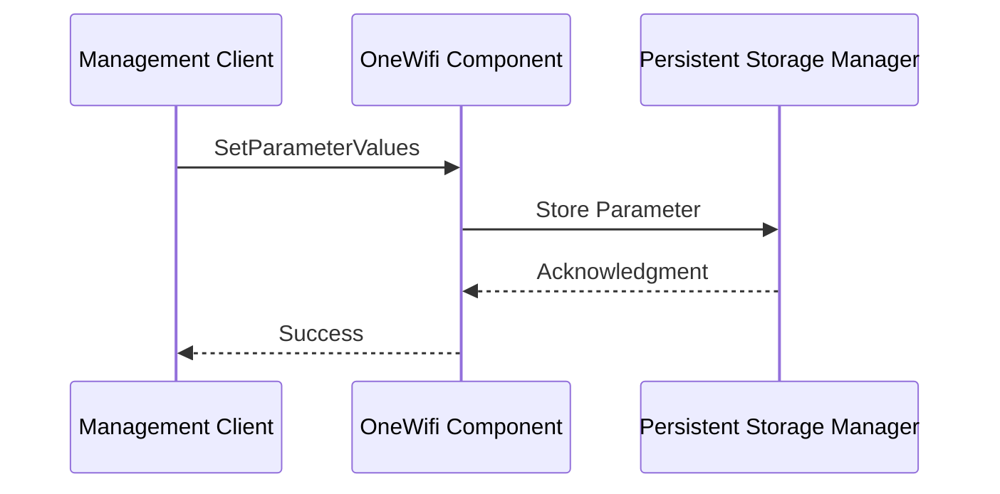

# OneWifi Documentation

## Overview

OneWifi is an RDK-B component responsible for managing WiFi connectivity and telemetry. It integrates with various middleware components and external systems to provide robust WiFi management capabilities. The component supports TR-181 data models and interacts with the system layer for configuration and monitoring.

OneWifi ensures seamless WiFi operations by providing APIs for configuration, monitoring, and telemetry reporting. It is designed to be scalable, efficient, and compliant with industry standards, making it a critical component in the RDK-B ecosystem.

## Key Features

- **WiFi Management**: Provides APIs for managing WiFi configurations, including SSID, security modes, and radio settings.
- **Telemetry Integration**: Collects and reports WiFi telemetry data for performance monitoring and diagnostics.
- **TR-181 Compliance**: Implements TR-181 data models for standardized device management.
- **System Integration**: Interacts with system services like `systemd`, `rbus`, and Persistent Storage Manager (PSM).
- **Fail-Safe Mechanisms**: Includes error recovery, configuration validation, and graceful degradation features.

## Design

### Architecture

OneWifi follows a modular, event-driven architecture designed to efficiently manage WiFi configurations, telemetry, and reporting. The design emphasizes scalability, real-time responsiveness, and data consistency while maintaining minimal system resource utilization.

- **Northbound Interface**: Provides TR-181 compliant access through RBus messaging, enabling integration with other RDK-B components and external management systems.
- **Southbound Interface**: Abstracts network interface interactions through HAL APIs and system-level networking calls.
- **Data Persistence**: Achieved through integration with the Persistent Storage Manager (PSM), ensuring WiFi configurations survive system reboots.
- **WebPA Integration**: Enables cloud-based management and telemetry reporting using industry-standard protocols and data formats, including Avro serialization for efficient data transmission.

### Threading Model

| Thread & Function           | Purpose                                                                            | Cycle/Timeout                                                                             | Synchronization                                          |
| --------------------------- | ---------------------------------------------------------------------------------- | ----------------------------------------------------------------------------------------- | -------------------------------------------------------- |
| **Main Thread**             | Component initialization, TR-181 parameter processing, daemon lifecycle management | Event-driven message loop, signal handling, component registration, configuration loading | pthread signals for termination, SSP lifecycle callbacks |
| **Logger Thread**           | Periodic logging and telemetry data collection                                     | Configurable logging period (default 1440 minutes)                                        | Mutex for log synchronization                            |
| **Sysevent Handler Thread** | System event processing and network topology monitoring                            | Continuous event listening, 2-second polling intervals                                    | Event-based synchronization                              |

### State Flow

#### Initialization to Active State



#### Runtime State Changes

- **Configuration Updates**: Validates and applies new configurations dynamically.
- **Error Recovery**: Implements fail-safe mechanisms to handle unexpected failures.
- **Context Switching**: Adjusts operations based on network topology changes (e.g., bridge mode).

## TR-181 Data Models

### Object Hierarchy

```
Device.
└── WiFi.
    ├── Radio.
    ├── SSID.
    ├── AccessPoint.
    └── Client.
```

### Parameter Definitions

| Parameter Path                          | Data Type | Access | Default Value | Description                                  |
| --------------------------------------- | --------- | ------ | ------------- | -------------------------------------------- |
| `Device.WiFi.Radio.Enable`              | boolean   | R/W    | `true`        | Enables or disables the WiFi radio.          |
| `Device.WiFi.SSID.SSID`                 | string    | R/W    | `""`          | Configures the SSID name.                    |
| `Device.WiFi.AccessPoint.Security.Mode` | string    | R/W    | `"WPA2"`      | Sets the security mode for the access point. |

## Dependencies

### Build-Time Flags

| Flag                                | Description                              |
| ----------------------------------- | ---------------------------------------- |
| `-DONEWIFI_CAC_APP_SUPPORT`         | Enables CAC application support.         |
| `-DONEWIFI_STA_MGR_APP_SUPPORT`     | Enables STA Manager application support. |
| `-DONEWIFI_MEMWRAPTOOL_APP_SUPPORT` | Enables memory wrapping tool support.    |
| `-DENABLE_NOTIFY`                   | Enables systemd notifications.           |

### System Requirements

- **RDK-B Components**: PSM, Component Registrar, WebConfig Framework.
- **HAL Dependencies**: Platform HAL for network interface management.
- **Systemd Services**: Must initialize after `network.target`.
- **Message Bus**: RBus registration for "eRT.com.cisco.spvtg.ccsp.onewifi" namespace.

## Call Flows

### Initialization Call Flow



### Request Processing Call Flow



## Component Interactions

### Interaction Matrix

| Target Component/Layer | Interaction Purpose                              | Key APIs/Endpoints |
| ---------------------- | ------------------------------------------------ | ------------------ |
| **RDK-B Middleware**   | TR-181 parameter management, telemetry reporting | RBus APIs          |
| **System Layer**       | Network interface management, event handling     | HAL APIs, sysevent |

### IPC Flow Patterns

**Primary IPC Flow - TR-181 Parameter Operation:**



## Implementation Details

### HAL APIs

| API Name                | Purpose                                 |
| ----------------------- | --------------------------------------- |
| `wifi_getRadioEnable()` | Retrieves the current radio status.     |
| `wifi_setSSID()`        | Configures the SSID for a WiFi network. |
| `wifi_getAccessPoint()` | Retrieves access point configuration.   |

### Error Handling

- **Configuration Validation**: Ensures new configurations are valid before applying changes.
- **Recovery Mechanisms**: Automatically restarts the component in case of unexpected failures.
- **Graceful Degradation**: Maintains basic functionality during partial failures.

### Logging

- **Multi-Level Logging**: Supports configurable verbosity levels.
- **Telemetry Integration**: Logs are integrated with telemetry reporting for analysis.

## References

- `ccsp-one-wifi.bb`
- `ccsp-one-wifi.bbappend`
- Source code files in the `OneWifi` directory.
