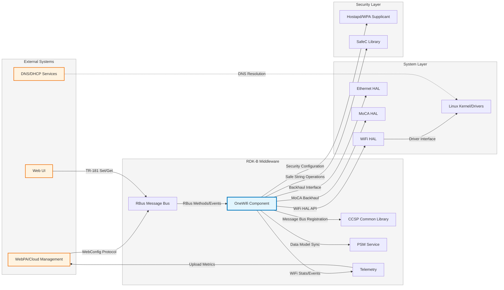
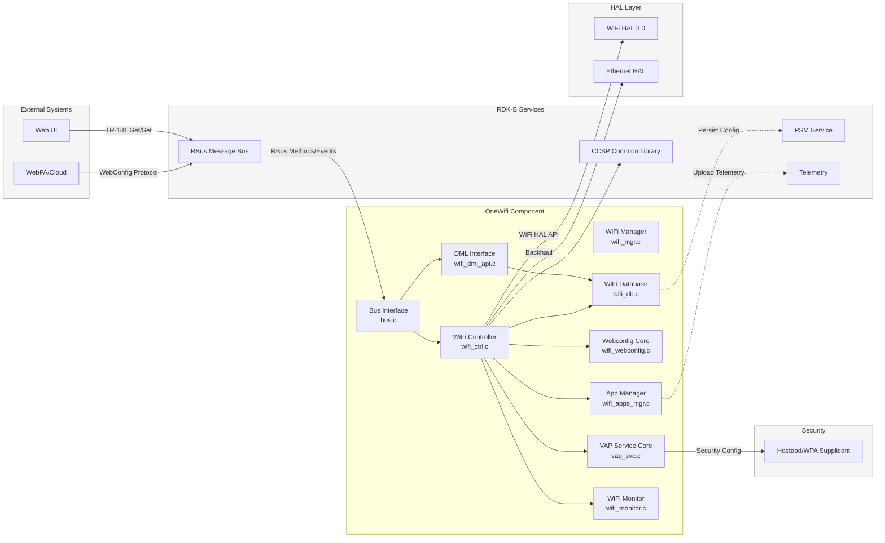
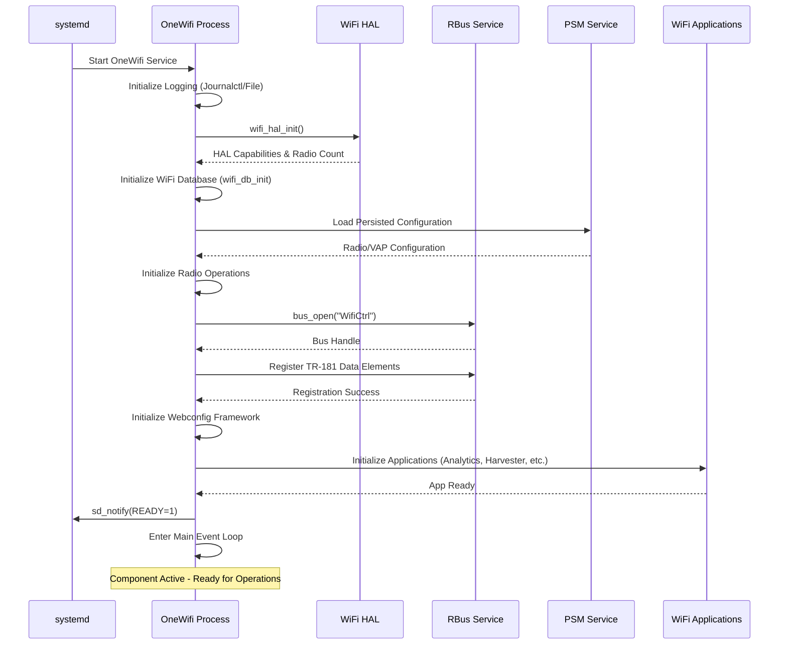
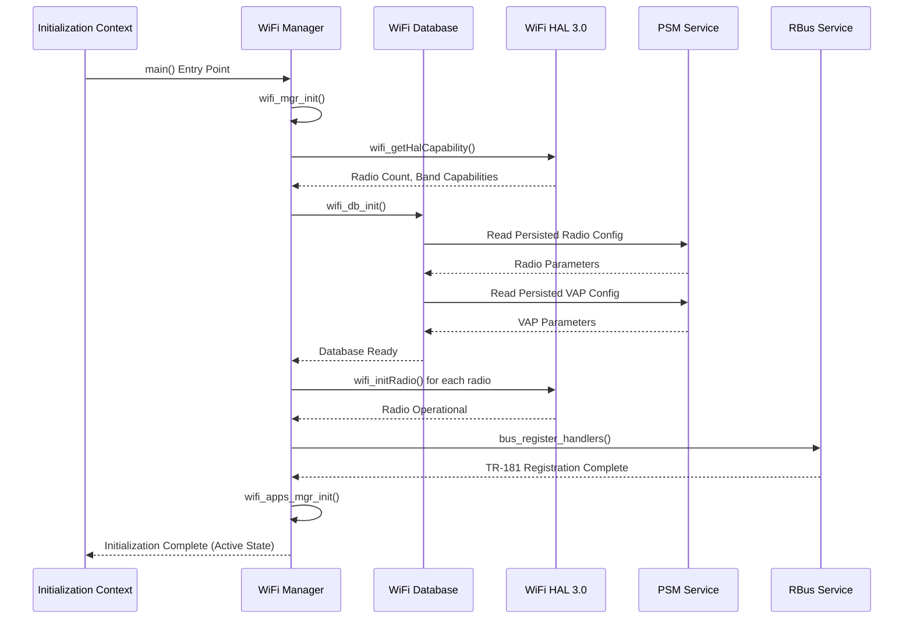
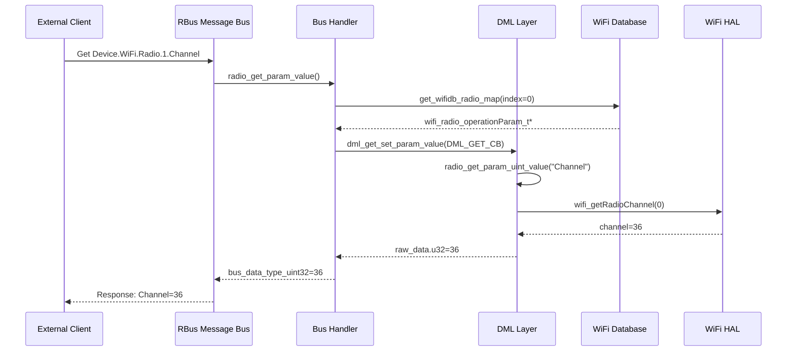
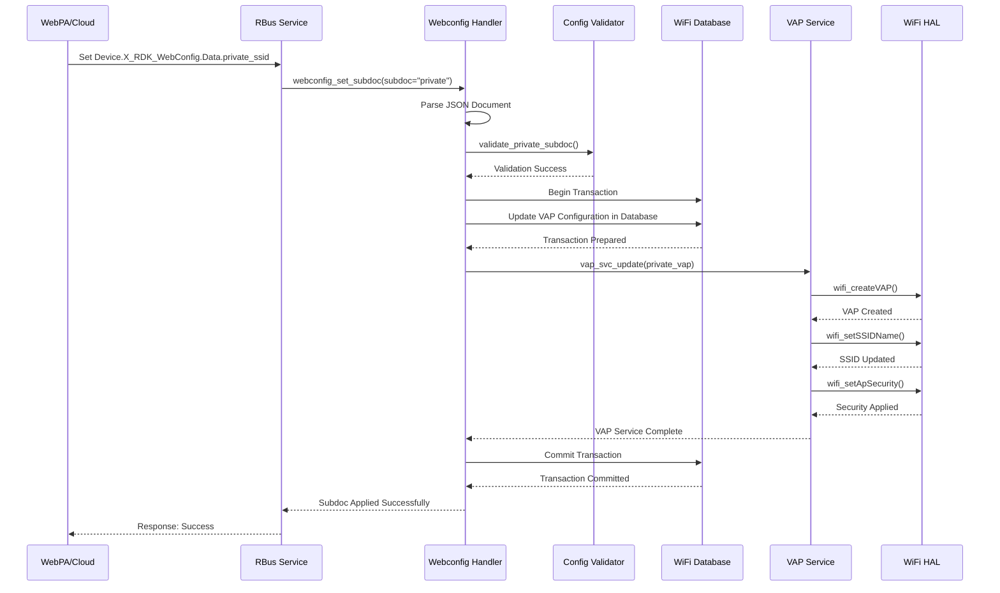
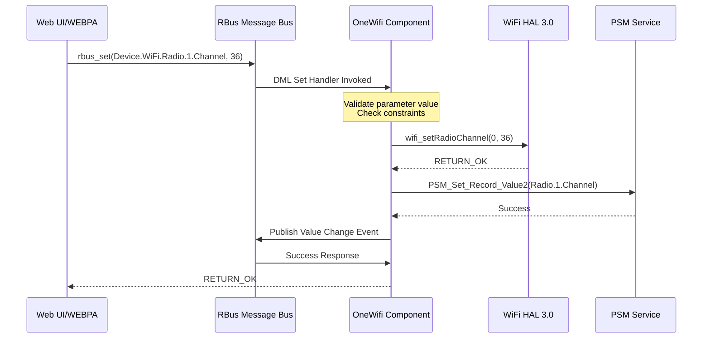
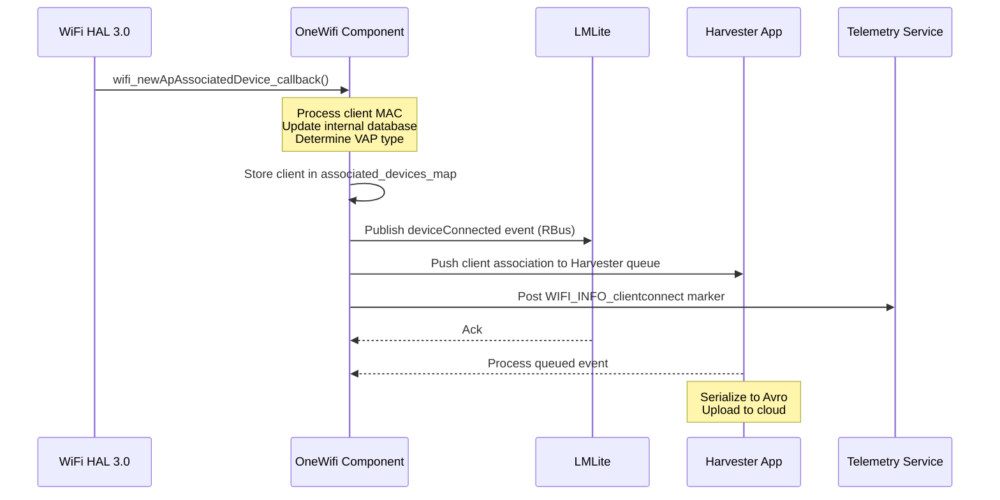
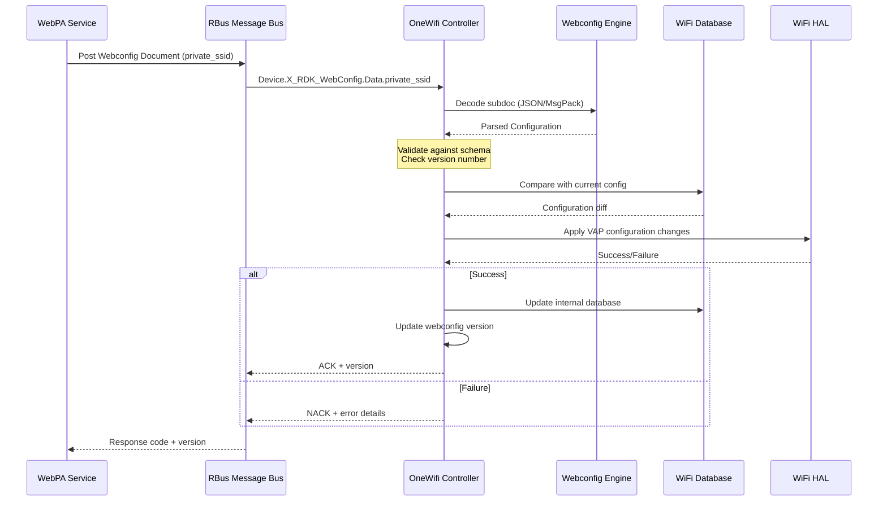

# OneWifi Documentation

OneWifi is the unified WiFi management component in RDK-B, replacing legacy CcspWiFiAgent/OneWifi. It consolidates WiFi subsystems into a single control plane managing radio operations, VAP configuration, client connectivity, security, and advanced features. The component implements TR-181 data model, integrates with RBus message bus, and supports modular applications including Analytics, Harvester, Blaster, CSI, LEVL, EasyMesh, and Motion Detection.



**Key Features & Responsibilities**: 

- **Unified WiFi Control**: Manages all WiFi radios, VAPs, and associated clients across 2.4GHz, 5GHz, and 6GHz bands with configuration persistence and runtime reconfiguration
- **TR-181 Data Model Implementation**: Implements BBF TR-181 WiFi data model (Device.WiFi.Radio, Device.WiFi.SSID, Device.WiFi.AccessPoint) with RBus parameter access and event notifications
- **Application Framework**: Supports concurrent WiFi applications (Analytics, Harvester, Blaster, Motion Detection, CSI, LEVL, EasyMesh, Client Steering) via modular plugin architecture
- **WebConfig Integration**: Multi-document webconfig framework supporting Private, Home, XHS, LNF, Mesh, and Radio subdocuments with atomic transaction support and rollback capabilities
- **HAL Version 3 Support**: Integrates with WiFi HAL 3.0 for multi-AP support, instant measurements, and CSI data collection

## Design

OneWifi implements a layered, event-driven architecture with a central WiFi manager core and pluggable application modules. The design separates control plane from data plane, enabling concurrent WiFi services without interference.

The component runs as a persistent daemon managing WiFi lifecycle from initialization through runtime. The WiFi manager coordinates HAL operations, RBus messaging, webconfig updates, and application execution with transactional validation.

Northbound integration uses RBus message bus for TR-181 data model parameters, webconfig endpoints, and application methods. Southbound integration uses WiFi HAL 3.0 APIs for hardware abstraction. Configuration persists through PSM while runtime state uses in-memory databases.



### Prerequisites and Dependencies

**Build-Time Flags and Configuration:**

| Configure Option | DISTRO Feature | Build Flag | Purpose | Default |
|------------------|----------------|------------|---------|---------|
| `--enable-journalctl` | N/A | `JOURNALCTL_SUPPORT` | Enable journalctl-based logging instead of file-based logging | Disabled |
| `--enable-easymesh` | N/A | N/A | Enable EasyMesh controller/agent support for Multi-AP deployment | Disabled |
| `--enable-sm-app` | N/A | `SM_APP` | Enable spectrum management application for channel optimization | Disabled |
| `--enable-em-app` | N/A | `EM_APP` | Enable EasyMesh application module | Disabled |
| `--enable-easyconnect` | `EasyConnect` | `EASYCONNECT_SUPPORT` | Enable DPP (Device Provisioning Protocol) EasyConnect support | Disabled |
| `--enable-notify` | `systemd` | `ENABLE_SD_NOTIFY` | Enable systemd sd_notify support for service readiness notification | Disabled |
| `--enable-libwebconfig` | N/A | N/A | Build libwebconfig library for webconfig encode/decode | Enabled (in base recipe) |
| `--with-ccsp-platform=bcm` | N/A | `CCSP_PLATFORM=bcm` | Set CCSP platform identifier (bcm, intel_usg, pc) | N/A |
| `--with-ccsp-arch=arm` | N/A | `CCSP_ARCH=arm` | Set CPU architecture (arm, atom, pc, mips) | N/A |
| `--disable-libwebconfig` | N/A | N/A | Disable building libwebconfig in main OneWifi recipe | Enabled (in main) |
| N/A | `systemd` | N/A | Include systemd service dependencies and notification support | Auto-detected |
| N/A | `safec` | Include safec headers/libs | Use SafeC library for secure string operations | Auto-detected |
| N/A | `safec` (not present) | `SAFEC_DUMMY_API` | Use dummy SafeC API stubs when SafeC library unavailable | Enabled if no safec |
| N/A | `cac` | `ONEWIFI_CAC_APP_SUPPORT` | Enable Client Admission Control application | Disabled |
| N/A | `dbus_support` | `ONEWIFI_DBUS_SUPPORT` | Use DBUS instead of RBus for IPC (legacy compatibility) | Disabled |
| N/A | `sta_manager` | `ONEWIFI_STA_MGR_APP_SUPPORT` | Enable WiFi STA manager application for client mode | Disabled |
| N/A | `meshwifi` | `ENABLE_FEATURE_MESHWIFI` | Enable Mesh WiFi extender support with mesh backhaul | Disabled |
| N/A | `halVersion3` | `WIFI_HAL_VERSION_3` | Enable WiFi HAL 3.0 API support with multi-AP and instant measurements | Disabled |
| N/A | `onewifi_integration` | `NEWPLATFORM_PORT` | Enable new platform integration mode for RDKB stack | Disabled |
| N/A | `wps_support` | `FEATURE_SUPPORT_WPS` | Enable WPS (WiFi Protected Setup) support | Disabled |
| N/A | `always_enable_ax_2g` | `ALWAYS_ENABLE_AX_2G` | Force enable 802.11ax on 2.4GHz band regardless of config | Disabled |
| N/A | `hal-ipc` | `HAL_IPC` | Enable HAL IPC mode for out-of-process HAL communication | Disabled |
| N/A | `disable_nl80211_acl` (not present) | `NL80211_ACL` | Enable nl80211-based ACL management | Enabled if not disabled |
| N/A | `CONFIG_IEEE80211BE` | `CONFIG_IEEE80211BE` | Enable IEEE 802.11be (WiFi 7/EHT) support | Disabled |
| N/A | `offchannel_scan_5g` | `FEATURE_OFF_CHANNEL_SCAN_5G` | Enable off-channel scanning on 5GHz for neighbor discovery | Disabled |
| N/A | `Memwrap_Tool` | `ONEWIFI_MEMWRAPTOOL_APP_SUPPORT` | Enable memory profiling and leak detection tool | Disabled |
| `ONEWIFI_DML_SUPPORT_MAKEFILE=true` | N/A | `ONEWIFI_DML_SUPPORT` | Enable DML (Data Model Layer) support for TR-181 | Enabled (in bbappend) |
| `ONEWIFI_CSI_APP_SUPPORT=true` | N/A | `ONEWIFI_CSI_APP_SUPPORT` | Enable Channel State Information application | Enabled (in bbappend) |
| `ONEWIFI_MOTION_APP_SUPPORT=true` | N/A | `ONEWIFI_MOTION_APP_SUPPORT` | Enable motion detection application using CSI | Enabled (in bbappend) |
| `ONEWIFI_HARVESTER_APP_SUPPORT=true` | N/A | `ONEWIFI_HARVESTER_APP_SUPPORT` | Enable telemetry harvester application for client data collection | Enabled (in bbappend) |
| `ONEWIFI_ANALYTICS_APP_SUPPORT=true` | N/A | `ONEWIFI_ANALYTICS_APP_SUPPORT` | Enable WiFi analytics application | Enabled (in bbappend) |
| `ONEWIFI_LEVL_APP_SUPPORT=true` | N/A | `ONEWIFI_LEVL_APP_SUPPORT` | Enable LEVL (Location Enabled Video Learning) application | Enabled (in bbappend) |
| `ONEWIFI_WHIX_APP_SUPPORT=true` | N/A | `ONEWIFI_WHIX_APP_SUPPORT` | Enable WHIX application | Enabled (in bbappend) |
| `ONEWIFI_BLASTER_APP_SUPPORT=true` | N/A | `ONEWIFI_BLASTER_APP_SUPPORT` | Enable WiFi Blaster speed test application | Enabled (in bbappend) |
| N/A | N/A | `ONEWIFI_RDKB_APP_SUPPORT` | Enable RDKB-specific application features | Enabled (in bbappend) |
| N/A | N/A | `ONEWIFI_DB_SUPPORT` | Enable internal database for WiFi configuration | Enabled (in bbappend) |
| N/A | N/A | `ONEWIFI_RDKB_CCSP_SUPPORT` | Enable CCSP framework integration for RDKB | Enabled (in bbappend) |
| N/A | N/A | `WIFI_CAPTIVE_PORTAL` | Enable captive portal support for guest networks | Enabled |
| N/A | N/A | `ONEWIFI_OVSDB_TABLE_SUPPORT` | Enable OVSDB table support for OpenSync integration | Enabled (in libwebconfig bbappend) |
| N/A | N/A | `ONEWIFI_JSON_DML_SUPPORT` | Enable JSON-based DML support | Conditional |
| `ONEWIFI_AVRO_SUPPORT` | N/A | N/A | Enable Avro serialization for telemetry (auto-enabled if Harvester or Blaster enabled) | Auto |

**RDK-B Platform and Integration Requirements:**

- **RDK-B Components**: `CcspPandM`, `CcspPsm`, `CcspCommonLibrary`, `halinterface`, `rbus`, `webconfig-framework`, `telemetry`, `libsyswrapper`
- **HAL Dependencies**: `rdk-wifi-halif` (WiFi HAL 3.0), `hal-cm`, `hal-dhcpv4c`, `hal-ethsw`, `hal-moca` for backhaul management
- **Systemd Services**: `CcspPsmSsp.service` must be active before OneWifi starts for configuration persistence
- **Message Bus**: RBus registration under `Device.WiFi.*` namespace for TR-181 data model; supports legacy mode via `ONEWIFI_DBUS_SUPPORT` for platform compatibility
- **TR-181 Data Model**: Implements `Device.WiFi.Radio.{i}`, `Device.WiFi.SSID.{i}`, `Device.WiFi.AccessPoint.{i}` hierarchies with full parameter support
- **Configuration Files**: TR-181 XML data model definitions in `config/TR181-WiFi-USGv2.XML` and `config/TR181-WIFI-EXT-USGv2.XML`
- **Startup Order**: Initialize after network interfaces are active, PSM services running, and RBus message bus available
- **Hardware Requirements**: WiFi radio hardware with driver support for nl80211 interface; optional MoCA hardware for mesh backhaul

**Threading Model:**

- **Threading Architecture**: Multi-threaded with main event loop and dedicated worker threads for concurrent operations
- **Main Thread**: Handles WiFi manager initialization, main event loop processing (libev-based), RBus message dispatch, and component lifecycle management
- **Worker Threads**: 
  - **Database Event Loop Thread**: Dedicated libev event loop for OVSDB operations and database state management (`wifi_db_apis.c`)
  - **Application Execution Threads**: Each WiFi application (Analytics, Harvester, CSI, etc.) runs in dedicated thread context with isolated state (`wifi_apps_mgr.c`)
  - **Blaster Worker Thread**: Active measurement thread for speed test packet processing and throughput calculations (`wifi_blaster.c`)
  - **CSI Pipeline Thread**: CSI data processing thread reading from pipe and streaming to applications (`wifi_csi_analytics.c`)
- **Synchronization**: Uses pthread mutex locks for database access (`associated_devices_lock`), condition variables for thread signaling, and atomic operations for state flags; scheduler task queue with priority-based execution

### Component State Flow

**Initialization to Active State**



**Runtime State Changes and Context Switching**

**State Change Triggers:****

- WebConfig document application causing VAP enable/disable, security changes, or SSID modifications with atomic transaction support
- Radio state changes including channel switch, bandwidth changes, DFS events, and regulatory domain updates
- Client association/disassociation events triggering steering decisions, telemetry collection, and application notifications
- HAL event callbacks for CSI data, radar detection, client RSSI changes, and link quality degradation
- RBus method invocations for immediate configuration changes, diagnostic commands, and application control

**Context Switching Scenarios:**

- VAP service transitions between private, public, hotspot, and mesh operating modes based on configuration and backhaul status
- Application priority changes when multiple apps request concurrent HAL resources (e.g., CSI engine, off-channel scanning)
- Steering algorithm switches between local steering, BTM steering, and distributed steering based on multi-AP topology
- Radio operating mode changes for DFS CAC periods, off-channel scanning windows, and emergency channel switching

### Call Flow

**Initialization Call Flow:**



**TR-181 Parameter Get Flow:**



**Webconfig Document Application Flow:**



## TR‑181 Data Models

### Supported TR-181 Parameters

### Object Hierarchy

```
Device.
└── WiFi.
    ├── RadioNumberOfEntries (unsignedInt, R)
    ├── SSIDNumberOfEntries (unsignedInt, R)
    ├── AccessPointNumberOfEntries (unsignedInt, R)
    ├── ApplyRadioSettings (boolean, R/W)
    ├── ApplyAccessPointSettings (boolean, R/W)
    ├── Radio.{i}.
    │   ├── Enable (boolean, R/W)
    │   ├── Status (string, R)
    │   ├── Name (string, R)
    │   ├── Channel (unsignedInt, R/W)
    │   ├── AutoChannelEnable (boolean, R/W)
    │   ├── OperatingFrequencyBand (string, R/W)
    │   ├── OperatingChannelBandwidth (string, R/W)
    │   ├── TransmitPower (int, R/W)
    │   ├── Stats.
    │   └── etc.
    ├── SSID.{i}.
    │   ├── Enable (boolean, R/W)
    │   ├── Status (string, R)
    │   ├── Name (string, R)
    │   ├── SSID (string, R/W)
    │   ├── LowerLayers (string, R/W)
    │   └── etc.
    └── AccessPoint.{i}.
        ├── Enable (boolean, R/W)
        ├── Status (string, R)
        ├── SSIDReference (string, R/W)
        ├── WMMEnable (boolean, R/W)
        ├── UAPSDEnable (boolean, R/W)
        ├── Security.
        │   ├── ModesSupported (string, R)
        │   ├── ModeEnabled (string, R/W)
        │   ├── KeyPassphrase (string, R/W)
        │   └── etc.
        ├── AssociatedDevice.{i}.
        │   ├── MACAddress (string, R)
        │   ├── SignalStrength (int, R)
        │   ├── LastDataDownlinkRate (unsignedInt, R)
        │   └── etc.
        └── X_CISCO_COM_MacFilterTable.{i}.
            ├── MACAddress (string, R/W)
            └── DeviceName (string, R/W)
```

### Parameter Definitions

**Radio Parameters:**

| Parameter Path | Data Type | Access | Default Value | Description | BBF Compliance |
|----------------|-----------|--------|---------------|-------------|----------------|
| `Device.WiFi.Radio.{i}.Enable` | boolean | R/W | `true` | Enables or disables the radio. When disabled, VAPs on this radio are non-operational | TR-181 Issue 2 |
| `Device.WiFi.Radio.{i}.Status` | string | R | `"Down"` | Current operational status: Up, Down, Unknown, Dormant, NotPresent, LowerLayerDown, Error | TR-181 Issue 2 |
| `Device.WiFi.Radio.{i}.Channel` | unsignedInt | R/W | `0` | Current radio channel number. 0 indicates auto-channel selection is active | TR-181 Issue 2 |
| `Device.WiFi.Radio.{i}.AutoChannelEnable` | boolean | R/W | `false` | Enable automatic channel selection based on interference and load | TR-181 Issue 2 |
| `Device.WiFi.Radio.{i}.OperatingFrequencyBand` | string | R/W | N/A | Operating frequency band: 2.4GHz, 5GHz, 6GHz | TR-181 Issue 2 |
| `Device.WiFi.Radio.{i}.OperatingChannelBandwidth` | string | R/W | `"20MHz"` | Channel bandwidth: 20MHz, 40MHz, 80MHz, 160MHz, 80+80MHz | TR-181 Issue 2 |
| `Device.WiFi.Radio.{i}.TransmitPower` | int | R/W | `100` | Transmit power percentage (0-100%) | TR-181 Issue 2 |
| `Device.WiFi.Radio.{i}.GuardInterval` | string | R/W | `"Auto"` | Guard interval: 400nsec, 800nsec, Auto | TR-181 Issue 2 |
| `Device.WiFi.Radio.{i}.CTSProtection` | boolean | R/W | `false` | Enable CTS protection mechanism for mixed mode operation | RDK Extension |
| `Device.WiFi.Radio.{i}.BeaconInterval` | unsignedInt | R/W | `100` | Beacon interval in time units (TU), 1 TU = 1024 microseconds | RDK Extension |
| `Device.WiFi.Radio.{i}.DTIMInterval` | unsignedInt | R/W | `2` | DTIM (Delivery Traffic Indication Message) interval in beacon intervals | RDK Extension |

**SSID Parameters:**

| Parameter Path | Data Type | Access | Default Value | Description | BBF Compliance |
|----------------|-----------|--------|---------------|-------------|----------------|
| `Device.WiFi.SSID.{i}.Enable` | boolean | R/W | `false` | Enables or disables this SSID | TR-181 Issue 2 |
| `Device.WiFi.SSID.{i}.Status` | string | R | `"Down"` | Current status: Up, Down, Unknown, Dormant, NotPresent, LowerLayerDown, Error | TR-181 Issue 2 |
| `Device.WiFi.SSID.{i}.SSID` | string | R/W | `""` | SSID name broadcast by this interface (max 32 octets) | TR-181 Issue 2 |
| `Device.WiFi.SSID.{i}.LowerLayers` | string | R/W | `""` | Reference to radio interface: Device.WiFi.Radio.{i} | TR-181 Issue 2 |

**AccessPoint Parameters:**

| Parameter Path | Data Type | Access | Default Value | Description | BBF Compliance |
|----------------|-----------|--------|---------------|-------------|----------------|
| `Device.WiFi.AccessPoint.{i}.Enable` | boolean | R/W | `false` | Enables or disables the access point | TR-181 Issue 2 |
| `Device.WiFi.AccessPoint.{i}.Status` | string | R | `"Disabled"` | Current status: Enabled, Disabled, Error | TR-181 Issue 2 |
| `Device.WiFi.AccessPoint.{i}.SSIDReference` | string | R/W | `""` | Reference to associated SSID object | TR-181 Issue 2 |
| `Device.WiFi.AccessPoint.{i}.WMMEnable` | boolean | R/W | `true` | Enable WiFi Multimedia (WMM) QoS | TR-181 Issue 2 |
| `Device.WiFi.AccessPoint.{i}.UAPSDEnable` | boolean | R/W | `true` | Enable Unscheduled Automatic Power Save Delivery | TR-181 Issue 2 |
| `Device.WiFi.AccessPoint.{i}.BSSMaxNumSta` | unsignedInt | R/W | `0` | Maximum number of associated devices (0=unlimited) | RDK Extension |
| `Device.WiFi.AccessPoint.{i}.IsolationEnable` | boolean | R/W | `false` | Enable client isolation (prevent client-to-client communication) | RDK Extension |
| `Device.WiFi.AccessPoint.{i}.X_RDKCENTRAL-COM_BeaconRate` | string | R/W | `"6Mbps"` | Beacon transmission rate (6Mbps, 12Mbps, 24Mbps, etc.) | RDK Extension |
| `Device.WiFi.AccessPoint.{i}.X_COMCAST-COM_MAC_FilteringMode` | string | R/W | `"Allow-ALL"` | MAC filtering mode: Allow, Deny, Allow-ALL | RDK Extension |
| `Device.WiFi.AccessPoint.{i}.BSSTransitionActivated` | boolean | R/W | `false` | Enable BSS Transition Management (802.11v) | RDK Extension |
| `Device.WiFi.AccessPoint.{i}.RapidReconnectEnable` | boolean | R/W | `false` | Enable rapid reconnect tracking for client monitoring | RDK Extension |

**Security Parameters:**

| Parameter Path | Data Type | Access | Default Value | Description | BBF Compliance |
|----------------|-----------|--------|---------------|-------------|----------------|
| `Device.WiFi.AccessPoint.{i}.Security.ModesSupported` | string | R | N/A | Comma-separated list of supported security modes | TR-181 Issue 2 |
| `Device.WiFi.AccessPoint.{i}.Security.ModeEnabled` | string | R/W | `"None"` | Security mode: None, WPA-Personal, WPA2-Personal, WPA-WPA2-Personal, WPA3-Personal, WPA3-Transition, WPA-Enterprise, WPA2-Enterprise, WPA3-Enterprise | TR-181 Issue 2 |
| `Device.WiFi.AccessPoint.{i}.Security.KeyPassphrase` | string | R/W | `""` | WPA/WPA2/WPA3 pre-shared key passphrase (8-63 ASCII characters) | TR-181 Issue 2 |
| `Device.WiFi.AccessPoint.{i}.Security.RekeyingInterval` | unsignedInt | R/W | `3600` | Group key rekey interval in seconds | TR-181 Issue 2 |
| `Device.WiFi.AccessPoint.{i}.Security.MFPConfig` | string | R/W | `"Disabled"` | Management Frame Protection: Disabled, Optional, Required | RDK Extension |

**AssociatedDevice Parameters (Dynamic Table):**

| Parameter Path | Data Type | Access | Default Value | Description | BBF Compliance |
|----------------|-----------|--------|---------------|-------------|----------------|
| `Device.WiFi.AccessPoint.{i}.AssociatedDevice.{i}.MACAddress` | string | R | N/A | MAC address of associated client | TR-181 Issue 2 |
| `Device.WiFi.AccessPoint.{i}.AssociatedDevice.{i}.SignalStrength` | int | R | N/A | Signal strength in dBm | TR-181 Issue 2 |
| `Device.WiFi.AccessPoint.{i}.AssociatedDevice.{i}.LastDataDownlinkRate` | unsignedInt | R | N/A | Last measured downlink PHY rate in Kbps | TR-181 Issue 2 |
| `Device.WiFi.AccessPoint.{i}.AssociatedDevice.{i}.LastDataUplinkRate` | unsignedInt | R | N/A | Last measured uplink PHY rate in Kbps | TR-181 Issue 2 |
| `Device.WiFi.AccessPoint.{i}.AssociatedDevice.{i}.Retransmissions` | unsignedInt | R | N/A | Number of packet retransmissions | TR-181 Issue 2 |

### Parameter Registration and Access

- **Implemented Parameters**: OneWifi registers 200+ TR-181 parameters across Radio, SSID, AccessPoint, and Security hierarchies with complete get/set handlers
- **Parameter Registration**: Uses RBus `bus_reg_data_element_fn()` to register data elements with callback tables specifying get/set/table handlers for each parameter namespace
- **Access Mechanism**: RBus clients access parameters via `rbus_get()` and `rbus_set()` calls, routed to OneWifi's registered handlers which interact with internal database and WiFi HAL
- **Table Management**: Dynamic table registration for Radio.{i}, SSID.{i}, AccessPoint.{i}, AssociatedDevice.{i}, MacFilterTable.{i} with automatic instance number management
- **Validation Rules**: Parameter validators enforce BBF data type constraints, value ranges, string length limits, and cross-parameter dependencies before applying changes
- **Notification Support**: Implements RBus event subscription mechanism for parameter change notifications, allowing clients to monitor WiFi state changes

## Internal Modules

| Module/Class | Description | Key Files |
|-------------|------------|-----------|
| **WiFi Manager Core** | Manages component lifecycle, initialization sequencing, and subsystem coordination | `source/core/wifi_mgr.c`, `source/core/wifi_ctrl.c` |
| **WiFi Controller** | Main control logic handling RBus message processing, webconfig integration, application management, and event coordination | `source/core/wifi_ctrl.c`, `source/core/wifi_ctrl_rbus_handlers.c`, `source/core/wifi_ctrl_queue_handlers.c` |
| **WiFi Database** | In-memory configuration database for radio parameters, VAP configuration, and runtime state with PSM persistence | `source/db/wifi_db.c`, `source/db/wifi_db_apis.c` |
| **Data Plane Manager** | Manages WiFi data plane operations including packet forwarding, VLAN tagging, bridge configuration, and traffic steering | `source/core/wifi_data_plane.c` |
| **VAP Services** | Service modules for different VAP types (private, public, hotspot, mesh) with type-specific configuration and lifecycle management | `source/core/services/vap_svc.c`, `source/core/services/vap_svc_private.c`, `source/core/services/vap_svc_public.c`, `source/core/services/vap_svc_mesh_gw.c` |
| **Webconfig Subsystem** | Multi-document webconfig framework supporting atomic configuration updates via Private, Home, XHS, LNF, Mesh, and Radio subdocuments | `source/core/wifi_webconfig.c`, `source/core/wifi_multidoc_webconfig.c`, `source/core/wifi_ctrl_webconfig.c` |
| **Event System** | Event management for WiFi state changes, client associations, HAL callbacks, and application notifications | `source/core/wifi_events.c` |
| **Statistics & Monitoring** | Collects radio statistics, client metrics, channel utilization, and neighbor reports from WiFi HAL | `source/stats/wifi_monitor.c`, `source/stats/wifi_stats.c`, `source/stats/wifi_stats_radio_channel.c`, `source/stats/wifi_stats_assoc_client.c` |
| **Platform Abstraction** | Bus interface layer abstracting RBus communication with platform-specific implementations for RDKB and extender modes | `source/platform/rdkb/bus.c`, `source/platform/common/bus_common.h` |
| **DML Layer** | TR-181 data model implementation with parameter get/set handlers, table management, and callback registration | `source/platform/common/data_model/wifi_dml_api.c`, `source/platform/common/data_model/wifi_dml_cb.c`, `source/platform/common/data_model/wifi_data_model.c` |
| **Analytics Application** | WiFi analytics engine collecting link quality metrics, interference data, and performance indicators for cloud analysis | `source/apps/analytics/wifi_analytics.c` |
| **Harvester Application** | Telemetry harvester collecting client connection data, active measurement results, and neighborhood scan data with Avro serialization | `source/apps/harvester/wifi_harvester.c` |
| **Blaster Application** | WiFi speed test application measuring throughput, latency, jitter, and packet loss between gateway and cloud endpoints | `source/apps/blaster/wifi_blaster.c` |
| **CSI Application** | CSI data collection from WiFi HAL for motion detection and presence sensing | `source/apps/csi/wifi_csi.c` |
| **LEVL Application** | Location Enabled Video Learning application using CSI data for device localization and tracking | `source/apps/levl/wifi_levl.c` |
| **Motion Detection** | Motion detection using CSI data patterns to detect human movement in WiFi coverage area | `source/apps/motion/wifi_motion.c` |
| **EasyMesh Application** | Multi-AP EasyMesh controller and agent implementation supporting IEEE 1905 and WFA Multi-AP specifications | `source/apps/em/wifi_em.c` |
| **CAC Application** | Client Admission Control application managing AP capacity using RSSI thresholds and client count limits | `source/apps/cac/wifi_cac.c` |
| **Application Manager** | Manages WiFi application lifecycle including initialization, resource allocation, concurrent execution, and inter-application coordination | `source/apps/wifi_apps_mgr.c`, `source/apps/wifi_apps.c` |
| **Security Management** | Manages WiFi security configuration including encryption, authentication, RADIUS integration, and WPS | `source/core/wifi_8021x.c`, `source/core/wifi_passpoint.c` |
| **Scheduler** | Task scheduler managing periodic operations, deferred execution, and timer-based callbacks for all modules | `source/utils/scheduler.c` |
| **Utility Libraries** | Common utility functions including JSON parsing, data structure manipulation, base64 encoding, and collection management | `source/utils/jsonconv.c`, `source/utils/collection.c`, `source/utils/caps.c` |

## Component Interactions

OneWifi interacts with RDK-B middleware, HAL layers, and external management systems through RBus TR-181 parameter access, webconfig protocol, HAL APIs, PSM storage operations, and telemetry events. The component orchestrates WiFi operations integrating cloud management (WebPA), user interfaces (Web UI), platform services (PSM, Telemetry), WiFi hardware (HAL 3.0), and security subsystems (hostapd/wpa_supplicant).

### Interaction Matrix

| Target Component/Layer | Interaction Purpose | Key APIs/Endpoints |
|------------------------|---------------------|-------------------|
| **RDK-B Middleware Components** |
| RBus Message Bus | TR-181 parameter access, webconfig ingestion, event notifications | `bus_open("WifiCtrl")`, `bus_reg_data_element()`, `rbus_get/set()` |
| CcspPsm | Configuration persistence across reboots for radio/VAP settings | `PSM_Get_Record_Value2()`, `PSM_Set_Record_Value2()` (via PSM service) |
| CcspPandM | Device information queries, cross-component parameter access | RBus methods on `Device.DeviceInfo.*` parameters |
| Telemetry Service | Upload WiFi statistics, client metrics, and diagnostic events | `t2_event_s()`, `t2_event_d()` for marker posting |
| WebConfig Framework | Multi-document configuration management and atomic updates | `webconfig_encode()`, `webconfig_decode()`, subdocument handlers |
| **System & HAL Layers** |
| WiFi HAL 3.0 | Radio control, VAP management, client operations, statistics collection | `wifi_hal_init()`, `wifi_createVAP()`, `wifi_startBss()`, `wifi_getRadioChannelStats()` |
| Ethernet HAL | Backhaul interface management for mesh and WAN connectivity | `GWP_GetEthWanInterfaceName()`, interface status queries |
| MoCA HAL | MoCA backhaul status and configuration for mesh networks | MoCA status APIs for backhaul link quality |
| hostapd/wpa_supplicant | WPA/WPA2/WPA3 security, RADIUS authentication, 802.1X | Configuration file generation, control socket communication |
| syscfg/PSM Storage | Persistent storage for WiFi configuration parameters | PSM APIs via CcspPsm service for atomic read/write operations |

**Configuration Persistence:**
OneWifi persists WiFi configuration (radio enable state, VAP settings, security credentials, SSID names) through PSM (Persistent Storage Manager) service. Configuration changes are written to PSM via `PSM_Set_Record_Value2()` calls and restored on boot via `PSM_Get_Record_Value2()`. Runtime state is maintained in internal database with periodic PSM synchronization for critical parameters.

**Events Published by OneWifi:**

| Event Name | Event Topic/Path | Trigger Condition | Subscriber Components |
|------------|-----------------|-------------------|---------------------|
| Client Connected | `Device.WiFi.AccessPoint.{i}.X_RDK_deviceConnected` | Client successfully associates to VAP | LMLite, Harvester, Telemetry |
| Client Disconnected | `Device.WiFi.AccessPoint.{i}.X_RDK_deviceDisconnected` | Client deauthenticates or disassociates | LMLite, Harvester, Telemetry |
| Radio Channel Change | `Device.WiFi.Radio.{i}.Channel` | DFS event, channel switch, or manual change | Analytics, Telemetry, CcspPandM |
| VAP Status Change | `Device.WiFi.AccessPoint.{i}.Status` | VAP enabled, disabled, or error state | CcspPandM, Web UI subscribers |
| CSI Data Available | `Device.WiFi.X_RDK_CSI.{i}.data` | CSI engine produces new measurement data | Motion Detection, LEVL applications |
| Webconfig Applied | Internal event | Webconfig subdocument successfully applied | Applications requiring config sync |

### IPC Flow Patterns

**Primary IPC Flow - TR-181 Parameter Set:**



**Event Notification Flow - Client Association:**



**Webconfig Application Flow:**



## Implementation Details

### Major HAL APIs Integration

The component caches HAL state internally with periodic synchronization for consistency.

**Core HAL APIs:**

| HAL API | Purpose | Implementation File |
|---------|---------|-------------------|
| `wifi_hal_init()` | Initialize WiFi HAL subsystem and discover radio capabilities | `source/core/wifi_mgr.c` |
| `wifi_getHalCapability()` | Retrieve HAL capabilities including radio count, band support, VAP limits | `source/core/wifi_mgr.c` |
| `wifi_initRadio()` | Initialize specific radio with default operating parameters | `source/core/wifi_mgr.c` |
| `wifi_createVAP()` | Create Virtual Access Point with specified configuration | `source/core/wifi_ctrl.c` |
| `wifi_startBss()` | Start BSS operation for configured VAP (beacon transmission) | `source/core/wifi_ctrl.c` |
| `wifi_setRadioChannel()` | Set radio operating channel (with DFS and regulatory compliance) | `source/core/wifi_ctrl.c` |
| `wifi_setRadioOperatingParameters()` | Configure radio parameters (bandwidth, power, mode) | `source/core/wifi_ctrl.c` |
| `wifi_setSSIDName()` | Set SSID name for VAP | `source/core/wifi_ctrl.c` |
| `wifi_setApSecurity()` | Configure VAP security mode (Open, WPA2, WPA3) | `source/core/wifi_ctrl.c` |
| `wifi_kickAssociatedDevice()` | Force client deauthentication/disassociation | `source/core/wifi_ctrl.c` |
| `wifi_getApAssociatedDeviceDetail()` | Retrieve detailed client information (RSSI, rates, capabilities) | `source/stats/wifi_stats_assoc_client.c` |
| `wifi_getRadioChannelStats()` | Collect channel utilization, noise floor, interference metrics | `source/stats/wifi_stats_radio_channel.c` |
| `wifi_enableCSIEngine()` | Enable Channel State Information data collection | `source/apps/csi/wifi_csi.c` |
| `wifi_sendDataFrame()` | Inject data frames for CSI measurements | `source/apps/csi/wifi_csi.c` |
| `wifi_getApAssociatedDeviceTidStatsResult()` | Get per-TID statistics for QoS analysis | `source/stats/wifi_monitor.c` |

### Key Implementation Logic

- **State Machine Engine**: WiFi manager implements state-based lifecycle management for component initialization, radio bring-up, VAP activation, and shutdown sequences (`source/core/wifi_mgr.c`, `source/core/wifi_ctrl.c`)
  
- **Event Processing**: Hardware events from WiFi HAL are processed through callback handlers, queued in event system, and dispatched to registered applications (`source/core/wifi_events.c`)

- **Error Handling Strategy**: HAL return codes checked and logged; automatic retry logic for transient failures with fallback configurations; watchdog timers for long-running operations

- **Logging & Debugging**: Multi-level logging system with module-specific categories supporting journalctl and file-based output; runtime log level control via TR-181 parameters

### Key Configuration Files

| Configuration File | Purpose | Override Mechanisms |
|--------------------|---------|--------------------|
| `config/TR181-WiFi-USGv2.XML` | TR-181 WiFi data model definitions with parameter specifications | None - compiled into component |
| `config/TR181-WIFI-EXT-USGv2.XML` | RDK-B WiFi extensions to standard TR-181 model | None - compiled into component |
| `config/CcspWifi.cfg` | CCSP component configuration (component name, priority) | Environment variables, systemd overrides |
| `config/CcspDmLib.cfg` | Data model library configuration mapping objects to handlers | None - compiled into component |
| `config/bus_dml_config.json` | Bus data model configuration for RBus element registration | Can be overridden via filesystem path |
| `systemd_units/RdkInterDeviceManager.service` | systemd service unit defining startup dependencies and execution | systemd drop-in overrides in `/etc/systemd/system/` |
| `config/subdoc_schemas_1_4/*.json` | JSON schemas for webconfig subdocument validation | None - compiled into component |
| `/nvram/wifidb.json` | Runtime database snapshot persisted across reboots | Generated dynamically, not user-editable |

**Configuration Persistence:**
OneWifi persists configuration through PSM (Persistent Storage Manager) service. Critical WiFi parameters are written to PSM on change via `PSM_Set_Record_Value2()` API and restored on boot via `PSM_Get_Record_Value2()`. Runtime state and statistics are maintained in internal in-memory database with snapshot capability to `/nvram/wifidb.json` for debugging. Webconfig subdocument versions are tracked to prevent rollback and duplicate applications.
