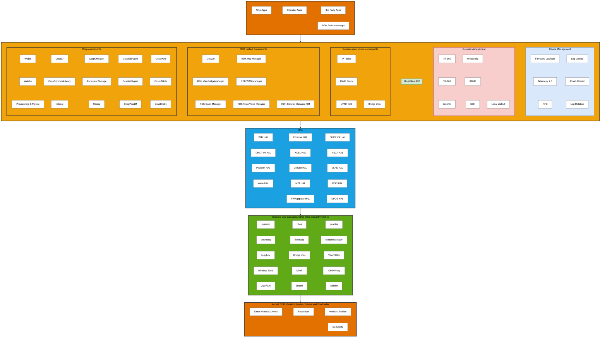
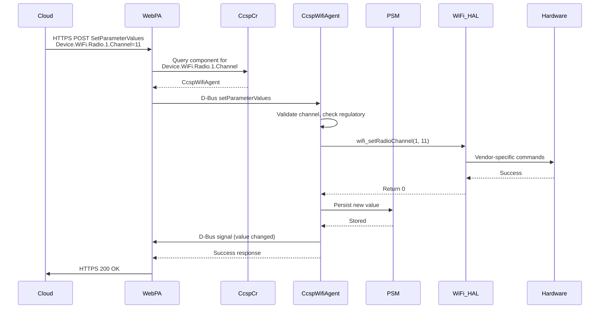
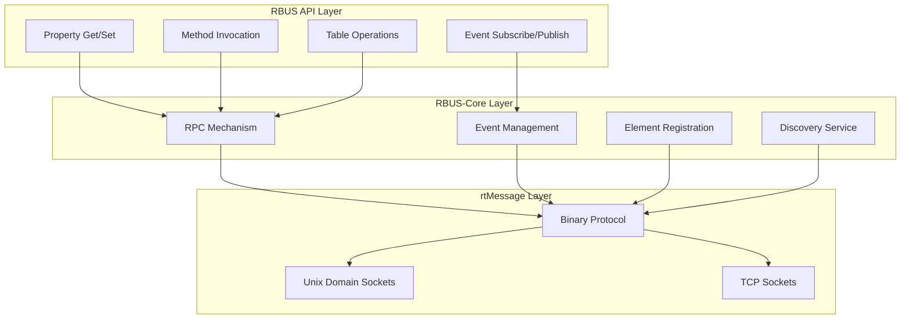
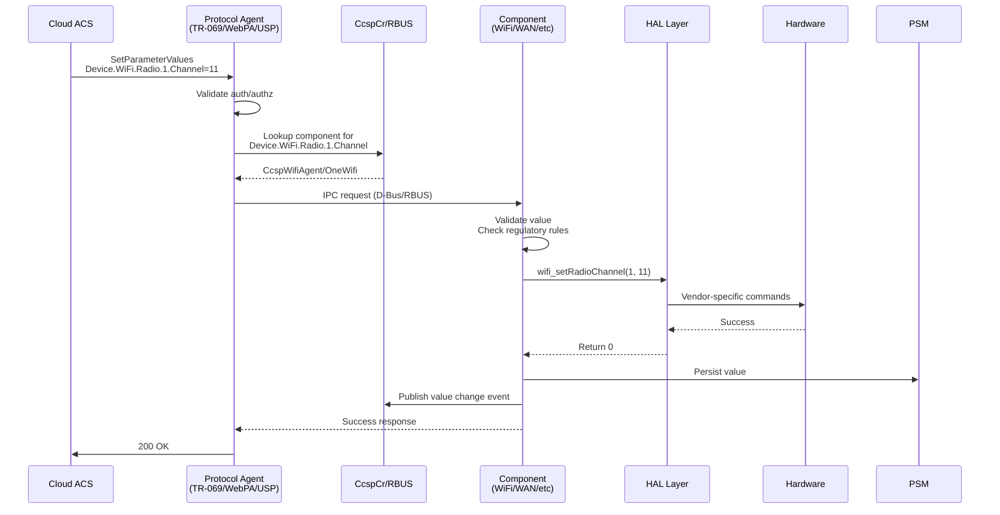
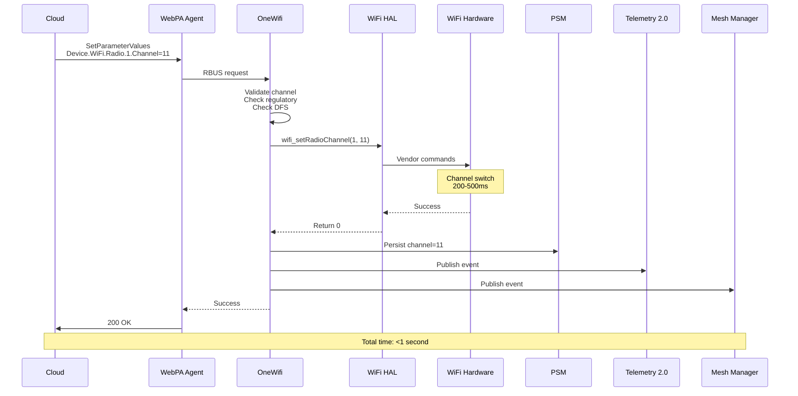
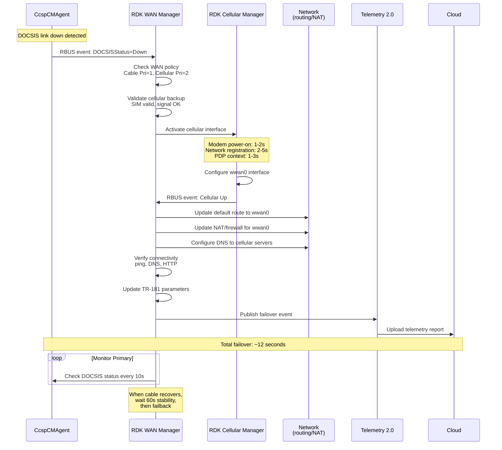
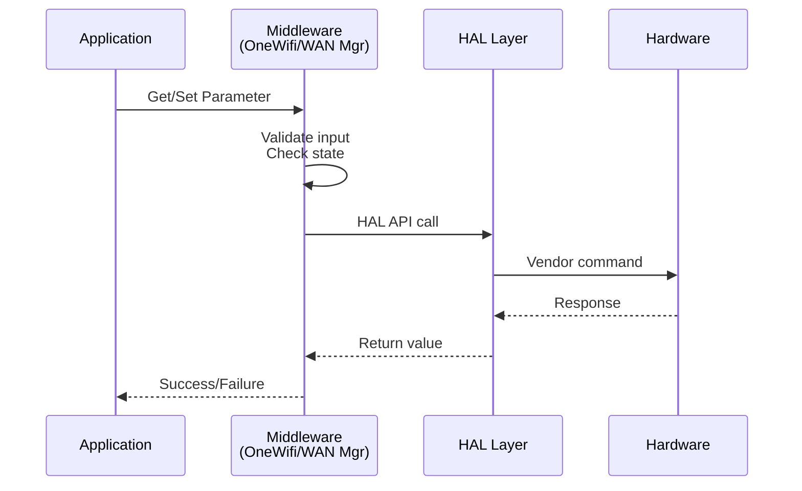
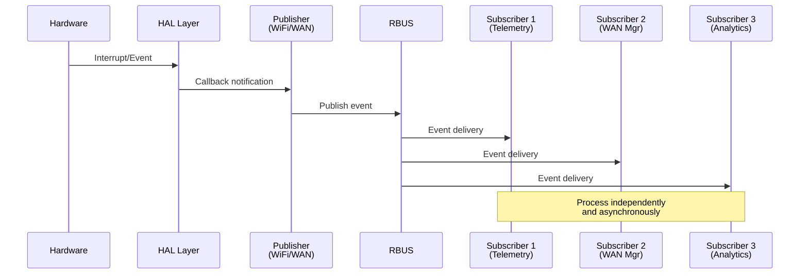
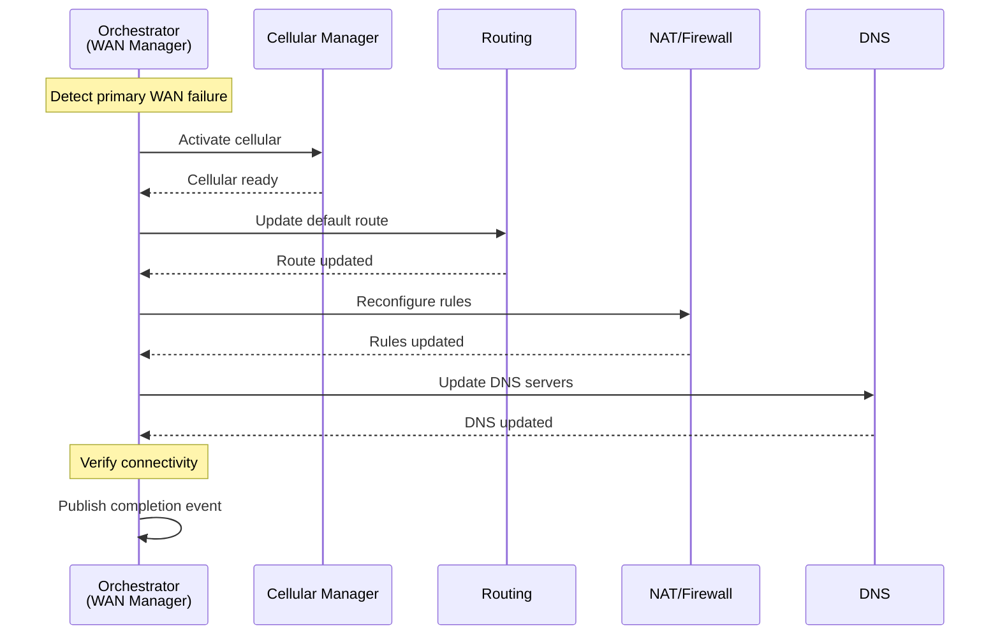

# RDK-B Architecture

## Table of Contents

1. [Overview](#overview)
2. [CCSP](#ccsp)
3. [CCSP Architecture](#ccsp-architecture)
4. [RDK Unified Components](#rdk-unified-components)
5. [Inter-Process Communication - RBUS](#inter-process-communication---rbus)
6. [TR-181 Data Model Integration](#tr-181-data-model-integration)
7. [Practical Use Cases](#practical-use-cases)
8. [Component Interactions](#component-interactions)

---

## Overview

RDK-B (Reference Design Kit for Broadband) is a standardized, open-source software stack designed for broadband devices including cable modems, DSL modems, routers, gateways, and extenders. It provides a common framework that enables service providers and device manufacturers to accelerate development, reduce costs, and ensure interoperability across diverse hardware platforms.

### Key Characteristics

- **Standardization**: Built on industry standards including TR-181 (Device Data Model), TR-069/TR-369 (remote management protocols), and DOCSIS specifications
- **Modularity**: Component-based architecture allows selective deployment and easy customization
- **Vendor Independence**: Hardware Abstraction Layer (HAL) isolates hardware-specific implementations from business logic
- **Open Source**: Community-driven development with contributions from major operators and vendors
- **Scalability**: Supports devices ranging from simple modems to complex whole-home WiFi systems

### Design Principles

- **Separation of Concerns**: Each layer has well-defined responsibilities
- **Abstraction**: HAL layer shields upper layers from hardware variations
- **Interoperability**: Standards-based interfaces enable component substitution
- **Extensibility**: Plugin architecture allows adding new features without core changes
- **Performance**: Optimized for resource-constrained embedded devices

### Architecture Organization

RDK-B organizes components based on their functionality and abstraction level. Components are grouped into functional categories that provide clear separation of concerns and facilitate development and maintenance. Communication between components is flexible, allowing direct interaction across categories as needed rather than enforcing strict hierarchical constraints.

#### **Application Layer**

The Application Layer hosts various applications that end users and operators interact with. Web applications provide browser-based interfaces for device configuration and monitoring, including local web UI for customer self-service and responsive designs for mobile and desktop access with real-time status dashboards. Operator applications are service provider-specific tools for network management, encompassing network diagnostics, Quality of Service (QoS) management, and customer premise equipment (CPE) provisioning capabilities. Third-party applications from external developers extend device functionality with features like parental controls, security services, and smart home integration. RDK also provides reference applications including WiFi analytics dashboards, performance monitoring tools, and development and testing utilities.

#### **Middleware Layer**

The Middleware Layer forms the core of RDK-B, containing business logic and management components organized into functional blocks:

**CCSP Components**: Legacy framework providing foundational services, backward compatibility with existing deployments, TR-181 data model implementation, and interoperability with legacy systems.

**RDK Unified Components**: Next-generation components designed for improved performance, reduced complexity, and native RBUS support, representing the future direction of RDK-B.

**Generic Open Source Components**: Standard Linux networking tools including IP Tables, IGMP Proxy, UPnP IGD, and Bridge Utils.

**RBUS/D-Bus IPC**: Communication backbone enabling component interaction. **RBUS** is the modern, high-performance message bus (preferred), while **D-Bus** is maintained for legacy compatibility.

**Remote Management**: Protocols and agents including TR-369 (USP), TR-069 (CWMP), WebPA, Webconfig, SNMP, SSH, and local WebUI.

**Device Management**: Core services including firmware upgrades, Telemetry 2.0, RFC (Remote Feature Control), log upload, crash upload, and log rotation.

#### **Hardware Abstraction Layer (HAL)**

The Hardware Abstraction Layer provides standardized, vendor-neutral interfaces enabling portability where the same middleware code runs on different chipsets, facilitating vendor competition by making it easy to switch hardware vendors, supporting parallel development where middleware and HAL teams work independently, and enabling testing through mock HAL implementations. Major HAL interfaces include **WiFi HAL**, **Ethernet HAL**, **DHCP V4/V6 HAL**, **XDSL HAL**, **MoCA HAL**, **Platform HAL**, **Cellular HAL**, **VLAN HAL**, **Voice HAL**, **MTA HAL**, **MSO HAL**, **FW Upgrade HAL**, and **DPOE HAL**.

#### **OSS Core Layer**

Built on the Yocto/OpenEmbedded Linux ecosystem, the OSS Core Layer provides system services, networking components, and application-level utilities. System management uses systemd for service orchestration and startup sequencing, dbus for legacy inter-process communication, and busybox for standard Unix utilities in embedded form. The network stack includes iptables for packet filtering and NAT, dnsmasq for DHCP and DNS services, Bridge Utils for Ethernet bridging, VLAN Utils for 802.1Q VLAN management, and Wireless Tools for WiFi interface control. Application services include libhostap for WiFi access point functionality, ModemManager for cellular modem control, UPnP for device discovery and port mapping, IGMP Proxy for multicast traffic forwarding, wget and curl for HTTP operations, Libqmi for Qualcomm modem interface, and Dibbler for DHCPv6 client and server functionality.

#### **Platform Layer**

The Platform Layer represents the hardware foundation providing kernel, drivers, bootloader, and vendor-specific implementations. The Linux kernel includes network device drivers for WiFi (mac80211 subsystem), Ethernet, and cellular modems, USB drivers for peripheral connectivity, flash storage drivers (MTD, UBI) for firmware and configuration storage, and hardware cryptographic accelerators for encryption offload. Bootloaders use U-Boot or vendor-specific implementations that handle hardware initialization, load kernel and device tree, and perform secure boot verification through cryptographic signature checking. Vendor libraries include SoC-specific implementations for hardware features, acceleration libraries for video codec and cryptographic operations, and proprietary WiFi drivers that supplement or replace open-source drivers. SoC support spans Broadcom (BCM63xx, BCM68xx), Qualcomm (IPQ series), Intel (Puma, Atom), and MediaTek (MT76xx) with Board Support Packages and reference designs provided by manufacturers.

### Detailed Architecture Diagram

The following diagram provides a detailed view of the RDK-B architecture, showing all components and their relationships:

---

## CCSP

**CCSP (Common Component Software Platform)** is a comprehensive framework developed as part of the RDK-B initiative to provide a standardized, component-based approach to implementing broadband device functionality. The framework provides standardized component interfaces, reference implementations, common libraries and utilities, and unified message bus communication.

### Design Approach

CCSP implements a component-based architecture where each functional domain (WiFi, Ethernet, provisioning, management) runs as an independent process with its own address space and lifecycle.

**Benefits of Process Isolation**:
- **Fault Isolation**: When a component crashes (e.g., WiFi agent segfault), other components continue operating. The system can restart the failed component without full reboot, maintaining services like WAN connectivity and remote management.
- **Independent Updates**: Components can be upgraded separately without recompiling the entire stack. Operators can deploy WiFi improvements without touching WAN or voice components, reducing regression risk and testing burden.
- **Resource Distribution**: In multi-core SoCs, the Linux scheduler distributes component processes across CPU cores. High-traffic components like WiFi or WAN can utilize separate cores, preventing CPU bottlenecks that would occur in a monolithic design.
- **Vendor Flexibility**: Service providers can replace specific components with proprietary implementations while keeping standard RDK components for other functions. For example, using a vendor-specific WiFi component while retaining standard TR-069 and provisioning components.

**Architectural Trade-offs**:
- **IPC Overhead**: D-Bus communication requires message serialization, context switching, and deserialization. Operations that would be function calls in monolithic design become IPC transactions, adding latency (typically 1-5ms per operation) and CPU overhead.
- **Complex Initialization**: Components must start in correct sequence with dependency management. CcspCr must start first, then components register in order based on dependencies, requiring orchestration logic and increasing boot time by 5-10 seconds compared to monolithic approaches.
- **Memory Footprint**: Each process requires separate address space with duplicated libraries (libc, TR-181 libraries, common utilities). A typical CCSP system with 10+ components may use 50-100MB more RAM than equivalent monolithic implementation.

**Key Characteristics**:
- **TR-181 Data Model**: Every manageable parameter follows Device:2 data model naming. Components expose parameters like Device.WiFi.Radio.{i}.Channel, enabling standardized access regardless of which component implements the functionality.
- **D-Bus Communication**: Original IPC mechanism using system or session bus. Components register D-Bus objects and interfaces, with method calls for parameter get/set operations and signals for event notifications.
- **Interface Separation**: Components separate data model interface (TR-181 parameter handlers) from business logic (actual WiFi configuration, packet processing). This allows changing internal implementation without affecting external API contracts.
- **Dynamic Registration**: Components register their supported TR-181 namespaces with CcspCr at startup, enabling runtime discovery and allowing flexible deployment where optional components can be included or omitted based on device capabilities.

---

## CCSP Architecture

### Core Components

The CCSP framework relies on several foundational components that provide infrastructure services used by all other components. These components handle component registration and discovery, parameter persistence, common library functions, and device-level management. Without these core services, functional components like WiFi or WAN agents cannot operate.

**CcspCr (Component Registrar)**: Acts as the central registry where components announce their presence and capabilities at startup. CcspCr maintains a mapping of TR-181 namespaces to component names (e.g., Device.WiFi.* → CcspWifiAgent), performs health monitoring through periodic heartbeat checks, provides discovery services allowing components to locate each other without hardcoded dependencies, and supports namespace conflict resolution when multiple components claim the same parameters.

**CcspPandM (Protocol and Management)**: Manages device-level operations including device provisioning (first boot configuration, factory reset handling), parameter management for Device.DeviceInfo.* (manufacturer, model, serial number), Device.Time.* (NTP configuration, timezone), and Device.UserInterface.* (web UI settings). CcspPandM acts as the TR-181 gateway receiving requests from TR-069 client or WebPA agent and routing them to appropriate components based on CcspCr lookups.

**CcspPsm (Persistent Storage Manager)**: Provides database services using XML files or SQLite for parameter storage with in-memory cache for fast access. PSM handles parameter persistence ensuring configuration survives reboots, backup and restore operations for disaster recovery, and transaction support for atomic multi-parameter updates.

**CcspCommonLibrary**: Offers shared libraries that simplify D-Bus operations, providing wrapper functions that hide D-Bus complexity, data model framework with TR-181 type conversions, component infrastructure for registration and message handling, and utility functions for logging, memory management, and string operations.

### Key Components

**CcspWifiAgent**: Manages Device.WiFi.* namespace covering radio configuration (channel, bandwidth, transmit power), SSID management supporting up to 16 SSIDs per radio, security settings (WPA2/WPA3, encryption), and client management (association, steering, statistics).

**CcspEthAgent**: Handles Device.Ethernet.* for wired interfaces including link state monitoring, statistics collection (bytes, packets, errors), port configuration, and VLAN tagging.

**CcspCMAgent**: Manages cable modem functionality (Device.X_CISCO_COM_CableModem.*) providing DOCSIS status, downstream/upstream channel information, signal quality metrics (SNR, power levels), and cable diagnostics.

**CcspLMLite**: Implements Device.Hosts.* for LAN device discovery through ARP and DHCP monitoring, device tracking with MAC and IP addresses, and network topology mapping.

**CcspDmCli**: Command-line tool for TR-181 operations enabling parameter get/set, table operations, component discovery, and debugging during development.

### Message Flow Example

When changing a WiFi channel through WebPA, the cloud server sends an HTTPS POST to WebPA Agent with parameter name and value. WebPA Agent queries CcspCr to find the owner (CcspWifiAgent), then sends a D-Bus setParameterValues request. CcspWifiAgent validates the channel against regulatory rules and radio state, invokes wifi_setRadioChannel() in WiFi HAL which translates to vendor commands, persists the value through PSM, publishes a D-Bus event, and returns success.

---

## RDK Unified Components

To address CCSP's limitations and modernize the RDK-B architecture, RDK Unified Components were developed as next-generation middleware designed for better performance, simpler design, and native RBUS support. These components provide direct HAL access reducing layers between component and hardware, RBUS optimization delivering 10-100x faster performance than D-Bus for many operations, asynchronous design with non-blocking I/O preventing stalls, and efficient memory usage through shared libraries instead of separate processes where appropriate.

The architecture emphasizes simplicity through fewer components via consolidation, cleaner APIs using modern C++ interfaces with less boilerplate, better documentation with comprehensive API docs and examples, and easier debugging through streamlined code paths. Modularity is achieved through plugin architecture where features can be added as loadable modules, runtime configuration to enable/disable features without recompilation, clear dependency management, and version compatibility with backward compatibility layers.

### Major Components

**OneWifi**: Replaces CcspWifiAgent, CcspHotspot, and vendor WiFi managers with single unified component. Manages all radios and SSIDs from one process, supports WiFi 6/6E features (OFDMA, TWT, BSS coloring, WPA3), implements client steering across 2.4GHz/5GHz/6GHz bands, and provides mesh networking. Performance: 50% less memory, 10x faster parameter queries via RBUS.

**RDK WAN Manager**: Manages WAN interfaces (Ethernet, DOCSIS, DSL, GPON, LTE, PPPoE) with multi-WAN support. Implements automatic failover under 5 seconds using ping/HTTP/DNS health checks, load balancing across connections, and policy-based routing for application-aware decisions.

**RDK VLAN Bridge Manager**: Configures VLANs and bridges for service segmentation (IPTV, VoIP, data, guest networks, IoT). Supports 802.1Q tagging, QinQ nested VLANs, dynamic creation, and service-to-VLAN mapping.

**RDK GPON Manager**: Controls GPON/EPON optical interfaces for fiber broadband. Manages ONU/ONT operations (optical signal monitoring, ranging, registration, power control), OMCI protocol, and service provisioning from OLT.

**RDK PPP Manager**: Establishes PPPoE/PPPoA connections with PAP/CHAP/MS-CHAP authentication, dynamic IP and DNS configuration, automatic reconnection on failure, and support for VLAN-tagged sessions.

**RDK Telco Voice Manager**: Manages VoIP services including SIP registration, codec handling (G.711, G.729, G.722), call features (waiting, forwarding, caller ID), RTP/SRTP media with QoS, and FXS/FXO port control.

**RDK Cellular Manager-MM**: Controls LTE/5G modems for WAN connectivity. Handles modem power and firmware, SIM operations (PIN/PUK, eSIM), network registration (2G/3G/LTE/5G), PDP context activation, and data usage tracking.

---

## Inter-Process Communication - RBUS

RBUS is RDK's IPC solution designed for embedded broadband devices, replacing D-Bus to address performance and complexity issues. RBUS uses a three-layer architecture: the RBUS API Layer provides TR-181-aligned APIs for properties, methods, events, and table operations; the RBUS-Core Layer handles RPC, event publish/subscribe, registration, and discovery; and the rtMessage Layer provides lightweight binary protocol over Unix domain sockets or TCP.

Performance: rtMessage delivers 10-100x faster operations than D-Bus with under 100µs latency, less than 100 bytes overhead per message, zero-copy where possible, and non-blocking I/O. The protocol uses direct point-to-point communication without central daemon, eliminating D-Bus's bottleneck.

### Key Features

**Performance**: Benchmarks show 10-100x faster get operations, 15-80x faster set operations, and 20-150x faster event notifications compared to D-Bus. Achieved through direct point-to-point communication, zero-copy where possible, optimized binary protocol, and default asynchronous operations.

**Event-Driven**: Value change notifications automatically update subscribers when parameters change, eliminating polling. Wildcard subscriptions support patterns ("Device.WiFi.Radio.*.Enable") and namespace matching ("Device.WiFi.**"). Event filtering delivers only events matching specified criteria.

**Simplified API**: Multi-step D-Bus operations become single function calls. APIs align with TR-181 where parameters map to properties, objects have methods, events signal changes, and table operations are built-in.

**Persistent Subscriptions**: Providers cache subscription information to disk. On restart, subscriptions automatically restore without consumer action, preventing lost notifications.

**RBUS CLI (rbuscli)**: Interactive tool for testing and debugging with operations for property get/set, event subscription, method invocation, element discovery, and event logging.

### Operation Types

**Property Management**: Get and set parameter values, subscribe to value changes, receive change notifications. Used for configuration and status monitoring.

**Method Invocation**: Remote procedure calls between components for triggering actions, executing multi-step operations, and transaction-style changes.

**Event Subscription**: Publish/subscribe pattern supporting general events (triggered on subscription) and value change events (automatic on parameter change). Used for state monitoring, action triggering, telemetry collection, and component coordination.

**Table Row Operations**: Manage TR-181 multi-instance objects (WiFi SSIDs, DHCP leases, firewall rules, VLANs) with add, delete, query, and handler registration operations.

---

## TR-181 Data Model Integration

TR-181 (Device Data Model for TR-069) is the Broadband Forum specification defining a standardized, hierarchical data model for broadband CPE devices. Benefits include vendor interoperability using consistent parameter names, protocol independence (TR-069, TR-369, WebPA, SNMP, CLI all use same model), extensible architecture for new technologies, and operational efficiency using common tools across device fleets.

**Structure**:
- **Objects**: Containers grouping related parameters (Device.WiFi., Device.WiFi.Radio.{i}.)
- **Parameters**: Individual data values with types (Device.WiFi.Radio.1.Channel as int, Device.WiFi.Radio.1.Enable as boolean)
- **Multi-instance Objects**: Tables denoted by {i} with numbered instances (Device.WiFi.SSID.{i}. → Device.WiFi.SSID.1., Device.WiFi.SSID.2.)
- **Commands**: Executable operations (Device.WiFi.Radio.1.Reset(), Device.Reboot())

**Data Types**: string, int (32-bit signed), unsignedInt (32-bit unsigned), boolean, dateTime (ISO 8601), base64, long (64-bit signed), unsignedLong (64-bit unsigned)

**Component Ownership**:
- CcspPandM: Device.DeviceInfo.*, Device.Time.*, Device.UserInterface.*, Device.Users.*
- OneWifi/CcspWifiAgent: Device.WiFi.*
- CcspEthAgent: Device.Ethernet.*
- RDK WAN Manager: Device.X_RDK_WanManager.*, coordinates WAN interfaces
- RDK VLAN Bridge Manager: Device.X_RDK_Vlan.*
- RDK GPON Manager: Device.X_RDK_PON.*
- RDK Cellular Manager: Device.Cellular.*

### TR-181 Request Flow

**Flow Steps**:
1. **Request Initiation**: Cloud ACS sends RPC via TR-069 (SOAP/HTTP), TR-369 (USP/MQTT), or WebPA (HTTPS)
2. **Protocol Agent**: Receives request, validates authentication and authorization, extracts parameter path and value
3. **Namespace Resolution**: For CCSP, CcspCr queries component ownership; RBUS has built-in discovery
4. **IPC Communication**: Marshal parameter and value, route to owning component via D-Bus or RBUS
5. **Component Processing**: Validate input against state and regulatory rules, prepare HAL call
6. **HAL Invocation**: Execute standardized vendor-neutral API, translate to chipset-specific commands
7. **Hardware Execution**: Driver sends commands to chip, firmware executes changes
8. **Response**: Component receives HAL confirmation, updates state, publishes event, persists via PSM, returns success to agent, agent confirms to cloud

---

## Practical Use Cases

### WiFi Channel Change via Cloud

When operators detect interference affecting customer devices, they remotely change WiFi channels through cloud management. The cloud sends a SetParameterValues request via WebPA or TR-069 with the new channel (Device.WiFi.Radio.1.Channel = 11). **WebPA Agent** routes the request via **RBUS** to **OneWifi** (or **CcspWifiAgent** in legacy systems). OneWifi validates channel validity for the frequency band, regulatory compliance, radio state, and DFS restrictions.

After validation, OneWifi calls wifi_setRadioChannel() in WiFi HAL, translating to vendor-specific commands for Broadcom, Qualcomm, Intel, or MediaTek chipsets. The driver and firmware perform the channel switch in 200-500ms with 100-300ms for client reassociation, totaling under 1 second interruption. OneWifi persists the configuration through **PSM**, publishes RBUS events to **Telemetry 2.0** (records change), **WiFi Analytics** (updates tracking), and **Mesh Manager** (coordinates mesh nodes), then returns success to WebPA Agent which confirms to cloud.

### WAN Interface Failover

When a primary DOCSIS connection fails, the RDK-B gateway automatically switches to LTE backup. **CcspCMAgent** detects DOCSIS link down within 2 seconds and publishes RBUS event (Device.X_CISCO_COM_CableModem.DOCSISStatus = "Down"). **RDK WAN Manager** receives the event, retrieves WAN policy from PSM (Cable Priority 1, Cellular Priority 2 with AUTO failover), and validates cellular backup (SIM validity, signal strength, regulatory status, data plan).

WAN Manager invokes **RDK Cellular Manager** via RBUS to activate cellular. Cellular Manager powers on modem (1-2s), performs network registration with LTE band scanning (2-5s), and establishes PDP context with carrier gateway (1-3s), totaling 4-10 seconds. After receiving IP configuration (carrier-grade NAT IP, gateway, DNS, MTU), Cellular Manager configures wwan0 interface and publishes "Cellular Up" event.

WAN Manager reconfigures the system: updates routing (default route to wwan0), updates NAT/firewall rules (MASQUERADE for wwan0), and configures DNS forwarder for cellular servers. After connectivity verification (ping, DNS, HTTP), WAN Manager updates TR-181 parameters, persists configuration via PSM, and publishes failover events. **Telemetry 2.0** uploads event report to cloud for dashboard updates and SLA tracking. Total failover time: ~12 seconds (within <60s SLA).

WAN Manager monitors primary cable every 10 seconds. On recovery, it verifies 60-second stability before automatic failback to the preferred lower-cost, higher-speed cable connection.

---

## Component Interactions

RDK-B components interact using patterns that balance performance, maintainability, and system complexity. Three primary patterns govern component communication.

### Request-Response Pattern

Synchronous, top-down pattern for simple get/set operations. Requests flow from application through middleware (business logic, validation) to HAL (hardware abstraction) to platform (vendor implementation). Caller blocks waiting for response.

**Advantages**: Simple and predictable, synchronous error handling, easy debugging with clear call stacks

**Limitations**: Blocking operations delay caller, no notification of later changes, timeout risk on slow operations

**Use Cases**: Configuration queries, single parameter updates, status reads that complete in <100ms

### Event-Driven Pattern

Asynchronous publish/subscribe pattern where producers publish events and multiple consumers react independently. Hardware events flow from driver through HAL to middleware, which publishes RBUS events received by subscribers (Telemetry, WAN Manager, Analytics).

**Advantages**: Loose coupling (publishers unaware of subscribers), multiple consumers without producer overhead, asynchronous and non-blocking, scales with additional subscribers

**Limitations**: No delivery guarantee without acknowledgment, event ordering not guaranteed across publishers, debugging harder due to asynchronous flow

**Use Cases**: WiFi client association/disassociation, WAN link up/down events, DHCP lease changes, system alarms, real-time telemetry

### Orchestration Pattern

Coordinated multi-component operation where one component orchestrates actions across multiple others. Example: WAN failover requires WAN Manager to coordinate cellular activation, routing updates, NAT reconfiguration, and DNS changes in specific sequence.

**Advantages**: Central coordination ensures correct sequencing, easier to implement complex business logic, enables transaction-like semantics with rollback

**Limitations**: Orchestrator is single point of failure, creates tight coupling to orchestrator, complexity increases with transaction size

**Use Cases**: Multi-step WAN failover, firmware upgrade (download, verify, backup, flash, reboot), factory reset (stop services, clear config, reboot), network mode switching (router to bridge mode)

---